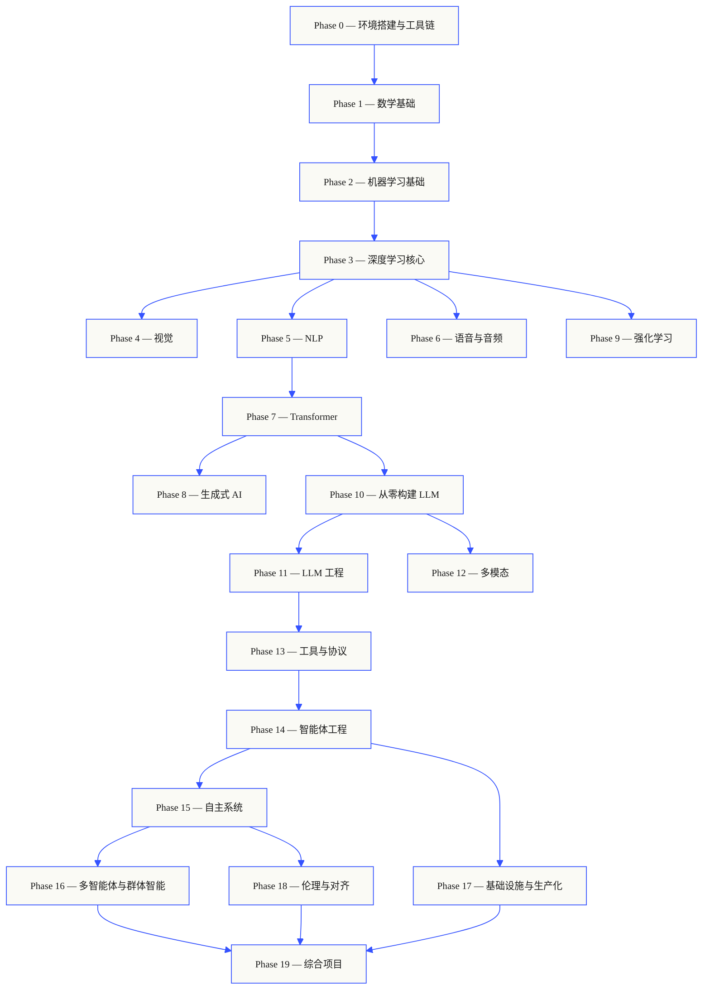
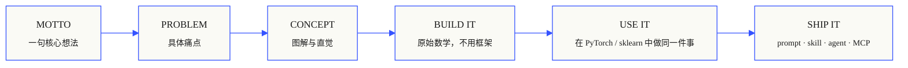

<p align="center">
  
</p>

<p align="center">
  <a href="LICENSE"></a>
  <a href="ROADMAP.md"></a>
  <a href="#contents"></a>
  <a href="https://github.com/rohitg00/ai-engineering-from-scratch/stargazers"></a>
  <a href="https://aiengineeringfromscratch.com"></a>
</p>

## 来自 [Agent Memory - #1 Persistent memory ⭐](https://github.com/rohitg00/agentmemory) <a href="https://github.com/rohitg00/agentmemory/stargazers"></a> 的作者；它天然适配各种智能体与聊天助手。

```text
░░░▒▒▒░░░▒▒▒░░░▒▒▒░░░▒▒▒░░░▒▒▒░░░▒▒▒░░░▒▒▒░░░▒▒▒░░░▒▒▒░░░▒▒▒░░░▒▒▒░░░▒▒▒░░░▒▒▒░░░▒▒▒░░░▒▒▒
```

> **84% 的学生已经在使用 AI 工具，但只有 18% 觉得自己能专业地使用它们。**
> 这套课程就是为了补上这段距离。
>
> 503 lessons. 20 phases. ~320 hours. Python, TypeScript, Rust, Julia. Every lesson ships
> a reusable artifact: a prompt, a skill, an agent, an MCP server. Free, open source, MIT.
>
> 你不只是学习 AI。你会端到端、亲手把它构建出来。

<!-- STATS:START (generated from site/stats.json by build.js — do not edit by hand) -->
<p align="center"><sub><b>150,639</b> readers &nbsp;·&nbsp; <b>241,669</b> page views in the last 30 days &nbsp;·&nbsp; as of 2026-06-07</sub></p>
<!-- STATS:END -->

## 它如何运作

大多数 AI 资料都很零散：这里一篇论文，那里一篇微调博客，别处又是一个炫目的
智能体演示。这些碎片很少真正接起来。你可能能交付一个聊天机器人，却解释不了
它的损失曲线；你可能能给智能体接上一个函数，却说不清调用它的模型内部 attention
到底在做什么。

This curriculum is the spine. 20 phases, 503 lessons, four languages: Python, TypeScript,
Rust, Julia. 一端是线性代数，另一端是自主群体系统。每个算法都先从原始数学手写出来：
反向传播、tokenizer、attention、智能体循环。等 PyTorch 登场时，你已经知道它在底层做什么。

每节课都走同一个闭环：读懂问题，推导数学，写出代码，运行测试，留下产物。
没有五分钟速成视频，没有复制粘贴式部署，也没有过度扶手。免费、开源，并且设计成能在
你自己的笔记本上跑起来。

```text
░░░▒▒▒░░░▒▒▒░░░▒▒▒░░░▒▒▒░░░▒▒▒░░░▒▒▒░░░▒▒▒░░░▒▒▒░░░▒▒▒░░░▒▒▒░░░▒▒▒░░░▒▒▒░░░▒▒▒░░░▒▒▒░░░▒▒▒
```

## 课程结构

20 个阶段层层递进。数学是地基，智能体与生产化是屋顶。如果你已经掌握底层内容，可以跳到后面；
但不要跳过基础之后，又惊讶于高层系统为什么会坏。



```text
░░░▒▒▒░░░▒▒▒░░░▒▒▒░░░▒▒▒░░░▒▒▒░░░▒▒▒░░░▒▒▒░░░▒▒▒░░░▒▒▒░░░▒▒▒░░░▒▒▒░░░▒▒▒░░░▒▒▒░░░▒▒▒░░░▒▒▒
```

## 一节课长什么样

每节课都放在自己的目录里，整套课程保持同一种结构：

```text
phases/<NN>-<phase-name>/<NN>-<lesson-name>/
├── code/      可运行实现（Python、TypeScript、Rust、Julia）
├── docs/
│   └── en.md  课程讲解
└── outputs/   本课产出的 prompt、skill、agent 或 MCP server
```

每节课都遵循六个节拍。*Build It / Use It* 是骨架：先从零实现算法，再用生产级库跑同一件事。
你会理解框架在做什么，因为你已经亲手写过那个更小、更透明的版本。



## 开始学习

三种进入方式，选一种就能开始。

**路线 A — 阅读。** 打开 [aiengineeringfromscratch.com](https://aiengineeringfromscratch.com)
上的任意已完成课程，或在[目录](#contents)中展开某个阶段。不需要配置环境，也不需要 clone。

**路线 B — clone 后运行。**

```bash
git clone https://github.com/rohitg00/ai-engineering-from-scratch.git
cd ai-engineering-from-scratch
python phases/01-math-foundations/01-linear-algebra-intuition/code/vectors.py
```

**路线 C — 找到你的起点（推荐）。** 智能地跳到合适位置。在 Claude、Cursor、Codex、
OpenClaw、Hermes，或任何已安装课程 skills 的智能体里运行：

```bash
/find-your-level
```

10 道题会把你的当前知识映射到起始阶段，并生成带时间估算的个性化路线。每完成一个阶段后：

```bash
/check-understanding 3        # 检查自己对 Phase 3 的理解
ls phases/03-deep-learning-core/05-loss-functions/outputs/
# ├── prompt-loss-function-selector.md
# └── prompt-loss-debugger.md
```

### 前置要求

- 你会写代码（任何语言都可以，会 Python 更方便）。
- 你想理解 AI **到底如何工作**，而不只是调用 API。

### 内置智能体 skills（Claude、Cursor、Codex、OpenClaw、Hermes）

| Skill | 作用 |
|---|---|
| [`/find-your-level`](.claude/skills/find-your-level/SKILL.md) | 10 题定位测验。把你的知识水平映射到起始阶段，并生成带时间估算的个性化路线。 |
| [`/check-understanding <phase>`](.claude/skills/check-understanding/SKILL.md) | 每阶段 8 题测验，给出反馈和需要回看的具体课程。 |

```text
░░░▒▒▒░░░▒▒▒░░░▒▒▒░░░▒▒▒░░░▒▒▒░░░▒▒▒░░░▒▒▒░░░▒▒▒░░░▒▒▒░░░▒▒▒░░░▒▒▒░░░▒▒▒░░░▒▒▒░░░▒▒▒░░░▒▒▒
```

## 每节课都会交付一个东西

其他课程常以“恭喜，你学会了 X”结束。这里的每节课都会以一个可安装、可粘贴进日常工作流的
**可复用工具**结束。

<table>
<tr>
<th align="left" width="25%"><br/><sub>FIG_001 · A</sub><br/><b>PROMPTS / 提示词</b></th>
<th align="left" width="25%"><br/><sub>FIG_001 · B</sub><br/><b>SKILLS / 技能</b></th>
<th align="left" width="25%"><br/><sub>FIG_001 · C</sub><br/><b>AGENTS / 智能体</b></th>
<th align="left" width="25%"><br/><sub>FIG_001 · D</sub><br/><b>MCP SERVERS / MCP 服务器</b></th>
</tr>
<tr>
<td valign="top">粘贴到任意 AI 助手里，让它在一个窄任务上提供专家级帮助。</td>
<td valign="top">放进 Claude、Cursor、Codex、OpenClaw、Hermes，或任何读取 <code>SKILL.md</code> 的智能体。</td>
<td valign="top">部署成自主 worker：你会在 Phase 14 亲手写出它的循环。</td>
<td valign="top">接入任意 MCP 兼容客户端。它会在 Phase 13 端到端构建。</td>
</tr>
</table>

> 用 `python3 scripts/install_skills.py` 一次装好整套产物。它们是真工具，不是作业。
> By the end of the curriculum, you have a portfolio of 503 artifacts you actually
> understand because you built them.

### FIG_002 · 一个完整样例

Phase 14，第 1 课：智能体循环。约 120 行纯 Python，无依赖。

<table>
<tr>
<td valign="top" width="50%">

**`code/agent_loop.py`** &nbsp; <sub><i>build it / 构建它</i></sub>

```python
def run(query, tools):
    history = [user(query)]
    for step in range(MAX_STEPS):
        msg = llm(history)
        if msg.tool_calls:
            for call in msg.tool_calls:
                result = tools[call.name](**call.args)
                history.append(tool_result(call.id, result))
            continue
        return msg.content
    raise StepLimitExceeded
```

</td>
<td valign="top" width="50%">

**`outputs/skill-agent-loop.md`** &nbsp; <sub><i>ship it / 交付它</i></sub>

```markdown
---
name: agent-loop
description: ReAct-style loop for any tool list
phase: 14
lesson: 01
---

实现一个最小智能体循环，能够...
```

**`outputs/prompt-debug-agent.md`**

```markdown
你是一个智能体调试器。给定一次
智能体运行 trace，请找出它出错的
步骤，并解释原因...
```

</td>
</tr>
</table>

```text
░░░▒▒▒░░░▒▒▒░░░▒▒▒░░░▒▒▒░░░▒▒▒░░░▒▒▒░░░▒▒▒░░░▒▒▒░░░▒▒▒░░░▒▒▒░░░▒▒▒░░░▒▒▒░░░▒▒▒░░░▒▒▒░░░▒▒▒
```

<a id="contents"></a>

## 目录

20 个阶段。点击任意阶段即可展开课程列表。

<a id="phase-0"></a>
### Phase 0: 环境搭建与工具链 `12 lessons`
> 为后续所有内容准备本地环境、工具链和基本习惯。

| # | Lesson 课程 | Type 类型 | Lang 语言 |
|:---:|--------|:----:|------|
| 01 | [开发环境](phases/00-setup-and-tooling/01-dev-environment/) | Build | Python |
| 02 | [Git 与协作](phases/00-setup-and-tooling/02-git-and-collaboration/) | Learn | — |
| 03 | [GPU 配置与云端](phases/00-setup-and-tooling/03-gpu-setup-and-cloud/) | Build | Python |
| 04 | [API 与密钥](phases/00-setup-and-tooling/04-apis-and-keys/) | Build | Python |
| 05 | [Jupyter 笔记本](phases/00-setup-and-tooling/05-jupyter-notebooks/) | Build | Python |
| 06 | [Python 环境](phases/00-setup-and-tooling/06-python-environments/) | Build | Shell |
| 07 | [面向 AI 的 Docker](phases/00-setup-and-tooling/07-docker-for-ai/) | Build | Docker |
| 08 | [编辑器设置](phases/00-setup-and-tooling/08-editor-setup/) | Build | — |
| 09 | [数据管理](phases/00-setup-and-tooling/09-data-management/) | Build | Python |
| 10 | [终端与 Shell](phases/00-setup-and-tooling/10-terminal-and-shell/) | Learn | — |
| 11 | [面向 AI 的 Linux](phases/00-setup-and-tooling/11-linux-for-ai/) | Learn | — |
| 12 | [调试与性能分析](phases/00-setup-and-tooling/12-debugging-and-profiling/) | Build | Python |

<details id="phase-1">
<summary><b>Phase 1 — 数学基础</b> &nbsp;<code>22 lessons</code>&nbsp; <em>用代码建立每个 AI 算法背后的直觉。</em></summary>
<br/>

| # | Lesson 课程 | Type 类型 | Lang 语言 |
|:---:|--------|:----:|------|
| 01 | [线性代数直觉](phases/01-math-foundations/01-linear-algebra-intuition/) | Learn | Python, Julia |
| 02 | [向量、矩阵与运算](phases/01-math-foundations/02-vectors-matrices-operations/) | Build | Python, Julia |
| 03 | [矩阵变换](phases/01-math-foundations/03-matrix-transformations/) | Build | Python, Julia |
| 04 | [面向机器学习的微积分](phases/01-math-foundations/04-calculus-for-ml/) | Learn | Python |
| 05 | [链式法则与自动微分](phases/01-math-foundations/05-chain-rule-and-autodiff/) | Build | Python |
| 06 | [概率与分布](phases/01-math-foundations/06-probability-and-distributions/) | Learn | Python |
| 07 | [贝叶斯定理](phases/01-math-foundations/07-bayes-theorem/) | Build | Python |
| 08 | [优化](phases/01-math-foundations/08-optimization/) | Build | Python |
| 09 | [信息论](phases/01-math-foundations/09-information-theory/) | Learn | Python |
| 10 | [降维](phases/01-math-foundations/10-dimensionality-reduction/) | Build | Python |
| 11 | [奇异值分解](phases/01-math-foundations/11-singular-value-decomposition/) | Build | Python, Julia |
| 12 | [张量操作](phases/01-math-foundations/12-tensor-operations/) | Build | Python |
| 13 | [数值稳定性](phases/01-math-foundations/13-numerical-stability/) | Build | Python |
| 14 | [范数与距离](phases/01-math-foundations/14-norms-and-distances/) | Build | Python |
| 15 | [面向机器学习的统计学](phases/01-math-foundations/15-statistics-for-ml/) | Build | Python |
| 16 | [采样方法](phases/01-math-foundations/16-sampling-methods/) | Build | Python |
| 17 | [线性系统](phases/01-math-foundations/17-linear-systems/) | Build | Python |
| 18 | [凸优化](phases/01-math-foundations/18-convex-optimization/) | Build | Python |
| 19 | [面向 AI 的复数](phases/01-math-foundations/19-complex-numbers/) | Learn | Python |
| 20 | [傅里叶变换](phases/01-math-foundations/20-fourier-transform/) | Build | Python |
| 21 | [面向机器学习的图论](phases/01-math-foundations/21-graph-theory/) | Build | Python |
| 22 | [随机过程](phases/01-math-foundations/22-stochastic-processes/) | Learn | Python |

</details>

<details id="phase-2">
<summary><b>Phase 2 — 机器学习基础</b> &nbsp;<code>18 lessons</code>&nbsp; <em>经典机器学习仍然是多数生产 AI 的骨架。</em></summary>
<br/>

| # | Lesson 课程 | Type 类型 | Lang 语言 |
|:---:|--------|:----:|------|
| 01 | [什么是机器学习](phases/02-ml-fundamentals/01-what-is-machine-learning/) | Learn | Python |
| 02 | [线性回归](phases/02-ml-fundamentals/02-linear-regression/) | Build | Python |
| 03 | [逻辑回归](phases/02-ml-fundamentals/03-logistic-regression/) | Build | Python |
| 04 | [决策树与随机森林](phases/02-ml-fundamentals/04-decision-trees/) | Build | Python |
| 05 | [支持向量机](phases/02-ml-fundamentals/05-support-vector-machines/) | Build | Python |
| 06 | [K 近邻与距离](phases/02-ml-fundamentals/06-knn-and-distances/) | Build | Python |
| 07 | [无监督学习](phases/02-ml-fundamentals/07-unsupervised-learning/) | Build | Python |
| 08 | [特征工程与选择](phases/02-ml-fundamentals/08-feature-engineering/) | Build | Python |
| 09 | [模型评估](phases/02-ml-fundamentals/09-model-evaluation/) | Build | Python |
| 10 | [偏差-方差权衡](phases/02-ml-fundamentals/10-bias-variance/) | Learn | Python |
| 11 | [集成方法](phases/02-ml-fundamentals/11-ensemble-methods/) | Build | Python |
| 12 | [超参数调优](phases/02-ml-fundamentals/12-hyperparameter-tuning/) | Build | Python |
| 13 | [机器学习流水线](phases/02-ml-fundamentals/13-ml-pipelines/) | Build | Python |
| 14 | [朴素贝叶斯](phases/02-ml-fundamentals/14-naive-bayes/) | Build | Python |
| 15 | [时间序列基础](phases/02-ml-fundamentals/15-time-series/) | Build | Python |
| 16 | [异常检测](phases/02-ml-fundamentals/16-anomaly-detection/) | Build | Python |
| 17 | [处理不平衡数据](phases/02-ml-fundamentals/17-imbalanced-data/) | Build | Python |
| 18 | [特征选择](phases/02-ml-fundamentals/18-feature-selection/) | Build | Python |

</details>

<details id="phase-3">
<summary><b>Phase 3 — 深度学习核心</b> &nbsp;<code>13 lessons</code>&nbsp; <em>从第一性原理理解神经网络；先自己构建，再使用框架。</em></summary>
<br/>

| # | Lesson 课程 | Type 类型 | Lang 语言 |
|:---:|--------|:----:|------|
| 01 | [感知机](phases/03-deep-learning-core/01-the-perceptron/) | Build | Python |
| 02 | [多层网络与前向传播](phases/03-deep-learning-core/02-multi-layer-networks/) | Build | Python |
| 03 | [从零实现反向传播](phases/03-deep-learning-core/03-backpropagation/) | Build | Python |
| 04 | [激活函数](phases/03-deep-learning-core/04-activation-functions/) | Build | Python |
| 05 | [损失函数](phases/03-deep-learning-core/05-loss-functions/) | Build | Python |
| 06 | [优化器](phases/03-deep-learning-core/06-optimizers/) | Build | Python |
| 07 | [正则化](phases/03-deep-learning-core/07-regularization/) | Build | Python |
| 08 | [权重初始化与训练稳定性](phases/03-deep-learning-core/08-weight-initialization/) | Build | Python |
| 09 | [学习率调度与 Warmup](phases/03-deep-learning-core/09-learning-rate-schedules/) | Build | Python |
| 10 | [构建你自己的迷你框架](phases/03-deep-learning-core/10-mini-framework/) | Build | Python |
| 11 | [PyTorch 入门](phases/03-deep-learning-core/11-intro-to-pytorch/) | Build | Python |
| 12 | [JAX 入门](phases/03-deep-learning-core/12-intro-to-jax/) | Build | Python |
| 13 | [调试神经网络](phases/03-deep-learning-core/13-debugging-neural-networks/) | Build | Python |

</details>

<details id="phase-4">
<summary><b>Phase 4 — 计算机视觉</b> &nbsp;<code>28 lessons</code>&nbsp; <em>从像素走向理解：图像、视频、3D、VLM 与世界模型。</em></summary>
<br/>

| # | Lesson 课程 | Type 类型 | Lang 语言 |
|:---:|--------|:----:|------|
| 01 | [图像基础 — 像素、通道、色彩空间](phases/04-computer-vision/01-image-fundamentals/) | Learn | Python |
| 02 | [从零实现卷积](phases/04-computer-vision/02-convolutions-from-scratch/) | Build | Python |
| 03 | [CNNs — 从 LeNet 到 ResNet](phases/04-computer-vision/03-cnns-lenet-to-resnet/) | Build | Python |
| 04 | [图像分类](phases/04-computer-vision/04-image-classification/) | Build | Python |
| 05 | [Transfer Learning 与 Fine-Tuning](phases/04-computer-vision/05-transfer-learning/) | Build | Python |
| 06 | [Object Detection — 从零实现 YOLO](phases/04-computer-vision/06-object-detection-yolo/) | Build | Python |
| 07 | [语义分割：U-Net](phases/04-computer-vision/07-semantic-segmentation-unet/) | Build | Python |
| 08 | [实例分割：Mask R-CNN](phases/04-computer-vision/08-instance-segmentation-mask-rcnn/) | Build | Python |
| 09 | [图像生成：GAN](phases/04-computer-vision/09-image-generation-gans/) | Build | Python |
| 10 | [图像生成：Diffusion Models](phases/04-computer-vision/10-image-generation-diffusion/) | Build | Python |
| 11 | [Stable Diffusion：架构与微调](phases/04-computer-vision/11-stable-diffusion/) | Build | Python |
| 12 | [视频理解：Temporal Modeling](phases/04-computer-vision/12-video-understanding/) | Build | Python |
| 13 | [3D Vision：Point Clouds 与 NeRFs](phases/04-computer-vision/13-3d-vision-nerf/) | Build | Python |
| 14 | [视觉 Transformer（ViT）](phases/04-computer-vision/14-vision-transformers/) | Build | Python |
| 15 | [实时视觉——边缘部署](phases/04-computer-vision/15-real-time-edge/) | Build | Python |
| 16 | [构建完整视觉管线——Capstone](phases/04-computer-vision/16-vision-pipeline-capstone/) | Build | Python |
| 17 | [自监督视觉——SimCLR、DINO、MAE](phases/04-computer-vision/17-self-supervised-vision/) | Build | Python |
| 18 | [开放词表视觉——CLIP](phases/04-computer-vision/18-open-vocab-clip/) | Build | Python |
| 19 | [OCR 与文档理解](phases/04-computer-vision/19-ocr-document-understanding/) | Build | Python |
| 20 | [图像检索与 Metric Learning](phases/04-computer-vision/20-image-retrieval-metric/) | Build | Python |
| 21 | [Keypoint Detection 与 Pose Estimation](phases/04-computer-vision/21-keypoint-pose/) | Build | Python |
| 22 | [从零实现 3D Gaussian Splatting](phases/04-computer-vision/22-3d-gaussian-splatting/) | Build | Python |
| 23 | [Diffusion Transformers 与 Rectified Flow](phases/04-computer-vision/23-diffusion-transformers-rectified-flow/) | Build | Python |
| 24 | [SAM 3 与 Open-Vocabulary Segmentation](phases/04-computer-vision/24-sam3-open-vocab-segmentation/) | Build | Python |
| 25 | [Vision-Language Models：ViT-MLP-LLM 模式](phases/04-computer-vision/25-vision-language-models/) | Build | Python |
| 26 | [Monocular Depth 与 Geometry Estimation](phases/04-computer-vision/26-monocular-depth/) | Build | Python |
| 27 | [Multi-Object Tracking 与 Video Memory](phases/04-computer-vision/27-multi-object-tracking/) | Build | Python |
| 28 | [World Models 与 Video Diffusion](phases/04-computer-vision/28-world-models-video-diffusion/) | Build | Python |

</details>

<details id="phase-5">
<summary><b>Phase 5 — 自然语言处理：从基础到高级</b> &nbsp;<code>29 lessons</code>&nbsp; <em>语言是通往智能的接口。</em></summary>
<br/>

| # | Lesson 课程 | Type 类型 | Lang 语言 |
|:---:|--------|:----:|------|
| 01 | [文本处理：分词、词干提取与词形还原](phases/05-nlp-foundations-to-advanced/01-text-processing/) | Build | Python |
| 02 | [词袋、TF-IDF 与文本表示](phases/05-nlp-foundations-to-advanced/02-bag-of-words-tfidf/) | Build | Python |
| 03 | [词嵌入：从零实现 Word2Vec](phases/05-nlp-foundations-to-advanced/03-word-embeddings-word2vec/) | Build | Python |
| 04 | [GloVe、FastText 与 Subword Embeddings](phases/05-nlp-foundations-to-advanced/04-glove-fasttext-subword/) | Build | Python |
| 05 | [情感分析](phases/05-nlp-foundations-to-advanced/05-sentiment-analysis/) | Build | Python |
| 06 | [命名实体识别](phases/05-nlp-foundations-to-advanced/06-named-entity-recognition/) | Build | Python |
| 07 | [POS Tagging 与句法解析](phases/05-nlp-foundations-to-advanced/07-pos-tagging-parsing/) | Build | Python |
| 08 | [面向文本的 CNNs 和 RNNs](phases/05-nlp-foundations-to-advanced/08-cnns-rnns-for-text/) | Build | Python |
| 09 | [序列到序列模型](phases/05-nlp-foundations-to-advanced/09-sequence-to-sequence/) | Build | Python |
| 10 | [Attention Mechanism——突破点](phases/05-nlp-foundations-to-advanced/10-attention-mechanism/) | Build | Python |
| 11 | [机器翻译](phases/05-nlp-foundations-to-advanced/11-machine-translation/) | Build | Python |
| 12 | [文本摘要](phases/05-nlp-foundations-to-advanced/12-text-summarization/) | Build | Python |
| 13 | [问答系统](phases/05-nlp-foundations-to-advanced/13-question-answering/) | Build | Python |
| 14 | [Information Retrieval 与 Search](phases/05-nlp-foundations-to-advanced/14-information-retrieval-search/) | Build | Python |
| 15 | [主题建模：LDA 与 BERTopic](phases/05-nlp-foundations-to-advanced/15-topic-modeling/) | Build | Python |
| 16 | [Transformer 之前的文本生成：N-gram 语言模型](phases/05-nlp-foundations-to-advanced/16-text-generation-pre-transformer/) | Build | Python |
| 17 | [聊天机器人：从规则到神经网络再到 LLM Agents](phases/05-nlp-foundations-to-advanced/17-chatbots-rule-to-neural/) | Build | Python |
| 18 | [多语言 NLP](phases/05-nlp-foundations-to-advanced/18-multilingual-nlp/) | Build | Python |
| 19 | [子词分词：BPE、WordPiece、Unigram、SentencePiece](phases/05-nlp-foundations-to-advanced/19-subword-tokenization/) | Learn | Python |
| 20 | [Structured Outputs 与 Constrained Decoding](phases/05-nlp-foundations-to-advanced/20-structured-outputs-constrained-decoding/) | Build | Python |
| 21 | [自然语言推理：文本蕴含](phases/05-nlp-foundations-to-advanced/21-nli-textual-entailment/) | Learn | Python |
| 22 | [嵌入模型：2026 深度解析](phases/05-nlp-foundations-to-advanced/22-embedding-models-deep-dive/) | Learn | Python |
| 23 | [RAG 的分块策略](phases/05-nlp-foundations-to-advanced/23-chunking-strategies-rag/) | Build | Python |
| 24 | [共指消解](phases/05-nlp-foundations-to-advanced/24-coreference-resolution/) | Learn | Python |
| 25 | [实体链接与消歧](phases/05-nlp-foundations-to-advanced/25-entity-linking/) | Build | Python |
| 26 | [关系抽取与知识图谱构建](phases/05-nlp-foundations-to-advanced/26-relation-extraction-kg/) | Build | Python |
| 27 | [LLM 评估：RAGAS、DeepEval、G-Eval](phases/05-nlp-foundations-to-advanced/27-llm-evaluation-frameworks/) | Build | Python |
| 28 | [长上下文评估：NIAH、RULER、LongBench、MRCR](phases/05-nlp-foundations-to-advanced/28-long-context-evaluation/) | Learn | Python |
| 29 | [对话状态跟踪](phases/05-nlp-foundations-to-advanced/29-dialogue-state-tracking/) | Build | Python |

</details>

<details id="phase-6">
<summary><b>Phase 6 — 语音与音频</b> &nbsp;<code>17 lessons</code>&nbsp; <em>听见、理解、说出。</em></summary>
<br/>

| # | Lesson 课程 | Type 类型 | Lang 语言 |
|:---:|--------|:----:|------|
| 01 | [音频基础：波形、采样、傅里叶变换](phases/06-speech-and-audio/01-audio-fundamentals) | Learn | Python |
| 02 | [频谱图、Mel 尺度与音频特征](phases/06-speech-and-audio/02-spectrograms-mel-features) | Build | Python |
| 03 | [音频分类：从 MFCC 上的 k-NN 到 AST 和 BEATs](phases/06-speech-and-audio/03-audio-classification) | Build | Python |
| 04 | [语音识别（ASR）：CTC、RNN-T、Attention](phases/06-speech-and-audio/04-speech-recognition-asr) | Build | Python |
| 05 | [Whisper：架构与微调](phases/06-speech-and-audio/05-whisper-architecture-finetuning) | Build | Python |
| 06 | [说话人识别与验证](phases/06-speech-and-audio/06-speaker-recognition-verification) | Build | Python |
| 07 | [文本转语音（TTS）：从 Tacotron 到 F5 和 Kokoro](phases/06-speech-and-audio/07-text-to-speech) | Build | Python |
| 08 | [语音克隆与语音转换](phases/06-speech-and-audio/08-voice-cloning-conversion) | Build | Python |
| 09 | [音乐生成：MusicGen、Stable Audio、Suno 与授权地震](phases/06-speech-and-audio/09-music-generation) | Build | Python |
| 10 | [音频语言模型：Qwen2.5-Omni、Audio Flamingo、GPT-4o Audio](phases/06-speech-and-audio/10-audio-language-models) | Build | Python |
| 11 | [实时音频处理](phases/06-speech-and-audio/11-real-time-audio-processing) | Build | Python |
| 12 | [构建语音助手 Pipeline：Phase 6 Capstone](phases/06-speech-and-audio/12-voice-assistant-pipeline) | Build | Python |
| 13 | [神经音频编解码器：EnCodec、SNAC、Mimi、DAC 与语义-声学拆分](phases/06-speech-and-audio/13-neural-audio-codecs) | Learn | Python |
| 14 | [语音活动检测与轮次接管：Silero、Cobra 与 Flush 技巧](phases/06-speech-and-audio/14-voice-activity-detection-turn-taking) | Build | Python |
| 15 | [流式语音到语音：Moshi、Hibiki 与全双工对话](phases/06-speech-and-audio/15-streaming-speech-to-speech-moshi-hibiki) | Learn | Python |
| 16 | [语音反欺骗与音频水印：ASVspoof 5、AudioSeal、WaveVerify](phases/06-speech-and-audio/16-anti-spoofing-audio-watermarking) | Build | Python |
| 17 | [音频评估：WER、MOS、UTMOS、MMAU、FAD 与开放排行榜](phases/06-speech-and-audio/17-audio-evaluation-metrics) | Learn | Python |

</details>

<details id="phase-7">
<summary><b>Phase 7 — Transformer 深入解析</b> &nbsp;<code>14 lessons</code>&nbsp; <em>改变一切的架构。</em></summary>
<br/>

| # | Lesson 课程 | Type 类型 | Lang 语言 |
|:---:|--------|:----:|------|
| 01 | [为什么是 Transformers：RNN 的问题](phases/07-transformers-deep-dive/01-why-transformers/) | Learn | Python |
| 02 | [从零实现 Self-Attention](phases/07-transformers-deep-dive/02-self-attention-from-scratch/) | Build | Python |
| 03 | [多头注意力](phases/07-transformers-deep-dive/03-multi-head-attention/) | Build | Python |
| 04 | [位置编码 — Sinusoidal、RoPE、ALiBi](phases/07-transformers-deep-dive/04-positional-encoding/) | Build | Python |
| 05 | [完整 Transformer — Encoder + Decoder](phases/07-transformers-deep-dive/05-full-transformer/) | Build | Python |
| 06 | [BERT：掩码语言建模](phases/07-transformers-deep-dive/06-bert-masked-language-modeling/) | Build | Python |
| 07 | [GPT：因果语言建模](phases/07-transformers-deep-dive/07-gpt-causal-language-modeling/) | Build | Python |
| 08 | [T5、BART：编码器-解码器模型](phases/07-transformers-deep-dive/08-t5-bart-encoder-decoder/) | Learn | Python |
| 09 | [视觉 Transformer（ViT）](phases/07-transformers-deep-dive/09-vision-transformers/) | Build | Python |
| 10 | [音频 Transformer：Whisper 架构](phases/07-transformers-deep-dive/10-audio-transformers-whisper/) | Learn | Python |
| 11 | [专家混合（MoE）](phases/07-transformers-deep-dive/11-mixture-of-experts/) | Build | Python |
| 12 | [KV 缓存、Flash Attention 与推理优化](phases/07-transformers-deep-dive/12-kv-cache-flash-attention/) | Build | Python |
| 13 | [缩放定律](phases/07-transformers-deep-dive/13-scaling-laws/) | Learn | Python |
| 14 | [从零构建 Transformer：综合项目](phases/07-transformers-deep-dive/14-build-a-transformer-capstone/) | Build | Python |
| 15 | [注意力变体：滑动窗口、稀疏与差分](phases/07-transformers-deep-dive/15-attention-variants/) | Build | Python |
| 16 | [推测解码：草稿、验证、重复](phases/07-transformers-deep-dive/16-speculative-decoding/) | Build | Python |

</details>

<details id="phase-8">
<summary><b>Phase 8 — 生成式 AI</b> &nbsp;<code>14 lessons</code>&nbsp; <em>生成图像、视频、音频、3D 以及更多内容。</em></summary>
<br/>

| # | Lesson 课程 | Type 类型 | Lang 语言 |
|:---:|--------|:----:|------|
| 01 | [生成模型：分类与历史](phases/08-generative-ai/01-generative-models-taxonomy-history/) | Learn | Python |
| 02 | [自编码器与变分自编码器（VAE）](phases/08-generative-ai/02-autoencoders-vae/) | Build | Python |
| 03 | [GAN：生成器与判别器](phases/08-generative-ai/03-gans-generator-discriminator/) | Build | Python |
| 04 | [条件 GAN 与 Pix2Pix](phases/08-generative-ai/04-conditional-gans-pix2pix/) | Build | Python |
| 05 | [StyleGAN 风格生成](phases/08-generative-ai/05-stylegan/) | Build | Python |
| 06 | [扩散模型：从零实现 DDPM](phases/08-generative-ai/06-diffusion-ddpm-from-scratch/) | Build | Python |
| 07 | [潜空间扩散与 Stable Diffusion](phases/08-generative-ai/07-latent-diffusion-stable-diffusion/) | Build | Python |
| 08 | [ControlNet、LoRA 与条件控制](phases/08-generative-ai/08-controlnet-lora-conditioning/) | Build | Python |
| 09 | [Inpainting、Outpainting 与 Image Editing](phases/08-generative-ai/09-inpainting-outpainting-editing/) | Build | Python |
| 10 | [视频生成](phases/08-generative-ai/10-video-generation/) | Build | Python |
| 11 | [音频生成](phases/08-generative-ai/11-audio-generation/) | Build | Python |
| 12 | [3D 生成](phases/08-generative-ai/12-3d-generation/) | Build | Python |
| 13 | [Flow Matching 与 Rectified Flow](phases/08-generative-ai/13-flow-matching-rectified-flows/) | Build | Python |
| 14 | [生成模型评估：FID、CLIP Score 与人类偏好](phases/08-generative-ai/14-evaluation-fid-clip-score/) | Build | Python |
| 19 | [视觉自回归建模（VAR）：Next-Scale Prediction](phases/08-generative-ai/19-visual-autoregressive-var/) | Build | Python |

</details>

<details id="phase-9">
<summary><b>Phase 9 — 强化学习</b> &nbsp;<code>12 lessons</code>&nbsp; <em>RLHF 与游戏 AI 的基础。</em></summary>
<br/>

| # | Lesson 课程 | Type 类型 | Lang 语言 |
|:---:|--------|:----:|------|
| 01 | [MDP、状态、动作与奖励](phases/09-reinforcement-learning/01-mdps-states-actions-rewards/) | Learn | Python |
| 02 | [动态规划：Policy Iteration 与 Value Iteration](phases/09-reinforcement-learning/02-dynamic-programming/) | Build | Python |
| 03 | [Monte Carlo 方法：从完整 Episodes 中学习](phases/09-reinforcement-learning/03-monte-carlo-methods/) | Build | Python |
| 04 | [Temporal Difference：Q-Learning 与 SARSA](phases/09-reinforcement-learning/04-q-learning-sarsa/) | Build | Python |
| 05 | [深度 Q 网络（DQN）](phases/09-reinforcement-learning/05-dqn/) | Build | Python |
| 06 | [Policy Gradient：从零实现 REINFORCE](phases/09-reinforcement-learning/06-policy-gradients-reinforce/) | Build | Python |
| 07 | [Actor-Critic：A2C 与 A3C](phases/09-reinforcement-learning/07-actor-critic-a2c-a3c/) | Build | Python |
| 08 | [近端策略优化（PPO）](phases/09-reinforcement-learning/08-ppo/) | Build | Python |
| 09 | [Reward Modeling 与 RLHF](phases/09-reinforcement-learning/09-reward-modeling-rlhf/) | Build | Python |
| 10 | [多智能体强化学习](phases/09-reinforcement-learning/10-multi-agent-rl/) | Build | Python |
| 11 | [仿真到现实迁移](phases/09-reinforcement-learning/11-sim-to-real-transfer/) | Build | Python |
| 12 | [游戏强化学习：AlphaZero、MuZero 与 LLM 推理时代](phases/09-reinforcement-learning/12-rl-for-games/) | Build | Python |

</details>

<details id="phase-10">
<summary><b>Phase 10 — 从零构建大语言模型</b> &nbsp;<code>22 lessons</code>&nbsp; <em>构建、训练并理解大语言模型。</em></summary>
<br/>

| # | Lesson 课程 | Type 类型 | Lang 语言 |
|:---:|--------|:----:|------|
| 01 | [分词器：BPE、WordPiece、SentencePiece](phases/10-llms-from-scratch/01-tokenizers/) | Build | Python, Rust |
| 02 | [从零构建 Tokenizer](phases/10-llms-from-scratch/02-building-a-tokenizer/) | Build | Python |
| 03 | [Pre-Training 的数据管线](phases/10-llms-from-scratch/03-data-pipelines/) | Build | Python |
| 04 | [Pre-Training 一个 Mini GPT（124M Parameters）](phases/10-llms-from-scratch/04-pre-training-mini-gpt/) | Build | Python |
| 05 | [扩展训练：分布式训练、FSDP、DeepSpeed](phases/10-llms-from-scratch/05-scaling-distributed/) | Build | Python |
| 06 | [指令微调（SFT）](phases/10-llms-from-scratch/06-instruction-tuning-sft/) | Build | Python |
| 07 | [RLHF：奖励模型 + PPO](phases/10-llms-from-scratch/07-rlhf/) | Build | Python |
| 08 | [DPO：直接偏好优化](phases/10-llms-from-scratch/08-dpo/) | Build | Python |
| 09 | [宪法式 AI 与自我改进](phases/10-llms-from-scratch/09-constitutional-ai-self-improvement/) | Build | Python |
| 10 | [评估：基准、Evals 与 LM Harness](phases/10-llms-from-scratch/10-evaluation/) | Build | Python |
| 11 | [量化：让模型装得下](phases/10-llms-from-scratch/11-quantization/) | Build | Python |
| 12 | [推理优化](phases/10-llms-from-scratch/12-inference-optimization/) | Build | Python |
| 13 | [构建完整 LLM Pipeline](phases/10-llms-from-scratch/13-building-complete-llm-pipeline/) | Build | Python |
| 14 | [开源模型：架构导览](phases/10-llms-from-scratch/14-open-models-architecture-walkthroughs/) | Learn | Python |
| 15 | [Speculative Decoding 与 EAGLE-3](phases/10-llms-from-scratch/15-speculative-decoding-eagle3/) | Build | Python |
| 16 | [差分注意力（V2）](phases/10-llms-from-scratch/16-differential-attention-v2/) | Build | Python |
| 17 | [原生稀疏注意力（DeepSeek NSA）](phases/10-llms-from-scratch/17-native-sparse-attention/) | Build | Python |
| 18 | [多 Token 预测（MTP）](phases/10-llms-from-scratch/18-multi-token-prediction/) | Build | Python |
| 19 | [DualPipe 并行](phases/10-llms-from-scratch/19-dualpipe-parallelism/) | Learn | Python |
| 20 | [DeepSeek-V3 架构走读](phases/10-llms-from-scratch/20-deepseek-v3-walkthrough/) | Learn | Python |
| 21 | [Jamba：混合 SSM-Transformer](phases/10-llms-from-scratch/21-jamba-hybrid-ssm-transformer/) | Learn | Python |
| 22 | [异步与 Hogwild! 推理](phases/10-llms-from-scratch/22-async-hogwild-inference/) | Build | Python |
| 25 | [Speculative Decoding 与 EAGLE](phases/10-llms-from-scratch/25-speculative-decoding/) | Build | Python |
| 34 | [梯度检查点与激活重计算](phases/10-llms-from-scratch/34-gradient-checkpointing/) | Build | Python |

</details>

<details id="phase-11">
<summary><b>Phase 11 — 大语言模型工程</b> &nbsp;<code>17 lessons</code>&nbsp; <em>把 LLM 真正放进生产环境工作。</em></summary>
<br/>

| # | Lesson 课程 | Type 类型 | Lang 语言 |
|:---:|--------|:----:|------|
| 01 | [Prompt Engineering：技巧与模式](phases/11-llm-engineering/01-prompt-engineering/) | Build | Python |
| 02 | [Few-Shot、思维链与思维树](phases/11-llm-engineering/02-few-shot-cot/) | Build | Python |
| 03 | [结构化输出：JSON、Schema 校验与约束解码](phases/11-llm-engineering/03-structured-outputs/) | Build | Python |
| 04 | [嵌入与向量表示](phases/11-llm-engineering/04-embeddings/) | Build | Python |
| 05 | [上下文工程：窗口、预算、记忆与检索](phases/11-llm-engineering/05-context-engineering/) | Build | Python |
| 06 | [RAG：检索增强生成](phases/11-llm-engineering/06-rag/) | Build | Python |
| 07 | [高级 RAG（分块、重排、混合搜索）](phases/11-llm-engineering/07-advanced-rag/) | Build | Python |
| 08 | [使用 LoRA 与 QLoRA 进行微调](phases/11-llm-engineering/08-fine-tuning-lora/) | Build | Python |
| 09 | [Function Calling 与 Tool Use](phases/11-llm-engineering/09-function-calling/) | Build | Python |
| 10 | [LLM 应用的评估与测试](phases/11-llm-engineering/10-evaluation/) | Build | Python |
| 11 | [Caching、Rate Limiting 与 Cost Optimization](phases/11-llm-engineering/11-caching-cost/) | Build | Python |
| 12 | [护栏、安全与内容过滤](phases/11-llm-engineering/12-guardrails/) | Build | Python |
| 13 | [构建生产级 LLM 应用](phases/11-llm-engineering/13-production-app/) | Build | Python |
| 14 | [模型上下文协议（MCP）](phases/11-llm-engineering/14-model-context-protocol/) | Build | Python |
| 15 | [Prompt Caching 与 Context Caching](phases/11-llm-engineering/15-prompt-caching/) | Build | Python |
| 16 | [LangGraph：Agent 的状态机](phases/11-llm-engineering/16-langgraph-state-machines/) | Build | Python |
| 17 | [Agent Framework 取舍：LangGraph vs CrewAI vs AutoGen vs Agno](phases/11-llm-engineering/17-agent-framework-tradeoffs/) | Learn | Python |

</details>

<details id="phase-12">
<summary><b>Phase 12 — 多模态 AI</b> &nbsp;<code>25 lessons</code>&nbsp; <em>跨模态地看、听、读与推理：从 ViT patch 到 computer-use 智能体。</em></summary>
<br/>

| # | Lesson 课程 | Type 类型 | Lang 语言 |
|:---:|--------|:----:|------|
| 01 | [Vision Transformers 与 Patch-Token 原语](phases/12-multimodal-ai/01-vision-transformer-patch-tokens/) | Learn | Python |
| 02 | [CLIP 与对比式视觉-语言预训练](phases/12-multimodal-ai/02-clip-contrastive-pretraining/) | Build | Python |
| 03 | [从 CLIP 到 BLIP-2：作为模态桥梁的 Q-Former](phases/12-multimodal-ai/03-blip2-qformer-bridge/) | Build | Python |
| 04 | [Flamingo 与面向 Few-Shot VLM 的门控交叉注意力](phases/12-multimodal-ai/04-flamingo-gated-cross-attention/) | Learn | Python |
| 05 | [LLaVA 与视觉指令微调](phases/12-multimodal-ai/05-llava-visual-instruction-tuning/) | Build | Python |
| 06 | [任意分辨率视觉：Patch-n'-Pack 与 NaFlex](phases/12-multimodal-ai/06-any-resolution-patch-n-pack/) | Build | Python |
| 07 | [Open-Weight VLM Recipes：真正重要的是什么](phases/12-multimodal-ai/07-open-weight-vlm-recipes/) | Learn | Python |
| 08 | [LLaVA-OneVision：一个模型处理单图、多图与视频](phases/12-multimodal-ai/08-llava-onevision-single-multi-video/) | Build | Python |
| 09 | [Qwen-VL 家族与 Dynamic-FPS Video](phases/12-multimodal-ai/09-qwen-vl-family-dynamic-fps/) | Learn | Python |
| 10 | [InternVL3：原生多模态预训练](phases/12-multimodal-ai/10-internvl3-native-multimodal/) | Learn | Python |
| 11 | [Chameleon 与早期融合的纯 Token 多模态模型](phases/12-multimodal-ai/11-chameleon-early-fusion-tokens/) | Build | Python |
| 12 | [Emu3：用于图像和视频生成的 Next-Token Prediction](phases/12-multimodal-ai/12-emu3-next-token-for-generation/) | Learn | Python |
| 13 | [Transfusion：一个 Transformer 中的自回归文本 + Diffusion 图像](phases/12-multimodal-ai/13-transfusion-autoregressive-diffusion/) | Build | Python |
| 14 | [Show-o 与 Discrete-Diffusion 统一模型](phases/12-multimodal-ai/14-show-o-discrete-diffusion-unified/) | Learn | Python |
| 15 | [Janus-Pro：统一多模态模型的解耦 Encoder](phases/12-multimodal-ai/15-janus-pro-decoupled-encoders/) | Build | Python |
| 16 | [MIO 与 Any-to-Any Streaming 多模态模型](phases/12-multimodal-ai/16-mio-any-to-any-streaming/) | Learn | Python |
| 17 | [Video-Language Models：Temporal Tokens 与 Grounding](phases/12-multimodal-ai/17-video-language-temporal-grounding/) | Build | Python |
| 18 | [百万 Token 上下文中的长视频理解](phases/12-multimodal-ai/18-long-video-million-token/) | Build | Python |
| 19 | [Audio-Language Models：从 Whisper 到 Audio Flamingo 3 的弧线](phases/12-multimodal-ai/19-audio-language-whisper-to-af3/) | Build | Python |
| 20 | [Omni Models：Qwen2.5-Omni 与 Thinker-Talker 拆分](phases/12-multimodal-ai/20-omni-models-thinker-talker/) | Build | Python |
| 21 | [具身 VLA：RT-2、OpenVLA、π0、GR00T](phases/12-multimodal-ai/21-embodied-vlas-openvla-pi0-groot/) | Learn | Python |
| 22 | [文档与图表理解](phases/12-multimodal-ai/22-document-diagram-understanding/) | Build | Python |
| 23 | [ColPali 与 Vision-Native Document RAG](phases/12-multimodal-ai/23-colpali-vision-native-rag/) | Build | Python |
| 24 | [Multimodal RAG 与 Cross-Modal Retrieval](phases/12-multimodal-ai/24-multimodal-rag-cross-modal/) | Build | Python |
| 25 | [多模态 Agent 与 Computer-Use（Capstone）](phases/12-multimodal-ai/25-multimodal-agents-computer-use/) | Build | Python |

</details>

<details id="phase-13">
<summary><b>Phase 13 — 工具与协议</b> &nbsp;<code>23 lessons</code>&nbsp; <em>AI 与真实世界之间的接口。</em></summary>
<br/>

| # | Lesson 课程 | Type 类型 | Lang 语言 |
|:---:|--------|:----:|------|
| 01 | [Tool Interface：为什么 Agent 需要结构化 I/O](phases/13-tools-and-protocols/01-the-tool-interface/) | Learn | Python |
| 02 | [Function Calling 深入：OpenAI、Anthropic、Gemini](phases/13-tools-and-protocols/02-function-calling-deep-dive/) | Build | Python |
| 03 | [Parallel Tool Calls 与工具 Streaming](phases/13-tools-and-protocols/03-parallel-and-streaming-tool-calls/) | Build | Python |
| 04 | [结构化输出：JSON Schema、Pydantic、Zod 与约束解码](phases/13-tools-and-protocols/04-structured-output/) | Build | Python |
| 05 | [Tool Schema Design：命名、描述与参数约束](phases/13-tools-and-protocols/05-tool-schema-design/) | Learn | Python |
| 06 | [MCP 基础：原语、生命周期与 JSON-RPC 基础](phases/13-tools-and-protocols/06-mcp-fundamentals/) | Learn | Python |
| 07 | [构建 MCP Server — Python + TypeScript SDK](phases/13-tools-and-protocols/07-building-an-mcp-server/) | Build | Python |
| 08 | [构建 MCP Client — Discovery、Invocation、Session Management](phases/13-tools-and-protocols/08-building-an-mcp-client/) | Build | Python |
| 09 | [MCP 传输：stdio、Streamable HTTP 与 SSE 迁移](phases/13-tools-and-protocols/09-mcp-transports/) | Learn | Python |
| 10 | [MCP Resources and Prompts — Tools 之外的 Context Exposure](phases/13-tools-and-protocols/10-mcp-resources-and-prompts/) | Build | Python |
| 11 | [MCP Sampling：服务器请求的 LLM 补全与 Agent 循环](phases/13-tools-and-protocols/11-mcp-sampling/) | Build | Python |
| 12 | [Roots 与 Elicitation：作用域和中途用户输入](phases/13-tools-and-protocols/12-mcp-roots-and-elicitation/) | Build | Python |
| 13 | [异步任务（SEP-1686）：长任务的先调用、后获取](phases/13-tools-and-protocols/13-mcp-async-tasks/) | Build | Python |
| 14 | [MCP Apps：通过 `ui://` 提供交互式 UI 资源](phases/13-tools-and-protocols/14-mcp-apps/) | Build | Python |
| 15 | [MCP 安全 I：工具投毒、Rug Pull 与跨服务器遮蔽](phases/13-tools-and-protocols/15-mcp-security-tool-poisoning/) | Learn | Python |
| 16 | [MCP 安全 II：OAuth 2.1、资源指示符与增量作用域](phases/13-tools-and-protocols/16-mcp-security-oauth-2-1/) | Build | Python |
| 17 | [MCP Gateways and Registries：企业控制平面](phases/13-tools-and-protocols/17-mcp-gateways-and-registries/) | Learn | Python |
| 18 | [生产环境中的 MCP 认证：接入注册、JWKS 刷新与受众固定令牌](phases/13-tools-and-protocols/18-mcp-auth-production/) | Build | Python |
| 19 | [A2A：Agent-to-Agent 协议](phases/13-tools-and-protocols/19-a2a-protocol/) | Build | Python |
| 20 | [OpenTelemetry GenAI：端到端追踪工具调用](phases/13-tools-and-protocols/20-opentelemetry-genai/) | Build | Python |
| 21 | [LLM 路由层：LiteLLM、OpenRouter、Portkey](phases/13-tools-and-protocols/21-llm-routing-layer/) | Learn | Python |
| 22 | [Skills 与 Agent SDKs：Anthropic Skills、AGENTS.md、OpenAI Apps SDK](phases/13-tools-and-protocols/22-skills-and-agent-sdks/) | Learn | Python |
| 23 | [Capstone：构建完整 Tool Ecosystem](phases/13-tools-and-protocols/23-capstone-tool-ecosystem/) | Build | Python |

</details>

<details id="phase-14">
<summary><b>Phase 14 — 智能体工程</b> &nbsp;<code>42 lessons</code>&nbsp; <em>从第一性原理构建智能体：循环、记忆、规划、框架、基准、生产化与工作台。</em></summary>
<br/>

| # | Lesson 课程 | Type 类型 | Lang 语言 |
|:---:|--------|:----:|------|
| 01 | [Agent 循环：观察、思考、行动](phases/14-agent-engineering/01-the-agent-loop/) | Build | Python |
| 02 | [ReWOO 与 Plan-and-Execute：解耦规划](phases/14-agent-engineering/02-rewoo-plan-and-execute/) | Build | Python |
| 03 | [Reflexion：语言形式的强化学习](phases/14-agent-engineering/03-reflexion-verbal-rl/) | Build | Python |
| 04 | [Tree of Thoughts 与 LATS：刻意搜索](phases/14-agent-engineering/04-tree-of-thoughts-lats/) | Build | Python |
| 05 | [Self-Refine 和 CRITIC：迭代式输出改进](phases/14-agent-engineering/05-self-refine-and-critic/) | Build | Python |
| 06 | [工具使用和函数调用](phases/14-agent-engineering/06-tool-use-and-function-calling/) | Build | Python |
| 07 | [记忆：虚拟上下文和 MemGPT](phases/14-agent-engineering/07-memory-virtual-context-memgpt/) | Build | Python |
| 08 | [Memory Blocks 和 Sleep-Time Compute（Letta）](phases/14-agent-engineering/08-memory-blocks-sleep-time-compute/) | Build | Python |
| 09 | [混合记忆：Vector + Graph + KV（Mem0）](phases/14-agent-engineering/09-hybrid-memory-mem0/) | Build | Python |
| 10 | [技能库和终身学习（Voyager）](phases/14-agent-engineering/10-skill-libraries-voyager/) | Build | Python |
| 11 | [使用 HTN 和 Evolutionary Search 做规划](phases/14-agent-engineering/11-planning-htn-and-evolutionary/) | Build | Python |
| 12 | [Anthropic 的工作流模式：简单优先于复杂](phases/14-agent-engineering/12-anthropic-workflow-patterns/) | Build | Python |
| 13 | [LangGraph：状态图与持久执行](phases/14-agent-engineering/13-langgraph-stateful-graphs/) | Build | Python |
| 14 | [AutoGen v0.4：Actor Model 与 Agent Framework](phases/14-agent-engineering/14-autogen-actor-model/) | Build | Python |
| 15 | [CrewAI：基于角色的 Crews 与 Flows](phases/14-agent-engineering/15-crewai-role-based-crews/) | Build | Python |
| 16 | [OpenAI Agents SDK：交接、护栏与追踪](phases/14-agent-engineering/16-openai-agents-sdk/) | Build | Python |
| 17 | [Claude Agent SDK：Subagents 与 Session Store](phases/14-agent-engineering/17-claude-agent-sdk/) | Build | Python |
| 18 | [Agno 与 Mastra：生产运行时](phases/14-agent-engineering/18-agno-and-mastra-runtimes/) | Learn | Python |
| 19 | [基准测试：SWE-bench、GAIA、AgentBench](phases/14-agent-engineering/19-benchmarks-swebench-gaia/) | Learn | Python |
| 20 | [Benchmarks：WebArena 与 OSWorld](phases/14-agent-engineering/20-benchmarks-webarena-osworld/) | Learn | Python |
| 21 | [Computer Use：Claude、OpenAI CUA 与 Gemini](phases/14-agent-engineering/21-computer-use-agents/) | Build | Python |
| 22 | [Voice Agents：Pipecat 与 LiveKit](phases/14-agent-engineering/22-voice-agents-pipecat-livekit/) | Build | Python |
| 23 | [OpenTelemetry GenAI 语义约定](phases/14-agent-engineering/23-otel-genai-conventions/) | Build | Python |
| 24 | [Agent 可观测性：Langfuse、Phoenix、Opik](phases/14-agent-engineering/24-agent-observability-platforms/) | Learn | Python |
| 25 | [Multi-Agent Debate 与 Collaboration](phases/14-agent-engineering/25-multi-agent-debate/) | Build | Python |
| 26 | [失败模式：为什么 Agent 会坏掉](phases/14-agent-engineering/26-failure-modes-agentic/) | Build | Python |
| 27 | [Prompt Injection 与 PVE 防御](phases/14-agent-engineering/27-prompt-injection-defense/) | Build | Python |
| 28 | [编排模式：监督者、群体与层级式编排](phases/14-agent-engineering/28-orchestration-patterns/) | Build | Python |
| 29 | [生产运行时：Queue、Event、Cron](phases/14-agent-engineering/29-production-runtimes/) | Learn | Python |
| 30 | [评估驱动的 Agent 开发](phases/14-agent-engineering/30-eval-driven-agent-development/) | Build | Python |
| 31 | [Agent 工作台工程：为什么能力强的模型仍会失败](phases/14-agent-engineering/31-agent-workbench-why-models-fail/) | Learn | Python |
| 32 | [最小 Agent 工作台](phases/14-agent-engineering/32-minimal-agent-workbench/) | Build | Python |
| 33 | [将代理指令写成可执行约束](phases/14-agent-engineering/33-instructions-as-executable-constraints/) | Build | Python |
| 34 | [Repo Memory 与持久状态](phases/14-agent-engineering/34-repo-memory-and-state/) | Build | Python |
| 35 | [面向代理的初始化脚本](phases/14-agent-engineering/35-initialization-scripts/) | Build | Python |
| 36 | [Scope Contracts 与任务边界](phases/14-agent-engineering/36-scope-contracts/) | Build | Python |
| 37 | [运行时反馈循环](phases/14-agent-engineering/37-runtime-feedback-loops/) | Build | Python |
| 38 | [验证门](phases/14-agent-engineering/38-verification-gates/) | Build | Python |
| 39 | [审查代理：将构建者与评分者分开](phases/14-agent-engineering/39-reviewer-agent/) | Build | Python |
| 40 | [多会话交接](phases/14-agent-engineering/40-multi-session-handoff/) | Build | Python |
| 41 | [真实 Repo 上的 Workbench](phases/14-agent-engineering/41-workbench-for-real-repos/) | Build | Python |
| 42 | [Capstone：交付可复用的 Agent Workbench Pack](phases/14-agent-engineering/42-agent-workbench-capstone/) | Build | Python |

Each Phase 14 workbench lesson (31-42) ships a `mission.md` briefing the agent before it opens the full lesson docs.

</details>

<details id="phase-15">
<summary><b>Phase 15 — 自主系统</b> &nbsp;<code>22 lessons</code>&nbsp; <em>长时程智能体、自我改进，以及 2026 年安全栈。</em></summary>
<br/>

| # | Lesson 课程 | Type 类型 | Lang 语言 |
|:---:|--------|:----:|------|
| 01 | [从 Chatbots 到 Long-Horizon Agents 的转变](phases/15-autonomous-systems/01-long-horizon-agents/) | Learn | Python |
| 02 | [STaR、V-STaR、Quiet-STaR：自学推理](phases/15-autonomous-systems/02-star-family-reasoning/) | Learn | Python |
| 03 | [AlphaEvolve：进化式编码 Agent](phases/15-autonomous-systems/03-alphaevolve-evolutionary-coding/) | Learn | Python |
| 04 | [Darwin Godel Machine：开放式自修改 Agent](phases/15-autonomous-systems/04-darwin-godel-machine/) | Learn | Python |
| 05 | [AI Scientist v2：工作坊级自主研究](phases/15-autonomous-systems/05-ai-scientist-v2/) | Learn | Python |
| 06 | [自动化对齐研究（Anthropic AAR）](phases/15-autonomous-systems/06-automated-alignment-research/) | Learn | Python |
| 07 | [递归自我改进：能力与对齐](phases/15-autonomous-systems/07-recursive-self-improvement/) | Learn | Python |
| 08 | [有界自我改进设计](phases/15-autonomous-systems/08-bounded-self-improvement/) | Learn | Python |
| 09 | [自主编码 Agent 格局（2026）](phases/15-autonomous-systems/09-coding-agent-landscape/) | Learn | Python |
| 10 | [Claude Code 作为自主 Agent：Permission Modes 与 Auto Mode](phases/15-autonomous-systems/10-claude-code-permission-modes/) | Learn | Python |
| 11 | [Browser Agents 与长程 Web 任务](phases/15-autonomous-systems/11-browser-agents/) | Learn | Python |
| 12 | [长时间运行的后台 Agent：持久执行](phases/15-autonomous-systems/12-durable-execution/) | Learn | Python |
| 13 | [Action Budgets、Iteration Caps 与 Cost Governors](phases/15-autonomous-systems/13-cost-governors/) | Learn | Python |
| 14 | [Kill Switches、Circuit Breakers 与 Canary Tokens](phases/15-autonomous-systems/14-kill-switches-canaries/) | Learn | Python |
| 15 | [人在回路：先提议再提交](phases/15-autonomous-systems/15-propose-then-commit/) | Learn | Python |
| 16 | [Checkpoints 与 Rollback](phases/15-autonomous-systems/16-checkpoints-rollback/) | Learn | Python |
| 17 | [Constitutional AI 与 Rule Overrides](phases/15-autonomous-systems/17-constitutional-ai/) | Learn | Python |
| 18 | [Llama Guard 与 Input/Output Classification](phases/15-autonomous-systems/18-llama-guard/) | Learn | Python |
| 19 | [Anthropic 负责任扩展政策 v3.0](phases/15-autonomous-systems/19-anthropic-rsp/) | Learn | Python |
| 20 | [OpenAI Preparedness Framework 与 DeepMind Frontier Safety Framework](phases/15-autonomous-systems/20-openai-preparedness-deepmind-fsf/) | Learn | Python |
| 21 | [METR Time Horizons 与 External Capability Evaluation](phases/15-autonomous-systems/21-metr-external-evaluation/) | Learn | Python |
| 22 | [CAIS、CAISI 与 Societal-Scale Risk](phases/15-autonomous-systems/22-cais-caisi-societal-risk/) | Learn | Python |

</details>

<details id="phase-16">
<summary><b>Phase 16 — 多智能体与群体智能</b> &nbsp;<code>25 lessons</code>&nbsp; <em>协作、涌现与集体智能。</em></summary>
<br/>

| # | Lesson 课程 | Type 类型 | Lang 语言 |
|:---:|--------|:----:|------|
| 01 | [为什么要 Multi-Agent？](phases/16-multi-agent-and-swarms/01-why-multi-agent/) | Learn | TypeScript |
| 02 | [FIPA-ACL 与 Speech Acts 的遗产](phases/16-multi-agent-and-swarms/02-fipa-acl-heritage/) | Learn | Python |
| 03 | [通信协议](phases/16-multi-agent-and-swarms/03-communication-protocols/) | Build | TypeScript |
| 04 | [多智能体原语模型](phases/16-multi-agent-and-swarms/04-primitive-model/) | Learn | Python |
| 05 | [监督者 / 编排器-Worker 模式](phases/16-multi-agent-and-swarms/05-supervisor-orchestrator-pattern/) | Build | Python |
| 06 | [Hierarchical Architecture 及其失败模式](phases/16-multi-agent-and-swarms/06-hierarchical-architecture/) | Learn | Python |
| 07 | [Society of Mind 与 Multi-Agent Debate](phases/16-multi-agent-and-swarms/07-society-of-mind-debate/) | Build | Python |
| 08 | [角色专业化：Planner、Critic、Executor、Verifier](phases/16-multi-agent-and-swarms/08-role-specialization/) | Build | Python |
| 09 | [并行、群体与网络化架构](phases/16-multi-agent-and-swarms/09-parallel-swarm-networks/) | Build | Python |
| 10 | [Group Chat 与 Speaker Selection](phases/16-multi-agent-and-swarms/10-group-chat-speaker-selection/) | Build | Python |
| 11 | [Handoffs 与 Routines：无状态编排](phases/16-multi-agent-and-swarms/11-handoffs-and-routines/) | Build | Python |
| 12 | [A2A：Agent-to-Agent 协议](phases/16-multi-agent-and-swarms/12-a2a-protocol/) | Build | Python |
| 13 | [Shared Memory 与 Blackboard Patterns](phases/16-multi-agent-and-swarms/13-shared-memory-blackboard/) | Build | Python |
| 14 | [面向 Agents 的 Consensus 与 Byzantine Fault Tolerance](phases/16-multi-agent-and-swarms/14-consensus-and-bft/) | Build | Python |
| 15 | [Voting、Self-Consistency 与 Debate Topology](phases/16-multi-agent-and-swarms/15-voting-debate-topology/) | Build | Python |
| 16 | [Negotiation 与 Bargaining](phases/16-multi-agent-and-swarms/16-negotiation-bargaining/) | Build | Python |
| 17 | [Generative Agents 与 Emergent Simulation](phases/16-multi-agent-and-swarms/17-generative-agents-simulation/) | Build | Python |
| 18 | [Theory of Mind 与 Emergent Coordination](phases/16-multi-agent-and-swarms/18-theory-of-mind-coordination/) | Build | Python |
| 19 | [LLMs 的 Swarm Optimization（PSO, ACO）](phases/16-multi-agent-and-swarms/19-swarm-optimization-pso-aco/) | Build | Python |
| 20 | [多智能体强化学习（MARL）：MADDPG、QMIX、MAPPO](phases/16-multi-agent-and-swarms/20-marl-maddpg-qmix-mappo/) | Learn | Python |
| 21 | [Agent 经济、Token 激励与声誉](phases/16-multi-agent-and-swarms/21-agent-economies/) | Learn | Python |
| 22 | [生产扩展：队列、检查点与持久性](phases/16-multi-agent-and-swarms/22-production-scaling-queues-checkpoints/) | Build | Python |
| 23 | [失效模式：MAST、群体思维、单一文化与级联错误](phases/16-multi-agent-and-swarms/23-failure-modes-mast-groupthink/) | Learn | Python |
| 24 | [评估与协作基准](phases/16-multi-agent-and-swarms/24-evaluation-coordination-benchmarks/) | Learn | Python |
| 25 | [案例研究与 2026 年最新技术水平](phases/16-multi-agent-and-swarms/25-case-studies-2026-sota/) | Learn | Python |

</details>

<details id="phase-17">
<summary><b>Phase 17 — 基础设施与生产化</b> &nbsp;<code>28 lessons</code>&nbsp; <em>把 AI 交付到真实世界。</em></summary>
<br/>

| # | Lesson 课程 | Type 类型 | Lang 语言 |
|:---:|--------|:----:|------|
| 01 | [托管 LLM 平台：Bedrock、Vertex AI、Azure OpenAI](phases/17-infrastructure-and-production/01-managed-llm-platforms/) | Learn | Python |
| 02 | [推理平台经济学：Fireworks、Together、Baseten、Modal、Replicate、Anyscale](phases/17-infrastructure-and-production/02-inference-platform-economics/) | Learn | Python |
| 03 | [Kubernetes 上的 GPU Autoscaling：Karpenter、KAI Scheduler、Gang Scheduling](phases/17-infrastructure-and-production/03-gpu-autoscaling-kubernetes/) | Learn | Python |
| 04 | [vLLM 服务内部机制：PagedAttention、Continuous Batching、Chunked Prefill](phases/17-infrastructure-and-production/04-vllm-serving-internals/) | Learn | Python |
| 05 | [生产中的 EAGLE-3 Speculative Decoding](phases/17-infrastructure-and-production/05-eagle3-speculative-decoding/) | Learn | Python |
| 06 | [面向 Prefix-Heavy Workloads 的 SGLang 与 RadixAttention](phases/17-infrastructure-and-production/06-sglang-radixattention/) | Learn | Python |
| 07 | [Blackwell 上使用 FP8 和 NVFP4 的 TensorRT-LLM](phases/17-infrastructure-and-production/07-tensorrt-llm-blackwell/) | Learn | Python |
| 08 | [推理指标：TTFT、TPOT、ITL、Goodput、P99](phases/17-infrastructure-and-production/08-inference-metrics-goodput/) | Learn | Python |
| 09 | [生产量化：AWQ、GPTQ、GGUF K-quants、FP8、MXFP4/NVFP4](phases/17-infrastructure-and-production/09-production-quantization/) | Learn | Python |
| 10 | [Serverless LLMs 的 Cold Start Mitigation](phases/17-infrastructure-and-production/10-cold-start-mitigation/) | Learn | Python |
| 11 | [Multi-Region LLM Serving 与 KV Cache Locality](phases/17-infrastructure-and-production/11-multi-region-kv-locality/) | Learn | Python |
| 12 | [边缘推理：Apple Neural Engine、Qualcomm Hexagon、WebGPU/WebLLM、Jetson](phases/17-infrastructure-and-production/12-edge-inference/) | Learn | Python |
| 13 | [LLM 可观测性技术栈选择](phases/17-infrastructure-and-production/13-llm-observability/) | Learn | Python |
| 14 | [Prompt Caching 与 Semantic Caching Economics](phases/17-infrastructure-and-production/14-prompt-semantic-caching/) | Learn | Python |
| 15 | [Batch APIs：作为行业标准的 50% Discount](phases/17-infrastructure-and-production/15-batch-apis/) | Learn | Python |
| 16 | [Model Routing 作为 Cost-Reduction Primitive](phases/17-infrastructure-and-production/16-model-routing/) | Learn | Python |
| 17 | [Disaggregated Prefill/Decode：NVIDIA Dynamo 与 llm-d](phases/17-infrastructure-and-production/17-disaggregated-prefill-decode/) | Learn | Python |
| 18 | [带 LMCache KV Offloading 的 vLLM Production Stack](phases/17-infrastructure-and-production/18-vllm-production-stack-lmcache/) | Learn | Python |
| 19 | [AI 网关：LiteLLM、Portkey、Kong AI Gateway、Bifrost](phases/17-infrastructure-and-production/19-ai-gateways/) | Learn | Python |
| 20 | [LLMs 的 Shadow Traffic、Canary Rollout 与 Progressive Deployment](phases/17-infrastructure-and-production/20-shadow-canary-progressive/) | Learn | Python |
| 21 | [LLM 功能的 A/B Testing — GrowthBook、Statsig 与 Vibes 问题](phases/17-infrastructure-and-production/21-ab-testing-llm-features/) | Learn | Python |
| 22 | [LLM APIs 的 Load Testing — 为什么 k6 和 Locust 会撒谎](phases/17-infrastructure-and-production/22-load-testing-llm-apis/) | Build | Python |
| 23 | [AI 的 SRE — 多 Agent 事故响应、Runbooks、预测性检测](phases/17-infrastructure-and-production/23-sre-for-ai/) | Learn | Python |
| 24 | [LLM Production 的 Chaos Engineering](phases/17-infrastructure-and-production/24-chaos-engineering-llm/) | Learn | Python |
| 25 | [安全：密钥、API Key 轮换、审计日志与护栏](phases/17-infrastructure-and-production/25-security-secrets-audit/) | Learn | Python |
| 26 | [合规：SOC 2、HIPAA、GDPR、PCI-DSS、EU AI Act、ISO 42001](phases/17-infrastructure-and-production/26-compliance-frameworks/) | Learn | Python |
| 27 | [LLMs 的 FinOps — Unit Economics 与 Multi-Tenant Attribution](phases/17-infrastructure-and-production/27-finops-llms/) | Learn | Python |
| 28 | [自托管 Serving 选型 — llama.cpp、Ollama、TGI、vLLM、SGLang](phases/17-infrastructure-and-production/28-self-hosted-serving-selection/) | Learn | Python |

</details>

<details id="phase-18">
<summary><b>Phase 18 — 伦理、安全与对齐</b> &nbsp;<code>30 lessons</code>&nbsp; <em>构建帮助人类的 AI；这不是可选项。</em></summary>
<br/>

| # | Lesson 课程 | Type 类型 | Lang 语言 |
|:---:|--------|:----:|------|
| 01 | [指令遵循作为对齐信号](phases/18-ethics-safety-alignment/01-instruction-following-alignment-signal/) | Learn | Python |
| 02 | [Reward Hacking 与 Goodhart 定律](phases/18-ethics-safety-alignment/02-reward-hacking-goodhart/) | Learn | Python |
| 03 | [Direct Preference Optimization 家族](phases/18-ethics-safety-alignment/03-direct-preference-optimization-family/) | Learn | Python |
| 04 | [Sycophancy 作为 RLHF 放大效应](phases/18-ethics-safety-alignment/04-sycophancy-rlhf-amplification/) | Learn | Python |
| 05 | [Constitutional AI 与 RLAIF](phases/18-ethics-safety-alignment/05-constitutional-ai-rlaif/) | Learn | Python |
| 06 | [Mesa-Optimization 与 Deceptive Alignment](phases/18-ethics-safety-alignment/06-mesa-optimization-deceptive-alignment/) | Learn | Python |
| 07 | [Sleeper Agents——持久欺骗](phases/18-ethics-safety-alignment/07-sleeper-agents-persistent-deception/) | Learn | Python |
| 08 | [Frontier Models 中的 In-Context Scheming](phases/18-ethics-safety-alignment/08-in-context-scheming-frontier-models/) | Learn | Python |
| 09 | [对齐伪装](phases/18-ethics-safety-alignment/09-alignment-faking/) | Learn | Python |
| 10 | [AI Control——在 Subversion 下保持安全](phases/18-ethics-safety-alignment/10-ai-control-subversion/) | Learn | Python |
| 11 | [Scalable Oversight 与 Weak-to-Strong Generalization](phases/18-ethics-safety-alignment/11-scalable-oversight-weak-to-strong/) | Learn | Python |
| 12 | [Red-Teaming：PAIR 与自动化攻击](phases/18-ethics-safety-alignment/12-red-teaming-pair-automated-attacks/) | Build | Python |
| 13 | [Many-Shot 越狱](phases/18-ethics-safety-alignment/13-many-shot-jailbreaking/) | Learn | Python |
| 14 | [ASCII Art 和视觉越狱](phases/18-ethics-safety-alignment/14-ascii-art-visual-jailbreaks/) | Build | Python |
| 15 | [Indirect Prompt Injection — 生产攻击面](phases/18-ethics-safety-alignment/15-indirect-prompt-injection/) | Build | Python |
| 16 | [红队工具：Garak、Llama Guard、PyRIT](phases/18-ethics-safety-alignment/16-red-team-tooling-garak-llamaguard-pyrit/) | Build | Python |
| 17 | [WMDP 与 Dual-Use Capability Evaluation](phases/18-ethics-safety-alignment/17-wmdp-dual-use-evaluation/) | Learn | Python |
| 18 | [前沿安全框架：RSP、PF、FSF](phases/18-ethics-safety-alignment/18-frontier-safety-frameworks-rsp-pf-fsf/) | Learn | Python |
| 19 | [Anthropic 的 Model Welfare Program](phases/18-ethics-safety-alignment/19-model-welfare-research/) | Learn | Python |
| 20 | [LLMs 中的 Bias 与 Representational Harm](phases/18-ethics-safety-alignment/20-bias-representational-harm/) | Build | Python |
| 21 | [公平性准则：群体、个体、反事实](phases/18-ethics-safety-alignment/21-fairness-criteria-group-individual-counterfactual/) | Learn | Python |
| 22 | [LLM 的差分隐私](phases/18-ethics-safety-alignment/22-differential-privacy-for-llms/) | Build | Python |
| 23 | [水印：SynthID、Stable Signature、C2PA](phases/18-ethics-safety-alignment/23-watermarking-synthid-stable-signature-c2pa/) | Build | Python |
| 24 | [监管框架：欧盟、美国、英国、韩国](phases/18-ethics-safety-alignment/24-regulatory-frameworks-eu-us-uk-korea/) | Learn | Python |
| 25 | [EchoLeak 与 AI CVE 的出现](phases/18-ethics-safety-alignment/25-echoleak-cves-for-ai/) | Learn | Python |
| 26 | [模型卡、系统卡和数据集卡](phases/18-ethics-safety-alignment/26-model-system-dataset-cards/) | Build | Python |
| 27 | [数据出处与训练数据治理](phases/18-ethics-safety-alignment/27-data-provenance-training-governance/) | Learn | Python |
| 28 | [对齐研究生态：MATS、Redwood、Apollo、METR](phases/18-ethics-safety-alignment/28-alignment-research-ecosystem/) | Learn | Python |
| 29 | [内容审核系统：OpenAI、Perspective、Llama Guard](phases/18-ethics-safety-alignment/29-moderation-systems-openai-perspective-llamaguard/) | Build | Python |
| 30 | [双用途风险：网络、生物、化学与核能力提升](phases/18-ethics-safety-alignment/30-dual-use-risk-cyber-bio-chem-nuclear/) | Learn | Python |

</details>

<details id="phase-19">
<summary><b>Phase 19 — 综合项目</b> &nbsp;<code>85 lessons</code>&nbsp; <em>17 个端到端产品 + 9 条深度构建轨道。每个项目 20-40 小时；每条轨道 4-12 课。</em></summary>
<br/>

| # | Project 项目 | Combines 组合 | Lang 语言 |
|:---:|---------|----------|------|
| 01 | [综合项目 01：终端原生编码 Agent](phases/19-capstone-projects/01-terminal-native-coding-agent/) | P0 P5 P7 P10 P11 P13 P14 P15 P17 P18 | Python |
| 02 | [Capstone 02——Codebase 上的 RAG（Cross-Repo Semantic Search）](phases/19-capstone-projects/02-rag-over-codebase/) | P5 P7 P11 P13 P17 | Python |
| 03 | [综合项目 03：实时语音助手（ASR 到 LLM 到 TTS）](phases/19-capstone-projects/03-realtime-voice-assistant/) | P6 P7 P11 P13 P14 P17 | Python |
| 04 | [综合项目 04：多模态文档问答（视觉优先 PDF、表格与图表）](phases/19-capstone-projects/04-multimodal-document-qa/) | P4 P5 P7 P11 P12 P17 | Python |
| 05 | [Capstone 05 — 自主研究 Agent（AI-Scientist 类）](phases/19-capstone-projects/05-autonomous-research-agent/) | P0 P2 P3 P7 P10 P14 P15 P16 P18 | Python |
| 06 | [Capstone 06 — 面向 Kubernetes 的 DevOps 故障排查 Agent](phases/19-capstone-projects/06-devops-troubleshooting-agent/) | P11 P13 P14 P15 P17 P18 | Python |
| 07 | [Capstone 07 — 端到端微调 Pipeline（Data to SFT to DPO to Serve）](phases/19-capstone-projects/07-end-to-end-fine-tuning-pipeline/) | P2 P3 P7 P10 P11 P17 P18 | Python |
| 08 | [Capstone 08 — 面向受监管垂直领域的生产级 RAG Chatbot](phases/19-capstone-projects/08-production-rag-chatbot/) | P5 P7 P11 P12 P17 P18 | Python |
| 09 | [Capstone 09 — 代码迁移 Agent（Repo-Level Language / Runtime Upgrade）](phases/19-capstone-projects/09-code-migration-agent/) | P5 P7 P11 P13 P14 P15 P17 | Python |
| 10 | [Capstone 10 — 多 Agent 软件工程团队](phases/19-capstone-projects/10-multi-agent-software-team/) | P11 P13 P14 P15 P16 P17 | Python |
| 11 | [综合项目 11：LLM 可观测性与评估仪表盘](phases/19-capstone-projects/11-llm-observability-dashboard/) | P11 P13 P17 P18 | Python |
| 12 | [综合项目 12 — 视频理解管线（场景、问答、搜索）](phases/19-capstone-projects/12-video-understanding-pipeline/) | P4 P6 P7 P11 P12 P17 | Python |
| 13 | [综合项目 13 — 带注册中心和治理的 MCP Server](phases/19-capstone-projects/13-mcp-server-with-registry/) | P11 P13 P14 P17 P18 | Python |
| 14 | [综合项目 14 — Speculative-Decoding Inference Server](phases/19-capstone-projects/14-speculative-decoding-server/) | P3 P7 P10 P17 | Python |
| 15 | [综合项目 15 — Constitutional Safety Harness + Red-Team Range](phases/19-capstone-projects/15-constitutional-safety-harness/) | P10 P11 P13 P14 P18 | Python |
| 16 | [综合项目 16 — GitHub Issue-to-PR Autonomous Agent](phases/19-capstone-projects/16-github-issue-to-pr-agent/) | P11 P13 P14 P15 P17 | Python |
| 17 | [综合项目 17 — Personal AI Tutor（自适应、多模态、带记忆）](phases/19-capstone-projects/17-personal-ai-tutor/) | P5 P6 P11 P12 P14 P17 P18 | Python |

**深度构建轨道** — 用多节课从零构建一个完整子系统。

| # | Project 项目 | Combines 组合 | Lang 语言 |
|:---:|---------|----------|------|
| 20 | [Agent Harness 循环契约](phases/19-capstone-projects/20-agent-harness-loop-contract/) | A. 智能体 Harness | Python |
| 21 | [带 Schema Validation 的 Tool Registry](phases/19-capstone-projects/21-tool-registry-schema-validation/) | A. 智能体 Harness | Python |
| 22 | [Newline-Delimited Stdio 上的 JSON-RPC 2.0](phases/19-capstone-projects/22-jsonrpc-stdio-transport/) | A. 智能体 Harness | Python |
| 23 | [函数调用分发器](phases/19-capstone-projects/23-function-call-dispatcher/) | A. 智能体 Harness | Python |
| 24 | [规划-执行控制流](phases/19-capstone-projects/24-plan-execute-control-flow/) | A. 智能体 Harness | Python |
| 25 | [Capstone Lesson 25：Verification Gates 与 Observation Budget](phases/19-capstone-projects/25-verification-gates-observation-budget/) | A. 智能体 Harness | Python |
| 26 | [Capstone Lesson 26：带 Denylist 和 Path Jail 的 Sandbox Runner](phases/19-capstone-projects/26-sandbox-runner-denylist/) | A. 智能体 Harness | Python |
| 27 | [Capstone Lesson 27：带 Fixture Tasks 的 Eval Harness](phases/19-capstone-projects/27-eval-harness-fixture-tasks/) | A. 智能体 Harness | Python |
| 28 | [Capstone Lesson 28：使用 OTel GenAI Spans 和 Prometheus Metrics 做 Observability](phases/19-capstone-projects/28-observability-otel-traces/) | A. 智能体 Harness | Python |
| 29 | [Capstone Lesson 29：Harness 上的端到端 Coding Agent](phases/19-capstone-projects/29-end-to-end-coding-task-demo/) | A. 智能体 Harness | Python |
| 30 | [从零实现 BPE Tokenizer](phases/19-capstone-projects/30-bpe-tokenizer-from-scratch/) | B. NLP / LLM | Python |
| 31 | [使用 Sliding Window 构建 Tokenized Dataset](phases/19-capstone-projects/31-tokenized-dataset-sliding-window/) | B. NLP / LLM | Python |
| 32 | [Token 和位置嵌入](phases/19-capstone-projects/32-token-positional-embeddings/) | B. NLP / LLM | Python |
| 33 | [多头自注意力](phases/19-capstone-projects/33-multihead-self-attention/) | B. NLP / LLM | Python |
| 34 | [从零构建 Transformer Block](phases/19-capstone-projects/34-transformer-block/) | B. NLP / LLM | Python |
| 35 | [GPT 模型组装](phases/19-capstone-projects/35-gpt-model-assembly/) | B. NLP / LLM | Python |
| 36 | [训练循环与评估](phases/19-capstone-projects/36-training-loop-eval/) | B. NLP / LLM | Python |
| 37 | [加载预训练权重](phases/19-capstone-projects/37-loading-pretrained-weights/) | B. NLP / LLM | Python |
| 38 | [Capstone Lesson 38: 通过 Head Swap 进行 Classifier Fine-Tuning](phases/19-capstone-projects/38-classifier-finetuning/) | B. NLP / LLM | Python |
| 39 | [Capstone Lesson 39: 通过 Supervised Fine-Tuning 做 Instruction Tuning](phases/19-capstone-projects/39-instruction-tuning-sft/) | B. NLP / LLM | Python |
| 40 | [Capstone Lesson 40: 从零实现 Direct Preference Optimization](phases/19-capstone-projects/40-dpo-from-scratch/) | B. NLP / LLM | Python |
| 41 | [Capstone Lesson 41: 完整 Evaluation Pipeline](phases/19-capstone-projects/41-eval-pipeline/) | B. NLP / LLM | Python |
| 42 | [大型语料下载器](phases/19-capstone-projects/42-large-corpus-downloader/) | C. 端到端训练 | Python |
| 43 | [HDF5 分词语料库](phases/19-capstone-projects/43-hdf5-tokenized-corpus/) | C. 端到端训练 | Python |
| 44 | [带线性 Warmup 的 Cosine LR](phases/19-capstone-projects/44-cosine-lr-warmup/) | C. 端到端训练 | Python |
| 45 | [梯度裁剪与混合精度](phases/19-capstone-projects/45-gradient-clipping-amp/) | C. 端到端训练 | Python |
| 46 | [梯度累积](phases/19-capstone-projects/46-gradient-accumulation/) | C. 端到端训练 | Python |
| 47 | [检查点保存与恢复](phases/19-capstone-projects/47-checkpoint-save-resume/) | C. 端到端训练 | Python |
| 48 | [从零实现 Distributed Data Parallel 和 FSDP](phases/19-capstone-projects/48-distributed-fsdp-ddp/) | C. 端到端训练 | Python |
| 49 | [语言模型评估 Harness](phases/19-capstone-projects/49-lm-eval-harness/) | C. 端到端训练 | Python |
| 50 | [假设生成器](phases/19-capstone-projects/50-hypothesis-generator/) | D. 自动研究 | Python |
| 51 | [文献检索](phases/19-capstone-projects/51-literature-retrieval/) | D. 自动研究 | Python |
| 52 | [实验运行器](phases/19-capstone-projects/52-experiment-runner/) | D. 自动研究 | Python |
| 53 | [结果评估器](phases/19-capstone-projects/53-result-evaluator/) | D. 自动研究 | Python |
| 54 | [论文写作器](phases/19-capstone-projects/54-paper-writer/) | D. 自动研究 | Python |
| 55 | [Critic 循环](phases/19-capstone-projects/55-critic-loop/) | D. 自动研究 | Python |
| 56 | [迭代调度器](phases/19-capstone-projects/56-iteration-scheduler/) | D. 自动研究 | Python |
| 57 | [端到端 Research Demo](phases/19-capstone-projects/57-end-to-end-research-demo/) | D. 自动研究 | Python |
| 58 | [视觉编码器 Patches](phases/19-capstone-projects/58-vision-encoder-patches/) | E. 多模态 VLM | Python |
| 59 | [Vision Transformer 编码器](phases/19-capstone-projects/59-vit-transformer/) | E. 多模态 VLM | Python |
| 60 | [模态对齐投影层](phases/19-capstone-projects/60-projection-layer-modality-align/) | E. 多模态 VLM | Python |
| 61 | [Cross-Attention 融合](phases/19-capstone-projects/61-cross-attention-fusion/) | E. 多模态 VLM | Python |
| 62 | [Vision-Language 预训练](phases/19-capstone-projects/62-vision-language-pretraining/) | E. 多模态 VLM | Python |
| 63 | [多模态评估](phases/19-capstone-projects/63-multimodal-eval/) | E. 多模态 VLM | Python |
| 64 | [分块策略对比](phases/19-capstone-projects/64-chunking-strategies-advanced/) | F. 进阶 RAG | Python |
| 65 | [BM25 与稠密嵌入的混合检索](phases/19-capstone-projects/65-hybrid-retrieval-bm25-dense/) | F. 进阶 RAG | Python |
| 66 | [Cross-Encoder 重排序器](phases/19-capstone-projects/66-reranker-cross-encoder/) | F. 进阶 RAG | Python |
| 67 | [Query Rewriting: HyDE、Multi-Query 和 Decomposition](phases/19-capstone-projects/67-query-rewriting-hyde/) | F. 进阶 RAG | Python |
| 68 | [RAG 评估：Precision、Recall、MRR、nDCG、Faithfulness 与 Answer Relevance](phases/19-capstone-projects/68-rag-eval-precision-recall/) | F. 进阶 RAG | Python |
| 69 | [端到端 RAG 系统](phases/19-capstone-projects/69-end-to-end-rag-system/) | F. 进阶 RAG | Python |
| 70 | [任务规范格式](phases/19-capstone-projects/70-task-spec-format/) | G. 评估框架 | Python |
| 71 | [经典指标](phases/19-capstone-projects/71-classical-metrics/) | G. 评估框架 | Python |
| 72 | [代码执行指标](phases/19-capstone-projects/72-code-exec-metric/) | G. 评估框架 | Python |
| 73 | [Perplexity 与 Calibration](phases/19-capstone-projects/73-perplexity-calibration/) | G. 评估框架 | Python |
| 74 | [Leaderboard 聚合](phases/19-capstone-projects/74-leaderboard-aggregation/) | G. 评估框架 | Python |
| 75 | [端到端 Eval Runner](phases/19-capstone-projects/75-end-to-end-eval-runner/) | G. 评估框架 | Python |
| 76 | [从零构建 Collective Ops](phases/19-capstone-projects/76-collective-ops-from-scratch/) | H. 分布式训练 | Python |
| 77 | [从零实现数据并行 DDP](phases/19-capstone-projects/77-data-parallel-ddp/) | H. 分布式训练 | Python |
| 78 | [ZeRO 优化器状态分片](phases/19-capstone-projects/78-zero-parameter-sharding/) | H. 分布式训练 | Python |
| 79 | [Pipeline Parallel 与 Bubble 分析](phases/19-capstone-projects/79-pipeline-parallel/) | H. 分布式训练 | Python |
| 80 | [Sharded Checkpoint 与 Atomic Resume](phases/19-capstone-projects/80-checkpoint-sharded-resume/) | H. 分布式训练 | Python |
| 81 | [端到端分布式训练](phases/19-capstone-projects/81-end-to-end-distributed-train/) | H. 分布式训练 | Python |
| 82 | [Capstone 82：越狱分类法](phases/19-capstone-projects/82-jailbreak-taxonomy/) | I. 安全 Harness | Python |
| 83 | [综合项目 83：Prompt Injection 检测器](phases/19-capstone-projects/83-prompt-injection-detector/) | I. 安全 Harness | Python |
| 84 | [综合项目 84：拒答评估](phases/19-capstone-projects/84-refusal-evaluation/) | I. 安全 Harness | Python |
| 85 | [综合项目 85：内容分类器集成](phases/19-capstone-projects/85-content-classifier-integration/) | I. 安全 Harness | Python |
| 86 | [综合项目 86：宪法规则引擎](phases/19-capstone-projects/86-constitutional-rules-engine/) | I. 安全 Harness | Python, YAML |
| 87 | [综合项目 87：端到端安全门](phases/19-capstone-projects/87-end-to-end-safety-gate/) | I. 安全 Harness | Python |

</details>

```text
░░░▒▒▒░░░▒▒▒░░░▒▒▒░░░▒▒▒░░░▒▒▒░░░▒▒▒░░░▒▒▒░░░▒▒▒░░░▒▒▒░░░▒▒▒░░░▒▒▒░░░▒▒▒░░░▒▒▒░░░▒▒▒░░░▒▒▒
```

## 工具箱

每节课都会产出一个可复用 artifact。学到最后，你会拥有：

```text
outputs/
├── prompts/      面向各种 AI 任务的 prompt 模板
└── skills/       面向 AI 编码智能体的 SKILL.md 文件
```

用 `npx skills add` 安装它们。它们可以接入 Claude、Cursor、Codex、OpenClaw、Hermes，
或任何读取 SKILL.md / AGENTS.md 目录的智能体。它们是真工具，不是作业。

### 把整套课程 skill 安装进你的智能体

The repo ships 388 skills and 99 prompts under `phases/**/outputs/`.

**推荐：通过 [skills.sh](https://skills.sh) 安装。** 不需要 clone，也不需要 Python；
它会自动检测你的智能体 skills 目录：

```bash
npx skills add rohitg00/ai-engineering-from-scratch                       # 全部 skill
npx skills add rohitg00/ai-engineering-from-scratch --skill agent-loop    # 一个 skill
npx skills add rohitg00/ai-engineering-from-scratch --phase 14            # 一个阶段
```

`skills` 会写入你的智能体会读取的目录：`.claude/skills/`、`.cursor/skills/`、`.codex/skills/`、
OpenClaw 的 skills 目录、Hermes 的 bundle 路径，或任何能识别 SKILL.md 的工具。
一个命令，适配各种智能体。

**高级用法：通过 `scripts/install_skills.py` 离线安装或自定义布局。** 这需要先 clone 仓库。
当你需要标签过滤、dry-run 或非默认布局时会很有用：

```bash
python3 scripts/install_skills.py <target>                                 # 全部 skill，默认 --layout skills（嵌套）
python3 scripts/install_skills.py <target> --layout skills                 # 同上，显式指定
python3 scripts/install_skills.py <target> --type all                      # skills + prompts + agents
python3 scripts/install_skills.py <target> --phase 14                      # 只安装一个阶段
python3 scripts/install_skills.py <target> --tag rag                       # 按 tag 过滤
python3 scripts/install_skills.py <target> --layout flat                   # 扁平文件
python3 scripts/install_skills.py <target> --dry-run                       # 只预览，不写入
python3 scripts/install_skills.py <target> --force                         # 覆盖已有文件
```

`<target>` 是你的智能体 skills 目录，例如 `~/.claude/skills/`、`~/.cursor/skills/`、
`~/.config/openclaw/skills/`、`.skills/`，或任何你的智能体会读取的路径。

默认情况下，脚本会拒绝覆盖已有目标，并在列出所有冲突路径后以 code 1 退出。用 `--dry-run`
预览冲突，用 `--force` 执行覆盖。每次非 dry-run 运行都会在目标目录写入 `manifest.json`，
其中按类型和阶段分组列出完整清单。请选择你的智能体会读取的布局：

| `--layout`  | 写入路径 |
|---|---|
| `skills`    | `<target>/<name>/SKILL.md`（嵌套约定，Claude / Cursor / Codex / OpenClaw / Hermes 支持） |
| `by-phase`  | `<target>/phase-NN/<name>.md` |
| `flat`      | `<target>/<name>.md` |

### 把智能体工作台放进你自己的仓库

Phase 14 综合项目交付了一个可复用的 Agent Workbench 包（AGENTS.md、schema、init / verify / handoff 脚本）。
可以把它脚手架到任意仓库：

```bash
python3 scripts/scaffold_workbench.py path/to/your-repo            # 完整包 + 种子文件
python3 scripts/scaffold_workbench.py path/to/your-repo --minimal  # 跳过 docs/
python3 scripts/scaffold_workbench.py path/to/your-repo --dry-run  # 只预览
python3 scripts/scaffold_workbench.py path/to/your-repo --force    # 覆盖
```

你会得到已经接好的七个工作台面、一个初始 `task_board.json`，以及 `schema_version: 1` 的全新
`agent_state.json`。之后：编辑任务，编辑 `AGENTS.md`，运行 `scripts/init_agent.py`，
再把契约交给你的智能体。包源码位于：
`phases/14-agent-engineering/42-agent-workbench-capstone/outputs/agent-workbench-pack/`.

### 以 JSON 浏览整套课程

`scripts/build_catalog.py` 会遍历磁盘上的每个阶段、每节课和每个 artifact，并在仓库根目录写出
`catalog.json`。一个文件，承载整套课程的事实来源。

```bash
python3 scripts/build_catalog.py               # 写入 <repo>/catalog.json
python3 scripts/build_catalog.py --stdout      # 输出到 stdout，不改仓库
python3 scripts/build_catalog.py --out path/to/file.json
```

catalog 来自文件系统，而不是 README，因此计数会与磁盘上的真实内容保持一致。你可以把它用于
站点构建、下游工具，或验证 README 计数是否漂移。schema 写在脚本顶部。

GitHub Action（`.github/workflows/curriculum.yml`）会在每个 PR 上重建 `catalog.json`，
如果提交的文件过期就让构建失败。编辑任何课程后，运行 `python3 scripts/build_catalog.py`
并提交结果，否则 CI 会拒绝该 PR。同一个 workflow 还会以 warn-only 模式运行
`audit_lessons.py`，避免已有漂移阻塞贡献者。

### 对每节课的 Python 代码做冒烟检查

`scripts/lesson_run.py` 会 byte-compile 每节课 `code/` 目录下的所有 `.py` 文件。默认模式只做语法检查：
不执行代码，不需要 API key，也不需要沉重的 ML 依赖。它能抓住贡献中最常见的回归：
缩进错误、坏掉的 f-string、误编辑残留。

```bash
python3 scripts/lesson_run.py                  # 语法检查整套课程
python3 scripts/lesson_run.py --phase 14       # 只检查一个阶段
python3 scripts/lesson_run.py --json           # 在 stdout 输出 JSON 报告
python3 scripts/lesson_run.py --strict         # 任意课程失败则 exit 1
python3 scripts/lesson_run.py --execute        # 实际运行，每节课 10s 超时
```

`--execute` 会以 10 秒超时运行每节课的 `code/main.py`（或第一个 `.py` 文件）。如果入口文件开头有
`# requires: pkg1, pkg2` 注释并列出非标准库依赖，该课程会被跳过，原因标记为
`needs <deps>`。这个脚本需要主动选择使用，没有接入 CI。

仅使用标准库，要求 Python 3.10+。设置 `LINK_CHECK_SKIP=domain1,domain2` 可以覆盖默认跳过列表
（`twitter.com`、`x.com`、`linkedin.com`、`instagram.com`、`medium.com`，这些域名会强力拦截
自动化 HEAD/GET）。

## 从哪里开始

| 背景 | 从这里开始 | 预计时间 |
|---|---|---|
| 编程和 AI 都是新手 | Phase 0 — 环境搭建 | ~306 hours |
| 会 Python，但刚接触 ML | Phase 1 — 数学基础 | ~270 hours |
| 了解 ML，但刚接触深度学习 | Phase 3 — 深度学习核心 | ~200 hours |
| 了解深度学习，想学 LLM 与智能体 | Phase 10 — 从零构建 LLM | ~100 hours |
| 资深工程师，只想学智能体工程 | Phase 14 — 智能体工程 | ~60 hours |

```text
░░░▒▒▒░░░▒▒▒░░░▒▒▒░░░▒▒▒░░░▒▒▒░░░▒▒▒░░░▒▒▒░░░▒▒▒░░░▒▒▒░░░▒▒▒░░░▒▒▒░░░▒▒▒░░░▒▒▒░░░▒▒▒░░░▒▒▒
```

## 为什么现在重要

<table>
<tr>
<th align="left" width="50%"><sub>FIG_003 · A</sub><br/><b>产业信号</b></th>
<th align="left" width="50%"><sub>FIG_003 · B</sub><br/><b>覆盖的基础论文</b></th>
</tr>
<tr>
<td valign="top">

> *"The hottest new programming language is English."*<br/>
> — **Andrej Karpathy** ([tweet](https://x.com/karpathy/status/1617979122625712128))

> *"Software engineering is being remade in front of our eyes."*<br/>
> — **Boris Cherny**，Claude Code 创建者

> *"Models will keep getting better. The skill that compounds is **knowing what to build**."*<br/>
> — 产业共识，2026

</td>
<td valign="top">

- *Attention Is All You Need* — Vaswani et al., 2017 → [Phase 7](#phase-7)
- *Language Models are Few-Shot Learners* (GPT-3) → [Phase 10](#phase-10)
- *Denoising Diffusion Probabilistic Models* → [Phase 8](#phase-8)
- *InstructGPT / RLHF* → [Phase 10](#phase-10)
- *Direct Preference Optimization* → [Phase 10](#phase-10)
- *Chain-of-Thought Prompting* → [Phase 11](#phase-11)
- *ReAct: Reasoning + Acting in LLMs* → [Phase 14](#phase-14)
- *Model Context Protocol* — Anthropic → [Phase 13](#phase-13)

</td>
</tr>
</table>

```text
░░░▒▒▒░░░▒▒▒░░░▒▒▒░░░▒▒▒░░░▒▒▒░░░▒▒▒░░░▒▒▒░░░▒▒▒░░░▒▒▒░░░▒▒▒░░░▒▒▒░░░▒▒▒░░░▒▒▒░░░▒▒▒░░░▒▒▒
```

## 贡献

| 目标 | 阅读 |
|---|---|
| 贡献课程或修复 | [CONTRIBUTING.md](CONTRIBUTING.md) |
| 为团队或学校 fork | [FORKING.md](FORKING.md) |
| 课程模板 | [LESSON_TEMPLATE.md](LESSON_TEMPLATE.md) |
| 跟踪进度 | [ROADMAP.md](ROADMAP.md) |
| 术语表 | [glossary/terms.md](glossary/terms.md) |
| 行为准则 | [CODE_OF_CONDUCT.md](CODE_OF_CONDUCT.md) |

提交课程前，请运行不变量检查：

```bash
python3 scripts/audit_lessons.py             # 整套课程
python3 scripts/audit_lessons.py --phase 14  # 单个阶段
python3 scripts/audit_lessons.py --json      # CI 友好输出
```

只要任一规则失败，退出码就会非零。规则（L001-L010）会验证目录形状、`docs/en.md` 是否存在及其 H1、
`code/` 是否非空、`quiz.json` schema（拒绝曾导致 issue #102 的旧式 `q/choices/answer` key），
以及课程文档中的相对链接。

```text
░░░▒▒▒░░░▒▒▒░░░▒▒▒░░░▒▒▒░░░▒▒▒░░░▒▒▒░░░▒▒▒░░░▒▒▒░░░▒▒▒░░░▒▒▒░░░▒▒▒░░░▒▒▒░░░▒▒▒░░░▒▒▒░░░▒▒▒
```

## 赞助这项工作

Free, MIT-licensed, 503 lessons. 这套课程只靠赞助维护，只接受现金赞助。

**触达（2026-05-14 已验证）：** 55,593 月访问者 · 90,709 页面浏览 · 7.5K stars ·
Twitter/X 是第一获客渠道。

**当前赞助商：** [CodeRabbit](https://coderabbit.link/rohit-ghumare) · [iii](https://iii.dev?utm_source=ai-engineering-from-scratch&utm_medium=readme&utm_campaign=sponsor)

| 档位 | $/mo | 你会获得 |
|------|------|---|
| Backer | $25 | 名字出现在 BACKERS.md |
| Bronze | $250 | README 赞助区纯文本一行 + 发布日 tweet |
| Silver | $750 | README 小 logo + 在 API 课程中列为一个受支持 provider |
| Gold | $2,000 | README 中号 logo + 赞助页 + 每季度 X / LinkedIn 联合露出 |
| Platinum | $5,000 | 首屏 hero logo + 一节专属集成课程，最多 1 个合作伙伴 |

完整报价、硬规则、定价锚点和触达数据见 [SPONSORS.md](SPONSORS.md)。
通过 [GitHub Sponsors](https://github.com/sponsors/rohitg00) 注册。

```text
░░░▒▒▒░░░▒▒▒░░░▒▒▒░░░▒▒▒░░░▒▒▒░░░▒▒▒░░░▒▒▒░░░▒▒▒░░░▒▒▒░░░▒▒▒░░░▒▒▒░░░▒▒▒░░░▒▒▒░░░▒▒▒░░░▒▒▒
```

## Star 历史

<a href="https://star-history.com/#rohitg00/ai-engineering-from-scratch&Date">
  <picture>
    <source media="(prefers-color-scheme: dark)" srcset="https://api.star-history.com/svg?repos=rohitg00/ai-engineering-from-scratch&type=Date&theme=dark">
    
  </picture>
</a>

如果这份手册帮到了你，欢迎给仓库点 star。它会让项目继续活下去。

## 许可证

MIT。你可以按自己的方式使用：fork、教学、出售、交付。欢迎署名，但不强制。

由 [Rohit Ghumare](https://github.com/rohitg00) 和社区维护。

<sub>
  <a href="https://x.com/ghumare64">@ghumare64</a> &nbsp;·&nbsp;
  <a href="https://aiengineeringfromscratch.com">aiengineeringfromscratch.com</a> &nbsp;·&nbsp;
  <a href="https://github.com/rohitg00/ai-engineering-from-scratch/issues/new/choose">报告 / 建议</a>
</sub>
