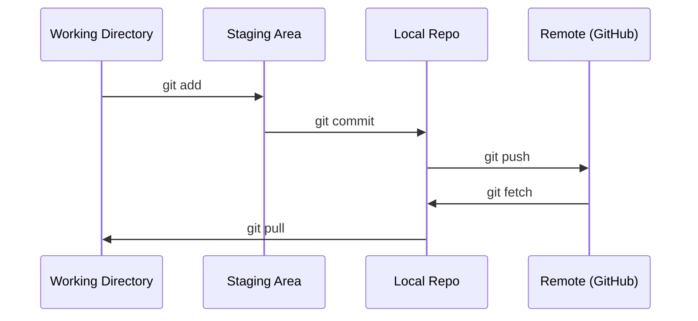

# Git 与协作

> 版本控制不是可选项。你在这里构建的每个实验、每个模型、每节课程都要被追踪。

**类型：** Learn
**语言：** --
**前置要求：** 第 0 阶段，第 01 课
**时间：** ~30 分钟

## 学习目标

- 配置 git 身份，并使用 add、commit、push 组成的日常工作流
- 创建并合并分支，在不破坏 main 的前提下隔离实验
- 编写 `.gitignore`，排除模型检查点和大型二进制文件
- 使用 `git log` 浏览提交历史，理解项目是如何演进的

## 要解决的问题

你将跨越 20 个阶段编写数百个代码文件。没有版本控制，你会丢失工作成果，弄坏无法撤销的东西，也没有办法和别人协作。

Git 是工具。GitHub 是代码所在的地方。本课只覆盖你完成这门课所需要的内容，不多讲。

## 核心概念



记住三件事：
1. 经常保存（`git commit`）
2. 推送到远端（`git push`）
3. 为实验创建分支（`git checkout -b experiment`）

## 动手实现

### 步骤 1：配置 git

```bash
git config --global user.name "Your Name"
git config --global user.email "you@example.com"
```

### 步骤 2：日常工作流

```bash
git status
git add file.py
git commit -m "Add perceptron implementation"
git push origin main
```

### 步骤 3：为实验创建分支

```bash
git checkout -b experiment/new-optimizer

# ... make changes, commit ...

git checkout main
git merge experiment/new-optimizer
```

### 步骤 4：在本课程仓库中工作

```bash
git clone https://github.com/rohitg00/ai-engineering-from-scratch.git
cd ai-engineering-from-scratch

git checkout -b my-progress
# work through lessons, commit your code
git push origin my-progress
```

## 实际使用

在本课程中，你只需要这些命令：

| 命令 | 使用时机 |
|---------|------|
| `git clone` | 获取课程仓库 |
| `git add` + `git commit` | 保存你的工作 |
| `git push` | 备份到 GitHub |
| `git checkout -b` | 在不破坏 main 的情况下尝试新东西 |
| `git log --oneline` | 查看你做过什么 |

就是这些。本课程不需要 rebase、cherry-pick 或 submodules。

## 练习

1. 克隆这个仓库，创建一个名为 `my-progress` 的分支，创建一个文件，提交它，然后推送
2. 创建一个 `.gitignore`，排除模型检查点文件（`.pt`、`.pth`、`.safetensors`）
3. 用 `git log --oneline` 查看这个仓库的提交历史，阅读课程是如何逐步加入的

## 关键术语

| 术语 | 人们常说 | 实际含义 |
|------|----------------|----------------------|
| Commit | “保存” | 项目在某个时间点的完整快照 |
| Branch | “一份副本” | 一个指向提交的指针，会随着你的工作继续向前移动 |
| Merge | “合并代码” | 把一个分支上的变更拿过来，应用到另一个分支 |
| Remote | “云端” | 托管在其他地方的一份仓库副本（GitHub、GitLab） |
