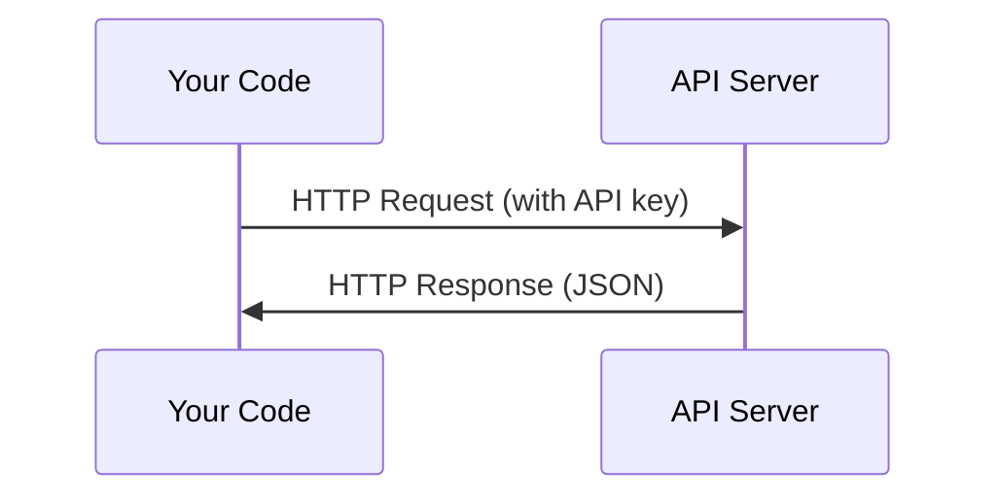

# API 与密钥

> 每个 AI API 的工作方式都一样：发送请求，获得响应。细节会变，模式不变。

**类型：** Build
**语言：** Python, TypeScript
**前置要求：** 第 0 阶段，第 01 课
**时间：** ~30 分钟

## 学习目标

- 使用环境变量和 `.env` 文件安全存储 API 密钥
- 同时使用 Anthropic Python SDK 和原始 HTTP 发起 LLM API 调用
- 对比基于 SDK 与原始 HTTP 的请求/响应格式，以便调试
- 识别并处理常见 API 错误，包括身份验证错误和速率限制

## 要解决的问题

从第 11 阶段开始，你会调用 LLM API（Anthropic、OpenAI、Google）。在第 13-16 阶段，你会构建在循环中使用这些 API 的智能体。你需要知道 API 密钥如何工作、如何安全存储它们，以及如何发起第一次 API 调用。

## 核心概念



每次 API 调用都有：
1. 一个端点（URL）
2. 一个 API 密钥（身份验证）
3. 一个请求体（你想要什么）
4. 一个响应体（你拿回什么）

## 动手实现

### 步骤 1：安全存储 API 密钥

永远不要把 API 密钥写进代码。使用环境变量。

```bash
export ANTHROPIC_API_KEY="sk-ant-..."
export OPENAI_API_KEY="sk-..."
```

或者使用 `.env` 文件（并把它加入 `.gitignore`）：

```text
ANTHROPIC_API_KEY=sk-ant-...
OPENAI_API_KEY=sk-...
```

### 步骤 2：第一次 API 调用（Python）

```python
import anthropic

client = anthropic.Anthropic()

response = client.messages.create(
    model="claude-sonnet-4-20250514",
    max_tokens=256,
    messages=[{"role": "user", "content": "What is a neural network in one sentence?"}]
)

print(response.content[0].text)
```

### 步骤 3：第一次 API 调用（TypeScript）

```typescript
import Anthropic from "@anthropic-ai/sdk";

const client = new Anthropic();

const response = await client.messages.create({
  model: "claude-sonnet-4-20250514",
  max_tokens: 256,
  messages: [{ role: "user", content: "What is a neural network in one sentence?" }],
});

console.log(response.content[0].text);
```

### 步骤 4：原始 HTTP（不使用 SDK）

```python
import os
import urllib.request
import json

url = "https://api.anthropic.com/v1/messages"
headers = {
    "Content-Type": "application/json",
    "x-api-key": os.environ["ANTHROPIC_API_KEY"],
    "anthropic-version": "2023-06-01",
}
body = json.dumps({
    "model": "claude-sonnet-4-20250514",
    "max_tokens": 256,
    "messages": [{"role": "user", "content": "What is a neural network in one sentence?"}],
}).encode()

req = urllib.request.Request(url, data=body, headers=headers, method="POST")
with urllib.request.urlopen(req) as resp:
    result = json.loads(resp.read())
    print(result["content"][0]["text"])
```

这就是 SDK 在底层做的事。理解原始 HTTP 调用有助于调试。

## 实际使用

在本课程中：

| API | 何时需要 | 免费额度 |
|-----|---------|---------|
| Anthropic (Claude) | 第 11-16 阶段（智能体、工具） | 注册赠送 $5 额度 |
| OpenAI | 第 11 阶段（对比） | 注册赠送 $5 额度 |
| Hugging Face | 第 4-10 阶段（模型、数据集） | 免费 |

现在不需要全部准备好。等课程需要时再配置。

## 交付成果

本课产出：
- `outputs/prompt-api-troubleshooter.md` - 诊断常见 API 错误

## 练习

1. 获取一个 Anthropic API 密钥并发起第一次 API 调用
2. 试运行原始 HTTP 版本，并把响应格式与 SDK 版本进行对比
3. 故意使用错误的 API 密钥，阅读错误消息

## 关键术语

| 术语 | 常见说法 | 实际含义 |
|------|---------|---------|
| API 密钥 | “API 的密码” | 一个唯一字符串，用来标识你的账户并授权请求 |
| 速率限制 | “他们在限流我” | 每分钟/每小时允许的最大请求数，用于防止滥用并确保公平使用 |
| Token | “一个词”（在 API 语境中） | 一个计费单位：输入 token 和输出 token 会分别计数和计费 |
| 流式传输 | “实时响应” | 不等待完整响应，而是逐词获取响应 |
