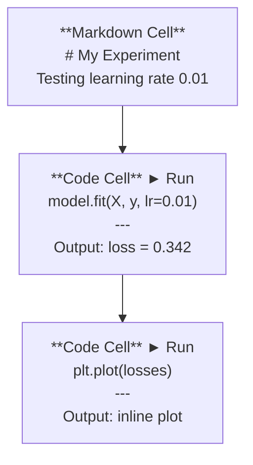
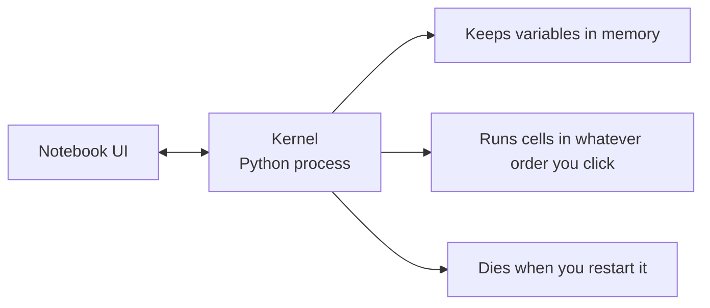

# Jupyter 笔记本

> 笔记本是 AI 工程的实验台。你在这里原型验证，再把真正可行的部分迁移到生产代码里。

**类型：** 构建
**语言：** Python
**先修：** 第 0 阶段，第 01 课
**时间：** 约 30 分钟

## 学习目标

- 安装并启动 JupyterLab、Jupyter Notebook，或带有 Jupyter 扩展的 VS Code
- 使用 magic commands（`%timeit`、`%%time`、`%matplotlib inline`）进行基准测试和内联可视化
- 区分什么时候该用 notebooks，什么时候该用 scripts，并实践“在 notebooks 中探索，在 scripts 中交付”的工作流
- 识别并避开常见的 notebook 陷阱：乱序执行、隐藏状态和内存泄漏

## 要解决的问题

几乎每篇 AI 论文、教程和 Kaggle 竞赛都会用到 Jupyter notebooks。它们让你可以分块运行代码、内联查看输出、把代码和解释混在一起，并快速迭代。如果你不用 notebooks 学 AI，就像做数学作业时没有草稿纸。

但 notebooks 也有真实的陷阱。很多人把它们拿来做所有事情，包括那些 notebooks 很不擅长的事情。知道什么时候用 notebook、什么时候用 script，可以让你以后少掉进很多调试噩梦。

## 核心概念

一个 notebook 是一组 cells。每个 cell 要么是代码，要么是文本。



kernel 是一个在后台运行的 Python 进程。当你运行一个 cell 时，notebook 会把代码发送给 kernel，kernel 执行它，再把结果发回来。所有 cells 共享同一个 kernel，所以变量会在 cells 之间保留。



“按你点击的任意顺序运行”这件事，既是超能力，也是最容易踩中的坑。

## 动手实现

### Step 1：选择你的界面

三种选择，一种格式：

| 界面 | 安装 | 最适合 |
|------|------|--------|
| JupyterLab | `pip install jupyterlab` 然后 `jupyter lab` | 完整 IDE 体验、多标签页、文件浏览器、终端 |
| Jupyter Notebook | `pip install notebook` 然后 `jupyter notebook` | 简单、轻量、一次处理一个 notebook |
| VS Code | 安装 "Jupyter" extension | 已经在你的编辑器里，支持 git 集成和调试 |

这三者读写的都是同一种 `.ipynb` file。选你喜欢的即可。JupyterLab 是 AI 工作中最常见的选择。

```bash
pip install jupyterlab
jupyter lab
```

### Step 2：真正重要的键盘快捷键

你会在两种模式之间操作。按 `Escape` 进入 command mode（左侧蓝色条），按 `Enter` 进入 edit mode（绿色条）。

**Command mode（最常用）：**

| 键 | 动作 |
|----|------|
| `Shift+Enter` | 运行 cell，移动到下一个 |
| `A` | 在上方插入 cell |
| `B` | 在下方插入 cell |
| `DD` | 删除 cell |
| `M` | 转换为 markdown |
| `Y` | 转换为 code |
| `Z` | 撤销 cell 操作 |
| `Ctrl+Shift+H` | 显示所有快捷键 |

**Edit mode：**

| 键 | 动作 |
|----|------|
| `Tab` | 自动补全 |
| `Shift+Tab` | 显示函数签名 |
| `Ctrl+/` | 切换注释 |

`Shift+Enter` 是你每天会用上千次的那个快捷键。先学它。

### Step 3：Cell 类型

**Code cells** 运行 Python 并显示输出：

```python
import numpy as np
data = np.random.randn(1000)
data.mean(), data.std()
```

输出：`(0.0032, 0.9987)`

**Markdown cells** 会渲染格式化文本。用它们记录你正在做什么以及为什么这么做。支持标题、粗体、斜体、LaTeX math（`$E = mc^2$`）、表格和图片。

### Step 4：Magic commands

这些不是 Python。它们是 Jupyter 专用命令，以 `%`（line magic）或 `%%`（cell magic）开头。

**给代码计时：**

```python
%timeit np.random.randn(10000)
```

输出：`45.2 us +/- 1.3 us per loop`

```python
%%time
model.fit(X_train, y_train, epochs=10)
```

输出：`Wall time: 2.34 s`

`%timeit` 会运行代码很多次并取平均值。`%%time` 只运行一次。用 `%timeit` 做微基准测试，用 `%%time` 测训练运行。

**启用内联绘图：**

```python
%matplotlib inline
```

现在每个 `plt.plot()` 或 `plt.show()` 都会直接渲染在 notebook 里。

**不离开 notebook 安装包：**

```python
!pip install scikit-learn
```

`!` 前缀会运行任意 shell command。

**检查环境变量：**

```python
%env CUDA_VISIBLE_DEVICES
```

### Step 5：内联显示丰富输出

Notebooks 会自动显示一个 cell 中最后一个表达式。但你也可以控制它：

```python
import pandas as pd

df = pd.DataFrame({
    "model": ["Linear", "Random Forest", "Neural Net"],
    "accuracy": [0.72, 0.89, 0.94],
    "training_time": [0.1, 2.3, 45.6]
})
df
```

这会渲染成格式化的 HTML table，而不是一堆文本。图也是一样：

```python
import matplotlib.pyplot as plt

plt.figure(figsize=(8, 4))
plt.plot([1, 2, 3, 4], [1, 4, 2, 3])
plt.title("Inline Plot")
plt.show()
```

图会出现在 cell 正下方。这就是 notebooks 主导 AI 工作的原因。你可以同时看到数据、图和代码。

对于图片：

```python
from IPython.display import Image, display
display(Image(filename="architecture.png"))
```

### Step 6：Google Colab

Colab 是云端免费的 Jupyter notebook。它提供 GPU、预装库和 Google Drive 集成。不需要任何设置。

1. 前往 [colab.research.google.com](https://colab.research.google.com)
2. 上传本课程中的任意 `.ipynb` file
3. Runtime > Change runtime type > T4 GPU（免费）

Colab 和本地 Jupyter 的区别：
- 文件不会在 sessions 之间保留（保存到 Drive 或下载）
- 预装：numpy、pandas、matplotlib、torch、tensorflow、sklearn
- 用 `from google.colab import files` 上传/下载文件
- 用 `from google.colab import drive; drive.mount('/content/drive')` 做持久化存储
- 免费层的 sessions 会在 90 分钟无活动后超时

## 实际使用

### Notebooks vs Scripts：什么时候用哪个

| 用 notebooks 做 | 用 scripts 做 |
|-----------------|---------------|
| 探索数据集 | 训练流水线 |
| 原型验证模型 | 可复用工具 |
| 可视化结果 | 任何带有 `if __name__` 的东西 |
| 解释你的工作 | 按计划运行的代码 |
| 快速实验 | 生产代码 |
| 课程练习 | packages 和 libraries |

规则是：**在 notebooks 中探索，在 scripts 中交付**。

AI 中常见的工作流：
1. 在 notebook 中探索数据
2. 在 notebook 中原型验证你的模型
3. 一旦跑通，把代码移到 `.py` files
4. 再把这些 `.py` files import 回 notebook，继续做实验

### 常见陷阱

**乱序执行。** 你先运行 cell 5，再运行 cell 2，然后运行 cell 7。notebook 在你的机器上能工作，但别人从头到尾运行时会坏掉。修复方法：共享前执行 Kernel > Restart & Run All。

**隐藏状态。** 你删除了一个 cell，但它创建的变量仍然在内存里。notebook 看起来很干净，却依赖一个已经消失的 cell。修复方法：定期重启 kernel。

**内存泄漏。** 加载一个 4GB 数据集，训练一个模型，再加载另一个数据集。什么都没有被释放。修复方法：`del variable_name` 和 `gc.collect()`，或者重启 kernel。

## 交付成果

本课产出：
- `outputs/prompt-notebook-helper.md`，用于调试 notebook 问题

## 练习

1. 打开 JupyterLab，创建一个 notebook，并用 `%timeit` 比较 list comprehension 和 numpy 在创建 100,000 个随机数数组时的速度
2. 创建一个同时包含 markdown 和 code cells 的 notebook：加载 CSV、显示 dataframe，并绘制一张图。然后运行 Kernel > Restart & Run All，验证它能从头到尾正常工作
3. 把 `code/notebook_tips.py` 中的代码复制到 Colab notebook，并用免费 GPU 运行它

## 关键术语

| 术语 | 人们常说 | 实际含义 |
|------|----------|----------|
| Kernel | “运行我代码的那个东西” | 一个独立的 Python process，负责执行 cells 并把变量保留在内存中 |
| Cell | “一个代码块” | notebook 中可以独立运行的单元，可以是 code，也可以是 markdown |
| Magic command | “Jupyter tricks” | 以 `%` 或 `%%` 为前缀的特殊命令，用来控制 notebook environment |
| `.ipynb` | “Notebook file” | 一个包含 cells、outputs 和 metadata 的 JSON file。全称来自 IPython Notebook |

## 延伸阅读

- [JupyterLab Docs](https://jupyterlab.readthedocs.io/)：完整功能集
- [Google Colab FAQ](https://research.google.com/colaboratory/faq.html)：Colab 专属限制和功能
- [28 Jupyter Notebook Tips](https://www.dataquest.io/blog/jupyter-notebook-tips-tricks-shortcuts/)：进阶用户快捷键
