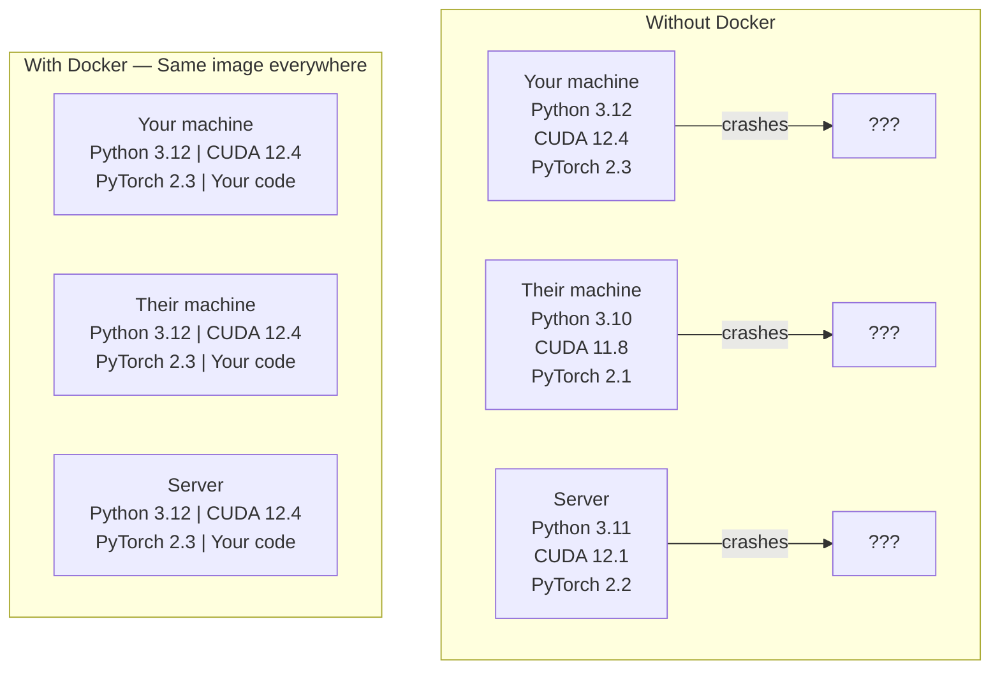

# 面向 AI 的 Docker

> 容器让“在我机器上能跑”成为过去式。

**类型：** Build
**语言：** Docker
**前置要求：** 第 0 阶段，第 01 和 03 课
**时间：** ~60 分钟

## 学习目标

- 从 Dockerfile 构建带 GPU 支持、包含 CUDA、PyTorch 和 AI 库的 Docker 镜像
- 将宿主机目录挂载为卷，让模型、数据集和代码在容器重建后仍然保留
- 配置 NVIDIA Container Toolkit，在容器内暴露 GPU
- 使用 Docker Compose 编排多服务 AI 应用（推理服务器 + 向量数据库）

## 要解决的问题

你在自己的笔记本上用 PyTorch 2.3、CUDA 12.4 和 Python 3.12 训练了一个模型。你的同事机器上是 PyTorch 2.1、CUDA 11.8 和 Python 3.10。你的模型在他们机器上崩溃了。你的 Dockerfile 却能在两边都工作。

AI 项目很容易变成依赖噩梦。一个典型技术栈包括 Python、PyTorch、CUDA 驱动、cuDNN、系统级 C 库，以及像 flash-attn 这种需要精确编译器版本的专用包。Docker 会把所有这些打包进一个镜像，让它在任何地方都以相同方式运行。

## 核心概念

Docker 会把你的代码、运行时、库和系统工具包装成一个叫容器的隔离单元。你可以把它想成轻量虚拟机，不过它共享宿主 OS 内核，而不是运行自己的内核，所以启动时间是几秒而不是几分钟。



### 为什么 AI 项目比大多数项目更需要 Docker

1. **GPU 驱动很脆弱。** CUDA 12.4 代码不能在 CUDA 11.8 上运行。Docker 会把 CUDA toolkit 隔离在容器内，同时通过 NVIDIA Container Toolkit 共享宿主机 GPU 驱动。

2. **模型权重很大。** 一个 7B 参数模型的 fp16 权重有 14 GB。你不会想每次重建都重新下载它。Docker 卷可以从宿主机挂载一个 models 目录。

3. **多服务架构很常见。** 真正的 AI 应用不只是一个 Python 脚本。它可能包括推理服务器、用于 RAG 的向量数据库，也可能还有 Web 前端。Docker Compose 可以用一条命令编排所有这些服务。

### 关键词汇

| 术语 | 含义 |
|------|------|
| Image | 只读模板。你的配方。由 Dockerfile 构建而来。 |
| Container | 镜像的运行中实例。你的厨房。 |
| Dockerfile | 构建镜像的指令。逐层构建。 |
| Volume | 能在容器重启后继续存在的持久化存储。 |
| docker-compose | 用 YAML 定义多容器应用的工具。 |

### AI 中常见的容器模式

```text
Dev Container
  Full toolkit. Editor support. Jupyter. Debugging tools.
  Used during development and experimentation.

Training Container
  Minimal. Just the training script and dependencies.
  Runs on GPU clusters. No editor, no Jupyter.

Inference Container
  Optimized for serving. Small image. Fast cold start.
  Runs behind a load balancer in production.
```

## 动手实现

### 步骤 1：安装 Docker

```bash
# macOS
brew install --cask docker
open /Applications/Docker.app

# Ubuntu
curl -fsSL https://get.docker.com | sh
sudo usermod -aG docker $USER
# Log out and back in for group change to take effect
```

验证：

```bash
docker --version
docker run hello-world
```

### 步骤 2：安装 NVIDIA Container Toolkit（带 NVIDIA GPU 的 Linux）

它允许 Docker 容器访问你的 GPU。macOS 和 Windows（WSL2）用户可以跳过这一步；Docker Desktop 在这些平台上会用不同方式处理 GPU 透传。

```bash
distribution=$(. /etc/os-release;echo $ID$VERSION_ID)
curl -fsSL https://nvidia.github.io/libnvidia-container/gpgkey | sudo gpg --dearmor -o /usr/share/keyrings/nvidia-container-toolkit-keyring.gpg
curl -s -L https://nvidia.github.io/libnvidia-container/$distribution/libnvidia-container.list | \
    sed 's#deb https://#deb [signed-by=/usr/share/keyrings/nvidia-container-toolkit-keyring.gpg] https://#g' | \
    sudo tee /etc/apt/sources.list.d/nvidia-container-toolkit.list

sudo apt-get update
sudo apt-get install -y nvidia-container-toolkit
sudo nvidia-ctk runtime configure --runtime=docker
sudo systemctl restart docker
```

测试容器内的 GPU 访问：

```bash
docker run --rm --gpus all nvidia/cuda:12.4.1-base-ubuntu22.04 nvidia-smi
```

如果能看到你的 GPU 信息，说明 toolkit 正常工作。

### 步骤 3：理解基础镜像

选择合适的基础镜像可以省下数小时调试时间。

```text
nvidia/cuda:12.4.1-devel-ubuntu22.04
  Full CUDA toolkit. Compilers included.
  Use for: building packages that need nvcc (flash-attn, bitsandbytes)
  Size: ~4 GB

nvidia/cuda:12.4.1-runtime-ubuntu22.04
  CUDA runtime only. No compilers.
  Use for: running pre-built code
  Size: ~1.5 GB

pytorch/pytorch:2.3.1-cuda12.4-cudnn9-runtime
  PyTorch pre-installed on top of CUDA.
  Use for: skipping the PyTorch install step
  Size: ~6 GB

python:3.12-slim
  No CUDA. CPU only.
  Use for: inference on CPU, lightweight tools
  Size: ~150 MB
```

### 步骤 4：为 AI 开发编写 Dockerfile

下面是 `code/Dockerfile` 中的 Dockerfile。我们逐段看：

```dockerfile
FROM nvidia/cuda:12.4.1-devel-ubuntu22.04

ENV DEBIAN_FRONTEND=noninteractive
ENV PYTHONUNBUFFERED=1

RUN apt-get update && apt-get install -y --no-install-recommends \
    python3.12 \
    python3.12-venv \
    python3.12-dev \
    python3-pip \
    git \
    curl \
    build-essential \
    && rm -rf /var/lib/apt/lists/*

RUN update-alternatives --install /usr/bin/python python /usr/bin/python3.12 1

RUN python -m pip install --no-cache-dir --upgrade pip setuptools wheel

RUN python -m pip install --no-cache-dir \
    torch==2.3.1 \
    torchvision==0.18.1 \
    torchaudio==2.3.1 \
    --index-url https://download.pytorch.org/whl/cu124

RUN python -m pip install --no-cache-dir \
    numpy \
    pandas \
    scikit-learn \
    matplotlib \
    jupyter \
    transformers \
    datasets \
    accelerate \
    safetensors

WORKDIR /workspace

VOLUME ["/workspace", "/models"]

EXPOSE 8888

CMD ["python"]
```

构建它：

```bash
docker build -t ai-dev -f phases/00-setup-and-tooling/07-docker-for-ai/code/Dockerfile .
```

第一次会花一些时间（下载 CUDA 基础镜像 + PyTorch）。后续构建会使用缓存层。

运行它：

```bash
docker run --rm -it --gpus all \
    -v $(pwd):/workspace \
    -v ~/models:/models \
    ai-dev python -c "import torch; print(f'PyTorch {torch.__version__}, CUDA: {torch.cuda.is_available()}')"
```

在容器内运行 Jupyter：

```bash
docker run --rm -it --gpus all \
    -v $(pwd):/workspace \
    -v ~/models:/models \
    -p 8888:8888 \
    ai-dev jupyter notebook --ip=0.0.0.0 --port=8888 --no-browser --allow-root
```

### 步骤 5：数据和模型的卷挂载

卷挂载对 AI 工作至关重要。没有它们，容器停止后，你下载的 14 GB 模型也会消失。

```bash
# Mount your code
-v $(pwd):/workspace

# Mount a shared models directory
-v ~/models:/models

# Mount datasets
-v ~/datasets:/data
```

在训练脚本里，从挂载路径加载：

```python
from transformers import AutoModel

model = AutoModel.from_pretrained("/models/llama-7b")
```

模型保存在你的宿主机文件系统中。你可以随意重建容器，而不必重新下载。

### 步骤 6：用于多服务 AI 应用的 Docker Compose

真实的 RAG 应用需要一个推理服务器和一个向量数据库。Docker Compose 可以用一条命令同时运行二者。

参见 `code/docker-compose.yml`：

```yaml
services:
  ai-dev:
    build:
      context: .
      dockerfile: Dockerfile
    deploy:
      resources:
        reservations:
          devices:
            - driver: nvidia
              count: all
              capabilities: [gpu]
    volumes:
      - ../../../:/workspace
      - ~/models:/models
      - ~/datasets:/data
    ports:
      - "8888:8888"
    stdin_open: true
    tty: true
    command: jupyter notebook --ip=0.0.0.0 --port=8888 --no-browser --allow-root

  qdrant:
    image: qdrant/qdrant:v1.12.5
    ports:
      - "6333:6333"
      - "6334:6334"
    volumes:
      - qdrant_data:/qdrant/storage

volumes:
  qdrant_data:
```

启动所有服务：

```bash
cd phases/00-setup-and-tooling/07-docker-for-ai/code
docker compose up -d
```

现在你的 AI 开发容器可以通过服务名访问位于 `http://qdrant:6333` 的向量数据库。Docker Compose 会自动创建共享网络。

从 AI 容器内测试连接：

```python
from qdrant_client import QdrantClient

client = QdrantClient(host="qdrant", port=6333)
print(client.get_collections())
```

停止所有服务：

```bash
docker compose down
```

加上 `-v` 也会删除 qdrant 卷：

```bash
docker compose down -v
```

### 步骤 7：AI 工作中常用的 Docker 命令

```bash
# List running containers
docker ps

# List all images and their sizes
docker images

# Remove unused images (reclaim disk space)
docker system prune -a

# Check GPU usage inside a running container
docker exec -it <container_id> nvidia-smi

# Copy a file from container to host
docker cp <container_id>:/workspace/results.csv ./results.csv

# View container logs
docker logs -f <container_id>
```

## 实际使用

你现在有了一个可复现的 AI 开发环境。在这门课接下来的内容中：

- 使用 `docker compose up` 同时启动开发环境和向量数据库
- 将代码、模型和数据挂载为卷，这样重建之间不会丢失任何东西
- 当某一课需要新的 Python 包时，把它加进 Dockerfile 并重新构建
- 与队友共享你的 Dockerfile。他们会得到完全相同的环境。

### 没有 GPU？

移除 `--gpus all` 标志和 NVIDIA deploy 块。容器仍然能用于基于 CPU 的课程。PyTorch 会检测到没有 CUDA，并自动回退到 CPU。

## 练习

1. 构建 Dockerfile，并在容器内运行 `python -c "import torch; print(torch.__version__)"`
2. 启动 docker-compose 栈，并验证 AI 容器可以访问 `http://qdrant:6333/collections` 上的 Qdrant
3. 将 `flask` 添加到 Dockerfile，重新构建，并在 5000 端口运行一个简单 API 服务器。用 `-p 5000:5000` 映射端口
4. 用 `docker images` 测量镜像大小。尝试把基础镜像从 `devel` 切换到 `runtime`，并比较大小

## 关键术语

| 术语 | 常见说法 | 实际含义 |
|------|----------|----------|
| Container | “轻量 VM” | 使用宿主机内核的隔离进程，拥有自己的文件系统和网络 |
| Image layer | “缓存步骤” | 每条 Dockerfile 指令都会创建一层。未变化的层会被缓存，所以重建很快。 |
| NVIDIA Container Toolkit | “Docker 里的 GPU” | 通过 `--gpus` 标志把宿主机 GPU 暴露给容器的运行时钩子 |
| Volume mount | “共享文件夹” | 映射进容器的宿主机目录。容器停止后，变更仍然保留。 |
| Base image | “起点” | Dockerfile 基于其构建的 `FROM` 镜像。它决定了预装内容。 |
