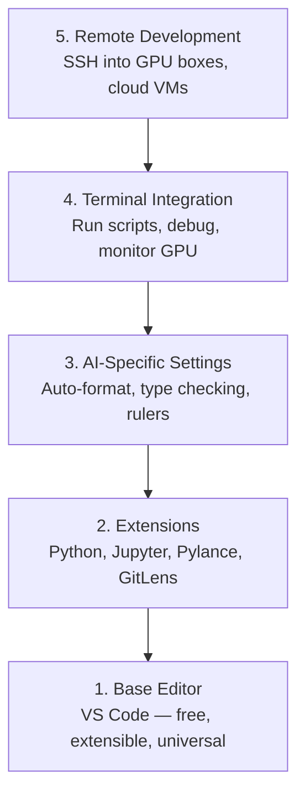

# 编辑器设置

> 你的编辑器是你的副驾驶。配置一次，让它不再碍手碍脚，开始真正分担工作。

**类型：** Build
**语言：** --
**前置要求：** 第 0 阶段，第 01 课
**时间：** ~20 分钟

## 学习目标

- 安装 VS Code，以及面向 Python、Jupyter、linting 和 Remote SSH 的关键扩展
- 配置保存时格式化、类型检查和 notebook 输出滚动，以服务 AI 工作流
- 设置 Remote SSH，像编辑和调试本地代码一样编辑和调试远程 GPU 机器上的代码
- 评估编辑器替代方案（Cursor、Windsurf、Neovim）以及它们在 AI 工作中的取舍

## 要解决的问题

你会在编辑器里花上数千小时：写 Python、运行 notebook、调试训练循环，以及 SSH 到 GPU 机器。如果编辑器配置不当，每次使用都会增加阻力：没有自动补全、没有类型提示、没有行内错误提示、需要手动格式化，而且终端工作流很别扭。

正确的设置需要 20 分钟。跳过它，会让你每天都损失 20 分钟。

## 核心概念

面向 AI 工程的编辑器设置需要五件事：



## 动手实现

### 步骤 1：安装 VS Code

VS Code 是推荐的编辑器。它免费、可在所有操作系统上运行、对 Jupyter notebook 有一流支持，而且扩展生态覆盖了 AI 工作所需的一切。

从 [code.visualstudio.com](https://code.visualstudio.com/) 下载它。

在终端中验证：

```bash
code --version
```

如果 macOS 上找不到 `code`，打开 VS Code，按 `Cmd+Shift+P`，输入 "Shell Command"，然后选择 "Install 'code' command in PATH"。

### 步骤 2：安装必要扩展

打开 VS Code 的集成终端（`` Ctrl+` `` 或 `` Cmd+` ``），安装对 AI 工作最重要的扩展：

```bash
code --install-extension ms-python.python
code --install-extension ms-python.vscode-pylance
code --install-extension ms-toolsai.jupyter
code --install-extension eamodio.gitlens
code --install-extension ms-vscode-remote.remote-ssh
code --install-extension ms-python.debugpy
code --install-extension ms-python.black-formatter
code --install-extension charliermarsh.ruff
```

每个扩展的作用：

| 扩展 | 作用 |
|-----------|-----|
| Python | 语言支持、虚拟环境检测、运行/调试 |
| Pylance | 快速类型检查、自动补全、import 解析 |
| Jupyter | 在 VS Code 内运行 notebook、变量浏览器 |
| GitLens | 查看谁改了什么、行内 git blame |
| Remote SSH | 像打开本地目录一样打开远程 GPU 机器上的目录 |
| Debugpy | Python 单步调试 |
| Black Formatter | 保存时自动格式化，保持风格一致 |
| Ruff | 快速 linting，捕获常见错误 |

本课中的 `code/.vscode/extensions.json` 文件包含完整推荐列表。打开项目目录时，VS Code 会提示你安装它们。

### 步骤 3：配置设置

复制本课 `code/.vscode/settings.json` 中的设置，或者通过 `Settings > Open Settings (JSON)` 手动应用它们。

AI 工作的关键设置：

```jsonc
{
    "python.analysis.typeCheckingMode": "basic",
    "editor.formatOnSave": true,
    "editor.rulers": [88, 120],
    "notebook.output.scrolling": true,
    "files.autoSave": "afterDelay"
}
```

这些设置为什么重要：

- **`basic` 类型检查**：在运行前捕获错误的参数类型。它能在张量形状不匹配和 API 参数错误上节省调试时间。
- **保存时格式化**：不用再分心处理格式。Black 会替你完成。
- **88 和 120 标尺**：Black 在 88 列换行。120 标记会提醒你 docstring 和注释是不是太长了。
- **Notebook 输出滚动**：训练循环会打印成千上万行。如果不滚动，输出面板会无限膨胀。
- **自动保存**：你会忘记保存。训练脚本会运行旧代码。自动保存可以防止这种情况。

### 步骤 4：终端集成

VS Code 的集成终端是你运行训练脚本、监控 GPU 和管理环境的地方。

正确设置它：

```jsonc
{
    "terminal.integrated.defaultProfile.osx": "zsh",
    "terminal.integrated.defaultProfile.linux": "bash",
    "terminal.integrated.fontSize": 13,
    "terminal.integrated.scrollback": 10000
}
```

有用的快捷键：

| 操作 | macOS | Linux/Windows |
|--------|-------|---------------|
| 切换终端 | `` Ctrl+` `` | `` Ctrl+` `` |
| 新建终端 | `` Ctrl+Shift+` `` | `` Ctrl+Shift+` `` |
| 拆分终端 | `Cmd+\` | `Ctrl+\` |

拆分终端很有用：一个用来运行脚本，另一个用 `nvidia-smi -l 1` 或 `watch -n 1 nvidia-smi` 监控 GPU。

### 步骤 5：远程开发（SSH 到 GPU 机器）

这是 AI 工作中最重要的扩展。你会在远程机器上运行训练（cloud VMs、实验室服务器、Lambda、Vast.ai）。Remote SSH 让你打开远程文件系统、编辑文件、运行终端并进行调试，就像一切都在本地一样。

设置：

1. 安装 Remote SSH 扩展（已在步骤 2 完成）。
2. 按 `Ctrl+Shift+P`（或 `Cmd+Shift+P`），输入 "Remote-SSH: Connect to Host"。
3. 输入 `user@your-gpu-box-ip`。
4. VS Code 会自动在远程机器上安装它的 server 组件。

要实现免密码访问，设置 SSH keys：

```bash
ssh-keygen -t ed25519 -C "your-email@example.com"
ssh-copy-id user@your-gpu-box-ip
```

为了方便，把 host 加到 `~/.ssh/config`：

```text
Host gpu-box
    HostName 203.0.113.50
    User ubuntu
    IdentityFile ~/.ssh/id_ed25519
    ForwardAgent yes
```

现在 `Remote-SSH: Connect to Host > gpu-box` 会立即连接。

## 替代方案

### Cursor

[cursor.com](https://cursor.com) 是一个内置 AI 代码生成能力的 VS Code 分支版。它使用同一套扩展生态和设置格式。如果你使用 Cursor，本课中的所有内容仍然适用。导入同一个 `settings.json` 和 `extensions.json` 即可。

### Windsurf

[windsurf.com](https://windsurf.com) 是另一个 AI-first 的 VS Code 分支版。情况相同：同样的扩展、同样的设置格式、同样支持 Remote SSH。

### Vim/Neovim

如果你已经在使用 Vim 或 Neovim，而且效率很高，那就继续用。面向 AI Python 工作的最低配置：

- **pyright** 或 **pylsp** 用于类型检查（通过 Mason 或手动安装）
- **nvim-lspconfig** 用于语言服务器集成
- **jupyter-vim** 或 **molten-nvim** 用于类似 notebook 的执行体验
- **telescope.nvim** 用于文件/符号搜索
- **none-ls.nvim** 配合 black 和 ruff 做格式化/linting

如果你还没有使用 Vim，不要现在开始。它的学习曲线会和学习 AI engineering 抢注意力。使用 VS Code。

## 实际使用

有了这套设置，你的日常工作流会是这样：

1. 在 VS Code 中打开项目目录（或者通过 Remote SSH 连接到 GPU 机器）。
2. 在编辑器里写 Python，获得自动补全、类型提示和行内错误提示。
3. 使用 Jupyter 扩展在编辑器内运行 Jupyter notebooks。
4. 用集成终端运行训练脚本、执行 `uv pip install`，以及监控 GPU。
5. 提交前用 GitLens 审查变更。

## 练习

1. 安装 VS Code 和步骤 2 中列出的所有扩展
2. 将本课的 `settings.json` 复制到你的 VS Code 配置中
3. 打开一个 Python 文件，验证 Pylance 会显示类型提示，并且 Black 会在保存时格式化
4. 如果你可以访问远程机器，设置 Remote SSH 并打开远程机器上的一个目录

## 关键术语

| 术语 | 大家常说 | 实际含义 |
|------|----------|----------|
| LSP | “自动补全引擎” | Language Server Protocol：一种标准，让编辑器可以从特定语言的 server 获取类型信息、补全和诊断 |
| Pylance | “那个 Python 插件” | Microsoft 的 Python language server，使用 Pyright 做类型检查和 IntelliSense |
| Remote SSH | “在服务器上工作” | VS Code 扩展，会在远程机器上运行一个轻量 server，并把 UI 流式传到你的本地编辑器 |
| 保存时格式化 | “自动 prettier” | 每次保存时，编辑器都会运行 formatter（Black、Ruff），让代码风格始终一致 |
