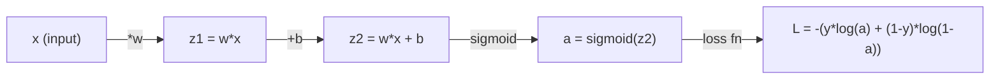
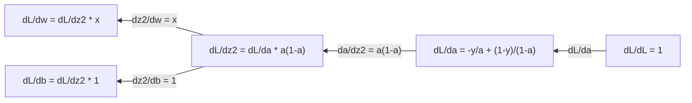
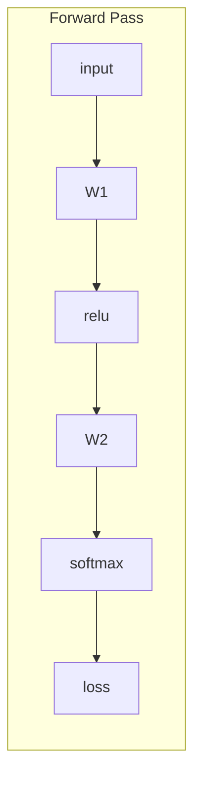
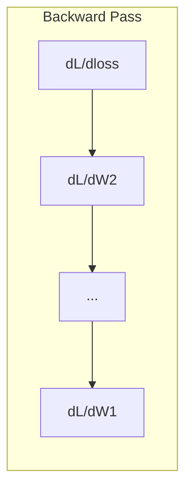

# 面向机器学习的微积分

> 导数会告诉你下坡往哪边走。这就是神经网络学习所需要的一切。

**类型：** 学习
**语言：** Python
**先修：** Phase 1，第 01-03 课
**时间：** ~60 分钟

## 学习目标

- 计算常见 ML 函数（x^2、sigmoid、cross-entropy）的数值导数和解析导数
- 从零实现梯度下降，在 1D 和 2D 中最小化一个损失函数
- 推导线性回归模型的梯度，并通过手动更新权重来训练它
- 解释 Hessian 矩阵、Taylor series 近似，以及它们与优化方法的联系

## 要解决的问题

你有一个包含数百万个权重的神经网络。每个权重都是一个旋钮。你需要弄清楚每一个旋钮该往哪个方向拧，才能让模型稍微少错一点。微积分给你的就是这个方向。

没有微积分，训练神经网络就意味着随机尝试各种改动，然后祈祷效果变好。有了导数，你就能准确知道每个权重如何影响误差。每一次，你都能把每个旋钮往正确方向拧。

## 核心概念

### 什么是导数？

导数度量变化率。对于函数 y = f(x)，导数 f'(x) 会告诉你：如果把 x 轻轻移动一个极小的量，y 会变化多少？

从几何上看，导数就是某一点处切线的斜率。

**f(x) = x^2：**

| x | f(x) | f'(x)（斜率） |
|---|------|---------------|
| 0 | 0    | 0（平坦，位于底部） |
| 1 | 1    | 2 |
| 2 | 4    | 4（这一点处的切线斜率） |
| 3 | 9    | 6 |

在 x=2 时，斜率是 4。如果你把 x 向右移动一点点，y 大约会增加这个移动量的 4 倍。在 x=0 时，斜率是 0。你位于碗底。

形式化定义是：

```text
f'(x) = lim   f(x + h) - f(x)
        h->0  -----------------
                     h
```

在代码里，你会跳过极限，直接使用一个非常小的 h。这就是数值导数。

### 偏导数：一次只看一个变量

真实函数有很多输入。神经网络的损失依赖于成千上万个权重。偏导数会固定除一个变量之外的所有变量，然后对那一个变量求导。

```text
f(x, y) = x^2 + 3xy + y^2

df/dx = 2x + 3y     (treat y as a constant)
df/dy = 3x + 2y     (treat x as a constant)
```

每个偏导数回答的是：如果我只轻轻改变这个权重，损失会如何变化？

### 梯度：所有偏导数组成的向量

梯度会把每个偏导数收集到一个向量中。对于函数 f(x, y, z)，梯度是：

```text
grad f = [ df/dx, df/dy, df/dz ]
```

梯度指向最陡上升的方向。要最小化一个函数，就朝相反方向走。

**f(x,y) = x^2 + y^2 的等高线图：**

这个函数形成一个碗状曲面，等高线是一组同心圆。最小值位于 (0, 0)。

| 点 | grad f | -grad f（下降方向） |
|-------|--------|----------------------------|
| (1, 1) | [2, 2]（指向上坡，远离最小值） | [-2, -2]（指向下坡，朝向最小值） |
| (0, 0) | [0, 0]（平坦，位于最小值处） | [0, 0] |

这就是图像中的梯度下降。计算梯度，取相反方向，然后迈出一步。

### 与优化的关系

训练神经网络就是优化。你有一个损失函数 L(w1, w2, ..., wn)，它度量模型错得有多离谱。你想最小化它。

```text
Gradient descent update rule:

  w_new = w_old - learning_rate * dL/dw

For every weight:
  1. Compute the partial derivative of loss with respect to that weight
  2. Subtract a small multiple of it from the weight
  3. Repeat
```

学习率控制步长。太大，你会越过目标；太小，你只能慢慢爬。

**损失地形（1D 切片）：**

随着权重 w 变化，损失函数 L(w) 会形成一条带有山峰和山谷的曲线。

| 特征 | 描述 |
|---------|-------------|
| 全局最小值 | 整条曲线上的最低点，也就是最佳解 |
| 局部最小值 | 一个比邻近位置更低、但不是整体最低的山谷 |
| 斜率 | 梯度下降会从任意起点沿斜率向下走 |

梯度下降会沿斜率下山。它可能陷入局部最小值，但在高维空间（数百万个权重）中，这很少是实际问题。

### 数值导数 vs 解析导数

计算导数有两种方式。

解析方式：手动应用微积分规则。对于 f(x) = x^2，导数是 f'(x) = 2x。精确，而且很快。

数值方式：用定义来近似。对一个很小的 h，计算 f(x+h) 和 f(x-h)，然后取差值。

```text
Numerical (central difference):

f'(x) ~= f(x + h) - f(x - h)
          -----------------------
                  2h

h = 0.0001 works well in practice
```

数值导数更慢，但适用于任何函数。解析导数很快，但需要你先推导公式。神经网络框架使用第三种方法：自动微分，它会机械地计算精确导数。你会在 Phase 3 看到它。

### 手推简单函数的导数

这些是在 ML 中会反复见到的导数。

```text
Function        Derivative       Used in
--------        ----------       -------
f(x) = x^2     f'(x) = 2x      Loss functions (MSE)
f(x) = wx + b  f'(w) = x        Linear layer (gradient w.r.t. weight)
                f'(b) = 1        Linear layer (gradient w.r.t. bias)
                f'(x) = w        Linear layer (gradient w.r.t. input)
f(x) = e^x     f'(x) = e^x     Softmax, attention
f(x) = ln(x)   f'(x) = 1/x     Cross-entropy loss
f(x) = 1/(1+e^-x)  f'(x) = f(x)(1-f(x))   Sigmoid activation
```

对于 f(x) = x^2：

```text
f(x) = x^2    f'(x) = 2x

  x    f(x)   f'(x)   meaning
  -2    4      -4      slope tilts left (decreasing)
  -1    1      -2      slope tilts left (decreasing)
   0    0       0      flat (minimum!)
   1    1       2      slope tilts right (increasing)
   2    4       4      slope tilts right (increasing)
```

对于 f(w) = wx + b，其中 x=3，b=1：

```text
f(w) = 3w + 1    f'(w) = 3

The derivative with respect to w is just x.
If x is big, a small change in w causes a big change in output.
```

### 链式法则

当函数由多个函数复合而成时，链式法则会告诉你如何求导。

```text
If y = f(g(x)), then dy/dx = f'(g(x)) * g'(x)

Example: y = (3x + 1)^2
  outer: f(u) = u^2       f'(u) = 2u
  inner: g(x) = 3x + 1    g'(x) = 3
  dy/dx = 2(3x + 1) * 3 = 6(3x + 1)
```

神经网络是一串函数：input -> linear -> activation -> linear -> activation -> loss。反向传播就是从输出到输入反复应用链式法则。整个算法就这么一件事。

### Hessian 矩阵

梯度告诉你斜率。Hessian 告诉你曲率。

Hessian 是二阶偏导数组成的矩阵。对于函数 f(x1, x2, ..., xn)，Hessian 中的 (i, j) 条目是：

```text
H[i][j] = d^2f / (dx_i * dx_j)
```

对于一个二变量函数 f(x, y)：

```text
H = | d^2f/dx^2    d^2f/dxdy |
    | d^2f/dydx    d^2f/dy^2 |
```

**Hessian 在临界点（gradient = 0 的位置）告诉你什么：**

| Hessian 性质 | 含义 | 示例曲面 |
|-----------------|---------|-----------------|
| 正定（所有 eigenvalues > 0） | 局部最小值 | 向上开口的碗 |
| 负定（所有 eigenvalues < 0） | 局部最大值 | 向下开口的碗 |
| 不定（eigenvalues 符号混合） | 鞍点 | 马鞍形曲面 |

**例子：** f(x, y) = x^2 - y^2（一个鞍点函数）

```text
df/dx = 2x       df/dy = -2y
d^2f/dx^2 = 2    d^2f/dy^2 = -2    d^2f/dxdy = 0

H = | 2   0 |
    | 0  -2 |

Eigenvalues: 2 and -2 (one positive, one negative)
--> Saddle point at (0, 0)
```

再与 f(x, y) = x^2 + y^2（一个碗）比较：

```text
H = | 2  0 |
    | 0  2 |

Eigenvalues: 2 and 2 (both positive)
--> Local minimum at (0, 0)
```

**为什么 Hessian 对 ML 很重要：**

Newton's method 会使用 Hessian，比梯度下降迈出更好的优化步。它不只是沿斜率走，还会考虑曲率：

```text
Newton's update:    w_new = w_old - H^(-1) * gradient
Gradient descent:   w_new = w_old - lr * gradient
```

Newton's method 收敛更快，因为 Hessian 会“重新缩放”梯度：陡峭方向用更小步长，平坦方向用更大步长。

问题在于：对于一个有 N 个参数的神经网络，Hessian 是 N x N。一个拥有 100 万参数的模型需要一个 1 万亿条目的矩阵。这就是我们使用近似方法的原因。

| 方法 | 使用什么 | 成本 | 收敛性 |
|--------|-------------|------|-------------|
| Gradient descent | 仅一阶导数 | 每步 O(N) | 慢（线性） |
| Newton's method | 完整 Hessian | 每步 O(N^3) | 快（二次） |
| L-BFGS | 由梯度历史近似 Hessian | 每步 O(N) | 中等（超线性） |
| Adam | 每个参数的自适应速率（对角 Hessian 近似） | 每步 O(N) | 中等 |
| Natural gradient | Fisher information matrix（统计 Hessian） | 每步 O(N^2) | 快 |

在实践中，Adam 是深度学习的默认优化器。它会追踪每个参数梯度的运行均值和方差，用低成本方式近似二阶信息。

### Taylor series 近似

任何平滑函数都可以在局部用多项式近似：

```text
f(x + h) = f(x) + f'(x)*h + (1/2)*f''(x)*h^2 + (1/6)*f'''(x)*h^3 + ...
```

包含的项越多，近似越好，但只在靠近点 x 的地方成立。

**为什么 Taylor series 对 ML 很重要：**

- **一阶 Taylor = 梯度下降。** 当你使用 f(x + h) ~ f(x) + f'(x)*h 时，你是在做线性近似。梯度下降会最小化这个线性模型，从而选择 h = -lr * f'(x)。

- **二阶 Taylor = Newton's method。** 使用 f(x + h) ~ f(x) + f'(x)*h + (1/2)*f''(x)*h^2 时，你会得到一个二次模型。最小化它会得到 h = -f'(x)/f''(x)，也就是 Newton's step。

- **损失函数设计。** MSE 和 cross-entropy 是平滑的，这意味着它们的 Taylor 展开行为良好。这不是巧合。平滑损失让优化更可预测。

```text
Approximation order    What it captures    Optimization method
-------------------    -----------------   -------------------
0th order (constant)   Just the value      Random search
1st order (linear)     Slope               Gradient descent
2nd order (quadratic)  Curvature           Newton's method
Higher orders          Finer structure     Rarely used in ML
```

关键洞见：所有基于梯度的优化，本质上都是在局部近似损失函数，然后迈向这个近似函数的最小值。

### ML 中的积分

导数告诉你变化率。积分计算累积量，也就是曲线下面积。

在 ML 中，你很少手动计算积分，但这个概念无处不在：

**概率。** 对于一个密度为 p(x) 的连续随机变量：
```text
P(a < X < b) = integral from a to b of p(x) dx
```
概率密度曲线在 a 和 b 之间的面积，就是落在该区间内的概率。

**期望值。** 按概率加权后的平均结果：
```text
E[f(X)] = integral of f(x) * p(x) dx
```
数据分布上的期望损失是一个积分。训练会最小化它的经验近似。

**KL divergence。** 度量两个分布有多不同：
```text
KL(p || q) = integral of p(x) * log(p(x) / q(x)) dx
```
用于 VAEs、knowledge distillation 和 Bayesian inference。

**归一化常数。** 在 Bayesian inference 中：
```text
p(w | data) = p(data | w) * p(w) / integral of p(data | w) * p(w) dw
```
分母是对所有可能参数值的积分。它通常无法精确处理，这就是我们使用 MCMC 和 variational inference 等近似方法的原因。

| 积分概念 | 在 ML 中出现的位置 |
|-----------------|----------------------|
| 曲线下面积 | 从密度函数得到概率 |
| 期望值 | 损失函数、风险最小化 |
| KL divergence | VAEs、policy optimization、distillation |
| 归一化 | Bayesian posteriors、softmax denominator |
| 边际似然 | 模型比较、evidence lower bound (ELBO) |

### 计算图中的多变量链式法则

链式法则不只适用于一条线上的标量函数。在神经网络中，变量会分叉，也会合并。下面是导数如何流过一个简单 forward pass：



backward pass 会从右到左计算梯度：



每条箭头都会乘上局部导数。任意参数的梯度，就是从 loss 到该参数的路径上所有局部导数的乘积。当路径分叉并合并时，你会把各条贡献相加（多变量链式法则）。

这就是反向传播的全部：从输出到输入，系统地把链式法则应用到计算图上。

### Jacobian 矩阵

当一个函数把向量映射到向量时（比如一个神经网络层），它的导数就是一个矩阵。Jacobian 包含每个输出对每个输入的所有偏导数。

对于 f: R^n -> R^m，Jacobian J 是一个 m x n 矩阵：

| | x1 | x2 | ... | xn |
|---|---|---|---|---|
| f1 | df1/dx1 | df1/dx2 | ... | df1/dxn |
| f2 | df2/dx1 | df2/dx2 | ... | df2/dxn |
| ... | ... | ... | ... | ... |
| fm | dfm/dx1 | dfm/dx2 | ... | dfm/dxn |

你不会为神经网络手算 Jacobians。PyTorch 会处理它。但知道它的存在，有助于你理解反向传播中的形状：如果一个层把 R^n 映射到 R^m，它的 Jacobian 就是 m x n。梯度会通过这个矩阵的转置向后流动。

### 为什么这对神经网络重要

神经网络中的每个权重都会得到一个梯度。梯度告诉你如何调整这个权重来降低损失。





每次权重更新：
- `W1 = W1 - lr * dL/dW1`
- `W2 = W2 - lr * dL/dW2`

forward pass 会计算预测和损失。backward pass 会计算损失相对于每个权重的梯度。然后，每个权重都会向下迈出一小步。重复数百万步。这就是深度学习。

## 动手实现

### 第 1 步：从零实现数值导数

```python
def numerical_derivative(f, x, h=1e-7):
    return (f(x + h) - f(x - h)) / (2 * h)

def f(x):
    return x ** 2

for x in [-2, -1, 0, 1, 2]:
    numerical = numerical_derivative(f, x)
    analytical = 2 * x
    print(f"x={x:2d}  f'(x) numerical={numerical:.6f}  analytical={analytical:.1f}")
```

数值导数会和解析导数匹配到很多位小数。

### 第 2 步：偏导数与梯度

```python
def numerical_gradient(f, point, h=1e-7):
    gradient = []
    for i in range(len(point)):
        point_plus = list(point)
        point_minus = list(point)
        point_plus[i] += h
        point_minus[i] -= h
        partial = (f(point_plus) - f(point_minus)) / (2 * h)
        gradient.append(partial)
    return gradient

def f_multi(point):
    x, y = point
    return x**2 + 3*x*y + y**2

grad = numerical_gradient(f_multi, [1.0, 2.0])
print(f"Numerical gradient at (1,2): {[f'{g:.4f}' for g in grad]}")
print(f"Analytical gradient at (1,2): [2*1+3*2, 3*1+2*2] = [{2*1+3*2}, {3*1+2*2}]")
```

### 第 3 步：用梯度下降寻找 f(x) = x^2 的最小值

```python
x = 5.0
lr = 0.1
for step in range(20):
    grad = 2 * x
    x = x - lr * grad
    print(f"step {step:2d}  x={x:8.4f}  f(x)={x**2:10.6f}")
```

从 x=5 开始，每一步都会更接近 x=0（最小值）。

### 第 4 步：在 2D 函数上做梯度下降

```python
def f_2d(point):
    x, y = point
    return x**2 + y**2

point = [4.0, 3.0]
lr = 0.1
for step in range(30):
    grad = numerical_gradient(f_2d, point)
    point = [p - lr * g for p, g in zip(point, grad)]
    loss = f_2d(point)
    if step % 5 == 0 or step == 29:
        print(f"step {step:2d}  point=({point[0]:7.4f}, {point[1]:7.4f})  f={loss:.6f}")
```

### 第 5 步：比较数值导数与解析导数

```python
import math

test_functions = [
    ("x^2",      lambda x: x**2,          lambda x: 2*x),
    ("x^3",      lambda x: x**3,          lambda x: 3*x**2),
    ("sin(x)",   lambda x: math.sin(x),   lambda x: math.cos(x)),
    ("e^x",      lambda x: math.exp(x),   lambda x: math.exp(x)),
    ("1/x",      lambda x: 1/x,           lambda x: -1/x**2),
]

x = 2.0
print(f"{'Function':<12} {'Numerical':>12} {'Analytical':>12} {'Error':>12}")
print("-" * 50)
for name, f, df in test_functions:
    num = numerical_derivative(f, x)
    ana = df(x)
    err = abs(num - ana)
    print(f"{name:<12} {num:12.6f} {ana:12.6f} {err:12.2e}")
```

### 第 6 步：数值计算 Hessian

```python
def hessian_2d(f, x, y, h=1e-5):
    fxx = (f(x + h, y) - 2 * f(x, y) + f(x - h, y)) / (h ** 2)
    fyy = (f(x, y + h) - 2 * f(x, y) + f(x, y - h)) / (h ** 2)
    fxy = (f(x + h, y + h) - f(x + h, y - h) - f(x - h, y + h) + f(x - h, y - h)) / (4 * h ** 2)
    return [[fxx, fxy], [fxy, fyy]]

def saddle(x, y):
    return x ** 2 - y ** 2

def bowl(x, y):
    return x ** 2 + y ** 2

H_saddle = hessian_2d(saddle, 0.0, 0.0)
H_bowl = hessian_2d(bowl, 0.0, 0.0)
print(f"Saddle Hessian: {H_saddle}")  # [[2, 0], [0, -2]] -- mixed signs
print(f"Bowl Hessian:   {H_bowl}")    # [[2, 0], [0, 2]]  -- both positive
```

鞍点函数的 Hessian 有 eigenvalues 2 和 -2（符号混合，确认这是一个鞍点）。碗形函数的 eigenvalues 是 2 和 2（均为正，确认这是一个最小值）。

### 第 7 步：Taylor 近似的实际效果

```python
import math

def taylor_approx(f, f_prime, f_double_prime, x0, h, order=2):
    result = f(x0)
    if order >= 1:
        result += f_prime(x0) * h
    if order >= 2:
        result += 0.5 * f_double_prime(x0) * h ** 2
    return result

x0 = 0.0
for h in [0.1, 0.5, 1.0, 2.0]:
    true_val = math.sin(h)
    t1 = taylor_approx(math.sin, math.cos, lambda x: -math.sin(x), x0, h, order=1)
    t2 = taylor_approx(math.sin, math.cos, lambda x: -math.sin(x), x0, h, order=2)
    print(f"h={h:.1f}  sin(h)={true_val:.4f}  order1={t1:.4f}  order2={t2:.4f}")
```

在 x0=0 附近，sin(x) ~ x（一阶 Taylor）。对于小 h，这个近似非常好；但 h 变大时，它会失效。这就是为什么梯度下降最适合使用较小学习率：每一步都假设线性近似是准确的。

### 第 8 步：为什么这对神经网络重要

```python
import random

random.seed(42)

w = random.gauss(0, 1)
b = random.gauss(0, 1)
lr = 0.01

xs = [1.0, 2.0, 3.0, 4.0, 5.0]
ys = [3.0, 5.0, 7.0, 9.0, 11.0]

for epoch in range(200):
    total_loss = 0
    dw = 0
    db = 0
    for x, y in zip(xs, ys):
        pred = w * x + b
        error = pred - y
        total_loss += error ** 2
        dw += 2 * error * x
        db += 2 * error
    dw /= len(xs)
    db /= len(xs)
    total_loss /= len(xs)
    w -= lr * dw
    b -= lr * db
    if epoch % 40 == 0 or epoch == 199:
        print(f"epoch {epoch:3d}  w={w:.4f}  b={b:.4f}  loss={total_loss:.6f}")

print(f"\nLearned: y = {w:.2f}x + {b:.2f}")
print(f"Actual:  y = 2x + 1")
```

每个基于梯度的训练循环都遵循这个模式：预测，计算损失，计算梯度，更新权重。

## 实际使用

使用 NumPy，同样的操作会更快，也更简洁：

```python
import numpy as np

x = np.array([1, 2, 3, 4, 5], dtype=float)
y = np.array([3, 5, 7, 9, 11], dtype=float)

w, b = np.random.randn(), np.random.randn()
lr = 0.01

for epoch in range(200):
    pred = w * x + b
    error = pred - y
    loss = np.mean(error ** 2)
    dw = np.mean(2 * error * x)
    db = np.mean(2 * error)
    w -= lr * dw
    b -= lr * db

print(f"Learned: y = {w:.2f}x + {b:.2f}")
```

你刚刚从零构建了梯度下降。PyTorch 会自动化梯度计算，但更新循环完全相同。

## 练习

1. 使用调用两次 `numerical_derivative` 的方式实现 `numerical_second_derivative(f, x)`。验证 x^3 在 x=2 处的二阶导数是 12。
2. 使用梯度下降寻找 f(x, y) = (x - 3)^2 + (y + 1)^2 的最小值。从 (0, 0) 开始。答案应该收敛到 (3, -1)。
3. 给梯度下降循环加入 momentum：维护一个会累积过去梯度的速度向量。在 f(x) = x^4 - 3x^2 上比较加入 momentum 前后的收敛速度。

## 关键术语

| 术语 | 常见说法 | 实际含义 |
|------|----------------|----------------------|
| 导数（Derivative） | “斜率” | 函数在某一点的变化率。告诉你输入每变化一个单位，输出会变化多少。 |
| 偏导数（Partial derivative） | “某一个变量的导数” | 在其他变量都保持不变时，相对于一个变量的导数。 |
| 梯度（Gradient） | “最陡上升方向” | 所有偏导数组成的向量。指向函数增加最快的方向。 |
| 梯度下降（Gradient descent） | “往下坡走” | 从参数中减去梯度（乘以学习率）以降低损失。它是神经网络训练的核心。 |
| 学习率（Learning rate） | “步长” | 控制每次梯度下降步子有多大的标量。太大：发散。太小：收敛缓慢。 |
| 链式法则（Chain rule） | “把导数乘起来” | 对复合函数求导的规则：df/dx = df/dg * dg/dx。它是反向传播的数学基础。 |
| Jacobian | “导数矩阵” | 当函数把向量映射到向量时，Jacobian 是输出相对于输入的所有偏导数组成的矩阵。 |
| 数值导数（Numerical derivative） | “有限差分” | 通过在两个相邻点上计算函数值，并求它们之间的斜率来近似导数。 |
| 反向传播（Backpropagation） | “Reverse-mode autodiff” | 使用链式法则，从输出到输入逐层计算梯度。神经网络就是这样学习的。 |
| Hessian | “二阶导数矩阵” | 所有二阶偏导数组成的矩阵。描述函数的曲率。在临界点处，正定 Hessian 表示局部最小值。 |
| Taylor series | “多项式近似” | 使用函数的导数在某一点附近近似函数：f(x+h) ~ f(x) + f'(x)h + (1/2)f''(x)h^2 + ...。这是理解梯度下降和 Newton's method 为什么有效的基础。 |
| 积分（Integral） | “曲线下面积” | 某个量在一个范围内的累积。在 ML 中，积分定义概率、期望值和 KL divergence。 |

## 延伸阅读

- [3Blue1Brown：微积分的本质](https://www.3blue1brown.com/topics/calculus) - 关于 derivatives、integrals 和 chain rule 的视觉直觉
- [Stanford CS231n：反向传播](https://cs231n.github.io/optimization-2/) - 梯度如何流过神经网络层
