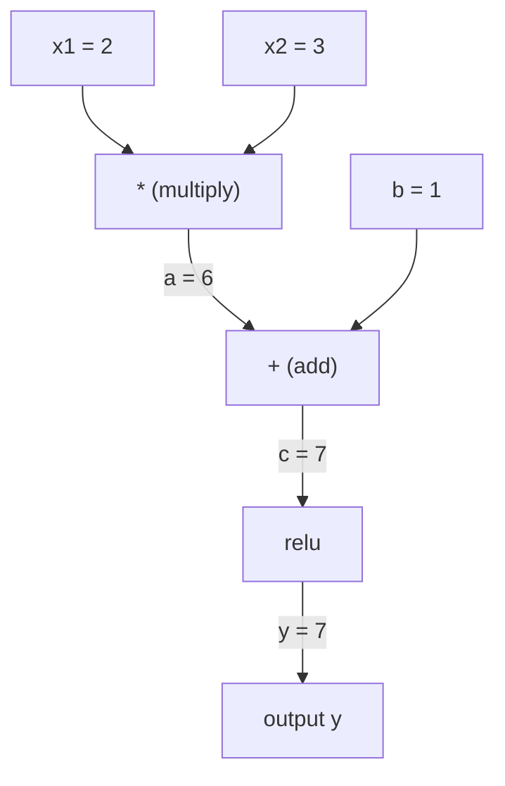
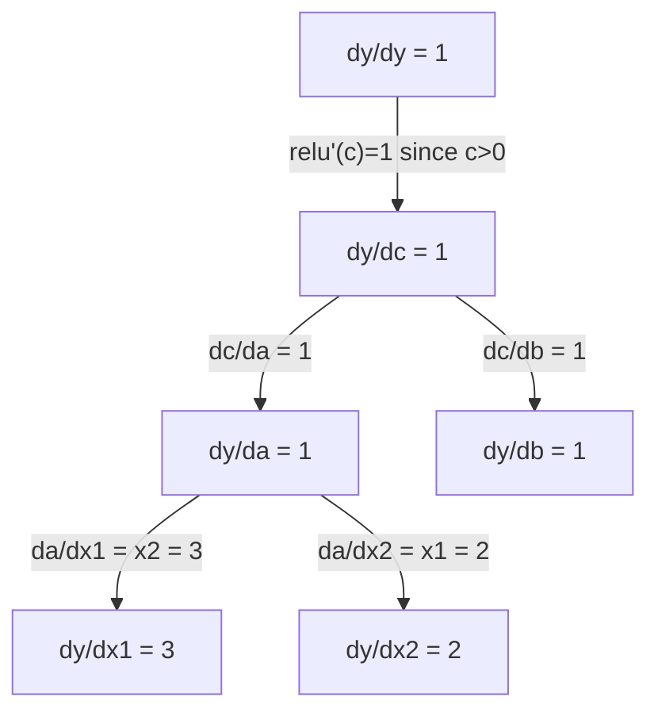

# 链式法则与自动微分

> 链式法则是每个会学习的神经网络背后的引擎。

**类型：** 构建
**语言：** Python
**先修：** Phase 1，第 04 课（导数与梯度）
**时间：** ~90 分钟

## 学习目标

- 构建一个最小 autograd 引擎（`Value` class），记录运算并通过 reverse-mode autodiff 计算梯度
- 使用拓扑排序，在计算图中实现前向传播和反向传播
- 只使用从零实现的 autograd 引擎，在 XOR 上构建并训练一个 multi-layer perceptron
- 使用 gradient checking 对照数值有限差分，验证 autodiff 的正确性

## 要解决的问题

你已经能计算简单函数的导数。但神经网络不是一个简单函数。它是数百个函数组合在一起：矩阵乘法、加偏置、应用激活、再次矩阵乘法、softmax、cross-entropy loss。输出是“函数的函数的函数”。

要训练网络，你需要 loss 相对于每一个权重的梯度。对数百万个参数手算这件事是不可能的。用数值方法（finite differences）来算又太慢。

链式法则给你数学。自动微分给你算法。二者合在一起，让你能在与一次前向传播成比例的时间里，穿过任意函数组合计算精确梯度。

PyTorch、TensorFlow 和 JAX 都是这样工作的。你将从零构建一个迷你版本。

## 核心概念

### 链式法则

如果 `y = f(g(x))`，那么 `y` 相对于 `x` 的导数是：

```text
dy/dx = dy/dg * dg/dx = f'(g(x)) * g'(x)
```

沿着这条链把导数相乘。链上的每一环贡献自己的局部导数。

例子：`y = sin(x^2)`

```text
g(x) = x^2       g'(x) = 2x
f(g) = sin(g)     f'(g) = cos(g)

dy/dx = cos(x^2) * 2x
```

对于更深的组合，链会继续延伸：

```text
y = f(g(h(x)))

dy/dx = f'(g(h(x))) * g'(h(x)) * h'(x)
```

神经网络中的每一层，都是这条链上的一环。

### 计算图

计算图让链式法则变得可视化。每个运算都会成为一个节点。数据沿图向前流动，梯度沿图向后流动。

**前向传播（计算数值）：**



**反向传播（计算梯度）：**



反向传播会在每个节点应用链式法则，把梯度从输出传回输入。

### 前向模式 vs 反向模式

有两种方式可以把链式法则应用到图上。

**前向模式**从输入开始，把导数向前推。它计算 `dx/dx = 1`，并通过每个运算传播。输入少、输出多时很合适。

```text
Forward mode: seed dx/dx = 1, propagate forward

  x = 2       (dx/dx = 1)
  a = x^2     (da/dx = 2x = 4)
  y = sin(a)  (dy/dx = cos(a) * da/dx = cos(4) * 4 = -2.615)
```

**反向模式**从输出开始，把梯度向后拉。它计算 `dy/dy = 1`，并按相反顺序通过每个运算传播。输入多、输出少时很合适。

```text
Reverse mode: seed dy/dy = 1, propagate backward

  y = sin(a)  (dy/dy = 1)
  a = x^2     (dy/da = cos(a) = cos(4) = -0.654)
  x = 2       (dy/dx = dy/da * da/dx = -0.654 * 4 = -2.615)
```

神经网络有数百万个输入（权重）和一个输出（loss）。反向模式可以在一次反向传播中计算所有梯度。这就是反向传播使用反向模式的原因。

| 模式 | 种子 | 方向 | 最适合的情况 |
|------|------|-----------|-----------|
| 前向 | `dx_i/dx_i = 1` | 输入到输出 | 输入少、输出多 |
| 反向 | `dy/dy = 1` | 输出到输入 | 输入多、输出少（神经网络） |

### 用于前向模式的对偶数

前向模式可以用对偶数优雅地实现。对偶数的形式是 `a + b*epsilon`，其中 `epsilon^2 = 0`。

```text
Dual number: (value, derivative)

(2, 1) means: value is 2, derivative w.r.t. x is 1

Arithmetic rules:
  (a, a') + (b, b') = (a+b, a'+b')
  (a, a') * (b, b') = (a*b, a'*b + a*b')
  sin(a, a')         = (sin(a), cos(a)*a')
```

把输入变量的导数种成 1。导数就会自动穿过每个运算传播。

### 构建 autograd 引擎

一个 autograd 引擎需要三件事：

1. **包装数值。** 把每个数字包进一个对象，里面存储它的数值和梯度。
2. **记录图。** 每个运算都会记录自己的输入和局部梯度函数。
3. **反向传播。** 对图做拓扑排序，然后反向遍历，在每个节点应用链式法则。

这正是 PyTorch 的 `autograd` 所做的事。`torch.Tensor` class 会包装数值，在 `requires_grad=True` 时记录运算，并在你调用 `.backward()` 时计算梯度。

### PyTorch Autograd 底层如何工作

当你写 PyTorch 代码时：

```python
x = torch.tensor(2.0, requires_grad=True)
y = x ** 2 + 3 * x + 1
y.backward()
print(x.grad)  # 7.0 = 2*x + 3 = 2*2 + 3
```

PyTorch 在内部会：

1. 为 `x` 创建一个 `Tensor` 节点，并设置 `requires_grad=True`
2. 每个运算（`**`、`*`、`+`）都会创建新节点并记录 backward function
3. `y.backward()` 触发 reverse-mode autodiff，穿过已记录的图
4. 每个节点的 `grad_fn` 计算局部梯度，并把它们传给父节点
5. 梯度通过加法累积到 `.grad` 属性中（不是替换）

这个图是动态的（define-by-run）。每次前向传播都会构建一张新图。这就是 PyTorch 支持在模型里使用控制流（if/else、loops）的原因。

## 动手实现

### 步骤 1：`Value` class

```python
class Value:
    def __init__(self, data, children=(), op=''):
        self.data = data
        self.grad = 0.0
        self._backward = lambda: None
        self._prev = set(children)
        self._op = op

    def __repr__(self):
        return f"Value(data={self.data:.4f}, grad={self.grad:.4f})"
```

每个 `Value` 都会存储自己的数值数据、梯度（初始为零）、一个 backward function，以及指向产生它的子节点的指针。

### 步骤 2：带梯度追踪的算术运算

```python
    def __add__(self, other):
        other = other if isinstance(other, Value) else Value(other)
        out = Value(self.data + other.data, (self, other), '+')
        def _backward():
            self.grad += out.grad
            other.grad += out.grad
        out._backward = _backward
        return out

    def __mul__(self, other):
        other = other if isinstance(other, Value) else Value(other)
        out = Value(self.data * other.data, (self, other), '*')
        def _backward():
            self.grad += other.data * out.grad
            other.grad += self.data * out.grad
        out._backward = _backward
        return out

    def relu(self):
        out = Value(max(0, self.data), (self,), 'relu')
        def _backward():
            self.grad += (1.0 if out.data > 0 else 0.0) * out.grad
        out._backward = _backward
        return out
```

每个运算都会创建一个 closure，它知道如何计算局部梯度，并乘以上游梯度（`out.grad`）。`+=` 用来处理同一个值被多个运算使用的情况。

### 步骤 3：反向传播

```python
    def backward(self):
        topo = []
        visited = set()
        def build_topo(v):
            if v not in visited:
                visited.add(v)
                for child in v._prev:
                    build_topo(child)
                topo.append(v)
        build_topo(self)

        self.grad = 1.0
        for v in reversed(topo):
            v._backward()
```

拓扑排序保证每个节点的梯度在传播给子节点之前已经被完整计算。种子梯度是 1.0（dy/dy = 1）。

### 步骤 4：完整引擎需要的更多运算

基础的 `Value` class 可以处理加法、乘法和 `relu`。真正的 autograd 引擎还需要更多运算。下面这些运算可以用来构建神经网络：

```python
    def __neg__(self):
        return self * -1

    def __sub__(self, other):
        return self + (-other)

    def __radd__(self, other):
        return self + other

    def __rmul__(self, other):
        return self * other

    def __rsub__(self, other):
        return other + (-self)

    def __pow__(self, n):
        out = Value(self.data ** n, (self,), f'**{n}')
        def _backward():
            self.grad += n * (self.data ** (n - 1)) * out.grad
        out._backward = _backward
        return out

    def __truediv__(self, other):
        return self * (other ** -1) if isinstance(other, Value) else self * (Value(other) ** -1)

    def exp(self):
        import math
        e = math.exp(self.data)
        out = Value(e, (self,), 'exp')
        def _backward():
            self.grad += e * out.grad
        out._backward = _backward
        return out

    def log(self):
        import math
        out = Value(math.log(self.data), (self,), 'log')
        def _backward():
            self.grad += (1.0 / self.data) * out.grad
        out._backward = _backward
        return out

    def tanh(self):
        import math
        t = math.tanh(self.data)
        out = Value(t, (self,), 'tanh')
        def _backward():
            self.grad += (1 - t ** 2) * out.grad
        out._backward = _backward
        return out
```

**为什么每个运算都重要：**

| 运算 | 反向规则 | 用在 |
|-----------|--------------|---------|
| `__sub__` | 复用 add + neg | Loss 计算（pred - target） |
| `__pow__` | n * x^(n-1) | 多项式激活、MSE（error^2） |
| `__truediv__` | 复用 mul + pow(-1) | 归一化、学习率缩放 |
| `exp` | exp(x) * upstream | Softmax、log-likelihood |
| `log` | (1/x) * upstream | Cross-entropy loss、log probabilities |
| `tanh` | (1 - tanh^2) * upstream | 经典激活函数 |

巧妙之处在于：`__sub__` 和 `__truediv__` 是用已有运算定义出来的。它们能免费获得正确梯度，因为链式法则会穿过底层的 add/mul/pow 运算组合起来。

### 步骤 5：从零实现 Mini MLP

有了完整的 `Value` class，你就能构建神经网络。不用 PyTorch。不用 NumPy。只用 `Value` 和链式法则。

```python
import random

class Neuron:
    def __init__(self, n_inputs):
        self.w = [Value(random.uniform(-1, 1)) for _ in range(n_inputs)]
        self.b = Value(0.0)

    def __call__(self, x):
        act = sum((wi * xi for wi, xi in zip(self.w, x)), self.b)
        return act.tanh()

    def parameters(self):
        return self.w + [self.b]

class Layer:
    def __init__(self, n_inputs, n_outputs):
        self.neurons = [Neuron(n_inputs) for _ in range(n_outputs)]

    def __call__(self, x):
        return [n(x) for n in self.neurons]

    def parameters(self):
        return [p for n in self.neurons for p in n.parameters()]

class MLP:
    def __init__(self, sizes):
        self.layers = [Layer(sizes[i], sizes[i+1]) for i in range(len(sizes)-1)]

    def __call__(self, x):
        for layer in self.layers:
            x = layer(x)
        return x[0] if len(x) == 1 else x

    def parameters(self):
        return [p for layer in self.layers for p in layer.parameters()]
```

一个 `Neuron` 会计算 `tanh(w1*x1 + w2*x2 + ... + b)`。一个 `Layer` 是神经元列表。一个 `MLP` 会堆叠多个层。每个权重都是一个 `Value`，所以调用 `loss.backward()` 会把梯度传播到每个参数。

**在 XOR 上训练：**

```python
random.seed(42)
model = MLP([2, 4, 1])  # 2 inputs, 4 hidden neurons, 1 output

xs = [[0, 0], [0, 1], [1, 0], [1, 1]]
ys = [-1, 1, 1, -1]  # XOR pattern (using -1/1 for tanh)

for step in range(100):
    preds = [model(x) for x in xs]
    loss = sum((p - y) ** 2 for p, y in zip(preds, ys))

    for p in model.parameters():
        p.grad = 0.0
    loss.backward()

    lr = 0.05
    for p in model.parameters():
        p.data -= lr * p.grad

    if step % 20 == 0:
        print(f"step {step:3d}  loss = {loss.data:.4f}")

print("\nPredictions after training:")
for x, y in zip(xs, ys):
    print(f"  input={x}  target={y:2d}  pred={model(x).data:6.3f}")
```

这就是 micrograd。一个用纯 Python 和自动微分写出的完整神经网络训练循环。每个商业级深度学习框架都在更大的规模上做同一件事。

### 步骤 6：Gradient checking

你怎么知道自己的 autodiff 是正确的？把它和数值导数对比。这就是 gradient checking。

```python
def gradient_check(build_expr, x_val, h=1e-7):
    x = Value(x_val)
    y = build_expr(x)
    y.backward()
    autodiff_grad = x.grad

    y_plus = build_expr(Value(x_val + h)).data
    y_minus = build_expr(Value(x_val - h)).data
    numerical_grad = (y_plus - y_minus) / (2 * h)

    diff = abs(autodiff_grad - numerical_grad)
    return autodiff_grad, numerical_grad, diff
```

在一个复杂表达式上测试它：

```python
def expr(x):
    return (x ** 3 + x * 2 + 1).tanh()

ad, num, diff = gradient_check(expr, 0.5)
print(f"Autodiff:  {ad:.8f}")
print(f"Numerical: {num:.8f}")
print(f"Difference: {diff:.2e}")
# Difference should be < 1e-5
```

实现新运算时，gradient checking 必不可少。如果你的反向传播有 bug，数值检查会抓到它。每个严肃的深度学习实现都会在开发期间运行 gradient checks。

**什么时候使用 gradient checking：**

| 情况 | 做 gradient check 吗？ |
|-----------|-------------------|
| 给 autograd 添加新运算 | 是，始终要做 |
| 调试一个不收敛的训练循环 | 是，先检查梯度 |
| 生产训练 | 否，太慢（每个参数需要 2 次前向传播） |
| autograd 代码的单元测试 | 是，把它自动化 |

### 步骤 7：对照手算验证

```python
x1 = Value(2.0)
x2 = Value(3.0)
a = x1 * x2          # a = 6.0
b = a + Value(1.0)    # b = 7.0
y = b.relu()          # y = 7.0

y.backward()

print(f"y = {y.data}")          # 7.0
print(f"dy/dx1 = {x1.grad}")   # 3.0 (= x2)
print(f"dy/dx2 = {x2.grad}")   # 2.0 (= x1)
```

手算检查：`y = relu(x1*x2 + 1)`。由于 `x1*x2 + 1 = 7 > 0`，relu 是恒等映射。
`dy/dx1 = x2 = 3`。`dy/dx2 = x1 = 2`。这个引擎给出的结果一致。

## 实际使用

### 对照 PyTorch 验证

```python
import torch

x1 = torch.tensor(2.0, requires_grad=True)
x2 = torch.tensor(3.0, requires_grad=True)
a = x1 * x2
b = a + 1.0
y = torch.relu(b)
y.backward()

print(f"PyTorch dy/dx1 = {x1.grad.item()}")  # 3.0
print(f"PyTorch dy/dx2 = {x2.grad.item()}")  # 2.0
```

梯度相同。你的引擎会算出和 PyTorch 一样的结果，因为数学是一样的：通过链式法则进行 reverse-mode autodiff。

### 一个更复杂的表达式

```python
a = Value(2.0)
b = Value(-3.0)
c = Value(10.0)
f = (a * b + c).relu()  # relu(2*(-3) + 10) = relu(4) = 4

f.backward()
print(f"df/da = {a.grad}")  # -3.0 (= b)
print(f"df/db = {b.grad}")  #  2.0 (= a)
print(f"df/dc = {c.grad}")  #  1.0
```

## 交付成果

本课会产出：
- `outputs/skill-autodiff.md` - 一个用于构建和调试 autograd 系统的 skill
- `code/autodiff.py` - 一个可扩展的最小 autograd 引擎

这里构建的 `Value` class 是 Phase 3 中神经网络训练循环的基础。

## 练习

1. 给 `Value` class 添加 `__pow__`，让你可以计算 `x ** n`。验证在 `x=2` 时，`d/dx(x^3)` 等于 `12.0`。

2. 添加 `tanh` 作为激活函数。验证 `tanh'(0) = 1`，并且 `tanh'(2) = 0.0707`（近似）。

3. 为单个神经元构建计算图：`y = relu(w1*x1 + w2*x2 + b)`。计算全部五个梯度，并对照 PyTorch 验证。

4. 使用对偶数实现 forward-mode autodiff。创建一个 `Dual` class，并验证它给出的导数与你的 reverse-mode 引擎相同。

## 关键术语

| 术语 | 常见说法 | 实际含义 |
|------|----------------|----------------------|
| 链式法则 | “把导数相乘” | 复合函数的导数等于每个函数的局部导数之积，并且每个局部导数都要在正确位置求值 |
| 计算图 | “网络图” | 一个有向无环图，节点是运算，边携带数值（前向）或梯度（反向） |
| 前向模式 | “把导数向前推” | 从输入向输出传播导数的 autodiff。每个输入变量需要一次传播。 |
| 反向模式 | “反向传播” | 从输出向输入传播梯度的 autodiff。每个输出变量需要一次传播。 |
| Autograd | “自动梯度” | 一个系统：记录数值上的运算，构建图，并通过链式法则计算精确梯度 |
| 对偶数 | “数值加导数” | 形如 a + b*epsilon（epsilon^2 = 0）的数，可以在算术运算中携带导数信息 |
| 拓扑排序 | “依赖顺序” | 对图节点排序，让每个节点都排在自己的所有依赖之后。正确传播梯度必须这样做。 |
| 梯度累积 | “相加，不要替换” | 当一个值流入多个运算时，它的梯度是所有传入梯度贡献的总和 |
| 动态图 | “Define by run” | 每次前向传播都会重新构建的计算图，因此模型里可以使用 Python 控制流（PyTorch 风格） |
| Gradient checking | “数值验证” | 把 autodiff 梯度与数值有限差分梯度对比，以验证正确性。调试时非常关键。 |
| MLP | “Multi-layer perceptron” | 一个具有一个或多个神经元隐藏层的神经网络。每个神经元先计算加权和加偏置，再应用激活函数。 |
| 神经元 | “加权和 + 激活” | 基本单元：output = activation(w1*x1 + w2*x2 + ... + b)。权重和偏置是可学习参数。 |

## 延伸阅读

- [3Blue1Brown: Backpropagation calculus](https://www.youtube.com/watch?v=tIeHLnjs5U8) - 神经网络中链式法则的可视化解释
- [PyTorch Autograd mechanics](https://pytorch.org/docs/stable/notes/autograd.html) - 真实系统如何工作
- [Baydin et al., Automatic Differentiation in Machine Learning: a Survey](https://arxiv.org/abs/1502.05767) - 全面参考资料
