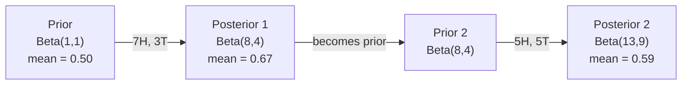

# 贝叶斯定理

> 概率关心你预期什么。贝叶斯定理关心你学到了什么。

**类型：** 构建
**语言：** Python
**先修：** Phase 1, Lesson 06（概率基础）
**时间：** ~75 分钟

## 学习目标

- 运用贝叶斯定理，根据先验、似然和证据计算后验概率
- 从零开始构建一个带有拉普拉斯平滑和对数空间计算的朴素贝叶斯文本分类器
- 比较 MLE 和 MAP 估计，并解释 MAP 如何对应 L2 正则化
- 使用 Beta-Binomial 共轭先验，为 A/B 测试实现序贯贝叶斯更新

## 要解决的问题

一个医学检测有 99% 的准确率。你的检测结果是阳性。你真正患病的概率是多少？

大多数人会说 99%。真实答案取决于这种疾病有多罕见。如果每 10,000 人里只有 1 人患病，那么一次阳性结果只会让你患病的概率变成大约 1%。其余 99% 的阳性结果，都是健康人身上的误报。

这不是脑筋急转弯。这就是贝叶斯定理。每一个垃圾邮件过滤器、每一个医学诊断系统、每一个量化不确定性的机器学习模型，都在使用同一种推理。你先有一个信念。你看到证据。然后更新信念。

如果你在不理解这一点的情况下构建 ML 系统，就会误读模型输出、设置糟糕的阈值，并发布过度自信的预测。

## 核心概念

### 从联合概率到贝叶斯

你已经在第 06 课学过，条件概率是：

```text
P(A|B) = P(A and B) / P(B)
```

对称地：

```text
P(B|A) = P(A and B) / P(A)
```

这两个表达式有同一个分子：P(A and B)。把它们设为相等并整理：

```text
P(A and B) = P(A|B) * P(B) = P(B|A) * P(A)

Therefore:

P(A|B) = P(B|A) * P(A) / P(B)
```

这就是贝叶斯定理。四个量，一个方程。

### 四个组成部分

| 部分 | 名称 | 含义 |
|------|------|------|
| P(A\|B) | 后验 | 看到证据 B 后，你对 A 的更新后信念 |
| P(B\|A) | 似然 | 如果 A 为真，证据 B 出现的概率有多大 |
| P(A) | 先验 | 在看到任何证据之前，你对 A 的信念 |
| P(B) | 证据 | 在所有可能情形下看到 B 的总概率 |

证据项 P(B) 充当归一化因子。你可以用全概率公式展开它：

```text
P(B) = P(B|A) * P(A) + P(B|not A) * P(not A)
```

### 医学检测示例

某种疾病影响每 10,000 人中的 1 人。检测有 99% 的准确率（能抓住 99% 的患病者，但有 1% 的概率给出假阳性）。

```text
P(sick)          = 0.0001     (prior: disease is rare)
P(positive|sick) = 0.99       (likelihood: test catches it)
P(positive|healthy) = 0.01    (false positive rate)

P(positive) = P(positive|sick) * P(sick) + P(positive|healthy) * P(healthy)
            = 0.99 * 0.0001 + 0.01 * 0.9999
            = 0.000099 + 0.009999
            = 0.010098

P(sick|positive) = P(positive|sick) * P(sick) / P(positive)
                 = 0.99 * 0.0001 / 0.010098
                 = 0.0098
                 = 0.98%
```

低于 1%。先验占了主导。当某种状况很罕见时，即使检测很准确，阳性结果也大多是假阳性。这就是医生会要求做确认检测的原因。

### 垃圾邮件过滤器示例

你收到一封包含单词 "lottery" 的邮件。它是垃圾邮件吗？

```text
P(spam)                = 0.3      (30% of email is spam)
P("lottery"|spam)      = 0.05     (5% of spam emails contain "lottery")
P("lottery"|not spam)  = 0.001    (0.1% of legitimate emails contain "lottery")

P("lottery") = 0.05 * 0.3 + 0.001 * 0.7
             = 0.015 + 0.0007
             = 0.0157

P(spam|"lottery") = 0.05 * 0.3 / 0.0157
                  = 0.955
                  = 95.5%
```

一个词就把概率从 30% 推到了 95.5%。真正的垃圾邮件过滤器会同时把贝叶斯方法应用到成百上千个词上。

### 朴素贝叶斯：独立性假设

朴素贝叶斯把这个想法扩展到多个特征：假设在给定类别的条件下，所有特征都是条件独立的。

```text
P(class | feature_1, feature_2, ..., feature_n)
  = P(class) * P(feature_1|class) * P(feature_2|class) * ... * P(feature_n|class)
    / P(feature_1, feature_2, ..., feature_n)
```

"朴素" 指的就是这个独立性假设。在文本中，词的出现并不独立（"New" 和 "York" 是相关的）。但这个假设在实践中表现出奇地好，因为分类器只需要给类别排序，而不一定要产出校准良好的概率。

因为分母对所有类别都相同，所以你可以跳过它，只比较分子：

```text
score(class) = P(class) * product of P(feature_i | class)
```

选择分数最高的类别。

### 最大似然估计（MLE）

你如何从训练数据中得到 P(feature|class)？数数。

```text
P("free"|spam) = (number of spam emails containing "free") / (total spam emails)
```

这就是 MLE：选择让观测数据最可能出现的参数值。你在最大化似然函数；对于离散计数，它会化简成相对频率。

问题是：如果某个词在训练期间从未出现在垃圾邮件中，MLE 会给它分配零概率。一个从未见过的词会让整个乘积归零。用拉普拉斯平滑修复这个问题：

```text
P(word|class) = (count(word, class) + 1) / (total_words_in_class + vocabulary_size)
```

给每个计数都加 1，确保概率永远不会是零。

### 最大后验估计（MAP）

MLE 问：什么参数能最大化 P(data|parameters)？

MAP 问：什么参数能最大化 P(parameters|data)？

根据贝叶斯定理：

```text
P(parameters|data) proportional to P(data|parameters) * P(parameters)
```

MAP 会给参数本身加入一个先验。如果你相信参数应该较小，就把这种信念编码成一个会惩罚大值的先验。这与 ML 中的 L2 正则化完全相同。岭回归中的 "ridge" 惩罚，本质上就是权重上的高斯先验。

| 估计方法 | 优化目标 | ML 中的等价形式 |
|----------|----------|----------------|
| MLE | P(data\|params) | 无正则化训练 |
| MAP | P(data\|params) * P(params) | L2 / L1 正则化 |

### 贝叶斯派 vs 频率派：实践差异

频率派把参数看作固定但未知的量。他们问："如果我重复这个实验很多次，会发生什么？"

贝叶斯派把参数看作分布。他们问："给定我已经观察到的东西，我对这些参数相信什么？"

对于构建 ML 系统，实践差异是：

| 方面 | 频率派 | 贝叶斯派 |
|------|--------|----------|
| 输出 | 点估计 | 值上的分布 |
| 不确定性 | 置信区间（关于过程） | 可信区间（关于参数） |
| 小数据 | 可能过拟合 | 先验充当正则化 |
| 计算 | 通常更快 | 往往需要采样（MCMC） |

大多数生产 ML 是频率派的（SGD、点估计）。当你需要校准良好的不确定性（医学决策、安全关键系统）或数据很少（few-shot learning、cold start）时，贝叶斯方法会发光。

### 为什么贝叶斯思维对 ML 很重要

这种连接比类比更深：

**先验就是正则化。** 权重上的高斯先验就是 L2 正则化。拉普拉斯先验就是 L1。每当你添加一个正则化项，你都在对自己期望的参数值做出贝叶斯陈述。

**后验就是不确定性。** 单个预测概率并不能告诉你模型对这个估计有多自信。贝叶斯方法会给你一个分布："我认为 P(spam) 在 0.8 到 0.95 之间。"

**贝叶斯更新就是在线学习。** 今天的后验会变成明天的先验。当模型看到新数据时，它会增量更新自己的信念，而不是从零开始重新训练。

**模型比较也是贝叶斯的。** 贝叶斯信息准则（BIC）、边际似然和贝叶斯因子，都使用贝叶斯推理在不过拟合的情况下选择模型。

## 动手实现

### Step 1：贝叶斯定理函数

```python
def bayes(prior, likelihood, false_positive_rate):
    evidence = likelihood * prior + false_positive_rate * (1 - prior)
    posterior = likelihood * prior / evidence
    return posterior

result = bayes(prior=0.0001, likelihood=0.99, false_positive_rate=0.01)
print(f"P(sick|positive) = {result:.4f}")
```

### Step 2：朴素贝叶斯分类器

```python
import math
from collections import defaultdict

class NaiveBayes:
    def __init__(self, smoothing=1.0):
        self.smoothing = smoothing
        self.class_counts = defaultdict(int)
        self.word_counts = defaultdict(lambda: defaultdict(int))
        self.class_word_totals = defaultdict(int)
        self.vocab = set()

    def train(self, documents, labels):
        for doc, label in zip(documents, labels):
            self.class_counts[label] += 1
            words = doc.lower().split()
            for word in words:
                self.word_counts[label][word] += 1
                self.class_word_totals[label] += 1
                self.vocab.add(word)

    def predict(self, document):
        words = document.lower().split()
        total_docs = sum(self.class_counts.values())
        vocab_size = len(self.vocab)
        best_class = None
        best_score = float("-inf")
        for cls in self.class_counts:
            score = math.log(self.class_counts[cls] / total_docs)
            for word in words:
                count = self.word_counts[cls].get(word, 0)
                total = self.class_word_totals[cls]
                score += math.log((count + self.smoothing) / (total + self.smoothing * vocab_size))
            if score > best_score:
                best_score = score
                best_class = cls
        return best_class
```

对数概率可以防止下溢。许多很小的概率相乘，会产生小到浮点数难以表示的数。把对数概率相加在数值上更稳定，并且在数学上等价。

### Step 3：用垃圾邮件数据训练

```python
train_docs = [
    "win free money now",
    "free lottery ticket winner",
    "claim your prize today free",
    "urgent offer free cash",
    "congratulations you won free",
    "meeting tomorrow at noon",
    "project update attached",
    "can we schedule a call",
    "quarterly report review",
    "lunch on thursday sounds good",
    "team standup notes attached",
    "please review the pull request",
]

train_labels = [
    "spam", "spam", "spam", "spam", "spam",
    "ham", "ham", "ham", "ham", "ham", "ham", "ham",
]

classifier = NaiveBayes()
classifier.train(train_docs, train_labels)

test_messages = [
    "free money waiting for you",
    "meeting rescheduled to friday",
    "you won a free prize",
    "please review the attached report",
]

for msg in test_messages:
    print(f"  '{msg}' -> {classifier.predict(msg)}")
```

### Step 4：检查学到的概率

```python
def show_top_words(classifier, cls, n=5):
    vocab_size = len(classifier.vocab)
    total = classifier.class_word_totals[cls]
    probs = {}
    for word in classifier.vocab:
        count = classifier.word_counts[cls].get(word, 0)
        probs[word] = (count + classifier.smoothing) / (total + classifier.smoothing * vocab_size)
    sorted_words = sorted(probs.items(), key=lambda x: x[1], reverse=True)
    for word, prob in sorted_words[:n]:
        print(f"    {word}: {prob:.4f}")

print("\nTop spam words:")
show_top_words(classifier, "spam")
print("\nTop ham words:")
show_top_words(classifier, "ham")
```

## 实际使用

Scikit-learn 提供了可用于生产的朴素贝叶斯实现：

```python
from sklearn.feature_extraction.text import CountVectorizer
from sklearn.naive_bayes import MultinomialNB
from sklearn.metrics import classification_report

vectorizer = CountVectorizer()
X_train = vectorizer.fit_transform(train_docs)
clf = MultinomialNB()
clf.fit(X_train, train_labels)

X_test = vectorizer.transform(test_messages)
predictions = clf.predict(X_test)
for msg, pred in zip(test_messages, predictions):
    print(f"  '{msg}' -> {pred}")
```

同一个算法。CountVectorizer 处理分词和词表构建。MultinomialNB 在内部处理平滑和对数概率。你从零写出的版本用 40 行代码做了同样的事。

## 交付成果

这里构建的 NaiveBayes 类展示了完整流水线：分词、带拉普拉斯平滑的概率估计、对数空间预测。`code/bayes.py` 中的代码可以端到端运行，除了 Python 标准库之外没有任何依赖。

### 共轭先验

当先验和后验属于同一个分布族时，这个先验称为“共轭”。这会让贝叶斯更新在代数上很干净：你可以得到闭式后验，不需要数值积分。

| 似然 | 共轭先验 | 后验 | 示例 |
|------|----------|------|------|
| Bernoulli | Beta(a, b) | Beta(a + successes, b + failures) | 估计硬币正面概率 |
| Normal（已知方差） | Normal(mu_0, sigma_0) | Normal(weighted mean, smaller variance) | 传感器校准 |
| Poisson | Gamma(a, b) | Gamma(a + sum of counts, b + n) | 到达率建模 |
| Multinomial | Dirichlet(alpha) | Dirichlet(alpha + counts) | 主题建模、语言模型 |

为什么这很重要：没有共轭先验时，你需要 Monte Carlo 采样或变分推断来近似后验。有了共轭先验，你只需要更新两个数字。

Beta 分布是实践中最常见的共轭先验。Beta(a, b) 表示你对某个概率参数的信念。它的均值是 a/(a+b)。a+b 越大，分布越集中（越有信心）。

Beta 先验的特殊情况：
- Beta(1, 1) = uniform。你对参数没有意见。
- Beta(10, 10) = 在 0.5 附近有峰值。你强烈相信参数接近 0.5。
- Beta(1, 10) = 向 0 偏斜。你相信参数很小。

更新规则极其简单：

```text
Prior:     Beta(a, b)
Data:      s successes, f failures
Posterior: Beta(a + s, b + f)
```

没有积分。没有采样。只有加法。

### 序贯贝叶斯更新

贝叶斯推断天然适合序贯更新。今天的后验变成明天的先验。这就是真实系统如何在不重新处理所有历史数据的情况下增量学习。

具体例子：估计一枚硬币是否公平。

**第 1 天：还没有数据。**
从 Beta(1, 1) 开始，这是一个均匀先验。你没有意见。
- 先验均值：0.5
- 先验在 [0, 1] 上是平坦的

**第 2 天：观察到 7 次正面，3 次反面。**
后验 = Beta(1 + 7, 1 + 3) = Beta(8, 4)
- 后验均值：8/12 = 0.667
- 证据表明硬币偏向正面

**第 3 天：又观察到 5 次正面，5 次反面。**
使用昨天的后验作为今天的先验。
后验 = Beta(8 + 5, 4 + 5) = Beta(13, 9)
- 后验均值：13/22 = 0.591
- 新的均衡数据把估计拉回了 0.5 附近



观察顺序不重要。用全部 12 次正面和 8 次反面一次性更新 Beta(1,1)，会得到 Beta(13, 9)，结果相同。序贯更新和批量更新在数学上等价。但序贯更新让你可以在每一步做决策，而不必存储原始数据。

这是生产 ML 系统中在线学习的基础。用于 bandit 的 Thompson sampling、增量推荐系统和流式异常检测器，都使用这种模式。

### 与 A/B 测试的联系

A/B 测试是披着外衣的贝叶斯推断。

设定：你正在测试两种按钮颜色。变体 A（蓝色）和变体 B（绿色）。你想知道哪个获得更多点击。

贝叶斯 A/B 测试：

1. **先验。** 两个变体都从 Beta(1, 1) 开始。没有先验偏好。
2. **数据。** 变体 A：1000 次浏览中有 50 次点击。变体 B：1000 次浏览中有 65 次点击。
3. **后验。**
   - A：Beta(1 + 50, 1 + 950) = Beta(51, 951)。均值 = 0.051
   - B：Beta(1 + 65, 1 + 935) = Beta(66, 936)。均值 = 0.066
4. **决策。** 计算 P(B > A)，也就是 B 的真实转化率高于 A 的概率。

解析地计算 P(B > A) 很难。但 Monte Carlo 会让它变得很简单：

```text
1. Draw 100,000 samples from Beta(51, 951)  -> samples_A
2. Draw 100,000 samples from Beta(66, 936)  -> samples_B
3. P(B > A) = fraction of samples where B > A
```

如果 P(B > A) > 0.95，就发布变体 B。如果它在 0.05 和 0.95 之间，就继续收集数据。如果 P(B > A) < 0.05，就发布变体 A。

相比频率派 A/B 测试的优势：
- 你得到的是直接的概率陈述："B 有 97% 的概率更好"
- 没有 p-value 混乱。没有“未能拒绝零假设”的犹豫措辞。
- 你可以随时查看结果，而不会抬高假阳性率（没有 "peeking problem"）
- 你可以纳入先验知识（例如，之前的测试显示转化率通常在 3-8%）

| 方面 | 频率派 A/B | 贝叶斯 A/B |
|------|------------|------------|
| 输出 | p-value | P(B > A) |
| 解释 | "如果 A=B，这份数据有多令人惊讶？" | "B 比 A 更好的可能性有多大？" |
| 提前停止 | 会抬高假阳性 | 在任意时刻都安全（前提是先验选得合理且模型设定正确） |
| 先验知识 | 不使用 | 编码为 Beta 先验 |
| 决策规则 | p < 0.05 | P(B > A) > threshold |

## 练习

1. **多次检测。** 一位患者在两次独立检测中都呈阳性（两次检测都 99% 准确，疾病患病率为每 10,000 人 1 例）。两次检测后 P(sick) 是多少？把第一次检测得到的后验作为第二次检测的先验。

2. **平滑的影响。** 用 0.01、0.1、1.0 和 10.0 这些 smoothing 值运行垃圾邮件分类器。最高频词的概率如何变化？当 smoothing=0 且某个词只出现在 ham 中时，会发生什么？

3. **添加特征。** 扩展 NaiveBayes 类，让它除了词计数之外，也使用消息长度（short/long）作为特征。从训练数据中估计 P(short|spam) 和 P(short|ham)，并把它折入预测分数。

4. **手算 MAP。** 给定观测数据（10 次投硬币中有 7 次正面），使用 Beta(2,2) 先验计算偏置的 MAP 估计。将它与 MLE 估计（7/10）比较。

## 关键术语

| 术语 | 人们常说 | 它真正的含义 |
|------|----------|--------------|
| 先验 | "我的初始猜测" | 观察证据之前的 P(hypothesis)。在 ML 中：正则化项。 |
| 似然 | "数据拟合得有多好" | P(evidence\|hypothesis)。在特定假设下，观测数据出现的概率有多大。 |
| 后验 | "我更新后的信念" | P(hypothesis\|evidence)。先验乘以似然，然后归一化。 |
| 证据 | "归一化常数" | 所有假设下的 P(data)。确保后验和为 1。 |
| 朴素贝叶斯 | "那个简单文本分类器" | 一种假设在给定类别后特征彼此独立的分类器。尽管假设不成立，效果仍然很好。 |
| 拉普拉斯平滑 | "加一平滑" | 给每个特征添加一个小计数，防止未见数据产生零概率。 |
| MLE | "直接用频率" | 选择能最大化 P(data\|parameters) 的参数。没有先验。小数据下可能过拟合。 |
| MAP | "带先验的 MLE" | 选择能最大化 P(data\|parameters) * P(parameters) 的参数。等价于正则化 MLE。 |
| 对数概率 | "在 log space 工作" | 使用 log(P) 而不是 P，以避免许多小数相乘时出现浮点下溢。 |
| 假阳性 | "错误警报" | 检测说是阳性，但真实状态是阴性。它会推动基础率谬误。 |

## 延伸阅读

- [3Blue1Brown: Bayes' theorem](https://www.youtube.com/watch?v=HZGCoVF3YvM) - 使用医学检测示例的可视化解释
- [Stanford CS229: Generative Learning Algorithms](https://cs229.stanford.edu/notes2022fall/cs229-notes2.pdf) - 朴素贝叶斯及其与判别式模型的联系
- [Think Bayes](https://greenteapress.com/wp/think-bayes/) - 免费书籍，使用 Python 代码讲解贝叶斯统计
- [scikit-learn Naive Bayes](https://scikit-learn.org/stable/modules/naive_bayes.html) - 生产级实现以及各变体的适用场景
