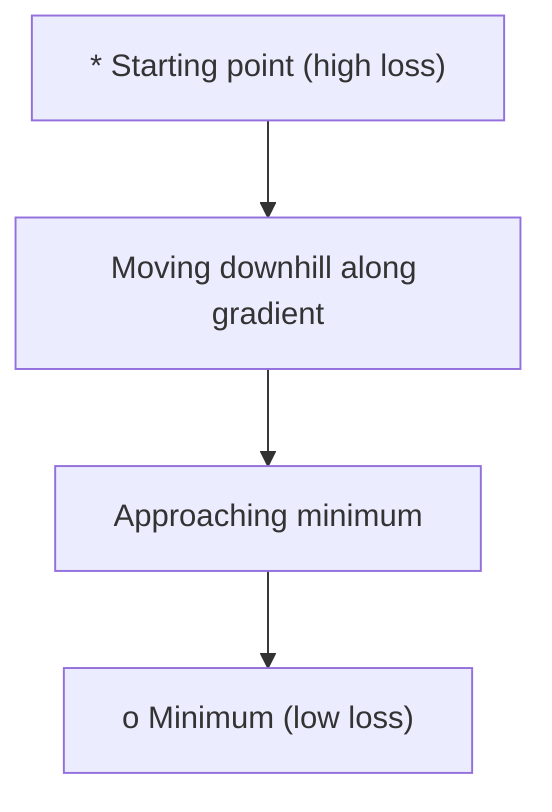
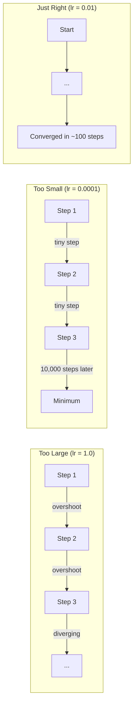
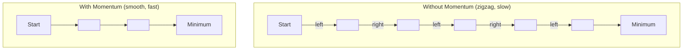
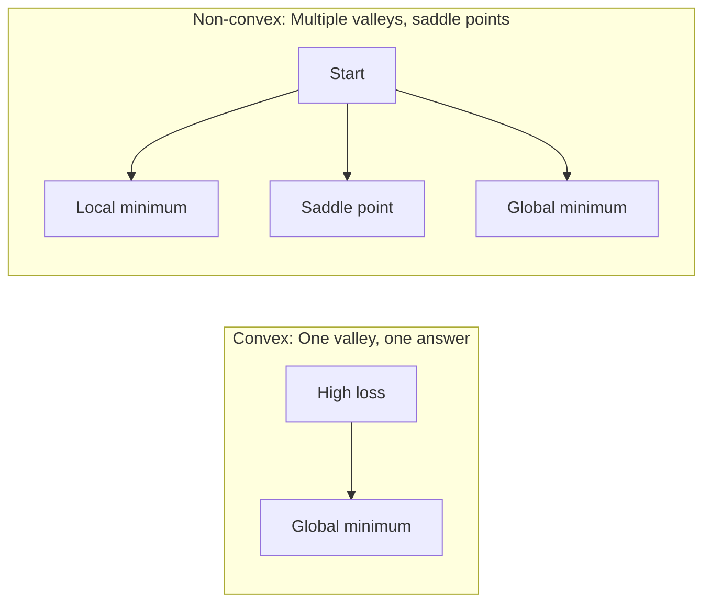
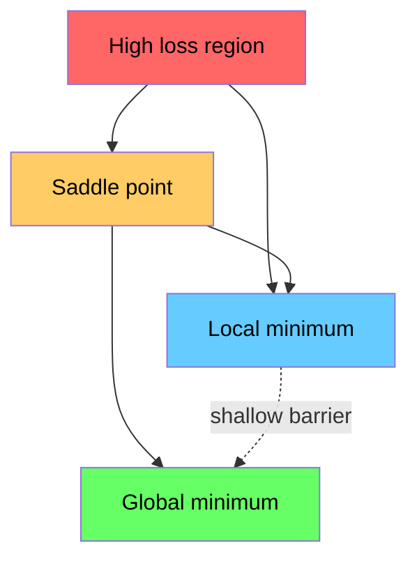

# 优化

> 训练神经网络，本质上只是寻找山谷底部。

**类型：** 构建
**语言：** Python
**先修：** Phase 1, Lessons 04-05 (Derivatives, Gradients)
**时间：** ~75 分钟

## 学习目标

- 从零实现普通梯度下降、带动量的 SGD 和 Adam
- 在 Rosenbrock 函数上比较优化器收敛过程，并解释为什么 Adam 会为每个权重自适应学习率
- 区分凸损失景观和非凸损失景观，并解释鞍点在高维空间中的作用
- 配置学习率调度（step decay、cosine annealing、warmup），提升训练稳定性

## 要解决的问题

你有一个损失函数。它告诉你模型错得有多离谱。你也有梯度。它们告诉你哪个方向会让损失变得更糟。现在你需要一个沿坡下行的策略。

最朴素的方法很简单：朝梯度的反方向移动。用一个叫学习率的数字缩放步长。重复。这就是梯度下降，而且它确实有效。但“有效”有前提。学习率太大，你会直接越过山谷，在两侧谷壁之间来回弹跳。学习率太小，你会用成千上万个没必要的步骤慢慢爬向答案。撞上鞍点时，你甚至会停止移动，尽管还没有找到最小值。

深度学习中的每一种优化器，都在回答同一个问题：怎样更快、更可靠地走到山谷底部？

## 核心概念

### 优化意味着什么

优化就是寻找能让函数最小化（或最大化）的输入值。在机器学习中，这个函数就是损失。输入就是模型的权重。训练就是优化。

```text
minimize L(w) where:
  L = loss function
  w = model weights (could be millions of parameters)
```

### 梯度下降（普通版）

最简单的优化器。计算损失相对于每个权重的梯度。把每个权重沿它自身梯度的反方向移动。用学习率缩放步长。

```text
w = w - lr * gradient
```

这就是完整算法。只有一行。



### 学习率：最重要的超参数

学习率控制步长。它决定了收敛过程中的几乎一切。



不存在一个公式能直接给出正确学习率。你需要通过实验找到它。常见起点：Adam 用 0.001，带动量的 SGD 用 0.01。

### SGD、batch 与 mini-batch

普通梯度下降会先在整个数据集上计算梯度，然后才走一步。这叫 batch gradient descent。它稳定，但很慢。

随机梯度下降（SGD）会在单个随机样本上计算梯度，并立刻更新。它噪声大，但速度快。

Mini-batch gradient descent 折中了两者。先在一个小 batch（32、64、128、256 个样本）上计算梯度，然后更新。这才是实践中几乎所有人真正使用的方式。

| 变体 | Batch 大小 | 梯度质量 | 单步速度 | 噪声 |
|---------|-----------|-----------------|---------------|-------|
| Batch GD | 整个数据集 | 精确 | 慢 | 无 |
| SGD | 1 个样本 | 噪声很大 | 快 | 高 |
| Mini-batch | 32-256 | 良好估计 | 均衡 | 中等 |

SGD 和 mini-batch 中的噪声不是 bug。它能帮助优化器逃离浅层局部最小值和鞍点。

### 动量：沿坡滚下的球

普通梯度下降只看当前梯度。如果梯度来回之字形震荡（在狭窄山谷中很常见），前进会很慢。动量通过把过去的梯度累积到一个速度项中来解决这个问题。

```text
v = beta * v + gradient
w = w - lr * v
```

类比是：一颗沿坡滚下的球。它不会在每个小坑前停下再重新启动。它会在方向一致时积累速度，并抑制震荡。



`beta`（通常是 0.9）控制保留多少历史。更高的 beta 意味着更强的动量、更平滑的路径，但对方向变化的响应更慢。

### Adam：自适应学习率

不同权重需要不同学习率。一个很少收到大梯度的权重，一旦终于收到梯度时应该迈大步。一个持续收到巨大梯度的权重，则应该迈小步。

Adam（Adaptive Moment Estimation）会为每个权重跟踪两件事：

1. 一阶矩（m）：梯度的运行平均值（类似动量）
2. 二阶矩（v）：梯度平方的运行平均值（梯度幅度）

```text
m = beta1 * m + (1 - beta1) * gradient
v = beta2 * v + (1 - beta2) * gradient^2

m_hat = m / (1 - beta1^t)    bias correction
v_hat = v / (1 - beta2^t)    bias correction

w = w - lr * m_hat / (sqrt(v_hat) + epsilon)
```

除以 `sqrt(v_hat)` 是关键洞见。梯度很大的权重会除以一个大数（有效步长变小）。梯度很小的权重会除以一个小数（有效步长变大）。每个权重都会得到自己的自适应学习率。

默认超参数：`lr=0.001, beta1=0.9, beta2=0.999, epsilon=1e-8`。这些默认值对大多数问题都很好用。

### 学习率调度

固定学习率是一种折中。训练早期，你希望用大步快速前进。训练后期，你希望用小步在最小值附近精细调整。

常见调度：

| 调度 | 公式 | 使用场景 |
|----------|---------|----------|
| Step decay | lr = lr * factor every N epochs | 简单、手动控制 |
| Exponential decay | lr = lr_0 * decay^t | 平滑降低 |
| Cosine annealing | lr = lr_min + 0.5 * (lr_max - lr_min) * (1 + cos(pi * t / T)) | Transformers、现代训练 |
| Warmup + decay | Linear ramp up, then decay | 大模型，防止早期不稳定 |

### 凸与非凸

凸函数只有一个最小值。梯度下降总能找到它。像 `f(x) = x^2` 这样的二次函数就是凸函数。

神经网络的损失函数是非凸的。它们有许多局部最小值、鞍点和平坦区域。



实践中，高维神经网络里的局部最小值通常不是问题。多数局部最小值的损失值都接近全局最小值。真正的障碍是鞍点（某些方向上平坦，另一些方向上弯曲）。动量和 mini-batch 带来的噪声能帮助优化器逃离它们。

### 损失景观可视化

损失是所有权重的函数。对于一个有 100 万个权重的模型，损失景观存在于 1,000,001 维空间里。我们通过在权重空间中挑选两个随机方向，并沿这些方向绘制损失，把它可视化成一个 2D 曲面。



尖锐最小值的泛化能力较差。平坦最小值的泛化能力较好。这就是带动量的 SGD 在最终测试准确率上常常胜过 Adam 的原因之一：它的噪声能防止优化器落入尖锐最小值。

## 动手实现

### Step 1：定义测试函数

Rosenbrock 函数是经典优化基准。它的最小值位于一个狭窄弯曲山谷中的 (1, 1)：这个山谷容易找到，却很难沿着走。

```text
f(x, y) = (1 - x)^2 + 100 * (y - x^2)^2
```

```python
def rosenbrock(params):
    x, y = params
    return (1 - x) ** 2 + 100 * (y - x ** 2) ** 2

def rosenbrock_gradient(params):
    x, y = params
    df_dx = -2 * (1 - x) + 200 * (y - x ** 2) * (-2 * x)
    df_dy = 200 * (y - x ** 2)
    return [df_dx, df_dy]
```

### Step 2：普通梯度下降

```python
class GradientDescent:
    def __init__(self, lr=0.001):
        self.lr = lr

    def step(self, params, grads):
        return [p - self.lr * g for p, g in zip(params, grads)]
```

### Step 3：带动量的 SGD

```python
class SGDMomentum:
    def __init__(self, lr=0.001, momentum=0.9):
        self.lr = lr
        self.momentum = momentum
        self.velocity = None

    def step(self, params, grads):
        if self.velocity is None:
            self.velocity = [0.0] * len(params)
        self.velocity = [
            self.momentum * v + g
            for v, g in zip(self.velocity, grads)
        ]
        return [p - self.lr * v for p, v in zip(params, self.velocity)]
```

### Step 4：Adam

```python
class Adam:
    def __init__(self, lr=0.001, beta1=0.9, beta2=0.999, epsilon=1e-8):
        self.lr = lr
        self.beta1 = beta1
        self.beta2 = beta2
        self.epsilon = epsilon
        self.m = None
        self.v = None
        self.t = 0

    def step(self, params, grads):
        if self.m is None:
            self.m = [0.0] * len(params)
            self.v = [0.0] * len(params)

        self.t += 1

        self.m = [
            self.beta1 * m + (1 - self.beta1) * g
            for m, g in zip(self.m, grads)
        ]
        self.v = [
            self.beta2 * v + (1 - self.beta2) * g ** 2
            for v, g in zip(self.v, grads)
        ]

        m_hat = [m / (1 - self.beta1 ** self.t) for m in self.m]
        v_hat = [v / (1 - self.beta2 ** self.t) for v in self.v]

        return [
            p - self.lr * mh / (vh ** 0.5 + self.epsilon)
            for p, mh, vh in zip(params, m_hat, v_hat)
        ]
```

### Step 5：运行并比较

```python
def optimize(optimizer, func, grad_func, start, steps=5000):
    params = list(start)
    history = [params[:]]
    for _ in range(steps):
        grads = grad_func(params)
        params = optimizer.step(params, grads)
        history.append(params[:])
    return history

start = [-1.0, 1.0]

gd_history = optimize(GradientDescent(lr=0.0005), rosenbrock, rosenbrock_gradient, start)
sgd_history = optimize(SGDMomentum(lr=0.0001, momentum=0.9), rosenbrock, rosenbrock_gradient, start)
adam_history = optimize(Adam(lr=0.01), rosenbrock, rosenbrock_gradient, start)

for name, history in [("GD", gd_history), ("SGD+M", sgd_history), ("Adam", adam_history)]:
    final = history[-1]
    loss = rosenbrock(final)
    print(f"{name:6s} -> x={final[0]:.6f}, y={final[1]:.6f}, loss={loss:.8f}")
```

预期输出：Adam 收敛最快。带动量的 SGD 路径更平滑。普通 GD 沿狭窄山谷前进得很慢。

## 实际使用

实践中，请使用 PyTorch 或 JAX 优化器。它们会处理 parameter groups、weight decay、gradient clipping 和 GPU acceleration。

```python
import torch

model = torch.nn.Linear(784, 10)

sgd = torch.optim.SGD(model.parameters(), lr=0.01, momentum=0.9)
adam = torch.optim.Adam(model.parameters(), lr=0.001)
adamw = torch.optim.AdamW(model.parameters(), lr=0.001, weight_decay=0.01)

scheduler = torch.optim.lr_scheduler.CosineAnnealingLR(adam, T_max=100)
```

经验法则：

- 从 Adam（lr=0.001）开始。它对大多数问题都无需太多调参。
- 当你需要最佳最终准确率，并且能承担更多调参成本时，切换到带动量的 SGD（lr=0.01, momentum=0.9）。
- 对 transformers 使用 AdamW（带解耦 weight decay 的 Adam）。
- 训练超过少数几个 epoch 时，始终使用学习率调度。
- 如果训练不稳定，就降低学习率。如果训练太慢，就提高学习率。

## 交付成果

本课会产出一个用于选择合适优化器的 prompt。见 `outputs/prompt-optimizer-guide.md`。

这里构建的优化器类会在 Phase 3 从零训练神经网络时再次出现。

## 练习

1. **学习率扫描。** 在 Rosenbrock 函数上用学习率 [0.0001, 0.0005, 0.001, 0.005, 0.01] 运行普通梯度下降。绘制或打印每个学习率在 5000 步后的最终损失。找出仍能收敛的最大学习率。

2. **动量比较。** 在 Rosenbrock 函数上分别使用动量值 [0.0, 0.5, 0.9, 0.99] 运行 SGD。跟踪每一步的损失。哪个动量值收敛最快？哪个会越过目标？

3. **逃离鞍点。** 定义函数 `f(x, y) = x^2 - y^2`（原点处有一个鞍点）。从 (0.01, 0.01) 开始。比较普通 GD、带动量的 SGD 和 Adam 的行为。哪一个会逃离鞍点？

4. **实现学习率衰减。** 给 GradientDescent 类添加指数衰减调度：`lr = lr_0 * 0.999^step`。在 Rosenbrock 函数上比较有无衰减时的收敛表现。

## 关键术语

| 术语 | 人们常说 | 实际含义 |
|------|----------------|----------------------|
| Gradient descent | “沿坡下行” | 用学习率缩放梯度，然后从权重中减去它。最基础的优化器。 |
| Learning rate | “步长” | 一个标量，控制每次更新会让权重移动多远。太大会导致发散。太小会浪费计算。 |
| Momentum | “保持滚动” | 把过去的梯度累积成速度向量。抑制震荡，并在方向一致时加速移动。 |
| SGD | “随机采样” | 随机梯度下降。用随机子集而不是完整数据集计算梯度。实践中几乎总是指 mini-batch SGD。 |
| Mini-batch | “一块数据” | 用于估计梯度的一小部分训练数据（32-256 个样本）。在速度和梯度准确性之间取得平衡。 |
| Adam | “默认优化器” | Adaptive Moment Estimation。跟踪每个权重的梯度运行平均值和梯度平方运行平均值，为每个权重分配自己的学习率。 |
| Bias correction | “修正冷启动” | Adam 的一阶矩和二阶矩初始化为零。Bias correction 会除以 (1 - beta^t)，补偿早期步骤中的偏差。 |
| Learning rate schedule | “随时间改变 lr” | 训练期间调整学习率的函数。早期大步，后期小步。 |
| Convex function | “一个山谷” | 任意局部最小值都是全局最小值的函数。梯度下降总能找到它。神经网络损失不是凸的。 |
| Saddle point | “平坦但不是最小值” | 梯度为零的点，但它在某些方向上是最小值，在另一些方向上是最大值。高维空间中很常见。 |
| Loss landscape | “地形” | 在权重空间上绘制出的损失函数。通常通过沿两个随机方向切片来可视化。 |
| Convergence | “到达那里” | 优化器已经到达一个点，继续更新也不会显著降低损失。 |

## 延伸阅读

- [Sebastian Ruder：梯度下降优化算法概览](https://ruder.io/optimizing-gradient-descent/) - 对主要优化器的全面综述
- [Why Momentum Really Works (Distill)](https://distill.pub/2017/momentum/) - 动量动态的交互式可视化
- [Adam: A Method for Stochastic Optimization (Kingma & Ba, 2014)](https://arxiv.org/abs/1412.6980) - Adam 原始论文，可读且简短
- [Visualizing the Loss Landscape of Neural Nets (Li et al., 2018)](https://arxiv.org/abs/1712.09913) - 展示尖锐最小值与平坦最小值差异的论文
