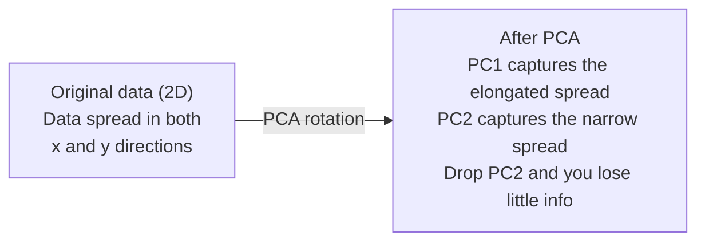

# 降维

> 高维数据有自己的结构。换一个正确的角度，你就能看见它。

**类型：** 构建
**语言：** Python
**先修：** 第 1 阶段，第 01 课（线性代数直觉）、第 02 课（向量、矩阵与运算）、第 03 课（特征值与特征向量）、第 06 课（概率与分布）
**时间：** 约 90 分钟

## 学习目标

- 从零实现 PCA：数据中心化、计算协方差矩阵、特征分解，并完成投影
- 使用解释方差比和肘部法选择主成分数量
- 比较 PCA、t-SNE 和 UMAP 在 MNIST 数字 2D 可视化中的表现，并解释它们的取舍
- 使用带 RBF 核的核 PCA 分离标准 PCA 无法处理的非线性数据结构

## 要解决的问题

你有一个数据集，每个样本有 784 个特征。它可能是手写数字的像素值，可能是基因表达水平，也可能是用户行为信号。你无法可视化 784 维，无法把它们画出来，甚至很难在脑中想象它们。

但这 784 个特征中的大多数都是冗余的。真正的信息存在于一个小得多的表面上。一个手写的“7”不需要 784 个彼此独立的数字来描述。它只需要少数几个：笔画角度、横杠长度、倾斜程度。其他部分大多是噪声。

降维会找到这个更小的表面。它把你的 784 维数据压缩到 2、10 或 50 维，同时保留真正重要的结构。

## 核心概念

### 维度灾难

高维空间很反直觉。随着维度增长，有三件事会失效。

**距离会变得没有意义。** 在高维中，任意两个随机点之间的距离会收敛到相近的值。如果每个点到其他点的距离都差不多，最近邻搜索就会失效。

```text
Dimension    Avg distance ratio (max/min between random points)
2            ~5.0
10           ~1.8
100          ~1.2
1000         ~1.02
```

**体积会集中到角落。** d 维单位超立方体有 2^d 个角。在 100 维中，几乎所有体积都位于远离中心的角落。数据点会扩散到边缘，而模型在内部区域得不到足够数据。

**你需要指数级更多的数据。** 如果要在空间中维持相同的样本密度，从 2D 到 20D 意味着需要 10^18 倍的数据。你永远不会有那么多。降低维度会把数据密度带回可处理的范围。

### PCA：找到重要方向

主成分分析（Principal Component Analysis，PCA）会找到数据变化最大的轴。它旋转你的坐标系，让第一条轴捕获最多方差，第二条轴捕获次多方差，依此类推。

算法如下：

```text
1. Center the data        (subtract the mean from each feature)
2. Compute covariance     (how features move together)
3. Eigendecomposition     (find the principal directions)
4. Sort by eigenvalue     (biggest variance first)
5. Project               (keep top k eigenvectors, drop the rest)
```

为什么要做特征分解？协方差矩阵是对称且半正定的。它的特征向量是特征空间中的正交方向。特征值告诉你每个方向捕获了多少方差。最大特征值对应的特征向量指向最大方差方向。



- **PCA 之前：** 数据云沿对角线分布，同时跨越 x 和 y 轴
- **PCA 之后：** 坐标系被旋转，使 PC1 对齐最大方差方向（拉长的扩散方向），PC2 对齐最小方差方向（较窄的扩散方向）
- **降维：** 丢弃 PC2 会把数据投影到 PC1 上，只损失很少信息

### 解释方差比

每个主成分都会捕获总方差的一部分。解释方差比告诉你捕获了多少。

```text
Component    Eigenvalue    Explained ratio    Cumulative
PC1          4.73          0.473              0.473
PC2          2.51          0.251              0.724
PC3          1.12          0.112              0.836
PC4          0.89          0.089              0.925
...
```

当累计解释方差达到 0.95 时，你就知道这些成分捕获了 95% 的信息。之后的部分大多是噪声。

### 选择主成分数量

三种策略：

1. **阈值。** 保留足够多的成分，让它们解释 90-95% 的方差。
2. **肘部法。** 绘制每个成分的解释方差，寻找突然下降的位置。
3. **下游性能。** 把 PCA 作为预处理。遍历 k 并测量模型准确率。最佳 k 通常是准确率进入平台期的位置。

### t-SNE：保留邻域

t-分布随机邻域嵌入（t-Distributed Stochastic Neighbor Embedding，t-SNE）是为可视化设计的。它把高维数据映射到 2D（或 3D），同时保留哪些点彼此接近。

直觉是：在原始空间中，根据点对之间的距离计算一个概率分布。近的点获得高概率，远的点获得低概率。然后寻找一种 2D 排布，让同样的概率分布尽可能成立。784 维中的邻居在 2D 中仍然保持邻近。

t-SNE 的关键特性：
- 非线性。它可以展开 PCA 无法处理的复杂流形。
- 随机性。不同运行会产生不同布局。
- perplexity 参数控制要考虑多少邻居（典型范围：5-50）。
- 输出中簇与簇之间的距离没有意义。只有簇本身有意义。
- 在大数据集上较慢。默认复杂度为 O(n^2)。

### UMAP：更快，并保留更好的全局结构

均匀流形近似与投影（Uniform Manifold Approximation and Projection，UMAP）的工作方式与 t-SNE 类似，但有两个优势：
- 更快。它使用近似最近邻图，而不是计算所有点对距离。
- 更好的全局结构。输出中簇的相对位置通常比 t-SNE 更有意义。

UMAP 会在高维空间中构建一个加权图（“模糊拓扑表示”），然后寻找一个低维布局，尽可能保留这个图。

关键参数：
- `n_neighbors`：定义局部结构的邻居数量（类似 perplexity）。值越高，越能保留全局结构。
- `min_dist`：输出中点聚集得有多紧。值越低，簇越密集。

### 什么时候用哪一种

| 方法 | 使用场景 | 保留内容 | 速度 |
|------|----------|----------|------|
| PCA | 训练前预处理 | 全局方差 | 快（精确），可处理数百万样本 |
| PCA | 快速探索性可视化 | 线性结构 | 快 |
| t-SNE | 发表级 2D 图 | 局部邻域 | 慢（理想情况下少于 10k 样本） |
| UMAP | 大规模 2D 可视化 | 局部结构 + 一部分全局结构 | 中等（可处理数百万样本） |
| PCA | 模型特征降维 | 按方差排序的特征 | 快 |
| t-SNE / UMAP | 理解簇结构 | 簇分离 | 中等到慢 |

经验法则：用 PCA 做预处理和数据压缩。需要在 2D 中可视化结构时，用 t-SNE 或 UMAP。

### 核 PCA

标准 PCA 寻找线性子空间。它旋转坐标系并丢弃一些轴。但如果数据位于非线性流形上怎么办？2D 中的圆无法用任何一条直线分开。标准 PCA 帮不上忙。

核 PCA 会在由核函数诱导出的高维特征空间中应用 PCA，同时不显式计算该空间中的坐标。这就是核技巧，也就是 SVM 背后的同一个思想。

算法如下：
1. 计算核矩阵 K，其中 K_ij = k(x_i, x_j)
2. 在特征空间中中心化核矩阵
3. 对中心化后的核矩阵做特征分解
4. 顶部特征向量（按 1/sqrt(eigenvalue) 缩放）就是投影结果

常见核函数：

| 核 | 公式 | 适合场景 |
|----|------|----------|
| RBF (Gaussian) | exp(-gamma * \|\|x - y\|\|^2) | 大多数非线性数据、平滑流形 |
| Polynomial | (x . y + c)^d | 多项式关系 |
| Sigmoid | tanh(alpha * x . y + c) | 类似神经网络的映射 |

什么时候用核 PCA，而不是标准 PCA：

| 标准 | 标准 PCA | 核 PCA |
|------|----------|--------|
| 数据结构 | 线性子空间 | 非线性流形 |
| 速度 | O(min(n^2 d, d^2 n)) | O(n^2 d + n^3) |
| 可解释性 | 成分是特征的线性组合 | 成分缺少直接的特征解释 |
| 可扩展性 | 可处理数百万样本 | 核矩阵是 n x n，受内存限制 |
| 重建 | 直接逆变换 | 需要前像近似 |

经典例子是 2D 中的同心圆。两圈点，一圈在另一圈内部。标准 PCA 会把两圈都投影到同一条线上，对分类毫无帮助。带 RBF 核的核 PCA 会把内圈和外圈映射到不同区域，使它们变得线性可分。

### 重建误差

你的降维效果有多好？你把 784 维压缩到了 50 维。你损失了什么？

测量重建误差：
1. 将数据投影到 k 维：X_reduced = X @ W_k
2. 重建：X_hat = X_reduced @ W_k^T
3. 计算 MSE：mean((X - X_hat)^2)

对 PCA 来说，重建误差和解释方差有清晰关系：

```text
Reconstruction error = sum of eigenvalues NOT included
Total variance = sum of ALL eigenvalues
Fraction lost = (sum of dropped eigenvalues) / (sum of all eigenvalues)
```

每个成分的解释方差比是：

```text
explained_ratio_k = eigenvalue_k / sum(all eigenvalues)
```

把累计解释方差随成分数量变化画出来，就得到“肘部”曲线。合适的成分数量通常出现在：
- 曲线变平（边际收益递减）
- 累计方差越过你的阈值（通常是 0.90 或 0.95）
- 下游任务性能进入平台期

重建误差不只适合选择 k。你也可以用它做异常检测：重建误差高的样本是不符合已学习子空间的离群点。这是生产系统中基于 PCA 的异常检测的基础。

## 动手实现

### 第 1 步：从零实现 PCA

```python
import numpy as np

class PCA:
    def __init__(self, n_components):
        self.n_components = n_components
        self.components = None
        self.mean = None
        self.eigenvalues = None
        self.explained_variance_ratio_ = None

    def fit(self, X):
        self.mean = np.mean(X, axis=0)
        X_centered = X - self.mean

        cov_matrix = np.cov(X_centered, rowvar=False)

        eigenvalues, eigenvectors = np.linalg.eigh(cov_matrix)

        sorted_idx = np.argsort(eigenvalues)[::-1]
        eigenvalues = eigenvalues[sorted_idx]
        eigenvectors = eigenvectors[:, sorted_idx]

        self.components = eigenvectors[:, :self.n_components].T
        self.eigenvalues = eigenvalues[:self.n_components]
        total_var = np.sum(eigenvalues)
        self.explained_variance_ratio_ = self.eigenvalues / total_var

        return self

    def transform(self, X):
        X_centered = X - self.mean
        return X_centered @ self.components.T

    def fit_transform(self, X):
        self.fit(X)
        return self.transform(X)
```

### 第 2 步：在合成数据上测试

```python
np.random.seed(42)
n_samples = 500

t = np.random.uniform(0, 2 * np.pi, n_samples)
x1 = 3 * np.cos(t) + np.random.normal(0, 0.2, n_samples)
x2 = 3 * np.sin(t) + np.random.normal(0, 0.2, n_samples)
x3 = 0.5 * x1 + 0.3 * x2 + np.random.normal(0, 0.1, n_samples)

X_synthetic = np.column_stack([x1, x2, x3])

pca = PCA(n_components=2)
X_reduced = pca.fit_transform(X_synthetic)

print(f"Original shape: {X_synthetic.shape}")
print(f"Reduced shape:  {X_reduced.shape}")
print(f"Explained variance ratios: {pca.explained_variance_ratio_}")
print(f"Total variance captured: {sum(pca.explained_variance_ratio_):.4f}")
```

### 第 3 步：MNIST 数字的 2D 表示

```python
from sklearn.datasets import fetch_openml

mnist = fetch_openml("mnist_784", version=1, as_frame=False, parser="auto")
X_mnist = mnist.data[:5000].astype(float)
y_mnist = mnist.target[:5000].astype(int)

pca_mnist = PCA(n_components=50)
X_pca50 = pca_mnist.fit_transform(X_mnist)
print(f"50 components capture {sum(pca_mnist.explained_variance_ratio_):.2%} of variance")

pca_2d = PCA(n_components=2)
X_pca2d = pca_2d.fit_transform(X_mnist)
print(f"2 components capture {sum(pca_2d.explained_variance_ratio_):.2%} of variance")
```

### 第 4 步：与 sklearn 比较

```python
from sklearn.decomposition import PCA as SklearnPCA
from sklearn.manifold import TSNE

sklearn_pca = SklearnPCA(n_components=2)
X_sklearn_pca = sklearn_pca.fit_transform(X_mnist)

print(f"\nOur PCA explained variance:     {pca_2d.explained_variance_ratio_}")
print(f"Sklearn PCA explained variance: {sklearn_pca.explained_variance_ratio_}")

diff = np.abs(np.abs(X_pca2d) - np.abs(X_sklearn_pca))
print(f"Max absolute difference: {diff.max():.10f}")

tsne = TSNE(n_components=2, perplexity=30, random_state=42)
X_tsne = tsne.fit_transform(X_mnist)
print(f"\nt-SNE output shape: {X_tsne.shape}")
```

### 第 5 步：UMAP 比较

```python
try:
    from umap import UMAP

    reducer = UMAP(n_components=2, n_neighbors=15, min_dist=0.1, random_state=42)
    X_umap = reducer.fit_transform(X_mnist)
    print(f"UMAP output shape: {X_umap.shape}")
except ImportError:
    print("Install umap-learn: pip install umap-learn")
```

## 实际使用

把 PCA 用作分类器前的预处理：

```python
from sklearn.decomposition import PCA as SklearnPCA
from sklearn.linear_model import LogisticRegression
from sklearn.model_selection import train_test_split
from sklearn.metrics import accuracy_score

X_train, X_test, y_train, y_test = train_test_split(
    X_mnist, y_mnist, test_size=0.2, random_state=42
)

results = {}
for k in [10, 30, 50, 100, 200]:
    pca_k = SklearnPCA(n_components=k)
    X_tr = pca_k.fit_transform(X_train)
    X_te = pca_k.transform(X_test)

    clf = LogisticRegression(max_iter=1000, random_state=42)
    clf.fit(X_tr, y_train)
    acc = accuracy_score(y_test, clf.predict(X_te))
    var_captured = sum(pca_k.explained_variance_ratio_)
    results[k] = (acc, var_captured)
    print(f"k={k:>3d}  accuracy={acc:.4f}  variance={var_captured:.4f}")
```

性能通常会在远小于 784 维的位置进入平台期。那个平台期就是你的运行点。

## 交付成果

本课产出：
- `outputs/skill-dimensionality-reduction.md` - 一个用于为给定任务选择合适降维技术的技能

## 练习

1. 修改 PCA 类以支持 `inverse_transform`。分别用 10、50 和 200 个成分重建 MNIST 数字。打印每种情况的重建误差（与原始数据的均方差）。

2. 在同一个 MNIST 子集上运行 t-SNE，perplexity 分别取 5、30 和 100。描述输出如何变化。为什么 perplexity 会影响簇的紧密程度？

3. 使用一个有 50 个特征但只有 5 个特征有信息量的数据集（用 `sklearn.datasets.make_classification` 生成）。应用 PCA，并检查解释方差曲线是否正确识别出数据实际上是 5 维的。

## 关键术语

| 术语 | 常见说法 | 实际含义 |
|------|----------|----------|
| 维度灾难 | “特征太多” | 随着维度增长，距离、体积和数据密度都会以反直觉的方式变化。模型需要指数级更多的数据来补偿。 |
| PCA | “降低维度” | 旋转坐标系，让各轴对齐最大方差方向，然后丢弃低方差轴。 |
| 主成分 | “一个重要方向” | 协方差矩阵的一个特征向量。它是特征空间中数据变化最大的方向。 |
| 解释方差比 | “这个成分有多少信息” | 一个主成分捕获的总方差比例。把前 k 个比例相加，就能看到 k 个成分保留了多少信息。 |
| 协方差矩阵 | “特征如何相关” | 一个对称矩阵，其中条目 (i,j) 衡量 feature i 和 feature j 如何共同变化。对角线条目是各个特征自身的方差。 |
| t-SNE | “那个聚类图” | 一种非线性方法，通过保留点对邻域概率，把高维数据映射到 2D。适合可视化，不适合预处理。 |
| UMAP | “更快的 t-SNE” | 一种基于拓扑数据分析的非线性方法。它既保留局部结构，也保留一部分全局结构，比 t-SNE 更易扩展。 |
| Perplexity | “t-SNE 的一个旋钮” | 控制每个点考虑的有效邻居数量。低 perplexity 聚焦很局部的结构，高 perplexity 捕获更宽范围的模式。 |
| 流形 | “数据所在的表面” | 嵌入在高维空间中的低维表面。一张在 3D 中揉皱的纸仍然是一个 2D 流形。 |

## 延伸阅读

- [A Tutorial on Principal Component Analysis](https://arxiv.org/abs/1404.1100)（Shlens）- 从基础出发清晰推导 PCA
- [How to Use t-SNE Effectively](https://distill.pub/2016/misread-tsne/)（Wattenberg 等）- 关于 t-SNE 陷阱和参数选择的交互式指南
- [UMAP documentation](https://umap-learn.readthedocs.io/) - UMAP 作者提供的理论和实践指南
