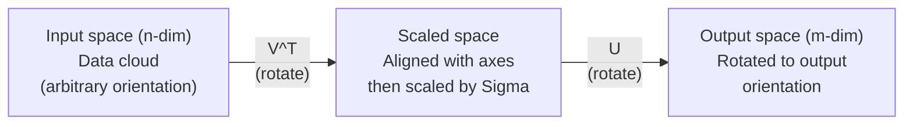
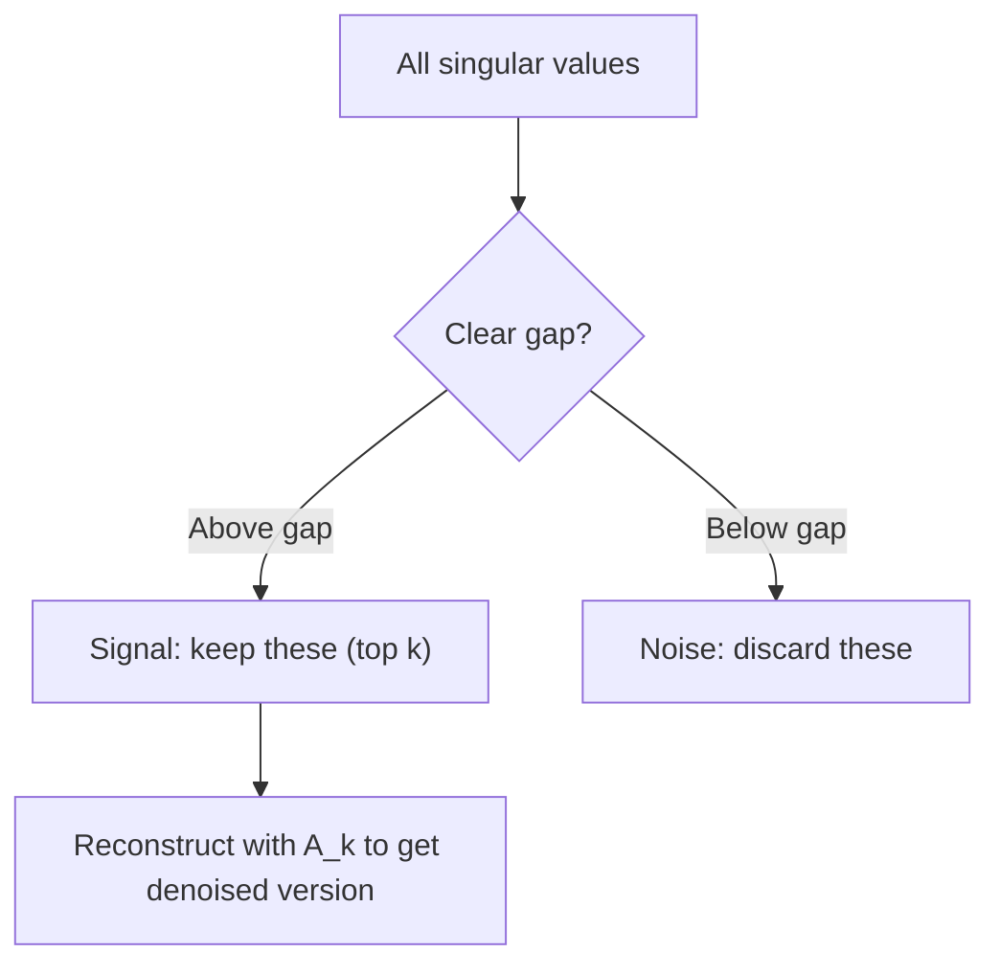

# 奇异值分解

> SVD 是线性代数里的瑞士军刀。每个矩阵都有一个 SVD。每个数据科学家都需要理解它。

**Type:** Build
**Languages:** Python, Julia
**Prerequisites:** Phase 1, Lessons 01 (Linear Algebra Intuition), 02 (Vectors & Matrices Operations), 03 (Matrix Transformations)
**Time:** ~120 minutes

## 学习目标

- 通过幂迭代实现 SVD，并解释 U、Sigma 和 V^T 的几何意义
- 将截断 SVD 用于图像压缩，并衡量压缩率与重构误差之间的关系
- 通过 SVD 计算 Moore-Penrose 伪逆，用来求解超定最小二乘系统
- 将 SVD 与 PCA、推荐系统（latent factors）以及 NLP 中的 Latent Semantic Analysis 联系起来

## 要解决的问题

你有一个 1000x2000 的矩阵。它可能是用户-电影评分矩阵，可能是文档-词频表，也可能是一张图像的像素值。你需要压缩它、去噪、发现其中隐藏的结构，或者用它求解一个最小二乘系统。特征分解只适用于方阵。即便是方阵，它还要求矩阵拥有一整组线性无关的特征向量。

SVD 适用于任意矩阵。任意形状。任意秩。不需要额外条件。它把矩阵分解成三个因子，揭示这个矩阵对空间所做变换的几何结构。它是整个线性代数中最通用、也最有用的分解。

## 核心概念

### SVD 在几何上做了什么

任何矩阵，无论形状如何，都会依次执行三个操作：旋转、缩放、旋转。SVD 把这个分解显式地写了出来。

```text
A = U * Sigma * V^T

      m x n     m x m    m x n    n x n
     (any)    (rotate)  (scale)  (rotate)
```

给定任意矩阵 A，SVD 将它分解为：
- V^T 在输入空间（n 维）中旋转向量
- Sigma 沿各个轴进行缩放（拉伸或压缩）
- U 将结果旋转到输出空间（m 维）中



可以这样理解：你把一个矩阵交给 SVD。它会告诉你：“这个矩阵会把输入球体先用 V^T 旋转，再用 Sigma 拉伸成一个椭球，最后用 U 旋转这个椭球。”奇异值就是这个椭球各条轴的长度。

### 完整分解

对于形状为 m x n 的矩阵 A：

```text
A = U * Sigma * V^T

where:
  U     is m x m, orthogonal (U^T U = I)
  Sigma is m x n, diagonal (singular values on the diagonal)
  V     is n x n, orthogonal (V^T V = I)

The singular values sigma_1 >= sigma_2 >= ... >= sigma_r > 0
where r = rank(A)
```

U 的列称为左奇异向量。V 的列称为右奇异向量。Sigma 的对角线元素称为奇异值。它们始终非负，并且通常按降序排列。

### 左奇异向量、奇异值、右奇异向量

SVD 的每个组成部分都有明确的几何含义。

**右奇异向量（V 的列）：** 它们构成输入空间（R^n）的一组标准正交基。它们是在输入空间中会被矩阵映射到输出空间中正交方向的那些方向。可以把它们看作定义域的自然坐标系。

**奇异值（Sigma 的对角线）：** 它们是缩放因子。第 i 个奇异值告诉你，矩阵会沿第 i 个右奇异向量方向把向量拉伸多少。奇异值为零表示矩阵会把这个方向完全压扁。

**左奇异向量（U 的列）：** 它们构成输出空间（R^m）的一组标准正交基。第 i 个左奇异向量是第 i 个右奇异向量经过缩放后落在输出空间中的方向。

它们之间的关系是：

```text
A * v_i = sigma_i * u_i

The matrix A takes the i-th right singular vector v_i,
scales it by sigma_i, and maps it to the i-th left singular vector u_i.
```

这给出了任意矩阵行为的逐坐标图像。

### 外积形式

SVD 可以写成若干个 rank-1 矩阵之和：

```text
A = sigma_1 * u_1 * v_1^T + sigma_2 * u_2 * v_2^T + ... + sigma_r * u_r * v_r^T

Each term sigma_i * u_i * v_i^T is a rank-1 matrix (an outer product).
The full matrix is the sum of r such matrices, where r is the rank.
```

这种形式是低秩近似的基础。每一项都添加一层结构。第一项捕捉最重要的单一模式。第二项捕捉下一个最重要的模式。依此类推。截断这个求和，就能在给定秩下得到可能的最佳近似。

```text
Rank-1 approx:    A_1 = sigma_1 * u_1 * v_1^T
                  (captures the dominant pattern)

Rank-2 approx:    A_2 = sigma_1 * u_1 * v_1^T + sigma_2 * u_2 * v_2^T
                  (captures the two most important patterns)

Rank-k approx:    A_k = sum of top k terms
                  (optimal by the Eckart-Young theorem)
```

### 与特征分解的关系

SVD 和特征分解有很深的联系。A 的奇异值和奇异向量直接来自 A^T A 与 A A^T 的特征值和特征向量。

```text
A^T A = V * Sigma^T * U^T * U * Sigma * V^T
      = V * Sigma^T * Sigma * V^T
      = V * D * V^T

where D = Sigma^T * Sigma is a diagonal matrix with sigma_i^2 on the diagonal.

So:
- The right singular vectors (V) are eigenvectors of A^T A
- The singular values squared (sigma_i^2) are eigenvalues of A^T A

Similarly:
A A^T = U * Sigma * V^T * V * Sigma^T * U^T
      = U * Sigma * Sigma^T * U^T

So:
- The left singular vectors (U) are eigenvectors of A A^T
- The eigenvalues of A A^T are also sigma_i^2
```

这个联系说明了三件事：
1. 奇异值始终是实数且非负（它们是正半定矩阵特征值的平方根）。
2. 你可以通过对 A^T A 做特征分解来计算 SVD，但这会让条件数平方，从而损失数值精度。专门的 SVD 算法会避免这个问题。
3. 当 A 是方阵且对称正半定时，SVD 和特征分解是同一件事。

### 截断 SVD：低秩近似

Eckart-Young-Mirsky 定理说明，A 的最佳 rank-k 近似（无论按 Frobenius 范数还是谱范数衡量）都可以通过只保留最大的 k 个奇异值及其对应向量得到：

```text
A_k = U_k * Sigma_k * V_k^T

where:
  U_k     is m x k  (first k columns of U)
  Sigma_k is k x k  (top-left k x k block of Sigma)
  V_k     is n x k  (first k columns of V)

Approximation error = sigma_{k+1}  (in spectral norm)
                    = sqrt(sigma_{k+1}^2 + ... + sigma_r^2)  (in Frobenius norm)
```

这不只是“一个不错的”近似。它可以被证明是 rank k 下可能的最佳近似。没有其他 rank-k 矩阵会比它更接近 A。

| 分量 | 相对大小 | 是否保留在 rank-3 近似中？ |
|------|----------|------------------------------|
| sigma_1 | 最大 | 是 |
| sigma_2 | 较大 | 是 |
| sigma_3 | 中等偏大 | 是 |
| sigma_4 | 中等 | 否（误差） |
| sigma_5 | 中等偏小 | 否（误差） |
| sigma_6 | 较小 | 否（误差） |
| sigma_7 | 非常小 | 否（误差） |
| sigma_8 | 极小 | 否（误差） |

保留前 3 项：A_3 捕捉最大的三个奇异值。误差 = 剩余值（sigma_4 到 sigma_8）。

如果奇异值衰减很快，一个较小的 k 就能捕捉矩阵的大部分信息。如果奇异值衰减很慢，这个矩阵就没有低秩结构。

### 用 SVD 做图像压缩

灰度图像就是一个像素强度矩阵。一张 800x600 的图像有 480,000 个值。SVD 可以用少得多的值近似它。

```text
Original image: 800 x 600 = 480,000 values

SVD with rank k:
  U_k:      800 x k values
  Sigma_k:  k values
  V_k:      600 x k values
  Total:    k * (800 + 600 + 1) = k * 1401 values

  k=10:   14,010 values   (2.9% of original)
  k=50:   70,050 values  (14.6% of original)
  k=100: 140,100 values  (29.2% of original)

  The compression ratio improves as k gets smaller,
  but visual quality degrades.
```

关键洞见是：自然图像的奇异值通常衰减很快。前几个奇异值捕捉宽泛结构（形状、渐变）。后面的奇异值捕捉细节和噪声。截断到 rank 50 往往就能得到一张看起来几乎与原图相同的图像，同时节省约 85% 的存储。

### 推荐系统中的 SVD

Netflix Prize 让这个想法广为人知。你有一个用户-电影评分矩阵，其中大多数条目是缺失的。

```text
             Movie1  Movie2  Movie3  Movie4  Movie5
  User1      [  5      ?       3       ?       1  ]
  User2      [  ?      4       ?       2       ?  ]
  User3      [  3      ?       5       ?       ?  ]
  User4      [  ?      ?       ?       4       3  ]

  ? = unknown rating
```

思路是：这个评分矩阵具有低秩结构。用户的口味并不是完全相互独立的。存在少数 latent factors（动作 vs. 剧情、旧片 vs. 新片、理性 vs. 感官）可以解释大多数偏好。

对（填补后的）评分矩阵做 SVD，会把它分解为：
- U：latent factor 空间中的用户画像
- Sigma：每个 latent factor 的重要性
- V^T：latent factor 空间中的电影画像

用户对某部电影的预测评分，是该用户画像与电影画像的点积（并按奇异值加权）。低秩近似会填补缺失条目。

实践中，你会使用 Simon Funk 的 incremental SVD 或 ALS（alternating least squares）这样的变体，它们可以直接处理缺失数据。但核心想法相同：通过 SVD 做 latent factor 分解。

### NLP 中的 SVD：Latent Semantic Analysis

Latent Semantic Analysis（LSA，也叫 Latent Semantic Indexing，LSI）把 SVD 应用于 term-document 矩阵。

```text
             Doc1   Doc2   Doc3   Doc4
  "cat"      [  3      0      1      0  ]
  "dog"      [  2      0      0      1  ]
  "fish"     [  0      4      1      0  ]
  "pet"      [  1      1      1      1  ]
  "ocean"    [  0      3      0      0  ]

After SVD with rank k=2:

  Each document becomes a point in 2D "concept space."
  Each term becomes a point in the same 2D space.
  Documents about similar topics cluster together.
  Terms with similar meanings cluster together.

  "cat" and "dog" end up near each other (land pets).
  "fish" and "ocean" end up near each other (water concepts).
  Doc1 and Doc3 cluster if they share similar topics.
```

LSA 是最早成功从原始文本中捕捉语义相似性的方法之一。它之所以有效，是因为同义词往往出现在相似的文档中，所以 SVD 会把它们归入相同的潜在维度。现代词嵌入（Word2Vec、GloVe）可以看作这个思想的后代。

### 用 SVD 做降噪

含噪数据的信号集中在最大的几个奇异值中，而噪声会分散到所有奇异值上。截断可以移除噪声底部。

**干净信号的奇异值：**

| 分量 | 大小 | 类型 |
|------|------|------|
| sigma_1 | 非常大 | 信号 |
| sigma_2 | 较大 | 信号 |
| sigma_3 | 中等 | 信号 |
| sigma_4 | 接近零 | 可忽略 |
| sigma_5 | 接近零 | 可忽略 |

**含噪信号的奇异值（噪声会加到所有分量上）：**

| 分量 | 大小 | 类型 |
|------|------|------|
| sigma_1 | 非常大 | 信号 |
| sigma_2 | 较大 | 信号 |
| sigma_3 | 中等 | 信号 |
| sigma_4 | 较小 | 噪声 |
| sigma_5 | 较小 | 噪声 |
| sigma_6 | 较小 | 噪声 |
| sigma_7 | 较小 | 噪声 |



这会用于信号处理、科学测量和数据清洗。只要你的矩阵被加性噪声污染，截断 SVD 就是一种有原则的方法，可以把信号和噪声分开。

### 通过 SVD 计算伪逆

Moore-Penrose 伪逆 A+ 将矩阵求逆推广到非方阵和奇异矩阵。SVD 让它的计算变得非常直接。

```text
If A = U * Sigma * V^T, then:

A+ = V * Sigma+ * U^T

where Sigma+ is formed by:
  1. Transpose Sigma (swap rows and columns)
  2. Replace each non-zero diagonal entry sigma_i with 1/sigma_i
  3. Leave zeros as zeros

For A (m x n):      A+ is (n x m)
For Sigma (m x n):  Sigma+ is (n x m)
```

伪逆可以求解最小二乘问题。如果 Ax = b 没有精确解（超定系统），那么 x = A+ b 就是最小二乘解（使 ||Ax - b|| 最小）。

```text
Overdetermined system (more equations than unknowns):

  [1  1]         [3]
  [2  1] x   =   [5]       No exact solution exists.
  [3  1]         [6]

  x_ls = A+ b = V * Sigma+ * U^T * b

  This gives the x that minimizes the sum of squared residuals.
  Same result as the normal equations (A^T A)^(-1) A^T b,
  but numerically more stable.
```

### 数值稳定性优势

计算 A^T A 的特征分解会让奇异值平方（A^T A 的特征值是 sigma_i^2）。这会让条件数平方，从而放大数值误差。

```text
Example:
  A has singular values [1000, 1, 0.001]
  Condition number of A: 1000 / 0.001 = 10^6

  A^T A has eigenvalues [10^6, 1, 10^{-6}]
  Condition number of A^T A: 10^6 / 10^{-6} = 10^{12}

  Computing SVD directly: works with condition number 10^6
  Computing via A^T A:     works with condition number 10^{12}
                           (6 extra digits of precision lost)
```

现代 SVD 算法（Golub-Kahan bidiagonalization）会直接在 A 上工作，从不显式构造 A^T A。这就是为什么你应该总是优先使用 `np.linalg.svd(A)`，而不是 `np.linalg.eig(A.T @ A)`。

### 与 PCA 的联系

PCA 就是在中心化数据上做 SVD。这不是类比。它字面上就是同一个计算。

```text
Given data matrix X (n_samples x n_features), centered (mean subtracted):

Covariance matrix: C = (1/(n-1)) * X^T X

PCA finds eigenvectors of C. But:

  X = U * Sigma * V^T    (SVD of X)

  X^T X = V * Sigma^2 * V^T

  C = (1/(n-1)) * V * Sigma^2 * V^T

So the principal components are exactly the right singular vectors V.
The explained variance for each component is sigma_i^2 / (n-1).

In sklearn, PCA is implemented using SVD, not eigendecomposition.
It is faster and more numerically stable.
```

这意味着你在第 10 课学到的关于降维的一切，底层其实都是 SVD。PCA 是机器学习中最常见的 SVD 应用。

## 动手实现

### 步骤 1：使用幂迭代从零实现 SVD

思路是：要找到最大的奇异值及其向量，可以在 A^T A（或 A A^T）上使用幂迭代。然后对矩阵做 deflation，并重复寻找下一个奇异值。

```python
import numpy as np

def power_iteration(M, num_iters=100):
    n = M.shape[1]
    v = np.random.randn(n)
    v = v / np.linalg.norm(v)

    for _ in range(num_iters):
        Mv = M @ v
        v = Mv / np.linalg.norm(Mv)

    eigenvalue = v @ M @ v
    return eigenvalue, v

def svd_from_scratch(A, k=None):
    m, n = A.shape
    if k is None:
        k = min(m, n)

    sigmas = []
    us = []
    vs = []

    A_residual = A.copy().astype(float)

    for _ in range(k):
        AtA = A_residual.T @ A_residual
        eigenvalue, v = power_iteration(AtA, num_iters=200)

        if eigenvalue < 1e-10:
            break

        sigma = np.sqrt(eigenvalue)
        u = A_residual @ v / sigma

        sigmas.append(sigma)
        us.append(u)
        vs.append(v)

        A_residual = A_residual - sigma * np.outer(u, v)

    U = np.column_stack(us) if us else np.empty((m, 0))
    S = np.array(sigmas)
    V = np.column_stack(vs) if vs else np.empty((n, 0))

    return U, S, V
```

### 步骤 2：测试并与 NumPy 对比

```python
np.random.seed(42)
A = np.random.randn(5, 4)

U_ours, S_ours, V_ours = svd_from_scratch(A)
U_np, S_np, Vt_np = np.linalg.svd(A, full_matrices=False)

print("Our singular values:", np.round(S_ours, 4))
print("NumPy singular values:", np.round(S_np, 4))

A_reconstructed = U_ours @ np.diag(S_ours) @ V_ours.T
print(f"Reconstruction error: {np.linalg.norm(A - A_reconstructed):.8f}")
```

### 步骤 3：图像压缩演示

```python
def compress_image_svd(image_matrix, k):
    U, S, Vt = np.linalg.svd(image_matrix, full_matrices=False)
    compressed = U[:, :k] @ np.diag(S[:k]) @ Vt[:k, :]
    return compressed

image = np.random.seed(42)
rows, cols = 200, 300
image = np.random.randn(rows, cols)

for k in [1, 5, 10, 20, 50]:
    compressed = compress_image_svd(image, k)
    error = np.linalg.norm(image - compressed) / np.linalg.norm(image)
    original_size = rows * cols
    compressed_size = k * (rows + cols + 1)
    ratio = compressed_size / original_size
    print(f"k={k:>3d}  error={error:.4f}  storage={ratio:.1%}")
```

### 步骤 4：降噪

```python
np.random.seed(42)
clean = np.outer(np.sin(np.linspace(0, 4*np.pi, 100)),
                 np.cos(np.linspace(0, 2*np.pi, 80)))
noise = 0.3 * np.random.randn(100, 80)
noisy = clean + noise

U, S, Vt = np.linalg.svd(noisy, full_matrices=False)
denoised = U[:, :5] @ np.diag(S[:5]) @ Vt[:5, :]

print(f"Noisy error:    {np.linalg.norm(noisy - clean):.4f}")
print(f"Denoised error: {np.linalg.norm(denoised - clean):.4f}")
print(f"Improvement:    {(1 - np.linalg.norm(denoised - clean) / np.linalg.norm(noisy - clean)):.1%}")
```

### 步骤 5：伪逆

```python
A = np.array([[1, 1], [2, 1], [3, 1]], dtype=float)
b = np.array([3, 5, 6], dtype=float)

U, S, Vt = np.linalg.svd(A, full_matrices=False)
S_inv = np.diag(1.0 / S)
A_pinv = Vt.T @ S_inv @ U.T

x_svd = A_pinv @ b
x_lstsq = np.linalg.lstsq(A, b, rcond=None)[0]
x_pinv = np.linalg.pinv(A) @ b

print(f"SVD pseudoinverse solution:  {x_svd}")
print(f"np.linalg.lstsq solution:   {x_lstsq}")
print(f"np.linalg.pinv solution:    {x_pinv}")
```

## 实际使用

完整可运行演示位于 `code/svd.py`。运行它可以看到 SVD 如何用于图像压缩、推荐系统、Latent Semantic Analysis 和降噪。

```bash
python svd.py
```

`code/svd.jl` 中的 Julia 版本使用 Julia 原生的 `svd()` 函数和 `LinearAlgebra` 包演示相同概念。

```bash
julia svd.jl
```

## 交付成果

本课产出：
- `outputs/skill-svd.md` - 一个用于判断何时以及如何在真实项目中应用 SVD 的 skill

## 练习

1. 不使用幂迭代，从零实现完整 SVD。改为计算 A^T A 的特征分解，得到 V 和奇异值，然后计算 U = A V Sigma^{-1}。将数值精度与你的幂迭代版本以及 NumPy 对比。

2. 加载一张真实灰度图像（或将一张图像转换为灰度）。分别用 rank 1、5、10、25、50、100 压缩它。对每个 rank，计算压缩率和相对误差。找出图像达到视觉可接受质量时所需的 rank。

3. 构建一个小型推荐系统。创建一个 10x8 的用户-电影评分矩阵，其中只有部分条目已知。用行均值填充缺失条目。计算 SVD 并重构一个 rank-3 近似。使用重构矩阵预测缺失评分。验证这些预测是否合理。

4. 创建一个 100x50 的 document-term 矩阵，包含 3 个合成主题。每个主题有 5 个关联词。加入噪声。应用 SVD，并验证最大的 3 个奇异值远大于其余奇异值。把文档投影到 3D latent 空间中，检查来自同一主题的文档是否聚在一起。

5. 生成一个干净的低秩矩阵（rank 3，大小 50x40），并加入不同水平的高斯噪声（sigma = 0.1、0.5、1.0、2.0）。对每个噪声水平，扫描 k 从 1 到 40，并测量相对于干净矩阵的重构误差，从而找出最优截断 rank。绘制最优 k 如何随噪声水平变化。

## 关键术语

| 术语 | 常见说法 | 实际含义 |
|------|----------|----------|
| SVD | “分解任意矩阵” | 将 A 分解为 U Sigma V^T，其中 U 和 V 正交，Sigma 是非负对角矩阵。适用于任意形状的任意矩阵。 |
| 奇异值 | “这个分量有多重要” | Sigma 的第 i 个对角线元素。衡量矩阵沿第 i 个主方向拉伸的程度。始终非负，并按降序排列。 |
| 左奇异向量 | “输出方向” | U 的一列。第 i 个右奇异向量经过 sigma_i 缩放后，被映射到输出空间中的方向。 |
| 右奇异向量 | “输入方向” | V 的一列。矩阵会把输入空间中的这个方向映射到第 i 个左奇异向量方向（经过 sigma_i 缩放后）。 |
| 截断 SVD | “低秩近似” | 只保留最大的 k 个奇异值及其向量。得到原矩阵可证明的最佳 rank-k 近似（Eckart-Young theorem）。 |
| 秩 | “真实维度” | 非零奇异值的数量。告诉你矩阵实际使用了多少个独立方向。 |
| 伪逆 | “广义逆” | V Sigma+ U^T。对非零奇异值取倒数，零保持为零。为非方阵或奇异矩阵求解最小二乘问题。 |
| 条件数 | “对误差有多敏感” | sigma_max / sigma_min。较大的条件数表示输入的微小变化会导致输出大幅变化。SVD 可以直接揭示这一点。 |
| 潜在因子 | “隐藏变量” | SVD 发现的低秩空间中的一个维度。在推荐系统中，一个 latent factor 可能对应类型偏好；在 NLP 中，它可能对应一个主题。 |
| Frobenius 范数 | “矩阵的总体大小” | 矩阵元素平方和的平方根。等于奇异值平方和的平方根。用于衡量近似误差。 |
| Eckart-Young 定理 | “SVD 给出最佳压缩” | 对任意目标 rank k，截断 SVD 会在所有可能的 rank-k 矩阵中最小化近似误差。 |
| 幂迭代 | “寻找最大的特征向量” | 反复用矩阵乘以一个随机向量并归一化。会收敛到最大特征值对应的特征向量。它是许多 SVD 算法的构造块。 |

## 延伸阅读

- [Gilbert Strang: Linear Algebra and Its Applications, Chapter 7](https://math.mit.edu/~gs/linearalgebra/) - 关于 SVD 及其应用的系统讲解
- [3Blue1Brown: But what is the SVD?](https://www.youtube.com/watch?v=vSczTbgc8Rc) - SVD 的几何直觉
- [We Recommend a Singular Value Decomposition](https://www.ams.org/publicoutreach/feature-column/fcarc-svd) - American Mathematical Society 提供的易懂概览
- [Netflix Prize and Matrix Factorization](https://sifter.org/~simon/journal/20061211.html) - Simon Funk 关于推荐系统中 SVD 的原始博客文章
- [Latent Semantic Analysis](https://en.wikipedia.org/wiki/Latent_semantic_analysis) - SVD 最早的 NLP 应用
- [Numerical Linear Algebra by Trefethen and Bau](https://people.maths.ox.ac.uk/trefethen/text.html) - 理解 SVD 算法及其数值性质的经典教材
