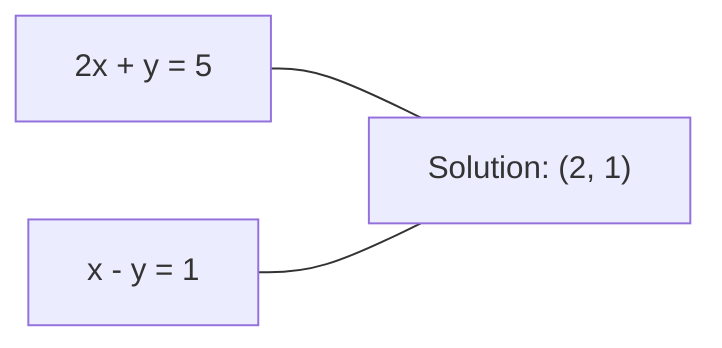
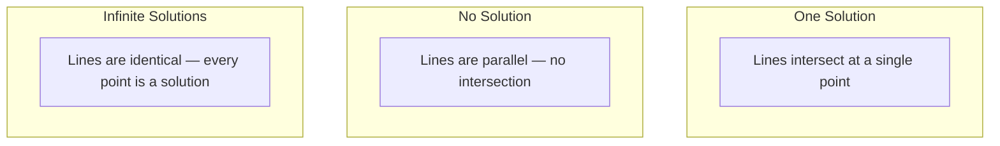

# 线性系统

> 求解 Ax = b 是数学中最古老的问题之一，却依然驱动着你的神经网络。

**类型：** 构建
**语言：** Python
**先修：** Phase 1, Lessons 01（线性代数直觉）、02（向量与矩阵）、03（矩阵变换）
**时间：** ~120 分钟

## 学习目标

- 使用带部分主元选择的 Gaussian elimination 和 back substitution 求解 Ax = b
- 使用 LU、QR 和 Cholesky decompositions 分解矩阵，并解释每种方法何时适用
- 推导 least squares 的 normal equations，并把它们连接到 linear regression 和 ridge regression
- 使用 condition number 诊断病态系统，并应用 regularization 让系统稳定

## 要解决的问题

每次训练 linear regression，你都在求解一个 linear system。每次计算 least-squares fit，你都在求解一个 linear system。每次 neural network layer 计算 `y = Wx + b`，它都在求值 linear system 的一侧。加入 regularization 时，你在修改这个系统。使用 Gaussian processes 时，你在分解一个矩阵。为了 Mahalanobis distance 反转 covariance matrix 时，你也在求解一个 linear system。

方程 Ax = b 到处都会出现。A 是已知系数构成的 matrix。b 是已知输出构成的 vector。x 是你想找到的未知量 vector。在 linear regression 中，A 是你的 data matrix，b 是 target vector，x 是 weight vector。整个模型都可以归结为：找到 x，让 Ax 尽可能接近 b。

本课会从零构建求解这个方程的所有主要方法。你会理解为什么有些方法快、有些方法稳，为什么有些方法只适用于方阵系统而另一些可以处理 overdetermined system，以及为什么矩阵的 condition number 决定了你的答案到底还有没有意义。

## 核心概念

### Ax = b 的几何含义

线性方程组有一种几何解释。每个方程定义一个 hyperplane。解就是所有 hyperplanes 相交的点（或点集）。

```text
2x + y = 5          Two lines in 2D.
x - y  = 1          They intersect at x=2, y=1.
```



可能发生三种情况：



在矩阵形式中，"one solution" 意味着 A 是 invertible。"No solution" 意味着系统 inconsistent。"Infinite solutions" 意味着 A 有 null space。大多数 ML 问题都落在 "no exact solution" 这一类，因为方程（data points）比未知数（parameters）更多。这就是 least squares 出场的地方。

### Column picture 与 row picture

阅读 Ax = b 有两种方式。

**Row picture。** A 的每一行定义一个方程。每个方程都是一个 hyperplane。解就是它们全部相交的位置。

**Column picture。** A 的每一列都是一个 vector。问题变成：A 的列要怎样线性组合，才能产生 b？

```text
A = | 2  1 |    b = | 5 |
    | 1 -1 |        | 1 |

Row picture: solve 2x + y = 5 and x - y = 1 simultaneously.

Column picture: find x1, x2 such that:
  x1 * [2, 1] + x2 * [1, -1] = [5, 1]
  2 * [2, 1] + 1 * [1, -1] = [4+1, 2-1] = [5, 1]   check.
```

Column picture 更根本。如果 b 位于 A 的 column space 中，系统就有解。如果 b 不在其中，你就寻找 column space 中离 b 最近的点。这个最近点就是 least-squares solution。

### Gaussian elimination

Gaussian elimination 会把 Ax = b 变换成 upper triangular system Ux = c，然后用 back substitution 求解。它是最直接的方法。

算法如下：

```text
1. For each column k (the pivot column):
   a. Find the largest entry in column k at or below row k (partial pivoting).
   b. Swap that row with row k.
   c. For each row i below k:
      - Compute multiplier m = A[i][k] / A[k][k]
      - Subtract m times row k from row i.
2. Back substitute: solve from the last equation upward.
```

例子：

```text
Original:
| 2  1  1 | 8 |       R2 = R2 - (2)R1     | 2  1   1 |  8 |
| 4  3  3 |20 |  -->  R3 = R3 - (1)R1 --> | 0  1   1 |  4 |
| 2  3  1 |12 |                            | 0  2   0 |  4 |

                       R3 = R3 - (2)R2     | 2  1   1 |  8 |
                                       --> | 0  1   1 |  4 |
                                           | 0  0  -2 | -4 |

Back substitute:
  -2 * x3 = -4    -->  x3 = 2
  x2 + 2  = 4     -->  x2 = 2
  2*x1 + 2 + 2 = 8 --> x1 = 2
```

Gaussian elimination 的运算成本是 O(n^3)。对一个 1000x1000 的系统来说，大约是十亿次 floating-point operations。已经很快了，但如果你需要用同一个 A 求解多个系统，还可以做得更好。

### Partial pivoting：为什么重要

没有 pivoting，Gaussian elimination 可能失败，也可能产生垃圾结果。如果 pivot element 是零，你会除以零。如果它很小，你会放大 rounding errors。

```text
Bad pivot:                       With partial pivoting:
| 0.001  1 | 1.001 |            Swap rows first:
| 1      1 | 2     |            | 1      1 | 2     |
                                 | 0.001  1 | 1.001 |
m = 1/0.001 = 1000              m = 0.001/1 = 0.001
R2 = R2 - 1000*R1               R2 = R2 - 0.001*R1
| 0.001  1     | 1.001   |      | 1      1     | 2     |
| 0     -999   | -999.0  |      | 0      0.999 | 0.999 |

x2 = 1.000 (correct)            x2 = 1.000 (correct)
x1 = (1.001 - 1)/0.001          x1 = (2 - 1)/1 = 1.000 (correct)
   = 0.001/0.001 = 1.000        Stable because the multiplier is small.
```

在精度有限的 floating-point arithmetic 中，不做 pivoting 的版本可能丢失有效数字。Partial pivoting 总是选择当前可用的最大 pivot，从而尽量减少误差放大。

### LU decomposition

LU decomposition 会把 A 分解成 lower triangular matrix L 和 upper triangular matrix U：A = LU。L matrix 存储 Gaussian elimination 中的 multipliers。U matrix 是消元后的结果。

```text
A = L @ U

| 2  1  1 |   | 1  0  0 |   | 2  1   1 |
| 4  3  3 | = | 2  1  0 | @ | 0  1   1 |
| 2  3  1 |   | 1  2  1 |   | 0  0  -2 |
```

为什么要 factor，而不是直接消元？因为一旦有了 L 和 U，用任何新的 b 求解 Ax = b 只需要 O(n^2)：

```text
Ax = b
LUx = b
Let y = Ux:
  Ly = b    (forward substitution, O(n^2))
  Ux = y    (back substitution, O(n^2))
```

O(n^3) 的成本只在 factorization 时支付一次。之后每次 solve 都是 O(n^2)。如果你需要用同一个 A、不同的 b vectors 求解 1000 个系统，LU 会让总工作量减少约 1000/3 倍。

带 partial pivoting 时，你会得到 PA = LU，其中 P 是记录行交换的 permutation matrix。

### QR decomposition

QR decomposition 会把 A 分解成 orthogonal matrix Q 和 upper triangular matrix R：A = QR。

Orthogonal matrix 满足 Q^T Q = I。它的列是 orthonormal vectors。乘以 Q 会保持长度和角度不变。

```text
A = Q @ R

Q has orthonormal columns: Q^T Q = I
R is upper triangular

To solve Ax = b:
  QRx = b
  Rx = Q^T b    (just multiply by Q^T, no inversion needed)
  Back substitute to get x.
```

在求解 least-squares problems 时，QR 比 LU 在数值上更稳定。Gram-Schmidt process 会逐列构建 Q：

```text
Given columns a1, a2, ... of A:

q1 = a1 / ||a1||

q2 = a2 - (a2 . q1) * q1        (subtract projection onto q1)
q2 = q2 / ||q2||                (normalize)

q3 = a3 - (a3 . q1) * q1 - (a3 . q2) * q2
q3 = q3 / ||q3||

R[i][j] = qi . aj    for i <= j
```

每一步都会移除沿所有已有 q vectors 的分量，只留下新的 orthogonal direction。

### Cholesky decomposition

当 A 是 symmetric（A = A^T）且 positive definite（所有 eigenvalues 都为正）时，可以把它分解为 A = L L^T，其中 L 是 lower triangular。这就是 Cholesky decomposition。

```text
A = L @ L^T

| 4  2 |   | 2  0 |   | 2  1 |
| 2  5 | = | 1  2 | @ | 0  2 |

L[i][i] = sqrt(A[i][i] - sum(L[i][k]^2 for k < i))
L[i][j] = (A[i][j] - sum(L[i][k]*L[j][k] for k < j)) / L[j][j]    for i > j
```

Cholesky 比 LU 快约两倍，并且只需要一半存储空间。它只适用于 symmetric positive definite matrices，但这类矩阵经常出现：

- Covariance matrices 是 symmetric positive semi-definite（配合 regularization 后是 positive definite）。
- Gaussian processes 中的 kernel matrix 是 symmetric positive definite。
- Convex function 在最小值处的 Hessian 是 symmetric positive definite。
- A^T A 总是 symmetric positive semi-definite。

在 Gaussian processes 中，你会用 Cholesky 分解 kernel matrix K，然后求解 K alpha = y 来得到 predictive mean。Cholesky factor 还会给出 marginal likelihood 所需的 log-determinant：log det(K) = 2 * sum(log(diag(L)))。

### Least squares：当 Ax = b 没有精确解时

如果 A 是 m x n 且 m > n（方程数多于未知数），这个系统就是 overdetermined。它没有 exact solution。因此，你会最小化 squared error：

```text
minimize ||Ax - b||^2

This is the sum of squared residuals:
  sum((A[i,:] @ x - b[i])^2 for i in range(m))
```

使其最小的 x 满足 normal equations：

```text
A^T A x = A^T b
```

推导：展开 ||Ax - b||^2 = (Ax - b)^T (Ax - b) = x^T A^T A x - 2 x^T A^T b + b^T b。对 x 求 gradient，并令其为零：2 A^T A x - 2 A^T b = 0。

```text
Original system (overdetermined, 4 equations, 2 unknowns):
| 1  1 |         | 3 |
| 1  2 | x     = | 5 |       No exact x satisfies all 4 equations.
| 1  3 |         | 6 |
| 1  4 |         | 8 |

Normal equations:
A^T A = | 4  10 |    A^T b = | 22 |
        | 10 30 |            | 63 |

Solve: x = [1.5, 1.7]

This is linear regression. x[0] is the intercept, x[1] is the slope.
```

这就是 linear regression。x[0] 是 intercept，x[1] 是 slope。

### Normal equations = linear regression

这种连接是精确的。在 linear regression 中，你的 data matrix X 每一行是一个 sample，每一列是一个 feature。你的 target vector y 每个条目对应一个 sample。weight vector w 满足：

```text
X^T X w = X^T y
w = (X^T X)^(-1) X^T y
```

这是 linear regression 的 closed-form solution。每次调用 `sklearn.linear_model.LinearRegression.fit()` 都会计算它（或者通过 QR 或 SVD 计算等价形式）。

给矩阵加入 regularization term lambda * I，就得到 ridge regression：

```text
(X^T X + lambda * I) w = X^T y
w = (X^T X + lambda * I)^(-1) X^T y
```

Regularization 会让矩阵 better conditioned（更容易被准确反转），并通过把 weights 收缩到接近零来防止 overfitting。当 lambda > 0 时，矩阵 X^T X + lambda * I 总是 symmetric positive definite，因此可以用 Cholesky 求解它。

### Pseudoinverse（Moore-Penrose）

Pseudoinverse A+ 会把 matrix inversion 推广到 non-square 和 singular matrices。对任意 matrix A：

```text
x = A+ b

where A+ = V Sigma+ U^T    (computed via SVD)
```

Sigma+ 的构造方式是：对每个非零 singular value 取倒数，然后转置结果。如果 A = U Sigma V^T，那么 A+ = V Sigma+ U^T。

```text
A = U Sigma V^T        (SVD)

Sigma = | 5  0 |       Sigma+ = | 1/5  0  0 |
        | 0  2 |                | 0  1/2  0 |
        | 0  0 |

A+ = V Sigma+ U^T
```

Pseudoinverse 给出 minimum-norm least-squares solution。如果系统有：
- One solution：A+ b 会给出它。
- No solution：A+ b 会给出 least-squares solution。
- Infinite solutions：A+ b 会给出 ||x|| 最小的那个解。

NumPy 的 `np.linalg.lstsq` 和 `np.linalg.pinv` 内部都会使用 SVD。

### Condition number

Condition number 衡量解对输入中微小变化的敏感程度。对 matrix A 来说，condition number 是：

```text
kappa(A) = ||A|| * ||A^(-1)|| = sigma_max / sigma_min
```

其中 sigma_max 和 sigma_min 分别是最大和最小 singular values。

```text
Well-conditioned (kappa ~ 1):        Ill-conditioned (kappa ~ 10^15):
Small change in b -->                Small change in b -->
small change in x                    huge change in x

| 2  0 |   kappa = 2/1 = 2          | 1   1          |   kappa ~ 10^15
| 0  1 |   safe to solve            | 1   1+10^(-15) |   solution is garbage
```

经验规则：
- kappa < 100：安全，解是准确的。
- kappa ~ 10^k：你会从 floating-point arithmetic 中损失大约 k 位精度。
- kappa ~ 10^16（对 float64）：解已经没有意义。矩阵实际上是 singular。

在 ML 中，病态条件通常发生在 features nearly collinear 时。Regularization（加入 lambda * I）会把 condition number 从 sigma_max / sigma_min 改善为 (sigma_max + lambda) / (sigma_min + lambda)。

### Iterative methods：conjugate gradient

对非常大的 sparse systems（数百万个未知数）来说，LU 或 Cholesky 这样的 direct methods 代价太高。Iterative methods 会通过多轮迭代不断改进猜测值，来近似解。

Conjugate gradient（CG）在 A 是 symmetric positive definite 时求解 Ax = b。它在至多 n 次迭代内找到 exact solution（在 exact arithmetic 中），但如果 A 的 eigenvalues 聚集，通常会收敛得快得多。

```text
Algorithm sketch:
  x0 = initial guess (often zero)
  r0 = b - A x0           (residual)
  p0 = r0                 (search direction)

  For k = 0, 1, 2, ...:
    alpha = (rk . rk) / (pk . A pk)
    x_{k+1} = xk + alpha * pk
    r_{k+1} = rk - alpha * A pk
    beta = (r_{k+1} . r_{k+1}) / (rk . rk)
    p_{k+1} = r_{k+1} + beta * pk
    if ||r_{k+1}|| < tolerance: stop
```

CG 用于：
- 大规模 optimization（Newton-CG method）
- 求解 PDE discretizations
- Kernel methods 中 kernel matrix 太大、无法 factor 的场景
- 作为其他 iterative solvers 的 preconditioning

收敛速度取决于 condition number。条件越好的系统收敛越快，这也是 regularization 有帮助的另一个原因。

### 全局图景：什么时候用哪种方法

| Method | Requirements | Cost | Use case |
|--------|-------------|------|----------|
| Gaussian elimination | 方阵且 nonsingular 的 A | O(n^3) | 一次性求解方阵系统 |
| LU decomposition | 方阵且 nonsingular 的 A | O(n^3) factor + O(n^2) solve | 用同一个 A 进行多次求解 |
| QR decomposition | 任意 A (m >= n) | O(mn^2) | Least squares，数值稳定 |
| Cholesky | Symmetric positive definite A | O(n^3/3) | Covariance matrices、Gaussian processes、ridge regression |
| Normal equations | Overdetermined (m > n) | O(mn^2 + n^3) | Linear regression（小 n） |
| SVD / pseudoinverse | 任意 A | O(mn^2) | Rank-deficient systems、minimum-norm solutions |
| Conjugate gradient | Symmetric positive definite、sparse A | O(n * k * nnz) | Large sparse systems，k = iterations |

### 与 ML 的连接

本课中的每一种方法都会出现在生产级 ML 中：

**Linear regression。** Closed-form solution 会求解 normal equations X^T X w = X^T y。它可以通过 Cholesky（如果 n 较小）、QR（如果数值稳定性重要）或 SVD（如果矩阵可能 rank-deficient）完成。

**Ridge regression。** 向 X^T X 加入 lambda * I。Regularized system (X^T X + lambda * I) w = X^T y 总是可以通过 Cholesky 求解，因为当 lambda > 0 时，X^T X + lambda * I 是 symmetric positive definite。

**Gaussian processes。** Predictive mean 需要求解 K alpha = y，其中 K 是 kernel matrix。K 的 Cholesky factorization 是标准做法。Log marginal likelihood 会使用 log det(K) = 2 sum(log(diag(L)))。

**Neural network initialization。** Orthogonal initialization 使用 QR decomposition 创建列为 orthonormal 的 weight matrices。这可以防止深层网络中的 signal collapse。

**Preconditioning。** 大规模 optimizers 会使用 incomplete Cholesky 或 incomplete LU 作为 conjugate gradient solvers 的 preconditioners。

**Feature engineering。** X^T X 的 condition number 会告诉你 features 是否 collinear。如果 kappa 很大，就删除 features 或加入 regularization。

## 动手实现

### Step 1：带 partial pivoting 的 Gaussian elimination

```python
import numpy as np

def gaussian_elimination(A, b):
    n = len(b)
    Ab = np.hstack([A.astype(float), b.reshape(-1, 1).astype(float)])

    for k in range(n):
        max_row = k + np.argmax(np.abs(Ab[k:, k]))
        Ab[[k, max_row]] = Ab[[max_row, k]]

        if abs(Ab[k, k]) < 1e-12:
            raise ValueError(f"Matrix is singular or nearly singular at pivot {k}")

        for i in range(k + 1, n):
            m = Ab[i, k] / Ab[k, k]
            Ab[i, k:] -= m * Ab[k, k:]

    x = np.zeros(n)
    for i in range(n - 1, -1, -1):
        x[i] = (Ab[i, -1] - Ab[i, i+1:n] @ x[i+1:n]) / Ab[i, i]

    return x
```

### Step 2：LU decomposition

```python
def lu_decompose(A):
    n = A.shape[0]
    L = np.eye(n)
    U = A.astype(float).copy()
    P = np.eye(n)

    for k in range(n):
        max_row = k + np.argmax(np.abs(U[k:, k]))
        if max_row != k:
            U[[k, max_row]] = U[[max_row, k]]
            P[[k, max_row]] = P[[max_row, k]]
            if k > 0:
                L[[k, max_row], :k] = L[[max_row, k], :k]

        for i in range(k + 1, n):
            L[i, k] = U[i, k] / U[k, k]
            U[i, k:] -= L[i, k] * U[k, k:]

    return P, L, U

def lu_solve(P, L, U, b):
    n = len(b)
    Pb = P @ b.astype(float)

    y = np.zeros(n)
    for i in range(n):
        y[i] = Pb[i] - L[i, :i] @ y[:i]

    x = np.zeros(n)
    for i in range(n - 1, -1, -1):
        x[i] = (y[i] - U[i, i+1:] @ x[i+1:]) / U[i, i]

    return x
```

### Step 3：Cholesky decomposition

```python
def cholesky(A):
    n = A.shape[0]
    L = np.zeros_like(A, dtype=float)

    for i in range(n):
        for j in range(i + 1):
            s = A[i, j] - L[i, :j] @ L[j, :j]
            if i == j:
                if s <= 0:
                    raise ValueError("Matrix is not positive definite")
                L[i, j] = np.sqrt(s)
            else:
                L[i, j] = s / L[j, j]

    return L
```

### Step 4：通过 normal equations 求 least squares

```python
def least_squares_normal(A, b):
    AtA = A.T @ A
    Atb = A.T @ b
    return gaussian_elimination(AtA, Atb)

def ridge_regression(A, b, lam):
    n = A.shape[1]
    AtA = A.T @ A + lam * np.eye(n)
    Atb = A.T @ b
    L = cholesky(AtA)
    y = np.zeros(n)
    for i in range(n):
        y[i] = (Atb[i] - L[i, :i] @ y[:i]) / L[i, i]
    x = np.zeros(n)
    for i in range(n - 1, -1, -1):
        x[i] = (y[i] - L.T[i, i+1:] @ x[i+1:]) / L.T[i, i]
    return x
```

### Step 5：Condition number

```python
def condition_number(A):
    U, S, Vt = np.linalg.svd(A)
    return S[0] / S[-1]
```

## 实际使用

把这些组件组合起来，在真实数据上做 linear regression 和 ridge regression：

```python
np.random.seed(42)
X_raw = np.random.randn(100, 3)
w_true = np.array([2.0, -1.0, 0.5])
y = X_raw @ w_true + np.random.randn(100) * 0.1

X = np.column_stack([np.ones(100), X_raw])

w_ols = least_squares_normal(X, y)
print(f"OLS weights (ours):    {w_ols}")

w_np = np.linalg.lstsq(X, y, rcond=None)[0]
print(f"OLS weights (numpy):   {w_np}")
print(f"Max difference: {np.max(np.abs(w_ols - w_np)):.2e}")

w_ridge = ridge_regression(X, y, lam=1.0)
print(f"Ridge weights (ours):  {w_ridge}")

from sklearn.linear_model import Ridge
ridge_sk = Ridge(alpha=1.0, fit_intercept=False)
ridge_sk.fit(X, y)
print(f"Ridge weights (sklearn): {ridge_sk.coef_}")
```

## 交付成果

本课会产出：
- `code/linear_systems.py`，其中包含从零实现的 Gaussian elimination、LU decomposition、Cholesky decomposition、least squares 和 ridge regression
- 一个可运行演示，说明 normal equations 和 sklearn 的 LinearRegression 会产生相同的 weights

## 练习

1. 使用你的 Gaussian elimination、你的 LU solver 和 `np.linalg.solve` 求解系统 `[[1,2,3],[4,5,6],[7,8,10]] x = [6, 15, 27]`。验证三者在 floating-point tolerance 内给出相同答案。

2. 生成一个 50x5 的随机矩阵 X 和目标 y = X @ w_true + noise。分别使用 normal equations、QR（通过 `np.linalg.qr`）、SVD（通过 `np.linalg.svd`）和 `np.linalg.lstsq` 求解 w。比较四个解。测量 X^T X 的 condition number，并解释它如何影响你信任哪种方法。

3. 通过让两列几乎相同来创建一个 nearly singular matrix（例如 column 2 = column 1 + 1e-10 * noise）。计算它的 condition number。分别在有 regularization（加入 0.01 * I）和无 regularization 的情况下求解 Ax = b。比较 solutions 和 residuals。解释为什么 regularization 有帮助。

4. 为一个 100x100 的随机 symmetric positive definite matrix 实现 conjugate gradient algorithm。统计它收敛到 tolerance 1e-8 需要多少次迭代。与理论上的最大 n 次迭代比较。

5. 在大小为 10、50、200、500 的 symmetric positive definite matrices 上，计时你的 Cholesky solver、你的 LU solver 和 `np.linalg.solve`。绘制结果。验证 Cholesky 大约比 LU 快 2 倍。

## 关键术语

| Term | 人们常说 | 实际含义 |
|------|----------|----------|
| Linear system | “Solve for x” | 一组 linear equations Ax = b。寻找 x 意味着寻找在 transformation A 下产生输出 b 的输入。 |
| Gaussian elimination | “Row reduce” | 使用 row operations 系统性地把 diagonal 下方的 entries 消成零，得到一个可通过 back substitution 求解的 upper triangular system。O(n^3)。 |
| Partial pivoting | “Swap rows for stability” | 在第 k 列消元前，把该列中 absolute value 最大的行交换到 pivot position。防止除以很小的数字。 |
| LU decomposition | “Factor into triangles” | 写成 A = LU，其中 L 是 lower triangular（存储 multipliers），U 是 upper triangular（消元后的矩阵）。把 O(n^3) 成本分摊到多次求解上。 |
| QR decomposition | “Orthogonal factorization” | 写成 A = QR，其中 Q 的列是 orthonormal，R 是 upper triangular。对 least squares 来说比 LU 更稳定。 |
| Cholesky decomposition | “Square root of a matrix” | 对 symmetric positive definite A，写成 A = LL^T。成本是 LU 的一半。用于 covariance matrices、kernel matrices 和 ridge regression。 |
| Least squares | “Best fit when exact is impossible” | 当系统 overdetermined（方程数多于未知数）时，最小化 squared residuals 之和 ||Ax - b||^2。 |
| Normal equations | “The calculus shortcut” | A^T A x = A^T b。把 ||Ax - b||^2 的 gradient 设为零。这就是 linear regression 的 closed-form solution。 |
| Pseudoinverse | “Inversion for non-square matrices” | A+ = V Sigma+ U^T，通过 SVD 得到。对任何 matrix（square 或 rectangular、singular 或 non-singular）给出 minimum-norm least-squares solution。 |
| Condition number | “How trustworthy is this answer” | kappa = sigma_max / sigma_min。衡量对输入扰动的敏感度。会损失大约 log10(kappa) 位精度。 |
| Ridge regression | “Regularized least squares” | 求解 (X^T X + lambda I) w = X^T y。加入 lambda I 会改善 conditioning，并把 weights 向零收缩。防止 overfitting。 |
| Conjugate gradient | “Iterative Ax=b for big matrices” | 用于 symmetric positive definite systems 的 iterative solver。至多 n 步收敛。适合 factorization 过于昂贵的大型 sparse systems。 |
| Overdetermined system | “More data than parameters” | m-by-n 系统中 m > n。没有 exact solution。Least squares 会找到最佳近似。这就是每个 regression problem。 |
| Back substitution | “Solve from the bottom up” | 给定 upper triangular system，先求解最后一个方程，再向上代回。O(n^2)。 |
| Forward substitution | “Solve from the top down” | 给定 lower triangular system，先求解第一个方程，再向下代入。O(n^2)。用于 LU solves 的 L 步。 |

## 延伸阅读

- [MIT 18.06: Linear Algebra](https://ocw.mit.edu/courses/18-06-linear-algebra-spring-2010/)（Gilbert Strang）-- 关于 linear systems 和 matrix factorizations 的权威课程
- [Numerical Linear Algebra](https://people.maths.ox.ac.uk/trefethen/text.html)（Trefethen & Bau）-- 理解 numerical stability、conditioning 以及 algorithms 为什么失败的标准参考
- [Matrix Computations](https://www.cs.cornell.edu/cv/GolubVanLoan4/golubandvanloan.htm)（Golub & Van Loan）-- 覆盖各种 matrix algorithms 的百科式参考
- [3Blue1Brown: Inverse Matrices](https://www.3blue1brown.com/lessons/inverse-matrices) -- 关于求解 Ax = b 几何含义的视觉直觉
