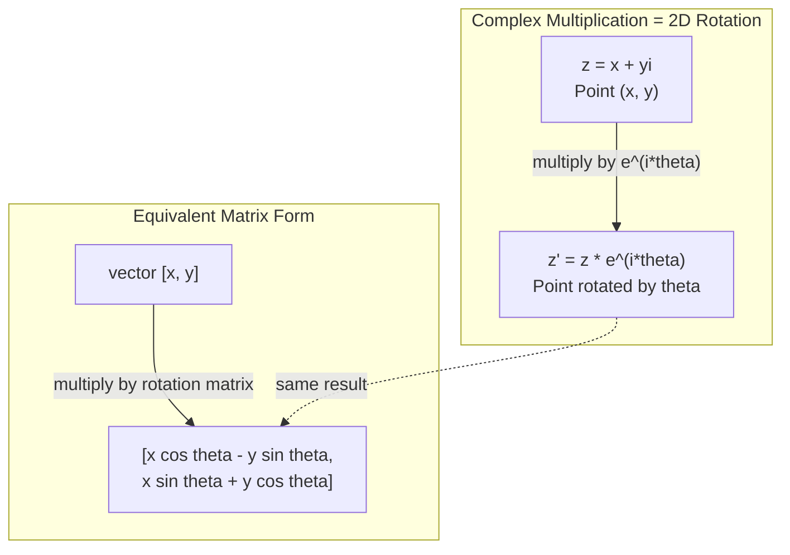
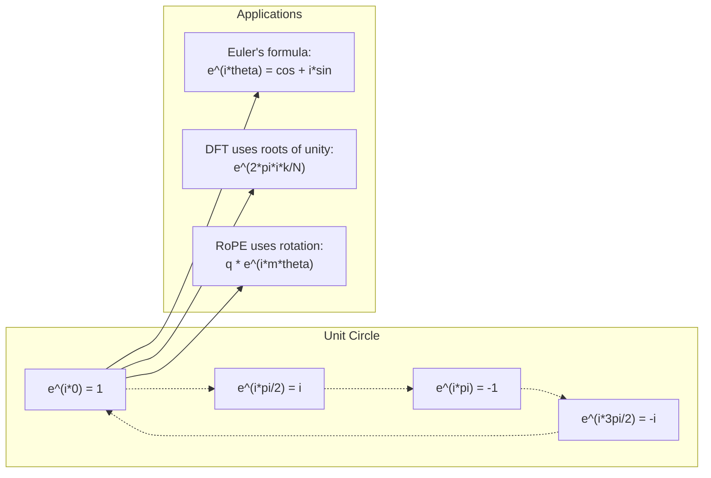

# 面向 AI 的复数

> -1 的平方根并不“虚”。它是理解旋转、频率，以及半个信号处理世界的钥匙。

**类型：** 学习
**语言：** Python
**先修：** 第 1 阶段，第 01-04 课（线性代数、微积分）
**时间：** ~60 分钟

## 学习目标

- 在直角坐标形式和极坐标形式中执行复数运算（加法、乘法、除法、共轭）
- 应用 Euler's formula 在复指数和三角函数之间转换
- 使用复数单位根实现 Discrete Fourier Transform
- 解释复数旋转如何支撑 transformer 中的 RoPE 和 sinusoidal positional encodings

## 要解决的问题

你打开一篇关于 Fourier transforms 的论文，到处都是 `i`。你看 transformer positional encodings，看到不同频率下的 `sin` 和 `cos` -- 也就是复指数的实部和虚部。你读 quantum computing，又发现一切都写在复向量空间里。

复数看起来很抽象。一个建立在 -1 的平方根之上的数系，像是某种数学把戏。但它不是把戏。它是描述旋转和振荡的自然语言。每当某个东西旋转、振动或振荡时，复数就是合适的工具。

如果不理解复数，你就无法理解 Discrete Fourier Transform。无法理解 FFT。无法理解现代语言模型中的 RoPE (Rotary Position Embedding) 如何工作。也无法理解为什么原始 Transformer 论文中的 sinusoidal positional encodings 会使用那些频率。

本课会从零构建复数运算，把它连接到几何，并准确展示复数在机器学习中出现的位置。

## 核心概念

### 什么是复数？

复数有两个部分：实部和虚部。

```text
z = a + bi

where:
  a is the real part
  b is the imaginary part
  i is the imaginary unit, defined by i^2 = -1
```

就是这样。你把数轴扩展成一个平面。实数位于一条轴上。虚数位于另一条轴上。每个复数都是这个平面中的一个点。

### 复数运算

**加法。** 实部相加，虚部相加。

```text
(a + bi) + (c + di) = (a + c) + (b + d)i

Example: (3 + 2i) + (1 + 4i) = 4 + 6i
```

**乘法。** 使用分配律，并记住 i^2 = -1。

```text
(a + bi)(c + di) = ac + adi + bci + bdi^2
                 = ac + adi + bci - bd
                 = (ac - bd) + (ad + bc)i

Example: (3 + 2i)(1 + 4i) = 3 + 12i + 2i + 8i^2
                            = 3 + 14i - 8
                            = -5 + 14i
```

**共轭。** 翻转虚部的符号。

```text
conjugate of (a + bi) = a - bi
```

一个复数与其共轭的乘积总是实数：

```text
(a + bi)(a - bi) = a^2 + b^2
```

**除法。** 分子和分母同时乘以分母的共轭。

```text
(a + bi) / (c + di) = (a + bi)(c - di) / (c^2 + d^2)
```

这会消去分母中的虚部，得到一个干净的复数。

### 复平面

复平面把每个复数映射到一个 2D 点。水平轴是实轴，垂直轴是虚轴。

```text
z = 3 + 2i  corresponds to the point (3, 2)
z = -1 + 0i corresponds to the point (-1, 0) on the real axis
z = 0 + 4i  corresponds to the point (0, 4) on the imaginary axis
```

复数既是一个点，也是从原点出发的向量。正是这种双重解释，让复数在几何中很有用。

### 极坐标形式

平面中的任意点都可以用它到原点的距离，以及它相对正实轴的角度来描述。

```text
z = r * (cos(theta) + i*sin(theta))

where:
  r = |z| = sqrt(a^2 + b^2)     (magnitude, or modulus)
  theta = atan2(b, a)             (phase, or argument)
```

直角坐标形式 (a + bi) 适合做加法。极坐标形式 (r, theta) 适合做乘法。

**极坐标形式中的乘法。** 模长相乘，角度相加。

```text
z1 = r1 * e^(i*theta1)
z2 = r2 * e^(i*theta2)

z1 * z2 = (r1 * r2) * e^(i*(theta1 + theta2))
```

这就是为什么复数非常适合表示旋转。乘以一个模长为 1 的复数，就是一次纯旋转。

### Euler's formula

复指数与三角函数之间的桥梁：

```text
e^(i*theta) = cos(theta) + i*sin(theta)
```

这是本课最重要的公式。当 theta = pi 时：

```text
e^(i*pi) = cos(pi) + i*sin(pi) = -1 + 0i = -1

Therefore: e^(i*pi) + 1 = 0
```

五个基本常数（e、i、pi、1、0）被一个方程连接在一起。

### 为什么 Euler's formula 对 ML 很重要

Euler's formula 说明 `e^(i*theta)` 会随着 theta 变化沿单位圆运动。当 theta = 0 时，你在 (1, 0)。当 theta = pi/2 时，你在 (0, 1)。当 theta = pi 时，你在 (-1, 0)。当 theta = 3*pi/2 时，你在 (0, -1)。完整一圈是 theta = 2*pi。

这意味着复指数本质上就是旋转。而旋转在信号处理和 ML 中无处不在。

### 与 2D 旋转的关系

把复数 (x + yi) 乘以 e^(i*theta)，会把点 (x, y) 围绕原点旋转 theta 角。

```text
Rotation via complex multiplication:
  (x + yi) * (cos(theta) + i*sin(theta))
  = (x*cos(theta) - y*sin(theta)) + (x*sin(theta) + y*cos(theta))i

Rotation via matrix multiplication:
  [cos(theta)  -sin(theta)] [x]   [x*cos(theta) - y*sin(theta)]
  [sin(theta)   cos(theta)] [y] = [x*sin(theta) + y*cos(theta)]
```

它们产生完全相同的结果。复数乘法就是 2D 旋转。旋转矩阵只是用矩阵记号写出来的复数乘法。



### Phasors 与旋转信号

复指数 e^(i*omega*t) 是一个以角频率 omega 围绕单位圆旋转的点。随着 t 增加，这个点会描出圆周。

这个旋转点的实部是 cos(omega*t)。虚部是 sin(omega*t)。一个正弦信号就是一个旋转复数投下的影子。

```text
e^(i*omega*t) = cos(omega*t) + i*sin(omega*t)

Real part:      cos(omega*t)    -- a cosine wave
Imaginary part: sin(omega*t)    -- a sine wave
```

这就是 phasor 表示法。与其追踪一条上下摆动的 sine wave，不如追踪一支平滑旋转的箭头。相位偏移变成角度偏移。振幅变化变成模长变化。信号相加变成向量相加。

### 单位根

N-th roots of unity 是单位圆上等间距分布的 N 个点：

```text
w_k = e^(2*pi*i*k/N)    for k = 0, 1, 2, ..., N-1
```

当 N = 4 时，roots 是：1、i、-1、-i（四个罗盘方向）。
当 N = 8 时，你会得到四个罗盘方向加上四条对角线方向。

单位根是 Discrete Fourier Transform 的基础。DFT 会把一个信号分解为这 N 个等间距频率上的分量。

### 与 DFT 的关系

信号 x[0], x[1], ..., x[N-1] 的 Discrete Fourier Transform 是：

```text
X[k] = sum_{n=0}^{N-1} x[n] * e^(-2*pi*i*k*n/N)
```

每个 X[k] 都度量信号与第 k 个单位根的相关程度 -- 也就是频率为 k 的复正弦波。DFT 把一个信号分解成 N 个旋转的 phasors，并告诉你每个分量的振幅和相位。

### 为什么 i 并不“虚”

“imaginary” 这个词是历史偶然。Descartes 当年带着贬义使用它。但 i 并不比负数更“虚”，就像负数刚出现时也曾被人拒绝一样。负数回答的是：“从 3 中减去什么会得到 5？”虚数单位回答的是：“什么数的平方会得到 -1？”

更有用的理解是：i 是一个 90 度旋转算子。把一个实数乘以 i 一次，你就旋转 90 度到虚轴。再乘以 i 一次（i^2），又旋转 90 度 -- 现在你指向负实轴方向。这就是为什么 i^2 = -1。它并不神秘。它是由两个四分之一圈组成的半圈旋转。

这就是为什么复数在工程中无处不在。任何会旋转的东西 -- 电磁波、量子态、信号振荡、positional encodings -- 都天然适合用复数描述。

### 复指数与三角函数

在 Euler's formula 之前，工程师会把信号写成 A*cos(omega*t + phi) -- 振幅 A、频率 omega、相位 phi。这可以用，但会让运算变得痛苦。相加两个相位不同的 cosines 需要三角恒等式。

用复指数时，同一个信号可以写成 A*e^(i*(omega*t + phi))。相加两个信号就是相加两个复数。相乘（调制）就是模长相乘、角度相加。相位偏移变成角度加法。频率偏移变成乘以 phasors。

整个信号处理领域之所以转向复指数记号，是因为数学更干净。“真实信号”始终只是复表示的实部。虚部被一起带着，像账本一样让所有代数自然成立。

### 与 transformers 的关系

**Sinusoidal positional encodings**（原始 Transformer 论文）：

```text
PE(pos, 2i) = sin(pos / 10000^(2i/d))
PE(pos, 2i+1) = cos(pos / 10000^(2i/d))
```

sin 和 cos 成对出现，分别是不同频率复指数的实部和虚部。每个频率都为编码位置提供一种不同的“分辨率”。低频变化缓慢（粗粒度位置）。高频变化迅速（细粒度位置）。它们合在一起，为每个位置提供唯一的频率指纹。

**RoPE (Rotary Position Embedding)** 更进一步。它会显式地把 query 和 key 向量乘以复数旋转矩阵。两个 token 之间的相对位置会变成一个旋转角。Attention 使用这些旋转后的向量来计算，从而让模型通过复数乘法对相对位置敏感。

| 运算 | 代数形式 | 几何含义 |
|------|----------|----------|
| 加法 | (a+c) + (b+d)i | 平面中的向量加法 |
| 乘法 | (ac-bd) + (ad+bc)i | 旋转并缩放 |
| 共轭 | a - bi | 关于实轴反射 |
| 模长 | sqrt(a^2 + b^2) | 到原点的距离 |
| 相位 | atan2(b, a) | 相对正实轴的角度 |
| 除法 | multiply by conjugate | 反向旋转并重新缩放 |
| 幂 | r^n * e^(i*n*theta) | 旋转 n 次，并按 r^n 缩放 |



## 动手实现

### 步骤 1：Complex 类

构建一个 Complex number 类，支持运算、模长、相位，以及在直角坐标形式和极坐标形式之间转换。

```python
import math

class Complex:
    def __init__(self, real, imag=0.0):
        self.real = real
        self.imag = imag

    def __add__(self, other):
        return Complex(self.real + other.real, self.imag + other.imag)

    def __mul__(self, other):
        r = self.real * other.real - self.imag * other.imag
        i = self.real * other.imag + self.imag * other.real
        return Complex(r, i)

    def __truediv__(self, other):
        denom = other.real ** 2 + other.imag ** 2
        r = (self.real * other.real + self.imag * other.imag) / denom
        i = (self.imag * other.real - self.real * other.imag) / denom
        return Complex(r, i)

    def magnitude(self):
        return math.sqrt(self.real ** 2 + self.imag ** 2)

    def phase(self):
        return math.atan2(self.imag, self.real)

    def conjugate(self):
        return Complex(self.real, -self.imag)
```

### 步骤 2：极坐标转换与 Euler's formula

```python
def to_polar(z):
    return z.magnitude(), z.phase()

def from_polar(r, theta):
    return Complex(r * math.cos(theta), r * math.sin(theta))

def euler(theta):
    return Complex(math.cos(theta), math.sin(theta))
```

验证：`euler(theta).magnitude()` 应该始终是 1.0。`euler(0)` 应该给出 (1, 0)。`euler(pi)` 应该给出 (-1, 0)。

### 步骤 3：旋转

把点 (x, y) 旋转 theta 角，只需要一次复数乘法：

```python
point = Complex(3, 4)
rotated = point * euler(math.pi / 4)
```

模长保持不变。只有角度发生变化。

### 步骤 4：用复数运算实现 DFT

```python
def dft(signal):
    N = len(signal)
    result = []
    for k in range(N):
        total = Complex(0, 0)
        for n in range(N):
            angle = -2 * math.pi * k * n / N
            total = total + Complex(signal[n], 0) * euler(angle)
        result.append(total)
    return result
```

这是 O(N^2) 的 DFT。每个输出 X[k] 都是信号样本乘以单位根后的总和。

### 步骤 5：Inverse DFT

Inverse DFT 会从频谱重构原始信号。相对于 forward DFT，唯一的变化是：翻转指数中的符号，并除以 N。

```python
def idft(spectrum):
    N = len(spectrum)
    result = []
    for n in range(N):
        total = Complex(0, 0)
        for k in range(N):
            angle = 2 * math.pi * k * n / N
            total = total + spectrum[k] * euler(angle)
        result.append(Complex(total.real / N, total.imag / N))
    return result
```

这会给出完美重构。先应用 DFT，再应用 IDFT，你会在机器精度范围内拿回原始信号。没有信息丢失。

### 步骤 6：单位根

```python
def roots_of_unity(N):
    return [euler(2 * math.pi * k / N) for k in range(N)]
```

验证两个性质：
- 每个 root 的模长都恰好是 1。
- 所有 N 个 roots 的和为零（它们因对称性相互抵消）。

这些性质使 DFT 可逆。单位根构成了频域的一组正交基。

## 实际使用

Python 内置支持复数。字面量 `j` 表示虚数单位。

```python
z = 3 + 2j
w = 1 + 4j

print(z + w)
print(z * w)
print(abs(z))

import cmath
print(cmath.phase(z))
print(cmath.exp(1j * cmath.pi))
```

对于数组，numpy 原生处理复数：

```python
import numpy as np

z = np.array([1+2j, 3+4j, 5+6j])
print(np.abs(z))
print(np.angle(z))
print(np.conj(z))
print(np.real(z))
print(np.imag(z))

signal = np.sin(2 * np.pi * 5 * np.linspace(0, 1, 128))
spectrum = np.fft.fft(signal)
freqs = np.fft.fftfreq(128, d=1/128)
```

## 交付成果

运行 `code/complex_numbers.py` 来生成 `outputs/skill-complex-arithmetic.md`。

## 练习

1. **手算复数运算。** 计算 (2 + 3i) * (4 - i)，并用代码验证。然后计算 (5 + 2i) / (1 - 3i)。把两个结果都画在复平面上，并检查乘法是否旋转并缩放了第一个数。

2. **旋转序列。** 从点 (1, 0) 开始。连续乘以 e^(i*pi/6) 十二次。验证 12 次乘法后会回到 (1, 0)。打印每一步的坐标，并确认它们描出一个正 12 边形。

3. **已知信号的 DFT。** 创建一个信号，它由 sin(2*pi*3*t) 和 0.5*sin(2*pi*7*t) 相加而成，并在 32 个点上采样。运行你的 DFT。验证 magnitude spectrum 在频率 3 和 7 处有峰，并且 7 处的峰高是 3 处峰高的一半。

4. **单位根可视化。** 计算 8th roots of unity。验证它们的和为零。验证任意 root 乘以 primitive root e^(2*pi*i/8) 都会得到下一个 root。

5. **旋转矩阵等价性。** 对 10 个随机角度和 10 个随机点，验证复数乘法给出的结果与用 2x2 旋转矩阵做 matrix-vector multiplication 的结果相同。打印最大数值差异。

## 关键术语

| 术语 | 含义 |
|------|------|
| Complex number | 形如 a + bi 的数，其中 a 是实部，b 是虚部，并且 i^2 = -1 |
| Imaginary unit | 数 i，由 i^2 = -1 定义。它并不是哲学意义上的“虚”，而是一个旋转算子 |
| Complex plane | 一个 2D 平面，其中 x 轴是实轴，y 轴是虚轴。也称为 Argand plane |
| Magnitude (modulus) | 到原点的距离：sqrt(a^2 + b^2)。写作 \|z\| |
| Phase (argument) | 相对正实轴的角度：atan2(b, a)。写作 arg(z) |
| Conjugate | 关于实轴的镜像：a + bi 的 conjugate 是 a - bi |
| Polar form | 把 z 表示为 r * e^(i*theta)，而不是 a + bi。这样乘法更容易 |
| Euler's formula | e^(i*theta) = cos(theta) + i*sin(theta)。把指数函数与三角函数连接起来 |
| Phasor | 一个旋转的复数 e^(i*omega*t)，用于表示正弦信号 |
| Roots of unity | k = 0 到 N-1 时的 N 个复数 e^(2*pi*i*k/N)。它们是单位圆上等间距的 N 个点 |
| DFT | Discrete Fourier Transform。使用单位根把信号分解为复正弦分量 |
| RoPE | Rotary Position Embedding。使用复数乘法在 transformer attention 中编码相对位置 |

## 延伸阅读

- [Visual Introduction to Euler's Formula](https://betterexplained.com/articles/intuitive-understanding-of-eulers-formula/) - 不用繁重记号建立几何直觉
- [Su et al.: RoFormer (2021)](https://arxiv.org/abs/2104.09864) - 引入使用复数旋转的 Rotary Position Embedding 的论文
- [Vaswani et al.: Attention Is All You Need (2017)](https://arxiv.org/abs/1706.03762) - 提出 sinusoidal positional encodings 的原始 Transformer 论文
- [3Blue1Brown: Euler's formula with introductory group theory](https://www.youtube.com/watch?v=mvmuCPvRoWQ) - 用视觉方式解释为什么 e^(i*pi) = -1
- [Needham: Visual Complex Analysis](https://global.oup.com/academic/product/visual-complex-analysis-9780198534464) - 对复数最好的视觉化讲解之一，充满几何洞见
- [Strang: Introduction to Linear Algebra, Ch. 10](https://math.mit.edu/~gs/linearalgebra/) - 在线性代数和特征值语境中理解复数
