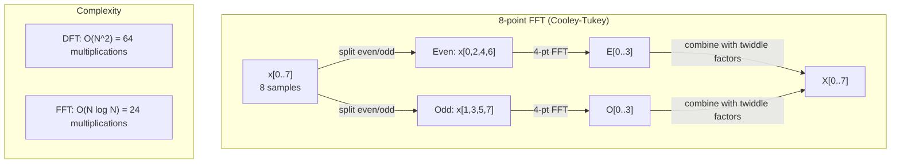
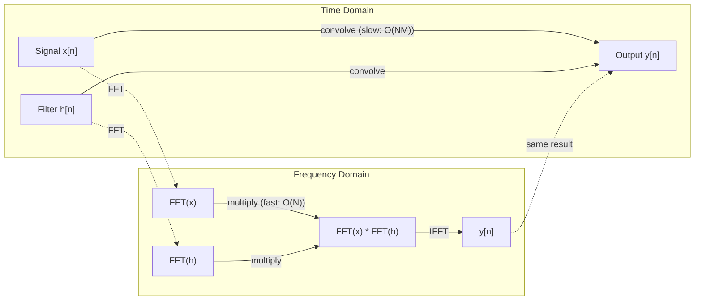

# 傅里叶变换

> 每个信号都是一组正弦波的和。傅里叶变换会告诉你是哪一些正弦波。

**类型：** 构建
**语言：** Python
**先修：** Phase 1, Lessons 01-04, 19（complex numbers）
**时间：** ~90 分钟

## 学习目标

- 从零实现 DFT，并用 O(N log N) 的 Cooley-Tukey FFT 验证结果
- 解释频率系数：从信号中提取 amplitude、phase 和 power spectrum
- 应用卷积定理，通过 FFT 乘法执行卷积
- 将傅里叶频率分解连接到 transformer positional encodings 和 CNN convolution layers

## 要解决的问题

一段音频录音，是压力测量值随时间变化的序列。股票价格，是数值随天数变化的序列。一张图像，是像素强度在空间中的网格。这些都是时域（或空域）中的数据。你看到的是某个索引上的数值如何变化。

但许多模式在时域里是看不见的。这个音频信号是一个纯音，还是一个和弦？这只股票是否有每周周期？这张图像是否有重复纹理？这些问题关注的是频率内容，而时域会把它藏起来。

傅里叶变换会把数据从时域转换到频域。它接收一个信号，并把它分解成不同频率的正弦波。每个正弦波都有 amplitude（强度有多大）和 phase（从哪里开始）。傅里叶变换会同时告诉你这两件事。

这对 ML 很重要，因为频域思维无处不在。卷积神经网络执行 convolution，而 convolution 在频域中就是乘法。Transformer positional encodings 使用频率分解来表示位置。音频模型（speech recognition、music generation）使用 spectrograms，也就是声音的频率表示。时间序列模型会寻找周期性模式。理解傅里叶变换，会让你拥有处理这些问题所需的词汇。

## 核心概念

### DFT 定义

给定 N 个样本 x[0], x[1], ..., x[N-1]，Discrete Fourier Transform 会产生 N 个频率系数 X[0], X[1], ..., X[N-1]：

```text
X[k] = sum_{n=0}^{N-1} x[n] * e^(-2*pi*i*k*n/N)

for k = 0, 1, ..., N-1
```

每个 X[k] 都是一个复数。它的幅值 |X[k]| 告诉你频率 k 的 amplitude。它的相位 angle(X[k]) 告诉你该频率的 phase offset。

关键洞见：`e^(-2*pi*i*k*n/N)` 是一个以频率 k 旋转的 phasor。DFT 计算的是信号与 N 个等间隔频率之间的相关性。如果信号在频率 k 上含有能量，相关性就很大。否则，它会接近零。

### 每个系数的含义

**X[0]：DC component。** 这是所有样本的和，与均值成比例。它表示信号的常量（零频）偏移。

```text
X[0] = sum_{n=0}^{N-1} x[n] * e^0 = sum of all samples
```

**X[k]，其中 1 <= k <= N/2：正频率。** X[k] 表示每 N 个样本中循环 k 次的频率。k 越大，频率越高（振荡越快）。

**X[N/2]：Nyquist frequency。** 这是 N 个样本能表示的最高频率。超过它就会出现 aliasing，也就是高频伪装成低频。

**X[k]，其中 N/2 < k < N：负频率。** 对于实值信号，X[N-k] = conj(X[k])。负频率是正频率的镜像。因此，有用信息位于前 N/2 + 1 个系数中。

### 逆 DFT

逆 DFT 会根据频率系数重建原始信号：

```text
x[n] = (1/N) * sum_{k=0}^{N-1} X[k] * e^(2*pi*i*k*n/N)

for n = 0, 1, ..., N-1
```

它与正向 DFT 只有两个区别：指数中的符号是正号（不是负号），并且有一个 1/N 的归一化因子。

逆 DFT 是完美重建。没有信息丢失。你可以从时域到频域，再回到时域，而不会产生任何误差。DFT 是一次基变换：它用另一个坐标系统重新表达同一份信息。

### FFT：让它变快

按上面的定义直接计算 DFT 是 O(N^2)：对 N 个输出系数中的每一个，都要对 N 个输入样本求和。N = 100 万时，就是 10^12 次操作。

Fast Fourier Transform (FFT) 用 O(N log N) 计算同样的结果。N = 100 万时，大约是 2000 万次操作，而不是一万亿次。这正是频率分析能够实用化的原因。

Cooley-Tukey 算法（最常见的 FFT）使用分治：

1. 将信号拆成偶数索引样本和奇数索引样本。
2. 递归计算每一半的 DFT。
3. 使用 "twiddle factors" e^(-2*pi*i*k/N) 合并两个半长 DFT。

```text
X[k] = E[k] + e^(-2*pi*i*k/N) * O[k]          for k = 0, ..., N/2 - 1
X[k + N/2] = E[k] - e^(-2*pi*i*k/N) * O[k]    for k = 0, ..., N/2 - 1

where E = DFT of even-indexed samples
      O = DFT of odd-indexed samples
```

这种对称性意味着递归的每一层都做 O(N) 工作，并且一共有 log2(N) 层。总计：O(N log N)。



FFT 要求信号长度是 2 的幂。实践中，信号通常会补零到下一个 2 的幂。

### 谱分析

**power spectrum** 是 |X[k]|^2，也就是每个频率系数幅值的平方。它展示每个频率上有多少能量。

**phase spectrum** 是 angle(X[k])，也就是每个频率的 phase offset。对大多数分析任务，你关心的是 power spectrum，并忽略 phase。

```text
Power at frequency k:  P[k] = |X[k]|^2 = X[k].real^2 + X[k].imag^2
Phase at frequency k:  phi[k] = atan2(X[k].imag, X[k].real)
```

### 频率分辨率

DFT 的 frequency resolution 取决于样本数 N 和采样率 fs。

```text
Frequency of bin k:      f_k = k * fs / N
Frequency resolution:    delta_f = fs / N
Maximum frequency:       f_max = fs / 2  (Nyquist)
```

要分辨两个彼此接近的频率，你需要更多样本。要捕获高频，你需要更高采样率。

### 卷积定理

这是信号处理中最重要的结果之一，并且与 CNN 直接相关。

**时域中的 convolution 等价于频域中的逐点乘法。**

```text
x * h = IFFT(FFT(x) . FFT(h))

where * is convolution and . is element-wise multiplication
```

为什么这很重要：

- 对长度为 N 和 M 的两个信号做直接卷积，需要 O(N*M) 次操作。
- 基于 FFT 的卷积需要 O(N log N)：变换两者、相乘、变换回来。
- 对大 kernel，FFT convolution 会快得多。
- 这正是大 receptive fields 的 convolutional layers 中发生的事。

注意：DFT 计算的是 circular convolution（信号会绕回）。对于 linear convolution（不绕回），计算前要把两个信号都补零到长度 N + M - 1。



### 加窗

DFT 假设信号是周期性的，也就是把这 N 个样本看成无限重复信号的一个周期。如果信号的起点和终点不是同一个值，边界处就会产生不连续，这会表现为虚假的高频内容。这叫 spectral leakage。

Windowing 会在计算 DFT 前把信号两端逐渐压到零，从而减少泄漏。

常见窗口：

| Window | 形状 | 主瓣宽度 | 旁瓣电平 | 使用场景 |
|--------|------|----------|----------|----------|
| Rectangular | 平坦（无窗口） | 最窄 | 最高（-13 dB） | 当信号在 N 个样本中恰好周期重复时 |
| Hann | 升余弦 | 中等 | 低（-31 dB） | 通用谱分析 |
| Hamming | 改进余弦 | 中等 | 更低（-42 dB） | 音频处理、语音分析 |
| Blackman | 三重余弦 | 宽 | 很低（-58 dB） | 当旁瓣抑制非常关键时 |

```text
Hann window:    w[n] = 0.5 * (1 - cos(2*pi*n / (N-1)))
Hamming window: w[n] = 0.54 - 0.46 * cos(2*pi*n / (N-1))
```

在 DFT 前，将窗口与信号逐元素相乘来应用窗口：`X = DFT(x * w)`。

### DFT 性质

| 性质 | 时域 | 频域 |
|------|------|------|
| Linearity | a*x + b*y | a*X + b*Y |
| Time shift | x[n - k] | X[f] * e^(-2*pi*i*f*k/N) |
| Frequency shift | x[n] * e^(2*pi*i*f0*n/N) | X[f - f0] |
| Convolution | x * h | X * H (pointwise) |
| Multiplication | x * h (pointwise) | X * H (circular convolution, scaled by 1/N) |
| Parseval's theorem | sum \|x[n]\|^2 | (1/N) * sum \|X[k]\|^2 |
| Conjugate symmetry (real input) | x[n] real | X[k] = conj(X[N-k]) |

Parseval's theorem 说明两个域中的总能量相同。能量在变换中守恒。

### 与位置编码的联系

原始 Transformer 使用 sinusoidal positional encodings：

```text
PE(pos, 2i)   = sin(pos / 10000^(2i/d_model))
PE(pos, 2i+1) = cos(pos / 10000^(2i/d_model))
```

每一对维度 (2i, 2i+1) 都以不同频率振荡。这些频率从高频（维度 0,1）到低频（最后的维度）按几何间隔排列。这样，每个位置都会在所有频带上得到一个唯一模式，类似于 Fourier coefficients 能唯一标识一个信号。

它提供的关键性质：

- **Uniqueness：** 没有两个位置拥有相同编码。
- **Bounded values：** sin 和 cos 总是在 [-1, 1] 内。
- **Relative position：** 位置 p+k 的编码可以表示为位置 p 的编码的线性函数。模型可以学习关注相对位置。

### 与 CNN 的联系

卷积层通过在输入上滑动 learned filter（kernel）来应用滤波器。数学上，这就是 convolution 操作。

根据卷积定理，这等价于：
1. 对输入做 FFT
2. 对 kernel 做 FFT
3. 在频域中相乘
4. 对结果做 IFFT

标准 CNN 实现使用直接卷积（对小型 3x3 kernels 更快）。但对于大 kernel 或 global convolution，基于 FFT 的方法会快得多。一些架构（如 FNet）完全用 FFT 替换 attention，以 O(N log N) 而不是 O(N^2) 的复杂度取得有竞争力的准确率。

### 频谱图与短时傅里叶变换

单次 FFT 会给出整个信号的频率内容，但完全不会告诉你这些频率什么时候出现。一个 chirp（频率随时间升高的信号）和一个 chord（所有频率同时存在）可能拥有相同的幅度谱。

Short-Time Fourier Transform (STFT) 通过在信号的重叠窗口上计算 FFT 来解决这个问题。结果是 spectrogram：一个二维表示，其中一条轴是时间，另一条轴是频率。每个点的强度表示该时刻该频率上的能量。

```text
STFT procedure:
1. Choose a window size (e.g., 1024 samples)
2. Choose a hop size (e.g., 256 samples -- 75% overlap)
3. For each window position:
   a. Extract the windowed segment
   b. Apply a Hann/Hamming window
   c. Compute FFT
   d. Store the magnitude spectrum as one column of the spectrogram
```

Spectrograms 是音频 ML 模型的标准输入表示。Speech recognition models（Whisper、DeepSpeech）使用 mel-spectrograms，也就是把频率映射到 mel scale 的 spectrograms；mel scale 更符合人类对音高的感知。

### 混叠

如果信号包含高于 fs/2（Nyquist frequency）的频率，以 fs 采样就会产生 aliased copies。一个以 100 Hz 采样的 90 Hz 信号，看起来与 10 Hz 信号完全相同。仅凭样本无法区分它们。

```text
Example:
  True signal: 90 Hz sine wave
  Sampling rate: 100 Hz
  Apparent frequency: 100 - 90 = 10 Hz

  The samples from the 90 Hz signal at 100 Hz sampling rate
  are identical to the samples from a 10 Hz signal.
  No amount of math can recover the original 90 Hz.
```

这就是为什么模数转换器会包含 anti-aliasing filters，在采样前移除高于 Nyquist 的频率。在 ML 中，当 feature maps 下采样时没有合适的 low-pass filtering，就会出现 aliasing；一些架构会用 anti-aliased pooling layers 处理这个问题。

### 补零不会提高分辨率

一个常见误解是：在 FFT 前给信号补零能提高 frequency resolution。它并不能。补零会在已有 frequency bins 之间插值，让频谱看起来更平滑。但它不能揭示原始样本中不存在的频率细节。

真正的 frequency resolution 只取决于观察时间 T = N / fs。要分辨相隔 delta_f 的两个频率，你至少需要 T = 1 / delta_f 秒的数据。再多补零也无法改变这个基本限制。

## 动手实现

### Step 1：从零实现 DFT

O(N^2) 的 DFT 直接来自定义。

```python
import math

class Complex:
    ...

def dft(x):
    N = len(x)
    result = []
    for k in range(N):
        total = Complex(0, 0)
        for n in range(N):
            angle = -2 * math.pi * k * n / N
            w = Complex(math.cos(angle), math.sin(angle))
            xn = x[n] if isinstance(x[n], Complex) else Complex(x[n])
            total = total + xn * w
        result.append(total)
    return result
```

### Step 2：逆 DFT

结构相同，指数为正，并除以 N。

```python
def idft(X):
    N = len(X)
    result = []
    for n in range(N):
        total = Complex(0, 0)
        for k in range(N):
            angle = 2 * math.pi * k * n / N
            w = Complex(math.cos(angle), math.sin(angle))
            total = total + X[k] * w
        result.append(Complex(total.real / N, total.imag / N))
    return result
```

### Step 3：FFT (Cooley-Tukey)

递归 FFT 要求长度是 2 的幂。拆成偶数项和奇数项，递归，再用 twiddle factors 合并。

```python
def fft(x):
    N = len(x)
    if N <= 1:
        return [x[0] if isinstance(x[0], Complex) else Complex(x[0])]
    if N % 2 != 0:
        return dft(x)

    even = fft([x[i] for i in range(0, N, 2)])
    odd = fft([x[i] for i in range(1, N, 2)])

    result = [Complex(0)] * N
    for k in range(N // 2):
        angle = -2 * math.pi * k / N
        twiddle = Complex(math.cos(angle), math.sin(angle))
        t = twiddle * odd[k]
        result[k] = even[k] + t
        result[k + N // 2] = even[k] - t
    return result
```

### Step 4：谱分析辅助函数

```python
def power_spectrum(X):
    return [xk.real ** 2 + xk.imag ** 2 for xk in X]

def convolve_fft(x, h):
    N = len(x) + len(h) - 1
    padded_N = 1
    while padded_N < N:
        padded_N *= 2

    x_padded = x + [0.0] * (padded_N - len(x))
    h_padded = h + [0.0] * (padded_N - len(h))

    X = fft(x_padded)
    H = fft(h_padded)

    Y = [xk * hk for xk, hk in zip(X, H)]

    y = idft(Y)
    return [y[n].real for n in range(N)]
```

## 实际使用

实际工作中，使用 numpy 的 FFT；它由高度优化的 C 库支撑。

```python
import numpy as np

signal = np.sin(2 * np.pi * 5 * np.arange(256) / 256)
spectrum = np.fft.fft(signal)
freqs = np.fft.fftfreq(256, d=1/256)

power = np.abs(spectrum) ** 2

positive_freqs = freqs[:len(freqs)//2]
positive_power = power[:len(power)//2]
```

用于 windowing 和更高级的 spectral analysis：

```python
from scipy.signal import windows, stft

window = windows.hann(256)
windowed = signal * window
spectrum = np.fft.fft(windowed)
```

用于 convolution：

```python
from scipy.signal import fftconvolve

result = fftconvolve(signal, kernel, mode='full')
```

用于 spectrograms：

```python
from scipy.signal import stft

frequencies, times, Zxx = stft(signal, fs=sample_rate, nperseg=256)
spectrogram = np.abs(Zxx) ** 2
```

spectrogram matrix 的形状是 (n_frequencies, n_time_frames)。每一列都是一个时间窗口上的 power spectrum。这正是音频 ML 模型作为输入消费的内容。

## 交付成果

运行 `code/fourier.py` 来生成 `outputs/prompt-spectral-analyzer.md`。

## 练习

1. **纯音识别。** 创建一个信号，其中包含一个未知频率（1 到 50 Hz 之间）的单一正弦波，以 128 Hz 采样 1 秒。使用你的 DFT 识别该频率。验证答案是否匹配。现在加入标准差为 0.5 的 Gaussian noise，并重复实验。噪声会如何影响频谱？

2. **FFT 与 DFT 验证。** 生成长度为 64 的随机信号。同时计算 DFT (O(N^2)) 和 FFT。验证所有系数在 1e-10 以内匹配。在长度为 256、512、1024 和 2048 的信号上测量两个函数的时间。绘制 DFT 时间与 FFT 时间的比值。

3. **用例子证明卷积定理。** 创建信号 x = [1, 2, 3, 4, 0, 0, 0, 0] 和 filter h = [1, 1, 1, 0, 0, 0, 0, 0]。直接计算它们的 circular convolution（嵌套循环）。然后通过 FFT 计算（变换、相乘、逆变换）。验证结果匹配。现在通过合适的补零来做 linear convolution。

4. **加窗效果。** 创建一个信号，它是两个频率非常接近的正弦波之和：10 Hz 和 12 Hz。以 128 Hz 采样 1 秒。分别在无窗口、Hann window 和 Hamming window 下计算 power spectrum。哪个窗口最容易区分两个峰？为什么？

5. **位置编码分析。** 为 d_model = 128 和 max_pos = 512 生成 sinusoidal positional encodings。对每一对位置 (p1, p2)，计算它们编码的 dot product。说明 dot product 只依赖 |p1 - p2|，而不依赖绝对位置。随着距离增加，dot product 会发生什么？

## 关键术语

| 术语 | 含义 |
|------|------|
| DFT (Discrete Fourier Transform) | 将 N 个时域样本转换成 N 个频域系数。每个系数都是与该频率上的 complex sinusoid 的相关性 |
| FFT (Fast Fourier Transform) | 计算 DFT 的 O(N log N) 算法。Cooley-Tukey 算法会递归拆分偶数/奇数索引 |
| Inverse DFT | 根据频率系数重建时域信号。公式与 DFT 相同，但指数符号翻转，并有 1/N 缩放 |
| Frequency bin | DFT 输出中的每个索引 k 都表示频率 k*fs/N Hz。"bin" 是离散频率槽位 |
| DC component | X[0]，零频系数。与信号均值成比例 |
| Nyquist frequency | fs/2，在采样率 fs 下能表示的最高频率。高于它的频率会发生 alias |
| Power spectrum | \|X[k]\|^2，每个频率系数的幅值平方。展示能量在各频率上的分布 |
| Phase spectrum | angle(X[k])，每个频率分量的 phase offset。在分析中通常被忽略 |
| Spectral leakage | 把非周期信号当作周期信号处理导致的虚假频率内容。可通过 windowing 减少 |
| Window function | 在 DFT 前应用的 tapering function（Hann、Hamming、Blackman），用于减少 spectral leakage |
| Twiddle factor | FFT butterfly computation 中用于合并 sub-DFTs 的 complex exponential e^(-2*pi*i*k/N) |
| Convolution theorem | 时域中的 convolution 等价于频域中的逐点乘法。它是信号处理和 CNN 的基础 |
| Circular convolution | 信号会绕回的 convolution。这是 DFT 自然计算出的结果 |
| Linear convolution | 不绕回的标准 convolution。通过在 DFT 前补零实现 |
| Parseval's theorem | 总能量在傅里叶变换中保持不变。sum \|x[n]\|^2 = (1/N) sum \|X[k]\|^2 |
| Aliasing | 当高于 Nyquist 的频率因为采样率不足而表现为较低频率时发生的现象 |

## 延伸阅读

- [Cooley & Tukey: An Algorithm for the Machine Calculation of Complex Fourier Series (1965)](https://www.ams.org/journals/mcom/1965-19-090/S0025-5718-1965-0178586-1/) - 改变计算领域的原始 FFT 论文
- [3Blue1Brown: But what is the Fourier Transform?](https://www.youtube.com/watch?v=spUNpyF58BY) - 傅里叶变换最好的视觉化入门
- [Lee-Thorp et al.: FNet: Mixing Tokens with Fourier Transforms (2021)](https://arxiv.org/abs/2105.03824) - 在 transformers 中用 FFT 替换 self-attention
- [Smith: The Scientist and Engineer's Guide to Digital Signal Processing](http://www.dspguide.com/) - 免费在线教材，深入覆盖 FFT、windowing 和 spectral analysis
- [Vaswani et al.: Attention Is All You Need (2017)](https://arxiv.org/abs/1706.03762) - 从傅里叶频率分解衍生出的 sinusoidal positional encodings
- [Radford et al.: Whisper (2022)](https://arxiv.org/abs/2212.04356) - 使用 mel-spectrograms 作为输入表示的语音识别
