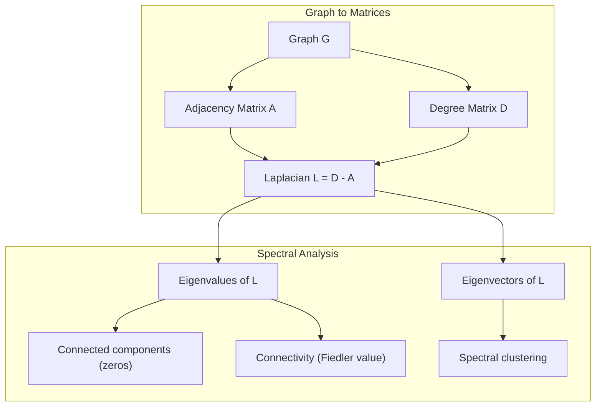
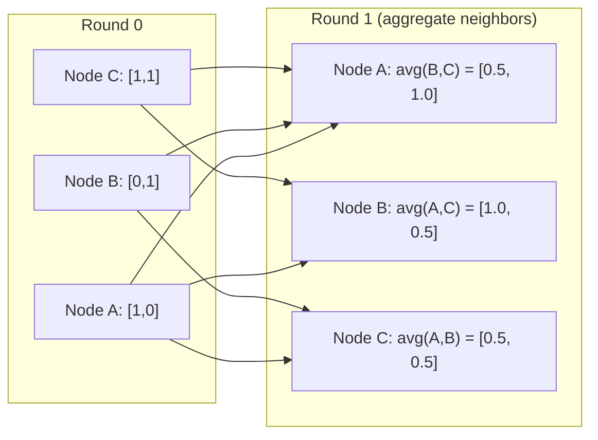

# 面向机器学习的图论

> 图是关系的数据结构。只要你的数据里有连接，就需要图论。

**类型：** 构建
**语言：** Python
**先修：** Phase 1, Lessons 01-03（线性代数、矩阵）
**时间：** ~90 分钟

## 学习目标

- 构建一个支持邻接矩阵/邻接表表示的 Graph 类，并实现 BFS 和 DFS 遍历
- 计算图拉普拉斯矩阵，并用它的特征值检测连通分量和聚类节点
- 将一轮 GNN 风格的消息传递实现为归一化邻接矩阵乘法
- 使用 Fiedler 向量应用谱聚类来划分图

## 要解决的问题

社交网络、分子、知识库、引用网络、道路地图 -- 它们都是图。传统 ML 把数据当作扁平表格。每一行彼此独立。每个特征是一列。但当连接结构本身很重要时，表格就不够用了。

想象一个社交网络。你想预测某个用户会买什么产品。这个用户自己的购买历史当然重要。但他们朋友的购买历史可能更重要。连接关系携带了信号。

再想象一个分子。你想预测它是否会与某种蛋白质结合。原子很重要，但真正关键的是原子之间如何成键。结构本身就是数据。

图神经网络（GNNs）是深度学习中增长最快的方向之一。它们驱动药物发现、社交推荐、欺诈检测和知识图谱推理。每个 GNN 都建立在同一块地基上：基础图论。

你需要四样东西：
1. 一种把图表示为矩阵的方法（这样就能做矩阵乘法）
2. 用来探索图结构的遍历算法
3. 拉普拉斯矩阵 -- 谱图理论中最重要的矩阵
4. 消息传递 -- 让 GNN 真正工作的操作

## 核心概念

### 图：节点与边

图 G = (V, E) 由顶点（节点）V 和边 E 组成。每条边连接两个节点。

**有向与无向。** 在无向图中，边 (u, v) 表示 u 连接到 v，同时 v 也连接到 u。在有向图（digraph）中，边 (u, v) 表示 u 指向 v，但反向不一定成立。

**加权与无权。** 在无权图中，边要么存在，要么不存在。在加权图中，每条边都有一个数值权重 -- 可以是距离、成本或强度。

| 图类型 | 示例 |
|-----------|---------|
| 无向、无权 | Facebook 好友网络 |
| 有向、无权 | Twitter 关注网络 |
| 无向、加权 | 道路地图（距离） |
| 有向、加权 | 网页链接（PageRank 分数） |

### 邻接矩阵

邻接矩阵 A 是核心表示。对于一个有 n 个节点的图：

```text
A[i][j] = 1    if there is an edge from node i to node j
A[i][j] = 0    otherwise
```

对无向图，A 是对称的：A[i][j] = A[j][i]。对加权图，A[i][j] = 边 (i, j) 的权重。

**示例 -- 一个三角形：**

```text
Nodes: 0, 1, 2
Edges: (0,1), (1,2), (0,2)

A = [[0, 1, 1],
     [1, 0, 1],
     [1, 1, 0]]
```

邻接矩阵是每个 GNN 的输入。对 A 做矩阵运算，对应的就是对图做操作。

### 度

节点的度是连接到它的边数量。对有向图，你还会区分入度（进入的边）和出度（出去的边）。

度矩阵 D 是对角矩阵：

```text
D[i][i] = degree of node i
D[i][j] = 0    for i != j
```

对三角形示例：D = diag(2, 2, 2)，因为每个节点都连接到另外两个节点。

度告诉你节点的重要性。高阶节点就是枢纽节点。一个网络的度分布会揭示它的结构。社交网络遵循幂律（少数枢纽节点，许多叶子节点）。随机图的度近似服从泊松分布。

### BFS 和 DFS

两个基本的图遍历算法。你两个都需要。

**广度优先搜索（BFS）：** 先探索所有邻居，再探索邻居的邻居。使用队列（FIFO）。

```text
BFS from node 0:
  Visit 0
  Queue: [1, 2]        (neighbors of 0)
  Visit 1
  Queue: [2, 3]        (add neighbors of 1)
  Visit 2
  Queue: [3]           (neighbors of 2 already visited)
  Visit 3
  Queue: []            (done)
```

BFS 会在无权图中找到最短路径。从起点到任意节点的距离，等于该节点第一次被发现时所在的 BFS 层级。这就是为什么 BFS 会用于社交网络中的跳数距离。

**深度优先搜索（DFS）：** 在回溯之前尽可能深入。使用栈（LIFO）或递归。

```text
DFS from node 0:
  Visit 0
  Stack: [1, 2]        (neighbors of 0)
  Visit 2               (pop from stack)
  Stack: [1, 3]         (add neighbors of 2)
  Visit 3               (pop from stack)
  Stack: [1]
  Visit 1               (pop from stack)
  Stack: []             (done)
```

DFS 适合用来：
- 寻找连通分量（从未访问节点运行 DFS）
- 环检测（DFS 树中的回边）
- 拓扑排序（反转 DFS 完成顺序）

| 算法 | 数据结构 | 找到什么 | 使用场景 |
|-----------|---------------|-------|----------|
| BFS | 队列 | 最短路径 | 社交网络距离、知识图谱遍历 |
| DFS | 栈 | 连通分量、环 | 连通性、拓扑排序 |

### 图拉普拉斯矩阵

L = D - A。它是谱图理论中最重要的矩阵。

对于三角形：

```text
D = [[2, 0, 0],    A = [[0, 1, 1],    L = [[2, -1, -1],
     [0, 2, 0],         [1, 0, 1],         [-1, 2, -1],
     [0, 0, 2]]         [1, 1, 0]]         [-1, -1,  2]]
```

拉普拉斯矩阵有一些非常漂亮的性质：

1. **L 是半正定的。** 所有特征值都 >= 0。

2. **零特征值的数量等于连通分量的数量。** 一个连通图恰好有一个零特征值。一个有 3 个非连通分量的图有三个零特征值。

3. **最小的非零特征值（Fiedler 值）衡量连接性。** 大的 Fiedler 值表示图连接得很好。小的 Fiedler 值表示图有薄弱点 -- 瓶颈。

4. **Fiedler 值对应的特征向量（Fiedler 向量）揭示最佳切分。** 正值节点放入一组，负值节点放入另一组。这就是谱聚类。



### 谱性质

邻接矩阵和拉普拉斯矩阵的特征值可以在不做任何遍历的情况下揭示结构性质。

**谱聚类** 的工作流程如下：
1. 计算拉普拉斯矩阵 L
2. 找到 L 的 k 个最小特征向量（跳过第一个；对连通图来说，它是全 1 向量）
3. 把这些特征向量当作每个节点的新坐标
4. 在这些坐标上运行 k-means

为什么这样有效？L 的特征向量编码了图上“最平滑”的函数。连接紧密的节点会获得相似的特征向量值。被瓶颈分开的节点会获得不同的值。特征向量会自然分离簇。

**与随机游走的联系。** 归一化拉普拉斯矩阵与图上的随机游走有关。随机游走的平稳分布与节点度成正比。混合时间（游走多快收敛）取决于谱间隙。

### 消息传递

图神经网络的核心操作。每个节点从邻居收集消息，聚合它们，然后更新自己的状态。

```text
h_v^(k+1) = UPDATE(h_v^(k), AGGREGATE({h_u^(k) : u in neighbors(v)}))
```

最简单的形式中，AGGREGATE = mean，UPDATE = 线性变换 + 激活函数：

```text
h_v^(k+1) = sigma(W * mean({h_u^(k) : u in neighbors(v)}))
```

这其实是披着外衣的矩阵乘法。如果 H 是所有节点特征的矩阵，A 是邻接矩阵：

```text
H^(k+1) = sigma(A_norm * H^(k) * W)
```

其中 A_norm 是归一化邻接矩阵（每一行求和为 1）。

一轮消息传递让每个节点“看见”它的直接邻居。两轮让它看见邻居的邻居。K 轮给每个节点提供来自 K 跳邻域的信息。



### 概念与 ML 应用

| 概念 | ML 应用 |
|---------|---------------|
| 邻接矩阵 | GNN 输入表示 |
| 图拉普拉斯矩阵 | 谱聚类、社区发现 |
| BFS/DFS | 知识图谱遍历、路径查找 |
| 度分布 | 节点重要性、特征工程 |
| 消息传递 | GNN 层（GCN、GAT、GraphSAGE） |
| L 的特征值 | 社区发现、图划分 |
| 谱聚类 | 无监督节点分组 |
| PageRank | 节点重要性、网页搜索 |

## 动手实现

### 步骤 1：从零实现 Graph 类

```python
class Graph:
    def __init__(self, n_nodes, directed=False):
        self.n = n_nodes
        self.directed = directed
        self.adj = {i: {} for i in range(n_nodes)}

    def add_edge(self, u, v, weight=1.0):
        self.adj[u][v] = weight
        if not self.directed:
            self.adj[v][u] = weight

    def neighbors(self, node):
        return list(self.adj[node].keys())

    def degree(self, node):
        return len(self.adj[node])

    def adjacency_matrix(self):
        import numpy as np
        A = np.zeros((self.n, self.n))
        for u in range(self.n):
            for v, w in self.adj[u].items():
                A[u][v] = w
        return A

    def degree_matrix(self):
        import numpy as np
        D = np.zeros((self.n, self.n))
        for i in range(self.n):
            D[i][i] = self.degree(i)
        return D

    def laplacian(self):
        return self.degree_matrix() - self.adjacency_matrix()
```

邻接表（`self.adj`）可以高效存储邻居。转换为邻接矩阵时使用 numpy，因为所有谱运算都需要它。

### 步骤 2：BFS 和 DFS

```python
from collections import deque

def bfs(graph, start):
    visited = set()
    order = []
    distances = {}
    queue = deque([(start, 0)])
    visited.add(start)
    while queue:
        node, dist = queue.popleft()
        order.append(node)
        distances[node] = dist
        for neighbor in graph.neighbors(node):
            if neighbor not in visited:
                visited.add(neighbor)
                queue.append((neighbor, dist + 1))
    return order, distances


def dfs(graph, start):
    visited = set()
    order = []
    stack = [start]
    while stack:
        node = stack.pop()
        if node in visited:
            continue
        visited.add(node)
        order.append(node)
        for neighbor in reversed(graph.neighbors(node)):
            if neighbor not in visited:
                stack.append(neighbor)
    return order
```

BFS 使用 deque（双端队列）来获得 O(1) 的 popleft。DFS 使用 list 作为栈。两者都会恰好访问每个节点一次 -- 时间复杂度 O(V + E)。

### 步骤 3：连通分量和拉普拉斯特征值

```python
def connected_components(graph):
    visited = set()
    components = []
    for node in range(graph.n):
        if node not in visited:
            order, _ = bfs(graph, node)
            visited.update(order)
            components.append(order)
    return components


def laplacian_eigenvalues(graph):
    import numpy as np
    L = graph.laplacian()
    eigenvalues = np.linalg.eigvalsh(L)
    return eigenvalues
```

`eigvalsh` 用于对称矩阵 -- 对无向图，拉普拉斯矩阵总是对称的。它会按升序返回特征值。数一数零值，就能得到连通分量的数量。

### 步骤 4：谱聚类

```python
def spectral_clustering(graph, k=2):
    import numpy as np
    L = graph.laplacian()
    eigenvalues, eigenvectors = np.linalg.eigh(L)
    features = eigenvectors[:, 1:k+1]

    labels = np.zeros(graph.n, dtype=int)
    for i in range(graph.n):
        if features[i, 0] >= 0:
            labels[i] = 0
        else:
            labels[i] = 1
    return labels
```

当 k=2 时，Fiedler 向量的符号会把图分成两个簇。当 k>2 时，你会在前 k 个特征向量（排除平凡的全 1 特征向量）上运行 k-means。

### 步骤 5：消息传递

```python
def message_passing(graph, features, weight_matrix):
    import numpy as np
    A = graph.adjacency_matrix()
    row_sums = A.sum(axis=1, keepdims=True)
    row_sums[row_sums == 0] = 1
    A_norm = A / row_sums
    aggregated = A_norm @ features
    output = aggregated @ weight_matrix
    return output
```

这是一轮 GNN 消息传递。每个节点的新特征是它邻居特征的加权平均，再经过权重矩阵变换。堆叠多轮，就能把信息传播得更远。

## 实际使用

使用 networkx 和 numpy，同样的操作都可以写成一行：

```python
import networkx as nx
import numpy as np

G = nx.karate_club_graph()

A = nx.adjacency_matrix(G).toarray()
L = nx.laplacian_matrix(G).toarray()

eigenvalues = np.linalg.eigvalsh(L.astype(float))
print(f"Smallest eigenvalues: {eigenvalues[:5]}")
print(f"Connected components: {nx.number_connected_components(G)}")

communities = nx.community.greedy_modularity_communities(G)
print(f"Communities found: {len(communities)}")

pr = nx.pagerank(G)
top_nodes = sorted(pr.items(), key=lambda x: x[1], reverse=True)[:5]
print(f"Top 5 PageRank nodes: {top_nodes}")
```

networkx 通过优化过的 C 后端处理各种规模的图。生产中用它。从零实现的版本用来理解它到底做了什么。

### numpy 谱分析

```python
import numpy as np

A = np.array([
    [0, 1, 1, 0, 0],
    [1, 0, 1, 0, 0],
    [1, 1, 0, 1, 0],
    [0, 0, 1, 0, 1],
    [0, 0, 0, 1, 0]
])

D = np.diag(A.sum(axis=1))
L = D - A

eigenvalues, eigenvectors = np.linalg.eigh(L)
print(f"Eigenvalues: {np.round(eigenvalues, 4)}")
print(f"Fiedler value: {eigenvalues[1]:.4f}")
print(f"Fiedler vector: {np.round(eigenvectors[:, 1], 4)}")

fiedler = eigenvectors[:, 1]
group_a = np.where(fiedler >= 0)[0]
group_b = np.where(fiedler < 0)[0]
print(f"Cluster A: {group_a}")
print(f"Cluster B: {group_b}")
```

Fiedler 向量完成了核心工作。正条目属于一个簇，负条目属于另一个簇。不需要迭代优化 -- 只需要一次特征分解。

## 交付成果

本课产出：
- `outputs/skill-graph-analysis.md` -- 一个用于分析图结构数据的技能参考

## 关联

| 概念 | 出现位置 |
|---------|------------------|
| 邻接矩阵 | GCN、GAT、GraphSAGE 的输入 |
| 拉普拉斯矩阵 | 谱聚类、ChebNet 滤波器 |
| BFS | 知识图谱遍历、最短路径查询 |
| 消息传递 | 每个 GNN 层、神经消息传递 |
| 谱间隙 | 图连通性、随机游走的混合时间 |
| 度分布 | 幂律网络、节点特征工程 |
| 连通分量 | 预处理、处理非连通图 |
| PageRank | 节点重要性排序、注意力初始化 |

GNNs 值得特别说明。GCN（Kipf & Welling, 2017）中的图卷积操作使用加入自环的邻接矩阵，A_hat = A + I：

```text
H^(l+1) = sigma(D_hat^(-1/2) * A_hat * D_hat^(-1/2) * H^(l) * W^(l))
```

其中 A_hat = A + I（邻接矩阵加自环），D_hat 是 A_hat 的度矩阵。自环确保每个节点在聚合时包含自己的特征。这正是带对称归一化的消息传递。D_hat^(-1/2) * A_hat * D_hat^(-1/2) 是归一化邻接矩阵。拉普拉斯矩阵会出现，是因为这种归一化与 L_sym = I - D^(-1/2) * A * D^(-1/2) 相关。理解拉普拉斯矩阵，就等于理解 GCNs 为什么有效。

## 练习

1. **从零实现 PageRank。** 从均匀分数开始。每一步：score(v) = (1-d)/n + d * sum(score(u)/out_degree(u))，其中 u 是所有指向 v 的节点。使用 d=0.85。运行到收敛（change < 1e-6）。在一个小型网页图上测试。

2. **使用谱聚类寻找社区。** 创建一个有两个清晰分离簇的图（例如两个团之间只有一条边相连）。运行谱聚类，并验证它找到正确切分。随着你添加更多跨簇边，会发生什么？

3. **为加权图实现 Dijkstra 算法** 来求最短路径。在同一张图上使用均匀权重，将结果与 BFS 对比。

4. **构建一个 2 层消息传递网络。** 使用不同的权重矩阵应用两次消息传递。展示经过 2 轮后，每个节点都拥有来自 2 跳邻域的信息。

5. **分析一个真实世界图。** 使用 Karate Club 图（34 个节点，78 条边）。计算度分布、拉普拉斯特征值和谱聚类。将谱聚类的结果与已知真实切分对比。

## 关键术语

| 术语 | 常见说法 | 实际含义 |
|------|----------------|----------------------|
| 图 | “节点和边” | 一种数学结构 G=(V,E)，用于编码成对关系 |
| 邻接矩阵 | “连接表” | 一个 n x n 矩阵；若节点 i 和 j 相连，则 A[i][j] = 1 |
| 度 | “一个节点连接得有多广” | 触及某个节点的边数量 |
| 拉普拉斯矩阵 | “D 减 A” | L = D - A；其特征值揭示图结构 |
| Fiedler 值 | “代数连通度” | L 的最小非零特征值，用来衡量图连接得有多好 |
| BFS | “逐层搜索” | 先访问所有邻居再深入的遍历，会找到最短路径 |
| DFS | “先往深处走” | 沿一条路径走到尽头再回溯的遍历 |
| 消息传递 | “节点和邻居交流” | 每个节点聚合来自邻居的信息，是 GNNs 的核心 |
| 谱聚类 | “按特征向量聚类” | 使用拉普拉斯矩阵的特征向量来划分图 |
| 连通分量 | “单独的一块” | 一个极大子图，其中每个节点都能到达每个其他节点 |

## 延伸阅读

- **Kipf & Welling (2017)** -- "Semi-Supervised Classification with Graph Convolutional Networks." 开创现代 GNNs 的论文。展示谱图卷积如何简化为消息传递。
- **Spielman (2012)** -- "Spectral Graph Theory" 讲义。关于拉普拉斯矩阵、谱间隙和图划分的权威入门。
- **Hamilton (2020)** -- "Graph Representation Learning." 一本覆盖 GNNs 从基础到应用的书。
- **Bronstein et al. (2021)** -- "Geometric Deep Learning: Grids, Groups, Graphs, Geodesics, and Gauges." 统一框架论文。
- **Veličković et al. (2018)** -- "Graph Attention Networks." 用注意力机制扩展消息传递。
