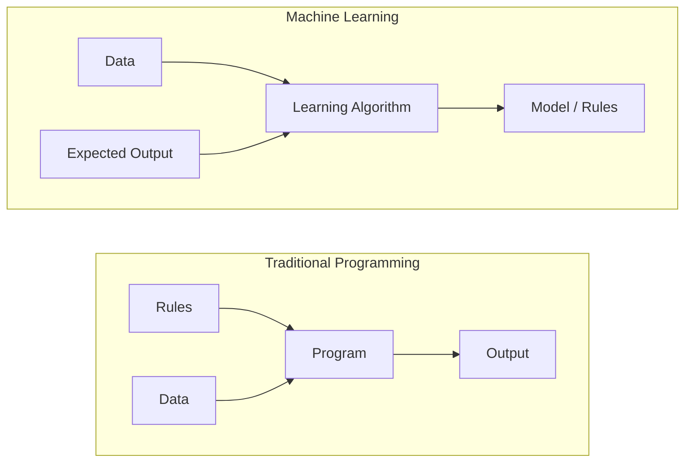
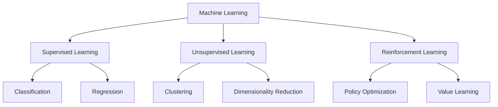
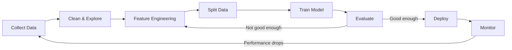
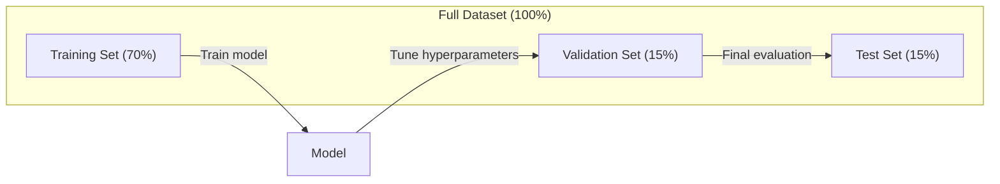
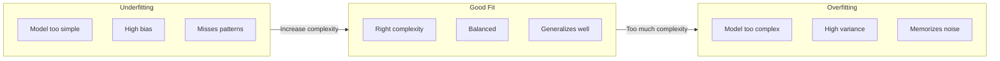
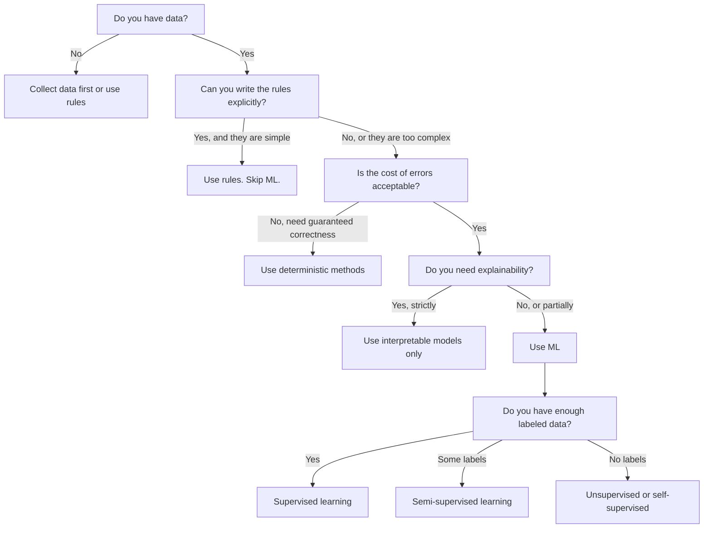

# 什么是机器学习

> 机器学习是在教计算机从数据中寻找模式，而不是手写规则。

**类型:** 学习
**语言:** Python
**先修:** 第 1 阶段（数学基础）
**时间:** ~45 分钟

## 学习目标

- 解释监督学习、无监督学习和强化学习的区别，并判断给定问题适合哪一类
- 从零实现最近质心分类器，并把它与随机基线对比评估
- 区分分类和回归任务，并为每类任务选择合适的损失函数
- 判断一个给定的业务问题是否适合使用 ML，还是更适合用确定性规则解决

## 要解决的问题

你想构建一个垃圾邮件过滤器。传统做法是：坐下来写几百条规则。“如果邮件包含 `免费赚钱`，就标记为垃圾邮件。如果有超过 3 个感叹号，就标记为垃圾邮件。”你花了几周写规则。然后垃圾邮件发送者换了措辞。你的规则失效。你再写更多规则。这个循环永远停不下来。

机器学习把这件事反过来。你不再手写规则，而是给计算机成千上万封已经标注好的邮件（“垃圾邮件”或“非垃圾邮件”），让它自己找出规则。计算机会发现你从未想到过的模式。当垃圾邮件发送者改变策略时，你用新数据重新训练，而不是重写代码。

这种从“编写规则”到“从数据中学习”的转变，就是机器学习的核心。每个推荐引擎、语音助手、自动驾驶汽车和语言模型都以这种方式工作。

## 核心概念

### 从数据学习，而不是从规则学习

传统编程和机器学习是从相反方向解决问题的。



传统编程：你写规则。程序把规则应用到数据上，生成输出。

机器学习：你提供数据和期望输出。算法发现规则。

训练后得到的“模型”本身就是规则，只不过它被编码成数字（权重、参数）。它会从见过的样本中泛化，并对从未见过的数据做预测。

### 机器学习的三种类型



**监督学习**：你有输入-输出对。模型学习如何把输入映射到输出。
- “这里有 10,000 张标注为猫或狗的照片。学会把它们区分开。”
- “这里有房屋特征和价格。学会预测价格。”

**无监督学习**：你只有输入，没有标签。模型自己寻找结构。
- “这里有 10,000 条客户购买历史。找出自然分组。”
- “这里有 1,000 维的数据点。在保留结构的同时降到 2 维。”

**强化学习**：智能体在环境中采取动作，并接收奖励或惩罚。它学习一种策略来最大化总奖励。
- “玩这个游戏。赢了 +1，输了 -1。自己找出策略。”
- “控制这个机械臂。拿起物体 +1，每浪费一秒 -0.01。”

实践中你会构建的大多数东西都使用监督学习。无监督学习常用于预处理和探索。强化学习支撑游戏 AI、机器人，以及语言模型中的 RLHF。

### 超越这三大类

上面的三类很清晰，但真实世界的 ML 经常模糊边界。

**半监督学习** 使用少量有标注数据和大量无标注数据。你可能有 100 张已标注的医学图像，以及 100,000 张未标注图像。常见技术包括：

- **标签传播：** 构建一张连接相似数据点的图。标签会从已标注节点通过图传播到未标注邻居。
- **伪标签：** 先在有标注数据上训练模型，用它为无标注数据预测标签，然后在全部数据上重新训练。模型会自举出自己的训练集。
- **一致性正则化：** 对同一个输入及其轻微扰动版本，模型应该给出相同预测。即使没有标签，这也能发挥作用。

**自监督学习** 从数据本身创建监督信号。完全不需要人工标签。模型会根据数据结构创建自己的预测任务。

- **掩码语言建模 (BERT)：** 隐藏句子中 15% 的词，训练模型预测缺失的词。“标签”来自原始文本。
- **对比学习 (SimCLR)：** 取一张图像，创建两个增强版本。训练模型识别它们来自同一张图像，同时把它们与其他图像的增强版本区分开。
- **下一个词元预测 (GPT)：** 给定之前所有词，预测下一个词。每个文本文档都会变成一个训练样本。

这些并不是独立于三大类之外的新类别。它们是结合监督学习和无监督学习思想的策略。自监督学习在技术上属于监督式任务（模型在预测某个东西），但标签是自动生成的，而不是人类标注的。

### 分类与回归

这是监督学习的两个主要任务。

| 方面 | 分类 | 回归 |
|--------|---------------|------------|
| 输出 | 离散类别 | 连续数字 |
| 示例 | “这封邮件是垃圾邮件吗？” | “房价会是多少？” |
| 输出空间 | {猫, 狗, 鸟} | 任意实数 |
| 损失函数 | 交叉熵、准确率 | 均方误差、MAE |
| 决策 | 类别之间的边界 | 拟合数据的曲线 |

分类回答“属于哪个类别？”回归回答“是多少？”

有些问题可以用两种方式建模。预测股票会上涨还是下跌是分类。预测确切价格是回归。

### ML 工作流

无论算法是什么，每个机器学习项目都遵循同一条流程。



**收集数据**：收集原始数据。更多数据几乎总是更好，但质量比数量更重要。

**清理与探索**：处理缺失值、移除重复项、可视化分布、发现异常。这个步骤通常会占整个项目时间的 60-80%。

**特征工程**：把原始数据转换成模型可用的特征。把日期转成星期几。归一化数值列。编码类别变量。好的特征比花哨算法更重要。

**划分数据**：划分训练集、验证集和测试集。模型在训练数据上训练，你在验证数据上调超参数，并在测试数据上报告最终性能。

**训练模型**：把训练数据输入算法。算法调整内部参数来最小化损失函数。

**评估**：在验证/测试数据上衡量性能。如果性能不可接受，就回去尝试不同的特征、算法或超参数。

**部署**：把模型放到生产环境，让它对新数据做预测。

**监控**：随时间追踪性能。数据分布会变化（数据漂移），模型会退化。当性能下降时，重新训练。

### 训练、验证和测试划分

这是初学者最容易弄错的核心概念。你必须在模型训练期间从未见过的数据上评估它。否则你衡量的是记忆，而不是学习。



| 划分 | 用途 | 使用时机 | 典型大小 |
|-------|---------|-----------|-------------|
| 训练集 | 模型从这些数据中学习 | 训练期间 | 60-80% |
| 验证集 | 调整超参数、比较模型 | 每次训练运行之后 | 10-20% |
| 测试集 | 最终的无偏性能估计 | 只在最后使用一次 | 10-20% |

测试集是神圣的。你只看它一次。如果你持续根据测试性能调整模型，你实际上就是在测试集上训练，报告出来的数字也就失去了意义。

对于小数据集，使用 k 折交叉验证：把数据分成 k 份，在 k-1 份上训练，在剩下一份上验证，轮换并对结果取平均。

### 过拟合与欠拟合



**欠拟合**：模型太简单，无法捕捉数据中的模式。就像用直线去拟合弯曲关系。训练误差高，测试误差也高。

**过拟合**：模型太复杂，记住了训练数据，包括其中的噪声。就像一条穿过每个训练点的波浪线，但在新数据上失效。训练误差低，测试误差高。

**良好拟合**：模型捕捉到了真实模式，但没有记住噪声。训练误差和测试误差都比较低。

过拟合的迹象：
- 训练准确率远高于验证准确率
- 模型在训练数据上表现很好，但在新数据上表现很差
- 增加更多训练数据会提升性能（模型之前是在记忆，而不是学习）

修复过拟合：
- 获取更多训练数据
- 降低模型复杂度（更少参数、更简单架构）
- 正则化（对大权重增加惩罚）
- 随机失活（Dropout，训练期间随机把神经元置零）
- 早停（当验证误差开始上升时停止训练）

修复欠拟合：
- 使用更复杂的模型
- 添加更多特征
- 降低正则化
- 训练更久

### 偏差-方差权衡

这是过拟合和欠拟合背后的数学框架。

**偏差**：来自模型错误假设的误差。当真实关系是非线性的，而模型是线性模型时，偏差就很高。高偏差会导致欠拟合。

**方差**：来自模型对训练数据中微小波动过度敏感的误差。高方差的模型在不同数据子集上训练时，会给出非常不同的预测。高方差会导致过拟合。

| 模型复杂度 | 偏差 | 方差 | 结果 |
|-----------------|------|----------|--------|
| 太低（用线性模型拟合弯曲数据） | 高 | 低 | 欠拟合 |
| 刚好 | 中 | 中 | 良好泛化 |
| 太高（用 20 次多项式拟合 10 个点） | 低 | 高 | 过拟合 |

总误差 = 偏差^2 + 方差 + 不可约噪声

你无法降低不可约噪声（它是数据本身的随机性）。你要找到偏差^2 + 方差最小的甜点。

### 没有免费午餐定理

没有任何单一算法在所有问题上都表现最好。在某一类问题上表现好的算法，在另一类问题上可能表现很差。这就是数据科学家会尝试多个算法并比较结果的原因。

实践中，选择取决于：
- 你有多少数据
- 有多少特征
- 关系是线性还是非线性
- 你是否需要可解释性
- 你能负担多少计算资源

### 什么时候不要使用机器学习

ML 很强大，但不总是正确工具。在拿起模型之前，先问自己是否真的需要它。

**不要在这些情况下使用 ML：**

- **规则简单且定义清楚。** 税额计算、排序算法、单位换算。如果你可以用几个 if 语句写出逻辑，模型只会增加复杂度，不带来收益。
- **你没有数据，或数据极少。** ML 需要从样本中学习。只有 10 个数据点时，你训练不出任何有意义的东西。先收集数据。
- **出错代价是灾难性的，而你需要保证正确性。** 医疗剂量计算、核反应堆控制、密码学验证。ML 模型是概率性的。它们有时会错。如果“有时会错”不可接受，就用确定性方法。
- **查找表或启发式规则已经能解决问题。** 如果一个简单阈值或表能覆盖 99% 的情况，加入 ML 只会增加维护成本，却没有实质改进。
- **你无法解释决策，而场景要求可解释性。** 受监管行业（借贷、保险、刑事司法）有时要求每个决策都能被完整解释。有些 ML 模型可解释（线性回归、小型决策树），大多数则不行。
- **问题变化快于你重新训练的速度。** 如果规则每天变化，而重新训练需要一周，模型就永远是过时的。

使用这个决策流程图：



## 动手实现

`code/ml_intro.py` 中的代码从零实现了最近质心分类器，这是最简单的 ML 算法。它展示了核心思想：从数据中学习，然后对新数据做预测。

### 第 1 步：从零实现最近质心分类器

最近质心分类器会计算训练数据中每个类别的中心（均值）。预测时，它把每个新点分配给距离最近的类别中心。

```python
class NearestCentroid:
    def fit(self, X, y):
        self.classes = np.unique(y)
        self.centroids = np.array([
            X[y == c].mean(axis=0) for c in self.classes
        ])

    def predict(self, X):
        distances = np.array([
            np.sqrt(((X - c) ** 2).sum(axis=1))
            for c in self.centroids
        ])
        return self.classes[distances.argmin(axis=0)]
```

这就是完整算法。`fit` 计算两个均值。`predict` 计算距离。没有梯度下降，没有迭代，没有超参数。

### 第 2 步：在合成数据上训练

我们生成一个二维分类数据集，其中两个类别有轻微重叠。最近质心分类器会在类别中心之间画出一条线性决策边界。

```python
rng = np.random.RandomState(42)
X_class0 = rng.randn(100, 2) + np.array([1.0, 1.0])
X_class1 = rng.randn(100, 2) + np.array([-1.0, -1.0])
X = np.vstack([X_class0, X_class1])
y = np.array([0] * 100 + [1] * 100)
```

### 第 3 步：与基线对比

每个 ML 模型都应该和一个简单基线对比。这里的基线会随机预测类别。如果你的 ML 模型打不过随机猜测，那就说明哪里出了问题。

```python
baseline_preds = rng.choice([0, 1], size=len(y_test))
baseline_acc = np.mean(baseline_preds == y_test)
```

在这个干净数据集上，最近质心分类器应该能达到约 90%+ 准确率。随机基线大约是 50%。

### 为什么这很重要

最近质心分类器简单到极致。它没有超参数，没有迭代，也没有梯度下降。但它捕捉了机器学习的基本模式：

1. **学习** 从训练数据中学习一种表示（质心）
2. **预测** 使用该表示在新数据上预测（最近距离）
3. **评估** 与基线对比评估（随机猜测）

从逻辑回归到 Transformer，每个 ML 算法都遵循同样的三步模式。表示会变得更复杂，但工作流保持不变。

### 第 4 步：最近质心分类器做不到什么

最近质心分类器假设每个类别都形成单个团块。它画出的是线性决策边界。它会在这些情况下失效：

- 类别有多个簇（例如数字 “1” 可以有几种不同写法）
- 决策边界是非线性的（例如一个类别包围另一个类别）
- 特征的尺度差异很大（距离会被最大尺度的特征主导）

这些限制会引出你接下来要学习的所有其他算法。K 近邻能处理多个簇。决策树能处理非线性边界。特征缩放能修复尺度问题。每节课都会建立在上一节课的限制之上。

## 实际使用

sklearn 提供了 `NearestCentroid` 和合成数据生成器：

```python
from sklearn.neighbors import NearestCentroid
from sklearn.datasets import make_classification
from sklearn.model_selection import train_test_split

X, y = make_classification(
    n_samples=500, n_features=2, n_redundant=0,
    n_clusters_per_class=1, random_state=42
)
X_train, X_test, y_train, y_test = train_test_split(X, y, test_size=0.3)

clf = NearestCentroid()
clf.fit(X_train, y_train)
print(f"Accuracy: {clf.score(X_test, y_test):.3f}")
```

## 交付成果

本课产出 `outputs/prompt-ml-problem-framer.md`，这是一个把模糊业务问题转成具体 ML 任务的提示词。给它一个问题描述（比如“我们想降低流失率”或“预测下一季度需求”），它会识别学习类型、定义预测目标、列出候选特征、选择成功指标、建立基线，并标记数据泄漏或类别不平衡这类陷阱。在任何 ML 项目开始时使用它，可以避免构建错误的东西。

## 关键术语

| 术语 | 人们常说 | 实际含义 |
|------|----------------|----------------------|
| 模型 | “这个 AI” | 一个带有可学习参数的数学函数，用来把输入映射到输出 |
| 训练 | “教 AI” | 运行优化算法来调整模型参数，使预测匹配已知输出 |
| 特征 | “一个输入列” | 数据中可度量的属性，模型用它来做预测 |
| 标签 | “答案” | 训练样本的已知输出，用来计算误差信号 |
| 超参数 | “你调的设置” | 训练前设置的参数，用来控制学习过程（学习率、层数） |
| 损失函数 | “模型错得有多离谱” | 衡量预测输出和实际输出之间差距的函数，训练会尝试最小化它 |
| 过拟合 | “它记住了测试集” | 模型学到了训练集特有的噪声，而不是一般模式，因此会在新数据上失效 |
| 欠拟合 | “它什么也没学到” | 模型太简单，无法捕捉数据中的真实模式 |
| 泛化 | “它在新数据上也能用” | 模型在未训练过的数据上做出准确预测的能力 |
| 交叉验证 | “在不同块上测试” | 反复把数据分成训练/测试折并平均结果，给出更稳健的性能估计 |
| 正则化 | “让权重保持小” | 在损失函数中加入惩罚项，抑制过度复杂的模型 |
| 数据漂移 | “世界变了” | 输入数据的统计分布随时间发生偏移，导致模型性能下降 |

## 练习

1. 取任意数据集（例如 Iris、Titanic）。把它按 70/15/15 划分为训练/验证/测试。解释为什么不应该在测试集上调超参数。
2. 列出三个真实世界问题。对每个问题，判断它是分类、回归还是聚类，以及它是监督学习还是无监督学习。
3. 一个模型在训练数据上达到 99% 准确率，但在测试数据上只有 60%。诊断问题，并列出三种你会尝试的修复方法。

## 延伸阅读

- [An Introduction to Statistical Learning](https://www.statlearning.com/) - 免费教材，覆盖所有经典 ML 方法并提供实践示例
- [Google's Machine Learning Crash Course](https://developers.google.com/machine-learning/crash-course) - 对 ML 概念的简洁可视化介绍
- [Scikit-learn User Guide](https://scikit-learn.org/stable/user_guide.html) - 在 Python 中实现 ML 的实用参考
