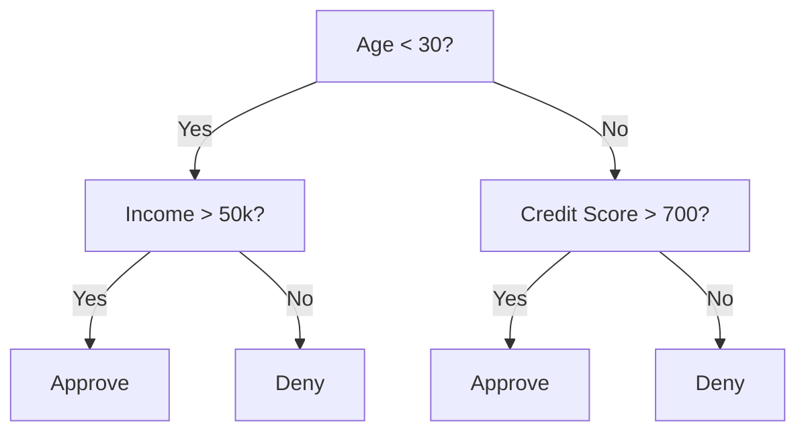
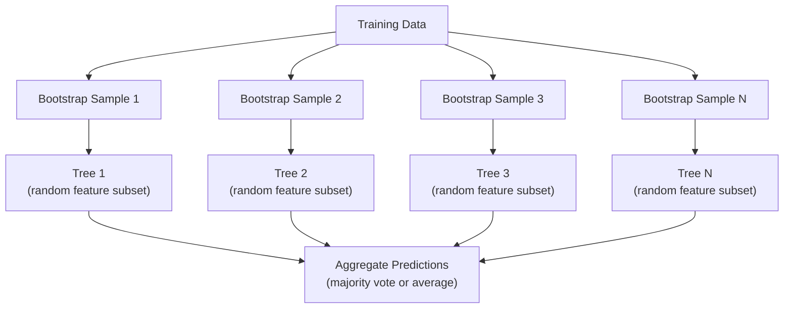

# 决策树与随机森林

> 决策树本质上只是流程图。但一片由它们组成的森林，是机器学习中最强大的工具之一。

**类型:** 构建
**语言:** Python
**先修:** 第 1 阶段（第 09 课信息论、第 06 课概率）
**时间:** ~90 分钟

## 学习目标

- 实现基尼不纯度、熵和信息增益的计算，用来寻找最优决策树划分
- 从零实现带有预剪枝控制（最大深度、最小样本数）的决策树分类器
- 使用自助采样和特征随机化构造随机森林，并解释它为什么能降低方差
- 比较 MDI 特征重要性与置换重要性，并识别 MDI 什么时候会有偏差

## 要解决的问题

你有一份表格数据。行是样本，列是特征，还有一个你想预测的目标列。你可以把神经网络直接扔上去。但对于表格数据，基于树的模型（决策树、随机森林、梯度提升树）一直都比深度学习表现更稳。结构化数据上的 Kaggle 竞赛通常由 XGBoost 和 LightGBM 主导，而不是 Transformer。

为什么？树无需预处理就能处理混合特征类型（数值型和类别型）。它们无需特征工程就能处理非线性关系。它们可解释：你可以看着树，精确知道一次预测为什么会发生。而随机森林会平均许多棵树，对中等规模数据集上的过拟合非常有抵抗力。

本课先用递归划分从零实现决策树，再在它之上构建随机森林。你会实现划分准则背后的数学（基尼不纯度、熵、信息增益），并理解为什么一组弱学习器的集成会变成强学习器。

## 核心概念

### 决策树做了什么

决策树通过提出一串是/否问题，把特征空间划分成矩形区域。



每个内部节点都会拿某个特征和一个阈值做测试。每个叶子节点给出预测。要分类一个新的数据点，你从根节点开始，沿着分支一路走到某个叶子。

树是自顶向下构建的：在每个节点，选择最能分离数据的特征和阈值。“最好”由划分准则定义。

### 划分准则：衡量不纯度

在每个节点，我们都有一组样本。我们希望把它们划分开，使得到的子节点尽可能“纯”，也就是每个子节点大多只包含一个类别。

**基尼不纯度**衡量的是：如果按照该节点的类别分布给一个随机选中的样本打标签，它被错分的概率。

```text
Gini(S) = 1 - sum(p_k^2)

where p_k is the proportion of class k in set S.
```

对于纯节点（全是同一类），基尼不纯度 = 0。对于类别各占 50/50 的二分类划分，基尼不纯度 = 0.5。越低越好。

```text
Example: 6 cats, 4 dogs

Gini = 1 - (0.6^2 + 0.4^2) = 1 - (0.36 + 0.16) = 0.48
```

**熵**衡量节点中的信息含量（无序程度）。它已在第 1 阶段第 09 课中讲过。

```text
Entropy(S) = -sum(p_k * log2(p_k))
```

对于纯节点，熵 = 0。对于 50/50 的二分类划分，熵 = 1.0。越低越好。

```text
Example: 6 cats, 4 dogs

Entropy = -(0.6 * log2(0.6) + 0.4 * log2(0.4))
        = -(0.6 * -0.737 + 0.4 * -1.322)
        = 0.442 + 0.529
        = 0.971 bits
```

**信息增益**是一次划分后不纯度（熵或基尼不纯度）的降低量。

```text
IG(S, feature, threshold) = Impurity(S) - weighted_avg(Impurity(S_left), Impurity(S_right))

where the weights are the proportions of samples in each child.
```

每个节点上的贪心算法是：尝试每个特征和每个可能的阈值。选择让信息增益最大的 `(feature, threshold)` 对。

### 划分如何工作

对于当前节点中有 n 个特征、m 个样本的数据集：

1. 对每个特征 j（j = 1 到 n）：
   - 按特征 j 对样本排序
   - 尝试相邻不同取值之间的每一个中点作为阈值
   - 计算每个阈值的信息增益
2. 选择信息增益最高的特征和阈值
3. 把数据划分成 left（feature <= threshold）和 right（feature > threshold）
4. 对每个子节点递归执行

这种贪心方法不保证得到全局最优树。寻找最优树是 NP-hard 的。但在实践中，贪心划分效果很好。

### 停止条件

如果没有停止条件，树会一直生长，直到每个叶子都是纯的（每个叶子一个样本）。这会完美记住训练数据，但泛化能力极差。

**预剪枝**会在树完全长成之前停止：
- 最大深度：当树达到设定深度时停止划分
- 每个叶子的最小样本数：如果某个节点少于 k 个样本，就停止
- 最小信息增益：如果最好的划分让不纯度的改善小于某个阈值，就停止
- 最大叶子节点数：限制叶子总数

**后剪枝**先长出完整的树，再把它修剪回来：
- 代价复杂度剪枝（scikit-learn 使用）：加入一个与叶子数量成正比的惩罚项。惩罚越大，树越小
- 错误率降低剪枝：如果移除某个子树不会增加验证误差，就移除它

预剪枝更简单、更快。后剪枝常常能产生更好的树，因为它不会过早阻止那些可能继续产生有用划分的节点。

### 用于回归的决策树

对于回归，叶子节点的预测是该叶子中目标值的均值。划分准则也会改变：

**方差降低**替代信息增益：

```text
VR(S, feature, threshold) = Var(S) - weighted_avg(Var(S_left), Var(S_right))
```

选择让方差降低最多的划分。树会把输入空间划分成不同区域，并在每个区域中预测一个常数（均值）。

### 随机森林：集成的力量

单棵决策树是高方差的。数据中的小变化可能产生完全不同的树。随机森林通过平均许多棵树来修复这一点。



两种随机性来源让这些树彼此多样：

**装袋法（自助聚合）：** 每棵树都在一个自助样本上训练，也就是从训练数据中有放回地随机抽样。每个自助样本中大约会出现原始样本的 63%（其余是袋外样本，可用于验证）。

**特征随机化：** 在每次划分时，只考虑随机抽取的一部分特征。分类任务的默认值是 sqrt(n_features)。回归任务是 n_features/3。这可以防止所有树都在同一个主导特征上划分。

关键洞见：平均许多去相关的树，可以在不增加偏差的情况下降低方差。每一棵单独的树可能表现平平。集成很强。

### 特征重要性

随机森林天然提供特征重要性分数。最常见的方法是：

**平均不纯度降低（MDI）：** 对每个特征，把所有树中所有使用该特征的节点产生的不纯度降低量加总。越早的划分中产生越大不纯度降低的特征越重要。

```text
importance(feature_j) = sum over all nodes where feature_j is used:
    (n_samples_at_node / n_total_samples) * impurity_decrease
```

这很快（训练时即可计算），但会偏向高基数特征，以及有许多可能划分点的特征。

**置换重要性**是另一种方法：打乱某个特征的取值，测量模型准确率下降多少。它更可靠，但更慢。

### 树什么时候胜过神经网络

在表格数据上，树和森林压过神经网络。原因有好几个：

| 因素 | 树 | 神经网络 |
|--------|-------|----------------|
| 混合类型（数值型 + 类别型） | 原生支持 | 需要编码 |
| 小数据集（< 10k 行） | 表现良好 | 过拟合 |
| 特征交互 | 通过划分发现 | 需要架构设计 |
| 可解释性 | 完全透明 | 黑盒 |
| 训练时间 | 分钟级 | 小时级 |
| 超参数敏感度 | 低 | 高 |

当数据具有空间或序列结构（图像、文本、音频）时，神经网络会赢。对于扁平的特征表，树是默认选择。

## 动手实现

### 步骤 1：基尼不纯度和熵

从零实现两种划分准则，并验证它们对好划分的判断是一致的。

```python
import math

def gini_impurity(labels):
    n = len(labels)
    if n == 0:
        return 0.0
    counts = {}
    for label in labels:
        counts[label] = counts.get(label, 0) + 1
    return 1.0 - sum((c / n) ** 2 for c in counts.values())

def entropy(labels):
    n = len(labels)
    if n == 0:
        return 0.0
    counts = {}
    for label in labels:
        counts[label] = counts.get(label, 0) + 1
    return -sum(
        (c / n) * math.log2(c / n) for c in counts.values() if c > 0
    )
```

### 步骤 2：寻找最佳划分

尝试每个特征和每个阈值。返回信息增益最高的那个。

```python
def information_gain(parent_labels, left_labels, right_labels, criterion="gini"):
    measure = gini_impurity if criterion == "gini" else entropy
    n = len(parent_labels)
    n_left = len(left_labels)
    n_right = len(right_labels)
    if n_left == 0 or n_right == 0:
        return 0.0
    parent_impurity = measure(parent_labels)
    child_impurity = (
        (n_left / n) * measure(left_labels) +
        (n_right / n) * measure(right_labels)
    )
    return parent_impurity - child_impurity
```

### 步骤 3：构建 DecisionTree 类

递归划分、预测，并跟踪特征重要性。

```python
class DecisionTree:
    def __init__(self, max_depth=None, min_samples_split=2,
                 min_samples_leaf=1, criterion="gini",
                 max_features=None):
        self.max_depth = max_depth
        self.min_samples_split = min_samples_split
        self.min_samples_leaf = min_samples_leaf
        self.criterion = criterion
        self.max_features = max_features
        self.tree = None
        self.feature_importances_ = None

    def fit(self, X, y):
        self.n_features = len(X[0])
        self.feature_importances_ = [0.0] * self.n_features
        self.n_samples = len(X)
        self.tree = self._build(X, y, depth=0)
        total = sum(self.feature_importances_)
        if total > 0:
            self.feature_importances_ = [
                fi / total for fi in self.feature_importances_
            ]

    def predict(self, X):
        return [self._predict_one(x, self.tree) for x in X]
```

### 步骤 4：构建 RandomForest 类

自助采样、特征随机化和多数投票。

```python
class RandomForest:
    def __init__(self, n_trees=100, max_depth=None,
                 min_samples_split=2, max_features="sqrt",
                 criterion="gini"):
        self.n_trees = n_trees
        self.max_depth = max_depth
        self.min_samples_split = min_samples_split
        self.max_features = max_features
        self.criterion = criterion
        self.trees = []

    def fit(self, X, y):
        n = len(X)
        for _ in range(self.n_trees):
            indices = [random.randint(0, n - 1) for _ in range(n)]
            X_boot = [X[i] for i in indices]
            y_boot = [y[i] for i in indices]
            tree = DecisionTree(
                max_depth=self.max_depth,
                min_samples_split=self.min_samples_split,
                max_features=self.max_features,
                criterion=self.criterion,
            )
            tree.fit(X_boot, y_boot)
            self.trees.append(tree)

    def predict(self, X):
        all_preds = [tree.predict(X) for tree in self.trees]
        predictions = []
        for i in range(len(X)):
            votes = {}
            for preds in all_preds:
                v = preds[i]
                votes[v] = votes.get(v, 0) + 1
            predictions.append(max(votes, key=votes.get))
        return predictions
```

完整实现以及所有辅助方法见 `code/trees.py`。

## 实际使用

使用 scikit-learn，训练一个随机森林只需要三行：

```python
from sklearn.ensemble import RandomForestClassifier
from sklearn.datasets import load_iris
from sklearn.model_selection import train_test_split

X, y = load_iris(return_X_y=True)
X_train, X_test, y_train, y_test = train_test_split(X, y, random_state=42)

rf = RandomForestClassifier(n_estimators=100, random_state=42)
rf.fit(X_train, y_train)
print(f"Accuracy: {rf.score(X_test, y_test):.4f}")
print(f"Feature importances: {rf.feature_importances_}")
```

在实践中，梯度提升树（XGBoost、LightGBM、CatBoost）通常比随机森林更强，因为它们会按顺序构建树，每一棵树都修正前面那些树的错误。但随机森林更不容易配错，而且几乎不需要调超参数。

## 交付成果

本课产出 `outputs/prompt-tree-interpreter.md` -- 一个为业务相关方解释决策树划分的提示词。把训练好的树结构（深度、特征、划分阈值、准确率）喂给它，它会把模型翻译成平实语言规则，对特征重要性排序，标记过拟合或泄漏，并建议下一步行动。任何时候只要你需要向不读代码的人解释一个基于树的模型，都可以使用它。

## 练习

1. 在一个有 3 个类别的 2D 数据集上训练单棵决策树。手动跟踪划分，并画出矩形决策边界。比较 max_depth=2 和 max_depth=10 时的边界。

2. 为回归树实现方差降低划分。为 200 个点生成 y = sin(x) + noise，并拟合你的回归树。把树的分段常数预测和真实曲线画在一起。

3. 分别用 1、5、10、50 和 200 棵树构建随机森林。绘制训练准确率和测试准确率随树数量变化的曲线。观察测试准确率会进入平台期，但不会下降（森林能抵抗过拟合）。

4. 在 5 个不同数据集上比较基尼不纯度和熵作为划分准则的效果。测量准确率和树深度。大多数情况下，它们会产生几乎相同的结果。解释原因。

5. 实现置换重要性。在一个包含随机噪声特征但该特征基数很高的数据集上，把它和 MDI 重要性比较。MDI 会把噪声特征排得很高。置换重要性不会。

## 关键术语

| 术语 | 人们常说 | 它实际上的含义 |
|------|----------------|----------------------|
| 决策树 | “用于预测的流程图” | 一个模型，通过学习一系列条件分支，把特征空间分割成矩形区域 |
| 基尼不纯度 | “节点有多混杂” | 一个节点上随机样本被错分的概率。0 = 纯，0.5 = 二分类的最大不纯度 |
| 熵 | “节点中的无序程度” | 节点上的信息含量。0 = 纯，1.0 = 二分类的最大不确定性。来自信息论 |
| 信息增益 | “划分有多好” | 划分后不纯度的降低量。选择划分时使用的贪心准则 |
| 预剪枝 | “提前停止树” | 通过设置最大深度、最小样本数或最小增益阈值，提前停止树的生长 |
| 后剪枝 | “长完后修剪树” | 先长出完整的树，再移除不能改善验证性能的子树 |
| 装袋法 | “在随机子集上训练” | 自助聚合。每个模型都在一个有放回抽样得到的不同随机样本上训练 |
| 随机森林 | “一堆树” | 决策树集成，每棵树都在自助样本上训练，并在每次划分时使用随机特征子集 |
| 特征重要性（MDI） | “哪些特征重要” | 每个特征贡献的总不纯度降低量，在所有树和节点上加总 |
| 置换重要性 | “打乱再检查” | 随机打乱某个特征取值时准确率的下降量。对噪声特征比 MDI 更可靠 |
| 方差降低 | “信息增益的回归版本” | 信息增益在回归树中的对应物。选择让目标方差降低最多的划分 |
| 自助样本 | “带重复的随机样本” | 从原始数据集中有放回抽出的随机样本。大小相同，但会有重复 |

## 延伸阅读

- [Breiman: Random Forests (2001)](https://link.springer.com/article/10.1023/A:1010933404324) - 原始随机森林论文
- [Grinsztajn et al.: Why do tree-based models still outperform deep learning on tabular data? (2022)](https://arxiv.org/abs/2207.08815) - 对表格任务中树与神经网络的严谨比较
- [scikit-learn Decision Trees documentation](https://scikit-learn.org/stable/modules/tree.html) - 带可视化工具的实践指南
- [XGBoost: A Scalable Tree Boosting System (Chen & Guestrin, 2016)](https://arxiv.org/abs/1603.02754) - 主导 Kaggle 的梯度提升论文
