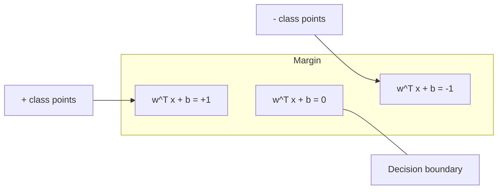
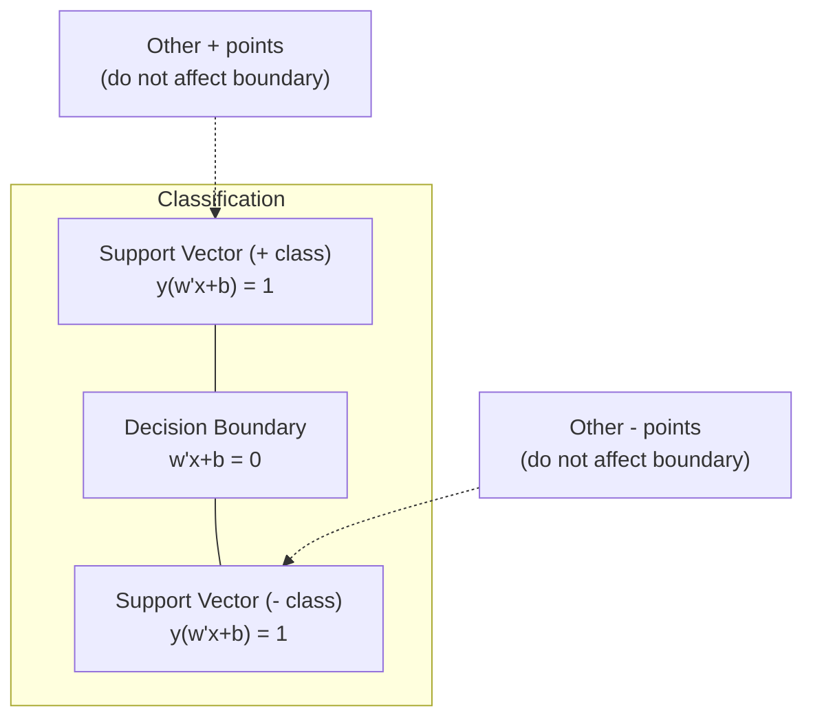
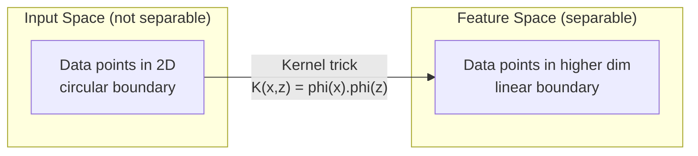

# 支持向量机

> 在两个类别之间找到最宽的街道。这就是完整思路。

**类型:** 构建
**语言:** Python
**先修:** 第 1 阶段（第 08 课优化、第 14 课范数与距离、第 18 课凸优化）
**时间:** ~90 分钟

## 学习目标

- 使用铰链损失和原始形式上的梯度下降，从零实现线性 SVM
- 解释最大间隔原则，并从训练好的模型中识别支持向量
- 比较线性核、多项式核和 RBF 核，并解释核技巧如何避免显式的高维映射
- 评估 C 参数控制的间隔宽度与分类错误之间的权衡

## 要解决的问题

你有两类数据点，需要画一条线（或超平面）把它们分开。能做到这一点的线有无数条。你该选哪一条？

选间隔最大的那条。间隔是决策边界和两侧最近数据点之间的距离。更宽的间隔意味着分类器更有信心，对未见数据的泛化也更好。

这个直觉导向了支持向量机（SVM），它是机器学习中数学上最优雅的算法之一。在深度学习兴起之前，SVM 曾是主流分类方法；在小数据集、高维数据，以及你需要一个有原则、被充分理解、带理论保证的模型时，它们至今仍是最佳选择。

SVM 与第 1 阶段直接相连：优化问题是凸的（第 18 课），间隔用范数度量（第 14 课），核技巧利用点积来处理非线性边界，却永远不需要真的在高维空间中计算。

## 核心概念

### 最大间隔分类器

给定标签 y_i 属于 {-1, +1}、特征向量 x_i 的线性可分数据，我们想找到一个超平面 w^T x + b = 0，把这些类别分开。

点 x_i 到超平面的距离是：

```text
distance = |w^T x_i + b| / ||w||
```

对于被正确分类的点：y_i * (w^T x_i + b) > 0。间隔是超平面到两侧最近点距离的两倍。



优化问题是：

```text
maximize    2 / ||w||     (the margin width)
subject to  y_i * (w^T x_i + b) >= 1  for all i
```

等价地（最小化 ||w||^2 更容易优化）：

```text
minimize    (1/2) ||w||^2
subject to  y_i * (w^T x_i + b) >= 1  for all i
```

这是一个凸二次规划问题。它有唯一的全局解。那些恰好落在间隔边界上的数据点（满足 y_i * (w^T x_i + b) = 1）就是支持向量。它们是唯一决定决策边界的点。移动或删除任何非支持向量点，边界都不会改变。

### 支持向量：关键的少数



大多数训练点都无关紧要。只有支持向量重要。这也是为什么 SVM 在预测时很节省内存：你只需要存储支持向量，而不是整个训练集。

支持向量的数量也给出了泛化误差的一个界。相对于数据集大小，支持向量越少，泛化越好。

### 软间隔：用 C 参数处理噪声

真实数据很少是完全可分的。有些点可能落在边界错误的一侧，或者落在间隔里面。软间隔形式通过引入松弛变量来允许违规。

```text
minimize    (1/2) ||w||^2 + C * sum(xi_i)
subject to  y_i * (w^T x_i + b) >= 1 - xi_i
            xi_i >= 0  for all i
```

松弛变量 xi_i 衡量第 i 个点违反间隔的程度。C 控制权衡：

| C 值 | 行为 |
|---------|----------|
| 较大的 C | 对违规施加重惩罚。间隔窄，错分更少。会过拟合 |
| 较小的 C | 允许更多违规。间隔宽，错分更多。会欠拟合 |

C 是正则化强度的倒数。较大的 C = 更少正则化。较小的 C = 更多正则化。

### 铰链损失：SVM 的损失函数

软间隔 SVM 可以改写成一个无约束优化问题：

```text
minimize    (1/2) ||w||^2 + C * sum(max(0, 1 - y_i * (w^T x_i + b)))
```

项 max(0, 1 - y_i * f(x_i)) 就是铰链损失。当点被正确分类并且位于间隔之外时，它为零。当点位于间隔内部或被错分时，它是线性的。

```text
Hinge loss for a single point:

loss
  |
  | \
  |  \
  |   \
  |    \
  |     \_______________
  |
  +-----|-----|-------->  y * f(x)
       0     1

Zero loss when y*f(x) >= 1 (correctly classified, outside margin).
Linear penalty when y*f(x) < 1.
```

与逻辑损失（逻辑回归）比较：

```text
Hinge:     max(0, 1 - y*f(x))          Hard cutoff at margin
Logistic:  log(1 + exp(-y*f(x)))        Smooth, never exactly zero
```

铰链损失会产生稀疏解（只有支持向量有非零贡献）。逻辑损失使用所有数据点。这让 SVM 在预测时更节省内存。

### 用梯度下降训练线性 SVM

你可以在铰链损失加 L2 正则化上使用梯度下降来训练线性 SVM，而不必求解带约束的二次规划：

```text
L(w, b) = (lambda/2) * ||w||^2 + (1/n) * sum(max(0, 1 - y_i * (w^T x_i + b)))

Gradient with respect to w:
  If y_i * (w^T x_i + b) >= 1:  dL/dw = lambda * w
  If y_i * (w^T x_i + b) < 1:   dL/dw = lambda * w - y_i * x_i

Gradient with respect to b:
  If y_i * (w^T x_i + b) >= 1:  dL/db = 0
  If y_i * (w^T x_i + b) < 1:   dL/db = -y_i
```

这叫原始形式。每轮的运行时间是 O(n * d)，其中 n 是样本数，d 是特征数。对于大型、稀疏、高维数据（文本分类），这很快。

### 对偶形式与核技巧

SVM 问题的拉格朗日对偶（来自第 1 阶段第 18 课，KKT 条件）是：

```text
maximize    sum(alpha_i) - (1/2) * sum_ij(alpha_i * alpha_j * y_i * y_j * (x_i . x_j))
subject to  0 <= alpha_i <= C
            sum(alpha_i * y_i) = 0
```

对偶形式只涉及数据点之间的点积 x_i . x_j。这是关键洞见。把每个点积都替换成核函数 K(x_i, x_j)，SVM 就能学习非线性边界，而且永远不需要显式计算变换。

```text
Linear kernel:      K(x, z) = x . z
Polynomial kernel:  K(x, z) = (x . z + c)^d
RBF (Gaussian):     K(x, z) = exp(-gamma * ||x - z||^2)
```

RBF 核会把数据映射到无限维空间。输入空间中彼此接近的点，核值接近 1。相距很远的点，核值接近 0。它可以学习任意平滑的决策边界。



核技巧计算的是高维空间中的点积，但不需要真的进入那个空间。对于 D 维中的 d 次多项式核，显式特征空间有 O(D^d) 维。但 K(x, z) 能在 O(D) 时间内算出。

### 用于回归的 SVM（SVR）

支持向量回归（SVR）会围绕数据拟合一条宽度为 epsilon 的管道。管道内的点损失为零。管道外的点受到线性惩罚。

```text
minimize    (1/2) ||w||^2 + C * sum(xi_i + xi_i*)
subject to  y_i - (w^T x_i + b) <= epsilon + xi_i
            (w^T x_i + b) - y_i <= epsilon + xi_i*
            xi_i, xi_i* >= 0
```

Epsilon 参数控制管道宽度。管道越宽 = 支持向量越少 = 拟合越平滑。管道越窄 = 支持向量越多 = 拟合越紧。

### 为什么 SVM 输给了深度学习（以及它们什么时候仍会赢）

从 1990 年代末到 2010 年代初，SVM 曾主导机器学习。深度学习超过它们有几个原因：

| 因素 | SVM | 深度学习 |
|--------|------|---------------|
| 特征工程 | 需要它 | 学习特征 |
| 可扩展性 | 核方法为 O(n^2) 到 O(n^3) | 使用 SGD 时每轮为 O(n) |
| 图像/文本/音频 | 需要手工特征 | 从原始数据中学习 |
| 大数据集（>100k） | 慢 | 扩展性好 |
| GPU 加速 | 受益有限 | 大幅提速 |

SVM 在这些情况下仍会赢：
- 小数据集（数百到低千级样本）
- 高维稀疏数据（带 TF-IDF 特征的文本）
- 当你需要数学保证时（间隔界）
- 当训练时间必须很短时（线性 SVM 非常快）
- 具有清晰间隔结构的二分类
- 异常检测（单类 SVM）

## 动手实现

### 步骤 1：铰链损失和梯度

这是基础。为一个批次计算铰链损失及其梯度。

```python
def hinge_loss(X, y, w, b):
    n = len(X)
    total_loss = 0.0
    for i in range(n):
        margin = y[i] * (dot(w, X[i]) + b)
        total_loss += max(0.0, 1.0 - margin)
    return total_loss / n
```

### 步骤 2：通过梯度下降实现 LinearSVM

通过最小化正则化铰链损失来训练。不需要二次规划求解器。

```python
class LinearSVM:
    def __init__(self, lr=0.001, lambda_param=0.01, n_epochs=1000):
        self.lr = lr
        self.lambda_param = lambda_param
        self.n_epochs = n_epochs
        self.w = None
        self.b = 0.0

    def fit(self, X, y):
        n_features = len(X[0])
        self.w = [0.0] * n_features
        self.b = 0.0

        for epoch in range(self.n_epochs):
            for i in range(len(X)):
                margin = y[i] * (dot(self.w, X[i]) + self.b)
                if margin >= 1:
                    self.w = [wj - self.lr * self.lambda_param * wj
                              for wj in self.w]
                else:
                    self.w = [wj - self.lr * (self.lambda_param * wj - y[i] * X[i][j])
                              for j, wj in enumerate(self.w)]
                    self.b -= self.lr * (-y[i])

    def predict(self, X):
        return [1 if dot(self.w, x) + self.b >= 0 else -1 for x in X]
```

### 步骤 3：核函数

实现线性核、多项式核和 RBF 核。

```python
def linear_kernel(x, z):
    return dot(x, z)

def polynomial_kernel(x, z, degree=3, c=1.0):
    return (dot(x, z) + c) ** degree

def rbf_kernel(x, z, gamma=0.5):
    diff = [xi - zi for xi, zi in zip(x, z)]
    return math.exp(-gamma * dot(diff, diff))
```

### 步骤 4：间隔与支持向量识别

训练之后，识别哪些点是支持向量，并计算间隔宽度。

```python
def find_support_vectors(X, y, w, b, tol=1e-3):
    support_vectors = []
    for i in range(len(X)):
        margin = y[i] * (dot(w, X[i]) + b)
        if abs(margin - 1.0) < tol:
            support_vectors.append(i)
    return support_vectors
```

完整实现以及所有演示见 `code/svm.py`。

## 实际使用

使用 scikit-learn：

```python
from sklearn.svm import SVC, LinearSVC, SVR
from sklearn.preprocessing import StandardScaler
from sklearn.pipeline import Pipeline

clf = Pipeline([
    ("scaler", StandardScaler()),
    ("svm", SVC(kernel="rbf", C=1.0, gamma="scale")),
])
clf.fit(X_train, y_train)
print(f"Accuracy: {clf.score(X_test, y_test):.4f}")
print(f"Support vectors: {clf['svm'].n_support_}")
```

重要：训练 SVM 之前一定要缩放特征。SVM 对特征量级敏感，因为间隔依赖 ||w||，未缩放的特征会扭曲几何结构。

对于大型数据集，使用 `LinearSVC`（原始形式，每轮为 O(n)）而不是 `SVC`（对偶形式，O(n^2) 到 O(n^3)）：

```python
from sklearn.svm import LinearSVC

clf = Pipeline([
    ("scaler", StandardScaler()),
    ("svm", LinearSVC(C=1.0, max_iter=10000)),
])
```

## 练习

1. 生成一个 2D 线性可分数据集。训练你的 LinearSVM 并识别支持向量。验证支持向量确实是离决策边界最近的点。

2. 在一个带噪声的数据集上，把 C 从 0.001 变化到 1000。为每个 C 值绘制决策边界。观察从宽间隔（欠拟合）到窄间隔（过拟合）的转变。

3. 创建一个类别边界是圆形（非线性）的数据集。展示线性 SVM 会失败。计算 RBF 核矩阵，并展示这些类别在核诱导特征空间中变得可分。

4. 在同一数据集上比较铰链损失和逻辑损失。训练一个线性 SVM 和逻辑回归。数一数有多少训练点会影响每个模型的决策边界（支持向量对比所有点）。

5. 实现 SVR（epsilon 不敏感损失）。把它拟合到 y = sin(x) + noise。绘制预测周围的 epsilon 管道，并高亮支持向量（管道外的点）。

## 关键术语

| 术语 | 它实际上的含义 |
|------|----------------------|
| 支持向量 | 离决策边界最近的训练点。唯一决定超平面的点 |
| 间隔 | 决策边界和最近支持向量之间的距离。SVM 最大化它 |
| 铰链损失 | max(0, 1 - y*f(x))。当正确分类且位于间隔外部时为零，否则是线性惩罚 |
| C 参数 | 间隔宽度与分类错误之间的权衡。较大的 C = 窄间隔，较小的 C = 宽间隔 |
| 软间隔 | 允许通过松弛变量违反间隔的 SVM 形式。处理不可分数据 |
| 核技巧 | 在不显式映射到高维空间的情况下，计算高维特征空间中的点积 |
| 线性核 | K(x, z) = x . z。等价于标准点积。用于线性可分数据 |
| RBF 核 | K(x, z) = exp(-gamma * \|\|x-z\|\|^2)。映射到无限维。学习任意平滑边界 |
| 多项式核 | K(x, z) = (x . z + c)^d。映射到由多项式组合构成的特征空间 |
| 对偶形式 | SVM 问题的一种重写形式，只依赖数据点之间的点积。使核方法成为可能 |
| SVR | 支持向量回归。围绕数据拟合 epsilon 管道。管道内的点损失为零 |
| 松弛变量 | xi_i：衡量一个点违反间隔的程度。对于位于间隔外且正确分类的点为零 |
| 最大间隔 | 选择使到各类别最近点距离最大的超平面的原则 |

## 延伸阅读

- [Vapnik: The Nature of Statistical Learning Theory (1995)](https://link.springer.com/book/10.1007/978-1-4757-3264-1) - SVM 与统计学习的奠基文本
- [Cortes & Vapnik: Support-vector networks (1995)](https://link.springer.com/article/10.1007/BF00994018) - 原始 SVM 论文
- [Platt: Sequential Minimal Optimization (1998)](https://www.microsoft.com/en-us/research/publication/sequential-minimal-optimization-a-fast-algorithm-for-training-support-vector-machines/) - 让 SVM 训练变得实用的 SMO 算法
- [scikit-learn SVM documentation](https://scikit-learn.org/stable/modules/svm.html) - 带实现细节的实践指南
- [LIBSVM: A Library for Support Vector Machines](https://www.csie.ntu.edu.tw/~cjlin/libsvm/) - 大多数 SVM 实现背后的 C++ 库
