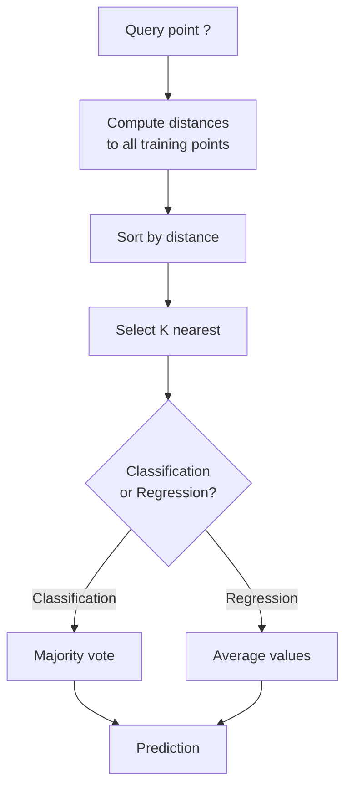
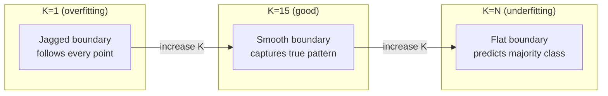
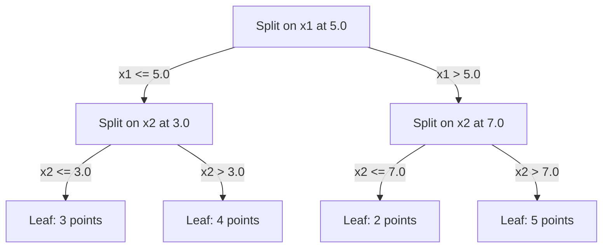

# K 近邻与距离

> 存下所有数据。看邻居来预测。最简单却真的能工作的算法。

**类型：** 构建
**语言：** Python
**先修：** Phase 1（Lesson 14 Norms and Distances）
**时间：** ~90 分钟

## 学习目标

- 从零实现 KNN 分类和回归，支持可配置的 K 与距离加权投票
- 比较 L1、L2、cosine 和 Minkowski 距离度量，并为给定数据类型选择合适度量
- 解释维度灾难，并演示为什么 KNN 在高维空间中会退化
- 构建用于高效最近邻搜索的 KD-tree，并分析它什么时候能胜过暴力搜索

## 要解决的问题

你有一个数据集。一个新的数据点来了。你需要给它分类，或者预测它的数值。不同于 linear regression 或 SVM 那样从数据中学习参数，你只要找出离新点最近的 K 个训练点，让它们投票。

这就是 K-nearest neighbors。它没有训练阶段。没有要学习的参数。没有要最小化的损失函数。你保存整个训练集，并在预测时计算距离。

它听起来简单到不像能用。但 KNN 在许多问题上出乎意料地有竞争力，尤其是中小型数据集。深入理解它，会暴露几个基础概念：距离度量的选择（连接到 Phase 1 Lesson 14）、维度灾难，以及 lazy learning 与 eager learning 的差异。

KNN 也以不同名字出现在现代 AI 的各个角落。Vector databases 会在 embeddings 上做 KNN search。Retrieval-augmented generation (RAG) 会寻找最近的 K 个文档片段。推荐系统会寻找相似用户或物品。算法是同一个，变化的是规模和数据结构。

## 核心概念

### KNN 如何工作

给定一个带标签点的数据集和一个新的查询点：

1. 计算查询点到数据集中每个点的距离
2. 按距离排序
3. 取最近的 K 个点
4. 对分类任务：在 K 个邻居中做多数投票
5. 对回归任务：对 K 个邻居的数值取平均（或加权平均）



这就是完整算法。没有 fitting。没有 gradient descent。没有 epochs。

### 选择 K

K 是唯一的 hyperparameter。它控制 bias-variance trade-off：

| K | 行为 |
|---|----------|
| K = 1 | Decision boundary 会跟随每一个点。训练误差为零。高方差。过拟合 |
| 小 K (3-5) | 对局部结构敏感。可以捕捉复杂边界 |
| 大 K | 边界更平滑。对噪声更稳健。可能欠拟合 |
| K = N | 对每个点都预测多数类。偏差最大 |

一个常见起点是：对含 N 个点的数据集使用 K = sqrt(N)。二分类时使用奇数 K，可以避免平票。



### 距离度量

距离函数定义了什么叫“近”。不同度量会产生不同邻居，也会产生不同预测。

**L2 (Euclidean)** 是默认选择。它是直线距离。

```text
d(a, b) = sqrt(sum((a_i - b_i)^2))
```

它对特征尺度敏感。把 L2 与 KNN 一起使用前，永远先标准化特征。

**L1 (Manhattan)** 会把绝对差相加。它比 L2 更稳健，因为它不会平方差值，从而不会放大异常值。

```text
d(a, b) = sum(|a_i - b_i|)
```

**Cosine distance** 度量向量之间的角度，忽略大小。它对文本和 embedding 数据至关重要。

```text
d(a, b) = 1 - (a . b) / (||a|| * ||b||)
```

**Minkowski** 用参数 p 泛化 L1 和 L2。

```text
d(a, b) = (sum(|a_i - b_i|^p))^(1/p)

p=1: Manhattan
p=2: Euclidean
p->inf: Chebyshev (max absolute difference)
```

该用哪种度量取决于数据：

| 数据类型 | 最佳度量 | 原因 |
|-----------|------------|-----|
| 数值特征、尺度相近 | L2 (Euclidean) | 默认选择，适用于空间数据 |
| 数值特征、存在异常值 | L1 (Manhattan) | 稳健，不会放大巨大差异 |
| Text embeddings | Cosine | 大小是噪声，方向才是含义 |
| 高维稀疏数据 | Cosine 或 L1 | L2 会受到维度灾难影响 |
| 混合类型 | 自定义距离 | 按特征类型组合不同度量 |

### 加权 KNN

标准 KNN 会给所有 K 个邻居相同权重。但距离为 0.1 的邻居，理应比距离为 5.0 的邻居更重要。

**Distance-weighted KNN** 会按距离的倒数给每个邻居加权：

```text
weight_i = 1 / (distance_i + epsilon)

For classification: weighted vote
For regression:     weighted average = sum(w_i * y_i) / sum(w_i)
```

epsilon 会在查询点与某个训练点完全重合时防止除以零。

Weighted KNN 对 K 的选择不那么敏感，因为远处邻居无论如何贡献都很小。

### 维度灾难

KNN 的表现会在高维中退化。这不是模糊的担忧，而是数学事实。

**问题 1：距离会收敛。** 随着维度增加，最大距离与最小距离之比会接近 1。所有点都变得与查询点同样“远”。

```text
In d dimensions, for random uniform points:

d=2:    max_dist / min_dist = varies widely
d=100:  max_dist / min_dist ~ 1.01
d=1000: max_dist / min_dist ~ 1.001

When all distances are nearly equal, "nearest" is meaningless.
```

**问题 2：体积会爆炸。** 为了在固定数据比例内捕获 K 个邻居，你需要把搜索半径扩展到覆盖特征空间中大得多的一部分。高维中的“邻域”会包含空间的大部分。

**问题 3：角落占主导。** 在 d 维单位超立方体中，大部分体积集中在角落附近，而不是中心。随着 d 增长，内接球包含的体积分数会趋近于零。

实践后果：KNN 在大约 20-50 个特征以内通常表现不错。超过这个范围，你需要先做 dimensionality reduction（PCA、UMAP、t-SNE）再应用 KNN，或者使用能利用数据内在低维结构的树搜索结构。

### KD-trees：快速最近邻搜索

暴力 KNN 会计算查询点到每个训练点的距离。每次查询是 O(n * d)。数据集很大时，这太慢了。

KD-tree 会沿特征轴递归划分空间。每一层都沿某个维度的中位数切分。



要寻找最近邻，先沿树遍历到包含查询点的叶子，然后回溯；只有当相邻分区可能包含更近点时，才检查它们。

平均查询时间：低维时是 O(log n)。但 KD-trees 会在高维（d > 20）退化到 O(n)，因为回溯时能排除的分支越来越少。

### Ball trees：更适合中等维度

Ball trees 用嵌套超球而不是坐标轴对齐的盒子来划分数据。每个节点定义一个 ball（center + radius），包含该子树中的所有点。

相对于 KD-trees 的优势：
- 在中等维度中表现更好（最高约 ~50）
- 能处理非轴对齐结构
- 更紧的边界体积意味着搜索时能剪掉更多分支

KD-trees 和 ball trees 都是精确算法。对真正的大规模搜索（数百万点、数百维），通常使用 approximate nearest neighbor 方法（HNSW、IVF、product quantization）。这些在 Phase 1 Lesson 14 中覆盖。

### Lazy learning vs eager learning

KNN 是 lazy learner：训练时不做工作，预测时才做所有工作。大多数其他算法（linear regression、SVMs、neural networks）是 eager learners：它们在训练时做大量计算，构建紧凑模型，然后快速预测。

| 方面 | Lazy (KNN) | Eager (SVM, neural net) |
|--------|------------|------------------------|
| 训练时间 | O(1)，只存数据 | O(n * epochs) |
| 预测时间 | 每次查询 O(n * d) | O(d) 或 O(parameters) |
| 预测时内存 | 存整个训练集 | 只存模型参数 |
| 适应新数据 | 立即添加点 | 重新训练模型 |
| Decision boundary | 隐式，临时计算 | 显式，训练后固定 |

Lazy learning 适合这些情况：
- 数据集频繁变化（无需重新训练即可增删点）
- 只需要为很少的查询做预测
- 需要零训练时间
- 数据集足够小，暴力搜索也很快

### KNN 用于回归

KNN 回归不是做多数投票，而是对 K 个邻居的目标值取平均。

```text
prediction = (1/K) * sum(y_i for i in K nearest neighbors)

Or with distance weighting:
prediction = sum(w_i * y_i) / sum(w_i)
where w_i = 1 / distance_i
```

KNN regression 会产生分段常数预测（如果加权，则是分段平滑预测）。它无法外推到训练数据范围之外。如果训练目标都在 0 到 100 之间，KNN 永远不会预测 200。

## 动手实现

### Step 1：距离函数

实现 L1、L2、cosine 和 Minkowski 距离。它们直接连接到 Phase 1 Lesson 14。

```python
import math

def l2_distance(a, b):
    return math.sqrt(sum((ai - bi) ** 2 for ai, bi in zip(a, b)))

def l1_distance(a, b):
    return sum(abs(ai - bi) for ai, bi in zip(a, b))

def cosine_distance(a, b):
    dot_val = sum(ai * bi for ai, bi in zip(a, b))
    norm_a = math.sqrt(sum(ai ** 2 for ai in a))
    norm_b = math.sqrt(sum(bi ** 2 for bi in b))
    if norm_a == 0 or norm_b == 0:
        return 1.0
    return 1.0 - dot_val / (norm_a * norm_b)

def minkowski_distance(a, b, p=2):
    if p == float('inf'):
        return max(abs(ai - bi) for ai, bi in zip(a, b))
    return sum(abs(ai - bi) ** p for ai, bi in zip(a, b)) ** (1 / p)
```

### Step 2：KNN classifier and regressor

构建完整 KNN，支持可配置的 K、距离度量和可选距离加权。

```python
class KNN:
    def __init__(self, k=5, distance_fn=l2_distance, weighted=False,
                 task="classification"):
        self.k = k
        self.distance_fn = distance_fn
        self.weighted = weighted
        self.task = task
        self.X_train = None
        self.y_train = None

    def fit(self, X, y):
        self.X_train = X
        self.y_train = y

    def predict(self, X):
        return [self._predict_one(x) for x in X]
```

### Step 3：用于高效搜索的 KD-tree

从零构建一个 KD-tree，沿每个维度的中位数递归切分。

```python
class KDTree:
    def __init__(self, X, indices=None, depth=0):
        # Recursively partition the data
        self.axis = depth % len(X[0])
        # Split on median of the current axis
        ...

    def query(self, point, k=1):
        # Traverse to leaf, then backtrack
        ...
```

完整实现（包含所有辅助方法和 demo）见 `code/knn.py`。

### Step 4：特征缩放

KNN 需要特征缩放，因为距离对特征大小敏感。取值范围 0 到 1000 的特征会主导取值范围 0 到 1 的特征。

```python
def standardize(X):
    n = len(X)
    d = len(X[0])
    means = [sum(X[i][j] for i in range(n)) / n for j in range(d)]
    stds = [
        max(1e-10, (sum((X[i][j] - means[j]) ** 2 for i in range(n)) / n) ** 0.5)
        for j in range(d)
    ]
    return [[((X[i][j] - means[j]) / stds[j]) for j in range(d)] for i in range(n)], means, stds
```

## 实际使用

使用 scikit-learn：

```python
from sklearn.neighbors import KNeighborsClassifier
from sklearn.preprocessing import StandardScaler
from sklearn.pipeline import Pipeline

clf = Pipeline([
    ("scaler", StandardScaler()),
    ("knn", KNeighborsClassifier(n_neighbors=5, metric="euclidean")),
])
clf.fit(X_train, y_train)
print(f"Accuracy: {clf.score(X_test, y_test):.4f}")
```

当数据集足够大且维度足够低时，Scikit-learn 会自动使用 KD-trees 或 ball trees。对高维数据，它会退回到暴力搜索。你可以用 `algorithm` 参数控制这一点。

对大规模最近邻搜索（数百万向量），使用 FAISS、Annoy 或 vector database：

```python
import faiss

index = faiss.IndexFlatL2(dimension)
index.add(embeddings)
distances, indices = index.search(query_vectors, k=5)
```

## 练习

1. 在一个包含 3 个类别的 2D 数据集上实现 KNN classification。绘制 K=1、K=5、K=15 和 K=N 的 decision boundary。观察从过拟合到欠拟合的过渡。

2. 分别在 2、5、10、50、100 和 500 维中生成 1000 个随机点。对每个维度，计算最大成对距离与最小成对距离之比。绘制 ratio vs dimensionality，直观看到维度灾难。

3. 在文本分类问题上（使用 TF-IDF vectors）比较 L1、L2 和 cosine distance。哪种度量给出最高 accuracy？为什么 cosine 往往在文本上胜出？

4. 实现 KD-tree，并在 2D、10D 和 50D 中，对 1k、10k、100k 点的数据集测量 query time vs brute force。到什么维度时 KD-tree 不再比 brute force 更快？

5. 为 y = sin(x) + noise 构建 weighted KNN regressor。把它与 K=3、10、30 时的 unweighted KNN 比较。展示加权会产生更平滑的预测，尤其是在 K 较大时。

## 关键术语

| 术语 | 实际含义 |
|------|----------------------|
| K-nearest neighbors | 非参数算法，通过寻找离查询点最近的 K 个训练点来预测 |
| Lazy learning | 训练时不做计算。所有工作都发生在预测时。KNN 是典型例子 |
| Eager learning | 训练时做大量计算来构建紧凑模型。大多数 ML 算法都是 eager |
| Curse of dimensionality | 在高维中，距离会收敛，邻域会扩展到覆盖空间大部分，使 KNN 失效 |
| KD-tree | 沿特征轴递归划分空间的二叉树。低维中查询为 O(log n) |
| Ball tree | 嵌套超球组成的树。中等维度（最高约 ~50）比 KD-trees 更有效 |
| Weighted KNN | 按距离倒数给邻居加权。越近的邻居对预测影响越大 |
| Feature scaling | 把特征规范化到可比较范围。KNN 这类基于距离的方法必须这样做 |
| Majority vote | 通过统计 K 个邻居中最常见类别来分类 |
| Brute force search | 计算到每个训练点的距离。每次查询 O(n*d)。精确，但大 n 时很慢 |
| Approximate nearest neighbor | 更快找到近似最近点的算法（HNSW、LSH、IVF） |
| Voronoi diagram | 空间划分，其中每个区域包含所有比其他训练点更靠近某一训练点的点。K=1 KNN 会产生 Voronoi 边界 |

## 延伸阅读

- [Cover & Hart: Nearest Neighbor Pattern Classification (1967)](https://ieeexplore.ieee.org/document/1053964) - KNN 的奠基论文，证明其错误率至多为 Bayes optimal 的两倍
- [Friedman, Bentley, Finkel: An Algorithm for Finding Best Matches in Logarithmic Expected Time (1977)](https://dl.acm.org/doi/10.1145/355744.355745) - 原始 KD-tree 论文
- [Beyer et al.: When Is "Nearest Neighbor" Meaningful? (1999)](https://link.springer.com/chapter/10.1007/3-540-49257-7_15) - 最近邻维度灾难的形式化分析
- [scikit-learn Nearest Neighbors documentation](https://scikit-learn.org/stable/modules/neighbors.html) - 包含算法选择的实用指南
- [FAISS: A Library for Efficient Similarity Search](https://github.com/facebookresearch/faiss) - Meta 的十亿级 approximate nearest neighbor search 库
