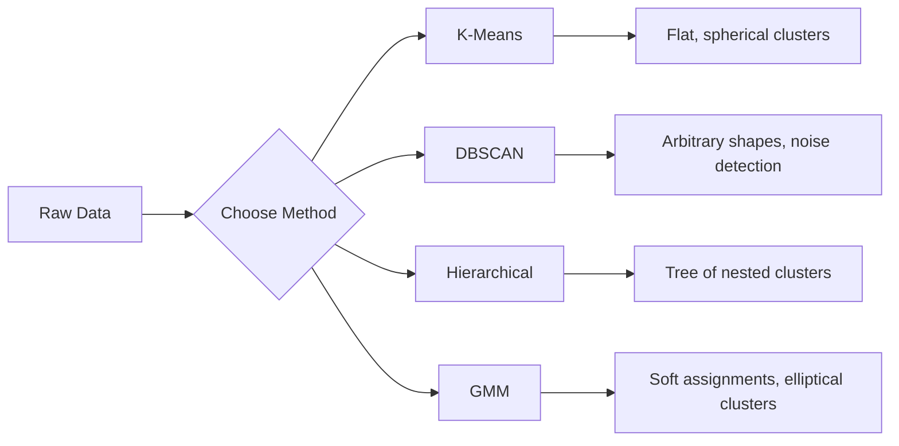

# 无监督学习

> 没有标签，没有老师。算法自己发现结构。

**类型：** 构建
**语言：** Python
**先修：** Phase 1（Norms & Distances、Probability & Distributions）、Phase 2 Lessons 1-6
**时间：** ~90 分钟

## 学习目标

- 从零实现 K-Means、DBSCAN 和 Gaussian Mixture Models，并比较它们的聚类行为
- 使用 silhouette score 和 elbow method 评估聚类质量，选择最佳 K
- 解释 DBSCAN 什么时候优于 K-Means，并识别哪个算法能处理非球形簇和异常值
- 使用聚类方法构建 anomaly detection pipeline，标记偏离正常模式的点

## 要解决的问题

到目前为止，每一节 ML 课都假设有带标签数据：“这是输入，这是正确输出。”但在真实世界里，标签很昂贵。医院有数百万条病历，却没人手动给每条记录标注疾病类别。电商网站有数百万个用户会话，却没人手工标注客户分群。安全团队有网络日志，却没人标记每一个异常。

无监督学习会在没有被告知要寻找什么的情况下发现模式。它会把相似数据点分组，发现隐藏结构，并浮现异常。如果监督学习像是在带答案的教材里学习，那么无监督学习就是盯着原始数据，直到模式自己显现。

关键难点是：没有标签，你就不能直接衡量“对”或“错”。你需要不同工具来评估算法找到的结构是否有意义。

## 核心概念

### 聚类：把相似事物分到一起

Clustering 会把每个数据点分配到一个组（cluster），使同一组内部的点比不同组之间的点更相似。问题永远是：什么叫“相似”？



### K-Means：主力方法

K-Means 会把数据划分成恰好 K 个簇。每个簇都有一个 centroid（质心，质量中心），每个点都属于最近的 centroid。

Lloyd's algorithm：

1. 随机选 K 个点作为初始 centroids
2. 把每个数据点分配给最近的 centroid
3. 把每个 centroid 重新计算为其所分配点的均值
4. 重复步骤 2-3，直到分配不再变化

目标函数（inertia）度量每个点到其所分配 centroid 的总平方距离。K-Means 会最小化它，但只能找到局部最小值。不同初始化可能给出不同结果。

### 选择 K

两种标准方法：

**Elbow method：** 对 K = 1, 2, 3, ..., n 运行 K-Means。绘制 inertia vs K。寻找“肘部”：继续增加簇数已经不能显著降低 inertia 的位置。

**Silhouette score：** 对每个点，衡量它与自己簇的相似度 (a)，并与最近的其他簇 (b) 比较。silhouette coefficient 是 (b - a) / max(a, b)，范围从 -1（错误簇）到 +1（聚类良好）。对所有点取平均即可得到全局得分。

### DBSCAN：基于密度的聚类

K-Means 假设簇是球形的，并要求你预先选择 K。DBSCAN 两者都不要求。它把簇识别为由稀疏区域分隔的稠密区域。

两个参数：
- **eps**：邻域半径
- **min_samples**：形成稠密区域所需的最少点数

三类点：
- **Core point**：在 eps 距离内至少有 min_samples 个点
- **Border point**：位于某个 core point 的 eps 范围内，但自身不是 core point
- **Noise point**：既不是 core 也不是 border。这些就是异常值。

DBSCAN 会把彼此 eps 距离内的 core points 连接成同一个簇。Border points 会加入附近 core point 的簇。Noise points 不属于任何簇。

优势：能发现任意形状的簇，自动确定簇数量，识别异常值。弱点：难以处理密度变化很大的簇。

### Hierarchical Clustering

构建一个嵌套簇的树（dendrogram）。

Agglomerative（自底向上）：
1. 从每个点各自作为一个簇开始
2. 合并最近的两个簇
3. 重复直到只剩一个簇
4. 在期望层级切开 dendrogram，得到 K 个簇

簇之间的“接近”可以这样度量：
- **Single linkage**：两个簇中任意两点之间的最小距离
- **Complete linkage**：任意两点之间的最大距离
- **Average linkage**：所有成对距离的平均值
- **Ward's method**：导致簇内总方差增加最少的合并

### Gaussian Mixture Models (GMM)

K-Means 给出硬分配：每个点只属于一个簇。GMM 给出软分配：每个点都有属于每个簇的概率。

GMM 假设数据由 K 个 Gaussian distributions 的混合生成，每个分布有自己的 mean 和 covariance。Expectation-Maximization (EM) algorithm 会交替执行：

- **E-step**：计算每个点属于每个 Gaussian 的概率
- **M-step**：更新每个 Gaussian 的 mean、covariance 和 mixing weight，以最大化数据的 likelihood

GMM 可以建模椭圆形簇（不只是 K-Means 那样的球形簇），也能自然处理重叠簇。

### 什么时候使用哪种方法

| 方法 | 最适合 | 避免使用于 |
|--------|----------|------------|
| K-Means | 大数据集、球形簇、已知 K | 不规则形状、存在异常值 |
| DBSCAN | K 未知、任意形状、outlier detection | 密度变化大、维度很高 |
| Hierarchical | 小数据集、需要 dendrogram、K 未知 | 大数据集（O(n^2) 内存） |
| GMM | 重叠簇、需要软分配 | 非常大的数据集、维度过多 |

### 使用聚类做异常检测

聚类天然支持 anomaly detection：
- **K-Means**：离所有 centroid 都很远的点是 anomalies
- **DBSCAN**：noise points 按定义就是 anomalies
- **GMM**：在所有 Gaussians 下概率都很低的点是 anomalies

## 动手实现

### Step 1：从零实现 K-Means

```python
import math
import random


def euclidean_distance(a, b):
    return math.sqrt(sum((ai - bi) ** 2 for ai, bi in zip(a, b)))


def kmeans(data, k, max_iterations=100, seed=42):
    random.seed(seed)
    n_features = len(data[0])

    centroids = random.sample(data, k)

    for iteration in range(max_iterations):
        clusters = [[] for _ in range(k)]
        assignments = []

        for point in data:
            distances = [euclidean_distance(point, c) for c in centroids]
            nearest = distances.index(min(distances))
            clusters[nearest].append(point)
            assignments.append(nearest)

        new_centroids = []
        for cluster in clusters:
            if len(cluster) == 0:
                new_centroids.append(random.choice(data))
                continue
            centroid = [
                sum(point[j] for point in cluster) / len(cluster)
                for j in range(n_features)
            ]
            new_centroids.append(centroid)

        if all(
            euclidean_distance(old, new) < 1e-6
            for old, new in zip(centroids, new_centroids)
        ):
            print(f"  Converged at iteration {iteration + 1}")
            break

        centroids = new_centroids

    return assignments, centroids
```

### Step 2：Elbow method and silhouette score

```python
def compute_inertia(data, assignments, centroids):
    total = 0.0
    for point, cluster_id in zip(data, assignments):
        total += euclidean_distance(point, centroids[cluster_id]) ** 2
    return total


def silhouette_score(data, assignments):
    n = len(data)
    if n < 2:
        return 0.0

    clusters = {}
    for i, c in enumerate(assignments):
        clusters.setdefault(c, []).append(i)

    if len(clusters) < 2:
        return 0.0

    scores = []
    for i in range(n):
        own_cluster = assignments[i]
        own_members = [j for j in clusters[own_cluster] if j != i]

        if len(own_members) == 0:
            scores.append(0.0)
            continue

        a = sum(euclidean_distance(data[i], data[j]) for j in own_members) / len(own_members)

        b = float("inf")
        for cluster_id, members in clusters.items():
            if cluster_id == own_cluster:
                continue
            avg_dist = sum(euclidean_distance(data[i], data[j]) for j in members) / len(members)
            b = min(b, avg_dist)

        if max(a, b) == 0:
            scores.append(0.0)
        else:
            scores.append((b - a) / max(a, b))

    return sum(scores) / len(scores)


def find_best_k(data, max_k=10):
    print("Elbow method:")
    inertias = []
    for k in range(1, max_k + 1):
        assignments, centroids = kmeans(data, k)
        inertia = compute_inertia(data, assignments, centroids)
        inertias.append(inertia)
        print(f"  K={k}: inertia={inertia:.2f}")

    print("\nSilhouette scores:")
    for k in range(2, max_k + 1):
        assignments, centroids = kmeans(data, k)
        score = silhouette_score(data, assignments)
        print(f"  K={k}: silhouette={score:.4f}")

    return inertias
```

### Step 3：从零实现 DBSCAN

```python
def dbscan(data, eps, min_samples):
    n = len(data)
    labels = [-1] * n
    cluster_id = 0

    def region_query(point_idx):
        neighbors = []
        for i in range(n):
            if euclidean_distance(data[point_idx], data[i]) <= eps:
                neighbors.append(i)
        return neighbors

    visited = [False] * n

    for i in range(n):
        if visited[i]:
            continue
        visited[i] = True

        neighbors = region_query(i)

        if len(neighbors) < min_samples:
            labels[i] = -1
            continue

        labels[i] = cluster_id
        seed_set = list(neighbors)
        seed_set.remove(i)

        j = 0
        while j < len(seed_set):
            q = seed_set[j]

            if not visited[q]:
                visited[q] = True
                q_neighbors = region_query(q)
                if len(q_neighbors) >= min_samples:
                    for nb in q_neighbors:
                        if nb not in seed_set:
                            seed_set.append(nb)

            if labels[q] == -1:
                labels[q] = cluster_id

            j += 1

        cluster_id += 1

    return labels
```

### Step 4：Gaussian Mixture Model (EM algorithm)

```python
def gmm(data, k, max_iterations=100, seed=42):
    random.seed(seed)
    n = len(data)
    d = len(data[0])

    indices = random.sample(range(n), k)
    means = [list(data[i]) for i in indices]
    variances = [1.0] * k
    weights = [1.0 / k] * k

    def gaussian_pdf(x, mean, variance):
        d = len(x)
        coeff = 1.0 / ((2 * math.pi * variance) ** (d / 2))
        exponent = -sum((xi - mi) ** 2 for xi, mi in zip(x, mean)) / (2 * variance)
        return coeff * math.exp(max(exponent, -500))

    for iteration in range(max_iterations):
        responsibilities = []
        for i in range(n):
            probs = []
            for j in range(k):
                probs.append(weights[j] * gaussian_pdf(data[i], means[j], variances[j]))
            total = sum(probs)
            if total == 0:
                total = 1e-300
            responsibilities.append([p / total for p in probs])

        old_means = [list(m) for m in means]

        for j in range(k):
            r_sum = sum(responsibilities[i][j] for i in range(n))
            if r_sum < 1e-10:
                continue

            weights[j] = r_sum / n

            for dim in range(d):
                means[j][dim] = sum(
                    responsibilities[i][j] * data[i][dim] for i in range(n)
                ) / r_sum

            variances[j] = sum(
                responsibilities[i][j]
                * sum((data[i][dim] - means[j][dim]) ** 2 for dim in range(d))
                for i in range(n)
            ) / (r_sum * d)
            variances[j] = max(variances[j], 1e-6)

        shift = sum(
            euclidean_distance(old_means[j], means[j]) for j in range(k)
        )
        if shift < 1e-6:
            print(f"  GMM converged at iteration {iteration + 1}")
            break

    assignments = []
    for i in range(n):
        assignments.append(responsibilities[i].index(max(responsibilities[i])))

    return assignments, means, weights, responsibilities
```

### Step 5：生成测试数据并运行所有内容

```python
def make_blobs(centers, n_per_cluster=50, spread=0.5, seed=42):
    random.seed(seed)
    data = []
    true_labels = []
    for label, (cx, cy) in enumerate(centers):
        for _ in range(n_per_cluster):
            x = cx + random.gauss(0, spread)
            y = cy + random.gauss(0, spread)
            data.append([x, y])
            true_labels.append(label)
    return data, true_labels


def make_moons(n_samples=200, noise=0.1, seed=42):
    random.seed(seed)
    data = []
    labels = []
    n_half = n_samples // 2
    for i in range(n_half):
        angle = math.pi * i / n_half
        x = math.cos(angle) + random.gauss(0, noise)
        y = math.sin(angle) + random.gauss(0, noise)
        data.append([x, y])
        labels.append(0)
    for i in range(n_half):
        angle = math.pi * i / n_half
        x = 1 - math.cos(angle) + random.gauss(0, noise)
        y = 1 - math.sin(angle) - 0.5 + random.gauss(0, noise)
        data.append([x, y])
        labels.append(1)
    return data, labels


if __name__ == "__main__":
    centers = [[2, 2], [8, 3], [5, 8]]
    data, true_labels = make_blobs(centers, n_per_cluster=50, spread=0.8)

    print("=== K-Means on 3 blobs ===")
    assignments, centroids = kmeans(data, k=3)
    print(f"  Centroids: {[[round(c, 2) for c in cent] for cent in centroids]}")
    sil = silhouette_score(data, assignments)
    print(f"  Silhouette score: {sil:.4f}")

    print("\n=== Elbow Method ===")
    find_best_k(data, max_k=6)

    print("\n=== DBSCAN on 3 blobs ===")
    db_labels = dbscan(data, eps=1.5, min_samples=5)
    n_clusters = len(set(db_labels) - {-1})
    n_noise = db_labels.count(-1)
    print(f"  Found {n_clusters} clusters, {n_noise} noise points")

    print("\n=== GMM on 3 blobs ===")
    gmm_assignments, gmm_means, gmm_weights, _ = gmm(data, k=3)
    print(f"  Means: {[[round(m, 2) for m in mean] for mean in gmm_means]}")
    print(f"  Weights: {[round(w, 3) for w in gmm_weights]}")
    gmm_sil = silhouette_score(data, gmm_assignments)
    print(f"  Silhouette score: {gmm_sil:.4f}")

    print("\n=== DBSCAN on moons (non-spherical clusters) ===")
    moon_data, moon_labels = make_moons(n_samples=200, noise=0.1)
    moon_db = dbscan(moon_data, eps=0.3, min_samples=5)
    n_moon_clusters = len(set(moon_db) - {-1})
    n_moon_noise = moon_db.count(-1)
    print(f"  Found {n_moon_clusters} clusters, {n_moon_noise} noise points")

    print("\n=== K-Means on moons (will fail to separate) ===")
    moon_km, moon_centroids = kmeans(moon_data, k=2)
    moon_sil = silhouette_score(moon_data, moon_km)
    print(f"  Silhouette score: {moon_sil:.4f}")
    print("  K-Means splits moons poorly because they are not spherical")

    print("\n=== Anomaly detection with DBSCAN ===")
    anomaly_data = list(data)
    anomaly_data.append([20.0, 20.0])
    anomaly_data.append([-5.0, -5.0])
    anomaly_data.append([15.0, 0.0])
    anomaly_labels = dbscan(anomaly_data, eps=1.5, min_samples=5)
    anomalies = [
        anomaly_data[i]
        for i in range(len(anomaly_labels))
        if anomaly_labels[i] == -1
    ]
    print(f"  Detected {len(anomalies)} anomalies")
    for a in anomalies[-3:]:
        print(f"    Point {[round(v, 2) for v in a]}")
```

## 实际使用

使用 scikit-learn 时，这些算法都是一行：

```python
from sklearn.cluster import KMeans, DBSCAN, AgglomerativeClustering
from sklearn.mixture import GaussianMixture
from sklearn.metrics import silhouette_score as sklearn_silhouette

km = KMeans(n_clusters=3, random_state=42).fit(data)
db = DBSCAN(eps=1.5, min_samples=5).fit(data)
agg = AgglomerativeClustering(n_clusters=3).fit(data)
gmm_model = GaussianMixture(n_components=3, random_state=42).fit(data)
```

从零实现的版本会让你看清这些库到底在计算什么。K-Means 在分配和重新计算之间迭代。DBSCAN 从稠密种子开始扩展簇。GMM 在 expectation 和 maximization 之间交替。库版本会加入数值稳定性、更聪明的初始化（K-Means++）和 GPU acceleration，但核心逻辑相同。

## 交付成果

本课产出从零实现的 K-Means、DBSCAN 和 GMM。聚类代码可以复用为更高级无监督方法的基础。

## 练习

1. 实现 K-Means++ 初始化：不要随机选择所有 centroids，而是先随机选第一个，再按与最近已有 centroid 的平方距离成比例的概率选择后续 centroid。把收敛速度与随机初始化比较。
2. 把 hierarchical agglomerative clustering 加到代码中。实现 Ward's linkage，并生成 dendrogram（作为嵌套的 merge 列表）。在不同层级切开它，并与 K-Means 结果比较。
3. 构建一个简单 anomaly detection pipeline：在同一数据上运行 DBSCAN 和 GMM，标记两种方法都认为是 outlier 的点（DBSCAN 中的 noise，GMM 中的低概率点）。衡量重叠程度，并讨论方法在什么时候会不一致。

## 关键术语

| 术语 | 人们常说 | 实际含义 |
|------|----------------|----------------------|
| Clustering | “把相似事物分组” | 按某个具体距离度量，把数据划分为若干子集，使组内相似度高于组间相似度 |
| Centroid | “簇的中心” | 分配给某个簇的所有点的均值；K-Means 用它作为簇代表 |
| Inertia | “簇有多紧” | 每个点到其分配 centroid 的平方距离之和；越低越紧 |
| Silhouette score | “簇分得有多开” | 对每个点，(b - a) / max(a, b)，其中 a 是平均簇内距离，b 是平均最近簇距离 |
| Core point | “稠密区域中的点” | DBSCAN 中，在 eps 距离内至少有 min_samples 个邻居的点 |
| EM algorithm | “Soft K-Means” | Expectation-Maximization：迭代计算成员概率（E-step）并更新分布参数（M-step） |
| Dendrogram | “簇的树” | 展示 hierarchical clustering 中簇以什么顺序、在什么距离上被合并的树形图 |
| Anomaly | “异常点” | 不符合期望模式的数据点，可由 DBSCAN 识别为 noise，或由 GMM 识别为低概率点 |

## 延伸阅读

- [Stanford CS229 - Unsupervised Learning](https://cs229.stanford.edu/notes2022fall/main_notes.pdf) - Andrew Ng 关于 clustering 和 EM 的讲义
- [scikit-learn Clustering Guide](https://scikit-learn.org/stable/modules/clustering.html) - 所有 clustering algorithms 的实用比较，并包含可视化示例
- [DBSCAN original paper (Ester et al., 1996)](https://www.aaai.org/Papers/KDD/1996/KDD96-037.pdf) - 提出 density-based clustering 的论文
