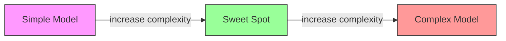
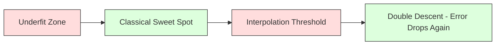
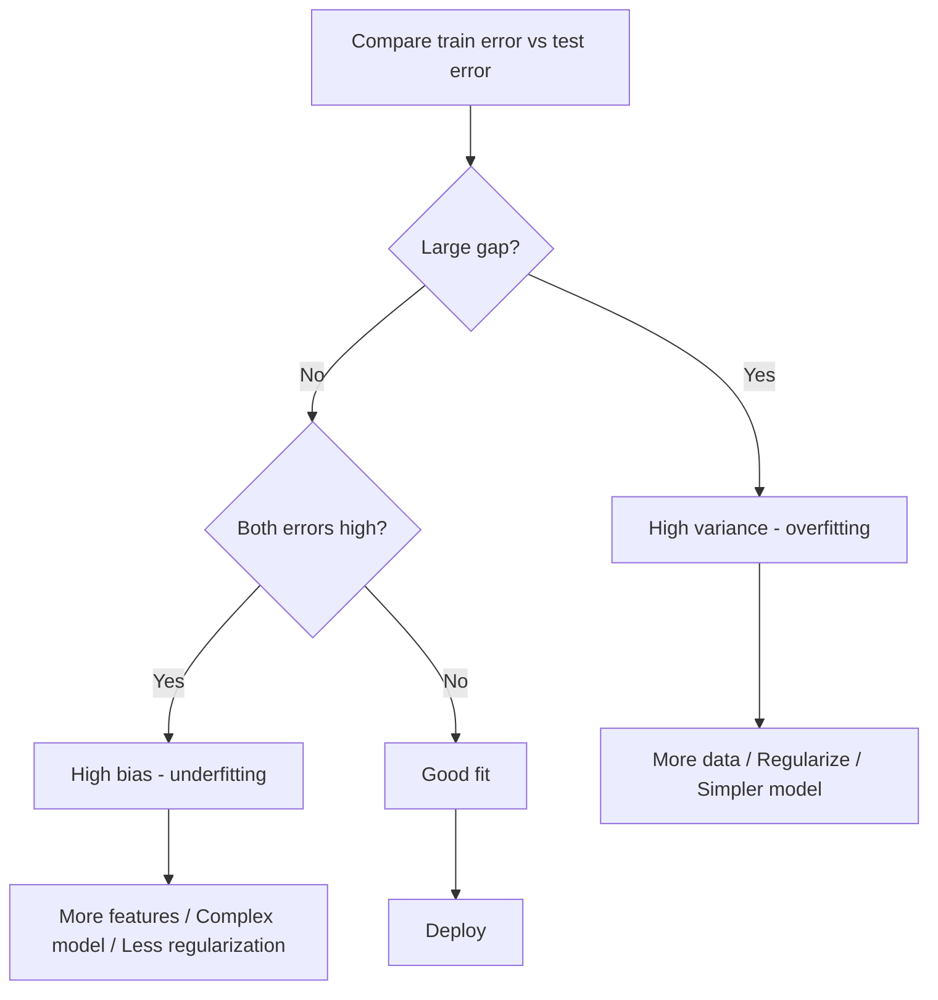
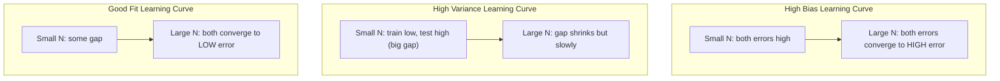
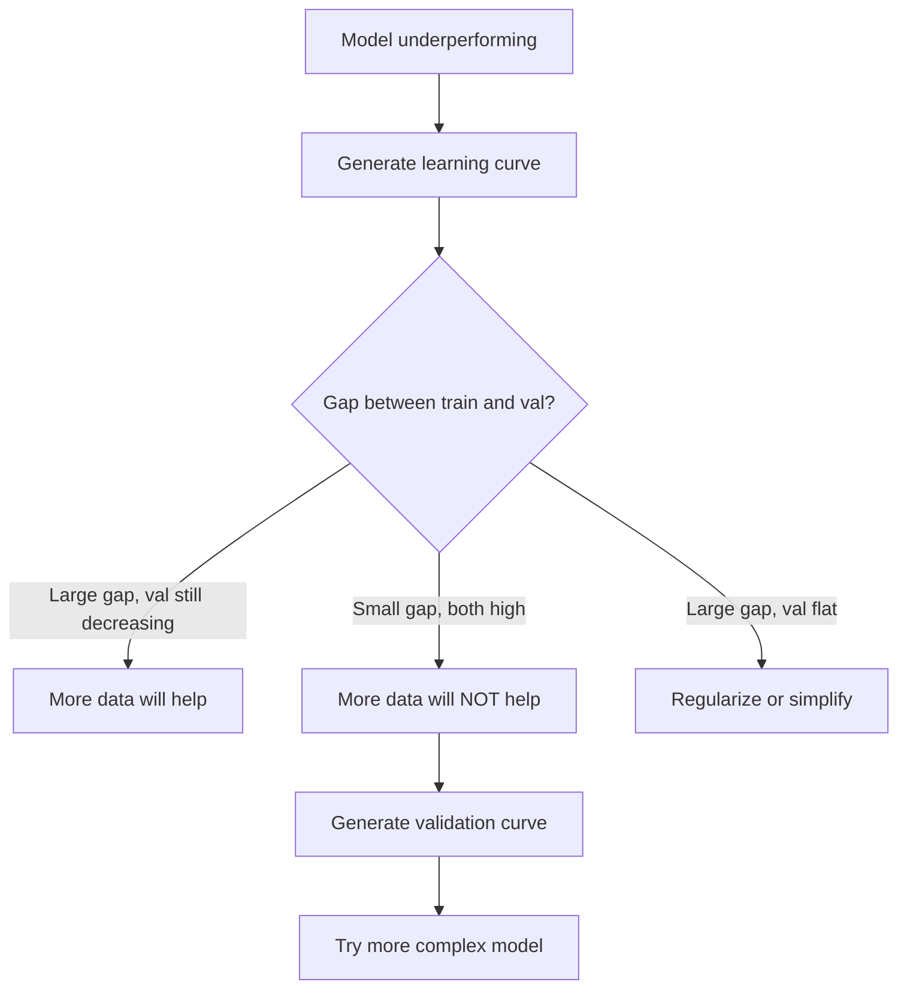

# 偏差-方差权衡

> 每个模型误差都来自三个来源之一：偏差、方差或噪声。你只能控制前两个。

**类型:** 学习
**语言:** Python
**先修:** Phase 2, Lessons 01-09（机器学习基础、回归、分类、评估）
**时间:** ~75 分钟

## 学习目标

- 推导期望预测误差的偏差-方差分解，并解释不可约噪声的作用
- 使用训练误差与测试误差模式诊断模型是高偏差还是高方差
- 解释正则化技术（L1、L2、dropout、early stopping）如何用偏差换取更低方差
- 实现实验，将不同复杂度模型上的偏差-方差权衡可视化

## 要解决的问题

你训练了一个模型。它在测试数据上有一些误差。这个误差从哪里来？

如果模型太简单（比如用线性回归拟合弯曲的数据集），它会持续错过真实模式。这就是偏差。如果模型太复杂（比如在 15 个数据点上拟合 20 次多项式），它会完美拟合训练数据，但在新数据上给出剧烈变化的预测。这就是方差。

在固定模型容量下，你不能同时最小化两者。把偏差压低，方差会上升。把方差压低，偏差会上升。理解这种权衡，是机器学习里最有用的诊断能力。它会告诉你：应该让模型更复杂还是更简单，应该获取更多数据还是设计更好的特征，应该加强还是减弱正则化。

## 核心概念

### 偏差：系统性误差

偏差衡量模型的平均预测离真实值有多远。假设你用来自同一分布的许多不同训练集训练同一个模型，然后把预测求平均，偏差就是这个平均值与真值之间的差距。

高偏差意味着模型太僵硬，无法捕捉真实模式。用直线拟合抛物线时，无论给它多少数据，它都会错过曲线。这就是欠拟合。

```text
High bias (underfitting):
  Model always predicts roughly the same wrong thing.
  Training error: HIGH
  Test error: HIGH
  Gap between them: SMALL
```

### 方差：对训练数据的敏感性

方差衡量当你在不同数据子集上训练时，预测会变化多少。如果训练集的微小变化会导致模型发生很大变化，方差就很高。

高方差意味着模型拟合的是训练数据里的噪声，而不是底层信号。20 次多项式会穿过每一个训练点，但在点与点之间剧烈振荡。这就是过拟合。

```text
High variance (overfitting):
  Model fits training data perfectly but fails on new data.
  Training error: LOW
  Test error: HIGH
  Gap between them: LARGE
```

### 分解公式

对任意点 x，在平方损失下，期望预测误差可以精确分解：

```text
Expected Error = Bias^2 + Variance + Irreducible Noise

where:
  Bias^2   = (E[f_hat(x)] - f(x))^2
  Variance = E[(f_hat(x) - E[f_hat(x)])^2]
  Noise    = E[(y - f(x))^2]             (sigma^2)
```

- `f(x)` 是真实函数
- `f_hat(x)` 是模型预测
- `E[...]` 是对不同训练集取期望
- `y` 是观测标签（真实函数加噪声）

噪声项不可约。对于有噪声的数据，没有模型能优于 sigma^2。你的任务是在 bias^2 与 variance 之间找到正确平衡。

### 模型复杂度与误差



经典的 U 形曲线：

| 复杂度 | 偏差 | 方差 | 总误差 |
|-----------|------|----------|-------------|
| 太低 | 高 | 低 | 高（欠拟合） |
| 刚刚好 | 中等 | 中等 | 最低 |
| 太高 | 低 | 高 | 高（过拟合） |

### 用正则化控制偏差-方差

正则化会有意增加偏差，以降低方差。它约束模型，让模型无法追逐噪声。

- **L2 (Ridge):** 将所有权重向零收缩。保留所有特征，但降低它们的影响。
- **L1 (Lasso):** 将某些权重直接推到零。执行特征选择。
- **Dropout:** 训练期间随机禁用神经元。迫使模型学习冗余表示。
- **Early stopping:** 在模型完全拟合训练数据之前停止训练。

正则化强度（lambda、dropout rate、epoch 数量）直接控制你位于偏差-方差曲线的哪个位置。正则化越强，偏差越高，方差越低。

### Double Descent：现代视角

经典理论说：越过最佳点之后，更高复杂度总是有害。但 2019 年以来的研究展示了一个意外现象。如果继续增加模型容量，远远越过插值阈值（模型参数足以完美拟合训练数据的位置），测试误差可能再次下降。



这种 "double descent" 现象解释了为什么大规模过参数化神经网络（参数远多于训练样本）仍能很好泛化。经典偏差-方差权衡并没有错，但它无法完整描述现代模型区域。

关于 double descent 的关键观察：
- 它会出现在 linear models、decision trees 和 neural networks 中
- 在插值区域，更多数据反而可能有害（sample-wise double descent）
- 更多训练 epoch 也可能造成这种现象（epoch-wise double descent）
- 正则化会抹平峰值，但不会消除它

为什么会发生这种事？在插值阈值处，模型刚好有足够容量拟合所有训练点。它被迫进入一个非常特定的解，这个解穿过每个点；数据的微小扰动会导致拟合结果大幅变化。这就是方差达到峰值的位置。越过阈值后，模型有许多能完美拟合数据的可能解。学习算法（例如带有隐式正则化的 gradient descent）往往会在这些解中选择最简单的那个。对简单解的这种隐式偏置，是过参数化模型能够泛化的原因。

| 区域 | 参数与样本 | 行为 |
|--------|----------------------|----------|
| 欠参数化 | p << n | 经典权衡适用 |
| 插值阈值 | p ~ n | 方差达到峰值，测试误差飙升 |
| 过参数化 | p >> n | 隐式正则化开始起作用，测试误差下降 |

实际使用时：如果你使用 neural networks 或大型 tree ensembles，不要停在插值阈值。要么明显低于它（配合显式正则化），要么远远越过它。最糟的位置正好是阈值附近。

### 诊断你的模型



| 症状 | 诊断 | 修复 |
|---------|-----------|-----|
| 训练误差高，测试误差高 | 偏差 | 更多特征、更复杂模型、更少正则化 |
| 训练误差低，测试误差高 | 方差 | 更多数据、正则化、更简单模型、dropout |
| 训练误差低，测试误差低 | 拟合良好 | 发布它 |
| 训练误差下降，测试误差上升 | 过拟合正在发生 | Early stopping |

### 实用策略

**当问题是偏差时：**
- 添加 polynomial 或 interaction features
- 使用更灵活的模型（例如用 tree ensemble 替代 linear）
- 降低正则化强度
- 训练更久（如果尚未收敛）

**当问题是方差时：**
- 获取更多训练数据
- 使用 bagging（random forests）
- 增强正则化（更高 lambda、更多 dropout）
- 做特征选择（移除噪声特征）
- 使用 cross-validation 尽早发现它

### 集成方法与方差降低

集成方法是对抗方差最实用的工具。

**Bagging (Bootstrap Aggregating)** 会在训练数据的不同 bootstrap 样本上训练多个模型，然后平均它们的预测。每个单独模型都有高方差，但平均后的模型方差低得多。Random forests 就是把 bagging 应用于 decision trees。

它在数学上为什么有效：如果你平均 N 个相互独立的预测，每个预测方差为 sigma^2，那么平均值的方差是 sigma^2 / N。这些模型并不真正独立（它们都看到相似数据），所以降低幅度小于 1/N，但仍然相当可观。

**Boosting** 通过顺序构建模型来降低偏差，其中每个新模型都专注于当前集成模型的错误。Gradient boosting 和 AdaBoost 是主要例子。如果加入太多模型，boosting 可能过拟合，因此你需要 early stopping 或正则化。

| 方法 | 主要效果 | 偏差变化 | 方差变化 |
|--------|---------------|-------------|-----------------|
| Bagging | 降低方差 | 不变 | 降低 |
| Boosting | 降低偏差 | 降低 | 可能上升 |
| Stacking | 同时降低两者 | 取决于 meta-learner | 取决于 base models |
| Dropout | 隐式 bagging | 略微上升 | 降低 |

**实用规则：** 如果你的 base model 有高方差（deep trees、high-degree polynomials），用 bagging。如果你的 base model 有高偏差（shallow stumps、simple linear models），用 boosting。

### 学习曲线

学习曲线绘制训练误差和验证误差如何随训练集大小变化。它们是你拥有的最实用诊断工具。不同于单次 train/test 对比，学习曲线会展示模型轨迹，并告诉你更多数据是否有帮助。



如何解读：

| 场景 | 训练误差 | 验证误差 | 差距 | 含义 | 该怎么做 |
|----------|---------------|-----------------|-----|---------------|------------|
| 高偏差 | 高 | 高 | 小 | 模型无法捕捉模式 | 更多特征、更复杂模型、更少正则化 |
| 高方差 | 低 | 高 | 大 | 模型记住了训练数据 | 更多数据、正则化、更简单模型 |
| 拟合良好 | 中等 | 中等 | 小 | 模型泛化良好 | 发布它 |
| 高方差，正在改善 | 低 | 随更多数据下降 | 正在缩小 | 数据可以修复的方差问题 | 收集更多数据 |
| 高偏差，平坦 | 高 | 高且平坦 | 小且平坦 | 更多数据没有帮助 | 改变模型架构 |

关键洞察：如果两条曲线都已经平台化，并且差距很小但两个误差都很高，更多数据没有用。你需要更好的模型。如果差距很大并且仍在缩小，更多数据会有帮助。

### 如何生成学习曲线

有两种方法：

**方法 1：改变训练集大小，固定模型。** 保持模型和超参数不变。在越来越大的训练数据子集上训练。测量每个大小下的训练误差和验证误差。这是标准学习曲线。

**方法 2：改变模型复杂度，固定数据。** 保持数据不变。扫描一个复杂度参数（polynomial degree、tree depth、number of layers）。测量每个复杂度下的训练误差和验证误差。这是验证曲线，会直接展示偏差-方差权衡。

两种方法互为补充。第一种告诉你更多数据是否有帮助。第二种告诉你换模型是否有帮助。在决定下一步之前，两者都跑一遍。



## 动手实现

`code/bias_variance.py` 中的代码会运行完整的偏差-方差分解实验。方法如下，逐步来看。

### Step 1：从已知函数生成合成数据

我们使用带 Gaussian noise 的 `f(x) = sin(1.5x) + 0.5x`。知道真实函数后，就能计算精确的偏差和方差。

```python
def true_function(x):
    return np.sin(1.5 * x) + 0.5 * x

def generate_data(n_samples=30, noise_std=0.5, x_range=(-3, 3), seed=None):
    rng = np.random.RandomState(seed)
    x = rng.uniform(x_range[0], x_range[1], n_samples)
    y = true_function(x) + rng.normal(0, noise_std, n_samples)
    return x, y
```

### Step 2：Bootstrap 采样与多项式拟合

对每个 polynomial degree，我们抽取许多 bootstrap 训练集，拟合多项式，并在固定测试网格上记录预测。这会给我们每个测试点上的预测分布。

```python
def fit_polynomial(x_train, y_train, degree, lam=0.0):
    X = np.column_stack([x_train ** d for d in range(degree + 1)])
    if lam > 0:
        penalty = lam * np.eye(X.shape[1])
        penalty[0, 0] = 0
        w = np.linalg.solve(X.T @ X + penalty, X.T @ y_train)
    else:
        w = np.linalg.lstsq(X, y_train, rcond=None)[0]
    return w
```

我们在 200 个不同 bootstrap 样本上拟合。每个 bootstrap 样本都来自同一个底层分布，但包含不同的点。

### Step 3：计算 Bias^2、Variance 分解

有了每个测试点上的 200 组预测，就可以直接按定义计算分解：

```python
mean_pred = predictions.mean(axis=0)
bias_sq = np.mean((mean_pred - y_true) ** 2)
variance = np.mean(predictions.var(axis=0))
total_error = np.mean(np.mean((predictions - y_true) ** 2, axis=1))
```

- `mean_pred` 是从 bootstrap 样本估计的 E[f_hat(x)]
- `bias_sq` 是平均预测与真值之间差距的平方
- `variance` 是 bootstrap 样本间预测离散程度的平均值
- `total_error` 应该近似等于 bias^2 + variance + noise

### Step 4：学习曲线

学习曲线在保持模型复杂度固定时扫描训练集大小。它们展示模型是受数据限制，还是受容量限制。

```python
def demo_learning_curves():
    sizes = [10, 15, 20, 30, 50, 75, 100, 150, 200, 300]
    degree = 5

    for n in sizes:
        train_errors = []
        test_errors = []
        for seed in range(50):
            x_train, y_train = generate_data(n_samples=n, seed=seed * 100)
            w = fit_polynomial(x_train, y_train, degree)
            train_pred = predict_polynomial(x_train, w)
            train_mse = np.mean((train_pred - y_train) ** 2)
            test_pred = predict_polynomial(x_test, w)
            test_mse = np.mean((test_pred - y_test) ** 2)
            train_errors.append(train_mse)
            test_errors.append(test_mse)
        # Average over runs gives the learning curve point
```

对于高方差模型（小数据上的 degree 5），你会看到：
- 训练误差一开始很低，随后随着更多数据让记忆更困难而上升
- 测试误差一开始很高，随后随着模型获得更多信号而下降
- 差距会随更多数据而缩小

对于高偏差模型（degree 1），两种误差都会很快收敛到同一个高值，更多数据没有帮助。

### Step 5：正则化扫描

代码还包含 `demo_regularization_sweep()`，它固定一个高阶多项式（degree 15），并将 Ridge 正则化强度从 0.001 扫描到 100。这从另一个角度展示偏差-方差权衡：我们不是改变模型复杂度，而是改变约束强度。

```python
def demo_regularization_sweep():
    alphas = [0.001, 0.005, 0.01, 0.05, 0.1, 0.5, 1.0, 5.0, 10.0, 50.0, 100.0]
    for alpha in alphas:
        results = bias_variance_decomposition([15], lam=alpha)
        r = results[15]
        print(f"alpha={alpha:.3f}  bias={r['bias_sq']:.4f}  var={r['variance']:.4f}")
```

alpha 很低时，degree-15 多项式几乎不受约束。方差占主导，因为模型会在每个 bootstrap 样本中追逐噪声。alpha 很高时，惩罚强到模型实际上接近一个常数函数。偏差占主导。最优 alpha 位于这两个极端之间。

这就是通过改变 polynomial degree 得到的同一个 U 形曲线，只不过这里用连续旋钮而不是离散旋钮来控制。在实践中，正则化是控制这种权衡的首选方法，因为它可以在不改变特征集的情况下进行细粒度控制。

## 实际使用

sklearn 提供 `learning_curve` 和 `validation_curve`，可以自动完成这些诊断，而无需手写 bootstrap 循环。

### Validation Curve：扫描模型复杂度

```python
from sklearn.model_selection import validation_curve
from sklearn.pipeline import make_pipeline
from sklearn.preprocessing import PolynomialFeatures
from sklearn.linear_model import Ridge

degrees = list(range(1, 16))
train_scores_all = []
val_scores_all = []

for d in degrees:
    pipe = make_pipeline(PolynomialFeatures(d), Ridge(alpha=0.01))
    train_scores, val_scores = validation_curve(
        pipe, X, y, param_name="polynomialfeatures__degree",
        param_range=[d], cv=5, scoring="neg_mean_squared_error"
    )
    train_scores_all.append(-train_scores.mean())
    val_scores_all.append(-val_scores.mean())
```

这会直接给出偏差-方差权衡曲线。相对训练分数而言验证分数最差的地方，方差占主导。两者都差的地方，偏差占主导。

### Learning Curve：扫描训练集大小

```python
from sklearn.model_selection import learning_curve

pipe = make_pipeline(PolynomialFeatures(5), Ridge(alpha=0.01))
train_sizes, train_scores, val_scores = learning_curve(
    pipe, X, y, train_sizes=np.linspace(0.1, 1.0, 10),
    cv=5, scoring="neg_mean_squared_error"
)
train_mse = -train_scores.mean(axis=1)
val_mse = -val_scores.mean(axis=1)
```

将 `train_mse` 和 `val_mse` 对 `train_sizes` 作图。曲线形状会告诉你关于模型的一切。

### 带正则化扫描的 Cross-Validation

```python
from sklearn.model_selection import cross_val_score

alphas = [0.001, 0.01, 0.1, 1.0, 10.0, 100.0]
for alpha in alphas:
    pipe = make_pipeline(PolynomialFeatures(10), Ridge(alpha=alpha))
    scores = cross_val_score(pipe, X, y, cv=5, scoring="neg_mean_squared_error")
    print(f"alpha={alpha:>7.3f}  MSE={-scores.mean():.4f} +/- {scores.std():.4f}")
```

这会在固定模型复杂度下扫描正则化强度。你会看到同样的偏差-方差权衡：低 alpha 意味着高方差，高 alpha 意味着高偏差。

### 组合起来：完整诊断工作流

实践中，你按顺序运行这些诊断：

1. 训练模型。计算训练误差和测试误差。
2. 如果两者都高：你有偏差问题。跳到步骤 4。
3. 如果训练误差低但测试误差高：你有方差问题。生成学习曲线，判断更多数据是否有帮助。如果没有，就做正则化。
4. 生成验证曲线，扫描你的主要复杂度参数。找到最佳点。
5. 在最佳点生成学习曲线。如果差距仍然很大，你需要更多数据或正则化。
6. 用 `cross_val_score` 尝试不同 alpha 值的 Ridge/Lasso。选择交叉验证误差最低的 alpha。

对大多数表格数据集来说，这需要 10-15 分钟计算，却能省下数小时猜测。

## 交付成果

本课产出：`outputs/prompt-model-diagnostics.md`

## 练习

1. 用 `noise_std=0`（无噪声）运行分解。不可约误差项会发生什么？最优复杂度会改变吗？

2. 将训练集大小从 30 增加到 300。这会如何影响方差成分？最优 polynomial degree 会移动吗？

3. 给实验加入 L2 正则化（Ridge regression）。对于固定的高阶多项式（degree 15），将 lambda 从 0 扫描到 100。绘制 bias^2 和 variance 关于 lambda 的函数图。

4. 将真实函数从多项式改为 `sin(x)`。偏差-方差分解会如何变化？是否仍有明确的最优 degree？

5. 实现一个简单的 bootstrap aggregating（bagging）包装器：在 bootstrap 样本上训练 10 个模型，并平均预测。展示它能降低方差，同时几乎不增加偏差。

## 关键术语

| 术语 | 常见说法 | 实际含义 |
|------|----------------|----------------------|
| Bias | “模型太简单” | 错误假设带来的系统性误差。平均模型预测与真值之间的差距。 |
| Variance | “模型过拟合” | 对训练数据敏感造成的误差。预测在不同训练集之间变化的程度。 |
| Irreducible error | “数据里的噪声” | 真实数据生成过程中的随机性导致的误差。没有模型能消除它。 |
| Underfitting | “学得不够” | 模型有高偏差。即使在训练数据上也错过真实模式。 |
| Overfitting | “记住了数据” | 模型有高方差。它拟合了训练数据中无法泛化的噪声。 |
| Regularization | “约束模型” | 加入惩罚以降低模型复杂度，用更高偏差换取更低方差。 |
| Double descent | “更多参数可能有帮助” | 当模型容量远超插值阈值时，测试误差会再次下降。 |
| Model complexity | “模型有多灵活” | 模型拟合任意模式的能力。由架构、特征或正则化控制。 |

## 延伸阅读

- [Hastie, Tibshirani, Friedman: Elements of Statistical Learning, Ch. 7](https://hastie.su.domains/ElemStatLearn/) -- 对偏差-方差分解的权威处理
- [Belkin et al., Reconciling modern machine learning practice and the bias-variance trade-off (2019)](https://arxiv.org/abs/1812.11118) -- double descent 论文
- [Nakkiran et al., Deep Double Descent (2019)](https://arxiv.org/abs/1912.02292) -- epoch-wise 和 sample-wise double descent
- [Scott Fortmann-Roe: Understanding the Bias-Variance Tradeoff](http://scott.fortmann-roe.com/docs/BiasVariance.html) -- 清晰的可视化解释
