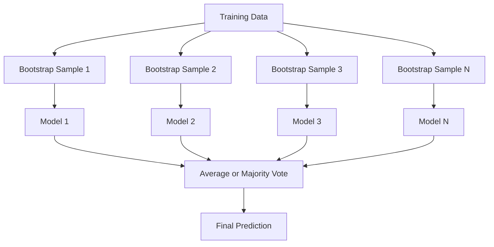
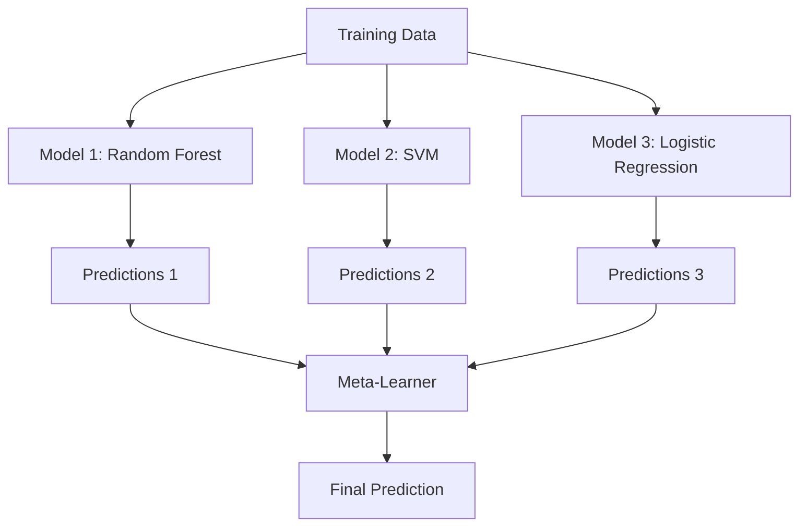

# 集成方法

> 一组弱学习器，如果组合正确，就会变成强学习器。这不是比喻，而是定理。

**类型:** 构建
**语言:** Python
**先修:** Phase 2, Lesson 10（偏差-方差权衡）
**时间:** ~120 分钟

## 学习目标

- 从零实现 AdaBoost 和 gradient boosting，并解释 boosting 如何顺序降低偏差
- 构建 bagging ensemble，并展示平均去相关模型如何在不增加偏差的情况下降低方差
- 从每种方法针对的误差成分角度，对比 bagging、boosting 和 stacking
- 评估 ensemble diversity，并解释为什么更多独立弱学习器会提高 majority voting 准确率

## 要解决的问题

单棵 decision tree 训练快、容易解释，但会过拟合。单个线性模型在复杂边界上会欠拟合。你可以花几天设计完美模型架构。或者，你可以把一堆不完美模型组合起来，得到比其中任何单个模型都更好的结果。

集成方法做的正是这件事。它们是在表格数据 Kaggle 比赛中获胜最可靠的技术，支撑了多数生产级 ML 系统，也直观展示了偏差-方差权衡如何运作。Bagging 降低方差。Boosting 降低偏差。Stacking 学习在不同输入上该信任哪些模型。

## 核心概念

### 为什么集成有效

假设你有 N 个独立分类器，每个分类器的准确率 p > 0.5。多数投票的准确率是：

```text
P(majority correct) = sum over k > N/2 of C(N,k) * p^k * (1-p)^(N-k)
```

对于 21 个准确率均为 60% 的分类器，多数投票准确率约为 74%。对于 101 个分类器，它会上升到 84%。当模型犯不同错误时，错误会相互抵消。

关键要求是 **diversity**。如果所有模型都犯同样的错误，把它们组合起来毫无帮助。集成之所以有效，是因为它们通过以下方式产生多样化模型：

- 不同训练子集（bagging）
- 不同特征子集（random forests）
- 顺序误差修正（boosting）
- 不同模型家族（stacking）

### Bagging (Bootstrap Aggregating)

Bagging 通过在训练数据的不同 bootstrap 样本上训练每个模型来创造多样性。



bootstrap 样本是从原始数据中有放回抽样得到的，大小与原始数据相同。每个 bootstrap 中大约会出现 63.2% 的唯一样本。剩下的 36.8%（out-of-bag samples）提供了一个免费的验证集。

Bagging 会降低方差，而且几乎不增加偏差。每棵单独的树都会过拟合自己的 bootstrap 样本，但每棵树的过拟合方式不同，因此平均会抵消噪声。

**Random Forests** 是带有额外变化的 bagging：在每次 split 时，只考虑随机特征子集。这会迫使树之间有更多多样性。候选特征数量的典型取值是分类任务中的 `sqrt(n_features)`，以及回归任务中的 `n_features / 3`。

### Boosting（顺序误差修正）

Boosting 顺序训练模型。每个新模型都专注于前面模型做错的样本。


Boosting 降低偏差。每个新模型都会修正目前集成模型的系统性错误。最终预测是所有模型的加权和，其中表现更好的模型获得更高权重。

代价是：如果运行太多轮，boosting 可能过拟合，因为它会持续拟合更难的样本，而其中一些样本可能是噪声。

### AdaBoost

AdaBoost (Adaptive Boosting) 是第一个实用的 boosting 算法。它可与任何 base learner 配合使用，通常使用 decision stumps（depth-1 trees）。

算法如下：

```text
1. Initialize sample weights: w_i = 1/N for all i

2. For t = 1 to T:
   a. Train weak learner h_t on weighted data
   b. Compute weighted error:
      err_t = sum(w_i * I(h_t(x_i) != y_i)) / sum(w_i)
   c. Compute model weight:
      alpha_t = 0.5 * ln((1 - err_t) / err_t)
   d. Update sample weights:
      w_i = w_i * exp(-alpha_t * y_i * h_t(x_i))
   e. Normalize weights to sum to 1

3. Final prediction: H(x) = sign(sum(alpha_t * h_t(x)))
```

误差更低的模型会得到更高的 alpha。被误分类的样本权重会上升，因此下一个模型会专注于它们。

### Gradient Boosting

Gradient boosting 将 boosting 泛化到任意 loss functions。它不是重新加权样本，而是让每个新模型拟合当前集成模型的残差（loss 的负梯度）。

```text
1. Initialize: F_0(x) = argmin_c sum(L(y_i, c))

2. For t = 1 to T:
   a. Compute pseudo-residuals:
      r_i = -dL(y_i, F_{t-1}(x_i)) / dF_{t-1}(x_i)
   b. Fit a tree h_t to the residuals r_i
   c. Find optimal step size:
      gamma_t = argmin_gamma sum(L(y_i, F_{t-1}(x_i) + gamma * h_t(x_i)))
   d. Update:
      F_t(x) = F_{t-1}(x) + learning_rate * gamma_t * h_t(x)

3. Final prediction: F_T(x)
```

对于 squared error loss，pseudo-residuals 就是真正的残差：`r_i = y_i - F_{t-1}(x_i)`。每棵树实际上都在拟合前一个集成模型的错误。

learning rate（shrinkage）控制每棵树贡献多少。更小的 learning rate 需要更多树，但泛化更好。典型取值是 0.01 到 0.3。

### XGBoost：为什么它主导表格数据

XGBoost (eXtreme Gradient Boosting) 是带有工程优化的 gradient boosting，这些优化让它快速、准确，并且抗过拟合：

- **Regularized objective:** 对 leaf weights 加 L1 和 L2 惩罚，防止单棵树过度自信
- **Second-order approximation:** 同时使用 loss 的一阶和二阶导数，从而做出更好的 split 决策
- **Sparsity-aware splits:** 原生处理缺失值，在每个 split 处学习缺失数据的最佳方向
- **Column subsampling:** 像 random forests 一样，在每个 split 处采样特征以增加多样性
- **Weighted quantile sketch:** 在分布式数据上高效寻找连续特征的 split points
- **Cache-aware block structure:** 针对 CPU cache lines 优化的内存布局

对于表格数据，XGBoost（以及它的后继者 LightGBM）持续优于 neural networks。这短期内不会改变。如果你的数据适合用行和列组成的表来表示，就从 gradient boosting 开始。

### Stacking（Meta-Learning）

Stacking 将多个 base models 的预测作为 meta-learner 的特征。



meta-learner 会学习在什么输入上信任哪个 base model。如果 random forest 在某些区域更好，而 SVM 在另一些区域更好，meta-learner 会学会相应地路由。

为避免 data leakage，base model 的预测必须通过训练集上的 cross-validation 生成。你绝不能在同一份数据上既训练 base models，又生成 meta-features。

### Voting

最简单的集成。直接组合预测。

- **Hard voting:** 对类别标签做多数投票。
- **Soft voting:** 平均预测概率，选择平均概率最高的类别。通常更好，因为它利用了置信度信息。

## 动手实现

### Step 1：Decision Stump（Base Learner）

`code/ensembles.py` 中的代码从零实现了所有内容。我们从 decision stump 开始：一棵只有一次 split 的树。

```python
class DecisionStump:
    def __init__(self):
        self.feature_idx = None
        self.threshold = None
        self.polarity = 1
        self.alpha = None

    def fit(self, X, y, weights):
        n_samples, n_features = X.shape
        best_error = float("inf")

        for f in range(n_features):
            thresholds = np.unique(X[:, f])
            for thresh in thresholds:
                for polarity in [1, -1]:
                    pred = np.ones(n_samples)
                    pred[polarity * X[:, f] < polarity * thresh] = -1
                    error = np.sum(weights[pred != y])
                    if error < best_error:
                        best_error = error
                        self.feature_idx = f
                        self.threshold = thresh
                        self.polarity = polarity

    def predict(self, X):
        n = X.shape[0]
        pred = np.ones(n)
        idx = self.polarity * X[:, self.feature_idx] < self.polarity * self.threshold
        pred[idx] = -1
        return pred
```

### Step 2：从零实现 AdaBoost

```python
class AdaBoostScratch:
    def __init__(self, n_estimators=50):
        self.n_estimators = n_estimators
        self.stumps = []
        self.alphas = []

    def fit(self, X, y):
        n = X.shape[0]
        weights = np.full(n, 1 / n)

        for _ in range(self.n_estimators):
            stump = DecisionStump()
            stump.fit(X, y, weights)
            pred = stump.predict(X)

            err = np.sum(weights[pred != y])
            err = np.clip(err, 1e-10, 1 - 1e-10)

            alpha = 0.5 * np.log((1 - err) / err)
            weights *= np.exp(-alpha * y * pred)
            weights /= weights.sum()

            stump.alpha = alpha
            self.stumps.append(stump)
            self.alphas.append(alpha)

    def predict(self, X):
        total = sum(a * s.predict(X) for a, s in zip(self.alphas, self.stumps))
        return np.sign(total)
```

### Step 3：从零实现 Gradient Boosting

```python
class GradientBoostingScratch:
    def __init__(self, n_estimators=100, learning_rate=0.1, max_depth=3):
        self.n_estimators = n_estimators
        self.lr = learning_rate
        self.max_depth = max_depth
        self.trees = []
        self.initial_pred = None

    def fit(self, X, y):
        self.initial_pred = np.mean(y)
        current_pred = np.full(len(y), self.initial_pred)

        for _ in range(self.n_estimators):
            residuals = y - current_pred
            tree = SimpleRegressionTree(max_depth=self.max_depth)
            tree.fit(X, residuals)
            update = tree.predict(X)
            current_pred += self.lr * update
            self.trees.append(tree)

    def predict(self, X):
        pred = np.full(X.shape[0], self.initial_pred)
        for tree in self.trees:
            pred += self.lr * tree.predict(X)
        return pred
```

### Step 4：与 sklearn 对比

代码会验证我们的 from-scratch 实现能产生与 sklearn 的 `AdaBoostClassifier` 和 `GradientBoostingClassifier` 相近的准确率，并把所有方法并排比较。

## 实际使用

### 何时使用哪种方法

| 方法 | 降低 | 最适合 | 注意事项 |
|--------|---------|----------|---------------|
| Bagging / Random Forest | 方差 | 嘈杂数据、很多特征 | 对偏差没有帮助 |
| AdaBoost | 偏差 | 干净数据、简单 base learners | 对 outliers 和噪声敏感 |
| Gradient Boosting | 偏差 | 表格数据、竞赛 | 训练慢，不调参容易过拟合 |
| XGBoost / LightGBM | 两者 | 生产级表格 ML | 超参数很多 |
| Stacking | 两者 | 追求最后 1-2% 准确率 | 复杂，meta-learner 有过拟合风险 |
| Voting | 方差 | 快速组合多样化模型 | 只有模型多样时才有帮助 |

### 表格数据的生产栈

对于大多数表格预测问题，尝试顺序如下：

1. 使用默认参数的 **LightGBM or XGBoost**
2. 调整 n_estimators、learning_rate、max_depth、min_child_weight
3. 如果需要最后 0.5%，用 3-5 个多样化模型构建 stacking ensemble
4. 全程使用 cross-validation

尽管相关研究一直在推进，但 neural networks 在表格数据上几乎总是弱于 gradient boosting。TabNet、NODE 以及类似架构偶尔能追平，但很少击败调好的 XGBoost。

## 交付成果

本课产出 `outputs/prompt-ensemble-selector.md`，这是一个帮助你为给定数据集选择合适集成方法的 prompt。描述你的数据（大小、特征类型、噪声水平、类别平衡）和你要解决的问题。该 prompt 会走过一份决策清单，推荐一种方法，建议起始超参数，并提醒该方法的常见错误。本课还产出 `outputs/skill-ensemble-builder.md`，其中包含完整选择指南。

## 练习

1. 修改 AdaBoost 实现，使其在每一轮后跟踪训练准确率。绘制准确率与 estimators 数量的关系。它什么时候收敛？

2. 通过给 regression tree 添加随机特征子采样，从零实现一个 random forest。用 `max_features=sqrt(n_features)` 训练 100 棵树，并平均预测。将方差降低效果与单棵树对比。

3. 在 gradient boosting 实现中添加 early stopping：每轮后跟踪 validation loss，如果连续 10 轮没有改善就停止。它实际需要多少棵树？

4. 构建一个 stacking ensemble，包含三个 base models（logistic regression、decision tree、k-nearest neighbors）和一个 logistic regression meta-learner。使用 5-fold cross-validation 生成 meta-features。与每个 base model 单独比较。

5. 在同一个数据集上用默认参数运行 XGBoost。将它的准确率与你从零实现的 gradient boosting 对比。计时两者。速度差异有多大？

## 关键术语

| 术语 | 常见说法 | 实际含义 |
|------|----------------|----------------------|
| Bagging | “在随机子集上训练” | Bootstrap aggregating：在 bootstrap 样本上训练模型，平均预测以降低方差 |
| Boosting | “关注困难样本” | 顺序训练模型，每个模型修正当前集成模型的错误，以降低偏差 |
| AdaBoost | “重新加权数据” | 通过样本权重更新实现的 boosting；误分类点在下一个 learner 中获得更高权重 |
| Gradient boosting | “拟合残差” | 通过让每个新模型拟合 loss function 的负梯度来实现 boosting |
| XGBoost | “Kaggle 利器” | 带有正则化、二阶优化和系统级加速技巧的 gradient boosting |
| Stacking | “模型叠在模型上” | 使用 base models 的预测作为 meta-learner 的输入特征 |
| Random forest | “许多随机化的树” | 使用 decision trees 的 bagging，并在每次 split 时加入随机特征子采样以提高多样性 |
| Ensemble diversity | “犯不同错误” | 模型错误必须不相关，ensemble 才能优于单个模型 |
| Out-of-bag error | “免费验证” | 未进入 bootstrap 抽样的样本（约 36.8%）可作为验证集，无需额外 holdout |

## 延伸阅读

- [Schapire & Freund: Boosting: Foundations and Algorithms](https://mitpress.mit.edu/9780262526036/) -- AdaBoost 创建者写的书
- [Friedman: Greedy Function Approximation: A Gradient Boosting Machine (2001)](https://statweb.stanford.edu/~jhf/ftp/trebst.pdf) -- 原始 gradient boosting 论文
- [Chen & Guestrin: XGBoost (2016)](https://arxiv.org/abs/1603.02754) -- XGBoost 论文
- [Wolpert: Stacked Generalization (1992)](https://www.sciencedirect.com/science/article/abs/pii/S0893608005800231) -- 原始 stacking 论文
- [scikit-learn Ensemble Methods](https://scikit-learn.org/stable/modules/ensemble.html) -- 实用参考
