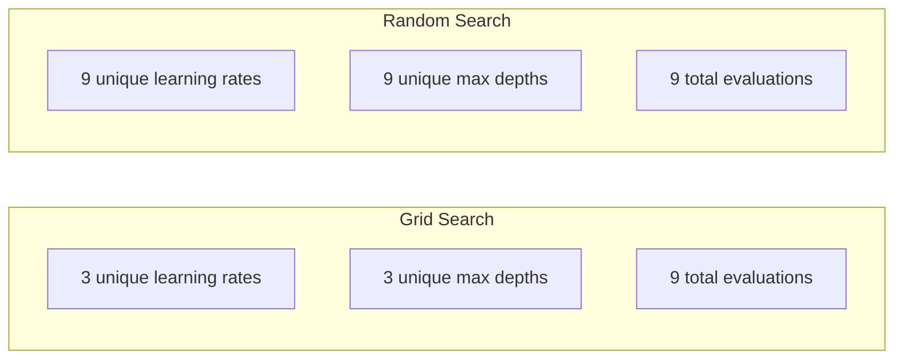
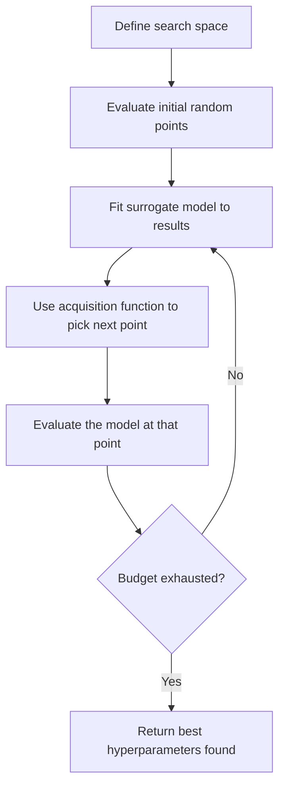
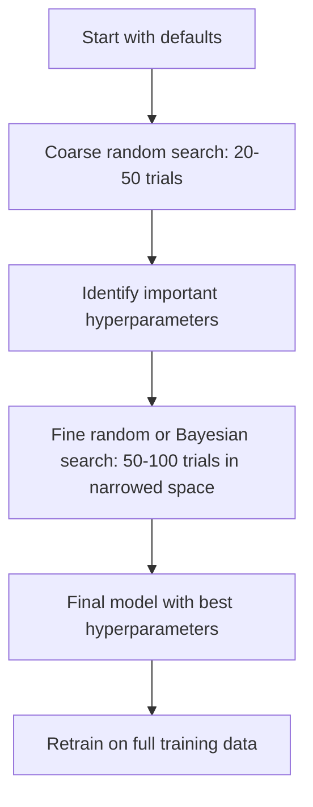
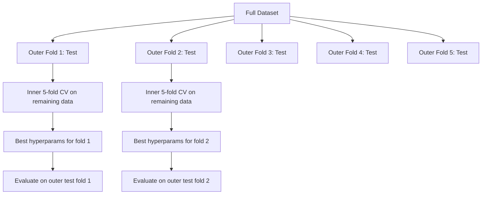

# 超参数调优

> 超参数是训练开始前由你转动的旋钮。把它们调好，就是平庸模型和优秀模型之间的差别。

**类型:** 构建
**语言:** Python
**先修:** 第 2 阶段，第 11 课（集成方法）
**时间:** ~90 分钟

## 学习目标

- 从零实现网格搜索、随机搜索和贝叶斯优化，并比较它们的样本效率
- 解释为什么当大多数超参数的有效维度较低时，随机搜索会优于网格搜索
- 使用替代模型和采集函数构建贝叶斯优化循环来引导搜索
- 设计一种超参数调优策略，通过恰当的交叉验证避免过拟合验证集

## 要解决的问题

你的梯度提升模型有学习率、树的数量、最大深度、每个叶子的最小样本数、子采样比例和列采样比例。这就是六个超参数。如果每个超参数都有 5 个合理取值，网格就有 5^6 = 15,625 种组合。每次训练需要 10 秒。全部尝试一遍就是 43 小时的计算量。

网格搜索是最直观的方法，也是规模变大时最糟糕的方法。随机搜索用更少计算做得更好。贝叶斯优化通过从过去的评估中学习，效果还会更好。知道该用哪种策略，以及哪些超参数真正重要，可以省下数天被浪费的 GPU 时间。

## 核心概念

### 参数与超参数

参数是在训练过程中学习到的（权重、偏置、分裂阈值）。超参数是在训练开始前设定的，用来控制学习如何发生。

| 超参数 | 控制内容 | 典型范围 |
|---------------|-----------------|---------------|
| 学习率 | 每次更新的步长 | 0.001 到 1.0 |
| 树/epoch 数量 | 训练多久 | 10 到 10,000 |
| 最大深度 | 模型复杂度 | 1 到 30 |
| 正则化（lambda） | 防止过拟合 | 0.0001 到 100 |
| 批大小 | 梯度估计噪声 | 16 到 512 |
| Dropout 率 | 被丢弃的神经元比例 | 0.0 到 0.5 |

### 网格搜索

网格搜索会评估指定取值的每一种组合。它是穷尽式的，也容易理解，但会随着超参数数量呈指数级扩展。

```text
Grid for 2 hyperparameters:

  learning_rate: [0.01, 0.1, 1.0]
  max_depth:     [3, 5, 7]

  Evaluations: 3 x 3 = 9 combinations

  (0.01, 3)  (0.01, 5)  (0.01, 7)
  (0.1,  3)  (0.1,  5)  (0.1,  7)
  (1.0,  3)  (1.0,  5)  (1.0,  7)
```

网格搜索有一个根本缺陷：如果一个超参数很重要，而另一个不重要，大多数评估都会被浪费。9 次评估里，重要参数只得到 3 个不同取值。

### 随机搜索

随机搜索不是从网格中取值，而是从分布中采样超参数。在同样 9 次评估的预算下，每个超参数都能得到 9 个不同取值。



为什么随机优于网格（Bergstra & Bengio, 2012）：

- 大多数超参数的有效维度很低。对给定问题来说，6 个超参数里通常只有 1-2 个真正重要。
- 网格搜索会把评估浪费在不重要的维度上。
- 在相同预算下，随机搜索对重要维度的覆盖更密。
- 进行 60 次随机试验时，如果搜索空间中存在足够好的点，你有 95% 的概率找到距离最优值 5% 以内的点。

### 贝叶斯优化

随机搜索会忽略结果。它不会学到高学习率会导致发散，也不会学到深度 3 总是优于深度 10。贝叶斯优化使用过去的评估来决定下一步去哪里搜索。



两个关键组件：

**替代模型：** 一个评估成本很低的模型（通常是高斯过程），用来近似昂贵的目标函数。它会在搜索空间的任意点给出预测值和不确定性估计。

**采集函数：** 通过平衡利用（在已知好点附近搜索）和探索（在不确定性高的区域搜索）来决定下一步评估哪里。常见选择：

- **期望改进（EI）：** 在这一点上，我们预期能比当前最优好多少？
- **置信上界（UCB）：** 预测值加上不确定性的若干倍。更高的 UCB 意味着要么有前景，要么还没有充分探索。
- **改进概率（PI）：** 这个点超过当前最优的概率是多少？

贝叶斯优化通常能用比随机搜索少 2-5 倍的评估次数找到更好的超参数。与训练真实模型相比，拟合替代模型的开销可以忽略不计。

### 早停

不是每一次训练都需要跑完。如果某个配置在 10 个 epoch 后已经明显很差，就停止它并继续下一个。这就是超参数搜索语境下的早停。

策略：
- **基于耐心值：** 如果验证损失连续 N 个 epoch 没有改进就停止
- **中位数剪枝：** 如果某个试验在同一步的中间结果差于已完成试验的中位数，就停止
- **Hyperband：** 给许多配置分配小预算，然后逐步增加最佳配置的预算

Hyperband 尤其有效。它从 81 个配置开始，每个配置 1 个 epoch，保留前三分之一，给它们 3 个 epoch，再保留前三分之一，如此继续。相比用完整预算评估所有配置，它能快 10-50 倍找到好配置。

### 学习率调度器

学习率几乎总是最重要的超参数。调度器不是让它固定不变，而是在训练过程中调整它。

| 调度器 | 公式 | 使用场景 |
|-----------|---------|-------------|
| 阶梯衰减 | 每 N 个 epoch 乘以 0.1 | 经典 CNN 训练 |
| 余弦退火 | lr * 0.5 * (1 + cos(pi * t / T)) | 现代默认选择 |
| Warmup + decay | 先线性增加再余弦衰减 | Transformers |
| One-cycle | 在一个周期内先增加再降低 | 快速收敛 |
| 平台期降低 | 指标停滞时按因子降低 | 稳妥默认选择 |

### 超参数重要性

并非所有超参数都同等重要。关于随机森林（Probst et al., 2019）和梯度提升的研究显示出一致模式：

**高重要性：**
- 学习率（总是先调它）
- 估计器/epoch 数量（使用早停，而不是直接调它）
- 正则化强度

**中等重要性：**
- 最大深度/层数
- 每个叶子的最小样本数/权重衰减
- 子采样比例

**低重要性：**
- 最大特征数（对随机森林而言）
- 具体激活函数选择
- 批大小（在合理范围内）

先调重要的，其余保持默认。

### 实践策略



具体工作流：

1. **从库默认值开始。** 默认值由有经验的实践者选择，通常已经走完了 80% 的路。
2. **粗粒度随机搜索。** 使用宽范围，20-50 次试验。用早停快速杀掉糟糕运行。
3. **分析结果。** 哪些超参数和性能相关？缩小搜索空间。
4. **精细搜索。** 在缩小后的空间中进行贝叶斯优化或聚焦的随机搜索。50-100 次试验。
5. **用找到的最佳超参数在全部训练数据上重新训练。**

### 与交叉验证集成

在单个验证划分上调超参数是有风险的。最佳超参数可能会过拟合到这个具体的验证 fold。嵌套交叉验证通过使用两个循环来解决这个问题：

- **外层循环**（评估）：把数据划分为 train+val 和 test。报告无偏性能。
- **内层循环**（调优）：把 train+val 划分为 train 和 val。寻找最佳超参数。



每个外层 fold 都会独立找到自己的最佳超参数。外层得分是对泛化性能的无偏估计。

使用 sklearn：

```python
from sklearn.model_selection import cross_val_score, GridSearchCV
from sklearn.ensemble import GradientBoostingRegressor

inner_cv = GridSearchCV(
    GradientBoostingRegressor(),
    param_grid={
        "learning_rate": [0.01, 0.05, 0.1],
        "max_depth": [2, 3, 5],
        "n_estimators": [50, 100, 200],
    },
    cv=5,
    scoring="neg_mean_squared_error",
)

outer_scores = cross_val_score(
    inner_cv, X, y, cv=5, scoring="neg_mean_squared_error"
)

print(f"Nested CV MSE: {-outer_scores.mean():.4f} +/- {outer_scores.std():.4f}")
```

这很昂贵（5 个外层 fold x 5 个内层 fold x 27 个网格点 = 675 次模型拟合），但它会给你一个可信的性能估计。在论文中报告最终结果时，或者当决策风险很高时，使用它。

### 实用建议

**从学习率开始。** 对基于梯度的方法来说，它永远是最重要的超参数。糟糕的学习率会让其他一切都无关紧要。先把其他超参数固定为默认值，并优先扫描学习率。

**对学习率和正则化使用 log-uniform 分布。** 0.001 和 0.01 之间的差异，与 0.1 和 1.0 之间的差异同样重要。线性搜索会把预算浪费在较大的那一端。

**使用早停，而不是调 n_estimators。** 对 boosting 和神经网络来说，把 n_estimators 或 epochs 设高，让早停决定何时停止。这会从搜索中移除一个超参数。

**预算分配。** 把 60% 的调优预算花在最重要的前 2 个超参数上。剩余 40% 花在其他所有参数上。前 2 个解释了大部分性能变化。

**尺度很重要。** 永远不要按对数尺度搜索批大小（16、32、64 就很好）。总是按对数尺度搜索学习率。让搜索分布匹配超参数影响模型的方式。

| 模型类型 | 最重要的超参数 | 推荐搜索 | 预算 |
|-----------|--------------------|--------------------|--------|
| 随机森林 | n_estimators, max_depth, min_samples_leaf | 随机搜索，50 次试验 | 低（训练快） |
| 梯度提升 | learning_rate, n_estimators, max_depth | 贝叶斯，100 次试验 + 早停 | 中 |
| 神经网络 | learning_rate, weight_decay, batch_size | 贝叶斯或随机，100+ 次试验 | 高（训练慢） |
| SVM | C, gamma（RBF kernel） | 在对数尺度上做网格，25-50 次试验 | 低（2 个参数） |
| Lasso/Ridge | alpha | 对数尺度上的 1D 搜索，20 次试验 | 很低 |
| XGBoost | learning_rate, max_depth, subsample, colsample | 贝叶斯，100-200 次试验 + 早停 | 中 |

**拿不准时：** 使用随机搜索，试验次数至少是超参数数量的 2 倍（例如 6 个超参数 = 至少 12 次试验）。你会惊讶地发现，50 次随机搜索经常胜过精心设计的网格搜索。

## 动手实现

### 步骤 1：从零实现网格搜索

`code/tuning.py` 中的代码从零实现了网格搜索、随机搜索和一个简单的贝叶斯优化器。

```python
def grid_search(model_fn, param_grid, X_train, y_train, X_val, y_val):
    keys = list(param_grid.keys())
    values = list(param_grid.values())
    best_score = -float("inf")
    best_params = None
    n_evals = 0

    for combo in itertools.product(*values):
        params = dict(zip(keys, combo))
        model = model_fn(**params)
        model.fit(X_train, y_train)
        score = evaluate(model, X_val, y_val)
        n_evals += 1

        if score > best_score:
            best_score = score
            best_params = params

    return best_params, best_score, n_evals
```

### 步骤 2：从零实现随机搜索

```python
def random_search(model_fn, param_distributions, X_train, y_train,
                  X_val, y_val, n_iter=50, seed=42):
    rng = np.random.RandomState(seed)
    best_score = -float("inf")
    best_params = None

    for _ in range(n_iter):
        params = {k: sample(v, rng) for k, v in param_distributions.items()}
        model = model_fn(**params)
        model.fit(X_train, y_train)
        score = evaluate(model, X_val, y_val)

        if score > best_score:
            best_score = score
            best_params = params

    return best_params, best_score, n_iter
```

### 步骤 3：贝叶斯优化（简化版）

核心想法：对观测到的（超参数，得分）对拟合一个高斯过程，然后用采集函数决定下一步去哪里看。

```python
class SimpleBayesianOptimizer:
    def __init__(self, search_space, n_initial=5):
        self.search_space = search_space
        self.n_initial = n_initial
        self.X_observed = []
        self.y_observed = []

    def _kernel(self, x1, x2, length_scale=1.0):
        dists = np.sum((x1[:, None, :] - x2[None, :, :]) ** 2, axis=2)
        return np.exp(-0.5 * dists / length_scale ** 2)

    def _fit_gp(self, X_new):
        X_obs = np.array(self.X_observed)
        y_obs = np.array(self.y_observed)
        y_mean = y_obs.mean()
        y_centered = y_obs - y_mean

        K = self._kernel(X_obs, X_obs) + 1e-4 * np.eye(len(X_obs))
        K_star = self._kernel(X_new, X_obs)

        L = np.linalg.cholesky(K)
        alpha = np.linalg.solve(L.T, np.linalg.solve(L, y_centered))
        mu = K_star @ alpha + y_mean

        v = np.linalg.solve(L, K_star.T)
        var = 1.0 - np.sum(v ** 2, axis=0)
        var = np.maximum(var, 1e-6)

        return mu, var

    def _expected_improvement(self, mu, var, best_y):
        sigma = np.sqrt(var)
        z = (mu - best_y) / (sigma + 1e-10)
        ei = sigma * (z * norm_cdf(z) + norm_pdf(z))
        return ei

    def suggest(self):
        if len(self.X_observed) < self.n_initial:
            return sample_random(self.search_space)

        candidates = [sample_random(self.search_space) for _ in range(500)]
        X_cand = np.array([to_vector(c) for c in candidates])
        mu, var = self._fit_gp(X_cand)
        ei = self._expected_improvement(mu, var, max(self.y_observed))
        return candidates[np.argmax(ei)]

    def observe(self, params, score):
        self.X_observed.append(to_vector(params))
        self.y_observed.append(score)
```

GP 替代模型会在每个候选点给出两个东西：预测得分（mu）和不确定性（var）。期望改进会平衡两者：它偏好模型预测得分高的点，或者不确定性高的点。早期大多数点都有高不确定性，所以优化器会探索。后期它会聚焦到最有前景的区域。

### 步骤 4：比较所有方法

在同一个合成目标上运行三种方法并比较。这个比较使用一个简化包装器，直接用目标函数调用每个优化器（没有模型训练），所以 API 和上面的基于模型的实现不同：

```python
def synthetic_objective(params):
    lr = params["learning_rate"]
    depth = params["max_depth"]
    return -(np.log10(lr) + 2) ** 2 - (depth - 4) ** 2 + 10

param_grid = {
    "learning_rate": [0.001, 0.01, 0.1, 1.0],
    "max_depth": [2, 3, 4, 5, 6, 7, 8],
}

grid_best = None
grid_score = -float("inf")
grid_history = []
for combo in itertools.product(*param_grid.values()):
    params = dict(zip(param_grid.keys(), combo))
    score = synthetic_objective(params)
    grid_history.append((params, score))
    if score > grid_score:
        grid_score = score
        grid_best = params

param_dist = {
    "learning_rate": ("log_float", 0.001, 1.0),
    "max_depth": ("int", 2, 8),
}

rand_best = None
rand_score = -float("inf")
rand_history = []
rng = np.random.RandomState(42)
for _ in range(28):
    params = {k: sample(v, rng) for k, v in param_dist.items()}
    score = synthetic_objective(params)
    rand_history.append((params, score))
    if score > rand_score:
        rand_score = score
        rand_best = params

optimizer = SimpleBayesianOptimizer(param_dist, n_initial=5)
bayes_history = []
for _ in range(28):
    params = optimizer.suggest()
    score = synthetic_objective(params)
    optimizer.observe(params, score)
    bayes_history.append((params, score))
bayes_score = max(s for _, s in bayes_history)

print(f"{'Method':<20} {'Best Score':>12} {'Evaluations':>12}")
print("-" * 50)
print(f"{'Grid Search':<20} {grid_score:>12.4f} {len(grid_history):>12}")
print(f"{'Random Search':<20} {rand_score:>12.4f} {len(rand_history):>12}")
print(f"{'Bayesian Opt':<20} {bayes_score:>12.4f} {len(bayes_history):>12}")
```

在相同预算下，贝叶斯优化通常最快找到最佳得分，因为它不会在明显很差的区域浪费评估。随机搜索比网格搜索覆盖更广。只有当超参数非常少且你负担得起穷尽搜索时，网格搜索才会胜出。

## 实际使用

### 实战中的 Optuna

Optuna 是严肃超参数调优的推荐库。它开箱支持剪枝、分布式搜索和可视化。

```python
import optuna

def objective(trial):
    lr = trial.suggest_float("learning_rate", 1e-4, 1e-1, log=True)
    n_est = trial.suggest_int("n_estimators", 50, 500)
    max_depth = trial.suggest_int("max_depth", 2, 10)

    model = GradientBoostingRegressor(
        learning_rate=lr,
        n_estimators=n_est,
        max_depth=max_depth,
    )
    model.fit(X_train, y_train)
    return mean_squared_error(y_val, model.predict(X_val))

study = optuna.create_study(direction="minimize")
study.optimize(objective, n_trials=100)

print(f"Best params: {study.best_params}")
print(f"Best MSE: {study.best_value:.4f}")
```

Optuna 的关键特性：
- 对最适合按对数尺度搜索的参数（学习率、正则化）使用 `suggest_float(..., log=True)`
- 对整数参数使用 `suggest_int`
- 对离散选择使用 `suggest_categorical`
- 内置 MedianPruner，用于对糟糕试验进行早停
- 使用 `study.trials_dataframe()` 进行分析

### 搭配剪枝的 Optuna

剪枝会提前停止没有前景的试验，从而节省大量计算。模式如下：

```python
import optuna
from sklearn.model_selection import cross_val_score

def objective(trial):
    params = {
        "learning_rate": trial.suggest_float("lr", 1e-4, 0.5, log=True),
        "max_depth": trial.suggest_int("max_depth", 2, 10),
        "n_estimators": trial.suggest_int("n_estimators", 50, 500),
        "subsample": trial.suggest_float("subsample", 0.5, 1.0),
    }

    model = GradientBoostingRegressor(**params)
    scores = cross_val_score(model, X_train, y_train, cv=3,
                             scoring="neg_mean_squared_error")
    mean_score = -scores.mean()

    trial.report(mean_score, step=0)
    if trial.should_prune():
        raise optuna.TrialPruned()

    return mean_score

pruner = optuna.pruners.MedianPruner(n_startup_trials=10, n_warmup_steps=5)
study = optuna.create_study(direction="minimize", pruner=pruner)
study.optimize(objective, n_trials=200)
```

如果某个试验的中间值差于所有已完成试验在同一步的中位数，`MedianPruner` 就会停止该试验。剪枝需要调用 `trial.report()` 报告中间指标，并调用 `trial.should_prune()` 检查是否应该停止试验。`n_startup_trials=10` 确保剪枝开始前至少有 10 个试验完整完成。这通常能节省 40-60% 的总计算量。

### sklearn 内置调参器

对于快速实验，sklearn 提供了 `GridSearchCV`、`RandomizedSearchCV` 和 `HalvingRandomSearchCV`：

```python
from sklearn.model_selection import RandomizedSearchCV
from scipy.stats import loguniform, randint

param_dist = {
    "learning_rate": loguniform(1e-4, 0.5),
    "max_depth": randint(2, 10),
    "n_estimators": randint(50, 500),
}

search = RandomizedSearchCV(
    GradientBoostingRegressor(),
    param_dist,
    n_iter=100,
    cv=5,
    scoring="neg_mean_squared_error",
    random_state=42,
    n_jobs=-1,
)
search.fit(X_train, y_train)
print(f"Best params: {search.best_params_}")
print(f"Best CV MSE: {-search.best_score_:.4f}")
```

对学习率和正则化使用 scipy 的 `loguniform`。对整数超参数使用 `randint`。`n_jobs=-1` 标志会在所有 CPU 核心之间并行化。

### 超参数调优中的常见错误

**预处理造成数据泄漏。** 如果你在交叉验证前对完整数据集拟合 scaler，来自验证 fold 的信息会泄漏进训练。始终把预处理放在 `Pipeline` 中，这样它只会在训练 fold 上拟合。

**过拟合验证集。** 运行数千次试验实际上是在验证集上训练。使用嵌套交叉验证来估计最终性能，或者留出一个在调优期间完全不碰的独立测试集。

**搜索范围太窄。** 如果最佳值在搜索空间边界上，说明你的搜索还不够宽。最优值可能在范围之外。始终检查最佳参数是否位于边缘。

**忽略交互效应。** 在 boosting 中，学习率和估计器数量强烈相互作用。低学习率需要更多估计器。独立调它们会比一起调得到更差的结果。

**没有对迭代模型使用早停。** 对梯度提升和神经网络来说，把 n_estimators 或 epochs 设为较高值并使用早停。这严格优于把迭代次数作为超参数来调。

## 练习

1. 用相同总预算（例如 50 次评估）运行网格搜索和随机搜索。比较找到的最佳得分。用不同 seed 运行实验 10 次。随机搜索赢了多少次？

2. 从零实现 Hyperband。从 81 个配置开始，每个配置训练 1 个 epoch。每一轮保留前 1/3，并把它们的预算扩大 3 倍。把总计算量（所有配置累计 epoch 之和）与用完整预算运行 81 个配置进行比较。

3. 给第 11 课中的梯度提升实现加入学习率调度器（余弦退火）。相比固定学习率，它有帮助吗？

4. 使用 Optuna 在真实数据集（例如 sklearn 的 breast cancer 数据集）上调优 RandomForestClassifier。使用 `optuna.visualization.plot_param_importances(study)` 查看哪些超参数最重要。它和本课的重要性排序一致吗？

5. 实现一个简单的采集函数（期望改进），并演示探索与利用。绘制替代模型的均值和不确定性，并展示 EI 选择下一步评估哪里。

## 关键术语

| 术语 | 人们常说 | 实际含义 |
|------|----------------|----------------------|
| 超参数 | “你选择的设置” | 训练前设定、控制学习过程的值，不是从数据中学到的 |
| 网格搜索 | “尝试每一种组合” | 在指定参数网格上进行穷尽搜索。成本呈指数级增长。 |
| 随机搜索 | “随机采样就行” | 从分布中采样超参数。比网格搜索更好地覆盖重要维度。 |
| 贝叶斯优化 | “智能搜索” | 使用目标函数的替代模型决定下一步评估哪里，平衡探索与利用 |
| 替代模型 | “便宜的近似” | 一个模型（通常是高斯过程），根据已观测评估来近似昂贵的目标函数 |
| 采集函数 | “下一步看哪里” | 通过平衡期望改进和不确定性为候选点打分。EI 和 UCB 是常见选择。 |
| 早停 | “别再浪费时间” | 当验证性能停止改进时提前终止训练 |
| Hyperband | “配置的锦标赛分组” | 自适应资源分配：从许多配置和小预算开始，保留最佳配置并增加它们的预算 |
| 学习率调度器 | “训练过程中改变 lr” | 一个在训练过程中调整学习率以获得更好收敛的函数 |

## 延伸阅读

- [Bergstra & Bengio: Random Search for Hyper-Parameter Optimization (2012)](https://jmlr.org/papers/v13/bergstra12a.html) -- 证明随机搜索优于网格搜索的论文
- [Snoek et al., Practical Bayesian Optimization of Machine Learning Algorithms (2012)](https://arxiv.org/abs/1206.2944) -- 面向机器学习的贝叶斯优化
- [Li et al., Hyperband: A Novel Bandit-Based Approach (2018)](https://jmlr.org/papers/v18/16-558.html) -- Hyperband 论文
- [Optuna: A Next-generation Hyperparameter Optimization Framework](https://arxiv.org/abs/1907.10902) -- Optuna 论文
- [Probst et al., Tunability: Importance of Hyperparameters (2019)](https://jmlr.org/papers/v20/18-444.html) -- 哪些超参数重要
