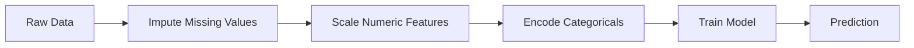
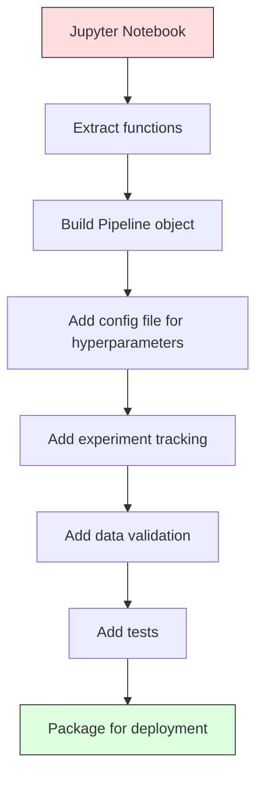

# 机器学习流水线

> 模型不是产品。流水线才是。流水线涵盖从原始数据到已部署预测的所有环节，而且每一步都必须可复现。

**类型:** 构建
**语言:** Python
**先修:** 第 2 阶段，Lesson 12（超参数调优）
**时间:** ~120 分钟

## 学习目标

- 从零构建一个 ML pipeline，把缺失值填补、缩放、编码和模型训练串成一个可复现对象
- 识别数据泄漏场景，并解释 pipelines 如何通过只在训练数据上拟合 transformers 来防止泄漏
- 构造一个 ColumnTransformer，对数值特征和类别特征应用不同的预处理
- 实现 pipeline 序列化，并演示同一个已拟合 pipeline 在训练和生产中会产生一致结果

## 要解决的问题

你有一个 notebook：加载数据，用中位数填补缺失值，缩放特征，训练模型，然后打印 accuracy。它能跑。你把它上线了。

一个月后，有人重新训练模型，却得到了不同的结果。中位数是在包含 test data 的完整数据集上计算的（data leakage）。缩放参数没有保存，所以 inference 使用了不同的统计量。feature engineering 代码在训练和服务之间 copy-paste，两个副本逐渐分叉。某个类别列在生产中出现了一个 encoder 从没见过的新值。

这些都不是假设。它们是 ML 系统在生产中失败的最常见原因。Pipelines 通过把每个 transformation step 打包进一个单一、有序、可复现的对象，解决这些问题。

## 核心概念

### Pipeline 是什么

Pipeline 是一串有序的数据 transformations，最后接一个模型。每一步都会把前一步的输出作为输入。整个 pipeline 在 training data 上拟合一次。到 inference time，同一个已拟合 pipeline 会转换新数据并产出 predictions。



Pipeline 保证：
- Transformations 只在 training data 上拟合（没有 leakage）
- Inference time 会应用同样的 transformations
- 整个对象可以被序列化，并作为一个 artifact 部署
- Cross-validation 会在每个 fold 内应用 pipeline，防止隐蔽的 leakage

### Data Leakage：沉默的杀手

Data leakage 指的是 test set 或 future data 中的信息污染了 training。Pipelines 可以防止最常见的形式。

**会泄漏（错误）：**
```python
X = df.drop("target", axis=1)
y = df["target"]

scaler = StandardScaler()
X_scaled = scaler.fit_transform(X)

X_train, X_test = X_scaled[:800], X_scaled[800:]
y_train, y_test = y[:800], y[800:]
```

Scaler 看到了 test data。mean 和 standard deviation 包含 test samples。这会抬高 accuracy estimates。

**正确：**
```python
X_train, X_test = X[:800], X[800:]

scaler = StandardScaler()
X_train_scaled = scaler.fit_transform(X_train)
X_test_scaled = scaler.transform(X_test)
```

有了 pipeline，你不需要一直想着这件事。Pipeline 会自动处理。

### sklearn Pipeline

sklearn 的 `Pipeline` 会串联 transformers 和一个 estimator。它暴露 `.fit()`、`.predict()` 和 `.score()`，并按顺序应用所有 steps。

```python
from sklearn.pipeline import Pipeline
from sklearn.preprocessing import StandardScaler
from sklearn.linear_model import LogisticRegression

pipe = Pipeline([
    ("scaler", StandardScaler()),
    ("model", LogisticRegression()),
])

pipe.fit(X_train, y_train)
predictions = pipe.predict(X_test)
```

当你调用 `pipe.fit(X_train, y_train)` 时：
1. Scaler 对 X_train 调用 `fit_transform`
2. Model 对缩放后的 X_train 调用 `fit`

当你调用 `pipe.predict(X_test)` 时：
1. Scaler 对 X_test 调用 `transform`（不是 fit_transform）
2. Model 对缩放后的 X_test 调用 `predict`

Scaler 在 fitting 期间永远看不到 test data。这就是全部重点。

### ColumnTransformer：不同列使用不同 Pipelines

真实数据集同时包含数值列和类别列，它们需要不同的 preprocessing。`ColumnTransformer` 就是处理这个问题的。

```python
from sklearn.compose import ColumnTransformer
from sklearn.preprocessing import StandardScaler, OneHotEncoder
from sklearn.impute import SimpleImputer

numeric_pipe = Pipeline([
    ("impute", SimpleImputer(strategy="median")),
    ("scale", StandardScaler()),
])

categorical_pipe = Pipeline([
    ("impute", SimpleImputer(strategy="most_frequent")),
    ("encode", OneHotEncoder(handle_unknown="ignore")),
])

preprocessor = ColumnTransformer([
    ("num", numeric_pipe, ["age", "income", "score"]),
    ("cat", categorical_pipe, ["city", "gender", "plan"]),
])

full_pipeline = Pipeline([
    ("preprocess", preprocessor),
    ("model", GradientBoostingClassifier()),
])
```

OneHotEncoder 里的 `handle_unknown="ignore"` 对生产环境至关重要。当出现新类别（比如一个模型从没见过的城市）时，它会生成一个 zero vector，而不是崩溃。

### Experiment Tracking

Pipeline 让训练可复现，但你还需要跟踪实验之间到底发生了什么：用了哪些 hyperparameters、哪个 dataset version、metrics 是多少、运行的是哪版 code。

**MLflow** 是最常见的开源方案：

```python
import mlflow

with mlflow.start_run():
    mlflow.log_param("max_depth", 5)
    mlflow.log_param("n_estimators", 100)
    mlflow.log_param("learning_rate", 0.1)

    pipe.fit(X_train, y_train)
    accuracy = pipe.score(X_test, y_test)

    mlflow.log_metric("accuracy", accuracy)
    mlflow.sklearn.log_model(pipe, "model")
```

每一次 run 都会记录 parameters、metrics、artifacts 和完整模型。你可以比较 runs、复现任意实验，并部署任意 model version。

**Weights & Biases (wandb)** 通过 hosted dashboard 提供相同功能：

```python
import wandb

wandb.init(project="my-pipeline")
wandb.config.update({"max_depth": 5, "n_estimators": 100})

pipe.fit(X_train, y_train)
accuracy = pipe.score(X_test, y_test)

wandb.log({"accuracy": accuracy})
```

### Model Versioning

Experiment tracking 之后，你还需要管理 model versions。哪个模型在 production？哪个在 staging？上周用的是哪个？

MLflow 的 Model Registry 提供：
- **Version tracking:** 每个保存的模型都会得到一个版本号
- **Stage transitions:** "Staging"、"Production"、"Archived"
- **Approval workflow:** 模型必须被显式提升到 production
- **Rollback:** 立刻切回之前的版本

### 使用 DVC 做 Data Versioning

Code 用 git 做版本控制。Data 也应该做版本控制，但 git 处理不了大文件。DVC（Data Version Control）解决这个问题。

```text
dvc init
dvc add data/training.csv
git add data/training.csv.dvc data/.gitignore
git commit -m "Track training data"
dvc push
```

DVC 把实际数据存进 remote storage（S3、GCS、Azure），并在 git 中保留一个很小的 `.dvc` 文件来记录 hash。当你 checkout 某个 git commit 时，`dvc checkout` 会恢复当时使用的精确数据。

这意味着每个 git commit 都同时固定了 code 和 data。完整可复现。

### Reproducible Experiments

一个可复现实验需要四件事：

1. **Fixed random seeds:** 为 numpy、random 和 framework（torch、sklearn）设置 seeds
2. **Pinned dependencies:** 带有精确版本的 requirements.txt 或 poetry.lock
3. **Versioned data:** DVC 或类似工具
4. **Config files:** 所有 hyperparameters 都放在 config 中，而不是 hardcoded

```python
import numpy as np
import random

def set_seed(seed=42):
    random.seed(seed)
    np.random.seed(seed)
    try:
        import torch
        torch.manual_seed(seed)
        torch.cuda.manual_seed_all(seed)
        torch.backends.cudnn.deterministic = True
    except ImportError:
        pass
```

### 从 Notebook 到 Production Pipeline



典型的推进过程：

1. **Notebook exploration:** 快速实验、可视化、特征想法
2. **Extract functions:** 把 preprocessing、feature engineering、evaluation 移进 modules
3. **Build Pipeline:** 把 transformations 串成 sklearn Pipeline 或自定义 class
4. **Config management:** 把所有 hyperparameters 移进 YAML/JSON config
5. **Experiment tracking:** 添加 MLflow 或 wandb logging
6. **Data validation:** 在 training 前检查 schema、distributions 和 missing value patterns
7. **Tests:** 为 transformers 写 unit tests，为完整 pipeline 写 integration tests
8. **Deployment:** 序列化 pipeline，用 API（FastAPI、Flask）包装，再 containerize

### 常见 Pipeline 错误

| 错误 | 为什么不好 | 修复 |
|---------|-------------|-----|
| 划分前先在完整数据上拟合 | Data leakage | 使用 Pipeline 配合 cross_val_score |
| 在 pipeline 外做 feature engineering | Train 与 serve 的 transforms 不同 | 把所有 transforms 放进 Pipeline |
| 不处理未知类别 | 生产中新值导致崩溃 | OneHotEncoder(handle_unknown="ignore") |
| Hardcoded column names | Schema 变化时会坏掉 | 从 config 使用 column name lists |
| 没有 data validation | 坏数据导致悄悄错误的 predictions | 在 prediction 前添加 schema checks |
| Training/serving skew | Model 在 prod 中看到不同 features | 训练和服务都使用一个 Pipeline object |

## 动手实现

`code/pipeline.py` 中的代码从零构建了一个完整的 ML pipeline：

### Step 1：Custom Transformer

```python
class CustomTransformer:
    def __init__(self):
        self.means = None
        self.stds = None

    def fit(self, X):
        self.means = np.mean(X, axis=0)
        self.stds = np.std(X, axis=0)
        self.stds[self.stds == 0] = 1.0
        return self

    def transform(self, X):
        return (X - self.means) / self.stds

    def fit_transform(self, X):
        return self.fit(X).transform(X)
```

### Step 2：Pipeline from Scratch

```python
class PipelineFromScratch:
    def __init__(self, steps):
        self.steps = steps

    def fit(self, X, y=None):
        X_current = X.copy()
        for name, step in self.steps[:-1]:
            X_current = step.fit_transform(X_current)
        name, model = self.steps[-1]
        model.fit(X_current, y)
        return self

    def predict(self, X):
        X_current = X.copy()
        for name, step in self.steps[:-1]:
            X_current = step.transform(X_current)
        name, model = self.steps[-1]
        return model.predict(X_current)
```

### Step 3：Pipeline 中的 Cross-Validation

代码演示了带 pipeline 的 cross-validation 如何防止 data leakage：scaler 会在每个 fold 的 training data 上分别拟合。

### Step 4：使用 sklearn 的完整 Production Pipeline

一个完整 pipeline，包含 `ColumnTransformer`、多条 preprocessing paths 和一个 model，并使用正确的 cross-validation 与 experiment logging 进行训练。

## 交付成果

本课产出：
- `outputs/prompt-ml-pipeline.md` -- 一个用于构建和调试 ML pipelines 的 skill
- `code/pipeline.py` -- 一个从 scratch pipeline 到 sklearn 的完整 pipeline

## 练习

1. 构建一个 pipeline，处理包含 3 个数值列和 2 个类别列的数据集。使用 `ColumnTransformer` 对数值列应用 median imputation + scaling，对类别列应用 most-frequent imputation + one-hot encoding。使用 5-fold cross-validation 训练。

2. 故意引入 data leakage：在划分前把 scaler 拟合在完整数据集上。比较 cross-validation score（leaky）和 pipeline cross-validation score（clean）。差异有多大？

3. 使用 `joblib.dump` 序列化你的 pipeline。在单独脚本中加载它并运行 predictions。验证 predictions 完全一致。

4. 给 pipeline 添加一个 custom transformer，为两个最重要的数值列创建 polynomial features（degree 2）。它应该放在 pipeline 的哪个位置？

5. 为 pipeline 设置 MLflow tracking。用不同 hyperparameters 运行 5 个实验。使用 MLflow UI（`mlflow ui`）比较 runs，并选择最佳模型。

## 关键术语

| 术语 | 人们常说 | 实际含义 |
|------|----------------|----------------------|
| Pipeline | "Chain of transforms + model" | 一串有序的已拟合 transformers 和一个 model，作为一个整体应用，以防止 leakage |
| Data leakage | "Test info leaked into training" | 使用 training set 之外的信息构建模型，从而抬高 performance estimates |
| ColumnTransformer | "Different preprocessing per column" | 对不同列子集应用不同 pipelines，并合并结果 |
| Experiment tracking | "Logging your runs" | 为每次 training run 记录 parameters、metrics、artifacts 和 code versions |
| MLflow | "Track and deploy models" | 用于 experiment tracking、model registry 和 deployment 的开源平台 |
| DVC | "Git for data" | 面向大数据文件的版本控制系统，在 git 中保存 hashes，在 remote storage 中保存 data |
| Model registry | "Model version catalog" | 用 stage labels（staging、production、archived）跟踪 model versions 的系统 |
| Training/serving skew | "It worked in the notebook" | Training 与 inference 期间 data processing 的差异，会导致静默错误 |
| Reproducibility | "Same code, same result" | 能够用同一份 code、data 和 configuration 得到完全相同的结果 |

## 延伸阅读

- [scikit-learn Pipeline docs](https://scikit-learn.org/stable/modules/compose.html) -- 官方 pipeline reference
- [MLflow documentation](https://mlflow.org/docs/latest/index.html) -- experiment tracking 与 model registry
- [DVC documentation](https://dvc.org/doc) -- data versioning
- [Sculley et al., Hidden Technical Debt in Machine Learning Systems (2015)](https://papers.nips.cc/paper/2015/hash/86df7dcfd896fcaf2674f757a2463eba-Abstract.html) -- 关于 ML systems complexity 的奠基论文
- [Google ML Best Practices: Rules of ML](https://developers.google.com/machine-learning/guides/rules-of-ml) -- 实用的 production ML 建议
