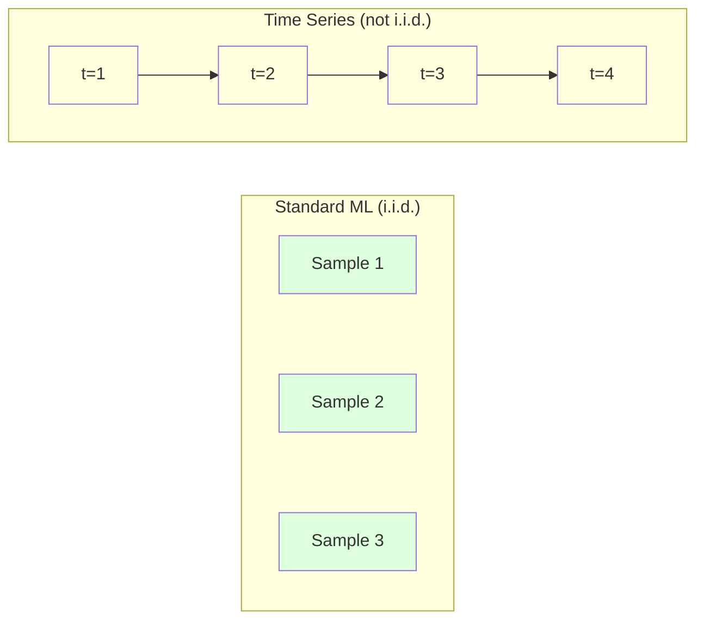
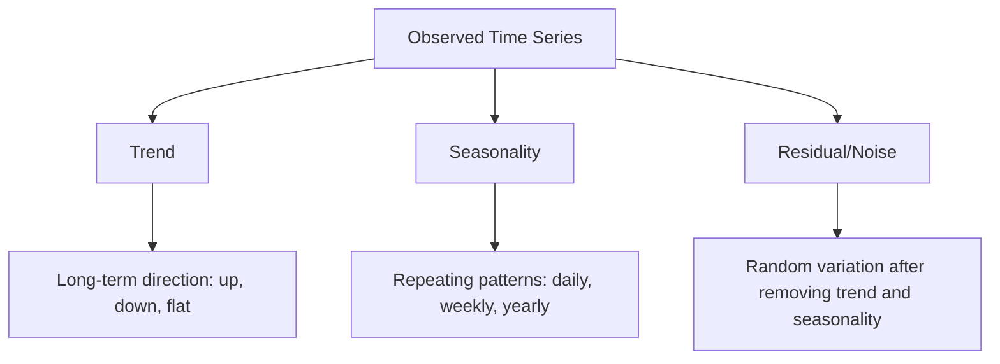
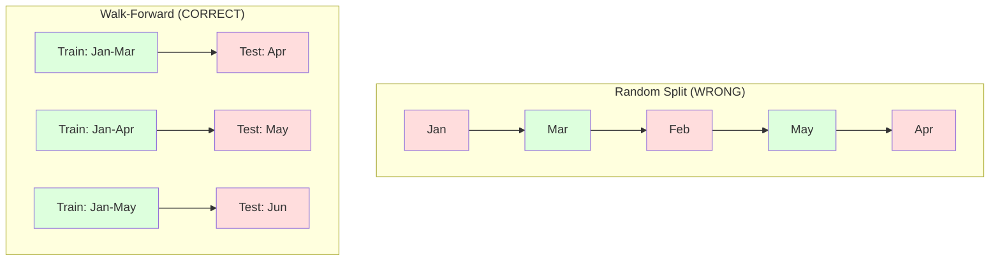

# 时间序列基础

> 过去的表现确实能预测未来结果，前提是你先检查平稳性。

**类型:** 构建
**语言:** Python
**先修:** Phase 2, Lessons 01-09
**时间:** ~90 分钟

## 学习目标

- 将时间序列分解为趋势、季节性和残差成分，并检验平稳性
- 实现滞后特征和滚动统计量，把时间序列转换为监督学习问题
- 构建 walk-forward 验证框架，防止未来数据泄漏到训练中
- 解释为什么随机训练/测试划分对时间序列无效，并展示它与正确时间划分之间的性能差距

## 要解决的问题

你有按时间排序的数据。每日销售额、每小时温度、每分钟 CPU 使用率、每周股价。你想预测下一个值、下一周、下一个季度。

你拿起标准 ML 工具箱：随机训练/测试划分、交叉验证、输入特征矩阵、输出预测。每一步都是错的。

时间序列打破了标准 ML 依赖的假设。样本并不独立，今天的温度依赖昨天的温度。随机划分会把未来信息泄漏到过去。回测里看起来很棒的特征在生产中会失败，因为它们依赖的模式会随时间漂移。

一个用随机交叉验证得到 95% 准确率的模型，在正确的基于时间的评估下可能只有 55%。这种差异不是技术细节。它是纸面上可用的模型与生产中可用的模型之间的差别。

本课覆盖基础：时间数据为什么不同，如何诚实地评估模型，以及如何把时间序列转换为标准 ML 模型可以消费的特征。

## 核心概念

### 时间序列为什么不同

标准 ML 假设 i.i.d.，即独立同分布。每个样本都从同一分布抽取，并且与其他样本相互独立。时间序列同时违反这两点：

- **不独立。** 今天的股价依赖昨天的股价。本周销售额与上周销售额相关。
- **不同分布。** 分布会随时间漂移。12 月的销售看起来不同于 3 月的销售。

这些违反并不轻微。它们会改变你构建特征的方式、评估模型的方式，以及哪些算法有效。



在标准 ML 中，样本可以互换。打乱它们不会改变什么。在时间序列中，顺序就是一切。打乱会破坏信号。

### 时间序列的组成部分

每个时间序列都是以下部分的组合：



- **趋势**：长期方向。收入每年增长 10%。全球气温上升。
- **季节性**：固定间隔上的重复模式。零售销售额在 12 月飙升。空调用量在 7 月达到峰值。
- **残差**：去除趋势和季节性之后剩下的东西。如果残差看起来像白噪声，说明分解捕捉到了信号。

### 平稳性

如果一个时间序列的统计性质（均值、方差、自相关）不会随时间变化，它就是平稳的。大多数预测方法都假设平稳性。

**为什么重要：** 非平稳序列的均值会漂移。用 1 月数据训练的模型学到的均值，与 2 月将出现的均值不同。它会系统性地出错。

**如何检查：** 在窗口上计算滚动均值和滚动标准差。如果它们漂移，序列就是非平稳的。

**如何修复：** 差分。不要建模原始值，而是建模连续值之间的变化：

```text
diff[t] = value[t] - value[t-1]
```

如果一轮差分不能让序列平稳，就再应用一次（二阶差分）。大多数真实世界序列最多需要两轮。

**示例：**

原始序列：[100, 102, 106, 112, 120]
一阶差分： [2, 4, 6, 8]（仍然向上趋势）
二阶差分： [2, 2, 2]（常数，平稳）

原始序列有二次趋势。一阶差分把它变成线性趋势。二阶差分让它变平。在实践中，你很少需要超过两轮差分。

**形式化检验：** Augmented Dickey-Fuller（ADF）检验是平稳性的标准统计检验。零假设是“该序列非平稳”。p-value 低于 0.05 意味着你可以拒绝零假设，并得出平稳的结论。我们不会从零实现 ADF（它需要渐近分布表），但代码中的滚动统计方法给出了实用的可视化检查。

### 自相关

自相关衡量时间 t 的值与时间 t-k 的值（过去 k 步）之间的相关程度。自相关函数（ACF）会为每个 lag k 绘制这种相关性。

**ACF 会告诉你：**
- 序列能“记住”多远。如果 ACF 在 lag 5 之后降到 0，那么超过 5 步之前的值就不重要。
- 是否存在季节性。如果 ACF 在 lag 12（月度数据）出现尖峰，就存在年度季节性。
- 要创建多少个滞后特征。使用 ACF 变得可以忽略之前的 lag。

**PACF（Partial Autocorrelation Function）** 会移除间接相关。如果今天与 3 天前相关，只是因为两者都与昨天相关，那么 lag 3 的 PACF 会是 0，而 lag 3 的 ACF 不会是 0。

### 滞后特征：把时间序列转换为监督学习

标准 ML 模型需要特征矩阵 X 和目标 y。时间序列给你的是一列值。连接两者的桥梁就是滞后特征。

取序列 [10, 12, 14, 13, 15]，创建 lag-1 和 lag-2 特征：

| lag_2 | lag_1 | target |
|-------|-------|--------|
| 10    | 12    | 14     |
| 12    | 14    | 13     |
| 14    | 13    | 15     |

现在你就有了一个标准回归问题。任何 ML 模型（linear regression、random forest、gradient boosting）都可以从这些 lag 中预测 target。

你还可以工程化其他特征：
- **滚动统计量：** 最近 k 个值上的 mean、std、min、max
- **日历特征：** day of week、month、is_holiday、is_weekend
- **差分值：** 相对于前一步的变化
- **扩展统计量：** 累积均值、累积和
- **比例特征：** current value / rolling mean（离近期平均值有多远）
- **交互特征：** lag_1 * day_of_week（工作日对动量的影响）

**多少个 lag？** 使用自相关函数。如果 ACF 到 lag 10 都显著，就至少使用 10 个 lag。如果存在周季节性，包含 lag 7（也可能包含 14）。更多 lag 会给模型更多历史信息，但也会带来更多待拟合特征，从而增加过拟合风险。

**目标对齐陷阱。** 创建滞后特征时，target 必须是时间 t 的值，并且所有 features 必须使用时间 t-1 或更早的值。如果你不小心把时间 t 的值作为 feature 包含进去，你就有了一个完美预测器，以及一个完全没用的模型。这是时间序列特征工程中最常见的 bug。

### Walk-Forward 验证

这是本课最重要的概念。标准 k-fold 交叉验证会把样本随机分配到 train 和 test。对于时间序列，这会泄漏未来信息。



Walk-forward 验证：
1. 在截至时间 t 的数据上训练
2. 预测时间 t+1（或多步预测中的 t+1 到 t+k）
3. 将窗口向前滑动
4. 重复

每个 test fold 只包含所有 training data 之后的数据。没有未来泄漏。这会给出一个诚实估计：模型部署后会如何表现。

**扩展窗口** 使用所有历史数据训练（窗口不断增长）。**滑动窗口** 使用固定大小的训练窗口（窗口向前滑动）。如果你相信旧数据仍然相关，就使用扩展窗口。如果世界在变化、旧数据会造成伤害，就使用滑动窗口。

### ARIMA 直觉

ARIMA 是经典时间序列模型。它有三个组成部分：

- **AR（Autoregressive）：** 从过去的值预测。AR(p) 使用最近 p 个值。
- **I（Integrated）：** 通过差分实现平稳性。I(d) 应用 d 轮差分。
- **MA（Moving Average）：** 从过去的预测误差预测。MA(q) 使用最近 q 个误差。

ARIMA(p, d, q) 组合了这三者。你会基于 ACF/PACF 分析或自动搜索（auto-ARIMA）选择 p、d、q。

我们不会从零实现 ARIMA，因为它需要数值优化，超出了本课范围。关键洞见是理解每个组成部分做什么，这样你才能解释 ARIMA 结果，并知道何时使用它。

### 什么时候使用什么

| Approach | Best For | Handles Seasonality | Handles External Features |
|----------|---------|-------------------|------------------------|
| Lag features + ML | 带有许多外部特征的表格数据 | 通过 calendar features | 是 |
| ARIMA | 单个单变量序列、短期预测 | SARIMA 变体 | 否（ARIMAX 支持有限） |
| Exponential smoothing | 简单趋势 + 季节性 | 是（Holt-Winters） | 否 |
| Prophet | 业务预测、节假日 | 是（Fourier terms） | 有限 |
| Neural networks (LSTM, Transformer) | 长序列、许多序列 | 学习得到 | 是 |

对于大多数实际问题，lag features + gradient boosting 是最强的起点。它自然处理外部特征，不要求平稳性，并且容易调试。

### 预测范围与策略

单步预测会向前预测一个时间步。多步预测会预测多个时间步。有三种策略：

**递归（iterated）：** 向前预测一步，再把这个预测作为下一步的输入。简单，但误差会累积，因为每次预测都使用前一次预测，所以错误会叠加。

**直接（Direct）：** 为每个 horizon 训练一个单独模型。Model-1 预测 t+1，Model-5 预测 t+5。没有误差累积，但每个模型的训练样本更少，而且它们不共享信息。

**多输出（Multi-output）：** 训练一个模型，同时输出所有 horizon。它会跨 horizon 共享信息，但要求模型支持多输出（或自定义 loss function）。

对于大多数实际问题，短 horizon（1-5 步）从递归开始，较长 horizon 从直接策略开始。

### 时间序列中的常见错误

| Mistake | Why it happens | How to fix |
|---------|---------------|-----------|
| 随机训练/测试划分 | 标准 ML 的习惯 | 使用 walk-forward 或时间划分 |
| 使用未来特征 | 错误地包含了时间 t 的特征 | 审计每个特征的时间对齐 |
| 过拟合季节性 | 模型记住了日历模式 | 在测试集中留出完整季节周期 |
| 忽略尺度变化 | 收入翻倍但模式保持 | 建模百分比变化，而不是绝对值 |
| 太多滞后特征 | “更多历史更好” | 使用 ACF 确定相关 lag |
| 不做差分 | “模型会自己搞懂” | 树模型能处理趋势；线性模型需要平稳性 |

## 动手实现

`code/time_series.py` 中的代码从零实现了核心构建块。

### 滞后特征创建器

```python
def make_lag_features(series, n_lags):
    n = len(series)
    X = np.full((n, n_lags), np.nan)
    for lag in range(1, n_lags + 1):
        X[lag:, lag - 1] = series[:-lag]
    valid = ~np.isnan(X).any(axis=1)
    return X[valid], series[valid]
```

这会把一个 1D series 转换为 feature matrix，其中每一行都把最近 `n_lags` 个值作为 features，并把当前值作为 target。

### Walk-Forward 交叉验证

```python
def walk_forward_split(n_samples, n_splits=5, min_train=50):
    assert min_train < n_samples, "min_train must be less than n_samples"
    step = max(1, (n_samples - min_train) // n_splits)
    for i in range(n_splits):
        train_end = min_train + i * step
        test_end = min(train_end + step, n_samples)
        if train_end >= n_samples:
            break
        yield slice(0, train_end), slice(train_end, test_end)
```

每次划分都确保 training data 严格位于 test data 之前。训练窗口会随每个 fold 扩展。

### 简单自回归模型

纯 AR 模型只是滞后特征上的线性回归：

```python
class SimpleAR:
    def __init__(self, n_lags=5):
        self.n_lags = n_lags
        self.weights = None
        self.bias = None

    def fit(self, series):
        X, y = make_lag_features(series, self.n_lags)
        # Solve via normal equations
        X_b = np.column_stack([np.ones(len(X)), X])
        theta = np.linalg.lstsq(X_b, y, rcond=None)[0]
        self.bias = theta[0]
        self.weights = theta[1:]
        return self
```

这在概念上与 Lesson 02 的 linear regression 完全相同，只是应用在同一变量的时间滞后版本上。

### 平稳性检查

代码计算滚动统计量，用可视化和数值方式评估平稳性：

```python
def check_stationarity(series, window=50):
    rolling_mean = np.array([
        series[max(0, i - window):i].mean()
        for i in range(1, len(series) + 1)
    ])
    rolling_std = np.array([
        series[max(0, i - window):i].std()
        for i in range(1, len(series) + 1)
    ])
    return rolling_mean, rolling_std
```

如果 rolling mean 漂移或 rolling std 变化，序列就是非平稳的。应用差分并再次检查。

代码还会通过比较序列前半部分和后半部分来检查平稳性。如果均值差异超过半个标准差，或方差比超过 2x，就会将序列标记为非平稳。

### 自相关

```python
def autocorrelation(series, max_lag=20):
    n = len(series)
    mean = series.mean()
    var = series.var()
    acf = np.zeros(max_lag + 1)
    for k in range(max_lag + 1):
        cov = np.mean((series[:n-k] - mean) * (series[k:] - mean))
        acf[k] = cov / var if var > 0 else 0
    return acf
```

## 实际使用

使用 sklearn 时，你可以把 lag features 直接交给任何 regressor：

```python
from sklearn.linear_model import Ridge
from sklearn.ensemble import GradientBoostingRegressor

X, y = make_lag_features(series, n_lags=10)

for train_idx, test_idx in walk_forward_split(len(X)):
    model = Ridge(alpha=1.0)
    model.fit(X[train_idx], y[train_idx])
    predictions = model.predict(X[test_idx])
```

对于 ARIMA，使用 statsmodels：

```python
from statsmodels.tsa.arima.model import ARIMA

model = ARIMA(train_series, order=(5, 1, 2))
fitted = model.fit()
forecast = fitted.forecast(steps=30)
```

`time_series.py` 中的代码演示了这两种方法，并用 walk-forward 验证比较它们。

### sklearn TimeSeriesSplit

sklearn 提供了 `TimeSeriesSplit`，它实现了 walk-forward 验证：

```python
from sklearn.model_selection import TimeSeriesSplit

tscv = TimeSeriesSplit(n_splits=5)
for train_index, test_index in tscv.split(X):
    X_train, X_test = X[train_index], X[test_index]
    y_train, y_test = y[train_index], y[test_index]
    model.fit(X_train, y_train)
    score = model.score(X_test, y_test)
```

这等价于我们从零实现的 `walk_forward_split`，但集成进了 sklearn 的交叉验证框架。你可以把它与 `cross_val_score` 一起使用：

```python
from sklearn.model_selection import cross_val_score

scores = cross_val_score(model, X, y, cv=TimeSeriesSplit(n_splits=5))
print(f"Mean score: {scores.mean():.4f} +/- {scores.std():.4f}")
```

### 评估指标

时间序列预测使用回归指标，但要带着时间感知的上下文：

- **MAE（Mean Absolute Error）：** |y_true - y_pred| 的平均值。很容易用原始单位解释。“平均来说，预测误差为 3.2 度。”
- **RMSE（Root Mean Squared Error）：** 均方误差的平方根。相比 MAE，会更强地惩罚大误差。当大错误比许多小错误更糟时使用。
- **MAPE（Mean Absolute Percentage Error）：** |error / true_value| * 100 的平均值。与尺度无关，适合比较不同序列。但当 true values 为零时无定义。
- **朴素基线比较：** 永远要与简单基线比较。seasonal naive baseline 会预测上一个周期的值（昨天、上周）。如果你的模型打不过 naive，就说明有问题。

### 滚动特征

代码演示了如何向 lag features 添加 rolling statistics（7 天和 14 天窗口上的 mean、std、min、max）。这些特征会向模型提供近期趋势和波动性信息，而这是单独的 lag features 捕捉不到的。

例如，如果 rolling mean 正在上升，它暗示向上趋势。如果 rolling std 正在增加，它暗示波动性正在增强。这些模式是 tree-based models 可以学习、但 linear models 无法学习的类型。

## 交付成果

本课产出：
- `outputs/prompt-time-series-advisor.md`：用于框定时间序列问题的 prompt
- `code/time_series.py`：lag features、walk-forward validation、AR model、stationarity checks

### 必须击败的基线

在构建任何模型之前，先建立基线：

1. **最后一个值（persistence）。** 预测明天会与今天相同。对许多序列来说，这个基线出人意料地难以击败。
2. **季节性朴素。** 预测今天会与上周同一天（或去年同一天）相同。如果你的模型打不过这个基线，它就没有学到任何超出季节性的有用模式。
3. **移动平均。** 预测最近 k 个值的平均值。它能平滑噪声，但无法捕捉突然变化。

如果你花哨的 ML 模型输给 seasonal naive baseline，你就有 bug。最常见的是：features 中存在未来泄漏、evaluation method 错误，或者该序列真的随机且不可预测。

### 实用提示

1. **从画图开始。** 在建模之前，先绘制原始序列。寻找趋势、季节性、outliers、structural breaks（行为突然变化）。30 秒的可视化检查，往往比 1 小时的自动分析告诉你更多。

2. **先差分，再建模。** 如果序列有明显趋势，在创建 lag features 之前先差分。Tree-based models 可以处理趋势，但 linear models 不能，而且差分通常不会带来坏处。

3. **至少留出一个完整季节周期。** 如果有周季节性，测试集至少需要包含完整一周。如果有月度季节性，至少完整一个月。否则你无法评估模型是否捕捉到了季节模式。

4. **在生产中监控。** 时间序列模型会随着世界变化而退化。滚动跟踪预测误差。当误差开始增加时，用近期数据重新训练模型。

5. **警惕状态切换。** 在疫情前数据上训练的模型，无法预测疫情后的行为。将已知状态切换的指示器作为 features，或使用会遗忘旧数据的 sliding window。

6. **对偏斜序列做 log-transform。** 收入、价格和计数通常右偏。取 log 可以稳定方差，并把乘法模式变成加法模式，从而让 linear models 能处理。在 log space 中预测，再 exponentiate 回到原始单位。

## 练习

1. **平稳性实验。** 生成一个带线性趋势的序列。用滚动统计量检查平稳性。应用一阶差分。再次检查。对于二次趋势，需要几轮差分？

2. **Lag 选择。** 在一个季节性序列（period=7）上计算 ACF。哪些 lag 的自相关最高？只使用那些 lag（而不是连续 lag）创建 lag features。相比使用 lag 1 到 7，准确率是否提升？

3. **Walk-forward vs random split。** 在 lag features 上训练 Ridge regression。分别用随机 80/20 split 和 walk-forward validation 评估。random split 会高估多少性能？

4. **特征工程。** 向 lag features 添加 rolling mean（window=7）、rolling std（window=7）和 day-of-week features。使用 walk-forward validation 比较加入这些额外特征前后的准确率。

5. **多步预测。** 修改 AR model，让它预测未来 5 步，而不是 1 步。比较两种策略：(a) 预测一步，把预测作为下一步输入（recursive）；(b) 为每个 horizon 训练单独模型（direct）。哪一种更准确？

## 关键术语

| Term | What people say | What it actually means |
|------|----------------|----------------------|
| 平稳性 | “统计量不会随时间变化” | 均值、方差和自相关结构随时间保持常数的序列 |
| 差分 | “相邻值相减” | 计算 y[t] - y[t-1]，以移除趋势并实现平稳性 |
| 自相关（ACF） | “序列与自身如何相关” | 时间序列与其滞后副本之间的相关性，是 lag 的函数 |
| 偏自相关（PACF） | “只看直接相关” | 移除所有更短 lag 影响之后，lag k 上的自相关 |
| 滞后特征 | “把过去的值作为输入” | 使用 y[t-1]、y[t-2]、...、y[t-k] 作为 features 来预测 y[t] |
| Walk-forward 验证 | “尊重时间的交叉验证” | training data 在时间顺序上始终早于 test data 的评估方式 |
| ARIMA | “经典时间序列模型” | AutoRegressive Integrated Moving Average：组合过去的值（AR）、差分（I）和过去的误差（MA） |
| 季节性 | “重复日历模式” | 时间序列中与日历周期（日、周、年）绑定的规律、可预测循环 |
| 趋势 | “长期方向” | 序列水平随时间持续上升或下降 |
| 扩展窗口 | “使用全部历史” | 训练集随每个 fold 增长的 walk-forward validation |
| 滑动窗口 | “固定大小历史” | 训练集是固定长度窗口并向前滑动的 walk-forward validation |

## 延伸阅读

- [Hyndman and Athanasopoulos, Forecasting: Principles and Practice (3rd ed.)](https://otexts.com/fpp3/)：最好的免费时间序列预测教材
- [scikit-learn Time Series Split](https://scikit-learn.org/stable/modules/generated/sklearn.model_selection.TimeSeriesSplit.html)：sklearn 的 walk-forward splitter
- [statsmodels ARIMA docs](https://www.statsmodels.org/stable/generated/statsmodels.tsa.arima.model.ARIMA.html)：带 diagnostics 的 ARIMA 实现
- [Makridakis et al., The M5 Competition (2022)](https://www.sciencedirect.com/science/article/pii/S0169207021001874)：大规模预测竞赛，展示 ML methods 与 statistical methods 的对比
