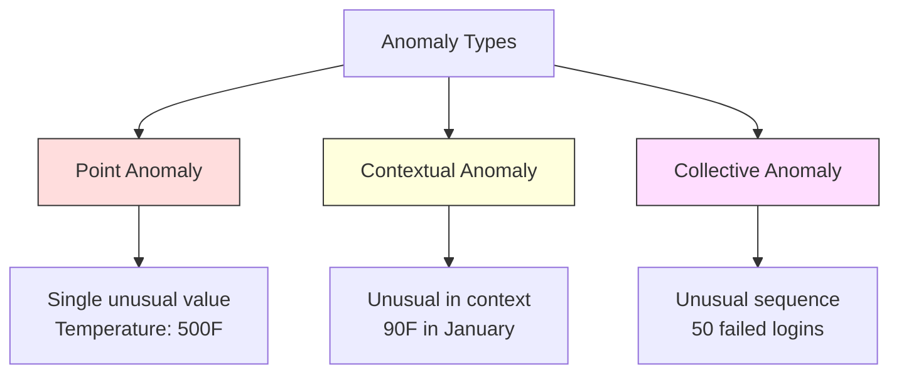
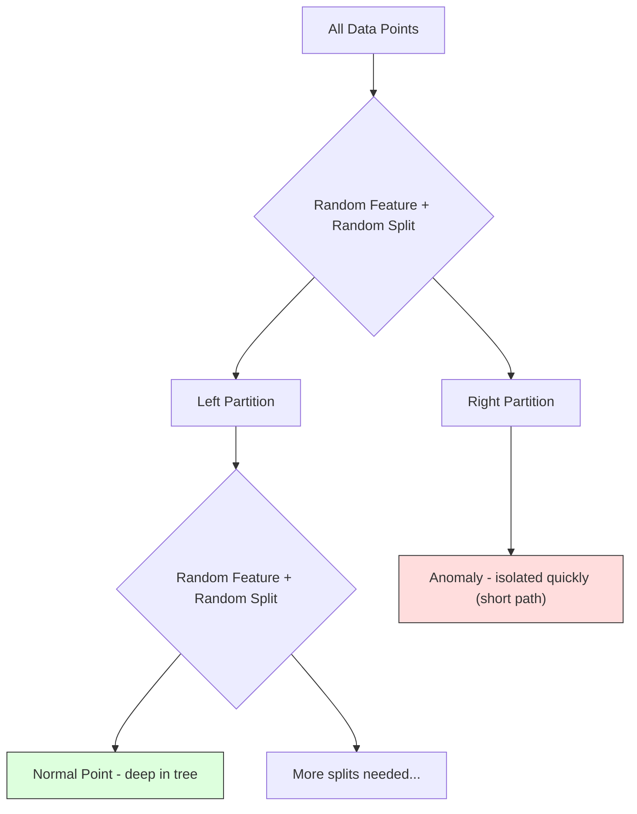
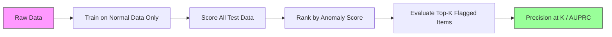

# 异常检测

> 正常很容易定义。异常就是任何不匹配正常模式的东西。

**类型:** 构建
**语言:** Python
**先修:** Phase 2, Lessons 01-09
**时间:** ~75 分钟

## 学习目标

- 从零实现 Z-score、IQR 和 Isolation Forest 异常检测方法
- 区分点异常、上下文异常和集体异常，并为每种异常选择合适的检测方法
- 解释为什么异常检测被表述为对正常数据建模，而不是对异常进行分类
- 比较无监督异常检测与有监督分类，并评估新型异常覆盖率与精确率之间的权衡

## 要解决的问题

一张信用卡下午 2 点在纽约使用，下午 2:05 又在东京使用。工厂传感器在正常范围为 80-120 时读到 150 度。服务器在日均 200 次请求/秒时突然发送 50,000 次请求/秒。

这些都是异常。发现它们很重要。欺诈会造成数十亿美元损失。设备故障会造成停机。网络入侵会造成数据损失。

挑战在于：你很少有带标签的异常样本。欺诈只占交易的 0.1%。设备故障一年只发生几次。你无法训练标准分类器，因为“异常”类别里几乎没有东西可学。即使你有一些标签，你见过的异常也不是未来会遇到的全部类型。明天的欺诈方案会和今天的不一样。

异常检测会反转这个问题。不是学习什么是异常，而是学习什么是正常。任何偏离正常的东西都值得怀疑。这种方式不需要标签，能适应新的异常类型，也能扩展到海量数据集。

## 核心概念

### 异常类型

并非所有异常都一样：

- **点异常。** 单个数据点无论上下文如何都显得不寻常。500 度的温度读数。一个通常花费 $50 的账户突然出现 $50,000 的交易。
- **上下文异常。** 一个数据点在给定上下文下不寻常。90 度在夏天正常，在冬天异常。同一个值，不同上下文。
- **集体异常。** 一组数据点作为整体不寻常，即使其中每个单独点可能都是正常的。五次登录失败是正常的。连续五十次就是暴力破解攻击。

大多数方法检测点异常。上下文异常需要时间或位置特征。集体异常需要感知序列的方法。



### 无监督表述

在标准分类中，你拥有两个类别的标签。在异常检测中，通常会遇到以下三种情况之一：

1. **完全无监督。** 完全没有标签。你在全部数据上拟合检测器，并希望异常足够稀少，不会污染“正常”模型。
2. **半监督。** 你只有一份干净的正常数据集。你在这个干净集合上拟合，然后为其他所有数据打分。如果可行，这是最强的设置。
3. **弱监督。** 你有少量带标签的异常。把它们用于评估，而不是训练。先无监督训练，再在带标签子集上度量 precision/recall。

关键洞见：异常检测从根本上不同于分类。你建模的是正常数据的分布，而不是两个类别之间的决策边界。

### 有监督 vs 无监督：权衡

如果你确实有带标签的异常，应该把它们用于训练（有监督分类），还是只用于评估（无监督检测）？

**有监督（当作分类处理）：**
- 能抓住你之前见过的精确异常类型
- 在已知异常类型上精确率更高
- 会完全漏掉新型异常
- 当新的异常类型出现时需要重新训练
- 需要足够多的异常样本（往往太少）

**无监督（建模正常，标记偏离）：**
- 能抓住任何偏离正常的情况，包括新型异常
- 不需要带标签的异常
- 误报率更高（并非所有不寻常都不好）
- 对分布偏移更稳健

实践中，最好的系统会结合两者：用无监督检测提供广覆盖，用有监督模型处理已知的高优先级异常类型，并把模糊案例交给人工复核。

### Z-Score 方法

最简单的方法。计算每个特征的均值和标准差。标记任何距离均值超过 k 个标准差的点。

```text
z_score = (x - mean) / std
anomaly if |z_score| > threshold
```

默认阈值是 3.0（对 Gaussian 分布而言，99.7% 的正常数据落在 3 个标准差以内）。

**优点：** 简单。快速。可解释（“这个值距离正常水平 4.5 个标准差”）。

**缺点：** 假设数据服从正态分布。对训练数据中的离群值敏感（离群值会移动均值并抬高 std，让它们更难被检测到）。在多峰分布上会失效。

**适合的场景：** 数据大致呈钟形的单特征监控。服务器响应时间、制造公差、基线稳定的传感器读数。

**失效的场景：** 多簇数据（两个办公地点有不同的基准温度）、偏斜数据（交易金额中 $1000 很少见但并不异常）、训练集中含有离群值的数据。

### IQR 方法

比 Z-score 更稳健。使用四分位距，而不是均值和标准差。

```text
Q1 = 25th percentile
Q3 = 75th percentile
IQR = Q3 - Q1
lower_bound = Q1 - factor * IQR
upper_bound = Q3 + factor * IQR
anomaly if x < lower_bound or x > upper_bound
```

默认 factor 是 1.5。

**优点：** 对离群值稳健（百分位数不受极端值影响）。适用于偏斜分布。不假设正态性。

**缺点：** 仅适用于单变量（逐特征独立应用）。无法检测只有在一起考虑特征时才不寻常的异常（一个点可能在每个单独特征上都正常，但在联合空间中异常）。

**实践说明：** IQR 中的 1.5 factor 对应箱线图里的须。落在须外的点是潜在离群值。使用 3.0 而不是 1.5 会让检测器更保守（标记更少，误报更少）。正确的 factor 取决于你对误报的容忍度。

### Isolation Forest

关键洞见：异常既少又不同。在对数据进行随机划分时，异常更容易被隔离出来——它们只需要更少的随机切分就能和其余数据分开。



**工作方式：**
1. 构建许多随机树（一个 isolation forest）
2. 在每个节点上，随机选择一个特征，并在该特征的 min 和 max 之间随机选择一个切分值
3. 持续切分，直到每个点都被隔离（位于自己的叶子中）
4. 异常在所有树上的平均路径长度更短

**为什么有效：** 正常点位于稠密区域。要把其中一个点从邻居中隔离出来，需要很多随机切分。异常位于稀疏区域。一两次随机切分就足以隔离它们。

异常分数基于所有树上的平均路径长度，并用随机二叉搜索树的期望路径长度归一化：

```text
score(x) = 2^(-average_path_length(x) / c(n))
```

其中 `c(n)` 是 n 个样本的期望路径长度。接近 1 的分数表示异常。接近 0.5 的分数表示正常。接近 0 的分数表示非常正常（深处于稠密簇中）。

**优点：** 不做分布假设。适用于高维。扩展性好（由于每棵树使用子样本，随样本量呈亚线性）。能处理混合特征类型。

**缺点：** 难以处理稠密区域中的异常（遮蔽效应）。当许多特征无关时，随机切分效果较差。

**关键超参数：**
- `n_estimators`: 树的数量。100 通常足够。更多树会给出更稳定的分数，但计算更慢。
- `max_samples`: 每棵树的样本数。原始论文默认值是 256。较小的值会让单棵树不那么准确，但会增加多样性。子采样正是 Isolation Forest 快的原因——每棵树只看到数据的一小部分。
- `contamination`: 预期异常比例。只用于设置阈值。不影响分数本身。

### Local Outlier Factor (LOF)

LOF 比较一个点周围的局部密度与其邻居周围的密度。一个位于稀疏区域、且周围是稠密区域的点是异常的。

**工作方式：**
1. 对每个点，找到它的 k 个最近邻
2. 计算局部可达密度（邻域有多密集）
3. 将每个点的密度与其邻居的密度进行比较
4. 如果某个点的密度远低于它的邻居，它就是离群值

**LOF 分数：**
- LOF 接近 1.0 表示密度与邻居相似（正常）
- LOF 大于 1.0 表示密度低于邻居（潜在异常）
- LOF 远大于 1.0（例如 2.0+）表示密度显著更低（很可能异常）

“局部”这部分至关重要。考虑一个有两个簇的数据集：一个含 1000 个点的稠密簇，一个含 50 个点的稀疏簇。稀疏簇边缘的一个点在全局上并不罕见——它有 50 个邻居。但如果它的直接邻居比它更稠密，那么它在局部上是不寻常的。LOF 捕捉到了全局方法会错过的这种细微差别。

**优点：** 检测局部异常（在自身邻域中不寻常的点，即使它们在全局上并不异常）。适用于不同密度的簇。

**缺点：** 在大数据集上较慢（朴素实现为 O(n^2)）。对 k 的选择敏感。在很高维度下效果不好（维度灾难会影响距离计算）。

### 对比

| 方法 | 假设 | 速度 | 处理高维 | 检测局部异常 |
|--------|------------|-------|-------------------|------------------------|
| Z-score | 正态分布 | 非常快 | 是（逐特征） | 否 |
| IQR | 无（逐特征） | 非常快 | 是（逐特征） | 否 |
| Isolation Forest | 无 | 快 | 是 | 部分 |
| LOF | 距离有意义 | 慢 | 较差 | 是 |

### 评估挑战

评估异常检测器比评估分类器更难：

- **极端类别不平衡。** 当异常只有 0.1% 时，把所有东西都预测成“正常”会得到 99.9% accuracy。Accuracy 没有用。
- **AUROC 会误导。** 在严重不平衡下，即使模型在实用阈值处漏掉大多数异常，AUROC 也可能看起来不错。
- **更好的指标：** Precision@k（前 k 个被标记项中，有多少是真异常）、AUPRC（precision-recall 曲线下面积），以及固定 false positive rate 下的 recall。



### 异常检测流水线

实践中，异常检测遵循这个工作流：

1. **收集基线数据。** 理想情况下，这是一段你知道没有（或只有极少）异常的时期。
2. **特征工程。** 原始特征加派生特征（滚动统计、时间特征、比值）。
3. **训练检测器。** 在基线数据上拟合。模型学习“正常”是什么样子。
4. **为新数据打分。** 每个新观测都会得到一个异常分数。
5. **阈值选择。** 选择分数截断点。这是业务决策：更高阈值意味着更少误报，但会漏掉更多异常。
6. **告警和调查。** 被标记的点进入人工复核或自动响应。
7. **收集反馈。** 记录被标记项是真异常还是误报。用这些数据评估检测器，并随时间调优阈值。

这条流水线永远不会“完成”。数据分布会漂移，新的异常类型会出现，阈值也需要调整。把异常检测当作一个活系统，而不是一次性模型。

## 动手实现

`code/anomaly_detection.py` 中的代码从零实现了 Z-score、IQR 和 Isolation Forest。

### Z-Score 检测器

```python
def zscore_detect(X, threshold=3.0):
    mean = X.mean(axis=0)
    std = X.std(axis=0)
    std[std == 0] = 1.0
    z = np.abs((X - mean) / std)
    return z.max(axis=1) > threshold
```

简单且向量化。如果任意特征超过阈值，就标记这个点。

### IQR 检测器

```python
def iqr_detect(X, factor=1.5):
    q1 = np.percentile(X, 25, axis=0)
    q3 = np.percentile(X, 75, axis=0)
    iqr = q3 - q1
    iqr[iqr == 0] = 1.0
    lower = q1 - factor * iqr
    upper = q3 + factor * iqr
    outside = (X < lower) | (X > upper)
    return outside.any(axis=1)
```

### 从零实现 Isolation Forest

从零实现会构建 isolation trees，对特征空间进行随机划分：

```python
class IsolationTree:
    def __init__(self, max_depth):
        self.max_depth = max_depth

    def fit(self, X, depth=0):
        n, p = X.shape
        if depth >= self.max_depth or n <= 1:
            self.is_leaf = True
            self.size = n
            return self
        self.is_leaf = False
        self.feature = np.random.randint(p)
        x_min = X[:, self.feature].min()
        x_max = X[:, self.feature].max()
        if x_min == x_max:
            self.is_leaf = True
            self.size = n
            return self
        self.threshold = np.random.uniform(x_min, x_max)
        left_mask = X[:, self.feature] < self.threshold
        self.left = IsolationTree(self.max_depth).fit(X[left_mask], depth + 1)
        self.right = IsolationTree(self.max_depth).fit(X[~left_mask], depth + 1)
        return self
```

隔离一个点所需的路径长度决定了它的异常分数。路径越短，越异常。

`IsolationForest` 类包装多棵树：

```python
class IsolationForest:
    def __init__(self, n_estimators=100, max_samples=256, seed=42):
        self.n_estimators = n_estimators
        self.max_samples = max_samples

    def fit(self, X):
        sample_size = min(self.max_samples, X.shape[0])
        max_depth = int(np.ceil(np.log2(sample_size)))
        for _ in range(self.n_estimators):
            idx = rng.choice(X.shape[0], size=sample_size, replace=False)
            tree = IsolationTree(max_depth=max_depth)
            tree.fit(X[idx])
            self.trees.append(tree)

    def anomaly_score(self, X):
        avg_path = average path length across all trees
        scores = 2.0 ** (-avg_path / c(max_samples))
        return scores
```

归一化因子 `c(n)` 是含 n 个元素的二叉搜索树中一次失败搜索的期望路径长度。它等于 `2 * H(n-1) - 2*(n-1)/n`，其中 `H` 是调和数。这个归一化确保分数在不同规模的数据集之间可比较。

### 演示场景

代码会生成多个测试场景：

1. **带离群值的单簇。** 一个 2D Gaussian 簇，并在远离中心的位置注入异常。所有方法都应该能在这里工作。
2. **多峰数据。** 三个大小和密度不同的簇。簇之间的点是异常。Z-score 会吃力，因为逐特征范围很宽。
3. **高维数据。** 50 个特征，但异常只在其中 5 个特征上不同。测试方法是否能在特征子集中找到异常。

每个演示都会用 precision、recall、F1 和 Precision@k 比较所有方法。

## 实际使用

使用 sklearn（使用库实现，而不是从零实现）：

```python
from sklearn.ensemble import IsolationForest
from sklearn.neighbors import LocalOutlierFactor

iso = IsolationForest(n_estimators=100, contamination=0.05, random_state=42)
iso.fit(X_train)
predictions = iso.predict(X_test)

lof = LocalOutlierFactor(n_neighbors=20, contamination=0.05, novelty=True)
lof.fit(X_train)
predictions = lof.predict(X_test)
```

注意，`contamination` 设置预期异常比例。正确设置它很重要——太低会漏掉异常，太高会制造误报。

`anomaly_detection.py` 中的代码会在相同数据上比较从零实现与 sklearn。

### sklearn Contamination 参数

sklearn 中的 `contamination` 参数决定把连续异常分数转换成二元预测时使用的阈值。它不会改变底层分数。

```python
iso_5 = IsolationForest(contamination=0.05)
iso_10 = IsolationForest(contamination=0.10)
```

二者产生相同的异常分数。但 `iso_5` 会标记前 5%，而 `iso_10` 会标记前 10%。如果你不知道真实异常率（通常不知道），把 contamination 设为 "auto"，直接使用原始分数。根据 false positives 与 false negatives 之间的成本权衡设置自己的阈值。

### One-Class SVM

另一个值得了解的无监督异常检测器。One-Class SVM 会在高维特征空间中围绕正常数据拟合边界（使用 kernel trick）。

```python
from sklearn.svm import OneClassSVM

oc_svm = OneClassSVM(kernel="rbf", gamma="auto", nu=0.05)
oc_svm.fit(X_train)
predictions = oc_svm.predict(X_test)
```

`nu` 参数近似表示异常比例。One-Class SVM 在中小型数据集上效果不错，但无法扩展到非常大的数据（kernel matrix 会二次增长）。

### Autoencoder 方法（预览）

Autoencoders 是学习压缩并重构数据的神经网络。在正常数据上训练。在测试时，异常会有较高的重构误差，因为网络只学会了重构正常模式。

这会在 Phase 3（Deep Learning）中覆盖，但原则相同：建模正常，标记偏离。

### 集成异常检测

正如集成方法能改进分类（Lesson 11），组合多个异常检测器也能改进检测。最简单的方法：

1. 运行多个检测器（Z-score、IQR、Isolation Forest、LOF）
2. 将每个检测器的分数归一化到 [0, 1]
3. 对归一化后的分数求平均
4. 标记平均分数高于阈值的点

这会减少误报，因为不同方法有不同的失效模式。一个被四种方法都标记的点几乎肯定异常。只被一种方法标记的点可能只是该方法的某种特例。

更复杂的集成会按每个检测器的估计可靠性加权（如果可用，就在含已知异常的验证集上度量）。

### 生产考虑

1. **阈值漂移。** 随着数据分布漂移，固定阈值会过时。监控异常分数的分布，并定期调整。
2. **告警疲劳。** 误报太多时，操作人员会停止关注。先从高阈值开始（更少、更可靠的告警），然后随着信任建立再降低阈值。
3. **集成方法。** 在生产中组合多个检测器。只有当多种方法都认为一个点异常时才标记它。这会显著减少误报。
4. **特征工程。** 原始特征很少足够。加入滚动统计、比值、距上次事件的时间，以及领域特定特征。好的特征集比检测器选择更重要。
5. **反馈循环。** 当操作人员调查被标记项并确认或驳回它们时，把结果反馈到系统中。随时间积累带标签数据，用于评估和改进检测器。

## 交付成果

本课产出：
- `outputs/skill-anomaly-detector.md` -- 用于选择合适检测器的决策 skill
- `code/anomaly_detection.py` -- 从零实现 Z-score、IQR 和 Isolation Forest，并与 sklearn 比较

### 选择阈值

异常分数是连续的。你需要一个阈值来做二元决策。这是业务决策，不是技术决策。

考虑两个场景：
- **欺诈检测。** 漏掉欺诈代价高（拒付、客户信任）。误报会让人工分析师花 5 分钟调查。把阈值设低，以抓住更多欺诈，同时接受更多误报。
- **设备维护。** 一次误报意味着一次不必要停机，成本 $50,000。一次漏检故障意味着 $500,000 的维修。设置阈值来平衡这些成本。

在两种情况下，最优阈值都取决于 false positives 与 false negatives 之间的成本比。绘制不同阈值下的 precision 和 recall，叠加成本函数，并选择成本最低的点。

### 扩展到生产

面向生产中的实时异常检测：

1. **批量训练，在线打分。** 定期（每天、每周）在最近的正常数据上训练模型。每个新观测到达时就为其打分。
2. **特征计算必须匹配。** 如果你用 30 天滚动统计训练，就需要 30 天历史来为新观测计算特征。缓冲所需历史。
3. **分数分布监控。** 跟踪异常分数随时间的分布。如果中位数分数向上漂移，要么数据正在变化，要么模型已经陈旧。
4. **可解释性。** 当你标记一个异常时，要说明原因。Z-score：“特征 X 比正常值高 4.2 个标准差。” Isolation Forest：“这个点平均用 3.1 次切分就被隔离（正常点需要 8.5 次）。”

## 练习

1. **阈值调优。** 用从 1.0 到 5.0、步长 0.5 的阈值运行 Z-score 检测器。绘制每个阈值下的 precision 和 recall。对你的数据来说，甜点在哪里？

2. **多变量异常。** 创建 2D 数据，其中每个特征单独看起来都正常，但组合起来是异常的（例如，远离主簇对角线的点）。展示逐特征 Z-score 会漏掉这些点，但 Isolation Forest 能抓住它们。

3. **从零实现 LOF。** 使用 k-nearest neighbors 实现 Local Outlier Factor。与同一数据上的 sklearn LocalOutlierFactor 比较。使用 k=10 和 k=50——k 的选择如何影响结果？

4. **流式异常检测。** 修改 Z-score 检测器，使其能在流式设置中工作：随着新点到达更新运行中的均值和方差（Welford's online algorithm）。与同一数据上的批量 Z-score 比较。

5. **真实世界评估。** 使用一个带已知异常的数据集（例如 Kaggle 的信用卡欺诈）。用 precision@100、precision@500 和 AUPRC 评估全部四种方法。哪种方法效果最好？为什么？

## 关键术语

| 术语 | 人们常说 | 实际含义 |
|------|----------------|----------------------|
| 异常 | “离群值，不寻常的点” | 显著偏离正常数据预期模式的数据点 |
| 点异常 | “单个奇怪值” | 一个无论上下文如何都不寻常的单独观测 |
| 上下文异常 | “正常值，错误上下文” | 在给定上下文（时间、位置等）下不寻常，但在另一个上下文中可能正常的观测 |
| Isolation Forest | “随机切分找离群值” | 随机树的集成，用比正常点更少的切分隔离异常 |
| Local Outlier Factor | “把密度和邻居比较” | 标记局部密度远低于邻居密度的点的方法 |
| Z-score | “距离均值几个标准差” | (x - mean) / std，用标准差单位度量一个点离中心有多远 |
| IQR | “四分位距” | Q3 - Q1，度量数据中间 50% 的跨度，用于稳健离群值检测 |
| Contamination | “预期异常比例” | 告诉检测器应将数据中多大比例标记为异常的超参数 |
| Precision@k | “前 k 个标记中有多少是真的” | 只在最可疑的 k 个点上计算的 precision，适用于不平衡异常检测 |
| AUPRC | “precision-recall 曲线下面积” | 汇总所有阈值下 precision-recall 表现的指标，在不平衡数据上优于 AUROC |

## 延伸阅读

- [Liu et al., Isolation Forest (2008)](https://cs.nju.edu.cn/zhouzh/zhouzh.files/publication/icdm08b.pdf) -- 原始 Isolation Forest 论文
- [Breunig et al., LOF: Identifying Density-Based Local Outliers (2000)](https://dl.acm.org/doi/10.1145/342009.335388) -- 原始 LOF 论文
- [scikit-learn Outlier Detection docs](https://scikit-learn.org/stable/modules/outlier_detection.html) -- 全部 sklearn 异常检测器概览
- [Chandola et al., Anomaly Detection: A Survey (2009)](https://dl.acm.org/doi/10.1145/1541880.1541882) -- 异常检测方法的综合综述
- [Goldstein and Uchida, A Comparative Evaluation of Unsupervised Anomaly Detection Algorithms (2016)](https://journals.plos.org/plosone/article?id=10.1371/journal.pone.0152173) -- 在真实数据集上对 10 种方法的实证比较
