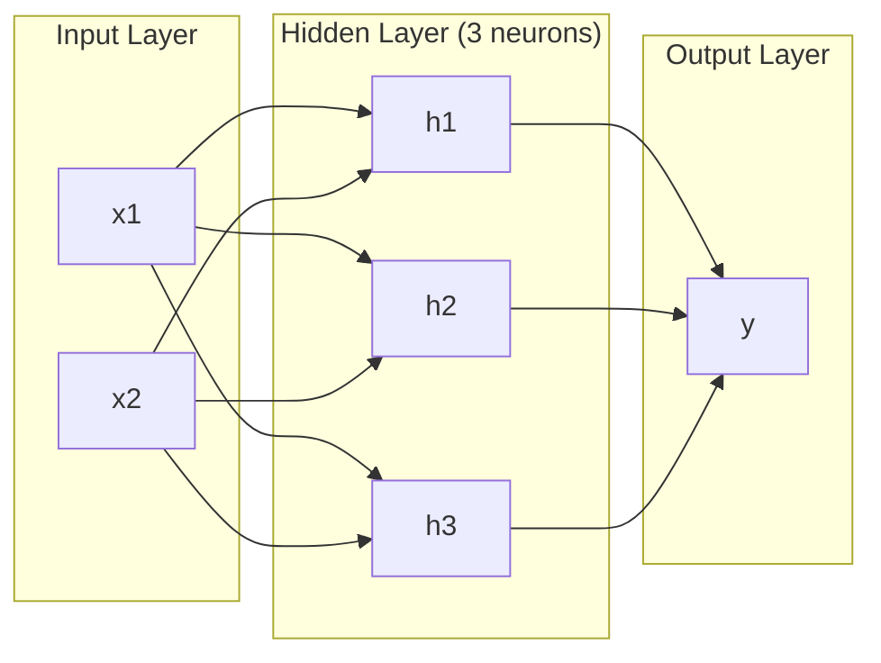
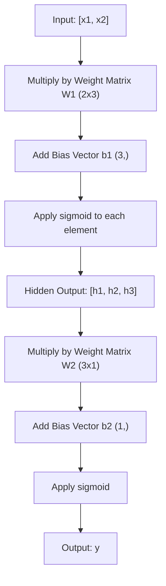
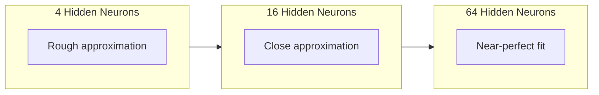

# 多层网络与前向传播

> 一个神经元画一条线。把它们堆起来，你就能画出任何形状。

**类型:** Build
**语言:** Python
**先修:** 第 01 阶段（数学基础），Lesson 03.01（The Perceptron）
**时间:** ~90 分钟

## 学习目标

- 用 Layer 和 Network 类从零构建多层网络，完成一次完整的前向传播
- 跟踪网络每一层中的矩阵维度，并识别 shape 不匹配问题
- 解释堆叠非线性激活如何让网络学习弯曲的决策边界
- 使用 2-2-1 架构和手工调好的 sigmoid 权重解决 XOR 问题

## 要解决的问题

单个神经元就是画线器。仅此而已。它在你的数据中画一条直线。AI 中的每个真实问题——图像识别、语言理解、下围棋——都需要曲线。把神经元堆叠成层，就是获得曲线的方法。

1969 年，Minsky 和 Papert 证明这个限制是致命的：单层网络无法学习 XOR。不是“很难学”——而是数学上不可能。XOR 真值表把 [0,1] 和 [1,0] 放在一边，把 [0,0] 和 [1,1] 放在另一边。没有单条直线可以分离它们。

这让神经网络经费沉寂了十多年。事后看来，修复方法很明显：不要只用一层。把神经元堆成层。让第一层把输入空间切分成新特征，再让第二层把这些特征组合成任何单条直线都无法做出的决策。

这个堆叠就是多层网络。它是今天生产环境中每个深度学习模型的基础。前向传播——数据从输入流经隐藏层再到输出——是在其他一切能工作之前，你首先需要构建的东西。

## 核心概念

### 层：输入、隐藏、输出

多层网络有三类层：

**输入层** -- 严格说并不是真正的一层。它保存原始数据。两个特征意味着两个输入节点。这里不发生计算。

**隐藏层** -- 真正工作发生的地方。每个神经元接收上一层的每个输出，应用权重和偏置，然后把结果传入激活函数。之所以叫“隐藏”，是因为你在训练数据中不会直接看到这些值。

**输出层** -- 最终答案。二分类时通常是一个带 sigmoid 的神经元。多分类时通常是每个类别一个神经元。



这是一个 2-3-1 网络。两个输入、三个隐藏神经元、一个输出。每条连接都携带一个权重。每个神经元（输入除外）都携带一个偏置。

每一层都会产生一个数字向量，叫做隐藏状态。对文本来说，隐藏状态会提高维度——把一个词编码成 768 个数字来捕捉语义意义。对图像来说，它们会降低维度——把数百万像素压缩成可管理的表示。隐藏状态就是学习发生的地方。

### 神经元与激活

每个神经元做三件事：

1. 将每个输入乘以对应权重
2. 把所有乘积求和，并加上偏置
3. 把这个和传入激活函数

目前，激活函数是 sigmoid：

```text
sigmoid(z) = 1 / (1 + e^(-z))
```

Sigmoid 会把任意数字压缩到 (0, 1) 范围内。很大的正输入会推向 1。很大的负输入会推向 0。零会映射到 0.5。这条平滑曲线让学习成为可能——不同于感知机的硬阶跃，sigmoid 处处都有梯度。

### 前向传播：数据如何流动

前向传播会把输入数据逐层推过网络，直到到达输出。前向传播期间不会发生学习。它只是纯计算：乘法、加法、激活，重复。



在每一层，都会按顺序发生三个操作：

```text
z = W * input + b       (linear transformation)
a = sigmoid(z)           (activation)
```

一层的输出会成为下一层的输入。这就是完整的前向传播。

### 矩阵维度

跟踪维度是深度学习中最重要的调试技能。下面是 2-3-1 网络：

| 步骤 | 操作 | 维度 | 结果 Shape |
|------|-----------|------------|-------------|
| 输入 | x | -- | (2,) |
| 隐藏层线性变换 | W1 * x + b1 | W1: (3, 2), b1: (3,) | (3,) |
| 隐藏层激活 | sigmoid(z1) | -- | (3,) |
| 输出层线性变换 | W2 * h + b2 | W2: (1, 3), b2: (1,) | (1,) |
| 输出层激活 | sigmoid(z2) | -- | (1,) |

规则是：第 k 层的权重矩阵 W 的 shape 是 (neurons_in_layer_k, neurons_in_layer_k_minus_1)。行对应当前层。列对应上一层。如果 shape 对不上，你就有 bug。

### 通用近似定理

1989 年，George Cybenko 证明了一件很了不起的事：一个拥有单个隐藏层且神经元足够多的神经网络，可以以任意想要的精度近似任意连续函数。

这并不意味着一个隐藏层总是最好。它意味着这种架构在理论上有能力做到。实践中，更深的网络（更多层、每层更少神经元）可以用远少于浅而宽网络的总参数量学到同样的函数。这就是深度学习能够工作的原因。

直觉是：隐藏层中的每个神经元学习一个“凸起”或特征。足够多的凸起放在正确位置，就可以近似任何平滑曲线。神经元越多，凸起越多，近似越好。



### 可组合性

神经网络是可组合的。你可以堆叠它们、串联它们、并行运行它们。Whisper 模型使用一个 encoder network 来处理音频，再用一个独立的 decoder network 生成文本。现代 LLM 是 decoder-only。BERT 是 encoder-only。T5 是 encoder-decoder。架构选择定义了模型能做什么。

## 动手实现

纯 Python。没有 numpy。每个矩阵操作都从零编写。

### 第 1 步：Sigmoid 激活

```python
import math

def sigmoid(x):
    x = max(-500.0, min(500.0, x))
    return 1.0 / (1.0 + math.exp(-x))
```

夹到 [-500, 500] 可以防止溢出。`math.exp(500)` 很大，但仍然有限。`math.exp(1000)` 会是 infinity。

### 第 2 步：Layer 类

所有深度学习里最重要的操作是矩阵乘法。每一层、每个 attention head、每次 forward pass——一路到底都是 matmul。线性层接收一个输入向量，把它乘以权重矩阵，再加上偏置向量：y = Wx + b。这个单一方程就是神经网络中 90% 的计算。

一层保存一个权重矩阵和一个偏置向量。它的 forward 方法接收一个输入向量，并返回激活后的输出。

```python
class Layer:
    def __init__(self, n_inputs, n_neurons, weights=None, biases=None):
        if weights is not None:
            self.weights = weights
        else:
            import random
            self.weights = [
                [random.uniform(-1, 1) for _ in range(n_inputs)]
                for _ in range(n_neurons)
            ]
        if biases is not None:
            self.biases = biases
        else:
            self.biases = [0.0] * n_neurons

    def forward(self, inputs):
        self.last_input = inputs
        self.last_output = []
        for neuron_idx in range(len(self.weights)):
            z = sum(
                w * x for w, x in zip(self.weights[neuron_idx], inputs)
            )
            z += self.biases[neuron_idx]
            self.last_output.append(sigmoid(z))
        return self.last_output
```

权重矩阵的 shape 是 (n_neurons, n_inputs)。每一行都是一个神经元在所有输入上的权重。forward 方法遍历神经元，计算加权和加偏置，应用 sigmoid，并收集结果。

### 第 3 步：Network 类

网络就是一组层。前向传播把它们串起来：第 k 层的输出送入第 k+1 层。

```python
class Network:
    def __init__(self, layers):
        self.layers = layers

    def forward(self, inputs):
        current = inputs
        for layer in self.layers:
            current = layer.forward(current)
        return current
```

这就是完整的前向传播。四行逻辑。数据进入，流过每一层，再从另一端出来。

### 第 4 步：用手工调好的权重做 XOR

在第 01 课中，我们通过组合 OR、NAND 和 AND 感知机解决了 XOR。现在用我们的 Layer 和 Network 类做同样的事。2-2-1 架构：两个输入、两个隐藏神经元、一个输出。

```python
hidden = Layer(
    n_inputs=2,
    n_neurons=2,
    weights=[[20.0, 20.0], [-20.0, -20.0]],
    biases=[-10.0, 30.0],
)

output = Layer(
    n_inputs=2,
    n_neurons=1,
    weights=[[20.0, 20.0]],
    biases=[-30.0],
)

xor_net = Network([hidden, output])

xor_data = [
    ([0, 0], 0),
    ([0, 1], 1),
    ([1, 0], 1),
    ([1, 1], 0),
]

for inputs, expected in xor_data:
    result = xor_net.forward(inputs)
    predicted = 1 if result[0] >= 0.5 else 0
    print(f"  {inputs} -> {result[0]:.6f} (rounded: {predicted}, expected: {expected})")
```

较大的权重（20、-20）会让 sigmoid 表现得像阶跃函数。第一个隐藏神经元近似 OR。第二个近似 NAND。输出神经元把它们组合成 AND，也就是 XOR。

### 第 5 步：圆形分类

一个更难的问题：把 2D 点分类为位于以原点为中心、半径为 0.5 的圆内或圆外。这需要弯曲决策边界——单个感知机不可能做到。

```python
import random
import math

random.seed(42)

data = []
for _ in range(200):
    x = random.uniform(-1, 1)
    y = random.uniform(-1, 1)
    label = 1 if (x * x + y * y) < 0.25 else 0
    data.append(([x, y], label))

circle_net = Network([
    Layer(n_inputs=2, n_neurons=8),
    Layer(n_inputs=8, n_neurons=1),
])
```

使用随机权重时，网络不会分类得很好。但前向传播仍然会运行。这就是重点——前向传播只是计算。学习正确权重是反向传播，它会在第 03 课出现。

```python
correct = 0
for inputs, expected in data:
    result = circle_net.forward(inputs)
    predicted = 1 if result[0] >= 0.5 else 0
    if predicted == expected:
        correct += 1

print(f"Accuracy with random weights: {correct}/{len(data)} ({100*correct/len(data):.1f}%)")
```

随机权重会给出很差的准确率——经常比猜多数类还差。训练之后（第 03 课），同样这个有 8 个隐藏神经元的架构，会画出一条弯曲边界，把圆内和圆外分开。

## 实际使用

PyTorch 用四行完成上面的一切：

```python
import torch
import torch.nn as nn

model = nn.Sequential(
    nn.Linear(2, 8),
    nn.Sigmoid(),
    nn.Linear(8, 1),
    nn.Sigmoid(),
)

x = torch.tensor([[0.0, 0.0], [0.0, 1.0], [1.0, 0.0], [1.0, 1.0]])
output = model(x)
print(output)
```

`nn.Linear(2, 8)` 就是你的 Layer 类：shape 为 (8, 2) 的权重矩阵，以及 shape 为 (8,) 的偏置向量。`nn.Sigmoid()` 就是你的 sigmoid 函数，逐元素应用。`nn.Sequential` 就是你的 Network 类：按顺序串联层。

差异在速度和规模上。PyTorch 可以在 GPU 上运行，处理数百万样本的 batch，并自动计算反向传播所需的梯度。但前向传播逻辑与你刚刚从零构建的完全相同。

## 交付成果

本课产出一个可复用的网络架构设计 prompt：

- `outputs/prompt-network-architect.md`

当你需要为给定问题决定用多少层、每层多少神经元，以及使用哪些激活函数时，可以使用它。

## 练习

1. 构建一个 2-4-2-1 网络（两个隐藏层），并在 XOR 数据上用随机权重运行前向传播。打印中间隐藏层输出，观察表示如何在每一层中变换。

2. 在圆形分类器中把隐藏层大小从 8 改成 2，再改成 32。每次都用随机权重运行前向传播。隐藏神经元数量会改变输出范围或分布吗？为什么？

3. 在 Network 类上实现一个 `count_parameters` 方法，返回可训练权重和偏置的总数。用一个 784-256-128-10 网络（经典 MNIST 架构）测试它。它有多少参数？

4. 为一个 3-4-4-2 网络构建前向传播。向它输入 RGB 颜色值（归一化到 0-1），并观察两个输出。这是一个简单二分类颜色分类器的架构。

5. 用“leaky step”函数替换 sigmoid：如果 z < 0，返回 0.01 * z，否则返回 1.0。使用第 4 步相同的手工调权权重，在 XOR 上运行前向传播。它还能工作吗？为什么平滑 sigmoid 比硬阈值更受偏爱？

## 关键术语

| 术语 | 人们常说 | 它实际意味着什么 |
|------|----------------|----------------------|
| Forward pass | “运行模型” | 将输入推过每一层——乘以权重、加上偏置、激活——以产生输出 |
| Hidden layer | “中间部分” | 输入和输出之间的任何层，其值不会在数据中被直接观测到 |
| Multi-layer network | “一个深度神经网络” | 按顺序堆叠的神经元层，每层输出都会馈入下一层输入 |
| Activation function | “非线性” | 在线性变换之后应用的函数，会把曲线引入决策边界 |
| Sigmoid | “S 曲线” | sigma(z) = 1/(1+e^(-z))，把任意实数压缩到 (0,1)，处处平滑且可微 |
| Weight matrix | “参数” | shape 为 (current_layer_neurons, previous_layer_neurons) 的矩阵 W，包含可学习连接强度 |
| Bias vector | “偏移量” | 矩阵乘法之后加上的向量，让神经元即使在所有输入为零时也可以激活 |
| Universal approximation | “神经网络能学会任何东西” | 一个拥有足够神经元的单隐藏层可以近似任意连续函数——但“足够”可能意味着数十亿 |
| Linear transformation | “矩阵乘法步骤” | z = W * x + b，激活前的计算，会把输入映射到新的空间 |
| Decision boundary | “分类器切换的位置” | 输入空间中网络输出跨过分类阈值的那个曲面 |

## 延伸阅读

- Michael Nielsen, "Neural Networks and Deep Learning", Chapter 1-2 (http://neuralnetworksanddeeplearning.com/) -- 关于前向传播和网络结构最清晰的免费解释，包含交互式可视化
- Cybenko, "Approximation by Superpositions of a Sigmoidal Function" (1989) -- 通用近似定理的原始论文，意外地可读
- 3Blue1Brown, "But what is a neural network?" (https://www.youtube.com/watch?v=aircAruvnKk) -- 20 分钟可视化讲解层、权重和前向传播，帮你建立正确心智模型
- Goodfellow, Bengio, Courville, "Deep Learning", Chapter 6 (https://www.deeplearningbook.org/) -- 多层网络的标准参考，免费在线
