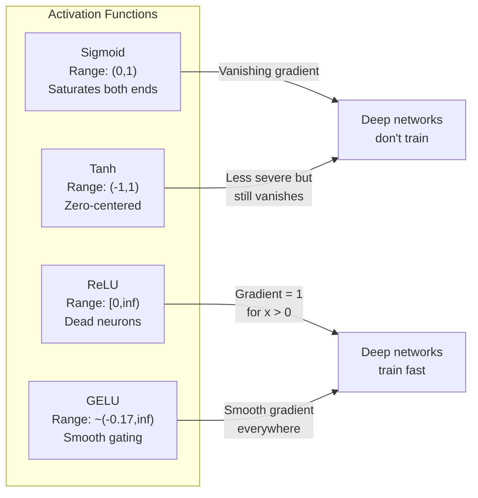
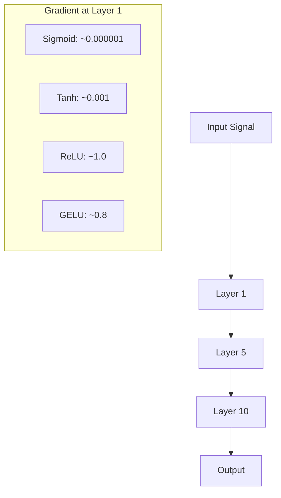
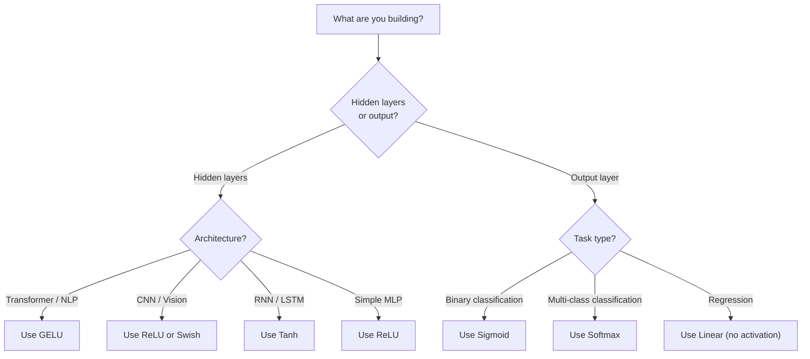

# 激活函数

> 没有非线性，你的 100 层网络只是一个花哨的矩阵乘法。激活函数是让神经网络用曲线思考的门。

**类型:** Build
**语言:** Python
**先修:** Lesson 03.03（Backpropagation）
**时间:** ~75 分钟

## 学习目标

- 从零实现 sigmoid、tanh、ReLU、Leaky ReLU、GELU、Swish 和 softmax，以及它们的导数
- 通过测量不同激活函数在 10+ 层中的激活幅度，诊断梯度消失问题
- 在 ReLU 网络中检测 dead neurons，并解释为什么 GELU 能避免这种失败模式
- 为给定架构（transformer、CNN、RNN、输出层）选择正确的激活函数

## 要解决的问题

堆叠两个线性变换：y = W2(W1x + b1) + b2。展开它：y = W2W1x + W2b1 + b2。这只是 y = Ax + c——一个单独的线性变换。不管你堆叠多少线性层，结果都会坍缩成一次矩阵乘法。你的 100 层网络与单层网络具有相同的表示能力。

这不是理论上的小趣味。它意味着深度线性网络真的不能学习 XOR，不能分类螺旋数据集，不能识别人脸。没有激活函数，深度就是幻觉。

激活函数打破线性。它们通过非线性函数扭曲每一层的输出，让网络有能力弯曲决策边界、近似任意函数，并真正学习。但如果选错激活函数，你的梯度会消失到零（深层网络中的 sigmoid），爆炸到 infinity（没有仔细初始化的无界激活），或者神经元永久死亡（带有很大负偏置的 ReLU）。激活函数的选择会直接决定你的网络到底能不能学。

## 核心概念

### 为什么非线性是必要的

矩阵乘法是可组合的。先把向量乘以矩阵 A，再乘以矩阵 B，等价于乘以 AB。这意味着堆叠十个线性层，在数学上等价于一个带大矩阵的线性层。所有这些参数，所有这些深度——都浪费了。你需要某种东西打断这条链。这就是激活函数的作用。

证明如下。线性层计算 f(x) = Wx + b。堆叠两个：

```text
Layer 1: h = W1 * x + b1
Layer 2: y = W2 * h + b2
```

代入：

```text
y = W2 * (W1 * x + b1) + b2
y = (W2 * W1) * x + (W2 * b1 + b2)
y = A * x + c
```

一层。在线性层之间插入一个非线性激活 g()：

```text
h = g(W1 * x + b1)
y = W2 * h + b2
```

现在代入断掉了。W2 * g(W1 * x + b1) + b2 不能被化简成一个单独的线性变换。网络可以表示非线性函数。每个带激活函数的额外层都会增加表示能力。

### Sigmoid

神经网络最早使用的激活函数。

```text
sigmoid(x) = 1 / (1 + e^(-x))
```

输出范围：(0, 1)。平滑、可微，把任意实数映射到类似概率的值。

导数：

```text
sigmoid'(x) = sigmoid(x) * (1 - sigmoid(x))
```

这个导数的最大值是 0.25，出现在 x = 0。在反向传播中，梯度会逐层相乘。十层 sigmoid 意味着梯度最多会被乘以 0.25 十次：

```text
0.25^10 = 0.000000953674
```

不到原始信号的百万分之一。这就是梯度消失问题。早期层中的梯度变得太小，权重几乎不更新。网络看起来在学习——后面层的 loss 会下降——但最前面的层被冻结了。深层 sigmoid 网络根本训练不起来。

另一个问题：sigmoid 输出始终为正（0 到 1），这意味着权重上的梯度总是同号。这会导致梯度下降期间出现之字形震荡。

### Tanh

Sigmoid 的居中版本。

```text
tanh(x) = (e^x - e^(-x)) / (e^x + e^(-x))
```

输出范围：(-1, 1)。以零为中心，因此消除了之字形问题。

导数：

```text
tanh'(x) = 1 - tanh(x)^2
```

最大导数在 x = 0 时为 1.0——比 sigmoid 好四倍。但梯度消失问题仍然存在。对很大的正输入或负输入，导数都会接近零。十层之后仍然会压碎梯度，只是没那么激进。

### ReLU：突破点

Rectified Linear Unit。Nair 和 Hinton 在 2010 年让它在深度学习中流行起来（这个函数本身可以追溯到 Fukushima 1969 年的工作），它改变了一切。

```text
relu(x) = max(0, x)
```

输出范围：[0, infinity)。导数极其简单：

```text
relu'(x) = 1  if x > 0
            0  if x <= 0
```

对正输入没有梯度消失。梯度正好是 1，直接传过去。这就是深层网络变得可训练的原因——ReLU 在层与层之间保留梯度幅度。

但它有一种失败模式：dead neuron 问题。如果某个神经元的加权输入始终为负（由于很大的负偏置或不幸的权重初始化），它的输出永远为零，梯度永远为零，也就永远不会更新。它永久死亡了。实践中，ReLU 网络中 10-40% 的神经元可能会在训练期间死亡。

### Leaky ReLU

修复 dead neurons 的最简单方法。

```text
leaky_relu(x) = x        if x > 0
                alpha * x if x <= 0
```

其中 alpha 是一个小常数，通常为 0.01。负半轴有一个小斜率，而不是零，因此 dead neurons 仍然能得到梯度信号并恢复。

### GELU：现代默认选择

Gaussian Error Linear Unit。Hendrycks 和 Gimpel 于 2016 年提出。它是 BERT、GPT 和大多数现代 transformers 的默认激活函数。

```text
gelu(x) = x * Phi(x)
```

其中 Phi(x) 是标准正态分布的累积分布函数。实践中使用的近似：

```text
gelu(x) ~= 0.5 * x * (1 + tanh(sqrt(2/pi) * (x + 0.044715 * x^3)))
```

GELU 处处平滑，允许小的负值（不像 ReLU 那样硬裁剪到零），并且有概率解释：它会根据输入在高斯分布下为正的概率，对每个输入加权。这种平滑 gating 在 transformer 架构中优于 ReLU，因为它提供更好的梯度流，并完全避免 dead neuron 问题。

### Swish / SiLU

Ramachandran 等人在 2017 年通过自动搜索发现的自门控激活。

```text
swish(x) = x * sigmoid(x)
```

Swish 的形式就是 x * sigmoid(x)。Google 通过对激活函数空间进行自动搜索发现了它——一个神经网络在设计神经网络的一部分。

与 GELU 一样，它平滑、非单调，并允许小的负值。差异很细微：Swish 使用 sigmoid 做 gating，而 GELU 使用高斯 CDF。实践中，性能几乎相同。Swish 用于 EfficientNet 和一些视觉模型。GELU 则主导语言模型。

### Softmax：输出激活

不用于隐藏层。Softmax 会把一个原始分数（logits）向量转换成概率分布。

```text
softmax(x_i) = e^(x_i) / sum(e^(x_j) for all j)
```

每个输出都在 0 和 1 之间。所有输出加起来等于 1。这让它成为多分类任务的标准最终激活。最大的 logit 会得到最高概率，但不同于 argmax，softmax 是可微的，并会保留相对置信度信息。

### 形状对比



### 梯度流对比



### 什么时候用哪种激活



## 动手实现

### 第 1 步：实现所有激活函数及其导数

每个函数接收一个 float 并返回一个 float。每个导数函数接收相同输入，并返回梯度。

```python
import math

def sigmoid(x):
    x = max(-500, min(500, x))
    return 1.0 / (1.0 + math.exp(-x))

def sigmoid_derivative(x):
    s = sigmoid(x)
    return s * (1 - s)

def tanh_act(x):
    return math.tanh(x)

def tanh_derivative(x):
    t = math.tanh(x)
    return 1 - t * t

def relu(x):
    return max(0.0, x)

def relu_derivative(x):
    return 1.0 if x > 0 else 0.0

def leaky_relu(x, alpha=0.01):
    return x if x > 0 else alpha * x

def leaky_relu_derivative(x, alpha=0.01):
    return 1.0 if x > 0 else alpha

def gelu(x):
    return 0.5 * x * (1 + math.tanh(math.sqrt(2 / math.pi) * (x + 0.044715 * x ** 3)))

def gelu_derivative(x):
    phi = 0.5 * (1 + math.erf(x / math.sqrt(2)))
    pdf = math.exp(-0.5 * x * x) / math.sqrt(2 * math.pi)
    return phi + x * pdf

def swish(x):
    return x * sigmoid(x)

def swish_derivative(x):
    s = sigmoid(x)
    return s + x * s * (1 - s)

def softmax(xs):
    max_x = max(xs)
    exps = [math.exp(x - max_x) for x in xs]
    total = sum(exps)
    return [e / total for e in exps]
```

### 第 2 步：可视化梯度在哪里死亡

计算从 -5 到 5 的 100 个等距点上的梯度。打印一个文本直方图，展示每种激活函数的梯度在哪里接近零。

```python
def gradient_scan(name, derivative_fn, start=-5, end=5, n=100):
    step = (end - start) / n
    near_zero = 0
    healthy = 0
    for i in range(n):
        x = start + i * step
        g = derivative_fn(x)
        if abs(g) < 0.01:
            near_zero += 1
        else:
            healthy += 1
    pct_dead = near_zero / n * 100
    print(f"{name:15s}: {healthy:3d} healthy, {near_zero:3d} near-zero ({pct_dead:.0f}% dead zone)")

gradient_scan("Sigmoid", sigmoid_derivative)
gradient_scan("Tanh", tanh_derivative)
gradient_scan("ReLU", relu_derivative)
gradient_scan("Leaky ReLU", leaky_relu_derivative)
gradient_scan("GELU", gelu_derivative)
gradient_scan("Swish", swish_derivative)
```

### 第 3 步：梯度消失实验

使用 sigmoid 和 ReLU，让一个信号前向通过 N 层。测量激活幅度如何变化。

```python
import random

def vanishing_gradient_experiment(activation_fn, name, n_layers=10, n_inputs=5):
    random.seed(42)
    values = [random.gauss(0, 1) for _ in range(n_inputs)]

    print(f"\n{name} through {n_layers} layers:")
    for layer in range(n_layers):
        weights = [random.gauss(0, 1) for _ in range(n_inputs)]
        z = sum(w * v for w, v in zip(weights, values))
        activated = activation_fn(z)
        magnitude = abs(activated)
        bar = "#" * int(magnitude * 20)
        print(f"  Layer {layer+1:2d}: magnitude = {magnitude:.6f} {bar}")
        values = [activated] * n_inputs

vanishing_gradient_experiment(sigmoid, "Sigmoid")
vanishing_gradient_experiment(relu, "ReLU")
vanishing_gradient_experiment(gelu, "GELU")
```

### 第 4 步：Dead Neuron 检测器

创建一个 ReLU 网络，让随机输入通过它，统计有多少神经元从不触发。

```python
def dead_neuron_detector(n_inputs=5, hidden_size=20, n_samples=1000):
    random.seed(0)
    weights = [[random.gauss(0, 1) for _ in range(n_inputs)] for _ in range(hidden_size)]
    biases = [random.gauss(0, 1) for _ in range(hidden_size)]

    fire_counts = [0] * hidden_size

    for _ in range(n_samples):
        inputs = [random.gauss(0, 1) for _ in range(n_inputs)]
        for neuron_idx in range(hidden_size):
            z = sum(w * x for w, x in zip(weights[neuron_idx], inputs)) + biases[neuron_idx]
            if relu(z) > 0:
                fire_counts[neuron_idx] += 1

    dead = sum(1 for c in fire_counts if c == 0)
    rarely_fire = sum(1 for c in fire_counts if 0 < c < n_samples * 0.05)
    healthy = hidden_size - dead - rarely_fire

    print(f"\nDead Neuron Report ({hidden_size} neurons, {n_samples} samples):")
    print(f"  Dead (never fired):     {dead}")
    print(f"  Barely alive (<5%):     {rarely_fire}")
    print(f"  Healthy:                {healthy}")
    print(f"  Dead neuron rate:       {dead/hidden_size*100:.1f}%")

    for i, c in enumerate(fire_counts):
        status = "DEAD" if c == 0 else "WEAK" if c < n_samples * 0.05 else "OK"
        bar = "#" * (c * 40 // n_samples)
        print(f"  Neuron {i:2d}: {c:4d}/{n_samples} fires [{status:4s}] {bar}")

dead_neuron_detector()
```

### 第 5 步：训练对比 -- Sigmoid vs ReLU vs GELU

在圆形数据集（圆内点 = class 1，圆外点 = class 0）上训练同一个两层网络，分别使用三种不同激活函数。比较收敛速度。

```python
def make_circle_data(n=200, seed=42):
    random.seed(seed)
    data = []
    for _ in range(n):
        x = random.uniform(-2, 2)
        y = random.uniform(-2, 2)
        label = 1.0 if x * x + y * y < 1.5 else 0.0
        data.append(([x, y], label))
    return data


class ActivationNetwork:
    def __init__(self, activation_fn, activation_deriv, hidden_size=8, lr=0.1):
        random.seed(0)
        self.act = activation_fn
        self.act_d = activation_deriv
        self.lr = lr
        self.hidden_size = hidden_size

        self.w1 = [[random.gauss(0, 0.5) for _ in range(2)] for _ in range(hidden_size)]
        self.b1 = [0.0] * hidden_size
        self.w2 = [random.gauss(0, 0.5) for _ in range(hidden_size)]
        self.b2 = 0.0

    def forward(self, x):
        self.x = x
        self.z1 = []
        self.h = []
        for i in range(self.hidden_size):
            z = self.w1[i][0] * x[0] + self.w1[i][1] * x[1] + self.b1[i]
            self.z1.append(z)
            self.h.append(self.act(z))

        self.z2 = sum(self.w2[i] * self.h[i] for i in range(self.hidden_size)) + self.b2
        self.out = sigmoid(self.z2)
        return self.out

    def backward(self, target):
        error = self.out - target
        d_out = error * self.out * (1 - self.out)

        for i in range(self.hidden_size):
            d_h = d_out * self.w2[i] * self.act_d(self.z1[i])
            self.w2[i] -= self.lr * d_out * self.h[i]
            for j in range(2):
                self.w1[i][j] -= self.lr * d_h * self.x[j]
            self.b1[i] -= self.lr * d_h
        self.b2 -= self.lr * d_out

    def train(self, data, epochs=200):
        losses = []
        for epoch in range(epochs):
            total_loss = 0
            correct = 0
            for x, y in data:
                pred = self.forward(x)
                self.backward(y)
                total_loss += (pred - y) ** 2
                if (pred >= 0.5) == (y >= 0.5):
                    correct += 1
            avg_loss = total_loss / len(data)
            accuracy = correct / len(data) * 100
            losses.append(avg_loss)
            if epoch % 50 == 0 or epoch == epochs - 1:
                print(f"    Epoch {epoch:3d}: loss={avg_loss:.4f}, accuracy={accuracy:.1f}%")
        return losses


data = make_circle_data()

configs = [
    ("Sigmoid", sigmoid, sigmoid_derivative),
    ("ReLU", relu, relu_derivative),
    ("GELU", gelu, gelu_derivative),
]

results = {}
for name, act_fn, act_d_fn in configs:
    print(f"\n=== Training with {name} ===")
    net = ActivationNetwork(act_fn, act_d_fn, hidden_size=8, lr=0.1)
    losses = net.train(data, epochs=200)
    results[name] = losses

print("\n=== Final Loss Comparison ===")
for name, losses in results.items():
    print(f"  {name:10s}: start={losses[0]:.4f} -> end={losses[-1]:.4f} (improvement: {(1 - losses[-1]/losses[0])*100:.1f}%)")
```

## 实际使用

PyTorch 同时提供这些激活的 functional 和 module 形式：

```python
import torch
import torch.nn as nn
import torch.nn.functional as F

x = torch.randn(4, 10)

relu_out = F.relu(x)
gelu_out = F.gelu(x)
sigmoid_out = torch.sigmoid(x)
swish_out = F.silu(x)

logits = torch.randn(4, 5)
probs = F.softmax(logits, dim=1)

model = nn.Sequential(
    nn.Linear(10, 64),
    nn.GELU(),
    nn.Linear(64, 32),
    nn.GELU(),
    nn.Linear(32, 5),
)
```

Transformer 的隐藏层：GELU。CNN 的隐藏层：ReLU。分类输出层：softmax。回归输出层：无激活（linear）。概率输出层：sigmoid。就这样。从这些默认值开始。只有在有证据时再改变它们。

RNN 和 LSTM 对 hidden state 使用 tanh，对 gates 使用 sigmoid，但如果你今天从零构建，你很可能不会使用 RNN。如果 ReLU 网络中有神经元死亡，就切换到 GELU。除非你有具体理由，否则不要急着用 Leaky ReLU——GELU 会解决 dead neuron 问题，并给出更好的梯度流。

## 交付成果

本课产出：
- `outputs/prompt-activation-selector.md` -- 一个可复用 prompt，帮助你为任何架构选择正确的激活函数

## 练习

1. 实现 Parametric ReLU (PReLU)，其中负半轴斜率 alpha 是可学习参数。在圆形数据集上训练它，并与固定的 Leaky ReLU 对比。

2. 把梯度消失实验改成 50 层而不是 10 层。绘制 sigmoid、tanh、ReLU 和 GELU 每层的幅度。每种激活在哪一层的信号实际上到达零？

3. 实现 ELU（Exponential Linear Unit）：elu(x) = x if x > 0, alpha * (e^x - 1) if x <= 0。在同一个网络上比较它与 ReLU 的 dead neuron rate。

4. 构建一个“gradient health monitor”，训练期间运行：在每个 epoch，计算每一层的平均梯度幅度。当任何一层的梯度低于 0.001 或超过 100 时打印 warning。

5. 修改训练对比，使用第 01 课的 XOR 数据集，而不是圆形数据。哪种激活在 XOR 上收敛最快？为什么这与圆形结果不同？

## 关键术语

| 术语 | 人们常说 | 它实际意味着什么 |
|------|----------------|----------------------|
| Activation function | “非线性部分” | 应用于每个神经元输出的函数，会打破线性，使网络能够学习非线性映射 |
| Vanishing gradient | “深层网络中梯度消失” | 当激活函数导数小于 1 时，梯度穿过层会指数级缩小，使早期层无法训练 |
| Exploding gradient | “梯度爆炸” | 当有效乘数超过 1 时，梯度会穿过层指数级增长，导致训练不稳定 |
| Dead neuron | “停止学习的神经元” | 一个输入永久为负的 ReLU 神经元，会产生零输出和零梯度 |
| Sigmoid | “把值压到 0-1” | logistic 函数 1/(1+e^-x)，历史上很重要，但会在深层网络中导致梯度消失 |
| ReLU | “把负数裁成零” | max(0, x)——通过保留梯度幅度，让深度学习变得实际可用的激活函数 |
| GELU | “transformer 激活函数” | Gaussian Error Linear Unit，一种平滑激活，会按输入为正的概率对输入加权 |
| Swish/SiLU | “自门控 ReLU” | x * sigmoid(x)，通过自动搜索发现，用于 EfficientNet |
| Softmax | “把分数变成概率” | 把 logits 向量归一化成概率分布，其中所有值在 (0,1)，并且总和为 1 |
| Leaky ReLU | “不会死亡的 ReLU” | max(alpha*x, x)，其中 alpha 很小（0.01），通过允许小的负梯度来防止 dead neurons |
| Saturation | “sigmoid 的平坦部分” | 激活函数导数接近零的区域，会阻断梯度流 |
| Logit | “softmax 前的原始分数” | 应用 softmax 或 sigmoid 之前，最终层的未归一化输出 |

## 延伸阅读

- Nair & Hinton, "Rectified Linear Units Improve Restricted Boltzmann Machines" (2010) -- 引入 ReLU 并让深层网络训练成为可能的论文
- Hendrycks & Gimpel, "Gaussian Error Linear Units (GELUs)" (2016) -- 提出了后来成为 transformers 默认选择的激活函数
- Ramachandran et al., "Searching for Activation Functions" (2017) -- 使用自动搜索发现 Swish，说明激活函数设计可以自动化
- Glorot & Bengio, "Understanding the difficulty of training deep feedforward neural networks" (2010) -- 诊断梯度消失/爆炸并提出 Xavier 初始化的论文
- Goodfellow, Bengio, Courville, "Deep Learning" Chapter 6.3 (https://www.deeplearningbook.org/) -- 对隐藏单元和激活函数的严格讨论
