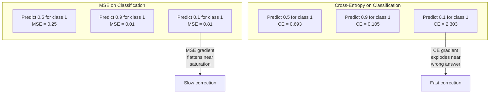
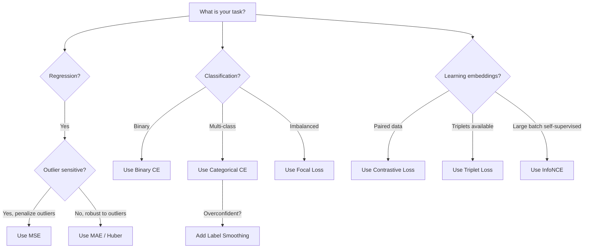
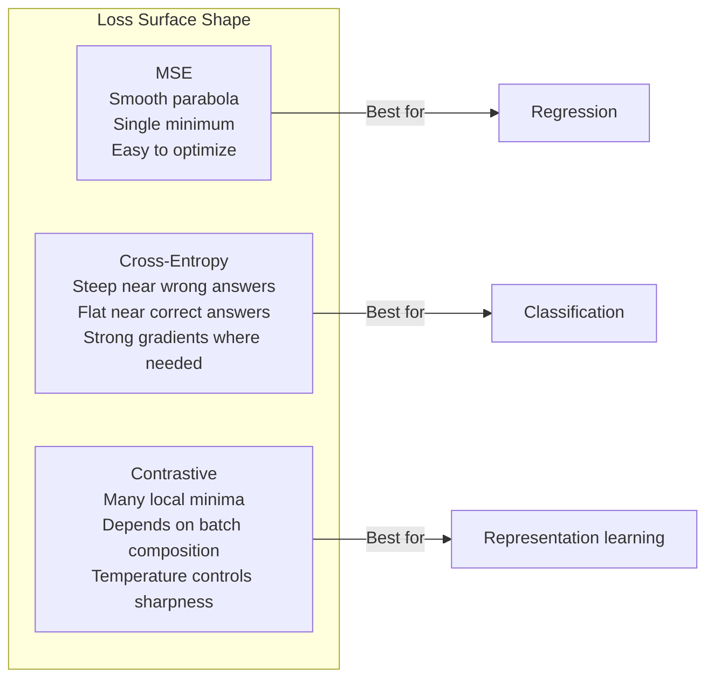

# 损失函数

> 你的网络做出预测。真实标签说不是这样。它错得有多离谱？那个数字就是 loss。选错损失函数，你的模型就会完全优化错目标。

**类型:** Build
**语言:** Python
**先修:** Lesson 03.04（Activation Functions）
**时间:** ~75 分钟

## 学习目标

- 从零实现 MSE、binary cross-entropy、categorical cross-entropy 和 contrastive loss（InfoNCE），以及它们的梯度
- 通过演示“对所有东西都预测 0.5”的失败模式，解释为什么 MSE 不适合分类
- 将 label smoothing 应用于 cross-entropy，并描述它如何防止过度自信预测
- 为回归、二分类、多分类和 embedding learning 任务选择正确的损失函数

## 要解决的问题

一个在分类问题上最小化 MSE 的模型，会自信地对所有东西预测 0.5。它确实在最小化 loss。它也完全没用。

损失函数是你的模型真正优化的唯一东西。不是 accuracy。不是 F1 score。也不是你汇报给经理的任何指标。优化器会取得损失函数的梯度，并调整权重，让这个数字变小。如果损失函数没有捕捉你真正关心的东西，模型会找到数学上最便宜的方式来满足它，而那个方式几乎从来不是你想要的。

来看一个具体例子。你有一个二分类任务。两个类别，50/50 分布。你使用 MSE 作为 loss。模型对每个输入都预测 0.5。平均 MSE 是 0.25，这是不真正学习任何东西时可能达到的最小值。模型没有任何区分能力，但从技术上说，它已经最小化了你的损失函数。换成 cross-entropy 后，同一个模型会被迫把预测推向 0 或 1，因为 -log(0.5) = 0.693 是糟糕的 loss，而 -log(0.99) = 0.01 会奖励自信且正确的预测。损失函数的选择，就是会学习的模型和钻指标空子的模型之间的区别。

情况还会更糟。在自监督学习中，你甚至没有标签。Contrastive loss 完全定义学习信号：什么算相似，什么算不同，模型应该多用力地把它们推开。Contrastive loss 写错，你的 embeddings 会坍缩到一个点——每个输入都映射到同一个向量。技术上 loss 为零。实际上一文不值。

## 核心概念

### Mean Squared Error (MSE)

回归任务的默认选择。计算预测和目标之间差值的平方，并在所有样本上取平均。

```text
MSE = (1/n) * sum((y_pred - y_true)^2)
```

为什么平方很重要：它会二次惩罚大误差。误差为 2 的成本是误差为 1 的 4 倍。误差为 10 的成本是 100 倍。这让 MSE 对离群点敏感——一个极端错误的预测会主导 loss。

真实数字：如果你的模型预测房价，对大多数房子的误差是 $10,000，但对一座豪宅误差是 $200,000，MSE 会非常激进地试图修正那一座豪宅，可能伤害另外 99 套房子的表现。

MSE 对预测值的梯度是：

```text
dMSE/dy_pred = (2/n) * (y_pred - y_true)
```

它与误差线性相关。误差越大，梯度越大。对回归来说这是特性（大误差需要大修正），对分类来说这是 bug（你想指数级惩罚自信但错误的答案，而不是线性惩罚）。

### Cross-Entropy Loss

分类任务的损失函数。它根源于信息论——衡量预测概率分布和真实分布之间的差异。

**Binary Cross-Entropy (BCE):**

```text
BCE = -(y * log(p) + (1 - y) * log(1 - p))
```

其中 y 是真实标签（0 或 1），p 是预测概率。

为什么 -log(p) 有效：当真实标签是 1，而你预测 p = 0.99 时，loss 是 -log(0.99) = 0.01。当你预测 p = 0.01 时，loss 是 -log(0.01) = 4.6。这 460 倍差异就是 cross-entropy 有效的原因。它会严厉惩罚自信但错误的预测，同时几乎不惩罚自信且正确的预测。

梯度讲述同一个故事：

```text
dBCE/dp = -(y/p) + (1-y)/(1-p)
```

当 y = 1 且 p 接近零时，梯度是 -1/p，会趋近负无穷。模型会得到一个巨大的信号去修正错误。当 p 接近 1 时，梯度很小。已经正确了，没什么要修。

**Categorical Cross-Entropy:**

用于带 one-hot 编码目标的多分类任务。

```text
CCE = -sum(y_i * log(p_i))
```

只有真实类别会贡献 loss（因为其他所有 y_i 都是零）。如果有 10 个类别，而正确类别概率是 0.1（随机猜测），loss 是 -log(0.1) = 2.3。如果正确类别概率是 0.9，loss 是 -log(0.9) = 0.105。模型会学会把概率质量集中到正确答案上。

### 为什么 MSE 不适合分类



当预测接近 0 或 1 时，MSE 梯度会变平（由于 sigmoid 饱和）。Cross-entropy 梯度会补偿这一点——-log 会抵消 sigmoid 的平坦区域，恰好在最需要强梯度的位置给出强梯度。

### Label Smoothing

标准 one-hot 标签会说“这是 100% class 3，其他所有类别都是 0%。”这是一个很强的断言。Label smoothing 会软化它：

```text
smooth_label = (1 - alpha) * one_hot + alpha / num_classes
```

当 alpha = 0.1 且有 10 个类别时：目标不再是 [0, 0, 1, 0, ...]，而变成 [0.01, 0.01, 0.91, 0.01, ...]。模型的目标是 0.91，而不是 1.0。

为什么这有效：一个试图通过 softmax 输出恰好 1.0 的模型，需要把 logits 推向 infinity。这会导致过度自信，伤害泛化，并让模型对分布偏移变得脆弱。Label smoothing 会把目标封顶在 0.9（当 alpha=0.1），让 logits 保持在合理范围。GPT 和大多数现代模型都会使用 label smoothing 或等价技巧。

### Contrastive Loss

没有标签。没有类别。只有输入对，以及一个问题：它们相似还是不同？

**SimCLR 风格 contrastive loss（NT-Xent / InfoNCE）：**

取一张图像。创建它的两个增强视图（裁剪、旋转、颜色扰动）。它们是“positive pair”——应该有相似 embeddings。batch 中其他所有图像都构成“negative pair”——应该有不同 embeddings。

```text
L = -log(exp(sim(z_i, z_j) / tau) / sum(exp(sim(z_i, z_k) / tau)))
```

其中 sim() 是 cosine similarity，z_i 和 z_j 是 positive pair，求和覆盖所有 negatives，tau（temperature）控制分布有多尖锐。较低 temperature = 更难 negatives = 更激进的分离。

真实数字：batch size 256 意味着每个 positive pair 有 255 个 negatives。Temperature tau = 0.07（SimCLR 默认值）。这个 loss 看起来像对 similarities 做 softmax——它希望 positive pair 的 similarity 在所有 256 个选项中最高。

**Triplet Loss:**

接收三个输入：anchor、positive（同类别）、negative（不同类别）。

```text
L = max(0, d(anchor, positive) - d(anchor, negative) + margin)
```

margin（通常 0.2-1.0）会强制 positive 和 negative 距离之间至少有一个间隔。如果 negative 已经足够远，loss 为零——没有梯度，没有更新。这让训练高效，但需要仔细的 triplet mining（选择靠近 anchor 的 hard negatives）。

### Focal Loss

用于不平衡数据集。标准 cross-entropy 会平等对待所有已经正确分类的样本。Focal loss 会降低 easy examples 的权重：

```text
FL = -alpha * (1 - p_t)^gamma * log(p_t)
```

其中 p_t 是真实类别的预测概率，gamma 控制聚焦程度。当 gamma = 0 时，它就是标准 cross-entropy。当 gamma = 2（默认值）时：

- Easy example (p_t = 0.9): weight = (0.1)^2 = 0.01. Effectively ignored.
- Hard example (p_t = 0.1): weight = (0.9)^2 = 0.81. Full gradient signal.

Focal loss 由 Lin 等人为目标检测提出，当时 99% 的候选区域都是背景（easy negatives）。没有 focal loss，模型会淹没在容易的背景样本中，永远学不会检测物体。有了它，模型会把容量集中在重要的困难、模糊案例上。

### 损失函数决策树



### Loss Landscape



## 动手实现

### 第 1 步：MSE 及其梯度

```python
def mse(predictions, targets):
    n = len(predictions)
    total = 0.0
    for p, t in zip(predictions, targets):
        total += (p - t) ** 2
    return total / n

def mse_gradient(predictions, targets):
    n = len(predictions)
    grads = []
    for p, t in zip(predictions, targets):
        grads.append(2.0 * (p - t) / n)
    return grads
```

### 第 2 步：Binary Cross-Entropy

log(0) 问题是真实存在的。如果模型对一个正样本恰好预测 0，log(0) = negative infinity。裁剪可以防止这一点。

```python
import math

def binary_cross_entropy(predictions, targets, eps=1e-15):
    n = len(predictions)
    total = 0.0
    for p, t in zip(predictions, targets):
        p_clipped = max(eps, min(1 - eps, p))
        total += -(t * math.log(p_clipped) + (1 - t) * math.log(1 - p_clipped))
    return total / n

def bce_gradient(predictions, targets, eps=1e-15):
    grads = []
    for p, t in zip(predictions, targets):
        p_clipped = max(eps, min(1 - eps, p))
        grads.append(-(t / p_clipped) + (1 - t) / (1 - p_clipped))
    return grads
```

### 第 3 步：带 Softmax 的 Categorical Cross-Entropy

Softmax 会把原始 logits 转成概率。然后我们计算它与 one-hot targets 之间的 cross-entropy。

```python
def softmax(logits):
    max_val = max(logits)
    exps = [math.exp(x - max_val) for x in logits]
    total = sum(exps)
    return [e / total for e in exps]

def categorical_cross_entropy(logits, target_index, eps=1e-15):
    probs = softmax(logits)
    p = max(eps, probs[target_index])
    return -math.log(p)

def cce_gradient(logits, target_index):
    probs = softmax(logits)
    grads = list(probs)
    grads[target_index] -= 1.0
    return grads
```

softmax + cross-entropy 的梯度会漂亮地简化：对真实类别来说就是（预测概率 - 1），对所有其他类别来说就是（预测概率）。这个优雅简化不是巧合——它就是 softmax 和 cross-entropy 配对使用的原因。

### 第 4 步：Label Smoothing

```python
def label_smoothed_cce(logits, target_index, num_classes, alpha=0.1, eps=1e-15):
    probs = softmax(logits)
    loss = 0.0
    for i in range(num_classes):
        if i == target_index:
            smooth_target = 1.0 - alpha + alpha / num_classes
        else:
            smooth_target = alpha / num_classes
        p = max(eps, probs[i])
        loss += -smooth_target * math.log(p)
    return loss
```

### 第 5 步：Contrastive Loss（简化版 InfoNCE）

```python
def cosine_similarity(a, b):
    dot = sum(x * y for x, y in zip(a, b))
    norm_a = math.sqrt(sum(x * x for x in a))
    norm_b = math.sqrt(sum(x * x for x in b))
    if norm_a < 1e-10 or norm_b < 1e-10:
        return 0.0
    return dot / (norm_a * norm_b)

def contrastive_loss(anchor, positive, negatives, temperature=0.07):
    sim_pos = cosine_similarity(anchor, positive) / temperature
    sim_negs = [cosine_similarity(anchor, neg) / temperature for neg in negatives]

    max_sim = max(sim_pos, max(sim_negs)) if sim_negs else sim_pos
    exp_pos = math.exp(sim_pos - max_sim)
    exp_negs = [math.exp(s - max_sim) for s in sim_negs]
    total_exp = exp_pos + sum(exp_negs)

    return -math.log(max(1e-15, exp_pos / total_exp))
```

### 第 6 步：分类任务上的 MSE vs Cross-Entropy

用两种损失函数训练第 04 课中同一个网络（圆形数据集）。观察 cross-entropy 更快收敛。

```python
import random

def sigmoid(x):
    x = max(-500, min(500, x))
    return 1.0 / (1.0 + math.exp(-x))

def make_circle_data(n=200, seed=42):
    random.seed(seed)
    data = []
    for _ in range(n):
        x = random.uniform(-2, 2)
        y = random.uniform(-2, 2)
        label = 1.0 if x * x + y * y < 1.5 else 0.0
        data.append(([x, y], label))
    return data


class LossComparisonNetwork:
    def __init__(self, loss_type="bce", hidden_size=8, lr=0.1):
        random.seed(0)
        self.loss_type = loss_type
        self.lr = lr
        self.hidden_size = hidden_size

        self.w1 = [[random.gauss(0, 0.5) for _ in range(2)] for _ in range(hidden_size)]
        self.b1 = [0.0] * hidden_size
        self.w2 = [random.gauss(0, 0.5) for _ in range(hidden_size)]
        self.b2 = 0.0

    def forward(self, x):
        self.x = x
        self.z1 = []
        self.h = []
        for i in range(self.hidden_size):
            z = self.w1[i][0] * x[0] + self.w1[i][1] * x[1] + self.b1[i]
            self.z1.append(z)
            self.h.append(max(0.0, z))

        self.z2 = sum(self.w2[i] * self.h[i] for i in range(self.hidden_size)) + self.b2
        self.out = sigmoid(self.z2)
        return self.out

    def backward(self, target):
        if self.loss_type == "mse":
            d_loss = 2.0 * (self.out - target)
        else:
            eps = 1e-15
            p = max(eps, min(1 - eps, self.out))
            d_loss = -(target / p) + (1 - target) / (1 - p)

        d_sigmoid = self.out * (1 - self.out)
        d_out = d_loss * d_sigmoid

        for i in range(self.hidden_size):
            d_relu = 1.0 if self.z1[i] > 0 else 0.0
            d_h = d_out * self.w2[i] * d_relu
            self.w2[i] -= self.lr * d_out * self.h[i]
            for j in range(2):
                self.w1[i][j] -= self.lr * d_h * self.x[j]
            self.b1[i] -= self.lr * d_h
        self.b2 -= self.lr * d_out

    def compute_loss(self, pred, target):
        if self.loss_type == "mse":
            return (pred - target) ** 2
        else:
            eps = 1e-15
            p = max(eps, min(1 - eps, pred))
            return -(target * math.log(p) + (1 - target) * math.log(1 - p))

    def train(self, data, epochs=200):
        losses = []
        for epoch in range(epochs):
            total_loss = 0.0
            correct = 0
            for x, y in data:
                pred = self.forward(x)
                self.backward(y)
                total_loss += self.compute_loss(pred, y)
                if (pred >= 0.5) == (y >= 0.5):
                    correct += 1
            avg_loss = total_loss / len(data)
            accuracy = correct / len(data) * 100
            losses.append((avg_loss, accuracy))
            if epoch % 50 == 0 or epoch == epochs - 1:
                print(f"    Epoch {epoch:3d}: loss={avg_loss:.4f}, accuracy={accuracy:.1f}%")
        return losses
```

## 实际使用

PyTorch 提供所有标准损失函数，并内置数值稳定性：

```python
import torch
import torch.nn as nn
import torch.nn.functional as F

predictions = torch.tensor([0.9, 0.1, 0.7], requires_grad=True)
targets = torch.tensor([1.0, 0.0, 1.0])

mse_loss = F.mse_loss(predictions, targets)
bce_loss = F.binary_cross_entropy(predictions, targets)

logits = torch.randn(4, 10)
labels = torch.tensor([3, 7, 1, 9])
ce_loss = F.cross_entropy(logits, labels)
ce_smooth = F.cross_entropy(logits, labels, label_smoothing=0.1)
```

使用 `F.cross_entropy`（不要手写 softmax 后再用 `F.nll_loss`）。它把 log-softmax 和 negative log-likelihood 合并到一个数值稳定的操作中。先单独应用 softmax 再取 log 稳定性较差——你会在大指数的相减中丢失精度。

对于 contrastive learning，大多数团队会使用自定义实现，或 `lightly`、`pytorch-metric-learning` 这样的库。核心循环始终相同：计算成对 similarities，在 positives 和 negatives 上创建 softmax，再反向传播。

## 交付成果

本课产出：
- `outputs/prompt-loss-function-selector.md` -- 用于选择正确损失函数的可复用 prompt
- `outputs/prompt-loss-debugger.md` -- 当你的 loss 曲线看起来不对时使用的诊断 prompt

## 练习

1. 实现 Huber loss（smooth L1 loss），它在小误差时是 MSE，在大误差时是 MAE。训练一个回归网络预测 y = sin(x)，并在 5% 训练目标被加入随机噪声（outliers）时比较 MSE 与 Huber 的最终测试误差。

2. 给二分类训练循环添加 focal loss。创建一个不平衡数据集（90% class 0，10% class 1）。比较标准 BCE 与 focal loss（gamma=2）在 200 个 epochs 后对少数类的 recall。

3. 实现带 semi-hard negative mining 的 triplet loss。为 5 个类别生成 2D embedding 数据。对每个 anchor，找到仍然比 positive 更远、但最难的 negative（semi-hard）。将收敛情况与随机 triplet selection 对比。

4. 运行 MSE vs cross-entropy 对比，但在训练期间跟踪每一层的梯度幅度。绘制每个 epoch 的平均 gradient norm。验证当模型最不确定的早期 epochs 中，cross-entropy 会产生更大的梯度。

5. 实现 KL divergence loss，并验证当真实分布是 one-hot 时，最小化 KL(true || predicted) 会给出与 cross-entropy 相同的梯度。然后尝试 soft targets（比如 knowledge distillation），其中“真实”分布来自 teacher model 的 softmax 输出。

## 关键术语

| 术语 | 人们常说 | 它实际意味着什么 |
|------|----------------|----------------------|
| Loss function | “模型错得有多离谱” | 一个可微函数，把 predictions 和 targets 映射到优化器要最小化的标量 |
| MSE | “平均平方误差” | predictions 和 targets 差值平方的平均值；会二次惩罚大误差 |
| Cross-entropy | “分类 loss” | 使用 -log(p) 衡量预测概率分布与真实分布之间的差异 |
| Binary cross-entropy | “BCE” | 两类情况下的 cross-entropy：-(y*log(p) + (1-y)*log(1-p)) |
| Label smoothing | “软化 targets” | 用软值（例如 0.1/0.9）替代硬 0/1 targets，以防止过度自信并改善泛化 |
| Contrastive loss | “拉近，推远” | 通过让相似 pairs 在 embedding space 中靠近、不相似 pairs 远离来学习表示的 loss |
| InfoNCE | “CLIP/SimCLR loss” | 基于 similarity scores 的 normalized temperature-scaled cross-entropy；把 contrastive learning 当作分类 |
| Focal loss | “不平衡数据修复器” | 用 (1-p_t)^gamma 加权 cross-entropy，降低 easy examples 的权重并聚焦 hard ones |
| Triplet loss | “Anchor-positive-negative” | 在 embedding space 中把 anchor 推得比 negative 更靠近 positive，且至少相差一个 margin |
| Temperature | “尖锐度旋钮” | 作用在 logits/similarities 上的标量除数，控制所得分布有多尖锐；越低越尖锐 |

## 延伸阅读

- Lin et al., "Focal Loss for Dense Object Detection" (2017) -- 为处理目标检测中的极端类别不平衡而提出 focal loss（RetinaNet）
- Chen et al., "A Simple Framework for Contrastive Learning of Visual Representations" (SimCLR, 2020) -- 用 NT-Xent loss 定义了现代 contrastive learning pipeline
- Szegedy et al., "Rethinking the Inception Architecture" (2016) -- 将 label smoothing 作为正则化技术引入，现在已成为大多数大模型的标准做法
- Hinton et al., "Distilling the Knowledge in a Neural Network" (2015) -- 使用 soft targets 和 KL divergence 的 knowledge distillation，是模型压缩的基础
