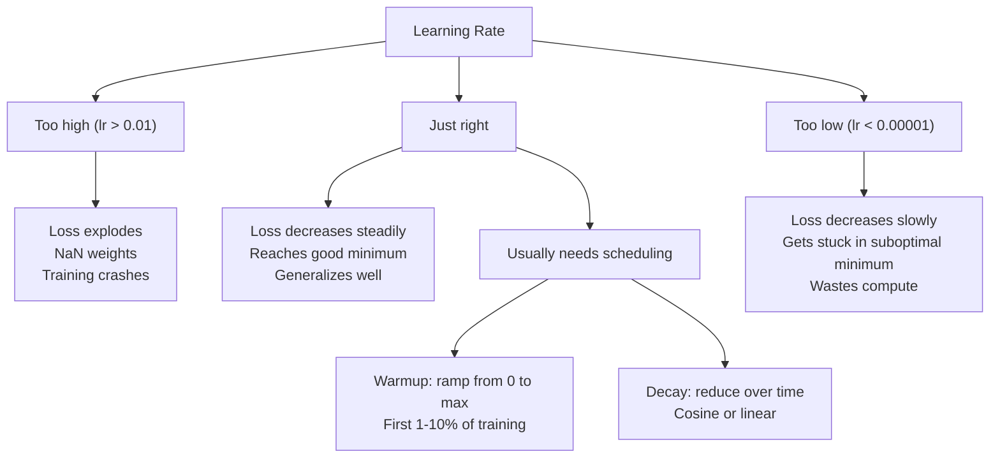
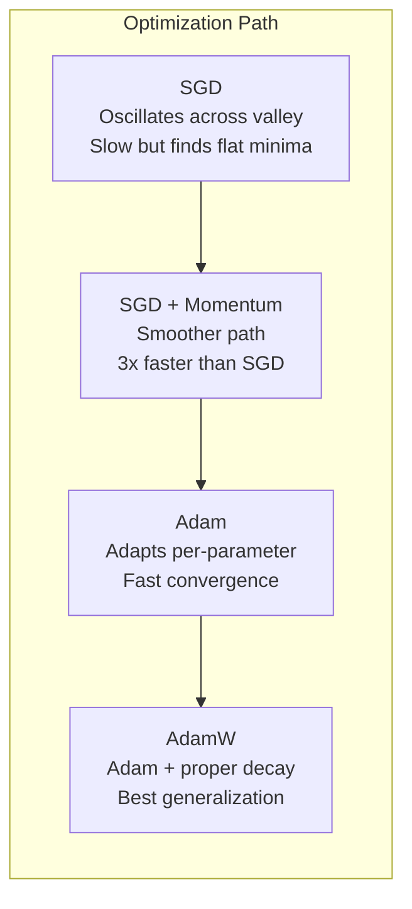
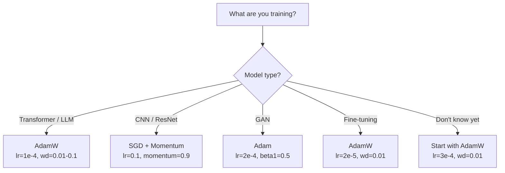

# 优化器

> 梯度下降告诉你往哪个方向走。它没有告诉你走多远、多快。SGD 是指南针。Adam 是带实时路况的 GPS。

**类型:** Build
**语言:** Python
**先修:** Lesson 03.05（Loss Functions）
**时间:** ~75 分钟

## 学习目标

- 用 Python 从零实现 SGD、带 momentum 的 SGD、Adam 和 AdamW 优化器
- 解释 Adam 的 bias correction 如何补偿训练早期从零初始化的 moment estimates
- 在同一任务上演示为什么 AdamW 比带 L2 regularization 的 Adam 有更好的泛化
- 为 transformers、CNNs、GANs 和 fine-tuning 选择合适的 optimizer 与默认 hyperparameters

## 要解决的问题

你已经算出了梯度。你知道第 4,721 个权重应该减少 0.003 才能降低 loss。但 0.003 的单位是什么？按什么缩放？而且第 1 步和第 1,000 步应该移动同样的量吗？

普通 gradient descent 会在每一步对每个参数应用相同学习率：w = w - lr * gradient。这会产生三个问题，让训练神经网络在实践中很痛苦。

第一，振荡。Loss landscape 很少像平滑碗。它更像一条又长又窄的山谷。梯度指向横穿山谷的方向（陡峭方向），而不是沿着山谷前进的方向（平缓方向）。Gradient descent 会在狭窄维度来回弹跳，同时在真正有用的方向上只取得微小进展。你见过这种情况：loss 先快速下降，然后 plateau，并不是因为模型收敛了，而是因为它在振荡。

第二，对所有参数用一个学习率是错的。有些权重需要大更新（它们处于早期、欠拟合阶段）。另一些权重需要微小更新（它们接近最优值）。适合前者的学习率会毁掉后者，反过来也一样。

第三，鞍点。在高维空间中，loss landscape 有大片平坦区域，梯度接近零。普通 SGD 会以梯度的速度爬过这些区域，而这个速度实际上是零。模型看起来卡住了。它并没有卡住——它处在一个平坦区域，另一侧还有有用的下降方向。但 SGD 没有机制把它推过去。

Adam 解决了这三个问题。它为每个参数维护两个 running averages——平均梯度（momentum，处理振荡）和平均平方梯度（adaptive rate，处理不同尺度）。再结合最初几步的 bias correction，它给你一个使用默认 hyperparameters 就能解决 80% 问题的单一优化器。本课会从零构建它，让你准确理解它为什么能工作，以及为什么会在另外 20% 的问题上失败。

## 核心概念

### Stochastic Gradient Descent (SGD)

最简单的优化器。在一个 mini-batch 上计算梯度，并朝相反方向迈一步。

```text
w = w - lr * gradient
```

“stochastic” 意味着你用随机子集（mini-batch）来估计梯度，而不是用完整数据集。这个噪声实际上很有用——它帮助逃离尖锐局部最小值。但噪声也会导致振荡。

学习率是唯一旋钮。太高：loss 发散。太低：训练永远跑不完。最优值依赖架构、数据、batch size 和当前训练阶段。对现代网络中的普通 SGD 来说，典型值范围是 0.01 到 0.1。但即使在一次训练运行内部，理想学习率也会变化。

### Momentum

滚下山坡的小球类比已经被用烂了，但确实准确。你不再只按当前梯度迈步，而是维护一个速度，累积过去的梯度。

```text
m_t = beta * m_{t-1} + gradient
w = w - lr * m_t
```

Beta（通常 0.9）控制保留多少历史。当 beta = 0.9 时，momentum 大约是最近 10 个梯度的平均值（1 / (1 - 0.9) = 10）。

为什么这能修复振荡：指向同一方向的梯度会累积。方向来回翻转的梯度会相互抵消。在那条狭窄山谷中，“横穿”分量每一步都会变号并被衰减。“沿着”分量保持一致并被放大。结果是在有用方向上平滑加速。

真实数字：单独使用 SGD 在条件很差的 loss landscape 上可能需要 10,000 步。带 momentum 的 SGD（beta=0.9）在同一问题上通常需要 3,000-5,000 步。这种加速不是微不足道的。

### RMSProp

第一个真正有效的逐参数自适应学习率方法。Hinton 在 Coursera 课程中提出（从未正式发表）。

```text
s_t = beta * s_{t-1} + (1 - beta) * gradient^2
w = w - lr * gradient / (sqrt(s_t) + epsilon)
```

s_t 跟踪平方梯度的 running average。长期有大梯度的参数会被一个大数除（较小有效学习率）。小梯度的参数会被一个小数除（较大有效学习率）。

这解决了“所有参数一个学习率”的问题。一个一直得到大更新的权重可能已经接近目标——让它慢下来。一个一直得到小更新的权重可能训练不足——让它快起来。

Epsilon（通常 1e-8）会在参数还没被更新时防止除零。

### Adam：Momentum + RMSProp

Adam 结合了两个想法。它为每个参数维护两个指数移动平均：

```text
m_t = beta1 * m_{t-1} + (1 - beta1) * gradient        (first moment: mean)
v_t = beta2 * v_{t-1} + (1 - beta2) * gradient^2       (second moment: variance)
```

**Bias correction** 是大多数解释会跳过的关键细节。在第 1 步，m_1 = (1 - beta1) * gradient。当 beta1 = 0.9 时，这是 0.1 * gradient——小了十倍。移动平均还没热起来。Bias correction 会补偿这一点：

```text
m_hat = m_t / (1 - beta1^t)
v_hat = v_t / (1 - beta2^t)
```

第 1 步且 beta1 = 0.9 时：m_hat = m_1 / (1 - 0.9) = m_1 / 0.1 = 实际梯度。第 100 步时：(1 - 0.9^100) 约等于 1.0，所以修正消失。Bias correction 对前 ~10 步很重要，~50 步之后基本无关。

更新：

```text
w = w - lr * m_hat / (sqrt(v_hat) + epsilon)
```

Adam 默认值：lr = 0.001、beta1 = 0.9、beta2 = 0.999、epsilon = 1e-8。这些默认值适用于 80% 的问题。不适用时，先改 lr。然后改 beta2。几乎不要改 beta1 或 epsilon。

### AdamW：正确的 Weight Decay

L2 regularization 会把 lambda * w^2 加到 loss 上。在普通 SGD 中，这等价于 weight decay（每一步从权重中减去 lambda * w）。在 Adam 中，这种等价性会破裂。

Loshchilov & Hutter 的洞见是：当你把 L2 加到 loss 上，再让 Adam 处理梯度时，自适应学习率也会缩放 regularization 项。梯度方差大的参数得到更少正则化。方差小的参数得到更多正则化。这不是你想要的——你想要与梯度统计无关的统一正则化。

AdamW 通过在 Adam 更新之后直接把 weight decay 应用到权重上来修复这一点：

```text
w = w - lr * m_hat / (sqrt(v_hat) + epsilon) - lr * lambda * w
```

weight decay 项（lr * lambda * w）不会被 Adam 的自适应因子缩放。每个参数都得到相同的比例收缩。

这看起来像小细节。不是。几乎在每个任务上，AdamW 都会收敛到比 Adam + L2 regularization 更好的解。它是 PyTorch 中训练 transformers、diffusion models 和大多数现代架构的默认优化器。BERT、GPT、LLaMA、Stable Diffusion——全都用 AdamW 训练。

### 学习率：最重要的超参数



如果你只调一个超参数，就调学习率。学习率 10 倍变化，比你会做的任何架构决策都更重要。常见默认值：

- SGD: lr = 0.01 to 0.1
- Adam/AdamW: lr = 1e-4 to 3e-4
- Fine-tuning pretrained models: lr = 1e-5 to 5e-5
- Learning rate warmup: linear ramp over first 1-10% of steps

### 优化器对比



### 每种优化器何时胜出



## 动手实现

### 第 1 步：普通 SGD

```python
class SGD:
    def __init__(self, lr=0.01):
        self.lr = lr

    def step(self, params, grads):
        for i in range(len(params)):
            params[i] -= self.lr * grads[i]
```

### 第 2 步：带 Momentum 的 SGD

```python
class SGDMomentum:
    def __init__(self, lr=0.01, beta=0.9):
        self.lr = lr
        self.beta = beta
        self.velocities = None

    def step(self, params, grads):
        if self.velocities is None:
            self.velocities = [0.0] * len(params)
        for i in range(len(params)):
            self.velocities[i] = self.beta * self.velocities[i] + grads[i]
            params[i] -= self.lr * self.velocities[i]
```

### 第 3 步：Adam

```python
import math

class Adam:
    def __init__(self, lr=0.001, beta1=0.9, beta2=0.999, epsilon=1e-8):
        self.lr = lr
        self.beta1 = beta1
        self.beta2 = beta2
        self.epsilon = epsilon
        self.m = None
        self.v = None
        self.t = 0

    def step(self, params, grads):
        if self.m is None:
            self.m = [0.0] * len(params)
            self.v = [0.0] * len(params)

        self.t += 1

        for i in range(len(params)):
            self.m[i] = self.beta1 * self.m[i] + (1 - self.beta1) * grads[i]
            self.v[i] = self.beta2 * self.v[i] + (1 - self.beta2) * grads[i] ** 2

            m_hat = self.m[i] / (1 - self.beta1 ** self.t)
            v_hat = self.v[i] / (1 - self.beta2 ** self.t)

            params[i] -= self.lr * m_hat / (math.sqrt(v_hat) + self.epsilon)
```

### 第 4 步：AdamW

```python
class AdamW:
    def __init__(self, lr=0.001, beta1=0.9, beta2=0.999, epsilon=1e-8, weight_decay=0.01):
        self.lr = lr
        self.beta1 = beta1
        self.beta2 = beta2
        self.epsilon = epsilon
        self.weight_decay = weight_decay
        self.m = None
        self.v = None
        self.t = 0

    def step(self, params, grads):
        if self.m is None:
            self.m = [0.0] * len(params)
            self.v = [0.0] * len(params)

        self.t += 1

        for i in range(len(params)):
            self.m[i] = self.beta1 * self.m[i] + (1 - self.beta1) * grads[i]
            self.v[i] = self.beta2 * self.v[i] + (1 - self.beta2) * grads[i] ** 2

            m_hat = self.m[i] / (1 - self.beta1 ** self.t)
            v_hat = self.v[i] / (1 - self.beta2 ** self.t)

            params[i] -= self.lr * m_hat / (math.sqrt(v_hat) + self.epsilon)
            params[i] -= self.lr * self.weight_decay * params[i]
```

### 第 5 步：训练对比

在第 05 课的圆形数据集上，用全部四种优化器训练同一个两层网络。比较收敛情况。

```python
import random

def sigmoid(x):
    x = max(-500, min(500, x))
    return 1.0 / (1.0 + math.exp(-x))

def make_circle_data(n=200, seed=42):
    random.seed(seed)
    data = []
    for _ in range(n):
        x = random.uniform(-2, 2)
        y = random.uniform(-2, 2)
        label = 1.0 if x * x + y * y < 1.5 else 0.0
        data.append(([x, y], label))
    return data


class OptimizerTestNetwork:
    def __init__(self, optimizer, hidden_size=8):
        random.seed(0)
        self.hidden_size = hidden_size
        self.optimizer = optimizer

        self.w1 = [[random.gauss(0, 0.5) for _ in range(2)] for _ in range(hidden_size)]
        self.b1 = [0.0] * hidden_size
        self.w2 = [random.gauss(0, 0.5) for _ in range(hidden_size)]
        self.b2 = 0.0

    def get_params(self):
        params = []
        for row in self.w1:
            params.extend(row)
        params.extend(self.b1)
        params.extend(self.w2)
        params.append(self.b2)
        return params

    def set_params(self, params):
        idx = 0
        for i in range(self.hidden_size):
            for j in range(2):
                self.w1[i][j] = params[idx]
                idx += 1
        for i in range(self.hidden_size):
            self.b1[i] = params[idx]
            idx += 1
        for i in range(self.hidden_size):
            self.w2[i] = params[idx]
            idx += 1
        self.b2 = params[idx]

    def forward(self, x):
        self.x = x
        self.z1 = []
        self.h = []
        for i in range(self.hidden_size):
            z = self.w1[i][0] * x[0] + self.w1[i][1] * x[1] + self.b1[i]
            self.z1.append(z)
            self.h.append(max(0.0, z))

        self.z2 = sum(self.w2[i] * self.h[i] for i in range(self.hidden_size)) + self.b2
        self.out = sigmoid(self.z2)
        return self.out

    def compute_grads(self, target):
        eps = 1e-15
        p = max(eps, min(1 - eps, self.out))
        d_loss = -(target / p) + (1 - target) / (1 - p)
        d_sigmoid = self.out * (1 - self.out)
        d_out = d_loss * d_sigmoid

        grads = [0.0] * (self.hidden_size * 2 + self.hidden_size + self.hidden_size + 1)
        idx = 0
        for i in range(self.hidden_size):
            d_relu = 1.0 if self.z1[i] > 0 else 0.0
            d_h = d_out * self.w2[i] * d_relu
            grads[idx] = d_h * self.x[0]
            grads[idx + 1] = d_h * self.x[1]
            idx += 2

        for i in range(self.hidden_size):
            d_relu = 1.0 if self.z1[i] > 0 else 0.0
            grads[idx] = d_out * self.w2[i] * d_relu
            idx += 1

        for i in range(self.hidden_size):
            grads[idx] = d_out * self.h[i]
            idx += 1

        grads[idx] = d_out
        return grads

    def train(self, data, epochs=300):
        losses = []
        for epoch in range(epochs):
            total_loss = 0.0
            correct = 0
            for x, y in data:
                pred = self.forward(x)
                grads = self.compute_grads(y)
                params = self.get_params()
                self.optimizer.step(params, grads)
                self.set_params(params)

                eps = 1e-15
                p = max(eps, min(1 - eps, pred))
                total_loss += -(y * math.log(p) + (1 - y) * math.log(1 - p))
                if (pred >= 0.5) == (y >= 0.5):
                    correct += 1
            avg_loss = total_loss / len(data)
            accuracy = correct / len(data) * 100
            losses.append((avg_loss, accuracy))
            if epoch % 75 == 0 or epoch == epochs - 1:
                print(f"    Epoch {epoch:3d}: loss={avg_loss:.4f}, accuracy={accuracy:.1f}%")
        return losses
```

## 实际使用

PyTorch optimizers 会处理 parameter groups、gradient clipping 和 learning rate scheduling：

```python
import torch
import torch.optim as optim

model = torch.nn.Sequential(
    torch.nn.Linear(784, 256),
    torch.nn.ReLU(),
    torch.nn.Linear(256, 10),
)

optimizer = optim.AdamW(model.parameters(), lr=3e-4, weight_decay=0.01)

scheduler = optim.lr_scheduler.CosineAnnealingLR(optimizer, T_max=100)

for epoch in range(100):
    optimizer.zero_grad()
    output = model(torch.randn(32, 784))
    loss = torch.nn.functional.cross_entropy(output, torch.randint(0, 10, (32,)))
    loss.backward()
    torch.nn.utils.clip_grad_norm_(model.parameters(), max_norm=1.0)
    optimizer.step()
    scheduler.step()
```

模式始终是：zero_grad、forward、loss、backward、(clip)、step、(schedule)。记住这个顺序。顺序写错（例如在 optimizer.step() 之前调用 scheduler.step()）是隐蔽 bug 的常见来源。

对 CNNs 来说，很多实践者仍然偏好 SGD + momentum（lr=0.1、momentum=0.9、weight_decay=1e-4），配合 step 或 cosine schedule。SGD 会找到更平坦的 minima，通常泛化更好。对 transformers 和 LLMs 来说，带 warmup + cosine decay 的 AdamW 是通用默认选择。没有测量依据，就不要对抗共识。

## 交付成果

本课产出：
- `outputs/prompt-optimizer-selector.md` -- 一个决策 prompt，用于为任意架构选择正确的 optimizer 和 learning rate

## 练习

1. 实现 Nesterov momentum，在“lookahead”位置（w - lr * beta * v）而不是当前位置计算梯度。在圆形数据集上与标准 momentum 比较收敛情况。

2. 实现一个 learning rate warmup schedule：在前 10% training steps 中从 0 线性爬升到 max_lr，然后 cosine decay 到 0。比较 Adam + warmup 与无 warmup 的 Adam。测量在圆形数据集上达到 90% accuracy 需要多少 epochs。

3. 跟踪 Adam 训练期间每个参数的有效学习率。有效学习率是 lr * m_hat / (sqrt(v_hat) + eps)。绘制第 10、50 和 200 步之后有效学习率的分布。所有参数都以相同速度更新吗？

4. 实现 gradient clipping（按 global norm 裁剪）。把最大 gradient norm 设为 1.0。使用高学习率（Adam 的 lr=0.01）分别在有裁剪和无裁剪情况下训练。用 10 个 random seeds 统计各自有多少次运行发散（loss 变成 NaN）。

5. 在一个大权重网络上比较 Adam 和 AdamW。把所有权重初始化为 [-5, 5] 中的随机值（远大于正常情况）。用 weight_decay=0.1 训练 200 epochs。绘制训练期间两种优化器的权重 L2 norm。AdamW 应该显示出更快的权重收缩。

## 关键术语

| 术语 | 人们常说 | 它实际意味着什么 |
|------|----------------|----------------------|
| Learning rate | “步长” | 梯度更新上的标量乘数；训练中影响最大的单个超参数 |
| SGD | “基础梯度下降” | Stochastic gradient descent：用 mini-batch 计算梯度，并通过减去 lr * gradient 更新权重 |
| Momentum | “滚动小球类比” | 过去梯度的指数移动平均；抑制振荡并加速一致方向 |
| RMSProp | “自适应学习率” | 用近期梯度的 running RMS 除以每个参数的梯度；平衡学习率 |
| Adam | “默认优化器” | 结合 momentum（first moment）和 RMSProp（second moment），并对初始步骤做 bias correction |
| AdamW | “正确版 Adam” | 带 decoupled weight decay 的 Adam；直接对权重施加正则化，而不是通过梯度施加 |
| Bias correction | “running averages 的 warmup” | 除以 (1 - beta^t)，补偿 Adam moment estimates 的零初始化 |
| Weight decay | “缩小权重” | 每一步减去权重值的一部分；惩罚大权重的正则化器 |
| Learning rate schedule | “随时间改变 lr” | 训练期间调整学习率的函数；warmup + cosine decay 是现代默认选择 |
| Gradient clipping | “限制 gradient norm” | 当梯度向量 norm 超过阈值时将其缩小；防止梯度爆炸更新 |

## 延伸阅读

- Kingma & Ba, "Adam: A Method for Stochastic Optimization" (2014) -- Adam 原始论文，包含收敛分析和 bias correction 推导
- Loshchilov & Hutter, "Decoupled Weight Decay Regularization" (2017) -- 证明 L2 regularization 和 weight decay 在 Adam 中不等价，并提出 AdamW
- Smith, "Cyclical Learning Rates for Training Neural Networks" (2017) -- 提出 LR range test 和 cyclical schedules，减少对固定学习率调参的需求
- Ruder, "An Overview of Gradient Descent Optimization Algorithms" (2016) -- 所有 optimizer variants 的最佳单篇综述，有清晰对比和直觉解释
