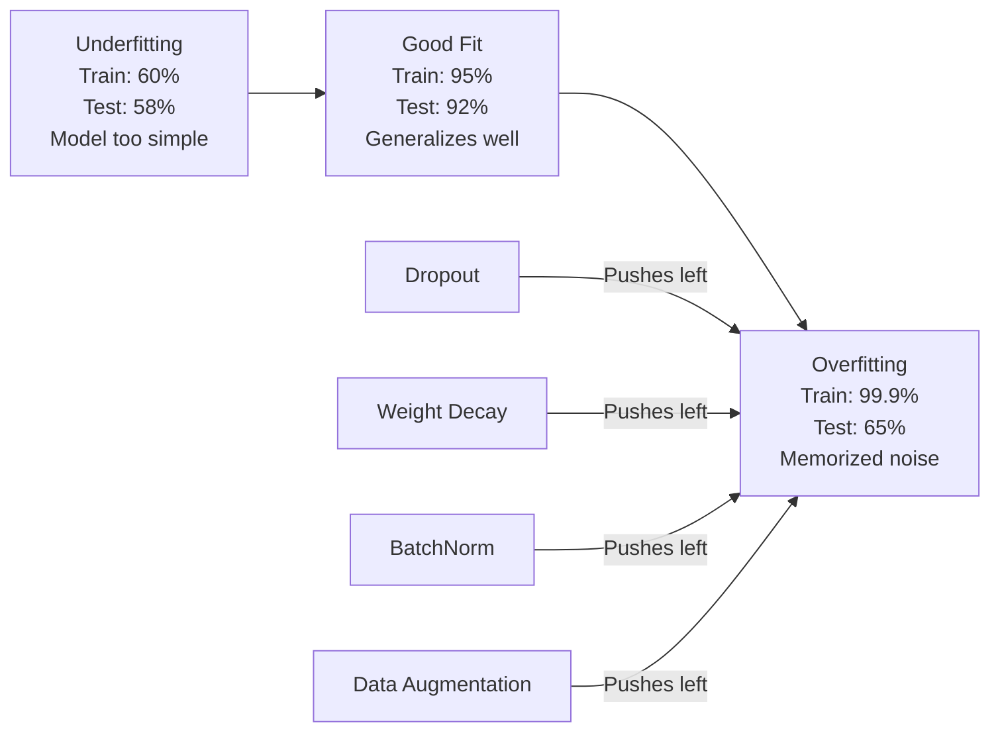
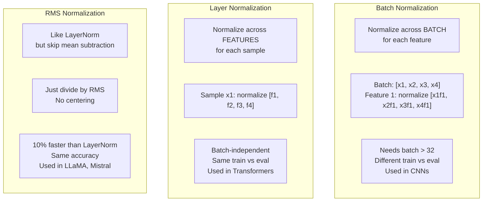
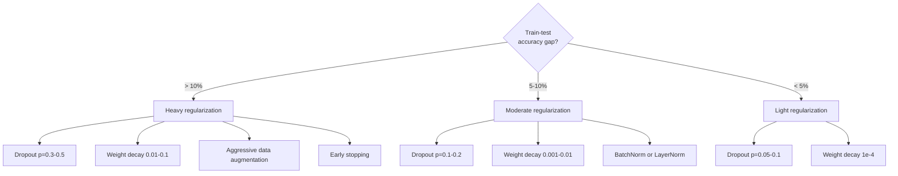

# 正则化

> 你的模型在训练数据上达到 99%，在测试数据上只有 60%。它记住了数据，而不是学会了模式。正则化就是你对复杂度征收的税，用来迫使模型泛化。

**类型:** Build
**语言:** Python
**先修:** Lesson 03.06（Optimizers）
**时间:** ~75 分钟

## 学习目标

- 从零实现带 inverted scaling 的 dropout、L2 weight decay、batch normalization、layer normalization 和 RMSNorm
- 测量 train-test accuracy gap，并用正则化实验诊断 overfitting
- 解释为什么 transformers 使用 LayerNorm 而不是 BatchNorm，以及为什么现代 LLMs 更偏好 RMSNorm
- 根据 overfitting 的严重程度，应用正确的正则化技术组合

## 要解决的问题

参数足够多的神经网络可以记住任何数据集。这不是假设——Zhang 等人（2017）通过在带随机标签的 ImageNet 上训练标准网络证明了这一点。网络在完全随机的标签分配上达到了接近零的训练 loss。它们记住了一百万个随机 input-output pairs，其中没有任何模式可学。训练 loss 完美。测试 accuracy 为零。

这就是 overfitting 问题，而且模型越大，它越严重。GPT-3 有 1750 亿个参数。训练集大约有 5000 亿 tokens。有了这么多参数，模型有足够容量逐字记住大量训练数据。没有正则化，它只会吐回训练样本，而不是学习可泛化模式。

训练表现和测试表现之间的差距就是 overfitting gap。本课中的每种技术都会从不同角度攻击这个差距。Dropout 强迫网络不要依赖任何单个神经元。Weight decay 防止任何单个权重变得过大。Batch normalization 会平滑 loss landscape，让优化器找到更平坦、更可泛化的 minima。Layer normalization 做同样的事，但能在 batch normalization 失效的地方工作（小 batch、变长序列）。RMSNorm 通过去掉均值计算，让它快 10%。每种技术都很简单。合在一起，它们就是“会记忆的模型”和“会泛化的模型”之间的区别。

## 核心概念

### Overfitting 光谱

每个模型都位于从 underfitting（太简单，无法捕捉模式）到 overfitting（复杂到捕捉噪声）的光谱上。甜蜜点在中间，而正则化会从过拟合一侧把模型推向那里。



### Dropout

最简单、解释也最优雅的正则化技术。训练期间，以概率 p 随机把每个神经元输出设为零。

```text
output = activation(z) * mask    where mask[i] ~ Bernoulli(1 - p)
```

当 p = 0.5 时，每次前向传播都会有一半神经元被清零。网络必须学习冗余表示，因为它无法预测哪些神经元可用。这会防止 co-adaptation——神经元学会依赖某些特定神经元存在。

集成解释：一个有 N 个神经元且使用 dropout 的网络，会创建 2^N 个可能的子网络（所有神经元开或关的组合）。用 dropout 训练，近似于同时训练所有 2^N 个子网络，每个子网络看到不同 mini-batches。测试时，你使用所有神经元（没有 dropout），并把输出乘以 (1 - p) 来匹配训练期间的期望值。这等价于平均 2^N 个子网络的预测——一个来自单个模型的巨大 ensemble。

实践中，缩放会在训练期间应用，而不是测试期间（inverted dropout）：

```text
During training:  output = activation(z) * mask / (1 - p)
During testing:   output = activation(z)   (no change needed)
```

这样更干净，因为测试代码完全不需要知道 dropout。

默认比例：transformers 用 p = 0.1，MLPs 用 p = 0.5，CNNs 用 p = 0.2-0.3。更高 dropout = 更强正则化 = 更高 underfitting 风险。

### Weight Decay（L2 Regularization）

把所有权重的平方幅度加到 loss 上：

```text
total_loss = task_loss + (lambda / 2) * sum(w_i^2)
```

正则化项的梯度是 lambda * w。这意味着每一步，每个权重都会按其大小成比例地向零收缩。大权重受到更多惩罚。模型会被推向没有单个权重主导的解。

为什么这有助于泛化：过拟合模型往往有很大的权重，会放大训练数据中的噪声。Weight decay 保持权重较小，从而限制模型的有效容量，迫使它依赖稳健、可泛化的特征，而不是记住的怪癖。

lambda hyperparameter 控制强度。典型值：

- 0.01 for AdamW on transformers
- 1e-4 for SGD on CNNs
- 0.1 for heavily overfit models

如第 06 课所述：weight decay 和 L2 regularization 在 SGD 中等价，但在 Adam 中不等价。用 Adam 训练时，始终使用 AdamW（decoupled weight decay）。

### Batch Normalization

在把每一层的输出传给下一层之前，跨 mini-batch 对它进行归一化。

对某层的一批 activations：

```text
mu = (1/B) * sum(x_i)           (batch mean)
sigma^2 = (1/B) * sum((x_i - mu)^2)   (batch variance)
x_hat = (x_i - mu) / sqrt(sigma^2 + eps)   (normalize)
y = gamma * x_hat + beta        (scale and shift)
```

Gamma 和 beta 是可学习参数，让网络在最优时可以撤销归一化。没有它们，你就会强迫每一层输出都是零均值、单位方差，而这可能不是网络想要的。

**Training vs inference split:** 训练期间，mu 和 sigma 来自当前 mini-batch。推理期间，你使用训练期间累积的 running averages（exponential moving average，momentum = 0.1，表示 90% 旧值 + 10% 新值）。

BatchNorm 为什么有效仍有争议。原论文声称它减少了“internal covariate shift”（随着早期层更新，层输入分布发生变化）。Santurkar 等人（2018）表明这个解释是错的。真正原因是：BatchNorm 会让 loss landscape 更平滑。梯度更有预测性，Lipschitz constants 更小，优化器可以安全地走更大步。这就是 BatchNorm 允许使用更高学习率并更快收敛的原因。

BatchNorm 有根本限制：它依赖 batch statistics。当 batch size 为 1 时，均值和方差没有意义。小 batch（< 32）时，统计量噪声很大，会伤害性能。这对 object detection（内存限制 batch size）和 language modeling（序列长度可变）这样的任务很重要。

### Layer Normalization

跨 features 归一化，而不是跨 batch。对单个样本：

```text
mu = (1/D) * sum(x_j)           (feature mean)
sigma^2 = (1/D) * sum((x_j - mu)^2)   (feature variance)
x_hat = (x_j - mu) / sqrt(sigma^2 + eps)
y = gamma * x_hat + beta
```

D 是 feature dimension。每个样本独立归一化——不依赖 batch size。这就是 transformers 使用 LayerNorm 而不是 BatchNorm 的原因。序列长度可变，batch sizes 经常很小（生成期间甚至为 1），而且训练和推理之间计算完全相同。

Transformers 中的 LayerNorm 会应用在每个 self-attention block 和每个 feed-forward block 之后（Post-LN），或之前（Pre-LN，训练更稳定）。

### RMSNorm

没有均值减法的 LayerNorm。由 Zhang & Sennrich（2019）提出。

```text
rms = sqrt((1/D) * sum(x_j^2))
y = gamma * x / rms
```

就是这样。没有均值计算，没有 beta 参数。观察是：LayerNorm 中的重新居中（均值减法）对模型性能贡献很小，却有计算成本。去掉它可以在约少 10% 开销的情况下获得相同 accuracy。

LLaMA、LLaMA 2、LLaMA 3、Mistral 和大多数现代 LLMs 都使用 RMSNorm，而不是 LayerNorm。在数十亿参数和数万亿 tokens 的规模下，这 10% 节省很可观。

### Normalization 对比



### Data Augmentation 作为正则化

它不是修改模型，而是修改数据。变换训练输入，同时保持标签不变：

- Images: random crop, flip, rotation, color jitter, cutout
- Text: synonym replacement, back-translation, random deletion
- Audio: time stretch, pitch shift, noise addition

效果与正则化相同：它增加了训练集的有效大小，让模型更难记住具体样本。只以原始形式见过每张图像一次的模型可以记住它。见过每张图像 50 个增强版本的模型，被迫学习不变结构。

### Early Stopping

最简单的正则化器：当 validation loss 开始上升时停止训练。此时模型还没开始过拟合。实践中，你每个 epoch 跟踪 validation loss，保存最佳模型，并继续训练一个“patience”窗口（通常 5-20 epochs）。如果 validation loss 在 patience 窗口内没有改善，就停止并加载保存过的最佳模型。

### 什么时候应用什么



## 动手实现

### 第 1 步：Dropout（Train 和 Eval 模式）

```python
import random
import math


class Dropout:
    def __init__(self, p=0.5):
        self.p = p
        self.training = True
        self.mask = None

    def forward(self, x):
        if not self.training:
            return list(x)
        self.mask = []
        output = []
        for val in x:
            if random.random() < self.p:
                self.mask.append(0)
                output.append(0.0)
            else:
                self.mask.append(1)
                output.append(val / (1 - self.p))
        return output

    def backward(self, grad_output):
        grads = []
        for g, m in zip(grad_output, self.mask):
            if m == 0:
                grads.append(0.0)
            else:
                grads.append(g / (1 - self.p))
        return grads
```

### 第 2 步：L2 Weight Decay

```python
def l2_regularization(weights, lambda_reg):
    penalty = 0.0
    for w in weights:
        penalty += w * w
    return lambda_reg * 0.5 * penalty

def l2_gradient(weights, lambda_reg):
    return [lambda_reg * w for w in weights]
```

### 第 3 步：Batch Normalization

```python
class BatchNorm:
    def __init__(self, num_features, momentum=0.1, eps=1e-5):
        self.gamma = [1.0] * num_features
        self.beta = [0.0] * num_features
        self.eps = eps
        self.momentum = momentum
        self.running_mean = [0.0] * num_features
        self.running_var = [1.0] * num_features
        self.training = True
        self.num_features = num_features

    def forward(self, batch):
        batch_size = len(batch)
        if self.training:
            mean = [0.0] * self.num_features
            for sample in batch:
                for j in range(self.num_features):
                    mean[j] += sample[j]
            mean = [m / batch_size for m in mean]

            var = [0.0] * self.num_features
            for sample in batch:
                for j in range(self.num_features):
                    var[j] += (sample[j] - mean[j]) ** 2
            var = [v / batch_size for v in var]

            for j in range(self.num_features):
                self.running_mean[j] = (1 - self.momentum) * self.running_mean[j] + self.momentum * mean[j]
                self.running_var[j] = (1 - self.momentum) * self.running_var[j] + self.momentum * var[j]
        else:
            mean = list(self.running_mean)
            var = list(self.running_var)

        self.x_hat = []
        output = []
        for sample in batch:
            normalized = []
            out_sample = []
            for j in range(self.num_features):
                x_h = (sample[j] - mean[j]) / math.sqrt(var[j] + self.eps)
                normalized.append(x_h)
                out_sample.append(self.gamma[j] * x_h + self.beta[j])
            self.x_hat.append(normalized)
            output.append(out_sample)
        return output
```

### 第 4 步：Layer Normalization

```python
class LayerNorm:
    def __init__(self, num_features, eps=1e-5):
        self.gamma = [1.0] * num_features
        self.beta = [0.0] * num_features
        self.eps = eps
        self.num_features = num_features

    def forward(self, x):
        mean = sum(x) / len(x)
        var = sum((xi - mean) ** 2 for xi in x) / len(x)

        self.x_hat = []
        output = []
        for j in range(self.num_features):
            x_h = (x[j] - mean) / math.sqrt(var + self.eps)
            self.x_hat.append(x_h)
            output.append(self.gamma[j] * x_h + self.beta[j])
        return output
```

### 第 5 步：RMSNorm

```python
class RMSNorm:
    def __init__(self, num_features, eps=1e-6):
        self.gamma = [1.0] * num_features
        self.eps = eps
        self.num_features = num_features

    def forward(self, x):
        rms = math.sqrt(sum(xi * xi for xi in x) / len(x) + self.eps)
        output = []
        for j in range(self.num_features):
            output.append(self.gamma[j] * x[j] / rms)
        return output
```

### 第 6 步：带正则化和不带正则化训练

```python
def sigmoid(x):
    x = max(-500, min(500, x))
    return 1.0 / (1.0 + math.exp(-x))


def make_circle_data(n=200, seed=42):
    random.seed(seed)
    data = []
    for _ in range(n):
        x = random.uniform(-2, 2)
        y = random.uniform(-2, 2)
        label = 1.0 if x * x + y * y < 1.5 else 0.0
        data.append(([x, y], label))
    return data


class RegularizedNetwork:
    def __init__(self, hidden_size=16, lr=0.05, dropout_p=0.0, weight_decay=0.0):
        random.seed(0)
        self.hidden_size = hidden_size
        self.lr = lr
        self.dropout_p = dropout_p
        self.weight_decay = weight_decay
        self.dropout = Dropout(p=dropout_p) if dropout_p > 0 else None

        self.w1 = [[random.gauss(0, 0.5) for _ in range(2)] for _ in range(hidden_size)]
        self.b1 = [0.0] * hidden_size
        self.w2 = [random.gauss(0, 0.5) for _ in range(hidden_size)]
        self.b2 = 0.0

    def forward(self, x, training=True):
        self.x = x
        self.z1 = []
        self.h = []
        for i in range(self.hidden_size):
            z = self.w1[i][0] * x[0] + self.w1[i][1] * x[1] + self.b1[i]
            self.z1.append(z)
            self.h.append(max(0.0, z))

        if self.dropout and training:
            self.dropout.training = True
            self.h = self.dropout.forward(self.h)
        elif self.dropout:
            self.dropout.training = False
            self.h = self.dropout.forward(self.h)

        self.z2 = sum(self.w2[i] * self.h[i] for i in range(self.hidden_size)) + self.b2
        self.out = sigmoid(self.z2)
        return self.out

    def backward(self, target):
        eps = 1e-15
        p = max(eps, min(1 - eps, self.out))
        d_loss = -(target / p) + (1 - target) / (1 - p)
        d_sigmoid = self.out * (1 - self.out)
        d_out = d_loss * d_sigmoid

        for i in range(self.hidden_size):
            d_relu = 1.0 if self.z1[i] > 0 else 0.0
            d_h = d_out * self.w2[i] * d_relu
            self.w2[i] -= self.lr * (d_out * self.h[i] + self.weight_decay * self.w2[i])
            for j in range(2):
                self.w1[i][j] -= self.lr * (d_h * self.x[j] + self.weight_decay * self.w1[i][j])
            self.b1[i] -= self.lr * d_h
        self.b2 -= self.lr * d_out

    def evaluate(self, data):
        correct = 0
        total_loss = 0.0
        for x, y in data:
            pred = self.forward(x, training=False)
            eps = 1e-15
            p = max(eps, min(1 - eps, pred))
            total_loss += -(y * math.log(p) + (1 - y) * math.log(1 - p))
            if (pred >= 0.5) == (y >= 0.5):
                correct += 1
        return total_loss / len(data), correct / len(data) * 100

    def train_model(self, train_data, test_data, epochs=300):
        history = []
        for epoch in range(epochs):
            total_loss = 0.0
            correct = 0
            for x, y in train_data:
                pred = self.forward(x, training=True)
                self.backward(y)
                eps = 1e-15
                p = max(eps, min(1 - eps, pred))
                total_loss += -(y * math.log(p) + (1 - y) * math.log(1 - p))
                if (pred >= 0.5) == (y >= 0.5):
                    correct += 1
            train_loss = total_loss / len(train_data)
            train_acc = correct / len(train_data) * 100
            test_loss, test_acc = self.evaluate(test_data)
            history.append((train_loss, train_acc, test_loss, test_acc))
            if epoch % 75 == 0 or epoch == epochs - 1:
                gap = train_acc - test_acc
                print(f"    Epoch {epoch:3d}: train_acc={train_acc:.1f}%, test_acc={test_acc:.1f}%, gap={gap:.1f}%")
        return history
```

## 实际使用

PyTorch 以 modules 形式提供所有 normalization 和 regularization：

```python
import torch
import torch.nn as nn

model = nn.Sequential(
    nn.Linear(784, 256),
    nn.BatchNorm1d(256),
    nn.ReLU(),
    nn.Dropout(0.3),
    nn.Linear(256, 128),
    nn.BatchNorm1d(128),
    nn.ReLU(),
    nn.Dropout(0.3),
    nn.Linear(128, 10),
)

model.train()
out_train = model(torch.randn(32, 784))

model.eval()
out_test = model(torch.randn(1, 784))
```

`model.train()` / `model.eval()` 切换非常关键。它会打开/关闭 dropout，并告诉 BatchNorm 使用 batch statistics 还是 running statistics。推理前忘记 `model.eval()` 是深度学习中最常见的 bug 之一。你的测试 accuracy 会随机波动，因为 dropout 仍然活跃，BatchNorm 仍在使用 mini-batch statistics。

对 transformers 来说，模式不同：

```python
class TransformerBlock(nn.Module):
    def __init__(self, d_model=512, nhead=8, dropout=0.1):
        super().__init__()
        self.attention = nn.MultiheadAttention(d_model, nhead, dropout=dropout)
        self.norm1 = nn.LayerNorm(d_model)
        self.ff = nn.Sequential(
            nn.Linear(d_model, d_model * 4),
            nn.GELU(),
            nn.Linear(d_model * 4, d_model),
            nn.Dropout(dropout),
        )
        self.norm2 = nn.LayerNorm(d_model)
        self.dropout = nn.Dropout(dropout)

    def forward(self, x):
        attended, _ = self.attention(x, x, x)
        x = self.norm1(x + self.dropout(attended))
        x = self.norm2(x + self.ff(x))
        return x
```

LayerNorm，不是 BatchNorm。Dropout p=0.1，不是 p=0.5。这些是 transformer 默认值。

## 交付成果

本课产出：
- `outputs/prompt-regularization-advisor.md` -- 一个 prompt，用于诊断 overfitting 并推荐正确的正则化策略

## 练习

1. 为 2D 数据实现 spatial dropout：不是丢弃单个神经元，而是丢弃整个 feature channels。通过把连续特征组视为 channels 并丢弃整组来模拟它。在 hidden_size=32 的圆形数据集上，与标准 dropout 比较 train-test gap。

2. 将第 05 课的 label smoothing 与本课 dropout 结合。训练四种配置：两者都不用、只用 dropout、只用 label smoothing、两者都用。测量每种配置最终的 train-test accuracy gap。哪种组合给出最小 gap？

3. 在圆形数据集网络中，把 BatchNorm 层加到隐藏层和激活函数之间。分别在 learning rates 0.01、0.05 和 0.1 下，带 BatchNorm 与不带 BatchNorm 训练。BatchNorm 应该允许在普通网络发散的较高学习率下稳定训练。

4. 实现 early stopping：每个 epoch 跟踪 test loss，保存最佳权重，如果 test loss 连续 20 epochs 没有改善就停止。让 regularized network 运行 1000 epochs。报告哪个 epoch 有最佳 test accuracy，以及你节省了多少 epochs 的计算。

5. 在一个 4 层网络（不只是 2 层）上比较 LayerNorm 与 RMSNorm。用相同权重初始化两者。训练 200 epochs，比较最终 accuracy、训练速度（每个 epoch 用时）和第一层的梯度幅度。验证 RMSNorm 在相同 accuracy 下更快。

## 关键术语

| 术语 | 人们常说 | 它实际意味着什么 |
|------|----------------|----------------------|
| Overfitting | “模型记住了数据” | 模型训练表现显著超过测试表现，说明它学到的是噪声而不是信号 |
| Regularization | “防止过拟合” | 任何约束模型复杂度以改善泛化的技术：dropout、weight decay、normalization、augmentation |
| Dropout | “随机删除神经元” | 训练期间以概率 p 随机把神经元清零，迫使冗余表示；等价于训练一个 ensemble |
| Weight decay | “L2 penalty” | 每一步通过减去 lambda * w 把所有权重推向零；通过权重大小惩罚复杂度 |
| Batch normalization | “按 batch 归一化” | 训练期间使用 batch statistics，推理期间使用 running averages，沿 batch 维度归一化层输出 |
| Layer normalization | “按样本归一化” | 在每个样本内部跨 features 归一化；不依赖 batch，用于 batch size 可变的 transformers |
| RMSNorm | “没有均值的 LayerNorm” | Root mean square normalization；去掉 LayerNorm 的均值减法，以相同 accuracy 获得 10% 加速 |
| Early stopping | “过拟合前停止” | 当 validation loss 不再改善时停止训练；最简单的正则化器，经常与其他方法一起使用 |
| Data augmentation | “用更少数据造更多数据” | 变换训练输入（flip、crop、noise）以增加有效数据集大小，并迫使模型学习不变性 |
| Generalization gap | “Train-test 差距” | 训练表现和测试表现之间的差异；正则化的目标是最小化这个 gap |

## 延伸阅读

- Srivastava et al., "Dropout: A Simple Way to Prevent Neural Networks from Overfitting" (2014) -- dropout 原始论文，包含 ensemble 解释和大量实验
- Ioffe & Szegedy, "Batch Normalization: Accelerating Deep Network Training by Reducing Internal Covariate Shift" (2015) -- 引入 BatchNorm 及其训练过程，是引用最多的深度学习论文之一
- Zhang & Sennrich, "Root Mean Square Layer Normalization" (2019) -- 表明 RMSNorm 在减少计算的同时匹配 LayerNorm accuracy；被 LLaMA 和 Mistral 采用
- Zhang et al., "Understanding Deep Learning Requires Rethinking Generalization" (2017) -- 里程碑论文，展示神经网络可以记住随机标签，挑战了传统泛化观
