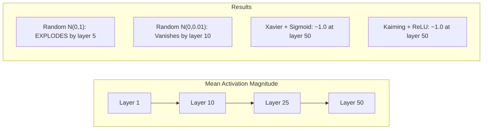
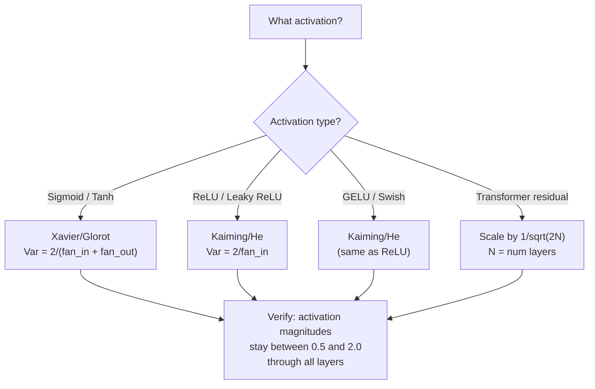

# 权重初始化与训练稳定性

> 初始化错了，训练根本起不来。初始化对了，50 层也能像 3 层一样平稳训练。

**类型:** Build
**语言:** Python
**先修:** Lesson 03.04 (Activation Functions), Lesson 03.07 (Regularization)
**时间:** ~90 minutes

## 学习目标

- 实现 zero、random、Xavier/Glorot、Kaiming/He 初始化策略，并测量它们对 50 层中激活幅度的影响
- 推导为什么 Xavier 初始化使用 Var(w) = 2/(fan_in + fan_out)，而 Kaiming 使用 Var(w) = 2/fan_in
- 演示 zero initialization 的对称性问题，并解释为什么只靠随机尺度并不够
- 将正确的初始化策略匹配到激活函数：sigmoid/tanh 用 Xavier，ReLU/GELU 用 Kaiming

## 要解决的问题

把所有权重都初始化为零。什么也学不到。每个神经元都计算同一个函数、收到同一个梯度，并以完全相同的方式更新。即使训练 10,000 个 epoch，你的 512 神经元隐藏层仍然只是同一个神经元的 512 个副本。你为 512 个参数付出了代价，却只得到了 1 个有效参数。

把权重初始化得太大。激活会沿着网络爆炸。到第 10 层，数值达到 1e15。到第 20 层，它们溢出成 infinity。梯度会沿反方向走同样的轨迹。

从标准正态分布随机初始化。3 层时还能工作。到 50 层时，信号会根据随机尺度是稍小还是稍大而坍缩为零或炸到 infinity。“能工作”和“坏掉”之间的边界像刀刃一样薄。

权重初始化是深度学习中最被低估的决策。架构会得到论文。优化器会得到博客文章。初始化通常只得到一个脚注。但如果它错了，其他一切都不重要——网络在训练开始前就已经死了。

## 核心概念

### 对称性问题

一层中的每个神经元都有相同结构：用权重乘输入、加上偏置、应用激活函数。如果所有权重都从同一个值开始（零是极端情况），每个神经元都会计算相同输出。在反向传播期间，每个神经元收到相同梯度。在更新步骤中，每个神经元改变相同数量。

你被卡住了。网络有数百个参数，但它们全部同步移动。这叫做对称性，而随机初始化是打破它的直接办法。每个神经元从权重空间中的不同点开始，因此每个神经元会学习不同特征。

但“随机”还不够。随机性的*尺度*决定网络能不能训练。

### 跨层方差传播

考虑一个有 fan_in 个输入的单层：

```text
z = w1*x1 + w2*x2 + ... + w_n*x_n
```

如果每个权重 wi 都来自方差为 Var(w) 的分布，并且每个输入 xi 的方差是 Var(x)，输出方差就是：

```text
Var(z) = fan_in * Var(w) * Var(x)
```

如果 Var(w) = 1 且 fan_in = 512，输出方差就是输入方差的 512 倍。10 层之后：512^10 = 1.2e27。你的信号已经爆炸。

如果 Var(w) = 0.001，输出方差每层缩小 0.001 * 512 = 0.512。10 层之后：0.512^10 = 0.00013。你的信号已经消失。

目标：选择 Var(w)，让 Var(z) = Var(x)。信号幅度在层与层之间保持恒定。

### Xavier/Glorot 初始化

Glorot and Bengio (2010) 为 sigmoid 和 tanh 激活推导出了解法。为了在前向和反向传播中都保持方差恒定：

```text
Var(w) = 2 / (fan_in + fan_out)
```

实践中，权重从下面的分布采样：

```text
w ~ Uniform(-limit, limit)  where limit = sqrt(6 / (fan_in + fan_out))
```

或者：

```text
w ~ Normal(0, sqrt(2 / (fan_in + fan_out)))
```

这之所以有效，是因为 sigmoid 和 tanh 在零点附近近似线性，而恰当初始化后的激活正位于这个区域。方差可以在数十层中保持稳定。

### Kaiming/He 初始化

ReLU 会杀掉一半输出（所有负值都会变成零）。有效 fan_in 被减半，因为平均来说一半输入会被置零。Xavier 初始化没有考虑这一点——它低估了所需方差。

He et al. (2015) 调整了公式：

```text
Var(w) = 2 / fan_in
```

权重从下面的分布采样：

```text
w ~ Normal(0, sqrt(2 / fan_in))
```

这个因子 2 补偿了 ReLU 将一半激活置零的影响。没有它，信号每层会缩小约 0.5 倍。50 层时：0.5^50 = 8.8e-16。Kaiming 初始化会防止这种情况。

### Transformer 初始化

GPT-2 引入了另一种模式。残差连接会把每个子层的输出加到它的输入上：

```text
x = x + sublayer(x)
```

每次相加都会增加方差。有 N 个残差层时，方差会按 N 成比例增长。GPT-2 将残差层权重按 1/sqrt(2N) 缩放，其中 N 是层数。这会让累积信号幅度保持稳定。

Llama 3（405B 参数，126 层）使用了类似方案。没有这种缩放，残差流会在 126 层 attention 和 feedforward block 中无界增长。

```mermaid
flowchart TD
    subgraph "Zero Init"
        Z1["Layer 1<br/>All weights = 0"] --> Z2["Layer 2<br/>All neurons identical"]
        Z2 --> Z3["Layer 3<br/>Still identical"]
        Z3 --> ZR["Result: 1 effective neuron<br/>regardless of width"]
    end

    subgraph "Xavier Init"
        X1["Layer 1<br/>Var = 2/(fan_in+fan_out)"] --> X2["Layer 2<br/>Signal stable"]
        X2 --> X3["Layer 50<br/>Signal stable"]
        X3 --> XR["Result: Trains with<br/>sigmoid/tanh"]
    end

    subgraph "Kaiming Init"
        K1["Layer 1<br/>Var = 2/fan_in"] --> K2["Layer 2<br/>Signal stable"]
        K2 --> K3["Layer 50<br/>Signal stable"]
        K3 --> KR["Result: Trains with<br/>ReLU/GELU"]
    end
```



### 50 层中的激活幅度



### 选择正确的初始化



## 动手实现

### Step 1: 初始化策略

初始化权重矩阵的四种方式。每个函数都返回一个 list of lists（二维矩阵），其中 fan_in 是列数，fan_out 是行数。

```python
import math
import random


def zero_init(fan_in, fan_out):
    return [[0.0 for _ in range(fan_in)] for _ in range(fan_out)]


def random_init(fan_in, fan_out, scale=1.0):
    return [[random.gauss(0, scale) for _ in range(fan_in)] for _ in range(fan_out)]


def xavier_init(fan_in, fan_out):
    std = math.sqrt(2.0 / (fan_in + fan_out))
    return [[random.gauss(0, std) for _ in range(fan_in)] for _ in range(fan_out)]


def kaiming_init(fan_in, fan_out):
    std = math.sqrt(2.0 / fan_in)
    return [[random.gauss(0, std) for _ in range(fan_in)] for _ in range(fan_out)]
```

### Step 2: 激活函数

我们需要 sigmoid、tanh 和 ReLU，以便用每种初始化策略预期对应的激活函数来测试它。

```python
def sigmoid(x):
    x = max(-500, min(500, x))
    return 1.0 / (1.0 + math.exp(-x))


def tanh_act(x):
    return math.tanh(x)


def relu(x):
    return max(0.0, x)
```

### Step 3: 穿过 50 层的前向传播

让随机数据穿过一个深层网络，并测量每一层的平均激活幅度。

```python
def forward_deep(init_fn, activation_fn, n_layers=50, width=64, n_samples=100):
    random.seed(42)
    layer_magnitudes = []

    inputs = [[random.gauss(0, 1) for _ in range(width)] for _ in range(n_samples)]

    for layer_idx in range(n_layers):
        weights = init_fn(width, width)
        biases = [0.0] * width

        new_inputs = []
        for sample in inputs:
            output = []
            for neuron_idx in range(width):
                z = sum(weights[neuron_idx][j] * sample[j] for j in range(width)) + biases[neuron_idx]
                output.append(activation_fn(z))
            new_inputs.append(output)
        inputs = new_inputs

        magnitudes = []
        for sample in inputs:
            magnitudes.append(sum(abs(v) for v in sample) / width)
        mean_mag = sum(magnitudes) / len(magnitudes)
        layer_magnitudes.append(mean_mag)

    return layer_magnitudes
```

### Step 4: 实验

运行所有组合：zero init、random N(0,1)、random N(0,0.01)、Xavier with sigmoid、Xavier with tanh、Kaiming with ReLU。打印关键层的幅度。

```python
def run_experiment():
    configs = [
        ("Zero init + Sigmoid", lambda fi, fo: zero_init(fi, fo), sigmoid),
        ("Random N(0,1) + ReLU", lambda fi, fo: random_init(fi, fo, 1.0), relu),
        ("Random N(0,0.01) + ReLU", lambda fi, fo: random_init(fi, fo, 0.01), relu),
        ("Xavier + Sigmoid", xavier_init, sigmoid),
        ("Xavier + Tanh", xavier_init, tanh_act),
        ("Kaiming + ReLU", kaiming_init, relu),
    ]

    print(f"{'Strategy':<30} {'L1':>10} {'L5':>10} {'L10':>10} {'L25':>10} {'L50':>10}")
    print("-" * 80)

    for name, init_fn, act_fn in configs:
        mags = forward_deep(init_fn, act_fn)
        row = f"{name:<30}"
        for idx in [0, 4, 9, 24, 49]:
            val = mags[idx]
            if val > 1e6:
                row += f" {'EXPLODED':>10}"
            elif val < 1e-6:
                row += f" {'VANISHED':>10}"
            else:
                row += f" {val:>10.4f}"
        print(row)
```

### Step 5: 对称性演示

展示 zero init 会产生完全相同的神经元。

```python
def symmetry_demo():
    random.seed(42)
    weights = zero_init(2, 4)
    biases = [0.0] * 4

    inputs = [0.5, -0.3]
    outputs = []
    for neuron_idx in range(4):
        z = sum(weights[neuron_idx][j] * inputs[j] for j in range(2)) + biases[neuron_idx]
        outputs.append(sigmoid(z))

    print("\nSymmetry Demo (4 neurons, zero init):")
    for i, out in enumerate(outputs):
        print(f"  Neuron {i}: output = {out:.6f}")
    all_same = all(abs(outputs[i] - outputs[0]) < 1e-10 for i in range(len(outputs)))
    print(f"  All identical: {all_same}")
    print(f"  Effective parameters: 1 (not {len(weights) * len(weights[0])})")
```

### Step 6: 逐层幅度报告

打印一张展示 50 层激活幅度的可视化条形图。

```python
def magnitude_report(name, magnitudes):
    print(f"\n{name}:")
    for i, mag in enumerate(magnitudes):
        if i % 5 == 0 or i == len(magnitudes) - 1:
            if mag > 1e6:
                bar = "X" * 50 + " EXPLODED"
            elif mag < 1e-6:
                bar = "." + " VANISHED"
            else:
                bar_len = min(50, max(1, int(mag * 10)))
                bar = "#" * bar_len
            print(f"  Layer {i+1:3d}: {bar} ({mag:.6f})")
```

## 实际使用

PyTorch 将这些初始化作为内置函数提供：

```python
import torch
import torch.nn as nn

layer = nn.Linear(512, 256)

nn.init.xavier_uniform_(layer.weight)
nn.init.xavier_normal_(layer.weight)

nn.init.kaiming_uniform_(layer.weight, nonlinearity='relu')
nn.init.kaiming_normal_(layer.weight, nonlinearity='relu')

nn.init.zeros_(layer.bias)
```

当你调用 `nn.Linear(512, 256)` 时，PyTorch 默认使用 Kaiming uniform initialization。这就是大多数简单网络“开箱即用”的原因——PyTorch 已经做出了正确选择。但当你构建自定义架构，或者深度超过 20 层时，就需要理解发生了什么，并可能覆盖默认行为。

对 transformers 来说，HuggingFace 模型通常会在它们的 `_init_weights` 方法中处理初始化。GPT-2 的实现会按 1/sqrt(N) 缩放残差投影。如果你从零构建 transformer，就需要自己加上这一步。

## 交付成果

本课产出：
- `outputs/prompt-init-strategy.md`——一个用于诊断权重初始化问题并推荐正确策略的 prompt

## 练习

1. 添加 LeCun initialization（Var = 1/fan_in，为 SELU activation 设计）。运行 50 层实验，比较 LeCun init + tanh 与 Xavier + tanh。

2. 实现 GPT-2 residual scaling：在加入 residual stream 之前，将每一层输出乘以 1/sqrt(2*N)。分别在有缩放和无缩放时运行 50 层，测量 residual magnitude 增长速度。

3. 创建一个 “init health check” 函数，它接收网络层维度和 activation type，然后推荐正确初始化，并在当前初始化会造成问题时发出警告。

4. 用 fan_in = 16 和 fan_in = 1024 运行实验。Xavier 和 Kaiming 会适配 fan_in，但 random init 不会。展示随着层变大，“能工作”和“会崩掉”之间的间距如何变宽。

5. 实现 orthogonal initialization（生成一个 random matrix，计算其 SVD，使用正交矩阵 U）。在 50 层 ReLU networks 上与 Kaiming 对比。

## 关键术语

| Term | What people say | What it actually means |
|------|----------------|----------------------|
| Weight initialization | “随机设置起始权重” | 选择初始权重值的策略，它决定网络是否有可能训练起来 |
| Symmetry breaking | “让神经元变得不同” | 使用随机初始化来确保神经元学习不同特征，而不是计算完全相同的函数 |
| Fan-in | “一个神经元的输入数量” | 传入连接的数量，它决定输入方差如何在加权和中累积 |
| Fan-out | “一个神经元的输出数量” | 传出连接的数量，与反向传播期间维持梯度方差有关 |
| Xavier/Glorot init | “sigmoid 初始化” | Var(w) = 2/(fan_in + fan_out)，设计用于在 sigmoid 和 tanh 激活中保持方差 |
| Kaiming/He init | “ReLU 初始化” | Var(w) = 2/fan_in，考虑了 ReLU 会把一半激活置零 |
| Variance propagation | “信号如何穿过层增长或缩小” | 根据权重尺度逐层分析激活方差如何变化的数学方法 |
| Residual scaling | “GPT-2 的初始化技巧” | 将 residual connection weights 按 1/sqrt(2N) 缩放，防止方差在 N 个 transformer layers 中增长 |
| Dead network | “什么也训练不起来” | 一个网络由于糟糕初始化导致所有梯度为零或所有激活饱和 |
| Exploding activations | “数值变成 infinity” | 权重方差过高时，激活幅度会穿过层指数级增长 |

## 延伸阅读

- Glorot & Bengio, “Understanding the difficulty of training deep feedforward neural networks” (2010)——原始 Xavier initialization 论文，包含方差分析
- He et al., “Delving Deep into Rectifiers” (2015)——介绍面向 ReLU networks 的 Kaiming initialization
- Radford et al., “Language Models are Unsupervised Multitask Learners” (2019)——包含 residual scaling initialization 的 GPT-2 论文
- Mishkin & Matas, “All You Need is a Good Init” (2016)——layer-sequential unit-variance initialization，一种区别于解析公式的经验替代方案
