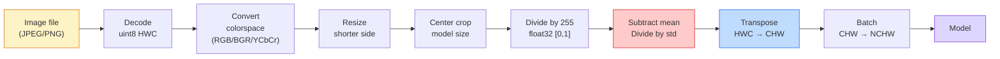
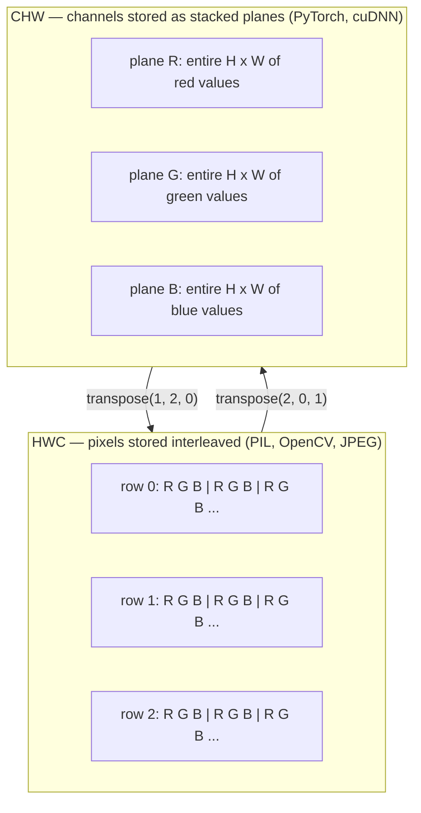

# 图像基础 — 像素、通道、色彩空间

> 图像是光样本组成的张量。你将使用的每个视觉模型，都从这一事实开始。

**类型:** Build
**语言:** Python
**先修:** Phase 1 Lesson 12 (Tensor Operations), Phase 3 Lesson 11 (Intro to PyTorch)
**时间:** ~45 minutes

## 学习目标

- 解释连续场景如何被离散化为像素，以及采样/量化决策为什么会为每个下游模型设定上限
- 将图像作为 NumPy 数组读取、切片和检查，并熟练在 HWC 与 CHW 布局之间切换
- 在 RGB、grayscale、HSV 和 YCbCr 之间转换，并说明每种色彩空间存在的理由
- 按照 torchvision 期望的方式精确应用像素级预处理（normalize、standardize、resize、channel-first）

## 要解决的问题

你读到的每篇论文、下载的每个 pretrained weight、调用的每个视觉 API，都假设输入有某种特定编码。把 `uint8` 图像传给期望 `float32` 的模型，它仍然会运行，并且悄悄产出垃圾结果。把 BGR 喂给在 RGB 上训练的网络，准确率可能直接掉十个百分点。把 channels-last 输入交给期望 channels-first 的模型，第一层 conv 会把 height 当成特征通道。这些问题通常不会报错，只会毁掉你的指标，然后让你花一周时间追一个其实藏在文件加载方式里的 bug。

一旦你知道卷积在什么东西上滑动，convolution 本身并不复杂。难点在于，“一张图像”对 camera、JPEG decoder、PIL、OpenCV、torchvision 和 CUDA kernel 来说并不完全相同。每个栈都有自己的轴顺序、字节范围和通道约定。不能把这些约定理清楚的视觉工程师，会交付损坏的 pipeline。

本课会补牢基础，让本阶段后面的内容可以建立在它之上。学完后，你会知道像素是什么，为什么每个像素有三个数字而不是一个，`normalize with ImageNet stats` 实际做了什么，以及如何在本阶段每节课都会默认使用的两三种布局之间移动。

## 核心概念

### 预处理 pipeline 总览

每个生产视觉系统都是同一串可逆变换。任一步出错，模型看到的输入就会不同于训练时的输入。



红色和蓝色两个框是 80% 静默失败所在的位置：遗漏 standardization，以及布局错误。

### 像素是样本，不是方块

相机传感器会统计落在微小 detector 网格上的光子。每个 detector 会在一小段时间内积分光照，并输出与命中光子数量成比例的电压。随后传感器把这个电压离散化为整数。一个 detector 就变成一个像素。

```text
Continuous scene                 Sensor grid                     Digital image
(infinite detail)                (H x W detectors)               (H x W integers)

    ~~~~~                        +--+--+--+--+--+                 210 198 180 155 120
   ~   ~   ~                     |  |  |  |  |  |                 205 195 178 152 118
  ~ light ~      ---->           +--+--+--+--+--+     ---->       200 190 175 150 115
   ~~~~~                         |  |  |  |  |  |                 195 185 170 148 112
                                 +--+--+--+--+--+                 188 180 165 145 108
```

这一步发生两个选择，它们会固定所有下游工作的上限：

- **空间采样** 决定场景中每一度对应多少 detector。太少，边缘会变成锯齿（aliasing）；太多，存储和计算会爆炸。
- **强度量化** 决定电压被分到多细的桶里。8 bits 给出 256 个级别，是显示图像的标准。10、12、16 bits 给出更平滑的渐变，对医学影像、HDR 和 raw sensor pipeline 很重要。

像素不是有面积的彩色小方块，而是单次测量。当你 resize 或 rotate 时，你是在重采样这个测量网格。

### 为什么是三个通道

一个 detector 会统计整个可见光谱上的光子，也就是 grayscale。为了得到颜色，传感器会在网格上覆盖 red、green、blue filter 组成的 mosaic。经过 demosaicing 后，每个空间位置都有三个整数：附近 red-filtered、green-filtered、blue-filtered detector 的响应。这三个整数就是像素的 RGB triplet。

```text
One pixel in memory:

    (R, G, B) = (210, 140, 30)   <- reddish-orange

An H x W RGB image:

    shape (H, W, 3)     stored as   H rows of W pixels of 3 values
                                    each in [0, 255] for uint8
```

三并不神奇。Depth camera 会增加 Z channel。Satellite 会增加 infrared 和 ultraviolet bands。Medical scan 通常有一个 channel（X-ray、CT），也可能有很多 channel（hyperspectral）。通道数是最后一个轴；conv layer 会学习如何跨通道混合。

### 两种布局约定：HWC 和 CHW

同一个 tensor，两种排序。每个库都会选一种。

```text
HWC (height, width, channels)           CHW (channels, height, width)

   W ->                                    H ->
  +-----+-----+-----+                     +-----+-----+
H |R G B|R G B|R G B|                   C |R R R R R R|
| +-----+-----+-----+                   | +-----+-----+
v |R G B|R G B|R G B|                   v |G G G G G G|
  +-----+-----+-----+                     +-----+-----+
                                          |B B B B B B|
                                          +-----+-----+

   PIL, OpenCV, matplotlib,              PyTorch, most deep learning
   almost every image file on disk       frameworks, cuDNN kernels
```

CHW 存在，是因为 convolution kernel 会沿 H 和 W 滑动。把 channel axis 放在最前面，意味着每个 kernel 会看到每个 channel 上连续的 2D plane，更容易向量化。磁盘格式保持 HWC，因为这匹配传感器输出 scanline 的方式。

你会敲上千遍的一行转换：

```text
img_chw = img_hwc.transpose(2, 0, 1)      # NumPy
img_chw = img_hwc.permute(2, 0, 1)        # PyTorch tensor
```

内存布局，可视化如下：



### Byte range 与 dtype

三种约定最常见：

| 约定 | dtype | 范围 | 出现场景 |
|------------|-------|-------|------------------|
| Raw | `uint8` | [0, 255] | 磁盘文件、PIL、OpenCV 输出 |
| Normalized | `float32` | [0.0, 1.0] | `img.astype('float32') / 255` 之后 |
| Standardized | `float32` | 大约 [-2, +2] | 减去 mean 并除以 std 之后 |

Convolutional network 是在 standardized input 上训练的。ImageNet stats `mean=[0.485, 0.456, 0.406]`、`std=[0.229, 0.224, 0.225]` 是完整 ImageNet 训练集三个通道的算术 mean 和 standard deviation，在 [0, 1] normalized pixels 上计算得到。把 raw `uint8` 喂给期望 standardized float 的模型，是应用视觉中最常见的静默失败。

### 色彩空间以及它们存在的原因

RGB 是采集格式，但对模型来说，它并不总是最有用的表示。

```text
 RGB               HSV                       YCbCr / YUV

 R red             H hue (angle 0-360)       Y luminance (brightness)
 G green           S saturation (0-1)        Cb chroma blue-yellow
 B blue            V value/brightness (0-1)  Cr chroma red-green

 Linear to         Separates color from      Separates brightness from
 sensor output     brightness. Useful for    color. JPEG and most video
                   color thresholding, UI    codecs compress the chroma
                   sliders, simple filters   channels harder because the
                                             human eye is less sensitive
                                             to chroma detail than to Y.
```

对大多数现代 CNN 来说，你会喂 RGB。你会在这些场景中遇到其他空间：

- **HSV** — classical CV code、color-based segmentation、white-balancing。
- **YCbCr** — 读取 JPEG internals、video pipeline、只在 Y 上操作的 super-resolution model。
- **Grayscale** — OCR、document model，以及 color 是 nuisance variable 而不是 signal 的场景。

从 RGB 到 grayscale 是加权和，不是平均值，因为人眼对绿色比对红色或蓝色更敏感：

```text
Y = 0.299 R + 0.587 G + 0.114 B       (ITU-R BT.601, the classic weights)
```

### Aspect ratio、resizing 与 interpolation

每个模型都有固定输入尺寸（大多数 ImageNet classifier 是 224x224，现代 detector 常见 384x384 或 512x512）。你的图像很少刚好匹配。真正重要的是三种 resize 选择：

- **Resize shorter side, then center crop** — 标准 ImageNet recipe。保留 aspect ratio，丢弃边缘的一条像素带。
- **Resize and pad** — 保留 aspect ratio 和每个像素，添加黑边。detection 和 OCR 的标准做法。
- **Resize directly to target** — 拉伸图像。便宜，会扭曲几何形状，但对很多 classification task 足够好。

当新网格与旧网格不对齐时，interpolation method 会决定中间像素如何计算：

```text
Nearest neighbour     fastest, blocky, only choice for masks/labels
Bilinear              fast, smooth, default for most image resizing
Bicubic               slower, sharper on upscaling
Lanczos               slowest, best quality, used for final display
```

经验法则：训练用 bilinear；你要肉眼查看的资产用 bicubic 或 lanczos；任何包含 integer class ID 的东西用 nearest。

## 动手实现

### Step 1: 加载图像并检查它的 shape

使用 Pillow 加载任意 JPEG 或 PNG，转换为 NumPy，并打印拿到的内容。为了得到可离线运行的确定性示例，这里合成一张图像。

```python
import numpy as np
from PIL import Image

def synthetic_rgb(h=128, w=192, seed=0):
    rng = np.random.default_rng(seed)
    yy, xx = np.meshgrid(np.linspace(0, 1, h), np.linspace(0, 1, w), indexing="ij")
    r = (np.sin(xx * 6) * 0.5 + 0.5) * 255
    g = yy * 255
    b = (1 - yy) * xx * 255
    rgb = np.stack([r, g, b], axis=-1) + rng.normal(0, 6, (h, w, 3))
    return np.clip(rgb, 0, 255).astype(np.uint8)

arr = synthetic_rgb()
# Or load from disk:
# arr = np.asarray(Image.open("your_image.jpg").convert("RGB"))

print(f"type:   {type(arr).__name__}")
print(f"dtype:  {arr.dtype}")
print(f"shape:  {arr.shape}     # (H, W, C)")
print(f"min:    {arr.min()}")
print(f"max:    {arr.max()}")
print(f"pixel at (0, 0): {arr[0, 0]}")
```

期望输出：`shape: (H, W, 3)`、`dtype: uint8`、范围 `[0, 255]`。无论字节来自相机、JPEG decoder，还是 synthetic generator，这都是磁盘上的 canonical representation。

### Step 2: 拆分通道并重排布局

分别取出 R、G、B，然后为 PyTorch 从 HWC 转换到 CHW。

```python
R = arr[:, :, 0]
G = arr[:, :, 1]
B = arr[:, :, 2]
print(f"R shape: {R.shape}, mean: {R.mean():.1f}")
print(f"G shape: {G.shape}, mean: {G.mean():.1f}")
print(f"B shape: {B.shape}, mean: {B.mean():.1f}")

arr_chw = arr.transpose(2, 0, 1)
print(f"\nHWC shape: {arr.shape}")
print(f"CHW shape: {arr_chw.shape}")
```

三个 grayscale plane，每个通道一个。CHW 只是重排轴；在内存布局允许时，严格来说不一定需要复制数据。

### Step 3: Grayscale 与 HSV 转换

先做 weighted-sum grayscale，再手写 RGB-to-HSV。

```python
def rgb_to_grayscale(rgb):
    weights = np.array([0.299, 0.587, 0.114], dtype=np.float32)
    return (rgb.astype(np.float32) @ weights).astype(np.uint8)

def rgb_to_hsv(rgb):
    rgb_f = rgb.astype(np.float32) / 255.0
    r, g, b = rgb_f[..., 0], rgb_f[..., 1], rgb_f[..., 2]
    cmax = np.max(rgb_f, axis=-1)
    cmin = np.min(rgb_f, axis=-1)
    delta = cmax - cmin

    h = np.zeros_like(cmax)
    mask = delta > 0
    rmax = mask & (cmax == r)
    gmax = mask & (cmax == g)
    bmax = mask & (cmax == b)
    h[rmax] = ((g[rmax] - b[rmax]) / delta[rmax]) % 6
    h[gmax] = ((b[gmax] - r[gmax]) / delta[gmax]) + 2
    h[bmax] = ((r[bmax] - g[bmax]) / delta[bmax]) + 4
    h = h * 60.0

    s = np.where(cmax > 0, delta / cmax, 0)
    v = cmax
    return np.stack([h, s, v], axis=-1)

gray = rgb_to_grayscale(arr)
hsv = rgb_to_hsv(arr)
print(f"gray shape: {gray.shape}, range: [{gray.min()}, {gray.max()}]")
print(f"hsv   shape: {hsv.shape}")
print(f"hue range: [{hsv[..., 0].min():.1f}, {hsv[..., 0].max():.1f}] degrees")
print(f"sat range: [{hsv[..., 1].min():.2f}, {hsv[..., 1].max():.2f}]")
print(f"val range: [{hsv[..., 2].min():.2f}, {hsv[..., 2].max():.2f}]")
```

Hue 的输出单位是 degrees，saturation 和 value 位于 [0, 1]。这匹配 OpenCV 的 `hsv_full` convention。

### Step 4: Normalize、standardize，并反向还原

从 raw byte 变成 pretrained ImageNet model 期望的精确 tensor，然后再还原回去。

```python
mean = np.array([0.485, 0.456, 0.406], dtype=np.float32)
std = np.array([0.229, 0.224, 0.225], dtype=np.float32)

def preprocess_imagenet(rgb_uint8):
    x = rgb_uint8.astype(np.float32) / 255.0
    x = (x - mean) / std
    x = x.transpose(2, 0, 1)
    return x

def deprocess_imagenet(chw_float32):
    x = chw_float32.transpose(1, 2, 0)
    x = x * std + mean
    x = np.clip(x * 255.0, 0, 255).astype(np.uint8)
    return x

x = preprocess_imagenet(arr)
print(f"preprocessed shape: {x.shape}     # (C, H, W)")
print(f"preprocessed dtype: {x.dtype}")
print(f"preprocessed mean per channel:  {x.mean(axis=(1, 2)).round(3)}")
print(f"preprocessed std  per channel:  {x.std(axis=(1, 2)).round(3)}")

roundtrip = deprocess_imagenet(x)
max_diff = np.abs(roundtrip.astype(int) - arr.astype(int)).max()
print(f"roundtrip max pixel diff: {max_diff}    # should be 0 or 1")
```

每个通道的 mean 应该接近零，std 接近一。这个 preprocess/deprocess 对，正是每个 torchvision `transforms.Normalize` 调用在底层做的事情。

### Step 5: 使用三种 interpolation method 进行 resize

在放大图像上比较 nearest、bilinear 和 bicubic，让差异更容易看见。

```python
target = (arr.shape[0] * 3, arr.shape[1] * 3)

nearest = np.asarray(Image.fromarray(arr).resize(target[::-1], Image.NEAREST))
bilinear = np.asarray(Image.fromarray(arr).resize(target[::-1], Image.BILINEAR))
bicubic = np.asarray(Image.fromarray(arr).resize(target[::-1], Image.BICUBIC))

def local_roughness(x):
    gy = np.diff(x.astype(float), axis=0)
    gx = np.diff(x.astype(float), axis=1)
    return float(np.abs(gy).mean() + np.abs(gx).mean())

for name, out in [("nearest", nearest), ("bilinear", bilinear), ("bicubic", bicubic)]:
    print(f"{name:>8}  shape={out.shape}  roughness={local_roughness(out):6.2f}")
```

nearest 的 roughness 分数最高，因为它保留硬边缘。bilinear 最平滑。bicubic 介于两者之间，既保留主观锐度，又没有阶梯状 artifact。

## 实际使用

`torchvision.transforms` 会把上面的所有步骤打包成一个可组合 pipeline。下面的代码精确复现 `preprocess_imagenet` 的行为，并额外加入 resize 和 crop。

```python
import torch
from torchvision import transforms
from PIL import Image

img = Image.fromarray(synthetic_rgb(256, 256))

pipeline = transforms.Compose([
    transforms.Resize(256),
    transforms.CenterCrop(224),
    transforms.ToTensor(),
    transforms.Normalize(mean=[0.485, 0.456, 0.406], std=[0.229, 0.224, 0.225]),
])

x = pipeline(img)
print(f"tensor type:  {type(x).__name__}")
print(f"tensor dtype: {x.dtype}")
print(f"tensor shape: {tuple(x.shape)}      # (C, H, W)")
print(f"per-channel mean: {x.mean(dim=(1, 2)).tolist()}")
print(f"per-channel std:  {x.std(dim=(1, 2)).tolist()}")

batch = x.unsqueeze(0)
print(f"\nbatched shape: {tuple(batch.shape)}   # (N, C, H, W) — ready for a model")
```

四步，严格按这个顺序：`Resize(256)` 把 shorter side 缩放到 256；`CenterCrop(224)` 从中间取一个 224x224 patch；`ToTensor()` 除以 255，并把 HWC 换成 CHW；`Normalize` 减去 ImageNet mean 并除以 std。颠倒顺序会静默改变到达模型的内容。

## 交付成果

本课产出：

- `outputs/prompt-vision-preprocessing-audit.md` — 一个 prompt，可把任意 model card 或 dataset card 转换成团队必须遵守的精确 preprocessing invariant checklist。
- `outputs/skill-image-tensor-inspector.md` — 一个 skill：给定任何 image-shaped tensor 或 array，报告 dtype、layout、range，以及它看起来是 raw、normalized 还是 standardized。

## 练习

1. **(Easy)** 分别用 OpenCV (`cv2.imread`) 和 Pillow 加载一张 JPEG。打印二者的 shape 以及 `(0, 0)` 处的 pixel。解释 channel-order difference，然后写一行 conversion，让 OpenCV array 与 Pillow array 完全相同。
2. **(Medium)** 编写 `standardize(img, mean, std)` 及其 inverse，使二者在任意 uint8 image 上通过 `roundtrip_max_diff <= 1` 测试。你的函数必须能用同一个调用同时处理 HWC 的单张图像，以及 NCHW 的 batch。
3. **(Hard)** 取一个 3-channel ImageNet-standardized tensor，让它通过一个 1x1 conv，该 conv 学习 RGB 到单个 grayscale channel 的 weighted mixture。把权重初始化为 `[0.299, 0.587, 0.114]`，冻结它们，并验证输出在 floating-point error 范围内匹配你的手写 `rgb_to_grayscale`。还有哪些 classical color-space transform 可以写成 1x1 convolution？

## 关键术语

| 术语 | 常见说法 | 实际含义 |
|------|----------------|----------------------|
| Pixel | “彩色方块” | 一个网格位置上的一次光强样本；彩色为三个数字，grayscale 为一个数字 |
| Channel | “颜色” | 堆叠成图像 tensor 的并行空间网格之一；在 HWC 中是最后一个轴，在 CHW 中是第一个轴 |
| HWC / CHW | “shape” | 图像 tensor 的轴顺序；磁盘和 PIL 使用 HWC，PyTorch 和 cuDNN 使用 CHW |
| Normalize | “缩放图像” | 除以 255，让 pixel 位于 [0, 1]；必要但不充分 |
| Standardize | “零中心化” | 按通道减去 mean 并除以 std，使输入分布匹配模型训练时看到的分布 |
| Grayscale conversion | “对通道取平均” | 使用 0.299/0.587/0.114 系数的 weighted sum，匹配人类 luminance perception |
| Interpolation | “resize 怎么选像素” | 当新网格与旧网格不对齐时决定输出值的规则；label 用 nearest，训练用 bilinear，显示用 bicubic |
| Aspect ratio | “宽除以高” | 区分 “resize and pad” 与 “resize and stretch” 的比例 |

## 延伸阅读

- [Charles Poynton — A Guided Tour of Color Space](https://poynton.ca/PDFs/Guided_tour.pdf) — 对为什么存在这么多 color space、以及何时使用各自最清晰的技术说明
- [PyTorch Vision Transforms Docs](https://pytorch.org/vision/stable/transforms.html) — 你会在生产中真正组合的完整 transforms pipeline
- [How JPEG Works (Colt McAnlis)](https://www.youtube.com/watch?v=F1kYBnY6mwg) — 关于 chroma subsampling、DCT，以及 JPEG 为什么编码 YCbCr 而不是 RGB 的清晰可视化导览
- [ImageNet Preprocessing Conventions (torchvision models)](https://pytorch.org/vision/stable/models.html) — `mean=[0.485, 0.456, 0.406]` 的事实来源，以及 model zoo 中每个模型为什么都期望它
