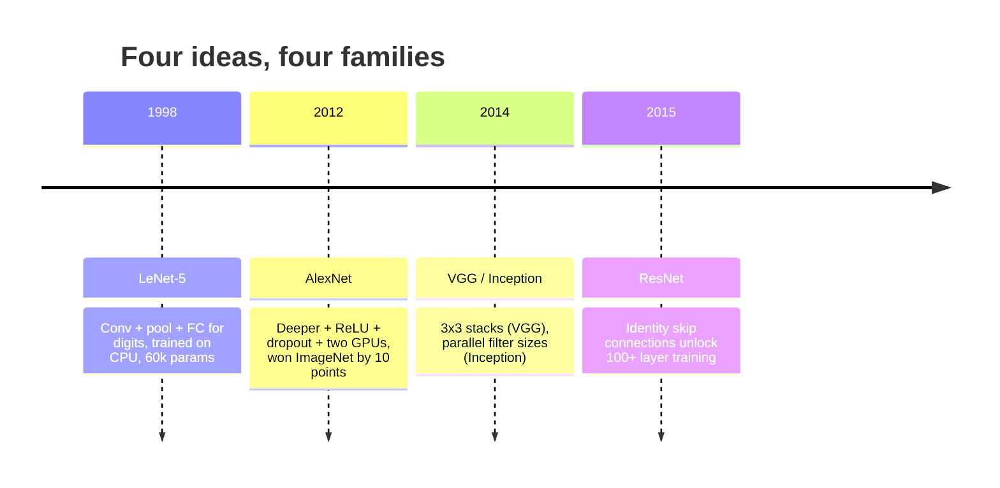
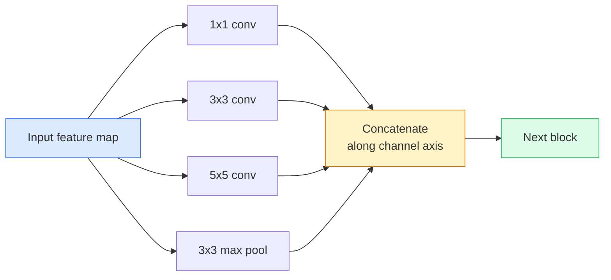
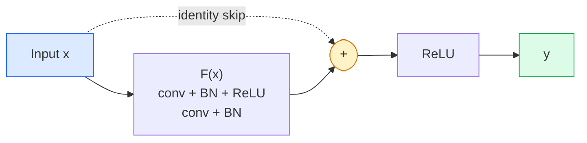

# CNNs — 从 LeNet 到 ResNet

> 过去三十年里的每个主要 CNN，本质上都是 conv–nonlinearity–downsample 这套 recipe，再加上一个新想法。按顺序学清这些想法。

**类型:** Learn + Build
**语言:** Python
**先修:** Phase 3 Lesson 11 (PyTorch), Phase 4 Lesson 01 (Image Fundamentals), Phase 4 Lesson 02 (Convolutions from Scratch)
**时间:** ~75 minutes

## 学习目标

- 追踪 LeNet-5 -> AlexNet -> VGG -> Inception -> ResNet 的架构谱系，并说出每个 family 贡献的一个新想法
- 在 PyTorch 中实现 LeNet-5、一个 VGG-style block 和一个 ResNet BasicBlock，每个都控制在 40 行以内
- 解释 residual connection 为什么能把 1,000-layer network 从不可训练变成 state-of-the-art
- 阅读现代 backbone（ResNet-18、ResNet-50），并在查看源码前预测它的 output shape、receptive field 和 parameter count

## 要解决的问题

2011 年，最好的 ImageNet classifier 约为 74% top-5 accuracy。2012 年 AlexNet 达到 85%。2015 年 ResNet 达到 96%。没有新数据。没有新一代 GPU。这些收益来自 architecture idea。能工作的视觉工程师必须知道哪个想法来自哪篇 paper，因为你在 2026 年交付的每个 production backbone，都是同一批组件的重新组合；也因为这些想法不断迁移：grouped conv 从 CNN 走到 transformer，residual connection 从 ResNet 走到每个 LLM，batch normalisation 活在 diffusion model 里。

按顺序学习这些网络，也能让你免疫一个常见错误：明明 LeNet-sized network 就能解决问题，却去拿最大的可用模型。MNIST 不需要 ResNet。知道每个 family 的 scaling curve，会告诉你应该坐在曲线的哪一段。

## 核心概念

### 改变视觉的四个想法



Classical vision 中没有其他跳跃像这四次一样重要。

### LeNet-5 (1998)

Yann LeCun 的 digit recogniser。60,000 个参数。两个 conv-pool block、两个 fully connected layer、tanh activation。它定义了每个 CNN 继承的模板：

```text
input (1, 32, 32)
  conv 5x5 -> (6, 28, 28)
  avg pool 2x2 -> (6, 14, 14)
  conv 5x5 -> (16, 10, 10)
  avg pool 2x2 -> (16, 5, 5)
  flatten -> 400
  dense -> 120
  dense -> 84
  dense -> 10
```

现代世界称为 CNN 的一切，也就是交替的 convolution 与 downsampling，再接一个小 classifier head，都是层数更多、channel 更大、activation 更好的 LeNet。

### AlexNet (2012)

三个变化一起击穿了 ImageNet：

1. **ReLU** 替代 tanh。Gradient 不再消失。训练速度提升约六倍。
2. **Dropout** 用在 fully connected head 中。Regularisation 变成一层，而不是技巧。
3. **Depth and width**。五个 conv layer、三个 dense layer、60M 参数，在两块 GPU 上训练，并把模型拆分到两边。

论文的 Figure 2 仍然把 GPU split 展示为两条 parallel stream。那种 parallelism 是硬件 workaround，不是架构洞见；但上面的三个想法仍然存在于你使用的每个模型中。

### VGG (2014)

VGG 问了一个问题：如果只用 3x3 convolution，并且不断加深，会发生什么？

```text
stack:   conv 3x3 -> conv 3x3 -> pool 2x2
repeat:  16 or 19 conv layers
```

两个 3x3 conv 能看到与一个 5x5 conv 相同的输入区域，但参数更少（2*9*C^2 = 18C^2 vs 25*C^2），并且中间多一个 ReLU。VGG 把这个观察变成了一整套 architecture。它的简单性，即一种 block type 反复重复，使它成为之后所有工作的参照点。

代价：138M 参数，训练慢，inference 昂贵。

### Inception (2014，同年)

Google 对“我应该使用什么 kernel size？”的答案是：全部并行使用。



每个 branch 都会专门化：1x1 用于 channel mixing，3x3 用于 local texture，5x5 用于更大的 pattern，pooling 用于 shift-invariant feature；concat 让下一层选择有用的 branch。Inception v1 在每个 branch 内使用 1x1 convolution 作为 bottleneck，以保持 parameter count 合理。

### Degradation problem

到 2015 年，VGG-19 可行，VGG-32 不行。Depth 本应有帮助，但超过约 20 层后，training loss 和 test loss 都变差。这不是 overfitting，而是 optimiser 无法找到有用权重，因为 gradient 会穿过每一层乘性缩小。

```text
Plain deep network:
  y = f_L( f_{L-1}( ... f_1(x) ... ) )

Gradient wrt early layer:
  dL/dW_1 = dL/dy * df_L/df_{L-1} * ... * df_2/df_1 * df_1/dW_1

Each multiplicative term has magnitude roughly (weight magnitude) * (activation gain).
Stack 100 of them with gains < 1 and the gradient is effectively zero.
```

VGG 能在 19 层工作，是因为 batch norm（几乎同时发表）让 activation 保持良好缩放。但即使 batch norm 也无法拯救 30 多层以后的深度。

### ResNet (2015)

He、Zhang、Ren、Sun 提出一个改变，修复了一切：

```text
standard block:   y = F(x)
residual block:   y = F(x) + x
```

`+ x` 意味着这一层总能通过把 `F(x)` 推到零而选择什么都不做。一个 1,000-layer ResNet 现在至多和 1-layer network 一样差，因为每个额外 block 都有一个 trivial escape hatch。有了这个保证，optimiser 愿意让每个 block 变得 *稍微* 有用，而稍微有用的 block 堆叠 100 次，就是 state-of-the-art。



两种 block variant 到处都会出现：

- **BasicBlock**（ResNet-18、ResNet-34）：两个 3x3 conv，skip 跨过二者。
- **Bottleneck**（ResNet-50、-101、-152）：1x1 down、3x3 middle、1x1 up，skip 跨过三者。Channel count 很高时更便宜。

当 skip 必须跨过一次 downsample（stride=2）时，identity path 会被替换为 1x1 stride=2 conv，用来匹配 shape。

### 为什么 residual 不只对 vision 重要

这个想法其实不只是关于 image classification。它把 deep network 从“交叉手指祈祷 gradient 存活”变成可靠、可扩展的工程工具。你在下一阶段读到的每个 transformer，都会在每个 block 中拥有完全相同的 skip connection。没有 ResNet，就没有 GPT。

## 动手实现

### Step 1: LeNet-5

一个最小、忠实的 LeNet。Tanh activation、average pooling。唯一向现代性妥协的是，我们在下游使用 `nn.CrossEntropyLoss`，而不是原始的 Gaussian connections。

```python
import torch
import torch.nn as nn
import torch.nn.functional as F

class LeNet5(nn.Module):
    def __init__(self, num_classes=10):
        super().__init__()
        self.conv1 = nn.Conv2d(1, 6, kernel_size=5)
        self.conv2 = nn.Conv2d(6, 16, kernel_size=5)
        self.pool = nn.AvgPool2d(2)
        self.fc1 = nn.Linear(16 * 5 * 5, 120)
        self.fc2 = nn.Linear(120, 84)
        self.fc3 = nn.Linear(84, num_classes)

    def forward(self, x):
        x = self.pool(torch.tanh(self.conv1(x)))
        x = self.pool(torch.tanh(self.conv2(x)))
        x = torch.flatten(x, 1)
        x = torch.tanh(self.fc1(x))
        x = torch.tanh(self.fc2(x))
        return self.fc3(x)

net = LeNet5()
x = torch.randn(1, 1, 32, 32)
print(f"output: {net(x).shape}")
print(f"params: {sum(p.numel() for p in net.parameters()):,}")
```

期望输出：`output: torch.Size([1, 10])`，`params: 61,706`。这就是开启现代视觉的完整 digit classifier。

### Step 2: 一个 VGG block

一个 reusable block：两个 3x3 conv、ReLU、batch norm、max pool。

```python
class VGGBlock(nn.Module):
    def __init__(self, in_c, out_c):
        super().__init__()
        self.conv1 = nn.Conv2d(in_c, out_c, kernel_size=3, padding=1)
        self.bn1 = nn.BatchNorm2d(out_c)
        self.conv2 = nn.Conv2d(out_c, out_c, kernel_size=3, padding=1)
        self.bn2 = nn.BatchNorm2d(out_c)
        self.pool = nn.MaxPool2d(2)

    def forward(self, x):
        x = F.relu(self.bn1(self.conv1(x)))
        x = F.relu(self.bn2(self.conv2(x)))
        return self.pool(x)

class MiniVGG(nn.Module):
    def __init__(self, num_classes=10):
        super().__init__()
        self.stack = nn.Sequential(
            VGGBlock(3, 32),
            VGGBlock(32, 64),
            VGGBlock(64, 128),
        )
        self.head = nn.Sequential(
            nn.AdaptiveAvgPool2d(1),
            nn.Flatten(),
            nn.Linear(128, num_classes),
        )

    def forward(self, x):
        return self.head(self.stack(x))

net = MiniVGG()
x = torch.randn(1, 3, 32, 32)
print(f"output: {net(x).shape}")
print(f"params: {sum(p.numel() for p in net.parameters()):,}")
```

CIFAR-sized input 上的三个 VGG block、一个 adaptive pool、一个 linear layer。约 290k 参数。对 CIFAR-10 来说已经足够多。

### Step 3: 一个 ResNet BasicBlock

ResNet-18 和 ResNet-34 的核心 building block。

```python
class BasicBlock(nn.Module):
    def __init__(self, in_c, out_c, stride=1):
        super().__init__()
        self.conv1 = nn.Conv2d(in_c, out_c, kernel_size=3, stride=stride, padding=1, bias=False)
        self.bn1 = nn.BatchNorm2d(out_c)
        self.conv2 = nn.Conv2d(out_c, out_c, kernel_size=3, stride=1, padding=1, bias=False)
        self.bn2 = nn.BatchNorm2d(out_c)
        if stride != 1 or in_c != out_c:
            self.shortcut = nn.Sequential(
                nn.Conv2d(in_c, out_c, kernel_size=1, stride=stride, bias=False),
                nn.BatchNorm2d(out_c),
            )
        else:
            self.shortcut = nn.Identity()

    def forward(self, x):
        out = F.relu(self.bn1(self.conv1(x)))
        out = self.bn2(self.conv2(out))
        out = out + self.shortcut(x)
        return F.relu(out)
```

Conv layer 上的 `bias=False` 是 batch-norm convention：BN 的 beta parameter 已经处理 bias，因此再带 conv bias 是浪费。`shortcut` 只有在 stride 或 channel count 改变时才需要真正的 conv；否则它就是 no-op identity。

### Step 4: 一个 tiny ResNet

堆叠四组 BasicBlock，得到一个用于 CIFAR-sized input 的可工作 ResNet。

```python
class TinyResNet(nn.Module):
    def __init__(self, num_classes=10):
        super().__init__()
        self.stem = nn.Sequential(
            nn.Conv2d(3, 32, kernel_size=3, stride=1, padding=1, bias=False),
            nn.BatchNorm2d(32),
            nn.ReLU(inplace=True),
        )
        self.layer1 = self._make_group(32, 32, num_blocks=2, stride=1)
        self.layer2 = self._make_group(32, 64, num_blocks=2, stride=2)
        self.layer3 = self._make_group(64, 128, num_blocks=2, stride=2)
        self.layer4 = self._make_group(128, 256, num_blocks=2, stride=2)
        self.head = nn.Sequential(
            nn.AdaptiveAvgPool2d(1),
            nn.Flatten(),
            nn.Linear(256, num_classes),
        )

    def _make_group(self, in_c, out_c, num_blocks, stride):
        blocks = [BasicBlock(in_c, out_c, stride=stride)]
        for _ in range(num_blocks - 1):
            blocks.append(BasicBlock(out_c, out_c, stride=1))
        return nn.Sequential(*blocks)

    def forward(self, x):
        x = self.stem(x)
        x = self.layer1(x)
        x = self.layer2(x)
        x = self.layer3(x)
        x = self.layer4(x)
        return self.head(x)

net = TinyResNet()
x = torch.randn(1, 3, 32, 32)
print(f"output: {net(x).shape}")
print(f"params: {sum(p.numel() for p in net.parameters()):,}")
```

四组 block，每组两个。第 2、3、4 组开头使用 stride 2。每次 downsample 时 channel count 翻倍。大约 2.8M 参数。这就是可以干净扩展到 ResNet-152 的标准 recipe。

### Step 5: 比较 parameter-to-feature efficiency

让同一个 input 穿过三个网络，并比较 parameter count。

```python
def summary(name, net, x):
    y = net(x)
    params = sum(p.numel() for p in net.parameters())
    print(f"{name:12s}  input {tuple(x.shape)} -> output {tuple(y.shape)}  params {params:>10,}")

x = torch.randn(1, 3, 32, 32)
summary("LeNet5",     LeNet5(),       torch.randn(1, 1, 32, 32))
summary("MiniVGG",    MiniVGG(),      x)
summary("TinyResNet", TinyResNet(),   x)
```

三个模型，三个时代，parameter count 跨三个数量级。对于 CIFAR-10 accuracy，训练几个 epoch 后你大致需要：LeNet 60%、MiniVGG 89%、TinyResNet 93%。

## 实际使用

`torchvision.models` 提供上述所有模型的 pretrained 版本。各 family 的 call signature 一致，这正是 backbone abstraction 的意义。

```python
from torchvision.models import resnet18, ResNet18_Weights, vgg16, VGG16_Weights

r18 = resnet18(weights=ResNet18_Weights.IMAGENET1K_V1)
r18.eval()

print(f"ResNet-18 params: {sum(p.numel() for p in r18.parameters()):,}")
print(r18.layer1[0])
print()

v16 = vgg16(weights=VGG16_Weights.IMAGENET1K_V1)
v16.eval()
print(f"VGG-16   params: {sum(p.numel() for p in v16.parameters()):,}")
```

ResNet-18 有 11.7M 参数。VGG-16 有 138M。ImageNet top-1 accuracy 相近（69.8% vs 71.6%）。Residual connection 给你带来 12x 的 parameter efficiency 收益。这就是为什么 ResNet variant 从 2016 年一直主导到 ViT 于 2021 年出现，而且在 compute 是约束的真实部署中仍然占主导。

对于 transfer learning，recipe 永远一样：load pretrained、freeze backbone、replace classifier head。

```python
for p in r18.parameters():
    p.requires_grad = False
r18.fc = nn.Linear(r18.fc.in_features, 10)
```

三行。你现在就拥有一个 10-class CIFAR classifier，并继承了 ImageNet 已经付费训练出的 representation。

## 交付成果

本课产出：

- `outputs/prompt-backbone-selector.md` — 一个 prompt：根据 task、dataset size 和 compute budget，选择合适的 CNN family（LeNet/VGG/ResNet/MobileNet/ConvNeXt）。
- `outputs/skill-residual-block-reviewer.md` — 一个 skill：读取 PyTorch module，并标记 skip-connection mistake（stride change 时缺少 shortcut、shortcut activation order、BN 相对 addition 的位置）。

## 练习

1. **(Easy)** 逐层手算 `TinyResNet` 的 parameter。与 `sum(p.numel() for p in net.parameters())` 对比。parameter budget 的大头在哪里：conv、BN，还是 classifier head？
2. **(Medium)** 实现 Bottleneck block（1x1 -> 3x3 -> 1x1 with skip），并用它为 CIFAR 构建一个 ResNet-50-style network。与 `TinyResNet` 比较 params。
3. **(Hard)** 从 `BasicBlock` 中移除 skip connection，在 CIFAR-10 上分别训练一个 34-block “plain” network 和一个 34-block ResNet，各 10 个 epoch。绘制二者 training loss vs epoch。复现 He et al. Figure 1 的结果：plain deep network 收敛到比浅层孪生模型更高的 loss。

## 关键术语

| 术语 | 常见说法 | 实际含义 |
|------|----------------|----------------------|
| Backbone | “模型” | 产生 feature map 并送入 task head 的 convolutional block stack |
| Residual connection | “Skip connection” | `y = F(x) + x`；通过把 F 设为零，让 optimiser 学会 identity，从而使任意深度可训练 |
| BasicBlock | “两个带 skip 的 3x3 conv” | ResNet-18/34 building block：conv-BN-ReLU-conv-BN-add-ReLU |
| Bottleneck | “1x1 down、3x3、1x1 up” | ResNet-50/101/152 block；channel count 高时很便宜，因为 3x3 在 reduced width 上运行 |
| Degradation problem | “更深反而更差” | 超过约 20 个 plain conv layer 后，training error 和 test error 都上升；由 residual connection 解决，而不是更多数据 |
| Stem | “第一层” | 把 3-channel input 转换为 base feature width 的初始 conv；ImageNet 通常是 7x7 stride 2，CIFAR 通常是 3x3 stride 1 |
| Head | “分类器” | final backbone block 之后的层：adaptive pool、flatten、linear(s) |
| Transfer learning | “Pretrained weights” | 加载在 ImageNet 上训练的 backbone，并只在你的任务上 fine-tune head |

## 延伸阅读

- [Deep Residual Learning for Image Recognition (He et al., 2015)](https://arxiv.org/abs/1512.03385) — ResNet paper；每张图都值得细读
- [Very Deep Convolutional Networks (Simonyan & Zisserman, 2014)](https://arxiv.org/abs/1409.1556) — VGG paper；仍然是“为什么 3x3”的最佳参考
- [ImageNet Classification with Deep CNNs (Krizhevsky et al., 2012)](https://papers.nips.cc/paper_files/paper/2012/hash/c399862d3b9d6b76c8436e924a68c45b-Abstract.html) — AlexNet；终结 hand-crafted-feature 时代的论文
- [Going Deeper with Convolutions (Szegedy et al., 2014)](https://arxiv.org/abs/1409.4842) — Inception v1；parallel-filter idea 仍会出现在 vision transformer 中
