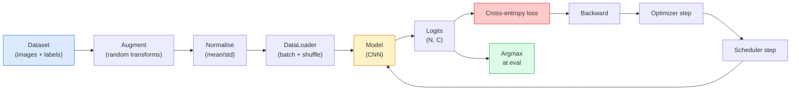

# 图像分类

> Classifier 是一个从 pixel 到 class probability distribution 的函数。其他一切都是 plumbing。

**类型:** Build
**语言:** Python
**先修:** Phase 2 Lesson 09 (Model Evaluation), Phase 3 Lesson 10 (Mini Framework), Phase 4 Lesson 03 (CNNs)
**时间:** ~75 minutes

## 学习目标

- 在 CIFAR-10 上构建端到端 image classification pipeline：dataset、augmentation、model、training loop、evaluation
- 解释每个组件（dataloader、loss、optimizer、scheduler、augmentation）的作用，并预测其中任何一个坏掉会如何体现在 loss curve 上
- 从零实现 mixup、cutout 和 label smoothing，并说明什么时候值得加入它们
- 读取 confusion matrix 和 per-class precision/recall table，以诊断 aggregate accuracy 之外的 dataset 与 model failure

## 要解决的问题

每个能上线的视觉任务，在某个层面都会归约为 image classification。Detection 会对 region 分类。Segmentation 会对 pixel 分类。Retrieval 会按与 class centroid 的相似度排序。把 classification 做对，也就是 dataset loop、augmentation policy、loss、evaluation 做对，是能迁移到本阶段每个其他任务的能力。

大多数 classification bug 不在 model 里，而在 pipeline 里：损坏的 normalisation、没有 shuffle 的 training set、扭曲 label 的 augmentation、被 training data 污染的 validation split、epoch 30 后悄悄 diverge 的 learning rate。一个配置正确时能在 CIFAR-10 上达到 93% 的 CNN，在损坏配置下经常只有 70-75%，而 loss curve 看起来一直都很合理。

本课会手工接好整条 pipeline，让每一部分都可检查。你不会使用 `torchvision.datasets` 中任何可能隐藏 bug 的东西。

## 核心概念

### Classification pipeline



这个 loop 里的每一条线都可能藏 bug。Cross-entropy 接收 raw logits，而不是 softmax output，因此 loss 之前的任何 `model(x).softmax()` 都会悄悄计算错误 gradient。Augmentation 只应用到 input，而不是 label，mixup 除外，它会同时混合二者。`optimizer.zero_grad()` 必须每 step 发生一次；跳过它会累积 gradient，看起来像极不稳定的 learning rate。这些 bug 都会让 learning curve 变平，而且不会抛错。

### Cross-entropy、logits 与 softmax

Classifier 为每张图像产生 `C` 个数字，称为 logits。应用 softmax 会把它们转换成 probability distribution：

```text
softmax(z)_i = exp(z_i) / sum_j exp(z_j)
```

Cross-entropy 衡量正确 class 的 negative log probability：

```text
CE(z, y) = -log( softmax(z)_y )
        = -z_y + log( sum_j exp(z_j) )
```

右侧形式是 numerically stable 的形式（log-sum-exp）。PyTorch 的 `nn.CrossEntropyLoss` 会把 softmax + NLL 融合成一个 op，并直接接收 raw logits。自己先应用 softmax 几乎总是 bug，因为你会计算 log(softmax(softmax(z)))，这是没有意义的量。

### 为什么 augmentation 有效

CNN 对 translation 有 inductive bias（来自 weight sharing），但对 crop、flip、colour jitter 或 occlusion 没有内置 invariance。教会它这些 invariance 的唯一方式，是给它看能体现这些变化的 pixel。训练期间的每个 random transform 都是在说：“这两张图像 label 相同；学会忽略差异的 feature。”

```text
Original crop:  "dog facing left"
Flip:           "dog facing right"       <- same label, different pixels
Rotate(+15):    "dog, slight tilt"
Colour jitter:  "dog in warmer light"
RandomErasing:  "dog with patch missing"
```

规则：augmentation 必须 preserve label。在 digit 上使用 cutout 和 rotation 可能把 “6” 变成 “9”；对于这类 dataset，你要使用更小的 rotation range，并选择尊重 digit-specific invariance 的 augmentation。

### Mixup 与 cutmix

普通 augmentation 会转换 pixel，但保持 label one-hot。**Mixup** 和 **cutmix** 会打破这一点，因为它们会同时插值二者。

```text
Mixup:
  lambda ~ Beta(a, a)
  x = lambda * x_i + (1 - lambda) * x_j
  y = lambda * y_i + (1 - lambda) * y_j

Cutmix:
  paste a random rectangle of x_j into x_i
  y = area-weighted mix of y_i and y_j
```

它为什么有帮助：模型不再记忆尖锐的 one-hot target，而是学习在 class 之间插值。Training loss 上升，test accuracy 上升。对任何 classifier 来说，这是最便宜的 robustness upgrade。

### Label smoothing

Mixup 的近亲。不要用 `[0, 0, 1, 0, 0]` 训练，而是用 `[eps/C, eps/C, 1-eps, eps/C, eps/C]`，其中 `eps` 是 0.1 这样的小值。它阻止模型产生任意尖锐的 logits，并以几乎零成本改善 calibration。自 PyTorch 1.10 起，它内置在 `nn.CrossEntropyLoss(label_smoothing=0.1)` 中。

### 不止 accuracy 的 evaluation

Aggregate accuracy 会隐藏 imbalance。一个 90-10 binary classifier 如果总是预测 majority class，也能得到 90%。真正告诉你发生了什么的工具是：

- **Per-class accuracy** — 每个 class 一个数字；立刻暴露表现差的 category。
- **Confusion matrix** — C x C grid，其中 row i col j = true class i 被预测为 class j 的 count；对角线是正确预测，off-diagonal 是模型真正出错的位置。
- **Top-1 / Top-5** — 正确 class 是否位于 top 1 或 top 5 prediction 中；Top-5 对 ImageNet 很重要，因为 “Norwich terrier” vs “Norfolk terrier” 这样的 class 确实有歧义。
- **Calibration (ECE)** — 0.8 confidence 的 prediction 是否有 80% 的时间正确？现代网络系统性 over-confident；可以用 temperature scaling 或 label smoothing 修复。

## 动手实现

### Step 1: 一个 deterministic synthetic dataset

CIFAR-10 存在磁盘上。为了让本课可复现且快速，我们构建一个看起来像 CIFAR 的 synthetic dataset：32x32 RGB 图像，带有模型必须学习的 class-specific structure。完全相同的 pipeline 可以不加修改地作用于真实 CIFAR-10。

```python
import numpy as np
import torch
from torch.utils.data import Dataset


def synthetic_cifar(num_per_class=1000, num_classes=10, seed=0):
    rng = np.random.default_rng(seed)
    X = []
    Y = []
    for c in range(num_classes):
        centre = rng.uniform(0, 1, (3,))
        freq = 2 + c
        for _ in range(num_per_class):
            yy, xx = np.meshgrid(np.linspace(0, 1, 32), np.linspace(0, 1, 32), indexing="ij")
            r = np.sin(xx * freq) * 0.5 + centre[0]
            g = np.cos(yy * freq) * 0.5 + centre[1]
            b = (xx + yy) * 0.5 * centre[2]
            img = np.stack([r, g, b], axis=-1)
            img += rng.normal(0, 0.08, img.shape)
            img = np.clip(img, 0, 1)
            X.append(img.astype(np.float32))
            Y.append(c)
    X = np.stack(X)
    Y = np.array(Y)
    idx = rng.permutation(len(X))
    return X[idx], Y[idx]


class ArrayDataset(Dataset):
    def __init__(self, X, Y, transform=None):
        self.X = X
        self.Y = Y
        self.transform = transform

    def __len__(self):
        return len(self.X)

    def __getitem__(self, i):
        img = self.X[i]
        if self.transform is not None:
            img = self.transform(img)
        img = torch.from_numpy(img).permute(2, 0, 1)
        return img, int(self.Y[i])
```

每个 class 都有自己的 colour palette 和 frequency pattern，再加上 Gaussian noise，迫使模型学习 signal，而不是记忆 pixel。十个 class，每类一千张图像，并且已 permuted。

### Step 2: Normalisation 与 augmentation

每个 vision pipeline 都有的两个 transform。

```python
def standardize(mean, std):
    mean = np.array(mean, dtype=np.float32)
    std = np.array(std, dtype=np.float32)
    def _fn(img):
        return (img - mean) / std
    return _fn


def random_hflip(p=0.5):
    def _fn(img):
        if np.random.random() < p:
            return img[:, ::-1, :].copy()
        return img
    return _fn


def random_crop(pad=4):
    def _fn(img):
        h, w = img.shape[:2]
        padded = np.pad(img, ((pad, pad), (pad, pad), (0, 0)), mode="reflect")
        y = np.random.randint(0, 2 * pad)
        x = np.random.randint(0, 2 * pad)
        return padded[y:y + h, x:x + w, :]
    return _fn


def compose(*fns):
    def _fn(img):
        for fn in fns:
            img = fn(img)
        return img
    return _fn
```

Crop 之前使用 reflect-pad，而不是 zero-pad，因为黑色边界是一种 signal，模型会以无益的方式学会忽略它。

### Step 3: Mixup

在 training step 内混合两张图像和两个 label。它作为 batch transform 实现，因此位于 forward pass 附近，而不是 dataset 内部。

```python
def mixup_batch(x, y, num_classes, alpha=0.2):
    if alpha <= 0:
        return x, torch.nn.functional.one_hot(y, num_classes).float()
    lam = float(np.random.beta(alpha, alpha))
    idx = torch.randperm(x.size(0), device=x.device)
    x_mixed = lam * x + (1 - lam) * x[idx]
    y_onehot = torch.nn.functional.one_hot(y, num_classes).float()
    y_mixed = lam * y_onehot + (1 - lam) * y_onehot[idx]
    return x_mixed, y_mixed


def soft_cross_entropy(logits, soft_targets):
    log_probs = torch.log_softmax(logits, dim=-1)
    return -(soft_targets * log_probs).sum(dim=-1).mean()
```

`soft_cross_entropy` 是针对 soft-label distribution 的 cross-entropy。当 target 恰好是 one-hot 时，它会退化为通常的一热情况。

### Step 4: Training loop

完整 recipe：遍历数据一次，每个 batch 做一次 gradient，scheduler 每个 epoch step 一次。

```python
import torch
import torch.nn as nn
from torch.utils.data import DataLoader
from torch.optim import SGD
from torch.optim.lr_scheduler import CosineAnnealingLR

def train_one_epoch(model, loader, optimizer, device, num_classes, use_mixup=True):
    model.train()
    total, correct, loss_sum = 0, 0, 0.0
    for x, y in loader:
        x, y = x.to(device), y.to(device)
        if use_mixup:
            x_m, y_soft = mixup_batch(x, y, num_classes)
            logits = model(x_m)
            loss = soft_cross_entropy(logits, y_soft)
        else:
            logits = model(x)
            loss = nn.functional.cross_entropy(logits, y, label_smoothing=0.1)
        optimizer.zero_grad()
        loss.backward()
        optimizer.step()
        loss_sum += loss.item() * x.size(0)
        total += x.size(0)
        # Training accuracy vs the un-mixed labels `y` is only an approximation
        # when mixup is on (the model saw soft targets, not y). Treat it as a
        # rough progress signal; rely on val accuracy for real performance.
        with torch.no_grad():
            pred = logits.argmax(dim=-1)
            correct += (pred == y).sum().item()
    return loss_sum / total, correct / total


@torch.no_grad()
def evaluate(model, loader, device, num_classes):
    model.eval()
    total, correct = 0, 0
    loss_sum = 0.0
    cm = torch.zeros(num_classes, num_classes, dtype=torch.long)
    for x, y in loader:
        x, y = x.to(device), y.to(device)
        logits = model(x)
        loss = nn.functional.cross_entropy(logits, y)
        pred = logits.argmax(dim=-1)
        for t, p in zip(y.cpu(), pred.cpu()):
            cm[t, p] += 1
        loss_sum += loss.item() * x.size(0)
        total += x.size(0)
        correct += (pred == y).sum().item()
    return loss_sum / total, correct / total, cm
```

每次写 training loop 都要检查的五个 invariant：

1. 训练前 `model.train()`，evaluation 前 `model.eval()`，以切换 dropout 和 batchnorm behaviour。
2. `.backward()` 之前调用 `.zero_grad()`。
3. 累积 metric 时使用 `.item()`，这样不会让 computation graph 存活。
4. Evaluation 期间使用 `@torch.no_grad()`，节省 memory 和 time，并防止微妙事故。
5. 对 raw logits 做 argmax，而不是对 softmax 做；结果相同，少一次 op。

### Step 5: 拼起来

使用上一课的 `TinyResNet`，训练几个 epoch，然后 evaluate。

```python
from main import synthetic_cifar, ArrayDataset
from main import standardize, random_hflip, random_crop, compose
from main import mixup_batch, soft_cross_entropy
from main import train_one_epoch, evaluate
# TinyResNet comes from the previous lesson (03-cnns-lenet-to-resnet).
# Adjust the import path to wherever you stored the previous lesson's code.
from cnns_lenet_to_resnet import TinyResNet  # example placeholder

X, Y = synthetic_cifar(num_per_class=500)
split = int(0.9 * len(X))
X_train, Y_train = X[:split], Y[:split]
X_val, Y_val = X[split:], Y[split:]

mean = [0.5, 0.5, 0.5]
std = [0.25, 0.25, 0.25]
train_tf = compose(random_hflip(), random_crop(pad=4), standardize(mean, std))
eval_tf = standardize(mean, std)

train_ds = ArrayDataset(X_train, Y_train, transform=train_tf)
val_ds = ArrayDataset(X_val, Y_val, transform=eval_tf)

train_loader = DataLoader(train_ds, batch_size=128, shuffle=True, num_workers=0)
val_loader = DataLoader(val_ds, batch_size=256, shuffle=False, num_workers=0)

device = "cuda" if torch.cuda.is_available() else "cpu"
model = TinyResNet(num_classes=10).to(device)
optimizer = SGD(model.parameters(), lr=0.1, momentum=0.9, weight_decay=5e-4, nesterov=True)
scheduler = CosineAnnealingLR(optimizer, T_max=10)

for epoch in range(10):
    tr_loss, tr_acc = train_one_epoch(model, train_loader, optimizer, device, 10, use_mixup=True)
    va_loss, va_acc, _ = evaluate(model, val_loader, device, 10)
    scheduler.step()
    print(f"epoch {epoch:2d}  lr {scheduler.get_last_lr()[0]:.4f}  "
          f"train {tr_loss:.3f}/{tr_acc:.3f}  val {va_loss:.3f}/{va_acc:.3f}")
```

在 synthetic dataset 上，它会在五个 epoch 内达到接近完美的 validation accuracy，重点就在这里：pipeline 是正确的，model 能学到可学的东西。把 dataset 换成真实 CIFAR-10，同一个 loop 不加修改也能训练到约 90%。

### Step 6: 读取 confusion matrix

Accuracy alone 永远不会告诉你模型在哪里失败。Confusion matrix 会。

```python
def print_confusion(cm, labels=None):
    c = cm.shape[0]
    labels = labels or [str(i) for i in range(c)]
    print(f"{'':>6}" + "".join(f"{l:>5}" for l in labels))
    for i in range(c):
        row = cm[i].tolist()
        print(f"{labels[i]:>6}" + "".join(f"{v:>5}" for v in row))
    print()
    tp = cm.diag().float()
    fp = cm.sum(dim=0).float() - tp
    fn = cm.sum(dim=1).float() - tp
    prec = tp / (tp + fp).clamp_min(1)
    rec = tp / (tp + fn).clamp_min(1)
    f1 = 2 * prec * rec / (prec + rec).clamp_min(1e-9)
    for i in range(c):
        print(f"{labels[i]:>6}  prec {prec[i]:.3f}  rec {rec[i]:.3f}  f1 {f1[i]:.3f}")

_, _, cm = evaluate(model, val_loader, device, 10)
print_confusion(cm)
```

Row 是 true class，column 是 prediction。Classes 3 和 5 之间出现 off-diagonal count cluster，意味着模型混淆这两个 class，也给了你 targeted data collection 或 class-specific augmentation 的起点。

## 实际使用

`torchvision` 会把上面的所有内容包装成惯用组件。对真实 CIFAR-10 来说，完整 pipeline 是四行加一个 training loop。

```python
from torchvision.datasets import CIFAR10
from torchvision.transforms import Compose, RandomCrop, RandomHorizontalFlip, ToTensor, Normalize

mean = (0.4914, 0.4822, 0.4465)
std = (0.2470, 0.2435, 0.2616)
train_tf = Compose([
    RandomCrop(32, padding=4, padding_mode="reflect"),
    RandomHorizontalFlip(),
    ToTensor(),
    Normalize(mean, std),
])
eval_tf = Compose([ToTensor(), Normalize(mean, std)])

train_ds = CIFAR10(root="./data", train=True,  download=True, transform=train_tf)
val_ds   = CIFAR10(root="./data", train=False, download=True, transform=eval_tf)
```

注意两件事：mean/std 是 **dataset-specific** 的，也就是在 CIFAR-10 training set 上计算的，不是 ImageNet；reflect pad 是 community-default crop policy。在这里复制粘贴 ImageNet stats 会漏掉约 1% accuracy，而且没人会发现，直到有人 profile 这个模型。

## 交付成果

本课产出：

- `outputs/prompt-classifier-pipeline-auditor.md` — 一个 prompt：审计 training script 是否满足上面的五个 invariant，并暴露第一个 violation。
- `outputs/skill-classification-diagnostics.md` — 一个 skill：给定 confusion matrix 和 class name list，汇总 per-class failure，并提出最有影响力的单一修复。

## 练习

1. **(Easy)** 在 synthetic dataset 上分别用 mixup 和不用 mixup 训练同一个模型五个 epoch。绘制二者的 train loss 和 val loss。解释为什么 mixup 的 train loss 更高，但 val accuracy 相似或更好。
2. **(Medium)** 实现 Cutout：在每张 training image 中把一个随机 8x8 square 置零。运行 ablation：no augmentation、hflip+crop、hflip+crop+cutout、hflip+crop+mixup。报告每个设置的 val accuracy。
3. **(Hard)** 构建 CIFAR-100 pipeline（100 classes，同样的 input size），并复现一次 ResNet-34 training run，使结果与 published accuracy 相差不超过 1%。附加任务：sweep 三个 learning rate 和两个 weight decay，log 到 local CSV，并生成最终的 confusion-matrix-top-confusions table。

## 关键术语

| 术语 | 常见说法 | 实际含义 |
|------|----------------|----------------------|
| Logits | “Raw outputs” | 每张图像的 C 个 pre-softmax vector；cross-entropy 期望这些，而不是 softmaxed value |
| Cross-entropy | “The loss” | 正确 class 的 negative log-probability；在一个 stable op 中组合 log-softmax 和 NLL |
| DataLoader | “The batcher” | 用 shuffling、batching 和可选 multi-worker loading 包装 dataset；一半 training bug 都会怪到它头上 |
| Augmentation | “Random transforms” | 训练时任何保持 label 的 pixel-level transform；教会 CNN 它原生没有的 invariance |
| Mixup / Cutmix | “混合两张图像” | 同时 blend input 和 label，使 classifier 学习 smooth interpolation，而不是 hard boundary |
| Label smoothing | “Softer targets” | 用 (1-eps, eps/(C-1), ...) 替换 one-hot；改善 calibration，并略微提升 accuracy |
| Top-k accuracy | “Top-5” | 正确 class 位于 k 个最高概率 prediction 之中；用于有真实歧义 class 的 dataset |
| Confusion matrix | “错误在哪里” | C x C table，其中 entry (i, j) 统计 true class i 被预测成 j 的图像数量；对角线正确，off-diagonal 告诉你要修什么 |

## 延伸阅读

- [CS231n: Training Neural Networks](https://cs231n.github.io/neural-networks-3/) — 仍然是用单页讲清 training pipeline 的最佳导览
- [Bag of Tricks for Image Classification (He et al., 2019)](https://arxiv.org/abs/1812.01187) — 所有小技巧加起来如何给 ImageNet 上的 ResNet accuracy 增加 3-4%
- [mixup: Beyond Empirical Risk Minimization (Zhang et al., 2017)](https://arxiv.org/abs/1710.09412) — 原始 mixup paper；三页理论加上有说服力的实验
- [Why temperature scaling matters (Guo et al., 2017)](https://arxiv.org/abs/1706.04599) — 证明现代网络 miscalibrated，并用一个 scalar parameter 修复它的论文
