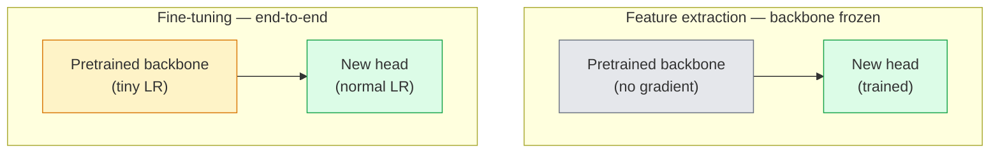

# Transfer Learning 与 Fine-Tuning

> 别人花了一百万 GPU 小时教会网络识别 edge、texture 和 object part。训练你自己的模型前，应该先借用这些 feature。

**类型:** Build
**语言:** Python
**先修:** Phase 4 Lesson 03 (CNNs), Phase 4 Lesson 04 (Image Classification)
**时间:** ~75 minutes

## 学习目标

- 区分 feature extraction 与 fine-tuning，并根据 dataset size、domain distance 和 compute budget 选择正确方案
- 加载 pretrained backbone，替换 classifier head，并在不到 20 行内只训练 head 得到可工作的 baseline
- 用 discriminative learning rates 渐进式 unfreeze layer，让早期 generic feature 比后期 task-specific feature 获得更小更新
- 诊断三类常见失败：unfrozen block 上 LR 过高导致 feature drift，小 dataset 上 BN statistics collapse，以及 catastrophic forgetting

## 要解决的问题

在 ImageNet 上训练一个 ResNet-50 大约需要 2,000 GPU-hours。很少有团队能为每个要上线的任务承担这个预算。几乎每个团队真正上线的，都是一个 pretrained backbone，加上一个在几百或几千张 task-specific image 上训练的新 head。

这不是捷径。任何 ImageNet-trained CNN 的第一个 conv block 都会学习 edge 和 Gabor-like filter。接下来的几个 block 学习 texture 和 simple motif。中间 block 学习 object part。最后的 block 学习开始像 1,000 个 ImageNet category 的组合。这个 hierarchy 的前 90% 几乎不变地迁移到 medical imaging、industrial inspection、satellite data 和每个其他 vision task，因为自然界的 edge 和 texture vocabulary 是有限的。最后 10% 才是你真正要训练的东西。

做好 transfer 有三个 bug 在等你：用过高 learning rate 摧毁 pretrained feature，冻结太多导致模型信息不足，以及让 BatchNorm 的 running statistics 漂向一个 rest of network 从未学习过的 tiny dataset。本课会有意带你走过每一个。

## 核心概念

### Feature extraction vs fine-tuning

两种 regime，取决于你多信任 pretrained feature，以及你有多少数据。



经验法则：

| Dataset size | Domain distance | Recipe |
|--------------|-----------------|--------|
| < 1k images | close to ImageNet | Freeze backbone, train head only |
| 1k-10k | close | Freeze first 2-3 stages, fine-tune the rest |
| 10k-100k | any | Fine-tune end-to-end with discriminative LR |
| 100k+ | far | Fine-tune everything; consider training from scratch if domain is far enough |

“Close to ImageNet” 大致指自然 RGB photo，并且包含 object-like content。Medical CT scan、overhead satellite imagery 和 microscopy 都是 far domain；feature 仍然有帮助，但你需要让更多 layer 适应。

### 为什么 freezing 居然有效

CNN 学到的 ImageNet feature 并不专门属于那 1,000 个 category。它们专门属于 natural image 的统计规律：特定方向的 edge、texture、contrast pattern、shape primitive。这些统计规律在几乎每个可命名的视觉 domain 中都很稳定。这就是为什么一个在 ImageNet 上训练的模型，只加一个新的 linear head（不 fine-tune backbone）并 zero-shot evaluate 到 CIFAR-10，也能达到 80%+ accuracy。Head 学的是这个任务应该如何加权 already-learnt feature。

### Discriminative learning rates

当你确实 unfreeze 时，早期 layer 应该比后期 layer 训练得更慢。早期 layer 编码你希望保留的 generic feature；后期 layer 编码你需要大幅移动的 task-specific structure。

```text
Typical recipe:

  stage 0 (stem + first group): lr = base_lr / 100    (mostly fixed)
  stage 1:                       lr = base_lr / 10
  stage 2:                       lr = base_lr / 3
  stage 3 (last backbone group): lr = base_lr
  head:                          lr = base_lr  (or slightly higher)
```

在 PyTorch 中，这只是传给 optimizer 的一组 parameter group。一个 model，五个 learning rate，零额外代码。

### BatchNorm 问题

BN layer 持有在 ImageNet 上计算得到的 `running_mean` 和 `running_var` buffer。如果你的任务有不同的 pixel distribution，如不同 lighting、不同 sensor、不同 colour space，这些 buffer 就是错的。按优先级有三个选择：

1. **让 BN 在 train mode 下 fine-tune。** 让 BN 随其他部分一起更新 running statistics。当 task dataset 中等规模（>= 5k examples）时，这是默认选择。
2. **把 BN freeze 在 eval mode。** 保留 ImageNet statistics，只训练 weights。当 dataset 小到 BN moving average 会很 noisy 时，这是正确选择。
3. **用 GroupNorm 替换 BN。** 完全移除 moving-average problem。Detection 和 segmentation backbone 中常用，因为每块 GPU 的 batch size 很小。

弄错这一点会静默让 accuracy 掉 5-15%。

### Head design

Classifier head 是 1-3 个 linear layer 加一个可选 dropout。每个 torchvision backbone 都带一个你会替换的 default head：

```text
backbone.fc = nn.Linear(backbone.fc.in_features, num_classes)          # ResNet
backbone.classifier[1] = nn.Linear(..., num_classes)                    # EfficientNet, MobileNet
backbone.heads.head = nn.Linear(..., num_classes)                       # torchvision ViT
```

对 small dataset 来说，一个 linear layer 通常足够。当 task distribution 离 backbone training distribution 更远时，加入 hidden layer（Linear -> ReLU -> Dropout -> Linear）会有帮助。

### Layer-wise LR decay

这是现代 fine-tuning（BEiT、DINOv2、ViT-B fine-tunes）中使用的 discriminative LR 的平滑版本。不是把 layer 分成 stage，而是让每一层都比它上面一层有稍小的 LR：

```text
lr_layer_k = base_lr * decay^(L - k)
```

当 decay = 0.75 且 L = 12 个 transformer block 时，第一个 block 的训练 LR 是 head LR 的 `0.75^11 ≈ 0.04x`。它对 transformer fine-tune 比对 CNN 更重要；在 CNN 中，stage-grouped LR 通常已经足够。

### 要评估什么

Transfer-learning run 需要两个 scratch run 不会跟踪的数字：

- **Pretrained-only accuracy** — backbone frozen 时 head 的 accuracy。这是你的 floor。
- **Fine-tuned accuracy** — 同一模型 end-to-end training 后的 accuracy。这是你的 ceiling。

如果 fine-tuned 低于 pretrained-only，你有 learning-rate 或 BN bug。永远打印二者。

## 动手实现

### Step 1: 加载 pretrained backbone 并检查它

```python
import torch
import torch.nn as nn
from torchvision.models import resnet18, ResNet18_Weights

backbone = resnet18(weights=ResNet18_Weights.IMAGENET1K_V1)
print(backbone)
print()
print("classifier head:", backbone.fc)
print("feature dim:", backbone.fc.in_features)
```

`ResNet18` 有四个 stage（`layer1..layer4`），再加上一个 stem 和一个 `fc` head。每个 torchvision classification backbone 都有类似结构。

### Step 2: Feature extraction — 冻结所有内容，替换 head

```python
def make_feature_extractor(num_classes=10):
    model = resnet18(weights=ResNet18_Weights.IMAGENET1K_V1)
    for p in model.parameters():
        p.requires_grad = False
    model.fc = nn.Linear(model.fc.in_features, num_classes)
    return model

model = make_feature_extractor(num_classes=10)
trainable = sum(p.numel() for p in model.parameters() if p.requires_grad)
frozen = sum(p.numel() for p in model.parameters() if not p.requires_grad)
print(f"trainable: {trainable:>10,}")
print(f"frozen:    {frozen:>10,}")
```

只有 `model.fc` 可训练。Backbone 是一个 frozen feature extractor。

### Step 3: Discriminative fine-tuning

一个 utility，用 stage-specific learning rate 构建 parameter group。

```python
def discriminative_param_groups(model, base_lr=1e-3, decay=0.3):
    stages = [
        ["conv1", "bn1"],
        ["layer1"],
        ["layer2"],
        ["layer3"],
        ["layer4"],
        ["fc"],
    ]
    groups = []
    for i, names in enumerate(stages):
        lr = base_lr * (decay ** (len(stages) - 1 - i))
        params = [p for n, p in model.named_parameters()
                  if any(n.startswith(k) for k in names)]
        if params:
            groups.append({"params": params, "lr": lr, "name": "_".join(names)})
    return groups

model = resnet18(weights=ResNet18_Weights.IMAGENET1K_V1)
model.fc = nn.Linear(model.fc.in_features, 10)
for p in model.parameters():
    p.requires_grad = True

groups = discriminative_param_groups(model)
for g in groups:
    print(f"{g['name']:>10s}  lr={g['lr']:.2e}  params={sum(p.numel() for p in g['params']):>8,}")
```

`decay=0.3` 意味着每个 stage 的训练速率是下一 stage 的 30%。`fc` 获得 `base_lr`，`layer4` 获得 `0.3 * base_lr`，`conv1` 获得 `0.3^5 * base_lr ≈ 0.00243 * base_lr`。听起来很极端；实证上它有效。

### Step 4: BatchNorm handling

用于冻结 BN running statistics、但不冻结其 weights 的 helper。

```python
def freeze_bn_stats(model):
    for m in model.modules():
        if isinstance(m, (nn.BatchNorm1d, nn.BatchNorm2d, nn.BatchNorm3d)):
            m.eval()
            for p in m.parameters():
                p.requires_grad = False
    return model
```

在每个 epoch 开头设置 `model.train()` 之后调用它。`model.train()` 会把所有内容切到 training mode；这个 helper 只为 BN layer 反转回来。

### Step 5: 一个最小 end-to-end fine-tuning loop

```python
from torch.optim import SGD
from torch.utils.data import DataLoader
from torch.optim.lr_scheduler import CosineAnnealingLR
import torch.nn.functional as F

def fine_tune(model, train_loader, val_loader, device, epochs=5, base_lr=1e-3, freeze_bn=False):
    model = model.to(device)
    groups = discriminative_param_groups(model, base_lr=base_lr)
    optimizer = SGD(groups, momentum=0.9, weight_decay=1e-4, nesterov=True)
    scheduler = CosineAnnealingLR(optimizer, T_max=epochs)

    for epoch in range(epochs):
        model.train()
        if freeze_bn:
            freeze_bn_stats(model)
        tr_loss, tr_correct, tr_total = 0.0, 0, 0
        for x, y in train_loader:
            x, y = x.to(device), y.to(device)
            logits = model(x)
            loss = F.cross_entropy(logits, y, label_smoothing=0.1)
            optimizer.zero_grad()
            loss.backward()
            optimizer.step()
            tr_loss += loss.item() * x.size(0)
            tr_total += x.size(0)
            tr_correct += (logits.argmax(-1) == y).sum().item()
        scheduler.step()

        model.eval()
        va_total, va_correct = 0, 0
        with torch.no_grad():
            for x, y in val_loader:
                x, y = x.to(device), y.to(device)
                pred = model(x).argmax(-1)
                va_total += x.size(0)
                va_correct += (pred == y).sum().item()
        print(f"epoch {epoch}  train {tr_loss/tr_total:.3f}/{tr_correct/tr_total:.3f}  "
              f"val {va_correct/va_total:.3f}")
    return model
```

在 CIFAR-10 上使用上面的 recipe 训练五个 epoch，会让 `ResNet18-IMAGENET1K_V1` 从约 70% zero-shot linear-probe accuracy 到约 93% fine-tuned accuracy。只训练 head 则会在约 86% 附近 plateau，而完全不触碰 backbone。

### Step 6: Progressive unfreezing

一个从末端向开头、每个 epoch unfreeze 一个 stage 的 schedule。它以多花一些 epoch 为代价缓解 feature drift。

```python
def progressive_unfreeze_schedule(model):
    stages = ["layer4", "layer3", "layer2", "layer1"]
    yielded = set()

    def start():
        for p in model.parameters():
            p.requires_grad = False
        for p in model.fc.parameters():
            p.requires_grad = True

    def unfreeze(epoch):
        if epoch < len(stages):
            name = stages[epoch]
            yielded.add(name)
            for n, p in model.named_parameters():
                if n.startswith(name):
                    p.requires_grad = True
            return name
        return None

    return start, unfreeze
```

在第一个 epoch 前调用一次 `start()`。每个 epoch 开头调用 `unfreeze(epoch)`。每当 trainable parameter set 变化时，都要重建 optimizer，否则 frozen params 仍持有 cached moments，会扰乱它。

## 实际使用

对大多数真实任务来说，`torchvision.models` 加三行就足够。上面的重型机制，在你遇到 library default 无法修复的问题时才重要。

```python
from torchvision.models import resnet50, ResNet50_Weights

model = resnet50(weights=ResNet50_Weights.IMAGENET1K_V2)
model.fc = nn.Linear(model.fc.in_features, num_classes)
optimizer = torch.optim.AdamW(model.parameters(), lr=1e-4, weight_decay=1e-4)
```

另外两个 production-grade default：

- `timm` 提供约 800 个 pretrained vision backbone，并有一致 API（`timm.create_model("resnet50", pretrained=True, num_classes=10)`）。对任何超出 torchvision zoo 的 fine-tune，它都是标准。
- 对 transformer，`transformers.AutoModelForImageClassification.from_pretrained(name, num_labels=N)` 会给你 ViT / BEiT / DeiT，并拥有与 text model 相同的 loading semantics。

## 交付成果

本课产出：

- `outputs/prompt-fine-tune-planner.md` — 一个 prompt：根据 dataset size、domain distance 和 compute budget，选择 feature-extraction、progressive fine-tuning 或 end-to-end fine-tuning。
- `outputs/skill-freeze-inspector.md` — 一个 skill：给定 PyTorch model，报告哪些 parameter 可训练，哪些 BatchNorm layer 位于 eval mode，以及 optimizer 是否真的接收了 trainable parameter。

## 练习

1. **(Easy)** 在同一个 synthetic-CIFAR dataset 上，把 `ResNet18` 分别作为 linear probe（backbone frozen）和完整 fine-tune 来训练。并排报告两种 accuracy。解释哪种 gap 表明 feature transfer 好，哪种表明 feature transfer 不好。
2. **(Medium)** 故意引入 bug：在 backbone stage 上设置 `base_lr = 1e-1`，而不是只在 head 上这么做。展示 training loss explode，然后用 `discriminative_param_groups` helper 恢复。记录每个 stage 开始 diverge 的 LR。
3. **(Hard)** 取一个 medical imaging dataset（例如 CheXpert-small、PatchCamelyon 或 HAM10000），比较三种 regime：(a) ImageNet-pretrained frozen backbone + linear head；(b) ImageNet-pretrained end-to-end fine-tune；(c) scratch training。报告每种的 accuracy 和 compute cost。在什么 dataset size 下 scratch training 开始有竞争力？

## 关键术语

| 术语 | 常见说法 | 实际含义 |
|------|----------------|----------------------|
| Feature extraction | “Freeze and train head” | Backbone parameter frozen，只有新的 classifier head 接收 gradient |
| Fine-tuning | “Retrain end-to-end” | 所有 parameter 可训练，通常使用比 scratch training 小得多的 LR |
| Discriminative LR | “Early layer 用更小 LR” | Optimizer parameter group，其中 early-stage LR 是 late-stage LR 的一小部分 |
| Layer-wise LR decay | “平滑 LR gradient” | Per-layer LR 乘以 decay^(L - k)；transformer fine-tune 中常见 |
| Catastrophic forgetting | “模型忘掉了 ImageNet” | 过高 LR 在新任务 signal 学会之前覆盖 pretrained feature |
| BN statistics drift | “Running mean 错了” | BatchNorm running_mean/var 在不同于当前任务的 distribution 上计算，静默损害 accuracy |
| Linear probe | “Frozen backbone + linear head” | 对 pretrained feature 的评估：frozen representation 上最佳 linear classifier 的 accuracy |
| Catastrophic collapse | “所有东西都预测成一个 class” | 当 fine-tuning 的 LR 高到在 head 的 gradient 稳定前就摧毁 feature 时发生 |

## 延伸阅读

- [How transferable are features in deep neural networks? (Yosinski et al., 2014)](https://arxiv.org/abs/1411.1792) — 量化不同 layer 上 feature transferability 的论文
- [Universal Language Model Fine-tuning (ULMFiT, Howard & Ruder, 2018)](https://arxiv.org/abs/1801.06146) — 原始 discriminative LR / progressive unfreezing recipe；想法可直接迁移到 vision
- [timm documentation](https://huggingface.co/docs/timm) — 现代 vision backbone 的参考，以及它们训练时所用的精确 fine-tune default
- [A Simple Framework for Linear-Probe Evaluation (Kornblith et al., 2019)](https://arxiv.org/abs/1805.08974) — 为什么 linear-probe accuracy 重要，以及如何正确报告它
