# Object Detection — 从零实现 YOLO

> Detection 是 classification 加 regression，在 feature map 的每个位置运行，然后用 non-maximum suppression 清理。

**类型:** Build
**语言:** Python
**先修:** Phase 4 Lesson 03 (CNNs), Phase 4 Lesson 04 (Image Classification), Phase 4 Lesson 05 (Transfer Learning)
**时间:** ~75 minutes

## 学习目标

- 解释 grid-and-anchor design 如何把 detection 转成 dense prediction problem，并说出 output tensor 中每个数字的含义
- 计算 box 之间的 Intersection-over-Union，并从零实现 non-maximum suppression
- 在 pretrained backbone 上构建一个最小 YOLO-style head，包括 classification、objectness 和 box-regression losses
- 读取 detection metric row（precision@0.5、recall、mAP@0.5、mAP@0.5:0.95），并选择下一步该调哪个 knob

## 要解决的问题

Classification 说“这张图像是一只狗”。Detection 说“在 pixels (112, 40, 280, 210) 有一只狗，在 (400, 180, 560, 310) 有一只猫，frame 里没有其他东西”。这个结构性变化，也就是预测可变数量的 labelled boxes，而不是每张图像一个 label，是每个 autonomous system、surveillance product、document layout parser 和 factory vision line 所依赖的能力。

Detection 也是 vision 中所有工程 trade-off 同时出现的地方。你想要准确的 boxes（regression head），想要每个 box 的正确 class（classification head），想让模型知道什么时候没有东西可检测（objectness score），还想每个真实 object 只对应一个 prediction（non-maximum suppression）。漏掉任何一个，pipeline 要么漏检 object，要么报告 hallucinated box，要么在略有不同的位置把同一个 object 预测十五次。

YOLO（You Only Look Once，Redmon et al. 2016）是让这一切能实时运行的设计，因为它用 conv net 的单次 forward pass 完成检测；同样的结构性决策仍然是现代 detector（YOLOv8、YOLOv9、YOLO-NAS、RT-DETR）的骨架。学会核心后，每个变体都只是同一批组件的重新排列。

## 核心概念

### Detection as dense prediction

Classifier 每张图像输出 C 个数字。YOLO-style detector 每张图像输出 `(S x S x (5 + C))` 个数字，其中 S 是 spatial grid size。

```mermaid
flowchart LR
    IMG["Input 416x416 RGB"] --> BB["Backbone<br/>(ResNet, DarkNet, ...)"]
    BB --> FM["Feature map<br/>(C_feat, 13, 13)"]
    FM --> HEAD["Detection head<br/>(1x1 convs)"]
    HEAD --> OUT["Output tensor<br/>(13, 13, B * (5 + C))"]
    OUT --> DEC["Decode<br/>(grid + sigmoid + exp)"]
    DEC --> NMS["Non-max suppression"]
    NMS --> RESULT["Final boxes"]

    style IMG fill:#dbeafe,stroke:#2563eb
    style HEAD fill:#fef3c7,stroke:#d97706
    style NMS fill:#fecaca,stroke:#dc2626
    style RESULT fill:#dcfce7,stroke:#16a34a
```



每个 `S * S` grid cell 预测 `B` 个 boxes。对每个 box：

- 4 个数字描述 geometry：`tx, ty, tw, th`。
- 1 个数字是 objectness score：“这个 cell 的中心处是否有 object？”
- C 个数字是 class probability。

每个 cell 总计：`B * (5 + C)`。对于 VOC，`S=13, B=2, C=20`，也就是每个 cell 50 个数字。

### 为什么需要 grid 和 anchor

Plain regression 会为每个 object 预测绝对坐标形式的 `(x, y, w, h)`。这对 conv network 来说很难，因为平移图像不应该让所有 prediction 以同样方式平移，每个 object 都是空间锚定的。Grid 的回答是：把每个 ground-truth box 分配给其 centre 所在的 grid cell；只有那个 cell 负责这个 object。

Anchor 解决第二个问题。一个 3x3 conv 很难从 16-pixel receptive field feature cell 中回归出 500-pixel-wide box。因此，我们在每个 cell 预先定义 `B` 个 prior box shape（anchors），并预测每个 anchor 的小 delta。模型学习选择正确 anchor，并微调它，而不是从零开始 regression。

```text
Anchor box priors (example for 416x416 input):

  small:   (30,  60)
  medium:  (75,  170)
  large:   (200, 380)

At each grid cell, every anchor emits (tx, ty, tw, th, obj, c_1, ..., c_C).
```

现代 detector 经常使用 FPN，并在不同 resolution 上使用不同 anchor set：shallow high-resolution map 上用 small anchor，deep low-resolution map 上用 large anchor。同一个想法，更多尺度。

### 解码 prediction

Raw `tx, ty, tw, th` 不是 box coordinate；它们是 regression target，必须在绘制前转换：

```text
centre x  = (sigmoid(tx) + cell_x) * stride
centre y  = (sigmoid(ty) + cell_y) * stride
width     = anchor_w * exp(tw)
height    = anchor_h * exp(th)
```

`sigmoid` 让 centre offset 保持在 cell 内。`exp` 让 width 可以从 anchor 自由缩放，而不会翻转符号。`stride` 把 grid coordinate 缩放回 pixel。自 YOLO v2 以来，每个 YOLO 版本都使用同样的 decode step。

### IoU

Detection 中两个 box 之间的通用 similarity metric：

```text
IoU(A, B) = area(A intersect B) / area(A union B)
```

IoU = 1 表示完全相同；IoU = 0 表示无重叠。Prediction 与 ground-truth box 之间的 IoU 决定 prediction 是否算 true positive（通常 IoU >= 0.5）。两个 prediction 之间的 IoU 则是 NMS 用来 deduplicate 的依据。

### Non-maximum suppression

在相邻 anchor 上训练的 conv network，经常会为同一个 object 预测重叠 boxes。NMS 保留最高 confidence prediction，并删除任何 IoU 超过阈值的其他 prediction。

```text
NMS(boxes, scores, iou_threshold):
    sort boxes by score descending
    keep = []
    while boxes not empty:
        pick the top-scoring box, add to keep
        remove every box with IoU > iou_threshold to the picked box
    return keep
```

Object detection 中的典型阈值是 0.45。近年的 detector 会用 `soft-NMS`、`DIoU-NMS` 替代 standard NMS，或直接学习 suppression（RT-DETR），但结构目的相同。

### Loss

YOLO loss 是三类 loss 加权相加：

```text
L = lambda_coord * L_box(pred, target, where obj=1)
  + lambda_obj   * L_obj(pred, 1,     where obj=1)
  + lambda_noobj * L_obj(pred, 0,     where obj=0)
  + lambda_cls   * L_cls(pred, target, where obj=1)
```

只有包含 object 的 cell 会贡献 box-regression 和 classification losses。没有 object 的 cell 只贡献 objectness loss（教模型保持沉默）。`lambda_noobj` 通常很小（约 0.5），因为绝大多数 cell 都是空的，否则会主导 total loss。

现代变体会把 MSE box loss 换成 CIoU / DIoU（直接优化 IoU），用 focal loss 处理 class imbalance，并用 quality focal loss 平衡 objectness。三组件结构没有改变。

### Detection metrics

Accuracy 不能直接迁移到 detection。可以迁移的是四个数字：

- **Precision@IoU=0.5** — 在 counted as positives 的 prediction 中，多少是真的正确。
- **Recall@IoU=0.5** — 在真实 object 中，我们找到了多少。
- **AP@0.5** — IoU threshold 0.5 下 precision-recall curve area；每个 class 一个数字。
- **mAP@0.5:0.95** — 在 IoU threshold 0.5、0.55、...、0.95 上平均 AP。COCO metric；最严格也最有信息量。

四个都要报告。一个 detector 如果 mAP@0.5 强但 mAP@0.5:0.95 弱，说明 localization 大致对，但不够紧；用更好的 box-regression loss 修复。一个 precision 高、recall 低的 detector 太保守；降低 confidence threshold 或增加 objectness weight。

## 动手实现

### Step 1: IoU

整节课的 workhorse。作用在两个 `(x1, y1, x2, y2)` 格式的 boxes array 上。

```python
import numpy as np

def box_iou(boxes_a, boxes_b):
    ax1, ay1, ax2, ay2 = boxes_a[:, 0], boxes_a[:, 1], boxes_a[:, 2], boxes_a[:, 3]
    bx1, by1, bx2, by2 = boxes_b[:, 0], boxes_b[:, 1], boxes_b[:, 2], boxes_b[:, 3]

    inter_x1 = np.maximum(ax1[:, None], bx1[None, :])
    inter_y1 = np.maximum(ay1[:, None], by1[None, :])
    inter_x2 = np.minimum(ax2[:, None], bx2[None, :])
    inter_y2 = np.minimum(ay2[:, None], by2[None, :])

    inter_w = np.clip(inter_x2 - inter_x1, 0, None)
    inter_h = np.clip(inter_y2 - inter_y1, 0, None)
    inter = inter_w * inter_h

    area_a = (ax2 - ax1) * (ay2 - ay1)
    area_b = (bx2 - bx1) * (by2 - by1)
    union = area_a[:, None] + area_b[None, :] - inter
    return inter / np.clip(union, 1e-8, None)
```

返回 `(N_a, N_b)` 的 pairwise IoUs matrix。要和单个 ground-truth box 比较，就把其中一个 array 做成 shape `(1, 4)`。

### Step 2: Non-max suppression

```python
def nms(boxes, scores, iou_threshold=0.45):
    order = np.argsort(-scores)
    keep = []
    while len(order) > 0:
        i = order[0]
        keep.append(i)
        if len(order) == 1:
            break
        rest = order[1:]
        ious = box_iou(boxes[[i]], boxes[rest])[0]
        order = rest[ious <= iou_threshold]
    return np.array(keep, dtype=np.int64)
```

Deterministic，排序带来 `O(N log N)`，并且在相同输入上匹配 `torchvision.ops.nms` 的行为。

### Step 3: Box encoding and decoding

在 pixel coordinate 和网络实际回归的 `(tx, ty, tw, th)` target 之间转换。

```python
def encode(box_xyxy, cell_x, cell_y, stride, anchor_wh):
    x1, y1, x2, y2 = box_xyxy
    cx = 0.5 * (x1 + x2)
    cy = 0.5 * (y1 + y2)
    w = x2 - x1
    h = y2 - y1
    tx = cx / stride - cell_x
    ty = cy / stride - cell_y
    tw = np.log(w / anchor_wh[0] + 1e-8)
    th = np.log(h / anchor_wh[1] + 1e-8)
    return np.array([tx, ty, tw, th])


def decode(tx_ty_tw_th, cell_x, cell_y, stride, anchor_wh):
    tx, ty, tw, th = tx_ty_tw_th
    cx = (sigmoid(tx) + cell_x) * stride
    cy = (sigmoid(ty) + cell_y) * stride
    w = anchor_wh[0] * np.exp(tw)
    h = anchor_wh[1] * np.exp(th)
    return np.array([cx - w / 2, cy - h / 2, cx + w / 2, cy + h / 2])


def sigmoid(x):
    return 1.0 / (1.0 + np.exp(-x))
```

测试：encode 一个 box 再 decode，你应该得到非常接近原始 box 的结果（除非 `tx` 不在 post-sigmoid range 内，因为 sigmoid inverse 并不完美可逆）。

### Step 4: 一个最小 YOLO head

Feature map 上的一个 1x1 conv，reshape 到 `(B, S, S, num_anchors, 5 + C)`。

```python
import torch
import torch.nn as nn

class YOLOHead(nn.Module):
    def __init__(self, in_c, num_anchors, num_classes):
        super().__init__()
        self.num_anchors = num_anchors
        self.num_classes = num_classes
        self.conv = nn.Conv2d(in_c, num_anchors * (5 + num_classes), kernel_size=1)

    def forward(self, x):
        n, _, h, w = x.shape
        y = self.conv(x)
        y = y.view(n, self.num_anchors, 5 + self.num_classes, h, w)
        y = y.permute(0, 3, 4, 1, 2).contiguous()
        return y
```

Output shape：`(N, H, W, num_anchors, 5 + C)`。最后一个 dimension 持有 `[tx, ty, tw, th, obj, cls_0, ..., cls_{C-1}]`。

### Step 5: Ground-truth assignment

对每个 ground-truth box，决定由哪个 `(cell, anchor)` 负责。

```python
def assign_targets(boxes_xyxy, classes, anchors, stride, grid_size, num_classes):
    num_anchors = len(anchors)
    target = np.zeros((grid_size, grid_size, num_anchors, 5 + num_classes), dtype=np.float32)
    has_obj = np.zeros((grid_size, grid_size, num_anchors), dtype=bool)

    for box, cls in zip(boxes_xyxy, classes):
        x1, y1, x2, y2 = box
        cx, cy = 0.5 * (x1 + x2), 0.5 * (y1 + y2)
        gx, gy = int(cx / stride), int(cy / stride)
        bw, bh = x2 - x1, y2 - y1

        ious = np.array([
            (min(bw, aw) * min(bh, ah)) / (bw * bh + aw * ah - min(bw, aw) * min(bh, ah))
            for aw, ah in anchors
        ])
        best = int(np.argmax(ious))
        aw, ah = anchors[best]

        target[gy, gx, best, 0] = cx / stride - gx
        target[gy, gx, best, 1] = cy / stride - gy
        target[gy, gx, best, 2] = np.log(bw / aw + 1e-8)
        target[gy, gx, best, 3] = np.log(bh / ah + 1e-8)
        target[gy, gx, best, 4] = 1.0
        target[gy, gx, best, 5 + cls] = 1.0
        has_obj[gy, gx, best] = True
    return target, has_obj
```

Anchor selection 是“与 ground truth 有最佳 shape IoU”，这是一个便宜 proxy，匹配 YOLOv2/v3 assignment。v5 及之后使用更复杂的策略（task-aligned matching、dynamic k），它们是在同一想法上继续细化。

### Step 6: 三个 losses

```python
def yolo_loss(pred, target, has_obj, lambda_coord=5.0, lambda_obj=1.0, lambda_noobj=0.5, lambda_cls=1.0):
    has_obj_t = torch.from_numpy(has_obj).bool()
    target_t = torch.from_numpy(target).float()

    # box-regression loss: only on cells with objects
    box_pred = pred[..., :4][has_obj_t]
    box_true = target_t[..., :4][has_obj_t]
    loss_box = torch.nn.functional.mse_loss(box_pred, box_true, reduction="sum")

    # objectness loss
    obj_pred = pred[..., 4]
    obj_true = target_t[..., 4]
    loss_obj_pos = torch.nn.functional.binary_cross_entropy_with_logits(
        obj_pred[has_obj_t], obj_true[has_obj_t], reduction="sum")
    loss_obj_neg = torch.nn.functional.binary_cross_entropy_with_logits(
        obj_pred[~has_obj_t], obj_true[~has_obj_t], reduction="sum")

    # classification loss on cells with objects
    cls_pred = pred[..., 5:][has_obj_t]
    cls_true = target_t[..., 5:][has_obj_t]
    loss_cls = torch.nn.functional.binary_cross_entropy_with_logits(
        cls_pred, cls_true, reduction="sum")

    total = (lambda_coord * loss_box
             + lambda_obj * loss_obj_pos
             + lambda_noobj * loss_obj_neg
             + lambda_cls * loss_cls)
    return total, {"box": loss_box.item(), "obj_pos": loss_obj_pos.item(),
                   "obj_neg": loss_obj_neg.item(), "cls": loss_cls.item()}
```

五个 hyper-parameter，每个 YOLO tutorial 要么 hardcode，要么 sweep。Ratio 很重要：`lambda_coord=5, lambda_noobj=0.5` 映射原始 YOLOv1 paper，作为合理默认值仍然有效。

### Step 7: Inference pipeline

Decode raw head output，应用 sigmoid/exp，按 objectness threshold 过滤，并运行 NMS。

```python
def postprocess(pred_tensor, anchors, stride, img_size, conf_threshold=0.25, iou_threshold=0.45):
    pred = pred_tensor.detach().cpu().numpy()
    grid_h, grid_w = pred.shape[1], pred.shape[2]
    num_anchors = len(anchors)

    boxes, scores, classes = [], [], []
    for gy in range(grid_h):
        for gx in range(grid_w):
            for a in range(num_anchors):
                tx, ty, tw, th, obj, *cls = pred[0, gy, gx, a]
                score = sigmoid(obj) * sigmoid(np.array(cls)).max()
                if score < conf_threshold:
                    continue
                cls_idx = int(np.argmax(cls))
                cx = (sigmoid(tx) + gx) * stride
                cy = (sigmoid(ty) + gy) * stride
                w = anchors[a][0] * np.exp(tw)
                h = anchors[a][1] * np.exp(th)
                boxes.append([cx - w / 2, cy - h / 2, cx + w / 2, cy + h / 2])
                scores.append(float(score))
                classes.append(cls_idx)

    if not boxes:
        return np.zeros((0, 4)), np.zeros((0,)), np.zeros((0,), dtype=int)
    boxes = np.array(boxes)
    scores = np.array(scores)
    classes = np.array(classes)
    keep = nms(boxes, scores, iou_threshold)
    return boxes[keep], scores[keep], classes[keep]
```

这就是完整 eval path：head -> decode -> threshold -> NMS。

## 实际使用

`torchvision.models.detection` 提供 production detector，其 conceptual structure 与上面相同。加载 pretrained model 只需三行。

```python
import torch
from torchvision.models.detection import fasterrcnn_resnet50_fpn_v2

model = fasterrcnn_resnet50_fpn_v2(weights="DEFAULT")
model.eval()
with torch.no_grad():
    predictions = model([torch.randn(3, 400, 600)])
print(predictions[0].keys())
print(f"boxes:  {predictions[0]['boxes'].shape}")
print(f"scores: {predictions[0]['scores'].shape}")
print(f"labels: {predictions[0]['labels'].shape}")
```

对 real-time inference pipeline 来说，`ultralytics`（YOLOv8/v9）是标准：`from ultralytics import YOLO; model = YOLO('yolov8n.pt'); model(img)`。模型内部处理 decoding 和 NMS，并返回与你上面构建的相同 `boxes / scores / labels` triple。

## 交付成果

本课产出：

- `outputs/prompt-detection-metric-reader.md` — 一个 prompt：把 `precision, recall, AP, mAP@0.5:0.95` row 转换成一行 diagnosis 和最有用的单个 next experiment。
- `outputs/skill-anchor-designer.md` — 一个 skill：给定 ground-truth boxes dataset，在 `(w, h)` 上运行 k-means，并返回每个 FPN level 的 anchor set，以及你选择 anchor 数量所需的 coverage statistics。

## 练习

1. **(Easy)** 实现 `box_iou`，并在 1,000 对 random box 上与 `torchvision.ops.box_iou` 比较。验证 max absolute difference 低于 `1e-6`。
2. **(Medium)** 把 `yolo_loss` 移植成使用 `CIoU` box loss 而不是 MSE 的版本。在一个 100-image synthetic dataset 上展示，CIoU 在相同 epoch 数下收敛到比 MSE 更好的最终 mAP@0.5:0.95。
3. **(Hard)** 实现 multi-scale inference：以三种 resolution 把同一张图像送入模型，合并 box prediction，并在最后运行一次 NMS。在 held-out set 上测量相对 single-scale inference 的 mAP lift。

## 关键术语

| 术语 | 常见说法 | 实际含义 |
|------|----------------|----------------------|
| Anchor | “Box prior” | 每个 grid cell 上预定义的 box shape，网络从它预测 delta，而不是 absolute coordinate |
| IoU | “Overlap” | 两个 box 的 intersection-over-union；detection 中的通用 similarity measure |
| NMS | “Deduplicate” | Greedy algorithm：保留最高分 prediction，并移除阈值以上的重叠 prediction |
| Objectness | “这里有没有东西” | Per-anchor、per-cell scalar，预测 object 是否 centered in that cell |
| Grid stride | “Downsample factor” | 每个 grid cell 对应的 pixel 数；416-px input 与 13-grid head 对应 stride 32 |
| mAP | “Mean average precision” | Precision-recall curve 下方面积的平均，先按 class 平均，并在 COCO 中再按 IoU threshold 平均 |
| AP@0.5 | “PASCAL VOC AP” | IoU threshold 0.5 下的 average precision；metric 的宽松版本 |
| mAP@0.5:0.95 | “COCO AP” | 对 IoU threshold 0.5..0.95、step 0.05 求平均；严格版本，也是当前 community standard |

## 延伸阅读

- [YOLOv1: You Only Look Once (Redmon et al., 2016)](https://arxiv.org/abs/1506.02640) — founding paper；之后每个 YOLO 都是这个结构的 refinement
- [YOLOv3 (Redmon & Farhadi, 2018)](https://arxiv.org/abs/1804.02767) — 引入 multi-scale FPN-style head 的论文；仍是最清晰的图
- [Ultralytics YOLOv8 docs](https://docs.ultralytics.com) — 当前 production reference；覆盖 dataset formats、augmentations、training recipes
- [The Illustrated Guide to Object Detection (Jonathan Hui)](https://jonathan-hui.medium.com/object-detection-series-24d03a12f904) — 对完整 detector zoo 最好的 plain-English tour；对理解 DETR、RetinaNet、FCOS 和 YOLO 的关系很有价值
