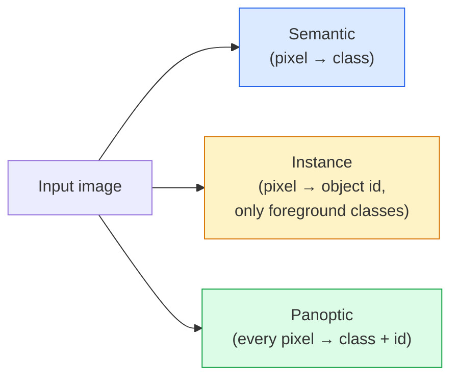
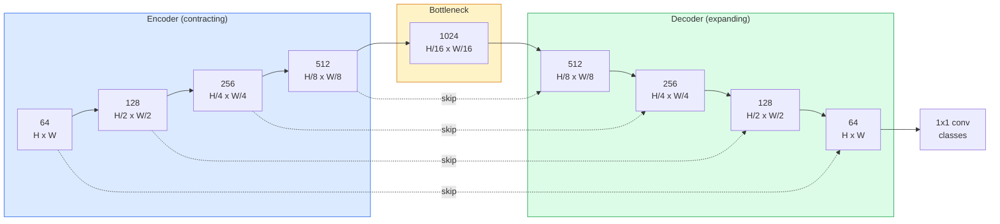

# 语义分割：U-Net

> Segmentation 是在每个 pixel 上做 classification。U-Net 通过配对 downsampling encoder 与 upsampling decoder，并在二者之间连接 skip connections，让这件事真正可行。

**类型:** Build
**语言:** Python
**先修:** Phase 4 Lesson 03 (CNNs), Phase 4 Lesson 04 (Image Classification)
**时间:** ~75 minutes

## 学习目标

- 区分 semantic、instance 和 panoptic segmentation，并为给定问题选择正确任务
- 在 PyTorch 中从零构建 U-Net，包括 encoder blocks、bottleneck、带 transposed convolutions 的 decoder，以及 skip connections
- 实现 pixel-wise cross-entropy、Dice loss，以及当前 medical 和 industrial segmentation 的默认 combined loss
- 按 class 读取 IoU 和 Dice metrics，并诊断坏分数来自 small-object recall、boundary accuracy 还是 class imbalance

## 要解决的问题

Classification 每张图像输出一个 label。Detection 每张图像输出若干 boxes。Segmentation 每个 pixel 输出一个 label。对于 size 为 `H x W` 的 input，output 是 shape 为 `H x W`（semantic）或 `H x W x N_instances`（instance）的 tensor。这是每张图像数百万个 prediction，而不是一个。

Segmentation 的结构解释了它为什么驱动几乎每个 dense-prediction vision product：medical imaging（tumour masks）、autonomous driving（road、lane、obstacle）、satellite（building footprints、crop boundaries）、document parsing（layout zones）、robotics（graspable regions）。这些任务都不能靠给 object 画一个 box 解决；它们需要精确 silhouette。

架构问题很容易说清，却不容易解决：你需要网络同时看到图像的 global context（这是什么 kind of scene）和 local pixel detail（究竟哪个 pixel 是 road，哪个是 pavement）。标准 CNN 会通过空间压缩获得 context，但这会丢掉 detail。U-Net 是同时得到二者的设计。

## 核心概念

### Semantic vs instance vs panoptic



- **Semantic** 说“这个 pixel 是 road，那个 pixel 是 car”。并排的两辆车会合并成单个 blob。
- **Instance** 说“这个 pixel 是 car #3，那个 pixel 是 car #5”。忽略 background stuff（“stuff” = sky、road、grass）。
- **Panoptic** 统一二者：每个 pixel 获得一个 class label，每个 instance 获得一个 unique id，stuff 和 thing 都被 segmented。

本课覆盖 semantic。下一课（Mask R-CNN）覆盖 instance。

### U-Net shape



Encoder 会把 spatial resolution 减半四次，并让 channel 翻倍。Decoder 反过来：把 spatial resolution 翻倍四次，并让 channel 减半。Skip connections 会在每个 resolution 上把匹配的 encoder features 与 decoder features concatenate。最终 1x1 conv 在 full resolution 上把 `64 -> num_classes`。

为什么 skip connections 必要：decoder 在尝试输出 pixel-level prediction 时，只看过小 feature map。没有 skips，它无法准确 localise edge，因为这些信息已经在 encoder 中被压缩掉了。Skip connections 会把 encoder 在下行途中计算出的 high-resolution feature maps 交给它。

### Transposed vs bilinear upsample

Decoder 必须扩展 spatial dimensions。两个选项：

- **Transposed convolution**（`nn.ConvTranspose2d`）— learnable upsample。历史 U-Net 默认。若 stride 和 kernel size 不能均匀整除，可能产生 checkerboard artifacts。
- **Bilinear upsample + 3x3 conv** — 平滑 upsample 后接一个 conv。artifact 更少、参数更少，现在是现代默认。

二者都会在真实项目中出现。对第一个 U-Net 来说，bilinear 更安全。

### Pixel grid 上的 cross-entropy

对于 C 类 semantic segmentation，model output 是 `(N, C, H, W)`。Target 是 `(N, H, W)`，包含 integer class IDs。Cross-entropy 与 classification case 相同，只是应用在每个空间位置：

```text
Loss = mean over (n, h, w) of -log( softmax(logits[n, :, h, w])[target[n, h, w]] )
```

PyTorch 中的 `F.cross_entropy` 原生处理这个 shape。无需 reshape。

### Dice loss 以及为什么需要它

Cross-entropy 平等看待每个 pixel。当一个 class 主导整个 frame 时，这是错的（medical imaging：99% background，1% tumour）。网络可以通过到处预测 background 达到 99% accuracy，但仍然毫无用处。

Dice loss 通过直接优化 predicted mask 和 true mask 的 overlap 来解决这个问题：

```text
Dice(p, y) = 2 * sum(p * y) / (sum(p) + sum(y) + epsilon)
Dice_loss = 1 - Dice
```

其中 `p` 是某个 class 的 sigmoid/softmax probability map，`y` 是 binary ground-truth mask。只有 overlap 完美时 loss 才为零。因为它是 ratio-based，class imbalance 不重要。

实践中，使用 **combined loss**：

```text
L = L_cross_entropy + lambda * L_dice       (lambda ~ 1)
```

Cross-entropy 在训练早期给出 stable gradients；Dice 让训练尾部专注于真正匹配 mask shape。这个组合是 medical-imaging default，在任何 class-imbalanced dataset 上都很难击败。

### 评估指标

- **Pixel accuracy** — 预测正确的 pixel 百分比。便宜。由于与 classification 中 accuracy 相同的原因，它在 imbalanced data 上坏掉。
- **IoU per class** — 每个 class mask 的 intersection over union；跨 class 平均 = mIoU。
- **Dice（pixel 上的 F1）** — 与 IoU 相似；`Dice = 2 * IoU / (1 + IoU)`。Medical imaging 偏好 Dice，driving community 偏好 IoU；二者单调相关。
- **Boundary F1** — 衡量 predicted boundary 与 ground-truth boundary 的接近程度，即使很小的 shift 也会惩罚。对 semiconductor inspection 等 high-precision task 很重要。

报告 IoU per class，而不只是 mIoU。Mean IoU 会隐藏一个 15% 的 class，即使其他九个 class 都是 85%。

### Input resolution trade-off

U-Net 的 encoder 会把 resolution 减半四次，因此 input 必须能被 16 整除。Medical image 经常是 512x512 或 1024x1024。Autonomous-driving crop 是 2048x1024。U-Net 的 memory cost 随 `H * W * C_max` 缩放；在 1024x1024 且有 1024 bottleneck channels 时，一次 forward pass 已经会使用数 GB VRAM。

两个标准 workaround：
1. Tile the input — 用 overlap 处理 256x256 tiles，再 stitch。
2. 用 dilated convolutions 替换 bottleneck，让 spatial resolution 保持更高，同时扩大 receptive field（DeepLab family）。

对第一个模型来说，带 64-channel-base U-Net 的 256x256 input 可以在 8 GB VRAM 上舒适训练。

## 动手实现

### Step 1: Encoder block

两个带 batch norm 和 ReLU 的 3x3 conv。第一个 conv 改变 channel count；第二个保持它。

```python
import torch
import torch.nn as nn
import torch.nn.functional as F

class DoubleConv(nn.Module):
    def __init__(self, in_c, out_c):
        super().__init__()
        self.net = nn.Sequential(
            nn.Conv2d(in_c, out_c, kernel_size=3, padding=1, bias=False),
            nn.BatchNorm2d(out_c),
            nn.ReLU(inplace=True),
            nn.Conv2d(out_c, out_c, kernel_size=3, padding=1, bias=False),
            nn.BatchNorm2d(out_c),
            nn.ReLU(inplace=True),
        )

    def forward(self, x):
        return self.net(x)
```

这个 block 会在全网复用。`bias=False` 是因为 BN 的 beta 处理 bias。

### Step 2: Down and up blocks

```python
class Down(nn.Module):
    def __init__(self, in_c, out_c):
        super().__init__()
        self.net = nn.Sequential(
            nn.MaxPool2d(2),
            DoubleConv(in_c, out_c),
        )

    def forward(self, x):
        return self.net(x)


class Up(nn.Module):
    def __init__(self, in_c, out_c):
        super().__init__()
        self.up = nn.Upsample(scale_factor=2, mode="bilinear", align_corners=False)
        self.conv = DoubleConv(in_c, out_c)

    def forward(self, x, skip):
        x = self.up(x)
        if x.shape[-2:] != skip.shape[-2:]:
            x = F.interpolate(x, size=skip.shape[-2:], mode="bilinear", align_corners=False)
        x = torch.cat([skip, x], dim=1)
        return self.conv(x)
```

只检查 spatial shape（`shape[-2:]`）可以处理输入尺寸不能被 16 整除的情况；safe `F.interpolate` 会在 concat 前对齐 tensor。比较完整 shape 也会因 channel-count difference 触发，而那应该是响亮错误，不是 silent interpolate。

### Step 3: U-Net

```python
class UNet(nn.Module):
    def __init__(self, in_channels=3, num_classes=2, base=64):
        super().__init__()
        self.inc = DoubleConv(in_channels, base)
        self.d1 = Down(base, base * 2)
        self.d2 = Down(base * 2, base * 4)
        self.d3 = Down(base * 4, base * 8)
        self.d4 = Down(base * 8, base * 16)
        self.u1 = Up(base * 16 + base * 8, base * 8)
        self.u2 = Up(base * 8 + base * 4, base * 4)
        self.u3 = Up(base * 4 + base * 2, base * 2)
        self.u4 = Up(base * 2 + base, base)
        self.outc = nn.Conv2d(base, num_classes, kernel_size=1)

    def forward(self, x):
        x1 = self.inc(x)
        x2 = self.d1(x1)
        x3 = self.d2(x2)
        x4 = self.d3(x3)
        x5 = self.d4(x4)
        x = self.u1(x5, x4)
        x = self.u2(x, x3)
        x = self.u3(x, x2)
        x = self.u4(x, x1)
        return self.outc(x)

net = UNet(in_channels=3, num_classes=2, base=32)
x = torch.randn(1, 3, 256, 256)
print(f"output: {net(x).shape}")
print(f"params: {sum(p.numel() for p in net.parameters()):,}")
```

Output shape `(1, 2, 256, 256)`：与 input 相同的 spatial size，`num_classes` 个 channel。`base=32` 时约 7.7M 参数。

### Step 4: Losses

```python
def dice_loss(logits, targets, num_classes, eps=1e-6):
    probs = F.softmax(logits, dim=1)
    targets_one_hot = F.one_hot(targets, num_classes).permute(0, 3, 1, 2).float()
    dims = (0, 2, 3)
    intersection = (probs * targets_one_hot).sum(dim=dims)
    denom = probs.sum(dim=dims) + targets_one_hot.sum(dim=dims)
    dice = (2 * intersection + eps) / (denom + eps)
    return 1 - dice.mean()


def combined_loss(logits, targets, num_classes, lam=1.0):
    ce = F.cross_entropy(logits, targets)
    dc = dice_loss(logits, targets, num_classes)
    return ce + lam * dc, {"ce": ce.item(), "dice": dc.item()}
```

Dice 按 class 计算，再平均（macro Dice）。`eps` 防止 batch 中缺失 class 时除以零。

### Step 5: IoU metric

```python
@torch.no_grad()
def iou_per_class(logits, targets, num_classes):
    preds = logits.argmax(dim=1)
    ious = torch.zeros(num_classes)
    for c in range(num_classes):
        pred_c = (preds == c)
        true_c = (targets == c)
        inter = (pred_c & true_c).sum().float()
        union = (pred_c | true_c).sum().float()
        ious[c] = (inter / union) if union > 0 else torch.tensor(float("nan"))
    return ious
```

返回长度为 C 的 vector。`nan` 标记 batch 中缺失的 class；计算 mIoU 时不要把这些纳入平均。

### Step 6: 用于 end-to-end verification 的 synthetic dataset

在彩色背景上生成 shape，让网络必须学习 shape，而不是 pixel colour。

```python
import numpy as np
from torch.utils.data import Dataset, DataLoader

def synthetic_segmentation(num_samples=200, size=64, seed=0):
    rng = np.random.default_rng(seed)
    images = np.zeros((num_samples, size, size, 3), dtype=np.float32)
    masks = np.zeros((num_samples, size, size), dtype=np.int64)
    for i in range(num_samples):
        bg = rng.uniform(0, 1, (3,))
        images[i] = bg
        masks[i] = 0
        num_shapes = rng.integers(1, 4)
        for _ in range(num_shapes):
            cls = int(rng.integers(1, 3))
            color = rng.uniform(0, 1, (3,))
            cx, cy = rng.integers(10, size - 10, size=2)
            r = int(rng.integers(4, 12))
            yy, xx = np.meshgrid(np.arange(size), np.arange(size), indexing="ij")
            if cls == 1:
                mask = (xx - cx) ** 2 + (yy - cy) ** 2 < r ** 2
            else:
                mask = (np.abs(xx - cx) < r) & (np.abs(yy - cy) < r)
            images[i][mask] = color
            masks[i][mask] = cls
        images[i] += rng.normal(0, 0.02, images[i].shape)
        images[i] = np.clip(images[i], 0, 1)
    return images, masks


class SegDataset(Dataset):
    def __init__(self, images, masks):
        self.images = images
        self.masks = masks

    def __len__(self):
        return len(self.images)

    def __getitem__(self, i):
        img = torch.from_numpy(self.images[i]).permute(2, 0, 1).float()
        mask = torch.from_numpy(self.masks[i]).long()
        return img, mask
```

三个 classes：background (0)、circles (1)、squares (2)。网络必须学习区分 shape。

### Step 7: Training loop

```python
def train_one_epoch(model, loader, optimizer, device, num_classes):
    model.train()
    loss_sum, total = 0.0, 0
    iou_sum = torch.zeros(num_classes)
    for x, y in loader:
        x, y = x.to(device), y.to(device)
        logits = model(x)
        loss, _ = combined_loss(logits, y, num_classes)
        optimizer.zero_grad()
        loss.backward()
        optimizer.step()
        loss_sum += loss.item() * x.size(0)
        total += x.size(0)
        iou_sum += iou_per_class(logits, y, num_classes).nan_to_num(0)
    return loss_sum / total, iou_sum / len(loader)
```

在 synthetic dataset 上运行 10-30 个 epoch，观察 shape class 的 mIoU 爬过 0.9。注意，`nan_to_num(0)` 会把 batch 中缺失的 class 当作零；要得到准确的 per-class IoU，应在 evaluation time 按 presence 做 mask，并跨 batch 使用 `torch.nanmean`，而不是在这里平均。

## 实际使用

生产中，`segmentation_models_pytorch`（“smp”）会用任意 torchvision 或 timm backbone 包装每个标准 segmentation architecture。三行：

```python
import segmentation_models_pytorch as smp

model = smp.Unet(
    encoder_name="resnet34",
    encoder_weights="imagenet",
    in_channels=3,
    classes=3,
)
```

真实工作中也值得知道：
- **DeepLabV3+** 用 dilated convs 替换基于 max-pool 的 downsampling，让 bottleneck 保持 resolution；在 satellite 和 driving data 上边界更快。
- **SegFormer** 用 hierarchical transformer 替换 conv encoder；在很多 benchmark 上是当前 SOTA。
- **Mask2Former** / **OneFormer** 在单一 architecture 中统一 semantic、instance 和 panoptic segmentation。

三者都可以在 `smp` 或 `transformers` 中作为 drop-in replacement 使用，并共享同一个 data loader。

## 交付成果

本课产出：

- `outputs/prompt-segmentation-task-picker.md` — 一个 prompt：在 semantic、instance 和 panoptic segmentation 之间选择，并为给定任务命名 architecture。
- `outputs/skill-segmentation-mask-inspector.md` — 一个 skill：报告 class distribution、predicted-mask statistics，以及 under-predicted 或 boundary-blurred 的 classes。

## 练习

1. **(Easy)** 为 binary segmentation task（foreground vs background）实现 `bce_dice_loss`。在 synthetic two-class dataset 上验证，当 foreground 只有 5% pixel 时，combined loss 比单独 BCE 收敛更快。
2. **(Medium)** 用 `nn.ConvTranspose2d` up-block 替换 `nn.Upsample + conv` up-block。在 synthetic dataset 上训练二者并比较 mIoU。观察 transposed-conv 版本中 checkerboard artifacts 出现在哪里。
3. **(Hard)** 取一个真实 segmentation dataset（Oxford-IIIT Pets、Cityscapes mini split 或一个 medical subset），把 U-Net 训练到距离 `smp.Unet` reference 不超过 2 IoU points。报告 per-class IoU，并识别哪些 class 从给 loss 添加 Dice 中受益最大。

## 关键术语

| 术语 | 常见说法 | 实际含义 |
|------|----------------|----------------------|
| Semantic segmentation | “Label every pixel” | Per-pixel classification 到 C 个 classes；同一 class 的 instances 会 merge |
| Instance segmentation | “Label every object” | 分离同一 class 的不同 instances；foreground-only |
| Panoptic segmentation | “Semantic + instance” | 每个 pixel 获得一个 class；每个 thing instance 还获得 unique id |
| Skip connection | “U-Net bridge” | 把 encoder features concatenate 到 matching-resolution decoder features；保留 high-frequency detail |
| Transposed conv | “Deconvolution” | Learnable upsampling；可能产生 checkerboard artifacts |
| Dice loss | “Overlap loss” | 1 - 2|A ∩ B| / (|A| + |B|)；直接优化 mask overlap，并且对 class imbalance robust |
| mIoU | “Mean intersection over union” | 跨 classes 平均 IoU；segmentation 的 community-standard metric |
| Boundary F1 | “Boundary accuracy” | 只在 boundary pixels 上计算的 F1 score；对 precision-critical task 很重要 |

## 延伸阅读

- [U-Net: Convolutional Networks for Biomedical Image Segmentation (Ronneberger et al., 2015)](https://arxiv.org/abs/1505.04597) — 原始论文；每个人都复制的图在第 2 页
- [Fully Convolutional Networks (Long et al., 2015)](https://arxiv.org/abs/1411.4038) — 第一篇把 segmentation 做成 end-to-end conv problem 的论文
- [segmentation_models_pytorch](https://github.com/qubvel/segmentation_models.pytorch) — production segmentation 的参考；每个标准 architecture 加每个标准 loss
- [Lessons learned from training SOTA segmentation (kaggle.com competitions)](https://www.kaggle.com/code/iafoss/carvana-unet-pytorch) — 为什么 TTA、pseudo-labeling 和 class weights 在真实数据上重要的 walkthrough
