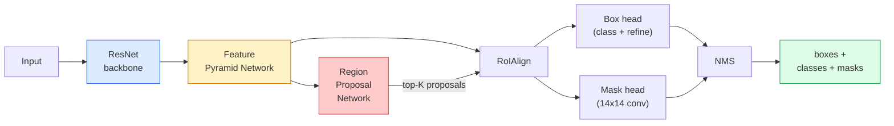

# 实例分割：Mask R-CNN

> 给 Faster R-CNN 检测器加上一条很小的 mask 分支，就得到了实例分割。真正困难的是 RoIAlign，而且它比看起来更难。

**类型：** Build + Learn
**语言：** Python
**先修：** Phase 4 Lesson 06 (YOLO), Phase 4 Lesson 07 (U-Net)
**时间：** ~75 分钟

## 学习目标

- 端到端追踪 Mask R-CNN 架构：backbone、FPN、RPN、RoIAlign、box head、mask head
- 从零实现 RoIAlign，并解释为什么 RoIPool 不再被使用
- 使用 torchvision 的 `maskrcnn_resnet50_fpn_v2` 预训练模型生成生产质量的实例 mask，并正确读取它的输出格式
- 通过替换 box head 和 mask head、冻结 backbone，在一个小型自定义数据集上微调 Mask R-CNN

## 要解决的问题

语义分割为每个类别给出一个 mask。实例分割为每个对象给出一个 mask，即使两个对象属于同一类别也能区分开。统计个体数量、跨帧跟踪、测量物体（墙上每块砖的边界框、显微镜图像里的每个细胞）都需要实例分割。

Mask R-CNN（He et al., 2017）通过把实例分割重构为“检测加 mask”解决了这个问题。这个设计非常干净，以至于接下来的五年里几乎所有实例分割论文都是 Mask R-CNN 的变体，而 torchvision 的实现至今仍是中小型数据集的生产默认选择。

困难的工程问题在于采样：如何从一个角点并不对齐像素边界的 proposal box 中裁出固定大小的特征区域？这里做错会在各处损失零点几的 mAP。RoIAlign 就是答案。

## 核心概念

### 架构



需要理解五个部分：

1. **Backbone** — 在 ImageNet 上训练的 ResNet-50 或 ResNet-101。产生步幅为 4、8、16、32 的多层级特征图。
2. **FPN（Feature Pyramid Network）** — 自顶向下和横向连接，让每一层级都拥有 C 个语义丰富的特征通道。检测时会查询与对象大小匹配的 FPN 层级。
3. **RPN（Region Proposal Network）** — 一个小型卷积头，在每个 anchor 位置预测“这里是否有对象？”以及“如何细化这个框？”。每张图像产生约 1000 个 proposal。
4. **RoIAlign** — 从任意 FPN 层级上的任意框采样出固定大小（例如 7x7）的特征 patch。使用双线性采样，不做量化。
5. **Heads** — 两层 box head，用于细化框并选择类别；再加一个小型 conv head，为每个 proposal 输出一个 `28x28` 二值 mask。

### 为什么用 RoIAlign，而不是 RoIPool

原始 Fast R-CNN 使用 RoIPool：它把 proposal box 分成网格，在每个 cell 中取最大特征，并把所有坐标四舍五入成整数。这种取整会让特征图与输入像素坐标最多错开整整一个特征图像素；在 224x224 图像上看似很小，但当特征图步幅是 32 时就很致命。

```text
RoIPool:
  box (34.7, 51.3, 98.2, 142.9)
  round -> (34, 51, 98, 142)
  split grid -> round each cell boundary
  misalignment accumulates at every step

RoIAlign:
  box (34.7, 51.3, 98.2, 142.9)
  sample at exact float coordinates using bilinear interpolation
  no rounding anywhere
```

RoIAlign 在 COCO 上几乎免费地把 mask AP 提高 3-4 个点。如今凡是重视定位的检测器都会使用它，YOLOv7 seg、RT-DETR、Mask2Former 都是如此。

### 用一段话理解 RPN

在特征图的每个位置放置 K 个不同大小和形状的 anchor box。为每个 anchor 预测 objectness 分数，并预测一个回归偏移，把 anchor 变成更贴合对象的框。按分数保留前约 1,000 个框，在 IoU 0.7 处应用 NMS，然后把保留下来的 proposal 交给 heads。RPN 使用自己的小型 loss 训练，结构与 Lesson 6 的 YOLO loss 相同，只是类别变成两个（object / no object）。

### mask head

对每个 proposal（经过 RoIAlign 之后），mask head 是一个很小的 FCN：四个 3x3 conv、一个 2x deconv、最后一个 1x1 conv，在 `28x28` 分辨率上产生 `num_classes` 个输出通道。只保留预测类别对应的通道；其余通道被忽略。这把 mask 预测和分类解耦了。

把 28x28 mask 上采样到 proposal 的原始像素大小，就得到最终二值 mask。

### 损失

Mask R-CNN 把四类损失相加：

```text
L = L_rpn_cls + L_rpn_box + L_box_cls + L_box_reg + L_mask
```

- `L_rpn_cls`、`L_rpn_box` — RPN proposals 的 objectness 与 box regression。
- `L_box_cls` — head 分类器上对 (C+1) 个类别（包含 background）的交叉熵。
- `L_box_reg` — head 的 box refinement 上的 smooth L1。
- `L_mask` — 28x28 mask 输出上的逐像素 binary cross-entropy。

每个 loss 都有自己的默认权重；torchvision 实现将它们暴露为构造参数。

### 输出格式

`torchvision.models.detection.maskrcnn_resnet50_fpn_v2` 返回一个 dict 列表，每张图像一个 dict：

```text
{
    "boxes":  (N, 4) in (x1, y1, x2, y2) pixel coordinates,
    "labels": (N,) class IDs, 0 = background so indices are 1-based,
    "scores": (N,) confidence scores,
    "masks":  (N, 1, H, W) float masks in [0, 1] — threshold at 0.5 for binary,
}
```

mask 已经是完整图像分辨率。28x28 head 输出已经在内部上采样。

## 动手实现

### Step 1：从零实现 RoIAlign

这是 Mask R-CNN 中唯一一个用代码比用文字更容易理解的组件。

```python
import torch
import torch.nn.functional as F

def roi_align_single(feature, box, output_size=7, spatial_scale=1 / 16.0):
    """
    feature: (C, H, W) single-image feature map
    box: (x1, y1, x2, y2) in original image pixel coordinates
    output_size: side of the output grid (7 for box head, 14 for mask head)
    spatial_scale: reciprocal of the feature map stride
    """
    C, H, W = feature.shape
    x1, y1, x2, y2 = [c * spatial_scale - 0.5 for c in box]
    bin_w = (x2 - x1) / output_size
    bin_h = (y2 - y1) / output_size

    grid_y = torch.linspace(y1 + bin_h / 2, y2 - bin_h / 2, output_size)
    grid_x = torch.linspace(x1 + bin_w / 2, x2 - bin_w / 2, output_size)
    yy, xx = torch.meshgrid(grid_y, grid_x, indexing="ij")

    gx = 2 * (xx + 0.5) / W - 1
    gy = 2 * (yy + 0.5) / H - 1
    grid = torch.stack([gx, gy], dim=-1).unsqueeze(0)
    sampled = F.grid_sample(feature.unsqueeze(0), grid, mode="bilinear",
                            align_corners=False)
    return sampled.squeeze(0)
```

每个数值都位于一次双线性采样的位置上。没有取整，没有量化，也没有被丢弃的梯度。

### Step 2：与 torchvision 的 RoIAlign 对比

```python
from torchvision.ops import roi_align

feature = torch.randn(1, 16, 50, 50)
boxes = torch.tensor([[0, 10, 20, 100, 90]], dtype=torch.float32)  # (batch_idx, x1, y1, x2, y2)

ours = roi_align_single(feature[0], boxes[0, 1:].tolist(), output_size=7, spatial_scale=1/4)
theirs = roi_align(feature, boxes, output_size=(7, 7), spatial_scale=1/4, sampling_ratio=1, aligned=True)[0]

print(f"shape ours:   {tuple(ours.shape)}")
print(f"shape theirs: {tuple(theirs.shape)}")
print(f"max|diff|:    {(ours - theirs).abs().max().item():.3e}")
```

当 `sampling_ratio=1` 且 `aligned=True` 时，两者在 `1e-5` 以内一致。

### Step 3：加载预训练 Mask R-CNN

```python
import torch
from torchvision.models.detection import maskrcnn_resnet50_fpn_v2, MaskRCNN_ResNet50_FPN_V2_Weights

model = maskrcnn_resnet50_fpn_v2(weights=MaskRCNN_ResNet50_FPN_V2_Weights.DEFAULT)
model.eval()
print(f"params: {sum(p.numel() for p in model.parameters()):,}")
print(f"classes (including background): {len(model.roi_heads.box_predictor.cls_score.out_features * [0])}")
```

4600 万参数，91 个类别（COCO）。第一个类别（id 0）是 background；模型真正检测的所有内容都从 id 1 开始。

### Step 4：运行推理

```python
with torch.no_grad():
    x = torch.randn(3, 400, 600)
    predictions = model([x])
p = predictions[0]
print(f"boxes:  {tuple(p['boxes'].shape)}")
print(f"labels: {tuple(p['labels'].shape)}")
print(f"scores: {tuple(p['scores'].shape)}")
print(f"masks:  {tuple(p['masks'].shape)}")
```

mask tensor 的形状是 `(N, 1, H, W)`。在 0.5 处阈值化即可得到每个对象的二值 mask：

```python
binary_masks = (p['masks'] > 0.5).squeeze(1)  # (N, H, W) boolean
```

### Step 5：为自定义类别数替换 heads

常见微调配方：复用 backbone、FPN 和 RPN；替换两个分类器 head。

```python
from torchvision.models.detection.faster_rcnn import FastRCNNPredictor
from torchvision.models.detection.mask_rcnn import MaskRCNNPredictor

def build_custom_maskrcnn(num_classes):
    model = maskrcnn_resnet50_fpn_v2(weights=MaskRCNN_ResNet50_FPN_V2_Weights.DEFAULT)
    in_features = model.roi_heads.box_predictor.cls_score.in_features
    model.roi_heads.box_predictor = FastRCNNPredictor(in_features, num_classes)
    in_features_mask = model.roi_heads.mask_predictor.conv5_mask.in_channels
    hidden_layer = 256
    model.roi_heads.mask_predictor = MaskRCNNPredictor(in_features_mask, hidden_layer, num_classes)
    return model

custom = build_custom_maskrcnn(num_classes=5)
print(f"custom cls_score.out_features: {custom.roi_heads.box_predictor.cls_score.out_features}")
```

`num_classes` 必须包含 background class，因此有 4 个对象类别的数据集使用 `num_classes=5`。

### Step 6：冻结不需要训练的部分

在小数据集上，冻结 backbone 和 FPN。只让 RPN objectness + regression 以及两个 heads 学习。

```python
def freeze_backbone_and_fpn(model):
    # torchvision Mask R-CNN packs the FPN inside `model.backbone` (as
    # `model.backbone.fpn`), so iterating `model.backbone.parameters()` covers
    # both the ResNet feature layers and the FPN lateral/output convs.
    for p in model.backbone.parameters():
        p.requires_grad = False
    return model

custom = freeze_backbone_and_fpn(custom)
trainable = sum(p.numel() for p in custom.parameters() if p.requires_grad)
print(f"trainable after freeze: {trainable:,}")
```

在 500 张图像的数据集上，这就是收敛和过拟合之间的差别。

## 实际使用

torchvision 中 Mask R-CNN 的完整训练循环只有 40 行，而且不同任务之间意义上几乎不变：替换数据集，然后开跑。

```python
def train_step(model, images, targets, optimizer):
    model.train()
    loss_dict = model(images, targets)
    losses = sum(loss for loss in loss_dict.values())
    optimizer.zero_grad()
    losses.backward()
    optimizer.step()
    return {k: v.item() for k, v in loss_dict.items()}
```

`targets` 列表必须包含逐图像 dict，其中有 `boxes`、`labels` 和 `masks`（形状为 `(num_instances, H, W)` 的二值 tensor）。训练时模型返回四个 loss 组成的 dict；eval 时返回预测列表，具体取决于 `model.training`。

`pycocotools` evaluator 会分别为 boxes 和 masks 产生 mAP@IoU=0.5:0.95；你需要两个数字，才能判断瓶颈在 box head 还是 mask head。

## 交付成果

本课产出：

- `outputs/prompt-instance-vs-semantic-router.md` — 一个 prompt，会问三个问题，并选择 instance、semantic 或 panoptic，以及准确的起始模型。
- `outputs/skill-mask-rcnn-head-swapper.md` — 一个 skill：给定新的 `num_classes`，为任意 torchvision detection model 生成替换 heads 所需的 10 行代码。

## 练习

1. **（简单）** 在 100 个随机 box 上用 `torchvision.ops.roi_align` 验证你的 RoIAlign。报告最大绝对差异。再运行 RoIPool（2017 年前的行为），展示它会在靠近边界的 box 上偏离约 1-2 个特征图像素。
2. **（中等）** 在 50 张图像的自定义数据集上微调 `maskrcnn_resnet50_fpn_v2`（任意两个类别：气球、鱼、坑洞、logo）。冻结 backbone，训练 20 个 epoch，并报告 mask AP@0.5。
3. **（困难）** 把 Mask R-CNN 的 mask head 替换为预测 56x56 而不是 28x28 的版本。测量前后 mAP@IoU=0.75。解释收益（或没有收益）为什么符合边界精度 / 内存权衡的预期。

## 关键术语

| 术语 | 人们常说 | 实际含义 |
|------|----------------|----------------------|
| Mask R-CNN | “检测加 masks” | Faster R-CNN + 一个小型 FCN head，为每个 proposal、每个类别预测一个 28x28 mask |
| FPN | “特征金字塔” | 自顶向下 + 横向连接，让每个 stride 层级都拥有 C 个语义丰富的特征通道 |
| RPN | “区域 proposer” | 一个小型 conv head，每张图像产生约 1000 个 object/no-object proposal |
| RoIAlign | “无取整裁剪” | 从任意浮点坐标 box 中双线性采样固定大小的特征网格 |
| RoIPool | “2017 年前的裁剪” | 与 RoIAlign 目的相同，但会对 box 坐标取整；已经过时 |
| Mask AP | “实例 mAP” | 使用 mask IoU 而不是 box IoU 计算的 average precision；COCO 实例分割指标 |
| Binary mask head | “逐类别 mask” | 为每个 proposal 的每个类别预测一个 binary mask；只保留预测类别的通道 |
| Background class | “Class 0” | 统称“无对象”的类别；真实类别的索引从 1 开始 |

## 延伸阅读

- [Mask R-CNN (He et al., 2017)](https://arxiv.org/abs/1703.06870) — 原论文；第 3 节关于 RoIAlign 的部分最关键
- [FPN: Feature Pyramid Networks (Lin et al., 2017)](https://arxiv.org/abs/1612.03144) — FPN 论文；每个现代检测器都会用它
- [torchvision Mask R-CNN tutorial](https://pytorch.org/tutorials/intermediate/torchvision_tutorial.html) — 微调循环的参考
- [Detectron2 model zoo](https://github.com/facebookresearch/detectron2/blob/main/MODEL_ZOO.md) — 生产实现，包含几乎每种检测和分割变体的训练权重
