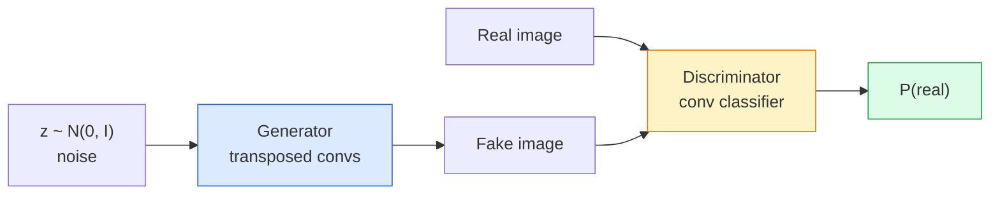
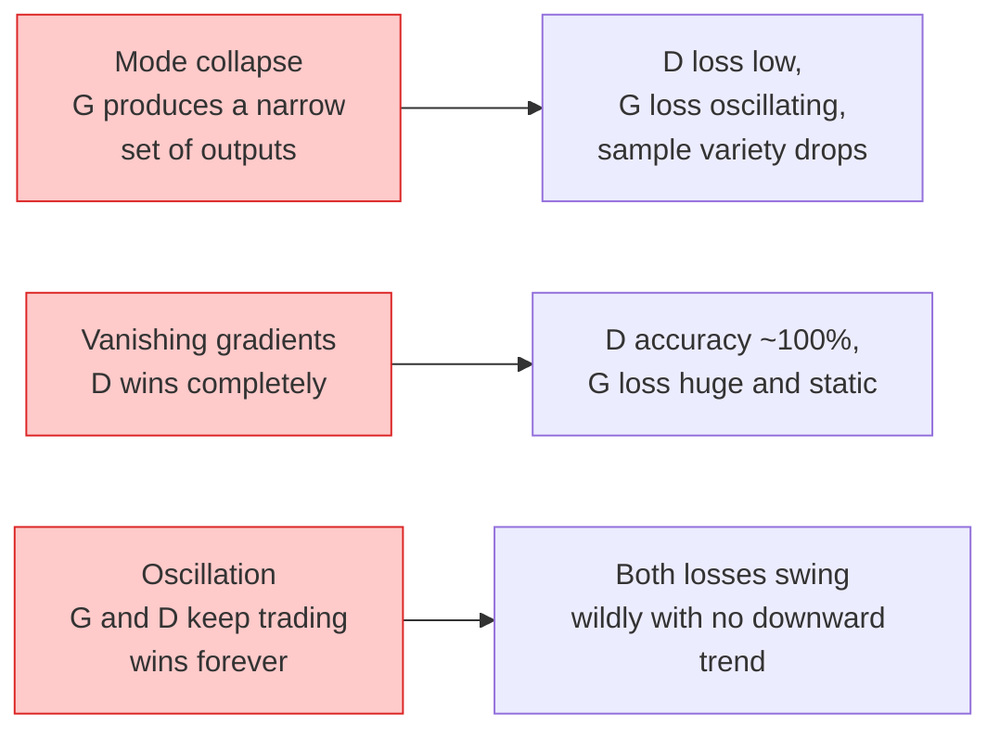

# 图像生成：GAN

> GAN 是两个神经网络之间的一场固定博弈。一个负责作画，一个负责批评。它们一起变强，直到作品骗过批评者。

**类型：** Build
**语言：** Python
**先修：** Phase 4 Lesson 03 (CNNs), Phase 3 Lesson 06 (Optimizers), Phase 3 Lesson 07 (Regularization)
**时间：** ~75 分钟

## 学习目标

- 解释 generator 与 discriminator 之间的 minimax 博弈，以及为什么均衡对应 p_model = p_data
- 在 PyTorch 中实现 DCGAN，并用不到 60 行代码让它生成连贯的 32x32 合成图像
- 用三个标准技巧稳定 GAN 训练：non-saturating loss、spectral norm、TTUR（two-timescale update rule）
- 读懂训练曲线，区分健康收敛、mode collapse、oscillation 和 discriminator-wins-completely

## 要解决的问题

分类教网络把图像映射到标签。生成把问题反过来：采样看起来来自同一分布的新图像。这里没有一个“正确”输出可供逐像素 diff；只有一个你想模仿的分布。

标准损失函数（MSE、cross-entropy）无法衡量“这个样本是否来自真实分布”。最小化逐像素误差会产生模糊的平均图像，而不是真实感样本。突破点是学习这个损失：训练第二个网络，让它的任务是区分 real 和 fake，再用它的判断推动 generator。

GAN（Goodfellow et al., 2014）定义了这个框架。到 2018 年，StyleGAN 已经能生成与照片难以区分的 1024x1024 人脸。此后 diffusion models 在质量和可控性上登顶，但让 diffusion 变得实用的许多技巧——normalisation 选择、latent spaces、feature losses——最早都是在 GAN 上被理解清楚的。

## 核心概念

### 两个网络



**generator** G 接收一个噪声向量 `z`，输出一张图像。**discriminator** D 接收一张图像，输出一个标量：这张图像为真实图像的概率。

### 博弈

G 希望 D 出错。D 希望自己判断正确。形式化写作：

```text
min_G max_D  E_x[log D(x)] + E_z[log(1 - D(G(z)))]
```

从右向左读：D 正在最大化它在 real（`log D(real)`）和 fake（`log (1 - D(fake))`）图像上的准确性。G 正在最小化 D 对 fake 的准确性，也就是希望 `D(G(z))` 很高。

Goodfellow 证明，这个 minimax 存在一个全局均衡：`p_G = p_data`，D 在所有地方都输出 0.5，生成分布与真实分布之间的 Jensen-Shannon divergence 为零。难点在于如何到达那里。

### Non-saturating loss

上面的形式在数值上不稳定。训练早期，每个 fake 的 `D(G(z))` 都接近零，所以 `log(1 - D(G(z)))` 对 G 的梯度会消失。修复方式：翻转 G 的 loss。

```text
L_D = -E_x[log D(x)] - E_z[log(1 - D(G(z)))]
L_G = -E_z[log D(G(z))]                          # non-saturating
```

现在当 `D(G(z))` 接近零时，G 的 loss 很大，梯度也有信息量。每个现代 GAN 都用这个变体训练。

### DCGAN 架构规则

Radford、Metz、Chintala（2015）把多年失败实验提炼成五条能让 GAN 训练稳定的规则：

1. 用 strided conv 替代 pooling（两个网络都如此）。
2. 在 generator 和 discriminator 中都使用 batch norm，但 G 的输出层和 D 的输入层除外。
3. 在更深架构中移除 fully connected layers。
4. G 的所有层使用 ReLU，输出层除外（输出层用 tanh，把值放在 [-1, 1]）。
5. D 的所有层使用 LeakyReLU（negative_slope=0.2）。

每个现代 conv-based GAN（StyleGAN、BigGAN、GigaGAN）仍从这些规则出发，然后一次替换其中一个组件。

### 失败模式及其信号



- **Mode collapse**：G 找到一张能骗过 D 的图像，然后只生成它。修复：加入 minibatch discrimination、spectral norm，或 label-conditioning。
- **Discriminator wins**：D 太快变得太强，G 的梯度消失。修复：缩小 D、降低 D 的学习率，或对 real labels 使用 label smoothing。
- **Oscillation**：两个网络不断轮流获胜，却从未接近均衡。修复：TTUR（D 的学习速度比 G 快 2-4 倍），或切换到 Wasserstein loss。

### 评估

GAN 没有 ground truth，那怎么知道它们是否有效？

- **样本检查** — 每个 epoch 结束都直接看 64 个样本。不可商量。
- **FID（Fréchet Inception Distance）** — real 与 generated 样本集合的 Inception-v3 特征分布之间的距离。越低越好。社区标准。
- **Inception Score** — 更老也更脆弱；优先使用 FID。
- **生成模型的 Precision/Recall** — 分别度量质量（precision）和覆盖度（recall）。比单独看 FID 信息量更大。

对于一次小型合成数据运行，样本检查就足够了。

## 动手实现

### Step 1：Generator

一个小型 DCGAN generator，接收 64 维噪声并产生 32x32 图像。

```python
import torch
import torch.nn as nn

class Generator(nn.Module):
    def __init__(self, z_dim=64, img_channels=3, feat=64):
        super().__init__()
        self.net = nn.Sequential(
            nn.ConvTranspose2d(z_dim, feat * 4, kernel_size=4, stride=1, padding=0, bias=False),
            nn.BatchNorm2d(feat * 4),
            nn.ReLU(inplace=True),
            nn.ConvTranspose2d(feat * 4, feat * 2, kernel_size=4, stride=2, padding=1, bias=False),
            nn.BatchNorm2d(feat * 2),
            nn.ReLU(inplace=True),
            nn.ConvTranspose2d(feat * 2, feat, kernel_size=4, stride=2, padding=1, bias=False),
            nn.BatchNorm2d(feat),
            nn.ReLU(inplace=True),
            nn.ConvTranspose2d(feat, img_channels, kernel_size=4, stride=2, padding=1, bias=False),
            nn.Tanh(),
        )

    def forward(self, z):
        return self.net(z.view(z.size(0), -1, 1, 1))
```

四个 transposed conv，每个都用 `kernel_size=4, stride=2, padding=1`，从而干净地把空间大小翻倍。通过 tanh 将输出激活限制在 [-1, 1]。

### Step 2：Discriminator

Generator 的镜像。LeakyReLU、strided conv，最后输出一个标量 logit。

```python
class Discriminator(nn.Module):
    def __init__(self, img_channels=3, feat=64):
        super().__init__()
        self.net = nn.Sequential(
            nn.Conv2d(img_channels, feat, kernel_size=4, stride=2, padding=1),
            nn.LeakyReLU(0.2, inplace=True),
            nn.Conv2d(feat, feat * 2, kernel_size=4, stride=2, padding=1, bias=False),
            nn.BatchNorm2d(feat * 2),
            nn.LeakyReLU(0.2, inplace=True),
            nn.Conv2d(feat * 2, feat * 4, kernel_size=4, stride=2, padding=1, bias=False),
            nn.BatchNorm2d(feat * 4),
            nn.LeakyReLU(0.2, inplace=True),
            nn.Conv2d(feat * 4, 1, kernel_size=4, stride=1, padding=0),
        )

    def forward(self, x):
        return self.net(x).view(-1)
```

最后一个 conv 把 `4x4` 特征图缩减为 `1x1`。输出是每张图像一个标量；只在 loss 计算时应用 sigmoid。

### Step 3：训练步骤

交替进行：每个 batch 先更新 D 一次，再更新 G 一次。

```python
import torch.nn.functional as F

def train_step(G, D, real, z, opt_g, opt_d, device):
    real = real.to(device)
    bs = real.size(0)

    # D step
    opt_d.zero_grad()
    d_real = D(real)
    d_fake = D(G(z).detach())
    loss_d = (F.binary_cross_entropy_with_logits(d_real, torch.ones_like(d_real))
              + F.binary_cross_entropy_with_logits(d_fake, torch.zeros_like(d_fake)))
    loss_d.backward()
    opt_d.step()

    # G step
    opt_g.zero_grad()
    d_fake = D(G(z))
    loss_g = F.binary_cross_entropy_with_logits(d_fake, torch.ones_like(d_fake))
    loss_g.backward()
    opt_g.step()

    return loss_d.item(), loss_g.item()
```

D 步骤里的 `G(z).detach()` 至关重要：我们不希望梯度在 D 的更新中流入 G。忘记这一点是经典新手错误。

### Step 4：在合成形状上运行完整训练循环

```python
from torch.utils.data import DataLoader, TensorDataset
import numpy as np

def synthetic_images(num=2000, size=32, seed=0):
    rng = np.random.default_rng(seed)
    imgs = np.zeros((num, 3, size, size), dtype=np.float32) - 1.0
    for i in range(num):
        r = rng.uniform(6, 12)
        cx, cy = rng.uniform(r, size - r, size=2)
        yy, xx = np.meshgrid(np.arange(size), np.arange(size), indexing="ij")
        mask = (xx - cx) ** 2 + (yy - cy) ** 2 < r ** 2
        color = rng.uniform(-0.5, 1.0, size=3)
        for c in range(3):
            imgs[i, c][mask] = color[c]
    return torch.from_numpy(imgs)

device = "cuda" if torch.cuda.is_available() else "cpu"
data = synthetic_images()
loader = DataLoader(TensorDataset(data), batch_size=64, shuffle=True)

G = Generator(z_dim=64, img_channels=3, feat=32).to(device)
D = Discriminator(img_channels=3, feat=32).to(device)
opt_g = torch.optim.Adam(G.parameters(), lr=2e-4, betas=(0.5, 0.999))
opt_d = torch.optim.Adam(D.parameters(), lr=2e-4, betas=(0.5, 0.999))

for epoch in range(10):
    for (batch,) in loader:
        z = torch.randn(batch.size(0), 64, device=device)
        ld, lg = train_step(G, D, batch, z, opt_g, opt_d, device)
    print(f"epoch {epoch}  D {ld:.3f}  G {lg:.3f}")
```

`Adam(lr=2e-4, betas=(0.5, 0.999))` 是 DCGAN 默认设置，较低的 beta1 会避免 momentum 项过度稳定这个对抗博弈。

### Step 5：采样

```python
@torch.no_grad()
def sample(G, n=16, z_dim=64, device="cpu"):
    G.eval()
    z = torch.randn(n, z_dim, device=device)
    imgs = G(z)
    imgs = (imgs + 1) / 2
    return imgs.clamp(0, 1)
```

采样前务必切换到 eval 模式。对 DCGAN 来说这很重要，因为 batch norm 会使用 running stats，而不是当前 batch 的统计量。

### Step 6：Spectral normalisation

这是 discriminator 中 BN 的即插即用替代品，可以保证网络是 1-Lipschitz。它能修复大多数 “D wins too hard” 失败。

```python
from torch.nn.utils import spectral_norm

def build_sn_discriminator(img_channels=3, feat=64):
    return nn.Sequential(
        spectral_norm(nn.Conv2d(img_channels, feat, 4, 2, 1)),
        nn.LeakyReLU(0.2, inplace=True),
        spectral_norm(nn.Conv2d(feat, feat * 2, 4, 2, 1)),
        nn.LeakyReLU(0.2, inplace=True),
        spectral_norm(nn.Conv2d(feat * 2, feat * 4, 4, 2, 1)),
        nn.LeakyReLU(0.2, inplace=True),
        spectral_norm(nn.Conv2d(feat * 4, 1, 4, 1, 0)),
    )
```

把 `Discriminator` 换成 `build_sn_discriminator()`，你通常就不需要 TTUR 技巧。Spectral norm 是你能应用的最简单单项鲁棒性升级。

## 实际使用

严肃的生成任务应使用预训练权重，或切换到 diffusion。两个标准库：

- `torch_fidelity` 可在不编写自定义 eval 代码的情况下为你的 generator 计算 FID / IS。
- `pytorch-gan-zoo`（legacy）和 `StudioGAN` 提供经过测试的 DCGAN、WGAN-GP、SN-GAN、StyleGAN 和 BigGAN 实现。

到 2026 年，GAN 仍然是这些场景的最佳选择：实时图像生成（latency <10 ms）、style transfer、具有精确控制的 image-to-image translation（Pix2Pix、CycleGAN）。Diffusion 在 photorealism 和 text conditioning 上胜出。

## 交付成果

本课产出：

- `outputs/prompt-gan-training-triage.md` — 一个 prompt，读取训练曲线描述，并选择失败模式（mode collapse、D-wins、oscillation）以及单个推荐修复方案。
- `outputs/skill-dcgan-scaffold.md` — 一个 skill，根据 `z_dim`、目标 `image_size` 和 `num_channels` 写出 DCGAN scaffold，包括训练循环和样本保存器。

## 练习

1. **（简单）** 在合成圆形数据集上训练上面的 DCGAN，并在每个 epoch 结束保存 16 个样本组成的网格。生成圆形到第几个 epoch 会明显变圆？
2. **（中等）** 用 spectral norm 替换 discriminator 的 batch norm。并排训练两个版本。哪个收敛更快？哪个在三个 seed 上方差更低？
3. **（困难）** 实现 conditional DCGAN：把 class label 同时送入 G 和 D（在 G 中把 one-hot 拼接到噪声，在 D 中拼接一个 class embedding channel）。在 Lesson 7 的合成 “circles vs squares” 数据集上训练，并通过指定 labels 采样来展示 class conditioning 生效。

## 关键术语

| 术语 | 人们常说 | 实际含义 |
|------|----------------|----------------------|
| Generator (G) | “负责画东西的网络” | 把噪声映射到图像；训练目标是骗过 discriminator |
| Discriminator (D) | “批评者” | 二分类器；训练目标是区分真实图像和生成图像 |
| Minimax | “这场博弈” | 对抗损失上对 G 取 min、对 D 取 max；均衡为 p_G = p_data |
| Non-saturating loss | “数值上正常的版本” | G 的 loss 使用 -log(D(G(z))) 而不是 log(1 - D(G(z)))，以避免训练早期梯度消失 |
| Mode collapse | “Generator 只生成一种东西” | G 只产生数据分布中的一个小子集；可用 SN、minibatch discrimination 或更大的 batch 修复 |
| TTUR | “两个学习率” | D 学得比 G 快，通常快 2-4 倍；用于稳定训练 |
| Spectral norm | “1-Lipschitz 层” | 一种权重归一化，会约束每层的 Lipschitz 常数；阻止 D 变得任意陡峭 |
| FID | “Fréchet Inception Distance” | real 与 generated 集合的 Inception-v3 特征分布之间的距离；标准评估指标 |

## 延伸阅读

- [Generative Adversarial Networks (Goodfellow et al., 2014)](https://arxiv.org/abs/1406.2661) — 开创这一领域的论文
- [DCGAN (Radford, Metz, Chintala, 2015)](https://arxiv.org/abs/1511.06434) — 让 GAN 变得可训练的架构规则
- [Spectral Normalization for GANs (Miyato et al., 2018)](https://arxiv.org/abs/1802.05957) — 最有用的单个稳定化技巧
- [StyleGAN3 (Karras et al., 2021)](https://arxiv.org/abs/2106.12423) — SOTA GAN；读起来像过去十年所有技巧的精选集
