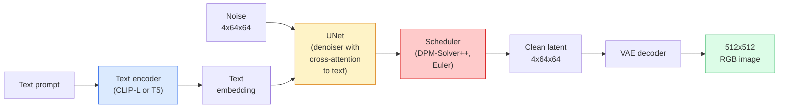

# Stable Diffusion：架构与微调

> Stable Diffusion 是一个在预训练 VAE 的 latent space 中运行的 DDPM，通过 cross-attention 接收文本条件，用快速 deterministic ODE solver 采样，并由 classifier-free guidance 引导。

**类型：** Learn + Use
**语言：** Python
**先修：** Phase 4 Lesson 10 (Diffusion), Phase 7 Lesson 02 (Self-Attention)
**时间：** ~75 分钟

## 学习目标

- 追踪 Stable Diffusion pipeline 的五个部分：VAE、text encoder、U-Net、scheduler、safety checker，并说明每个部分实际做什么
- 解释 latent diffusion，以及为什么在 4x64x64 latent space（而不是 3x512x512 图像）中训练能在不损失质量的情况下减少 48x 计算量
- 使用 `diffusers` 生成图像，运行 image-to-image、inpainting 和 ControlNet-guided generation
- 在小型自定义数据集上用 LoRA 微调 Stable Diffusion，并在推理时加载 LoRA adapter

## 要解决的问题

直接在 512x512 RGB 图像上训练 DDPM 代价很高。每个训练步骤都要通过一个看到 3x512x512 = 786,432 个输入值的 U-Net 做反向传播，而采样需要 50+ 次通过同一个 U-Net 的 forward pass。在 Stable Diffusion 1.5（2022 年发布）的质量水平上，pixel-space diffusion 大约需要 256 个 GPU-month 的训练，并且在消费级 GPU 上每张图像要 10-30 秒。

让开源权重 text-to-image 变得实用的技巧是 **latent diffusion**（Rombach et al., CVPR 2022）。先训练一个 VAE，把 3x512x512 图像映射到 4x64x64 latent tensor 并能映射回来，然后在这个 latent space 中做 diffusion。计算量下降 `(3*512*512)/(4*64*64) = 48x`。在同一块 GPU 上，采样从几十秒降到两秒以内。

几乎每个现代图像生成模型——SDXL、SD3、FLUX、HunyuanDiT、Wan-Video——都是 latent diffusion model，只是在 autoencoder、denoiser（U-Net 或 DiT）和 text conditioning 上有所变化。学会 Stable Diffusion，你就学会了这个模板。

## 核心概念

### Pipeline



- **VAE** — 冻结的 autoencoder。Encoder 把图像变成 latents（用于 img2img 和训练）。Decoder 把 latents 转回图像。
- **Text encoder** — CLIP text encoder（SD 1.x/2.x）、CLIP-L + CLIP-G（SDXL）或 T5-XXL（SD3/FLUX）。产生一串 token embeddings。
- **U-Net** — denoiser。它有 cross-attention layers，在每个分辨率层级从 latents attend 到 text embedding。
- **Scheduler** — 采样算法（DDIM、Euler、DPM-Solver++）。选择 sigmas，并把预测噪声混合回 latent。
- **Safety checker** — 可选的 NSFW / illegal-content 输出图像过滤器。

### Classifier-free guidance（CFG）

普通 text conditioning 会为每个 prompt `c` 学习 `epsilon_theta(x_t, t, c)`。CFG 训练同一个网络，但有 10% 的时间会丢弃 `c`（替换为空 embedding），从而得到一个同时预测 conditional 和 unconditional noise 的单一模型。推理时：

```text
eps = eps_uncond + w * (eps_cond - eps_uncond)
```

`w` 是 guidance scale。`w=0` 是 unconditional，`w=1` 是普通 conditional，`w>1` 会把输出推向“更受 prompt 条件约束”，代价是降低多样性。SD 默认 `w=7.5`。

CFG 是 text-to-image 能达到生产质量的原因。没有它，prompts 对输出的偏置很弱；有了它，prompts 会主导结果。

### Latent space geometry

VAE 的 4-channel latent 不只是压缩图像。它是一个 manifold，在其中 arithmetic 大致对应语义编辑（prompt engineering + interpolation 都发生在这里），也是 diffusion U-Net 投入全部建模预算的地方。解码一个随机 4x64x64 latent 不会产生随机风格图像，而是会产生垃圾，因为只有 latent 的特定 submanifold 能解码为有效图像。

两个后果：

1. **Img2img** = 把图像编码成 latent，加入部分噪声，运行 denoiser，再解码。由于编码近似可逆，图像结构会保留下来；内容根据 prompt 改变。
2. **Inpainting** = 与 img2img 相同，但 denoiser 只更新 masked regions；unmasked regions 保持为编码后的 latent。

### U-Net 架构

SD U-Net 是 Lesson 10 中 TinyUNet 的大型版本，并增加了三项：

- 每个空间分辨率都有 **Transformer blocks**，包含 self-attention + 到 text embedding 的 cross-attention。
- 通过 sinusoidal encoding 上的 MLP 加入 **Time embedding**。
- Encoder 和 decoder 的匹配分辨率之间有 **Skip connections**。

SD 1.5 总参数量约 860M。SDXL 约 2.6B。FLUX 约 12B。参数量的增长主要来自 attention layers。

### LoRA 微调

完整微调 Stable Diffusion 需要 20+ GB VRAM，并更新 860M 参数。LoRA（Low-Rank Adaptation）保持 base model 冻结，并把小型 rank-decomposition matrices 注入 attention layers。一个 SD LoRA adapter 通常为 10-50 MB，可在单张消费级 GPU 上用 10-60 分钟训练完成，并在推理时作为即插即用修改加载。

```text
Original: W_q : (d_in, d_out)   frozen
LoRA:     W_q + alpha * (A @ B)   where A : (d_in, r), B : (r, d_out)

r is typically 4-32.
```

LoRA 是几乎所有社区 fine-tune 的分发方式。CivitAI 和 Hugging Face 托管着数百万个 LoRA。

### 你会见到的 schedulers

- **DDIM** — deterministic，约 50 步，简单。
- **Euler ancestral** — stochastic，30-50 步，样本略更有创造性。
- **DPM-Solver++ 2M Karras** — deterministic，20-30 步，生产默认。
- **LCM / TCD / Turbo** — consistency models 和 distilled variants；1-4 步，代价是质量略降。

在 `diffusers` 中替换 scheduler 是一行代码，有时不需要任何重新训练就能修复采样问题。

## 动手实现

本课端到端使用 `diffusers`，而不是从零重建 Stable Diffusion。你需要重建的组件（VAE、text encoder、U-Net、scheduler）本身都是各自的课程主题；这里的目标是熟悉生产 API。

### Step 1：Text-to-image

```python
import torch
from diffusers import StableDiffusionPipeline

pipe = StableDiffusionPipeline.from_pretrained(
    "runwayml/stable-diffusion-v1-5",
    torch_dtype=torch.float16,
).to("cuda")

image = pipe(
    prompt="a dog riding a skateboard in tokyo, studio ghibli style",
    guidance_scale=7.5,
    num_inference_steps=25,
    generator=torch.Generator("cuda").manual_seed(42),
).images[0]
image.save("dog.png")
```

`float16` 会把 VRAM 减半，且没有可见质量损失。使用默认 DPM-Solver++ 时，`num_inference_steps=25` 的效果可匹配 DDIM 的 `num_inference_steps=50`。

### Step 2：替换 scheduler

```python
from diffusers import DPMSolverMultistepScheduler, EulerAncestralDiscreteScheduler

pipe.scheduler = DPMSolverMultistepScheduler.from_config(pipe.scheduler.config)
pipe.scheduler = EulerAncestralDiscreteScheduler.from_config(pipe.scheduler.config)
```

Scheduler state 与 U-Net weights 解耦。你可以在 DDPM 上训练，并用任何 scheduler 采样。

### Step 3：Image-to-image

```python
from diffusers import StableDiffusionImg2ImgPipeline
from PIL import Image

img2img = StableDiffusionImg2ImgPipeline.from_pretrained(
    "runwayml/stable-diffusion-v1-5",
    torch_dtype=torch.float16,
).to("cuda")

init_image = Image.open("dog.png").convert("RGB").resize((512, 512))
out = img2img(
    prompt="a dog riding a skateboard, oil painting",
    image=init_image,
    strength=0.6,
    guidance_scale=7.5,
).images[0]
```

`strength` 表示 denoising 前加入多少噪声（0.0 = 不变，1.0 = 完全重新生成）。0.5-0.7 是 style transfer 的标准范围。

### Step 4：Inpainting

```python
from diffusers import StableDiffusionInpaintPipeline

inpaint = StableDiffusionInpaintPipeline.from_pretrained(
    "runwayml/stable-diffusion-inpainting",
    torch_dtype=torch.float16,
).to("cuda")

image = Image.open("dog.png").convert("RGB").resize((512, 512))
mask = Image.open("dog_mask.png").convert("L").resize((512, 512))

out = inpaint(
    prompt="a cat",
    image=image,
    mask_image=mask,
    guidance_scale=7.5,
).images[0]
```

mask 中的白色像素是要重新生成的区域。黑色像素会被保留。

### Step 5：LoRA 加载

```python
pipe.load_lora_weights("sayakpaul/sd-lora-ghibli")
pipe.fuse_lora(lora_scale=0.8)

image = pipe(prompt="a village square in ghibli style").images[0]
```

`lora_scale` 控制强度；0.0 = 无效果，1.0 = 完整效果。`fuse_lora` 会为了速度把 adapter 原地烘进权重，但会阻止替换。加载另一个 adapter 前先调用 `pipe.unfuse_lora()`。

### Step 6：LoRA training（sketch）

真实 LoRA training 位于 `peft` 或 `diffusers.training` 中。大纲如下：

```python
# Pseudocode
for step, batch in enumerate(dataloader):
    images, prompts = batch
    latents = vae.encode(images).latent_dist.sample() * 0.18215

    t = torch.randint(0, num_train_timesteps, (batch_size,))
    noise = torch.randn_like(latents)
    noisy_latents = scheduler.add_noise(latents, noise, t)

    text_emb = text_encoder(tokenizer(prompts))

    pred_noise = unet(noisy_latents, t, text_emb)  # LoRA weights injected here

    loss = F.mse_loss(pred_noise, noise)
    loss.backward()
    optimizer.step()
```

只有 LoRA matrices 接收梯度；base U-Net、VAE 和 text encoder 都被冻结。batch size 为 1 且开启 gradient checkpointing 时，它可以放进 8 GB VRAM。

## 实际使用

生产中你真正会做的决策：

- **Model family**：SD 1.5 用于开源社区 fine-tunes，SDXL 用于更高保真度，SD3 / FLUX 用于 state of the art 和严格许可要求。
- **Scheduler**：20-30 步使用 DPM-Solver++ 2M Karras；延迟低于 1s 时使用 LCM-LoRA。
- **Precision**：4080/4090 上用 `float16`，A100 及更新硬件上用 `bfloat16`，VRAM 紧张时用 `int8`（通过 `bitsandbytes` 或 `compel`）。
- **Conditioning**：纯文本可用；如果需要更强控制，在 base pipeline 之上加入 ControlNet（canny、depth、pose）。

批量生成时，`AUTO1111` / `ComfyUI` 是社区工具；生产 API 则用 `diffusers` + `accelerate`，或配合 TensorRT compilation 的 `optimum-nvidia`。

## 交付成果

本课产出：

- `outputs/prompt-sd-pipeline-planner.md` — 一个 prompt，会在给定 latency budget、fidelity target 和 licensing constraint 时选择 SD 1.5 / SDXL / SD3 / FLUX，以及 scheduler 和 precision。
- `outputs/skill-lora-training-setup.md` — 一个 skill，会为自定义数据集写完整 LoRA training config，包括 captions、rank、batch size 和 learning rate。

## 练习

1. **（简单）** 用同一个 prompt 和 `[1, 3, 5, 7.5, 10, 15]` 中的 `guidance_scale` 生成图像。描述图像如何变化。artefacts 在哪个 guidance 值出现？
2. **（中等）** 取任意真实照片，在 `[0.2, 0.4, 0.6, 0.8, 1.0]` 中不同 `strength` 下通过 `StableDiffusionImg2ImgPipeline` 运行。哪个 strength 能在改变风格的同时保留构图？为什么 1.0 会完全忽略输入？
3. **（困难）** 用单一主体（宠物、logo、角色）的 10-20 张图像训练 LoRA，并生成包含该主体的新场景。报告在不过拟合输入图像的前提下实现最佳身份保持的 LoRA rank 和 training steps。

## 关键术语

| 术语 | 人们常说 | 实际含义 |
|------|----------------|----------------------|
| Latent diffusion | “在 latents 中 diffuse” | 在 VAE latent space（4x64x64）而不是 pixel space（3x512x512）中运行整个 DDPM；节省 48x 计算 |
| VAE scale factor | “0.18215” | 把 VAE 原始 latent 重新缩放到近似单位方差的常数；硬编码在每个 SD pipeline 中 |
| Classifier-free guidance | “CFG” | 混合 conditional 和 unconditional noise predictions；影响最大的单个推理旋钮 |
| Scheduler | “Sampler” | 把噪声 + 模型预测转化为 denoised latent trajectory 的算法 |
| LoRA | “Low-rank adapter” | 小型 rank-decomposition matrices，在不触碰 base weights 的情况下微调 attention layers |
| Cross-attention | “Text-image attention” | 从 latent tokens 到 text tokens 的 attention；在每个 U-Net 层级注入 prompt 信息 |
| ControlNet | “Structure conditioning” | 一个单独训练的 adapter，用额外输入（canny、depth、pose、segmentation）引导 SD |
| DPM-Solver++ | “默认 scheduler” | 二阶 deterministic ODE solver；在 2026 年的低 step count（20-30）下质量最佳 |

## 延伸阅读

- [High-Resolution Image Synthesis with Latent Diffusion (Rombach et al., 2022)](https://arxiv.org/abs/2112.10752) — Stable Diffusion 论文；包含证明设计合理性的所有 ablation
- [Classifier-Free Diffusion Guidance (Ho & Salimans, 2022)](https://arxiv.org/abs/2207.12598) — CFG 论文
- [LoRA: Low-Rank Adaptation of Large Language Models (Hu et al., 2021)](https://arxiv.org/abs/2106.09685) — LoRA 最早来自 NLP；迁移到 SD 时几乎不需要改动
- [diffusers documentation](https://huggingface.co/docs/diffusers) — 每个 SD / SDXL / SD3 / FLUX pipeline 的参考
