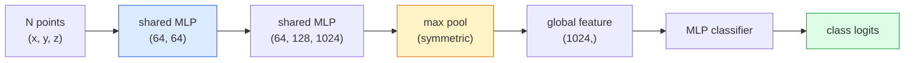

# 3D Vision：Point Clouds 与 NeRFs

> 3D vision 有两种形态。Point clouds 是传感器的原始输出。NeRFs 是学到的 volumetric field。二者都在回答“空间中什么东西在哪里”。

**类型：** Learn + Build
**语言：** Python
**先修：** Phase 4 Lesson 03 (CNNs), Phase 1 Lesson 12 (Tensor Operations)
**时间：** ~45 分钟

## 学习目标

- 区分显式（point cloud、mesh、voxel）和隐式（signed distance field、NeRF）3D representations，并说明何时使用它们
- 理解 PointNet 的 symmetric-function trick：它让神经网络能在无序点集上保持 permutation-invariant
- 追踪一次 NeRF forward pass：ray casting、volumetric rendering、positional encoding、MLP density+colour head
- 使用 `nerfstudio` 或 `instant-ngp`，从少量带 pose 的图像进行预训练 3D reconstruction

## 要解决的问题

相机会产生 2D 图像。LIDAR 会产生一组没有顺序的 3D 点。Structure-from-motion pipeline 会产生稀疏 3D keypoints cloud。NeRF 会从少量带 pose 图像中重建完整 3D 场景。所有这些都属于“vision”，但没有一个看起来像 CNN 想要的 dense tensor。

3D vision 很重要，因为几乎所有高价值机器人任务都运行在 3D 中：grasping、obstacle avoidance、navigation、AR occlusion、3D content capture。只理解 2D 图像的视觉工程师，会被锁在这个领域增长最快的一块之外（AR/VR 内容、机器人、自动驾驶栈、基于 NeRF 的房地产或施工 3D reconstruction）。

两种 representation 因不同原因占主导。Point clouds 是传感器免费给你的东西。NeRFs 及其后继者（3D Gaussian splatting、neural SDFs）是当你让神经网络学习一个场景时得到的东西。

## 核心概念

### Point clouds

Point cloud 是 R^3 中 N 个点组成的无序集合，每个点也可以带有 features（colour、intensity、normal）。

```text
cloud = [
  (x1, y1, z1, r1, g1, b1),
  (x2, y2, z2, r2, g2, b2),
  ...
  (xN, yN, zN, rN, gN, bN),
]
```

没有 grid，没有 connectivity。两个性质让神经网络很难处理它：

- **Permutation invariance** — 输出不能依赖点的顺序。
- **Variable N** — 单个模型必须能处理不同大小的 clouds。

PointNet（Qi et al., 2017）用一个想法同时解决二者：对每个点应用 shared MLP，然后用 symmetric function（max pool）聚合。结果是一个不依赖顺序的固定大小向量。

```text
f(P) = max_{p in P} MLP(p)
```

这就是 PointNet 的整个核心。更深的变体（PointNet++、Point Transformer）加入了 hierarchical sampling 和 local aggregation，但 symmetric-function trick 没变。

### PointNet 架构



“Shared MLP” 表示同一个 MLP 独立运行在每个点上。为了效率，通常实现为沿 point dimension 的 1x1 conv。

### Neural Radiance Fields（NeRFs）

NeRFs（Mildenhall et al., 2020）提出了问题：“能否从 N 张照片重建 3D 场景？”它给出的答案是：神经网络本身就是这个场景。网络把 `(x, y, z, viewing_direction)` 映射到 `(density, colour)`。渲染一个新视角就是对这个网络运行 ray-casting loop。

```text
NeRF MLP:  (x, y, z, theta, phi) -> (sigma, r, g, b)

To render a pixel (u, v) of a new view:
  1. Cast a ray from the camera through pixel (u, v)
  2. Sample points along the ray at distances t_1, t_2, ..., t_N
  3. Query the MLP at each point
  4. Composite the colours weighted by (1 - exp(-sigma * dt))
  5. The sum is the rendered pixel colour
```

Loss 会把 rendered pixel 与训练照片中的 ground-truth pixel 对比。通过 rendering step 反向传播会更新 MLP。没有 3D ground truth，没有显式几何；场景存储在 MLP 权重中。

### NeRF 中的 positional encoding

直接给 vanilla MLP 输入 `(x, y, z)` 无法表示高频细节，因为 MLP 有偏向低频的 spectral bias。NeRF 通过在 MLP 之前把每个坐标编码为 Fourier feature vector 来修复它：

```text
gamma(p) = (sin(2^0 pi p), cos(2^0 pi p), sin(2^1 pi p), cos(2^1 pi p), ...)
```

最高到 L=10 个频率层级。这与 transformers 用于 positions 的技巧相同，也会在 diffusion time conditioning 中再次出现（Lesson 10）。没有它，NeRFs 会显得模糊。

### Volumetric rendering

```text
C(r) = sum_i T_i * (1 - exp(-sigma_i * delta_i)) * c_i

T_i  = exp(- sum_{j<i} sigma_j * delta_j)
delta_i = t_{i+1} - t_i
```

`T_i` 是 transmittance，也就是有多少光能到达点 i。`(1 - exp(-sigma_i * delta_i))` 是点 i 处的 opacity。`c_i` 是 colour。最终 pixel 是 ray 上的加权和。

### 什么取代了 NeRFs

纯 NeRFs 训练很慢（小时级），渲染也慢（每张图像数秒）。之后的谱系：

- **Instant-NGP**（2022）— hash-grid encoding 替代 MLP 的 position input；几秒内训练完成。
- **Mip-NeRF 360** — 处理 unbounded scenes 和 anti-aliasing。
- **3D Gaussian Splatting**（2023）— 用数百万个 3D Gaussians 替代 volumetric field；分钟级训练，实时渲染。当前生产默认。

到 2026 年，几乎所有真实 NeRF 产品实际都是 3D Gaussian splatting。心智模型仍然是 NeRF。

### 数据集和 benchmarks

- **ShapeNet** — 3D CAD models 作为 point clouds 的 classification 和 segmentation。
- **ScanNet** — 用于 segmentation 的真实室内 scans。
- **KITTI** — 自动驾驶用的户外 LIDAR point clouds。
- **NeRF Synthetic** / **Blended MVS** — 用于 view synthesis 的 posed-image datasets。
- **Mip-NeRF 360** dataset — unbounded real scenes。

## 动手实现

### Step 1：PointNet classifier

```python
import torch
import torch.nn as nn

class PointNet(nn.Module):
    def __init__(self, num_classes=10):
        super().__init__()
        self.mlp1 = nn.Sequential(
            nn.Conv1d(3, 64, 1),    nn.BatchNorm1d(64),   nn.ReLU(inplace=True),
            nn.Conv1d(64, 64, 1),   nn.BatchNorm1d(64),   nn.ReLU(inplace=True),
        )
        self.mlp2 = nn.Sequential(
            nn.Conv1d(64, 128, 1),  nn.BatchNorm1d(128),  nn.ReLU(inplace=True),
            nn.Conv1d(128, 1024, 1), nn.BatchNorm1d(1024), nn.ReLU(inplace=True),
        )
        self.head = nn.Sequential(
            nn.Linear(1024, 512),   nn.BatchNorm1d(512),  nn.ReLU(inplace=True),
            nn.Dropout(0.3),
            nn.Linear(512, 256),    nn.BatchNorm1d(256),  nn.ReLU(inplace=True),
            nn.Dropout(0.3),
            nn.Linear(256, num_classes),
        )

    def forward(self, x):
        # x: (N, 3, num_points) — transposed for Conv1d
        x = self.mlp1(x)
        x = self.mlp2(x)
        x = torch.max(x, dim=-1)[0]       # (N, 1024)
        return self.head(x)

pts = torch.randn(4, 3, 1024)
net = PointNet(num_classes=10)
print(f"output: {net(pts).shape}")
print(f"params: {sum(p.numel() for p in net.parameters()):,}")
```

约 1.6M 参数。每个 cloud 运行 1,024 个点。

### Step 2：Positional encoding

```python
def positional_encoding(x, L=10):
    """
    x: (..., D) -> (..., D * 2 * L)
    """
    freqs = 2.0 ** torch.arange(L, dtype=x.dtype, device=x.device)
    args = x.unsqueeze(-1) * freqs * 3.141592653589793
    sinc = torch.cat([args.sin(), args.cos()], dim=-1)
    return sinc.reshape(*x.shape[:-1], -1)

x = torch.randn(5, 3)
y = positional_encoding(x, L=10)
print(f"input:  {x.shape}")
print(f"encoded: {y.shape}     # (5, 60)")
```

乘以 `2^l * pi` 会给出逐步升高的频率。

### Step 3：Tiny NeRF MLP

```python
class TinyNeRF(nn.Module):
    def __init__(self, L_pos=10, L_dir=4, hidden=128):
        super().__init__()
        self.L_pos = L_pos
        self.L_dir = L_dir
        pos_dim = 3 * 2 * L_pos
        dir_dim = 3 * 2 * L_dir
        self.trunk = nn.Sequential(
            nn.Linear(pos_dim, hidden), nn.ReLU(inplace=True),
            nn.Linear(hidden, hidden),  nn.ReLU(inplace=True),
            nn.Linear(hidden, hidden),  nn.ReLU(inplace=True),
            nn.Linear(hidden, hidden),  nn.ReLU(inplace=True),
        )
        self.sigma = nn.Linear(hidden, 1)
        self.color = nn.Sequential(
            nn.Linear(hidden + dir_dim, hidden // 2), nn.ReLU(inplace=True),
            nn.Linear(hidden // 2, 3), nn.Sigmoid(),
        )

    def forward(self, x, d):
        x_enc = positional_encoding(x, self.L_pos)
        d_enc = positional_encoding(d, self.L_dir)
        h = self.trunk(x_enc)
        sigma = torch.relu(self.sigma(h)).squeeze(-1)
        rgb = self.color(torch.cat([h, d_enc], dim=-1))
        return sigma, rgb

nerf = TinyNeRF()
x = torch.randn(128, 3)
d = torch.randn(128, 3)
s, c = nerf(x, d)
print(f"sigma: {s.shape}   rgb: {c.shape}")
```

与原始 NeRF（两个深度为 8 的 MLP trunks）相比非常小。足以展示架构。

### Step 4：沿 ray 做 volumetric rendering

```python
def volumetric_render(sigma, rgb, t_vals):
    """
    sigma: (..., N_samples)
    rgb:   (..., N_samples, 3)
    t_vals: (N_samples,) distances along the ray
    """
    delta = torch.cat([t_vals[1:] - t_vals[:-1], torch.full_like(t_vals[:1], 1e10)])
    alpha = 1.0 - torch.exp(-sigma * delta)
    trans = torch.cumprod(torch.cat([torch.ones_like(alpha[..., :1]), 1.0 - alpha + 1e-10], dim=-1), dim=-1)[..., :-1]
    weights = alpha * trans
    rendered = (weights.unsqueeze(-1) * rgb).sum(dim=-2)
    depth = (weights * t_vals).sum(dim=-1)
    return rendered, depth, weights


N = 64
t_vals = torch.linspace(2.0, 6.0, N)
sigma = torch.rand(N) * 0.5
rgb = torch.rand(N, 3)
rendered, depth, weights = volumetric_render(sigma, rgb, t_vals)
print(f"rendered colour: {rendered.tolist()}")
print(f"depth:           {depth.item():.2f}")
```

一条 ray、64 个 samples，合成为单个 RGB pixel 和一个 depth。

## 实际使用

真实工作中：

- `nerfstudio`（Tancik et al.）— 当前 NeRF / Instant-NGP / Gaussian Splatting 的参考库。命令行加 web viewer。
- `pytorch3d`（Meta）— differentiable rendering、point-cloud utilities、mesh ops。
- `open3d` — point cloud processing、registration、visualisation。

部署时，3D Gaussian splatting 已在很大程度上取代纯 NeRFs，因为它渲染快 100 倍。重建质量相当。

## 交付成果

本课产出：

- `outputs/prompt-3d-task-router.md` — 一个 prompt，会根据任务和输入数据路由到合适的 3D representation（point cloud、mesh、voxel、NeRF、Gaussian splat）。
- `outputs/skill-point-cloud-loader.md` — 一个 skill，会为 .ply / .pcd / .xyz 文件写 PyTorch `Dataset`，包含正确 normalisation、centring 和 point sampling。

## 练习

1. **（简单）** 展示 PointNet 是 permutation-invariant：同一个 cloud 跑两次，一次把点打乱。验证输出在 floating-point noise 范围内相同。
2. **（中等）** 实现最小 ray-generation 函数：给定 camera intrinsics 和 pose，为 H x W 图像的每个 pixel 产生 ray origins 和 directions。
3. **（困难）** 在彩色立方体渲染视图的合成数据集上训练 TinyNeRF（通过 differentiable rendering 或简单 ray tracer 生成）。报告 epoch 1、10、100 的 rendering loss。模型到第几个 epoch 会产生可识别视图？

## 关键术语

| 术语 | 人们常说 | 实际含义 |
|------|----------------|----------------------|
| Point cloud | “来自 LIDAR 的 3D 点” | 无序的 (x, y, z) 集合，每个点可带 optional features |
| PointNet | “第一个处理 point clouds 的神经网络” | 每点 shared MLP + symmetric (max) pool；结构上天然 permutation-invariant |
| NeRF | “MLP 就是场景” | 把 (x, y, z, dir) 映射到 (density, colour) 的网络；通过 ray casting 渲染 |
| Positional encoding | “Fourier features” | 把每个坐标编码成多个频率上的 sin/cos，以克服 MLP 的低频偏置 |
| Volumetric rendering | “Ray integration” | 使用 transmittance 和 alpha 把 ray 上的 samples 合成为单个 pixel |
| Instant-NGP | “Hash-grid NeRF” | 用 multi-resolution hash grid 替代 NeRF 的 coordinate MLP；快 100-1000 倍 |
| 3D Gaussian splatting | “数百万个 Gaussians” | Scene = 3D Gaussians 集合；实时渲染，分钟级训练 |
| SDF | “Signed distance field” | 返回到最近表面的 signed distance 的函数；另一种 implicit representation |

## 延伸阅读

- [PointNet (Qi et al., 2017)](https://arxiv.org/abs/1612.00593) — permutation-invariant classifier
- [NeRF (Mildenhall et al., 2020)](https://arxiv.org/abs/2003.08934) — 让从照片做 3D reconstruction 成为神经网络问题的论文
- [Instant-NGP (Müller et al., 2022)](https://arxiv.org/abs/2201.05989) — hash grids，1000x speedup
- [3D Gaussian Splatting (Kerbl et al., 2023)](https://arxiv.org/abs/2308.04079) — 在生产中取代 NeRFs 的架构
