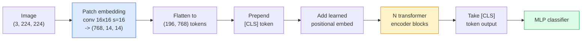

# 视觉 Transformer（ViT）

> 把图像切成 patches，把每个 patch 当成一个词，运行标准 transformer。不要回头。

**类型：** Build
**语言：** Python
**先修：** Phase 7 Lesson 02 (Self-Attention), Phase 4 Lesson 04 (Image Classification)
**时间：** ~45 分钟

## 学习目标

- 从零实现 patch embedding、learned positional embedding、class token 和 transformer encoder blocks，构建一个最小 ViT
- 解释为什么 ViT 曾被认为需要海量预训练数据，直到 DeiT 和 MAE 证明并非如此
- 从 architecture priors（无、local window attention、conv backbone）角度比较 ViT、Swin 和 ConvNeXt
- 使用 `timm` 和标准 linear-probe / fine-tune 配方，在小型数据集上微调预训练 ViT

## 要解决的问题

十年来，convolution 几乎就是 computer vision 的同义词。CNN 具有强 inductive biases：locality、translation equivariance，没人认为你可以替代它们。然后 Dosovitskiy et al.（2020）展示了一个 plain transformer：直接应用到 flattened image patches 上，完全没有 convolutional machinery，却能在规模足够时匹配或击败最好的 CNN。

问题在于“规模足够”。ViT 在 ImageNet-1k 上输给 ResNet。ViT 在 ImageNet-21k 或 JFT-300M 上预训练，再在 ImageNet-1k 上 fine-tune 后才击败它。结论是 transformers 缺少有用 priors，但可以从足够多数据中学会它们。后续工作（DeiT、MAE、DINO）表明，只要训练配方合适——强 augmentation、self-supervised pretraining、distillation——ViTs 在小数据上也能训练得很好。

到 2026 年，纯 CNN 在 edge devices 上仍有竞争力（ConvNeXt 最强），但 transformers 主导其他一切：segmentation（Mask2Former、SegFormer）、detection（DETR、RT-DETR）、multimodal（CLIP、SigLIP）、video（VideoMAE、VJEPA）。ViT block structure 是必须掌握的结构。

## 核心概念

### 管线



七个步骤。Patches -> tokens -> attention -> classifier。每个变体（DeiT、Swin、ConvNeXt、MAE pretraining）都只改变这七步中的一两步，其余保持不变。

### Patch embedding

第一个 conv 是秘密。Kernel size 16、stride 16，因此 224x224 图像变成 14x14 的 16x16 patch 网格，每个 patch 投影为 768 维 embedding。这个单一 conv 同时完成 patchify 和 linear projection。

```text
Input:  (3, 224, 224)
Conv (3 -> 768, k=16, s=16, no padding):
Output: (768, 14, 14)
Flatten spatial: (196, 768)
```

196 个 patches = 196 个 tokens。每个 token 的 feature dimension 是 768（ViT-B）、1024（ViT-L）或 1280（ViT-H）。

### Class token

一个 learned vector 被 prepend 到序列前：

```text
tokens = [CLS; patch_1; patch_2; ...; patch_196]   shape (197, 768)
```

经过 N 个 transformer blocks 后，`[CLS]` 输出就是全局图像表示。Classification head 只读取这一个向量。

### Positional embedding

Transformers 没有内置空间位置概念。给每个 token 加一个 learned vector：

```text
tokens = tokens + learned_pos_embedding   (also shape (197, 768))
```

这个 embedding 是模型参数；gradient-based training 会让它适应 2D 图像结构。Sinusoidal 2D alternatives 存在，但实践中很少使用。

### Transformer encoder block

标准结构。Multi-head self-attention、MLP、residual connections、pre-LayerNorm。

```text
x = x + MSA(LN(x))
x = x + MLP(LN(x))

MLP is two-layer with GELU: Linear(d -> 4d) -> GELU -> Linear(4d -> d)
```

ViT-B/16 堆叠 12 个这样的 blocks，每个 block 有 12 个 attention heads，总计 86M 参数。

### 为什么用 pre-LN

早期 transformers 使用 post-LN（`x = LN(x + sublayer(x))`），超过 6-8 层后如果没有 warmup 就很难训练。Pre-LN（`x = x + sublayer(LN(x))`）能在没有 warmup 的情况下稳定训练更深网络。每个 ViT 和每个现代 LLM 都使用 pre-LN。

### Patch size 权衡

- 16x16 patches -> 196 tokens，标准设置。
- 32x32 patches -> 49 tokens，更快但分辨率更低。
- 8x8 patches -> 784 tokens，更细但 O(n^2) attention cost 扩展很差。

更大的 patches = 更少 tokens = 更快但空间细节更少。SwinV2 在 hierarchical windows 中使用 4x4 patches。

### DeiT 在 ImageNet-1k 上训练 ViT 的配方

原始 ViT 需要 JFT-300M 才能击败 CNN。DeiT（Touvron et al., 2020）只用 ImageNet-1k 就把 ViT-B 训练到 81.8% top-1，靠四个变化：

1. Heavy augmentation：RandAugment、Mixup、CutMix、Random Erasing。
2. Stochastic depth（训练时随机 drop 整个 blocks）。
3. Repeated augmentation（同一张图像每 batch 采样 3 次）。
4. 从 CNN teacher 做 distillation（可选，会进一步提升准确率）。

每个现代 ViT 训练配方都源自 DeiT。

### Swin vs ConvNeXt

- **Swin**（Liu et al., 2021）— window-based attention。每个 block 在 local window 内做 attention；交替 blocks 会 shift window，以便跨 windows 混合信息。它在保留 attention operator 的同时重新引入 CNN-like locality prior。
- **ConvNeXt**（Liu et al., 2022）— 重新设计的 CNN，匹配 Swin 的架构选择（depthwise convs、LayerNorm、GELU、inverted bottleneck）。它证明差距不在于“attention vs convolution”，而在于“modern training recipe + architecture”。

2026 年，ConvNeXt-V2 和 Swin-V2 都是生产级；正确选择取决于你的 inference stack（ConvNeXt 更适合 edge 编译）和 pretraining corpus。

### MAE pretraining

Masked Autoencoder（He et al., 2022）：随机 mask 75% 的 patches，训练 encoder 只处理可见的 25%，再训练一个小 decoder 从 encoder 输出重建 masked patches。预训练后丢弃 decoder，fine-tune encoder。

MAE 让 ViT 只在 ImageNet-1k 上就可训练，达到 SOTA，并成为当前默认 self-supervised recipe。

## 动手实现

### Step 1：Patch embedding

```python
import torch
import torch.nn as nn

class PatchEmbedding(nn.Module):
    def __init__(self, in_channels=3, patch_size=16, dim=192, image_size=64):
        super().__init__()
        assert image_size % patch_size == 0
        self.proj = nn.Conv2d(in_channels, dim, kernel_size=patch_size, stride=patch_size)
        num_patches = (image_size // patch_size) ** 2
        self.num_patches = num_patches

    def forward(self, x):
        x = self.proj(x)
        return x.flatten(2).transpose(1, 2)
```

一个 conv、一个 flatten、一个 transpose。这就是完整 image-to-tokens 步骤。

### Step 2：Transformer block

Pre-LN、multi-head self-attention、带 GELU 的 MLP、residual connections。

```python
class Block(nn.Module):
    def __init__(self, dim, num_heads, mlp_ratio=4, dropout=0.0):
        super().__init__()
        self.ln1 = nn.LayerNorm(dim)
        self.attn = nn.MultiheadAttention(dim, num_heads, dropout=dropout, batch_first=True)
        self.ln2 = nn.LayerNorm(dim)
        self.mlp = nn.Sequential(
            nn.Linear(dim, dim * mlp_ratio),
            nn.GELU(),
            nn.Dropout(dropout),
            nn.Linear(dim * mlp_ratio, dim),
            nn.Dropout(dropout),
        )

    def forward(self, x):
        a, _ = self.attn(self.ln1(x), self.ln1(x), self.ln1(x), need_weights=False)
        x = x + a
        x = x + self.mlp(self.ln2(x))
        return x
```

`nn.MultiheadAttention` 负责切分 heads、scaled dot-product 和 output projection。`batch_first=True`，因此形状是 `(N, seq, dim)`。

### Step 3：ViT

```python
class ViT(nn.Module):
    def __init__(self, image_size=64, patch_size=16, in_channels=3,
                 num_classes=10, dim=192, depth=6, num_heads=3, mlp_ratio=4):
        super().__init__()
        self.patch = PatchEmbedding(in_channels, patch_size, dim, image_size)
        num_patches = self.patch.num_patches
        self.cls_token = nn.Parameter(torch.zeros(1, 1, dim))
        self.pos_embed = nn.Parameter(torch.zeros(1, num_patches + 1, dim))
        self.blocks = nn.ModuleList([
            Block(dim, num_heads, mlp_ratio) for _ in range(depth)
        ])
        self.ln = nn.LayerNorm(dim)
        self.head = nn.Linear(dim, num_classes)
        nn.init.trunc_normal_(self.pos_embed, std=0.02)
        nn.init.trunc_normal_(self.cls_token, std=0.02)

    def forward(self, x):
        x = self.patch(x)
        cls = self.cls_token.expand(x.size(0), -1, -1)
        x = torch.cat([cls, x], dim=1)
        x = x + self.pos_embed
        for blk in self.blocks:
            x = blk(x)
        x = self.ln(x[:, 0])
        return self.head(x)

vit = ViT(image_size=64, patch_size=16, num_classes=10, dim=192, depth=6, num_heads=3)
x = torch.randn(2, 3, 64, 64)
print(f"output: {vit(x).shape}")
print(f"params: {sum(p.numel() for p in vit.parameters()):,}")
```

约 2.8M 参数，是一个可在 CPU 上处理的 tiny ViT。真实 ViT-B 是 86M；同一个 class definition 使用 `dim=768, depth=12, num_heads=12` 即可。

### Step 4：Sanity check：单图像推理

```python
logits = vit(torch.randn(1, 3, 64, 64))
print(f"logits: {logits}")
print(f"probs:  {logits.softmax(-1)}")
```

应当无错误运行。Probabilities 之和为 1。

## 实际使用

`timm` 提供每个 ViT 变体和 ImageNet 预训练权重。一行即可：

```python
import timm

model = timm.create_model("vit_base_patch16_224", pretrained=True, num_classes=10)
```

`timm` 是 2026 年 vision transformers 的生产默认库。它在同一 API 下支持 ViT、DeiT、Swin、Swin-V2、ConvNeXt、ConvNeXt-V2、MaxViT、MViT、EfficientFormer 以及几十种其他模型。

对于多模态工作（image + text），`transformers` 提供 CLIP、SigLIP、BLIP-2、LLaVA。这些模型的 image encoder 都是 ViT 变体。

## 交付成果

本课产出：

- `outputs/prompt-vit-vs-cnn-picker.md` — 一个 prompt，会根据 dataset size、compute 和 inference stack，在 ViT、ConvNeXt 或 Swin 之间选择。
- `outputs/skill-vit-patch-and-pos-embed-inspector.md` — 一个 skill，会验证 ViT 的 patch embedding 和 positional embedding 形状是否匹配模型期望的 sequence length，捕获最常见的 porting bugs。

## 练习

1. **（简单）** 打印上面 tiny ViT 一次 forward pass 中每个中间 tensor 的形状。确认：输入 `(N, 3, 64, 64)` -> patches `(N, 16, 192)` -> with CLS `(N, 17, 192)` -> classifier input `(N, 192)` -> output `(N, num_classes)`。
2. **（中等）** 在 Lesson 4 的 synthetic-CIFAR 数据集上微调一个预训练 `timm` ViT-S/16。与同一数据上的 ResNet-18 fine-tuning 对比。报告训练时间和最终准确率。
3. **（困难）** 为 tiny ViT 实现 MAE pretraining：mask 75% 的 patches，训练 encoder + 小 decoder 重建 masked patches。评估 pretraining 前后的 synthetic data linear-probe accuracy。

## 关键术语

| 术语 | 人们常说 | 实际含义 |
|------|----------------|----------------------|
| Patch embedding | “第一个 conv” | kernel size = stride = patch size 的 conv；把图像变成 token embeddings 网格 |
| Class token | “[CLS]” | prepend 到 token sequence 前的 learned vector；它的最终输出是全局图像表示 |
| Positional embedding | “Learned pos” | 加到每个 token 上的 learned vector，让 transformer 知道每个 patch 来自哪里 |
| Pre-LN | “LayerNorm before sublayer” | 稳定的 transformer 变体：`x + sublayer(LN(x))` 而不是 `LN(x + sublayer(x))` |
| Multi-head attention | “Parallel attention” | 标准 transformer attention 被切分为 num_heads 个独立子空间，之后再 concat |
| ViT-B/16 | “Base, patch 16” | 规范尺寸：dim=768、depth=12、heads=12、patch_size=16、image=224；约 86M params |
| DeiT | “Data-efficient ViT” | 只用 ImageNet-1k 和强 augmentation 训练的 ViT；证明大型预训练数据集并非严格必要 |
| MAE | “Masked autoencoder” | Self-supervised pretraining：mask 75% patches，再重建；主导 ViT 预训练配方 |

## 延伸阅读

- [An Image is Worth 16x16 Words (Dosovitskiy et al., 2020)](https://arxiv.org/abs/2010.11929) — ViT 论文
- [DeiT: Data-efficient Image Transformers (Touvron et al., 2020)](https://arxiv.org/abs/2012.12877) — 如何只用 ImageNet-1k 训练 ViT
- [Masked Autoencoders are Scalable Vision Learners (He et al., 2022)](https://arxiv.org/abs/2111.06377) — MAE pretraining
- [timm documentation](https://huggingface.co/docs/timm) — 你会在生产中使用的每个 vision transformer 的参考
