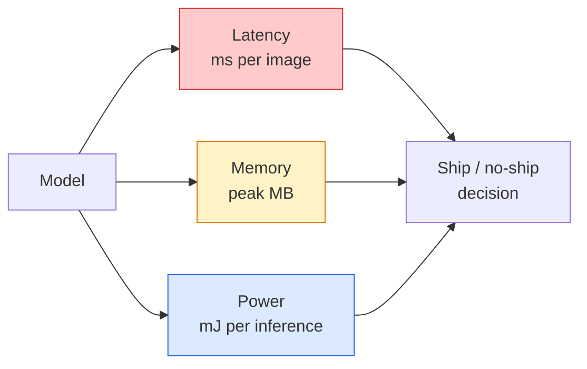

# 实时视觉——边缘部署

> Edge inference 是一门把 90 accuracy 的模型放到只有 2 GB RAM 的设备上、还能跑到 30 fps 的学问。每一个百分点的 accuracy，都要拿 milliseconds of latency 来交换。

**类型:** Learn + Build
**语言:** Python
**先修:** Phase 4 Lesson 04 (Image Classification), Phase 10 Lesson 11 (Quantization)
**时间:** ~75 minutes

## 学习目标

- 测量任意 PyTorch model 的 inference latency、peak memory 和 throughput，并读懂 FLOPs / params / latency 之间的 trade-off
- 使用 PyTorch 的 post-training quantisation 将 vision model 量化到 INT8，并验证 accuracy loss < 1%
- 导出到 ONNX，并用 ONNX Runtime 或 TensorRT 编译；说出三种最常见 export failures 及其修复方式
- 解释在某个 edge constraint 下什么时候选择 MobileNetV3、EfficientNet-Lite、ConvNeXt-Tiny 或 MobileViT

## 要解决的问题

训练时的 vision model 是一个 floating-point monster。100M parameters，每次 forward pass 10 GFLOPs，2 GB VRAM。这些都塞不进手机、车载 infotainment unit、工业相机或无人机。交付一个 vision system，意味着要把同样的 predictions 放进小 100 倍的预算里。

主要靠三个旋钮完成：model choice（用相同 recipe 选择更小 architecture）、quantisation（用 INT8 而不是 FP32）和 inference runtime（ONNX Runtime、TensorRT、Core ML、TFLite）。把它们调对，决定了你得到的是只能在 workstation 上跑的 demo，还是能装进 $30 camera module 的产品。

本课先建立测量纪律（不能测量就不能优化），然后走过这三个旋钮。目标不是学会每个 edge runtime，而是知道有哪些 lever，以及如何验证每个 lever 确实做了你以为它做的事。

## 核心概念

### 三个预算



- **Latency**: p50、p95、p99。只平均 p50 会隐藏实时系统中很重要的 tail behaviour。
- **Peak memory**: 设备曾经看到的最大值，不是 steady-state average。对 embedded targets 很关键，因为 OOM 是致命的。
- **Power / energy**: battery-powered device 上每次 inference 的 millijoules。通常用 CPU/GPU utilisation * time 近似。

edge decision 依赖的是一张 (model, latency, memory, accuracy) 表。每个 cell 都必须在 target device 上测量，而不是在 workstation 上。

### 测量纪律

每次 edge profile 都应遵守三条规则：

1. **Warm up**：测量前用 5-10 次 dummy forward passes 预热模型。Cold caches 和 JIT compilation 会产生不具代表性的第一批数字。
2. **Synchronise**：在 timed block 前后用 `torch.cuda.synchronize()` 同步 GPU workloads。否则你测到的是 kernel dispatch，而不是 kernel execution。
3. **Fix input sizes**：固定为 production resolution。224x224 的 latency 不是 512x512 的 latency。

### FLOPs 作为 proxy

FLOPs（每次 inference 的 floating-point operations）是廉价、device-independent 的 latency proxy。它适合做 architecture comparison，但作为绝对 wall-clock 指标会误导。一个 FLOPs 多 10% 的模型在实践中可能快 2 倍，因为它使用 hardware-friendly ops（depthwise convs 编译得好，大 7x7 convs 不一定）。

规则：architecture search 用 FLOPs，deployment decisions 用 on-device latency。

### 一段话解释 Quantisation

用 INT8 替换 FP32 weights 和 activations。Model size 降 4 倍，memory bandwidth 降 4 倍；在有 INT8 kernels 的硬件上（每个现代 mobile SoC、每块带 Tensor Cores 的 NVIDIA GPU），compute 降 2-4 倍。vision tasks 上，post-training static quantisation 通常只损失 0.1-1 个百分点 accuracy。

类型：

- **Dynamic**——将 weights 量化为 INT8，activations 仍以 FP 计算。简单，小幅加速。
- **Static (post-training)**——量化 weights，并在一个小 calibration set 上校准 activation ranges。比 dynamic 快得多。
- **Quantisation-aware training (QAT)**——训练期间模拟 quantisation，让模型适应它。accuracy 最好，需要 labelled data。

对 vision 来说，post-training static quantisation 用 5% 的 effort 给你 95% 的 benefit。只有当 PTQ accuracy loss 不可接受时才用 QAT。

### Pruning and distillation

- **Pruning**——移除不重要 weights（magnitude-based）或 channels（structured）。对 overparameterised models 效果好；对已经 compact 的 architectures 用处较小。
- **Distillation**——训练一个小 student 来模仿大 teacher 的 logits。通常能恢复缩小模型损失的大部分 accuracy。production edge models 的标准做法。

### Inference runtimes

- **PyTorch eager**——慢，不用于部署。只用于开发。
- **TorchScript**——legacy。已被 `torch.compile` 和 ONNX export 取代。
- **ONNX Runtime**——中立 runtime。CPU、CUDA、CoreML、TensorRT、OpenVINO 都有 ONNX providers。从这里开始。
- **TensorRT**——NVIDIA 的 compiler。在 NVIDIA GPUs（workstation 和 Jetson）上 latency 最好。可与 ONNX Runtime 集成，也可独立使用。
- **Core ML**——Apple 面向 iOS/macOS 的 runtime。需要 `.mlmodel` 或 `.mlpackage`。
- **TFLite**——Google 面向 Android/ARM 的 runtime。需要 `.tflite`。
- **OpenVINO**——Intel 面向 CPU/VPU 的 runtime。需要 `.xml` + `.bin`。

实践中：export PyTorch -> ONNX -> 为目标选择 runtime。ONNX 是通用语。

### Edge architecture picker

| Budget | Model | Why |
|--------|-------|-----|
| < 3M params | MobileNetV3-Small | 到处都能编译，good baseline |
| 3-10M | EfficientNet-Lite-B0 | TFLite 上 best accuracy per param |
| 10-20M | ConvNeXt-Tiny | Best accuracy-per-param，CPU-friendly |
| 20-30M | MobileViT-S or EfficientViT | 带 ImageNet accuracy 的 Transformer |
| 30-80M | Swin-V2-Tiny | 如果 stack 支持 window attention |

除非有具体理由不这么做，否则把这些全部量化到 INT8。

## 动手实现

### Step 1: 正确测量 latency

```python
import time
import torch

def measure_latency(model, input_shape, device="cpu", warmup=10, iters=50):
    model = model.to(device).eval()
    x = torch.randn(input_shape, device=device)
    with torch.no_grad():
        for _ in range(warmup):
            model(x)
        if device == "cuda":
            torch.cuda.synchronize()
        times = []
        for _ in range(iters):
            if device == "cuda":
                torch.cuda.synchronize()
            t0 = time.perf_counter()
            model(x)
            if device == "cuda":
                torch.cuda.synchronize()
            times.append((time.perf_counter() - t0) * 1000)
    times.sort()
    return {
        "p50_ms": times[len(times) // 2],
        "p95_ms": times[int(len(times) * 0.95)],
        "p99_ms": times[int(len(times) * 0.99)],
        "mean_ms": sum(times) / len(times),
    }
```

Warm up，synchronise，使用 `time.perf_counter()`。报告 percentiles，而不只是 mean。

### Step 2: Parameter and FLOP counts

```python
def parameter_count(model):
    return sum(p.numel() for p in model.parameters())

def flops_estimate(model, input_shape):
    """
    Rough FLOP count for a conv/linear-only model. For production use `fvcore` or `ptflops`.
    """
    total = 0
    def conv_hook(m, inp, out):
        nonlocal total
        c_out, c_in, kh, kw = m.weight.shape
        h, w = out.shape[-2:]
        total += 2 * c_in * c_out * kh * kw * h * w
    def linear_hook(m, inp, out):
        nonlocal total
        total += 2 * m.in_features * m.out_features
    hooks = []
    for m in model.modules():
        if isinstance(m, torch.nn.Conv2d):
            hooks.append(m.register_forward_hook(conv_hook))
        elif isinstance(m, torch.nn.Linear):
            hooks.append(m.register_forward_hook(linear_hook))
    model.eval()
    with torch.no_grad():
        model(torch.randn(input_shape))
    for h in hooks:
        h.remove()
    return total
```

真实项目中使用 `fvcore.nn.FlopCountAnalysis` 或 `ptflops`；它们能正确处理每种 module type。

### Step 3: Post-training static quantisation

```python
def quantise_ptq(model, calibration_loader, backend="x86"):
    import torch.ao.quantization as tq
    model = model.eval().cpu()
    model.qconfig = tq.get_default_qconfig(backend)
    tq.prepare(model, inplace=True)
    with torch.no_grad():
        for x, _ in calibration_loader:
            model(x)
    tq.convert(model, inplace=True)
    return model
```

三个步骤：configure、prepare（插入 observers）、用真实数据 calibrate、convert（fuse + quantise）。要求 model 已经 fused（`Conv -> BN -> ReLU` -> `ConvBnReLU`），这由 `torch.ao.quantization.fuse_modules` 处理。

### Step 4: Export to ONNX

```python
def export_onnx(model, sample_input, path="model.onnx"):
    model = model.eval()
    torch.onnx.export(
        model,
        sample_input,
        path,
        input_names=["input"],
        output_names=["output"],
        dynamic_axes={"input": {0: "batch"}, "output": {0: "batch"}},
        opset_version=17,
    )
    return path
```

`opset_version=17` 是 2026 年的安全默认值。`dynamic_axes` 让你可以用任意 batch size 运行 ONNX model。

### Step 5: Benchmark and compare regimes

```python
import torch.nn as nn
from torchvision.models import mobilenet_v3_small

def compare_regimes():
    model = mobilenet_v3_small(weights=None, num_classes=10)
    params = parameter_count(model)
    flops = flops_estimate(model, (1, 3, 224, 224))
    lat_fp32 = measure_latency(model, (1, 3, 224, 224), device="cpu")
    print(f"FP32 MobileNetV3-Small: {params:,} params  {flops/1e9:.2f} GFLOPs  "
          f"p50={lat_fp32['p50_ms']:.2f}ms  p95={lat_fp32['p95_ms']:.2f}ms")
```

对 `resnet50`、`efficientnet_v2_s` 和 `convnext_tiny` 运行同一个函数，你就有了部署决策所需的 comparison table。

## 实际使用

Production stacks 通常收敛到三条路径之一：

- **Web / serverless**: PyTorch -> ONNX -> ONNX Runtime（CPU 或 CUDA provider）。最简单，对大多数场景足够好。
- **NVIDIA edge（Jetson、GPU server）**: PyTorch -> ONNX -> TensorRT。latency 最好，engineering effort 最大。
- **Mobile**: PyTorch -> ONNX -> Core ML（iOS）或 TFLite（Android）。export 前先 quantise。

测量方面，`torch-tb-profiler`、`nvprof` / `nsys`，以及 macOS 上的 Instruments 能给出逐层 breakdown。`benchmark_app`（OpenVINO）和 `trtexec`（TensorRT）能给出 standalone CLI numbers。

## 交付成果

本课产出：

- `outputs/prompt-edge-deployment-planner.md`——一个 prompt，根据 target device 和 latency SLA 选择 backbone、quantisation strategy 和 runtime。
- `outputs/skill-latency-profiler.md`——一个 skill，会写出完整的 latency-benchmarking script，包含 warmup、synchronisation、percentiles 和 memory tracking。

## 练习

1. **(Easy)** 在 CPU 上测量 224x224 下 `resnet18`、`mobilenet_v3_small`、`efficientnet_v2_s` 和 `convnext_tiny` 的 p50 latency。报告表格，并指出哪种 architecture 有最佳 accuracy-per-ms。
2. **(Medium)** 对 `mobilenet_v3_small` 应用 post-training static quantisation。报告 FP32 vs INT8 latency，以及在 CIFAR-10 或类似 held-out subset 上的 accuracy loss。
3. **(Hard)** 将 `convnext_tiny` 导出为 ONNX，通过带 `CPUExecutionProvider` 的 `onnxruntime` 运行，并将 latency 与 PyTorch eager baseline 对比。识别 ONNX Runtime 变快的第一层，并解释原因。

## 关键术语

| Term | What people say | What it actually means |
|------|----------------|----------------------|
| Latency | “有多快” | 从 input 到 output 的时间；p50/p95/p99 percentiles，而不是 mean |
| FLOPs | “Model size” | 每次 forward pass 的 floating-point ops；compute cost 的粗略 proxy |
| INT8 quantisation | “8-bit” | 用 8-bit integers 替换 FP32 weights/activations；约 4x 更小、2-4x 更快 |
| PTQ | “Post-training quantisation” | 不重新训练就量化 trained model；简单，通常足够 |
| QAT | “Quantisation-aware training” | 训练期间模拟 quantisation；accuracy 最好，需要 labelled data |
| ONNX | “中立格式” | 每个主流 inference runtime 都支持的 model exchange format |
| TensorRT | “NVIDIA compiler” | 将 ONNX 编译成面向 NVIDIA GPUs 的 optimized engine |
| Distillation | “Teacher -> student” | 训练小模型模仿大模型 logits；恢复大部分损失的 accuracy |

## 延伸阅读

- [EfficientNet (Tan & Le, 2019)](https://arxiv.org/abs/1905.11946)——高效 architectures 的 compound scaling
- [MobileNetV3 (Howard et al., 2019)](https://arxiv.org/abs/1905.02244)——带 h-swish 和 squeeze-excite 的 mobile-first architecture
- [A Practical Guide to TensorRT Optimization (NVIDIA)](https://developer.nvidia.com/blog/accelerating-model-inference-with-tensorrt-tips-and-best-practices-for-pytorch-users/)——如何真正拿到论文里的 throughput numbers
- [ONNX Runtime docs](https://onnxruntime.ai/docs/)——quantisation、graph optimisation、provider selection
