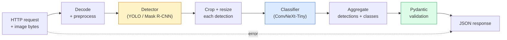

# 构建完整视觉管线——Capstone

> 一个 production vision system 是由 models 和 rules 构成的链条，并用 data contracts 缝在一起。这一 phase 里的零件已经齐全；capstone 会把它们端到端接起来。

**类型:** Build
**语言:** Python
**先修:** Phase 4 Lessons 01-15
**时间:** ~120 minutes

## 学习目标

- 设计一个 production vision pipeline：检测对象、分类对象，并输出 structured JSON——同时处理每条 failure path
- 将 detector（Mask R-CNN 或 YOLO）、classifier（ConvNeXt-Tiny）和 data contract（Pydantic）接入同一个 service
- Benchmark 端到端 pipeline，并识别第一个 bottleneck（通常先是 preprocessing，然后是 detector）
- 交付一个 minimal FastAPI service，接收 image upload、运行 pipeline，并返回带 classifications 的 detections

## 要解决的问题

单个 vision model 很有用；vision products 是由它们组成的链。retail shelf audit 是 detector 加 product classifier 加 price-OCR pipeline。autonomous driving 是 2D detector 加 3D detector 加 segmenter 加 tracker 加 planner。medical pre-screen 是 segmenter 加 region classifier 加 clinician UI。

把这些链接起来，正是 ML prototype 与 product 的分界。models 之间的每个 interface 都是新的 bug 位置。每一次 coordinate transform、每一次 normalisation、每一次 mask resize 都可能是 silent-failure candidate。pipeline 的强度取决于最弱的 interface。

这个 capstone 建立最小可行 pipeline：detection + classification + structured output + serving layer。Phase 4 中的其他所有内容都能插进这个骨架：把 Mask R-CNN 换成 YOLOv8，添加 OCR head，添加 segmentation branch，添加 tracker。architecture 是稳定的；pieces 是可插拔的。

## 核心概念

### 管线



七个阶段。两个 model stages 很昂贵；另外五个 stages 是 bugs 的藏身处。

### 用 Pydantic 做 Data contracts

每个 model boundary 都变成 typed object。这会把 silent failures 变成 loud failures。

```text
Detection(
    box: tuple[float, float, float, float],   # (x1, y1, x2, y2), absolute pixels
    score: float,                              # [0, 1]
    class_id: int,                             # from detector's label map
    mask: Optional[list[list[int]]],           # RLE-encoded if present
)

PipelineResult(
    image_id: str,
    detections: list[Detection],
    classifications: list[Classification],
    inference_ms: float,
)
```

当 detector 返回 `(cx, cy, w, h)` 而不是 `(x1, y1, x2, y2)` boxes 时，Pydantic 的 validation 会在 boundary 处失败，你会立刻发现问题，而不是去调试一个 downstream crop 为什么静默返回 empty regions。

### Latency 去了哪里

几乎每个 vision pipeline 都符合三条事实：

1. **Preprocessing 往往是最大的单个 block。** 解码 JPEGs、转换 colour spaces、resizing——这些都是 CPU-bound，而且容易被忽略。
2. **Detector 主导 GPU time。** 70-90% 的 GPU time 在 detection forward pass 中。
3. **Postprocessing（NMS、RLE encode/decode）在 GPU 上便宜，在 CPU 上贵。** 一定要用真实 target 做 profile。

知道分布，optimization 才会变成有优先级的列表。

### 失效模式

- **Empty detections**——返回 empty list，不要 crash。记录日志。
- **Out-of-bounds boxes**——crop 前 clamp 到 image size。
- **Tiny crops**——对小于 classifier minimum input 的 boxes 跳过 classification。
- **Corrupt upload**——返回带具体 error code 的 400 response，而不是 500。
- **Model load failure**——在 service startup 失败，而不是第一个 request 到来时失败。

Production pipeline 会处理每一种情况，而不是写一个 generic `try/except` 把 failure 藏起来。每个 failure 都有一个 named code 和 response。

### Batching

Production service 会服务多个 clients。跨 requests 对 detections 和 classifications 做 batching 会成倍提高 throughput。trade-off 是为了等待 batch 填满会增加 latency。典型设置：最多收集 requests 20ms，batch together，process，再分发 responses。`torchserve` 和 `triton` 原生支持；负载可预测的小 services 可以自己写 micro-batcher。

## 动手实现

### Step 1: Data contracts

```python
from pydantic import BaseModel, Field
from typing import List, Optional, Tuple

class Detection(BaseModel):
    box: Tuple[float, float, float, float]
    score: float = Field(ge=0, le=1)
    class_id: int = Field(ge=0)
    mask_rle: Optional[str] = None


class Classification(BaseModel):
    detection_index: int
    class_id: int
    class_name: str
    score: float = Field(ge=0, le=1)


class PipelineResult(BaseModel):
    image_id: str
    detections: List[Detection]
    classifications: List[Classification]
    inference_ms: float
```

五秒钟代码，可以在任何 serious pipeline 上节省一小时调试。

### Step 2: Minimal Pipeline class

```python
import time
import numpy as np
import torch
from PIL import Image

class VisionPipeline:
    def __init__(self, detector, classifier, class_names,
                 device="cpu", min_crop=32):
        self.detector = detector.to(device).eval()
        self.classifier = classifier.to(device).eval()
        self.class_names = class_names
        self.device = device
        self.min_crop = min_crop

    def preprocess(self, image):
        """
        image: PIL.Image or np.ndarray (H, W, 3) uint8
        returns: CHW float tensor on device
        """
        if isinstance(image, Image.Image):
            image = np.asarray(image.convert("RGB"))
        tensor = torch.from_numpy(image).permute(2, 0, 1).float() / 255.0
        return tensor.to(self.device)

    @torch.no_grad()
    def detect(self, image_tensor):
        return self.detector([image_tensor])[0]

    @torch.no_grad()
    def classify(self, crops):
        if len(crops) == 0:
            return []
        batch = torch.stack(crops).to(self.device)
        logits = self.classifier(batch)
        probs = logits.softmax(-1)
        scores, cls = probs.max(-1)
        return list(zip(cls.tolist(), scores.tolist()))

    def run(self, image, image_id="anonymous"):
        t0 = time.perf_counter()
        tensor = self.preprocess(image)
        det = self.detect(tensor)

        crops = []
        detections = []
        valid_indices = []
        for i, (box, score, cls) in enumerate(zip(det["boxes"], det["scores"], det["labels"])):
            x1, y1, x2, y2 = [max(0, int(b)) for b in box.tolist()]
            x2 = min(x2, tensor.shape[-1])
            y2 = min(y2, tensor.shape[-2])
            detections.append(Detection(
                box=(x1, y1, x2, y2),
                score=float(score),
                class_id=int(cls),
            ))
            if (x2 - x1) < self.min_crop or (y2 - y1) < self.min_crop:
                continue
            crop = tensor[:, y1:y2, x1:x2]
            crop = torch.nn.functional.interpolate(
                crop.unsqueeze(0),
                size=(224, 224),
                mode="bilinear",
                align_corners=False,
            )[0]
            crops.append(crop)
            valid_indices.append(i)

        class_preds = self.classify(crops)

        classifications = []
        for valid_idx, (cls_id, cls_score) in zip(valid_indices, class_preds):
            classifications.append(Classification(
                detection_index=valid_idx,
                class_id=int(cls_id),
                class_name=self.class_names[cls_id],
                score=float(cls_score),
            ))

        return PipelineResult(
            image_id=image_id,
            detections=detections,
            classifications=classifications,
            inference_ms=(time.perf_counter() - t0) * 1000,
        )
```

每个 interface 都是 typed。每条 failure path 都有具体处理决定。

### Step 3: 接入 detector 和 classifier

```python
from torchvision.models.detection import maskrcnn_resnet50_fpn_v2
from torchvision.models import convnext_tiny

# Use ImageNet-pretrained weights for a realistic pipeline without training
detector = maskrcnn_resnet50_fpn_v2(weights="DEFAULT")
classifier = convnext_tiny(weights="DEFAULT")
class_names = [f"imagenet_class_{i}" for i in range(1000)]

pipe = VisionPipeline(detector, classifier, class_names)

# Smoke test with a synthetic image
test_image = (np.random.rand(400, 600, 3) * 255).astype(np.uint8)
result = pipe.run(test_image, image_id="demo")
print(result.model_dump_json(indent=2)[:500])
```

### Step 4: FastAPI service

```python
from fastapi import FastAPI, UploadFile, HTTPException
from io import BytesIO

app = FastAPI()
pipe = None  # initialised on startup

@app.on_event("startup")
def load():
    global pipe
    detector = maskrcnn_resnet50_fpn_v2(weights="DEFAULT").eval()
    classifier = convnext_tiny(weights="DEFAULT").eval()
    pipe = VisionPipeline(detector, classifier, class_names=[f"c{i}" for i in range(1000)])

@app.post("/detect")
async def detect_endpoint(file: UploadFile):
    if file.content_type not in {"image/jpeg", "image/png", "image/webp"}:
        raise HTTPException(status_code=400, detail="unsupported image type")
    data = await file.read()
    try:
        img = Image.open(BytesIO(data)).convert("RGB")
    except Exception:
        raise HTTPException(status_code=400, detail="cannot decode image")
    result = pipe.run(img, image_id=file.filename or "upload")
    return result.model_dump()
```

用 `uvicorn main:app --host 0.0.0.0 --port 8000` 运行。用 `curl -F 'file=@dog.jpg' http://localhost:8000/detect` 测试。

### Step 5: Benchmark pipeline

```python
import time

def benchmark(pipe, num_runs=20, image_size=(400, 600)):
    img = (np.random.rand(*image_size, 3) * 255).astype(np.uint8)
    pipe.run(img)  # warm up

    stages = {"preprocess": [], "detect": [], "classify": [], "total": []}
    for _ in range(num_runs):
        t0 = time.perf_counter()
        tensor = pipe.preprocess(img)
        t1 = time.perf_counter()
        det = pipe.detect(tensor)
        t2 = time.perf_counter()
        crops = []
        for box in det["boxes"]:
            x1, y1, x2, y2 = [max(0, int(b)) for b in box.tolist()]
            x2 = min(x2, tensor.shape[-1])
            y2 = min(y2, tensor.shape[-2])
            if (x2 - x1) >= pipe.min_crop and (y2 - y1) >= pipe.min_crop:
                crop = tensor[:, y1:y2, x1:x2]
                crop = torch.nn.functional.interpolate(
                    crop.unsqueeze(0), size=(224, 224), mode="bilinear", align_corners=False
                )[0]
                crops.append(crop)
        pipe.classify(crops)
        t3 = time.perf_counter()
        stages["preprocess"].append((t1 - t0) * 1000)
        stages["detect"].append((t2 - t1) * 1000)
        stages["classify"].append((t3 - t2) * 1000)
        stages["total"].append((t3 - t0) * 1000)

    for stage, times in stages.items():
        times.sort()
        print(f"{stage:12s}  p50={times[len(times)//2]:7.1f} ms  p95={times[int(len(times)*0.95)]:7.1f} ms")
```

CPU 上典型输出：preprocess ~3 ms，detect 300-500 ms，classify 20-40 ms，total 350-550 ms。在 GPU 上，detect 是 20-40 ms，preprocess + classify 在相对占比上开始变得更重要。

## 实际使用

Production templates 会收敛到相同结构，再加上：

- **Model versioning**——始终在 response 中记录 model name 和 weights hash。
- **Per-request trace IDs**——为每个 request 记录每个 stage timing，这样能将 slow responses 与 stages 对齐。
- **Fallback path**——如果 classifier timeout，返回没有 classifications 的 detections，而不是让整个 request 失败。
- **Safety filters**——NSFW / PII filters 在 classification 后、response 离开 service 前运行。
- **Batch endpoint**——一个 `/detect_batch`，接收 image URLs 列表用于 bulk processing。

Production serving 中，`torchserve`、`Triton Inference Server` 和 `BentoML` 开箱支持 batching、versioning、metrics 和 health checks。直接运行 `FastAPI` 适合 prototypes 和 small-scale products。

## 交付成果

本课产出：

- `outputs/prompt-vision-service-shape-reviewer.md`——一个 prompt，用于 review vision service code 中的 contract/response shape violations，并指出第一个 breaking bug。
- `outputs/skill-pipeline-budget-planner.md`——一个 skill，在给定 target latency 和 throughput 时，为每个 pipeline stage 分配 time budget，并标记哪个 stage 会最先错过预算。

## 练习

1. **(Easy)** 在任意 open dataset 的 10 张 images 上运行 pipeline。报告每个 stage 的 average time，以及每张图 detection counts 的分布。
2. **(Medium)** 向 `Detection` 添加 mask output field，并将其编码为 RLE。验证即使是 10-object image，JSON 仍低于 1MB。
3. **(Hard)** 在 classifier 前添加 micro-batcher：收集 crops 最多 10 ms，一次 GPU call 分类全部 crops，并按 request 返回结果。在每秒 5 个 concurrent requests 下测量 throughput gain 和增加的 latency。

## 关键术语

| Term | What people say | What it actually means |
|------|----------------|----------------------|
| Pipeline | “系统” | 由 preprocessing、inference 和 postprocessing steps 组成的有序链，每一对之间都有 typed interface |
| Data contract | “schema” | 每个 stage input 和 output 都符合的 Pydantic / dataclass definitions；在 boundary 处捕获 integration bugs |
| Preprocessing | “模型之前” | Decoding、colour conversion、resizing、normalising；通常是最大的 CPU time sink |
| Postprocessing | “模型之后” | NMS、mask resize、threshold、RLE encode；GPU 上便宜，CPU 上昂贵 |
| Microbatcher | “收集后 forward” | 等待固定窗口收集多个 requests，然后运行单次 batched forward pass 的 aggregator |
| Trace ID | “Request id” | 在每个 stage 记录的 per-request identifier，用于端到端追踪慢请求 |
| Failure code | “Named error” | 每个 failure class 的具体 error code，而不是 generic 500；支持 client retry logic |
| Health check | “Readiness probe” | 报告 service 是否能应答的廉价 endpoint；loadbalancers 依赖它 |

## 延伸阅读

- [Full Stack Deep Learning — Deploying Models](https://fullstackdeeplearning.com/course/2022/lecture-5-deployment/)——production ML deployment 的经典概览
- [BentoML docs](https://docs.bentoml.com)——带 batching、versioning 和 metrics 的 serving framework
- [torchserve docs](https://pytorch.org/serve/)——PyTorch 官方 serving library
- [NVIDIA Triton Inference Server](https://developer.nvidia.com/triton-inference-server)——带 batching 和 multi-model support 的 high-throughput serving
