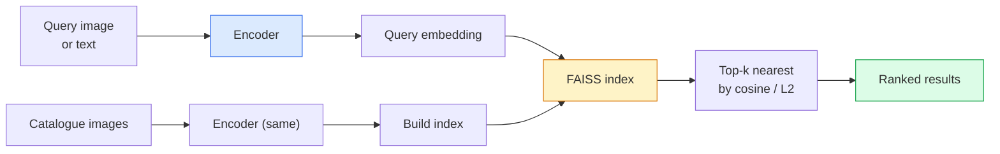

# 图像检索与 Metric Learning

> retrieval system 通过 embedding space 中的距离来排序 candidates。Metric learning 是塑造这个空间的学问，让距离表达你想表达的东西。

**类型:** Build
**语言:** Python
**先修:** Phase 4 Lesson 14 (ViT), Phase 4 Lesson 18 (CLIP)
**时间:** ~45 minutes

## 学习目标

- 解释 triplet、contrastive 和 proxy-based metric learning losses，并为给定 dataset 选择合适方法
- 正确实现 L2-normalisation 和 cosine similarity，并审计 “same item” 与 “same class” retrieval 的差异
- 构建 FAISS index，用 text 和 image 查询，并为 held-out query set 报告 recall@K
- 将 DINOv2、CLIP 和 SigLIP 作为 off-the-shelf embedding backbones 使用，并知道各自何时胜出

## 要解决的问题

Retrieval 在 production vision 中无处不在：duplicate detection、reverse image search、visual search（“find similar products”）、face re-identification、surveillance 中的 person re-ID、e-commerce 的 instance-level matching。产品问题总是一样的：“给定这张 query image，排序我的 catalogue。”

两个设计决策塑造整个系统。embedding——哪个 model 产生 vectors。index——如何在规模化场景中寻找 nearest neighbours。到 2026 年二者都已商品化（embedding 用 DINOv2，index 用 FAISS），因此门槛变高：困难部分是定义你的应用中*什么算 similar*，然后塑造 embedding space，让 distances 匹配这个定义。

这种塑造就是 metric learning。它是一个小但高杠杆的学科。

## 核心概念

### Retrieval 概览



### 四类 loss families

| Loss | Requires | Pros | Cons |
|------|----------|------|------|
| **Contrastive** | (anchor, positive) + negatives | 简单，适用于任何 pair label | 没有大量 negatives 时收敛慢 |
| **Triplet** | (anchor, positive, negative) | 直观；可直接控制 margin | Hard-triplet mining 昂贵 |
| **NT-Xent / InfoNCE** | Pairs + batch-mined negatives | 可扩展到 large batches | 需要 big batch 或 momentum queue |
| **Proxy-based (ProxyNCA)** | Class labels only | 快、稳定、无需 mining | small datasets 上可能 overfit proxies |

多数 production use cases 中，先从 pretrained backbone 开始；只有当 off-the-shelf embeddings 在你的 test set 上表现不足时，才添加 metric-learning fine-tune。

### Triplet loss formally

```text
L = max(0, ||f(a) - f(p)||^2 - ||f(a) - f(n)||^2 + margin)
```

将 anchor `a` 拉近 positive `p`，推远 negative `n`，并用 `margin` 确保间隔。three-image structure 可以泛化到任何 similarity ordering。

Mining 很重要：easy triplets（`n` 已经离 `a` 很远）贡献零 loss；只有 hard triplets 会教会网络。Semi-hard mining（`n` 比 `p` 更远但仍在 margin 内）是 2016 FaceNet recipe，至今仍占主导。

### Cosine similarity vs L2

两种 metrics，两种惯例：

- **Cosine**：vectors 之间的 angle。需要 L2-normalised embeddings。
- **L2**：Euclidean distance。可作用于 raw 或 normalised embeddings，但通常配合 L2-normalised + squared L2 使用。

对多数现代 nets 来说二者等价：当 `||a|| = ||b|| = 1` 时，`||a - b||^2 = 2 - 2 cos(a, b)`。选择与你的 embedding training 匹配的 convention；混用会静默改变 “nearest” 的含义。

### Recall@K

标准 retrieval metric：

```text
recall@K = fraction of queries where at least one correct match is in the top K results
```

并排报告 recall@1、@5、@10。recall@10 高于 0.95 而 recall@1 低于 0.5，意味着 embedding space 的结构是对的，但 ranking 有噪声——尝试更长 fine-tunes 或 re-ranking step。

对 duplicate detection，precision@K 更重要，因为每个 false positive 都是 user-visible mistake。对 visual search，recall@K 是产品信号。

### 一段话解释 FAISS

Facebook AI Similarity Search。nearest-neighbour search 的事实标准 library。三种 index choices：

- `IndexFlatIP` / `IndexFlatL2`——brute force、exact、无需 training。用到约 1M vectors。
- `IndexIVFFlat`——划分为 K 个 cells，只搜索最接近的几个 cells。Approximate、快速、需要 training data。
- `IndexHNSW`——graph-based，many queries 下最快，index size 大。

100k vectors 你大概想用 cosine similarity 上的 `IndexFlatIP`。10M 用 `IndexIVFFlat`。100M+ 结合 product quantisation（`IndexIVFPQ`）。

### Instance-level vs category-level retrieval

同名但完全不同的两个问题：

- **Category-level**——“在我的 catalogue 里找 cats。”Class-conditional similarity；off-the-shelf CLIP / DINOv2 embeddings 表现很好。
- **Instance-level**——“在我的 catalogue 中找到*这个 exact product*。”需要在同一 class 的 visually similar objects 之间做 fine-grained discrimination；off-the-shelf embeddings 表现不足；用 metric learning fine-tuning 很重要。

选择 model 前，永远先问自己在解决哪一个。

## 动手实现

### Step 1: Triplet loss

```python
import torch
import torch.nn.functional as F

def triplet_loss(anchor, positive, negative, margin=0.2):
    d_ap = F.pairwise_distance(anchor, positive, p=2)
    d_an = F.pairwise_distance(anchor, negative, p=2)
    return F.relu(d_ap - d_an + margin).mean()
```

一行。适用于 L2-normalised 或 raw embeddings。

### Step 2: Semi-hard mining

给定一批 embeddings 和 labels，为每个 anchor 找到 hardest semi-hard negative。

```python
def semi_hard_negatives(emb, labels, margin=0.2):
    dist = torch.cdist(emb, emb)
    same_class = labels[:, None] == labels[None, :]
    diff_class = ~same_class
    N = emb.size(0)

    positives = dist.clone()
    positives[~same_class] = float("-inf")
    positives.fill_diagonal_(float("-inf"))
    pos_idx = positives.argmax(dim=1)

    semi_hard = dist.clone()
    semi_hard[same_class] = float("inf")
    d_ap = dist[torch.arange(N), pos_idx].unsqueeze(1)
    semi_hard[dist <= d_ap] = float("inf")
    neg_idx = semi_hard.argmin(dim=1)

    fallback_mask = semi_hard[torch.arange(N), neg_idx] == float("inf")
    if fallback_mask.any():
        hardest = dist.clone()
        hardest[same_class] = float("inf")
        neg_idx = torch.where(fallback_mask, hardest.argmin(dim=1), neg_idx)
    return pos_idx, neg_idx
```

每个 anchor 得到 in-class 的 hardest positive，以及一个比 positive 更远但仍在 margin 内的 semi-hard negative。

### Step 3: Recall@K

```python
def recall_at_k(query_emb, gallery_emb, query_labels, gallery_labels, k=1):
    sim = query_emb @ gallery_emb.T
    _, top_k = sim.topk(k, dim=-1)
    matches = (gallery_labels[top_k] == query_labels[:, None]).any(dim=-1)
    return matches.float().mean().item()
```

在 L2-normalised embeddings 上按 inner product 取 top-k，等价于按 cosine 取 top-k。报告 queries 中至少有一个 correct neighbour 出现在结果里的平均比例。

### Step 4: Putting it together

```python
import torch
import torch.nn as nn
from torch.optim import Adam

class Encoder(nn.Module):
    def __init__(self, in_dim=128, emb_dim=64):
        super().__init__()
        self.net = nn.Sequential(
            nn.Linear(in_dim, 128), nn.ReLU(),
            nn.Linear(128, emb_dim),
        )

    def forward(self, x):
        return F.normalize(self.net(x), dim=-1)

torch.manual_seed(0)
num_classes = 6
protos = F.normalize(torch.randn(num_classes, 128), dim=-1)

def sample_batch(bs=32):
    labels = torch.randint(0, num_classes, (bs,))
    x = protos[labels] + 0.15 * torch.randn(bs, 128)
    return x, labels

enc = Encoder()
opt = Adam(enc.parameters(), lr=3e-3)

for step in range(200):
    x, y = sample_batch(32)
    emb = enc(x)
    pos_idx, neg_idx = semi_hard_negatives(emb, y)
    loss = triplet_loss(emb, emb[pos_idx], emb[neg_idx])
    opt.zero_grad(); loss.backward(); opt.step()
```

几百步后，embedding clusters 会形成每个 class 一个 cluster。

## 实际使用

2026 年 production stacks：

- **DINOv2 + FAISS**——general-purpose visual retrieval。开箱可用。
- **CLIP + FAISS**——queries 是 text 时使用。
- **Fine-tuned DINOv2 + FAISS**——instance-level retrieval、face re-ID、fashion、e-commerce。
- **Milvus / Weaviate / Qdrant**——围绕 FAISS 或 HNSW 的 managed vector DB wrappers。

SOTA instance retrieval 的 recipe：DINOv2 backbone，添加 embedding head，在 instance-labelled pairs 上用 triplet 或 InfoNCE loss fine-tune，索引到 FAISS。

## 交付成果

本课产出：

- `outputs/prompt-retrieval-loss-picker.md`——一个 prompt，为给定 retrieval problem 选择 triplet / InfoNCE / ProxyNCA。
- `outputs/skill-recall-at-k-runner.md`——一个 skill，编写干净的 recall@K evaluation harness，包含 train/val/gallery splits 和 proper data contract。

## 练习

1. **(Easy)** 运行上面的 toy example。用 PCA 绘制训练前后的 embeddings，观察六个 clusters 形成。
2. **(Medium)** 添加 ProxyNCA loss implementation：每个 class 一个 learned "proxy"，在 cosine similarity 上做标准 cross-entropy。和 toy data 上的 triplet loss 比较 convergence speed。
3. **(Hard)** 取 1,000 张 ImageNet validation images，通过 HuggingFace 用 DINOv2 embed，构建 FAISS flat index，并用相同 images 作为 queries 报告 recall@{1, 5, 10}（应为 1.0），再以 ImageNet labels 为 ground truth 在 held-out split 上报告。

## 关键术语

| Term | What people say | What it actually means |
|------|----------------|----------------------|
| Metric learning | “Shape the space” | 训练 encoder，让 output space 中的 distances 反映目标 similarity |
| Triplet loss | “Pull and push” | L = max(0, d(a, p) - d(a, n) + margin)；经典 metric-learning loss |
| Semi-hard mining | “Useful negatives” | 比 positive 离 anchor 更远但仍在 margin 内的 negatives；经验上信息量最大 |
| Proxy-based loss | “Class prototypes” | 每个 class 一个 learned proxy；对 similarity-to-proxies 做 cross-entropy；无需 pair mining |
| Recall@K | “Top-K hit rate” | top K 中至少有一个 correct result 的 queries 比例 |
| Instance retrieval | “Find this exact thing” | 细粒度 matching；off-the-shelf features 通常表现不足 |
| FAISS | “NN library” | Facebook 的 nearest-neighbour library；支持 exact 和 approximate indexes |
| HNSW | “Graph index” | Hierarchical navigable small world；带小 memory overhead 的快速 approximate NN |

## 延伸阅读

- [FaceNet: A Unified Embedding for Face Recognition (Schroff et al., 2015)](https://arxiv.org/abs/1503.03832)——triplet loss / semi-hard mining 论文
- [In Defense of the Triplet Loss for Person Re-Identification (Hermans et al., 2017)](https://arxiv.org/abs/1703.07737)——triplet fine-tuning 实用指南
- [FAISS documentation](https://github.com/facebookresearch/faiss/wiki)——每种 index、每种 trade-off
- [SMoT: Metric Learning Taxonomy (Kim et al., 2021)](https://arxiv.org/abs/2010.06927)——modern losses 及其联系的 survey
