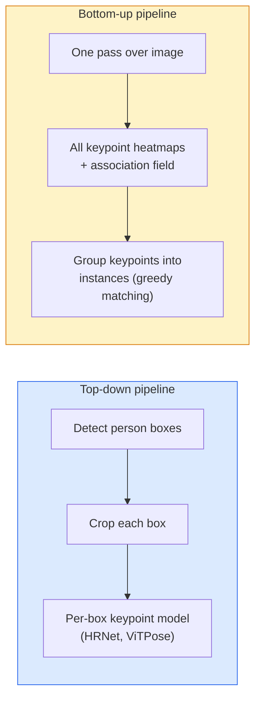

# Keypoint Detection 与 Pose Estimation

> pose 是一组有序 keypoints。keypoint detector 是一个 heatmap regressor。其他一切都是 bookkeeping。

**类型:** Build
**语言:** Python
**先修:** Phase 4 Lesson 06 (Detection), Phase 4 Lesson 07 (U-Net)
**时间:** ~45 minutes

## 学习目标

- 区分 top-down 和 bottom-up pose estimation，并说明何时使用每一种
- 用 Gaussian-per-keypoint target 回归 K 个 keypoints 的 heatmaps，并在 inference 时提取 keypoint coordinates
- 解释 Part Affinity Fields（PAFs），以及 bottom-up pipelines 如何将 keypoints 关联成 instances
- 使用 MediaPipe Pose 或 MMPose 做 production keypoint estimation，并理解它们的 output format

## 要解决的问题

Keypoint tasks 藏在很多名字下面：human pose（17 body joints）、face landmarks（68 或 478 points）、hand（21 points）、animal pose、robotic object pose、medical anatomy landmarks。它们共享同一个结构：在对象上检测 K 个离散点，并输出它们的 (x, y) coordinates。

Pose estimation 是 motion capture、fitness apps、sports analytics、gesture control、animation、AR try-on 和 robotic grasping 的基础。2D case 已经成熟；3D pose（从单个 camera 估计 world coordinates 中的 joint positions）是当前研究前沿。

工程问题是 scale。single-image、single-person pose 是一个 20ms 问题。30 fps 下 crowd 中的 multi-person pose 是另一个问题，需要不同 architectures。

## 核心概念

### Top-down vs bottom-up



- **Top-down**——先 detect people，然后在每个 crop 上运行 per-person keypoint model。accuracy 最高；随 people 数量线性扩展。
- **Bottom-up**——一次 forward pass 预测所有 keypoints 加 association field；再将它们 group。无论 crowd size 多大，耗时近似恒定。

Top-down（HRNet、ViTPose）是 accuracy leader；bottom-up（OpenPose、HigherHRNet）是 crowded scenes 的 throughput leader。

### Heatmap regression

不要直接回归 `(x, y)`，而是为每个 keypoint 预测一个 `H x W` heatmap，其中 true location 处是 Gaussian blob。

```text
target[k, y, x] = exp(-((x - cx_k)^2 + (y - cy_k)^2) / (2 sigma^2))
```

inference 时，每个 heatmap 的 argmax 就是 predicted keypoint location。

为什么 heatmaps 比 direct regression 更好：network 的 spatial structure（conv feature map）天然对齐 spatial output。Gaussian targets 也起 regularise 作用——小 localization error 产生小 loss，而不是零/一式惩罚。

### Sub-pixel localisation

Argmax 给出 integer coordinates。要达到 sub-pixel precision，可以对 argmax 及其 neighbours 拟合 parabola，或者使用著名的 offset `(dx, dy) = 0.25 * (heatmap[y, x+1] - heatmap[y, x-1], ...)` direction。

### Part Affinity Fields（PAFs）

OpenPose 用于 bottom-up association 的技巧。对每对连接 keypoints（例如 left shoulder 到 left elbow），预测一个 2-channel field，编码从一个点指向另一个点的 unit vector。要将 shoulder 与 elbow 关联起来，就沿着候选 pair 之间的 line 积分 PAF；integral 最高的 pair 被匹配。

```text
For each connection (limb):
  PAF channels: 2 (unit vector x, y)
  Line integral: sum over sample points of (PAF . line_direction)
  Higher integral = stronger match
```

优雅，而且不需要 per-person crops 就能扩展到任意 crowd sizes。

### COCO keypoints

标准 body-pose dataset：每人 17 keypoints，用 PCK（Percentage of Correct Keypoints）和 OKS（Object Keypoint Similarity）作为 metrics。OKS 是 keypoint 版 IoU，也是 COCO mAP@OKS 报告的指标。

### 2D vs 3D

- **2D pose**——image coordinates；已经达到 production quality（MediaPipe、HRNet、ViTPose）。
- **3D pose**——world / camera coordinates；仍是活跃研究。常见方法：
  - 用小 MLP 将 2D predictions lift 到 3D（VideoPose3D）。
  - 从 image 直接做 3D regression（PyMAF、MHFormer）。
  - 用 multi-view setups（CMU Panoptic）获得 ground truth。

## 动手实现

### Step 1: Gaussian heatmap target

```python
import numpy as np
import torch

def gaussian_heatmap(size, cx, cy, sigma=2.0):
    yy, xx = np.meshgrid(np.arange(size), np.arange(size), indexing="ij")
    return np.exp(-((xx - cx) ** 2 + (yy - cy) ** 2) / (2 * sigma ** 2)).astype(np.float32)

hm = gaussian_heatmap(64, 32, 32, sigma=2.0)
print(f"peak: {hm.max():.3f} at ({hm.argmax() % 64}, {hm.argmax() // 64})")
```

沿 channel axis 堆叠 per-keypoint heatmaps，就得到完整 target tensor。

### Step 2: Tiny keypoint head

一个 U-Net-style model，输出 K 个 heatmap channels。

```python
import torch.nn as nn
import torch.nn.functional as F

class TinyKeypointNet(nn.Module):
    def __init__(self, num_keypoints=4, base=16):
        super().__init__()
        self.down1 = nn.Sequential(nn.Conv2d(3, base, 3, 2, 1), nn.ReLU(inplace=True))
        self.down2 = nn.Sequential(nn.Conv2d(base, base * 2, 3, 2, 1), nn.ReLU(inplace=True))
        self.mid = nn.Sequential(nn.Conv2d(base * 2, base * 2, 3, 1, 1), nn.ReLU(inplace=True))
        self.up1 = nn.ConvTranspose2d(base * 2, base, 2, 2)
        self.up2 = nn.ConvTranspose2d(base, num_keypoints, 2, 2)

    def forward(self, x):
        h1 = self.down1(x)
        h2 = self.down2(h1)
        h3 = self.mid(h2)
        u1 = self.up1(h3)
        return self.up2(u1)
```

输入 `(N, 3, H, W)`，输出 `(N, K, H, W)`。Loss 是对 Gaussian targets 的 per-pixel MSE。

### Step 3: Inference——提取 keypoint coordinates

```python
def heatmap_to_coords(heatmaps):
    """
    heatmaps: (N, K, H, W)
    returns:  (N, K, 2) float coordinates in image pixels
    """
    N, K, H, W = heatmaps.shape
    hm = heatmaps.reshape(N, K, -1)
    idx = hm.argmax(dim=-1)
    ys = (idx // W).float()
    xs = (idx % W).float()
    return torch.stack([xs, ys], dim=-1)

coords = heatmap_to_coords(torch.randn(2, 4, 32, 32))
print(f"coords: {coords.shape}")  # (2, 4, 2)
```

inference 时一行完成。sub-pixel refinement 则在 argmax 附近做 interpolate。

### Step 4: Synthetic keypoint dataset

简单做法：在白色 canvas 上画四个点，并学习预测它们。

```python
def make_synthetic_sample(size=64):
    img = np.ones((3, size, size), dtype=np.float32)
    rng = np.random.default_rng()
    kps = rng.integers(8, size - 8, size=(4, 2))
    for cx, cy in kps:
        img[:, cy - 2:cy + 2, cx - 2:cx + 2] = 0.0
    hms = np.stack([gaussian_heatmap(size, cx, cy) for cx, cy in kps])
    return img, hms, kps
```

这个任务足够简单，tiny model 一分钟内就能学会。

### Step 5: Training

```python
model = TinyKeypointNet(num_keypoints=4)
opt = torch.optim.Adam(model.parameters(), lr=3e-3)

for step in range(200):
    batch = [make_synthetic_sample() for _ in range(16)]
    imgs = torch.from_numpy(np.stack([b[0] for b in batch]))
    hms = torch.from_numpy(np.stack([b[1] for b in batch]))
    pred = model(imgs)
    # Upsample pred to full resolution
    pred = F.interpolate(pred, size=hms.shape[-2:], mode="bilinear", align_corners=False)
    loss = F.mse_loss(pred, hms)
    opt.zero_grad(); loss.backward(); opt.step()
```

## 实际使用

- **MediaPipe Pose**——Google 的 production pose estimator；提供 WebGL + mobile runtimes，latency 低于 10ms。
- **MMPose**（OpenMMLab）——全面 research codebase；每种 SOTA architecture 都有 pretrained weights。
- **YOLOv8-pose**——单次 forward pass 的最快 real-time multi-person pose。
- **transformers HumanDPT / PoseAnything**——较新的 vision-language approaches，用于 open-vocabulary pose（any object、any keypoint set）。

## 交付成果

本课产出：

- `outputs/prompt-pose-stack-picker.md`——一个 prompt，根据 latency、crowd size、2D vs 3D need 选择 MediaPipe / YOLOv8-pose / HRNet / ViTPose。
- `outputs/skill-heatmap-to-coords.md`——一个 skill，编写每个 production pose model 都使用的 sub-pixel heatmap-to-coordinate routine。

## 练习

1. **(Easy)** 在 synthetic 4-point dataset 上训练 tiny keypoint model。报告 200 steps 后 predicted 与 true keypoints 之间的 mean L2 error。
2. **(Medium)** 添加 sub-pixel refinement：给定 argmax position，从 neighbouring pixels 沿 x 和 y 拟合 1D parabola。报告相对 integer argmax 的 accuracy gain。
3. **(Hard)** 构建一个 2-person synthetic dataset，每张 image 显示两个 4-keypoint pattern instances。训练一个带 PAFs 的 bottom-up pipeline，预测哪个 keypoint 属于哪个 instance，并评估 OKS。

## 关键术语

| Term | What people say | What it actually means |
|------|----------------|----------------------|
| Keypoint | “landmark” | 对象上的某个特定有序点（joint、corner、feature） |
| Pose | “skeleton” | 属于同一个 instance 的有序 keypoints 集合 |
| Top-down | “Detect then pose” | 两阶段 pipeline：person detector + per-crop keypoint model；accuracy 最高 |
| Bottom-up | “Pose first, group later” | 单次 all-keypoint prediction + grouping；耗时与 crowd size 近似无关 |
| Heatmap | “Gaussian target” | 每个 keypoint 一个 H x W tensor，在 true location 处有峰值；首选 regression target |
| PAF | “Part Affinity Field” | 编码 limb directions 的 2-channel unit vector field；用于将 keypoints group 成 instances |
| OKS | “Keypoint IoU” | Object Keypoint Similarity；COCO pose metric |
| HRNet | “High-Resolution Net” | 主导 top-down keypoint architecture；全程保留 high-res features |

## 延伸阅读

- [OpenPose (Cao et al., 2017)](https://arxiv.org/abs/1812.08008)——使用 PAFs 的 bottom-up 方法；至今仍是该 approach 的最佳说明
- [HRNet (Sun et al., 2019)](https://arxiv.org/abs/1902.09212)——top-down reference architecture
- [ViTPose (Xu et al., 2022)](https://arxiv.org/abs/2204.12484)——plain ViT as a pose backbone；许多 benchmarks 上的当前 SOTA
- [MediaPipe Pose](https://developers.google.com/mediapipe/solutions/vision/pose_landmarker)——production real-time pose；2026 年部署最快的 stack
