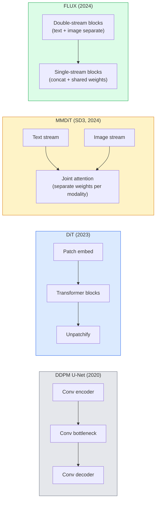

# Diffusion Transformers 与 Rectified Flow

> U-Net 并不是 diffusion 的秘密。把它换成 transformer，把 noise schedule 换成直线路径 flow，你就突然拥有了 SD3、FLUX，以及每个 2026 年的 text-to-image model。

**类型:** Learn + Build
**语言:** Python
**先修:** Phase 4 Lesson 10 (Diffusion DDPM), Phase 4 Lesson 14 (ViT), Phase 7 Lesson 02 (Self-Attention)
**时间:** ~75 minutes

## 学习目标

- 追踪从 U-Net DDPM（Lesson 10）到 Diffusion Transformer（DiT）、MMDiT（SD3）以及 single+double-stream DiT（FLUX）的演化
- 解释 rectified flow：为什么 noise 与 data 之间的 straight-line trajectory 能让模型用 20 steps 而不是 1000 steps 完成 sampling
- 实现一个 tiny DiT block 和一个 rectified-flow training loop，两者都控制在 100 行以内
- 按 architecture、parameter count 和 licensing 区分 model variants（SD3、FLUX.1-dev、FLUX.1-schnell、Z-Image、Qwen-Image）

## 要解决的问题

Lesson 10 用 U-Net denoiser 构建了一个 DDPM。这个 recipe 主导了 2020-2023：U-Net + beta schedule + noise-prediction loss。它产生了 Stable Diffusion 1.5、2.1 和 DALL-E 2。

每个 2026 年 state-of-the-art text-to-image model 都已经越过了它。Stable Diffusion 3、FLUX、SD4、Z-Image、Qwen-Image、Hunyuan-Image：没有一个使用 U-Net。它们使用 Diffusion Transformers（DiT）。SD3 和 FLUX 还把 DDPM noise schedule 换成 rectified flow，后者拉直从 noise 到 data 的路径，并通过 consistency 或 distilled variants 实现 1-4 step inference。

这个转变很重要，因为它就是 diffusion-based image generation 变得可控、prompt-accurate（SD3/SD4 解决了 text rendering）并且 production-fast 的原因。理解 DiT + rectified flow，就是理解 2026 年 generative-image stack。

## 核心概念

### 从 U-Net 到 transformer



- **DiT**（Peebles & Xie, 2023）：用一个类似 ViT 的 transformer 作用在 latent patches 上，替代 U-Net。通过 adaptive layer norm（AdaLN）做 conditioning。
- **MMDiT**（SD3, Esser et al., 2024）：text tokens 和 image tokens 使用带独立 weights 的双 streams，并共享一个 joint attention。
- **FLUX**（Black Forest Labs, 2024）：前 N 个 blocks 像 SD3 一样采用 double-stream，后面的 blocks concat 并共享 weights（single-stream），以便在更深网络中提升效率。
- **Z-Image**（2025）：一个 6B parameters 的高效 single-stream DiT，挑战 “不惜一切代价 scale” 的路线。

### 用一段话理解 rectified flow

DDPM 把 forward process 定义成一个 noisy SDE，其中 `x_t` 被逐渐破坏。学到的 reverse 是第二个 SDE，需要用 1000 个小 steps 求解。

Rectified flow 在 clean data 和 pure noise 之间定义一条 **straight-line** interpolation：

```text
x_t = (1 - t) * x_0 + t * epsilon,     t in [0, 1]
```

训练一个网络来预测 velocity `v_theta(x_t, t) = epsilon - x_0`，也就是从 clean data 到 noise 的 straight-line path 上的 forward direction（`dx_t/dt`）。Sampling 时，你反向积分这个 velocity，从 noise 逐步走向 data。得到的 ODE 更接近直线，因此 sample 所需的 integration steps 少得多。

SD3 把这称为 **Rectified Flow Matching**。FLUX、Z-Image 和大多数 2026 models 使用同一个 objective。典型 inference：20-30 Euler steps（deterministic），而旧 DDPM regime 需要 50+ DDIM steps。Distilled / turbo / schnell / LCM variants 会把它进一步降到 1-4 steps。

### AdaLN conditioning

DiTs 通过 **adaptive layer norm** 在 timestep 和 class/text 上做 conditioning：从 conditioning vector 预测 `scale` 和 `shift`，并在 LayerNorm 之后应用它们。这比 U-Nets 中的 FiLM-style modulation 更干净，也是每个现代 DiT 的默认做法。

```text
cond -> MLP -> (scale, shift, gate)
norm(x) * (1 + scale) + shift, then residual add * gate
```

### SD3 与 FLUX 中的 text encoders

- **SD3** 使用三个 text encoders：两个 CLIP models + T5-XXL。Embeddings 会被 concatenated，并作为 text conditioning 输入 image stream。
- **FLUX** 使用一个 CLIP-L + T5-XXL。
- **Qwen-Image / Z-Image** variants 使用它们自己的 in-house text encoders，并与其 base LLMs 对齐。

Text encoder 是 SD3/FLUX 比 SD1.5 更善于理解 prompts 的重要原因。单独一个 T5-XXL 就有 4.7B params。

### Classifier-free guidance 仍然成立

Rectified flow 改变 sampler，而不是 conditioning。Classifier-free guidance（训练时以 10% 概率 drop text，inference 时混合 conditional 与 unconditional predictions）在 rectified flow 中完全相同。大多数 2026 models 使用 guidance scale 3.5-5，低于 SD1.5 的 7.5，因为 rectified-flow models 默认更紧密地遵循 prompts。

### Consistency、Turbo、Schnell、LCM

四个名字指向同一个思想：把一个慢速 many-step model distil 成快速 few-step model。

- **LCM (Latent Consistency Model)**：训练一个 student，让它能从任何 intermediate `x_t` 一步预测最终 `x_0`。
- **SDXL Turbo / FLUX schnell**：用 adversarial diffusion distillation 训练出的 1-4 step models。
- **SD Turbo**：OpenAI-style Consistency Models 对 latent diffusion 的适配。

任何新模型的 production serving 都会同时发布一个 "full quality" checkpoint 和一个 "turbo / schnell" variant。Schnell（德语中的 "fast"，Black Forest Labs 的命名惯例）以 1-4 steps 运行，适合 real-time pipelines。

### 2026 年模型格局

| Model | Size | Architecture | License |
|-------|------|--------------|---------|
| Stable Diffusion 3 Medium | 2B | MMDiT | SAI Community |
| Stable Diffusion 3.5 Large | 8B | MMDiT | SAI Community |
| FLUX.1-dev | 12B | Double + Single Stream DiT | non-commercial |
| FLUX.1-schnell | 12B | same, distilled | Apache 2.0 |
| FLUX.2 | — | iterated FLUX.1 | mixed |
| Z-Image | 6B | S3-DiT (Scalable Single-Stream) | permissive |
| Qwen-Image | ~20B | DiT + Qwen text tower | Apache 2.0 |
| Hunyuan-Image-3.0 | ~80B | DiT | research |
| SD4 Turbo | 3B | DiT + distillation | SAI Commercial |

FLUX.1-schnell 是 2026 年 open-source default。Z-Image 是 efficiency leader。FLUX.2 和 SD4 是当前的 quality tips。

### 为什么这次 phase shift 很重要

DDPM + U-Net 能用。DiT + rectified flow **更好、更快，而且 scale 得更干净**。这次转变类似 NLP 中从 RNNs 到 transformers 的转变：两种 architectures 解决的是同一个问题，但 transformers scale 得更好，并最终占据主导。每篇 2026 年关于 image、video 或 3D generation 的论文都使用 DiT-shaped denoiser，并且通常使用 rectified flow objective。U-Net DDPM 现在主要是 pedagogical（Lesson 10）。

## 动手实现

### Step 1: 带 AdaLN 的 DiT block

```python
import torch
import torch.nn as nn


class AdaLNZero(nn.Module):
    """
    Adaptive LayerNorm with a gate. Predicts (scale, shift, gate) from the conditioning.
    Init such that the whole block starts as identity ("zero init").
    """

    def __init__(self, dim, cond_dim):
        super().__init__()
        self.norm = nn.LayerNorm(dim, elementwise_affine=False)
        self.mlp = nn.Linear(cond_dim, dim * 3)
        nn.init.zeros_(self.mlp.weight)
        nn.init.zeros_(self.mlp.bias)

    def forward(self, x, cond):
        scale, shift, gate = self.mlp(cond).chunk(3, dim=-1)
        h = self.norm(x) * (1 + scale.unsqueeze(1)) + shift.unsqueeze(1)
        return h, gate.unsqueeze(1)


class DiTBlock(nn.Module):
    def __init__(self, dim=192, heads=3, mlp_ratio=4, cond_dim=192):
        super().__init__()
        self.adaln1 = AdaLNZero(dim, cond_dim)
        self.attn = nn.MultiheadAttention(dim, heads, batch_first=True)
        self.adaln2 = AdaLNZero(dim, cond_dim)
        self.mlp = nn.Sequential(
            nn.Linear(dim, dim * mlp_ratio),
            nn.GELU(),
            nn.Linear(dim * mlp_ratio, dim),
        )

    def forward(self, x, cond):
        h, gate1 = self.adaln1(x, cond)
        a, _ = self.attn(h, h, h, need_weights=False)
        x = x + gate1 * a
        h, gate2 = self.adaln2(x, cond)
        x = x + gate2 * self.mlp(h)
        return x
```

`AdaLNZero` 一开始是 identity mapping，因为它的 MLP weights 初始化为 zero。训练会轻推 block 离开 identity；这会显著稳定 deep transformer diffusion models。

### Step 2: 一个 tiny DiT

```python
def timestep_embedding(t, dim):
    import math
    half = dim // 2
    freqs = torch.exp(-math.log(10000) * torch.arange(half, device=t.device) / half)
    args = t[:, None].float() * freqs[None]
    return torch.cat([args.sin(), args.cos()], dim=-1)


class TinyDiT(nn.Module):
    def __init__(self, image_size=16, patch_size=2, in_channels=3, dim=96, depth=4, heads=3):
        super().__init__()
        self.patch_size = patch_size
        self.num_patches = (image_size // patch_size) ** 2
        self.patch = nn.Conv2d(in_channels, dim, kernel_size=patch_size, stride=patch_size)
        self.pos = nn.Parameter(torch.zeros(1, self.num_patches, dim))
        self.time_mlp = nn.Sequential(
            nn.Linear(dim, dim * 2),
            nn.SiLU(),
            nn.Linear(dim * 2, dim),
        )
        self.blocks = nn.ModuleList([DiTBlock(dim, heads, cond_dim=dim) for _ in range(depth)])
        self.norm_out = nn.LayerNorm(dim, elementwise_affine=False)
        self.head = nn.Linear(dim, patch_size * patch_size * in_channels)

    def forward(self, x, t):
        n = x.size(0)
        x = self.patch(x)
        x = x.flatten(2).transpose(1, 2) + self.pos
        t_emb = self.time_mlp(timestep_embedding(t, self.pos.size(-1)))
        for blk in self.blocks:
            x = blk(x, t_emb)
        x = self.norm_out(x)
        x = self.head(x)
        return self._unpatchify(x, n)

    def _unpatchify(self, x, n):
        p = self.patch_size
        h = w = int(self.num_patches ** 0.5)
        x = x.view(n, h, w, p, p, -1).permute(0, 5, 1, 3, 2, 4).reshape(n, -1, h * p, w * p)
        return x
```

### Step 3: Rectified flow training

```python
import torch.nn.functional as F

def rectified_flow_train_step(model, x0, optimizer, device):
    model.train()
    x0 = x0.to(device)
    n = x0.size(0)
    t = torch.rand(n, device=device)
    epsilon = torch.randn_like(x0)
    x_t = (1 - t[:, None, None, None]) * x0 + t[:, None, None, None] * epsilon

    target_velocity = epsilon - x0
    pred_velocity = model(x_t, t)

    loss = F.mse_loss(pred_velocity, target_velocity)
    optimizer.zero_grad()
    loss.backward()
    optimizer.step()
    return loss.item()
```

与 DDPM 的 noise-prediction loss（Lesson 10）相比：结构相同，target 不同。我们不是预测 noise `epsilon`，而是预测 **velocity** `epsilon - x_0`，它沿着 straight-line interpolation 从 data 指向 noise。

### Step 4: Euler sampler

Rectified flow 是一个 ODE。Euler's method 最简单；对训练良好的 rectified-flow model 来说，在 20+ steps 时几乎和 higher-order solvers 一样准确。

```python
@torch.no_grad()
def rectified_flow_sample(model, shape, steps=20, device="cpu"):
    model.eval()
    x = torch.randn(shape, device=device)
    dt = 1.0 / steps
    t = torch.ones(shape[0], device=device)
    for _ in range(steps):
        v = model(x, t)
        x = x - dt * v
        t = t - dt
    return x
```

20 steps。在训练好的模型上，这会产生可比于 1000-step DDPM 的 samples。

### Step 5: End-to-end smoke test

```python
import numpy as np

def synthetic_blobs(num=200, size=16, seed=0):
    rng = np.random.default_rng(seed)
    out = np.zeros((num, 3, size, size), dtype=np.float32)
    yy, xx = np.meshgrid(np.arange(size), np.arange(size), indexing="ij")
    for i in range(num):
        cx, cy = rng.uniform(4, size - 4, size=2)
        r = rng.uniform(2, 4)
        mask = (xx - cx) ** 2 + (yy - cy) ** 2 < r ** 2
        colour = rng.uniform(-1, 1, size=3)
        for c in range(3):
            out[i, c][mask] = colour[c]
    return torch.from_numpy(out)
```

用 rectified flow 在这个数据上训练一个 `TinyDiT`。500 steps 后，sampled outputs 应该看起来像淡淡的彩色 blobs。

## 实际使用

真实 image generation 中使用 FLUX / SD3 / Z-Image 时，`diffusers` 以统一 API 发布了所有模型：

```python
from diffusers import FluxPipeline, StableDiffusion3Pipeline
import torch

pipe = FluxPipeline.from_pretrained(
    "black-forest-labs/FLUX.1-schnell",
    torch_dtype=torch.bfloat16,
).to("cuda")

out = pipe(
    prompt="a golden retriever surfing a tsunami, hyperrealistic, studio lighting",
    guidance_scale=0.0,           # schnell was trained without CFG
    num_inference_steps=4,
    max_sequence_length=256,
).images[0]
out.save("surf.png")
```

三行。`FLUX.1-schnell` 四步出图。把 model id 换成 `black-forest-labs/FLUX.1-dev`，就能用 20-30 steps 和 CFG 获得更高质量。

对 SD3：

```python
pipe = StableDiffusion3Pipeline.from_pretrained(
    "stabilityai/stable-diffusion-3.5-large",
    torch_dtype=torch.bfloat16,
).to("cuda")
out = pipe(prompt, guidance_scale=3.5, num_inference_steps=28).images[0]
```

## 交付成果

本课产出：

- `outputs/prompt-dit-model-picker.md`：在给定 quality、latency 和 license constraints 时，在 SD3、FLUX.1-dev、FLUX.1-schnell、Z-Image、SD4 Turbo 之间做选择。
- `outputs/skill-rectified-flow-trainer.md`：为带 AdaLN DiT 和 Euler sampling 的 rectified flow 写出完整 training loop。

## 练习

1. **(Easy)** 在 synthetic blob dataset 上训练上面的 TinyDiT 500 steps。比较用 10、20 和 50 Euler steps 生成的 samples。
2. **(Medium)** 加入 text conditioning：把 learned class embedding concat 到 time embedding（按颜色分 10 个 blob "classes"）。用 class 0、5、9 采样，并验证颜色匹配。
3. **(Hard)** 对在相同数据、相同 step 数上训练的同尺寸网络，计算 rectified-flow 版本和 DDPM 版本生成 samples 之间的 Fréchet distance（FID proxy）。报告哪一个收敛更快。

## 关键术语

| Term | 人们常说 | 实际含义 |
|------|----------------|----------------------|
| DiT | "Diffusion transformer" | 替代 U-Net 作为 diffusion denoiser 的 Transformer；运行在 patchified latents 上 |
| AdaLN | "Adaptive layer norm" | 通过 learned scale、shift、gate 做 timestep/text conditioning，并在 LayerNorm 后应用；每个现代 DiT 的标准做法 |
| MMDiT | "Multi-modal DiT (SD3)" | Text tokens 和 image tokens 使用独立 weight streams，并共享一个 joint self-attention |
| Single-stream / double-stream | "FLUX trick" | 前 N 个 blocks 使用 double-stream（每个 modality 独立 weights），后续 blocks 使用 single-stream（concat + shared weights）提升效率 |
| Rectified flow | "Straight-line noise-to-data" | Data 与 noise 之间的 linear interpolation；网络预测 velocity；inference 所需 ODE steps 更少 |
| Velocity target | "epsilon - x_0" | Rectified flow 中的 regression target；从 clean data 指向 noise |
| CFG guidance | "classifier-free guidance" | 混合 conditional 与 unconditional predictions；仍用于 rectified-flow models |
| Schnell / turbo / LCM | "1-4 step distillation" | 从 full-quality models distill 出来的 small-step variants；用于 production real-time |

## 延伸阅读

- [Scalable Diffusion Models with Transformers (Peebles & Xie, 2023)](https://arxiv.org/abs/2212.09748)：DiT paper
- [Scaling Rectified Flow Transformers (Esser et al., SD3 paper)](https://arxiv.org/abs/2403.03206)：MMDiT 和 scale 级别的 rectified-flow
- [FLUX.1 model card and technical report (Black Forest Labs)](https://huggingface.co/black-forest-labs/FLUX.1-dev)：double + single-stream details
- [Z-Image: Efficient Image Generation Foundation Model (2025)](https://arxiv.org/html/2511.22699v1)：6B single-stream DiT
- [Elucidating the Design Space of Diffusion (Karras et al., 2022)](https://arxiv.org/abs/2206.00364)：每个 diffusion design trade-off 的 reference
- [Latent Consistency Models (Luo et al., 2023)](https://arxiv.org/abs/2310.04378)：LCM-LoRA 如何带来 4-step inference
