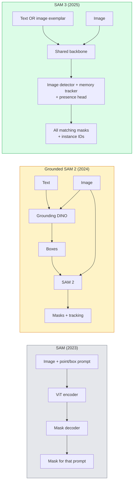

# SAM 3 与 Open-Vocabulary Segmentation

> 给模型一个 text prompt 和一张 image，就能得到每个匹配对象的 masks。SAM 3 把这件事做成了一次 forward pass。

**类型:** Use + Build
**语言:** Python
**先修:** Phase 4 Lesson 07 (U-Net), Phase 4 Lesson 08 (Mask R-CNN), Phase 4 Lesson 18 (CLIP)
**时间:** ~60 minutes

## 学习目标

- 区分 SAM（只支持 visual prompts）、Grounded SAM / SAM 2（detector + SAM）和 SAM 3（通过 Promptable Concept Segmentation 原生支持 text prompts）
- 解释 SAM 3 architecture：shared backbone + image detector + memory-based video tracker + presence head + decoupled detector-tracker design
- 使用 Hugging Face `transformers` 的 SAM 3 integration 进行 text-prompted detection、segmentation 和 video tracking
- 根据 latency、concept complexity 和 deployment target，在 SAM 3、Grounded SAM 2、YOLO-World 和 SAM-MI 之间做选择

## 要解决的问题

2023 年的 SAM 是一个只支持 visual prompt 的模型：你点击一个点或画一个 box，它返回一个 mask。对于“给我这张照片里所有橙子”这种请求，你需要一个 detector（Grounding DINO）先产生 boxes，然后用 SAM 分割每一个 box。Grounded SAM 把它变成了一条 pipeline，但本质上仍是两个 frozen models 的 cascade，不可避免会累积错误。

SAM 3（Meta，Nov 2025，ICLR 2026）把这个 cascade 压成了一个模型。它接受一个短 noun phrase 或 image exemplar 作为 prompt，并在一次 forward pass 中返回所有匹配的 masks 和 instance IDs。这就是 **Promptable Concept Segmentation (PCS)**。结合 2026 年 3 月的 Object Multiplex update（SAM 3.1），它可以高效地在视频中追踪同一 concept 的多个 instances。

本课关注的是这个结构性变化。2D seg、detection 和 text-image grounding 已经合并成一个模型。生产问题不再是“我要把哪些 pipeline 串起来”，而是“哪个 promptable model 能 end-to-end 处理我的 use case”。

## 核心概念

### 三代模型



### Promptable Concept Segmentation

"concept prompt" 是一个短 noun phrase（`"yellow school bus"`、`"striped red umbrella"`、`"hand holding a mug"`）或一个 image exemplar。模型会为图像中每个匹配该 concept 的 instance 返回 segmentation masks，并为每个匹配项分配一个 unique instance ID。

这与 classic visual-prompt SAM 有三点不同：

1. 不需要逐 instance prompt：一个 text prompt 会返回所有 matches。
2. Open-vocabulary：concept 可以是任何能用自然语言描述的东西。
3. 一次返回多个 instances，而不是每个 prompt 返回一个 mask。

### 关键 architecture 部件

- **Shared backbone**：一个单一 ViT 处理 image。Detector head 和 memory-based tracker 都读取它的特征。
- **Presence head**：预测 concept 是否真的出现在图像中。把“这里有没有？”和“它在哪里？”解耦。降低 absent concepts 上的 false positives。
- **Decoupled detector-tracker**：image-level detection 和 video-level tracking 使用独立 heads，避免互相干扰。
- **Memory bank**：跨 frames 存储 per-instance features，用于 video tracking（与 SAM 2 使用的机制相同）。

### 大规模训练

SAM 3 在 **4 million unique concepts** 上训练，这些 concepts 由一个 data engine 生成，该 engine 通过 AI + human review 反复标注和修正。新的 **SA-CO benchmark** 包含 270K unique concepts，比之前的 benchmarks 大 50x。SAM 3 在 SA-CO 上达到人类表现的 75-80%，并在 image + video PCS 上让现有系统表现翻倍。

### SAM 3.1 Object Multiplex

2026 年 3 月更新：**Object Multiplex** 引入 shared-memory 机制，用于一次联合追踪同一 concept 的许多 instances。以前，追踪 N 个 instances 意味着 N 个独立 memory banks。Multiplex 把它压缩成一个 shared memory，并使用 per-instance queries。结果：multi-object tracking 显著加速，同时不牺牲 accuracy。

### 2026 年 Grounded SAM 仍然有价值的场景

- 当你需要换入某个特定 open-vocabulary detector（DINO-X、Florence-2）。
- 当 SAM 3 license（HF gated）成为 blocker。
- 当你需要比 SAM 3 暴露出的 detector threshold 更细的控制。
- 用于 detector component 的 research / ablation work。

Modular pipelines 仍有位置。对大多数 production work 来说，SAM 3 是更简单的答案。

### YOLO-World vs SAM 3

- **YOLO-World**：只做 open-vocabulary detector（没有 masks）。Real-time。最适合需要 high fps boxes 的场景。
- **SAM 3**：完整 segmentation + tracking。更慢，但输出更丰富。

Production split：YOLO-World 用于快速 detection-only pipelines（robotics navigation、fast dashboards），SAM 3 用于任何需要 masks 或 tracking 的任务。

### SAM-MI efficiency

SAM-MI（2025-2026）解决 SAM 的 decoder bottleneck。关键思想：

- **Sparse point prompting**：使用少量精心选择的 points，而不是 dense prompts；decoder calls 减少 96%。
- **Shallow mask aggregation**：把粗糙的 mask predictions 合并成一个更清晰的 mask。
- **Decoupled mask injection**：decoder 接收 pre-computed mask features，而不是重新运行。

结果：在 open-vocabulary benchmarks 上比 Grounded-SAM 提速约 1.6x。

### 三类模型的 output format

它们都返回同一种通用结构（boxes + labels + scores + masks + IDs），这很有用：你的 downstream pipeline 不必根据运行的是哪个模型而分支。

## 动手实现

### Step 1: Prompt construction

构建一个 helper，把用户句子转成 SAM 3 concept prompts 列表。这是“用户输入的内容”与“模型消费的内容”相遇的边界。

```python
def split_concepts(sentence):
    """
    Heuristic splitter for multi-concept prompts.
    Returns list of short noun phrases.
    """
    for sep in [",", ";", "and", "or", "&"]:
        if sep in sentence:
            parts = [p.strip() for p in sentence.replace("and ", ",").split(",")]
            return [p for p in parts if p]
    return [sentence.strip()]

print(split_concepts("cats, dogs and balloons"))
```

SAM 3 每次 forward pass 接受一个 concept；对 multi-concept queries，循环或 batch 它们。

### Step 2: Post-processing helpers

把 SAM 3 的 raw outputs 转成符合我们 Phase 4 Lesson 16 pipeline contract 的干净 detections 列表。

```python
from dataclasses import dataclass
from typing import List

@dataclass
class ConceptDetection:
    concept: str
    instance_id: int
    box: tuple          # (x1, y1, x2, y2)
    score: float
    mask_rle: str       # run-length encoded


def rle_encode(binary_mask):
    flat = binary_mask.flatten().astype("uint8")
    runs = []
    prev, count = flat[0], 0
    for v in flat:
        if v == prev:
            count += 1
        else:
            runs.append((int(prev), count))
            prev, count = v, 1
    runs.append((int(prev), count))
    return ";".join(f"{v}x{c}" for v, c in runs)
```

即便有许多 high-resolution masks，RLE 也能让 response payloads 保持很小。同一格式可跨 SAM 2、SAM 3、Grounded SAM 2 使用。

### Step 3: 统一的 open-vocab segmentation interface

把你拥有的任何 backend（SAM 3、Grounded SAM 2、YOLO-World + SAM 2）包在同一个 method 后面。Backend 改变时，你的 downstream code 不需要变。

```python
from abc import ABC, abstractmethod
import numpy as np

class OpenVocabSeg(ABC):
    @abstractmethod
    def detect(self, image: np.ndarray, concept: str) -> List[ConceptDetection]:
        ...


class StubOpenVocabSeg(OpenVocabSeg):
    """
    Deterministic stub used for pipeline testing when real models are not loaded.
    """
    def detect(self, image, concept):
        h, w = image.shape[:2]
        return [
            ConceptDetection(
                concept=concept,
                instance_id=0,
                box=(w * 0.2, h * 0.3, w * 0.5, h * 0.8),
                score=0.89,
                mask_rle="0x100;1x50;0x200",
            ),
            ConceptDetection(
                concept=concept,
                instance_id=1,
                box=(w * 0.55, h * 0.25, w * 0.85, h * 0.75),
                score=0.74,
                mask_rle="0x80;1x40;0x220",
            ),
        ]
```

真实的 `SAM3OpenVocabSeg` subclass 会包装 `transformers.Sam3Model` 和 `Sam3Processor`。

### Step 4: Hugging Face SAM 3 usage (reference)

实际模型使用 `transformers` integration：

```python
from transformers import Sam3Processor, Sam3Model
import torch

processor = Sam3Processor.from_pretrained("facebook/sam3")
model = Sam3Model.from_pretrained("facebook/sam3").eval()

inputs = processor(images=pil_image, return_tensors="pt")
inputs = processor.set_text_prompt(inputs, "yellow school bus")

with torch.no_grad():
    outputs = model(**inputs)

masks = processor.post_process_masks(
    outputs.masks, inputs.original_sizes, inputs.reshaped_input_sizes
)
boxes = outputs.boxes
scores = outputs.scores
```

一个 prompt，一次调用返回所有 matches。

### Step 5: 衡量 Grounded SAM 2 免费给你的东西

一个诚实的 benchmark：当你在真实 pipeline 中用 SAM 3 替换 Grounded SAM 2，会发生什么？

- Latency：SAM 3 省掉了一次 forward pass（没有单独 detector），但模型本身更重；通常 net-neutral 或略微提速。
- Accuracy：SAM 3 在 rare 或 compositional concepts（"striped red umbrella"）上显著更好。在常见 single-word concepts 上类似。
- Flexibility：Grounded SAM 2 允许你更换 detectors（DINO-X、Florence-2、Grounding DINO 1.5）；SAM 3 是 monolithic。

结论：SAM 3 是 2026 年 open-vocab seg 的默认选择。Grounded SAM 2 在你需要 detector flexibility 或不同 license terms 时仍然正确。

## 实际使用

Production deployment patterns：

- **Real-time annotation**：SAM 3 + CVAT 的 label-as-text-prompt feature。Annotators 选择一个 label name；SAM 3 会预先标注每个 matching instance。随后 review and correct。
- **Video analytics**：SAM 3.1 Object Multiplex 用于 multi-object tracking；把 frames 输入 memory-based tracker。
- **Robotics**：SAM 3 用于 open-vocab manipulation（"pick up the red cup"）；作为 planning primitive 运行。
- **Medical imaging**：SAM 3 在 medical concepts 上 fine-tuned；需要在 HF 上申请访问。

Ultralytics 在其 Python package 中包装了 SAM 3：

```python
from ultralytics import SAM

model = SAM("sam3.pt")
results = model(image_path, prompts="yellow school bus")
```

与 YOLO 和 SAM 2 使用同一 interface。

## 交付成果

本课产出：

- `outputs/prompt-open-vocab-stack-picker.md`：一个 prompt，会根据 latency、concept complexity 和 licensing，在 SAM 3 / Grounded SAM 2 / YOLO-World / SAM-MI 之间做选择。
- `outputs/skill-concept-prompt-designer.md`：一个 skill，把 user utterances 转成格式良好的 SAM 3 concept prompts（splitting、disambiguation、fallbacks）。

## 练习

1. **(Easy)** 用你选择的 concept prompts 在 10 张 images 上运行 SAM 3。与同样 images 上的 SAM 2 + Grounding DINO 1.5 对比。报告每个模型漏掉了哪些 concepts。
2. **(Medium)** 在 SAM 3 上构建一个 "click-to-include / click-to-exclude" UI：text prompt 返回 candidate instances；用户点击保留哪些作为 positive。把最终 concept set 输出为 JSON。
3. **(Hard)** 在一个 custom concept set（例如 5 类 electronic components）上 fine-tune SAM 3，每类 20 张 labelled images。与同一 test set 上的 zero-shot SAM 3 对比；测量 mask IoU improvement。

## 关键术语

| Term | 人们常说 | 实际含义 |
|------|----------------|----------------------|
| Open-vocabulary segmentation | "Segment by text" | 为自然语言描述的 objects 产生 masks，而不是固定 label set |
| PCS | "Promptable Concept Segmentation" | SAM 3 的核心任务：给定 noun-phrase 或 image exemplar，segment 所有 matching instances |
| Concept prompt | "The text input" | 短 noun phrase 或 image exemplar；不是完整句子 |
| Presence head | "Is it here?" | SAM 3 模块，在 localisation 之前判断 concept 是否存在于图像中 |
| SA-CO | "SAM 3 benchmark" | 270K-concept open-vocabulary segmentation benchmark；比之前 open-vocab benchmarks 大 50x |
| Object Multiplex | "SAM 3.1 update" | Shared-memory multi-object tracking；快速联合追踪许多 instances |
| Grounded SAM 2 | "Modular pipeline" | Detector + SAM 2 cascade；当 detector swap 重要时仍然相关 |
| SAM-MI | "Efficient SAM variant" | Mask Injection，比 Grounded-SAM 提速 1.6x |

## 延伸阅读

- [SAM 3: Segment Anything with Concepts (arXiv 2511.16719)](https://arxiv.org/abs/2511.16719)
- [SAM 3.1 Object Multiplex (Meta AI, March 2026)](https://ai.meta.com/blog/segment-anything-model-3/)
- [SAM 3 model page on Hugging Face](https://huggingface.co/facebook/sam3)
- [Grounded SAM 2 tutorial (PyImageSearch)](https://pyimagesearch.com/2026/01/19/grounded-sam-2-from-open-set-detection-to-segmentation-and-tracking/)
- [Ultralytics SAM 3 docs](https://docs.ultralytics.com/models/sam-3/)
- [SAM3-I: Instruction-aware SAM (arXiv 2512.04585)](https://arxiv.org/abs/2512.04585)
